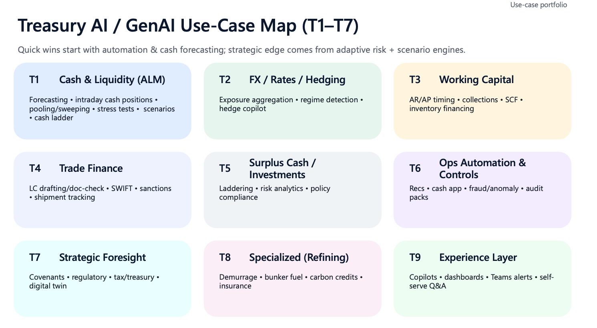

# Treasury AI for Oil & Gas

## The Future of Treasury is Intelligent

Treasury functions in the oil & gas industry sit at the intersection of extreme complexity and critical importance. Every day, treasury teams navigate volatile commodity markets, manage billions in liquidity across global operations, execute complex hedging strategies, and ensure compliance across dozens of jurisdictions—often using fragmented systems and manual processes that haven't fundamentally changed in decades.

**This is changing.**

Large Language Models (LLMs) and modern AI are unlocking capabilities that were previously impossible: natural language interfaces that query across disparate systems, intelligent agents that monitor risks 24/7, predictive models that forecast cash flows with unprecedented accuracy, and copilots that augment human expertise rather than replace it. The question is no longer *whether* AI will transform treasury—it's *how fast* and *how well* organizations can harness this potential.

### What You'll Find Here

This knowledge base is a comprehensive exploration of **AI-powered treasury capabilities** specifically designed for the downstream oil & gas sector. We've organized over **250 use cases** across **9 functional towers**, each representing a critical domain of treasury operations:

- **Towers T1-T8** cover the full spectrum of treasury functions—from cash management and FX hedging to trade finance, working capital, and strategic foresight
- **Tower T9** represents the "Experience Layer"—the AI copilots and intelligent interfaces that bring these capabilities to life

Each use case follows a consistent structure: **what it does**, **key inputs**, **AI/LLM approach**, **example interactions** (showing realistic AI-generated responses), **outputs**, and **KPIs**. This isn't theoretical—these are practical blueprints informed by real treasury challenges.

### Why These Use Cases Matter

We've deliberately chosen use cases that showcase where AI delivers transformational value:

- **Multi-horizon forecasting & scenario analysis** where ML captures patterns across cash flows, FX exposures, and market drivers (T1, T2, T7)
- **Complex document processing & compliance** where LLMs parse LC/BG documents, check UCP/ISBP rules, and automate trade finance workflows (T4, T6)
- **Working capital optimization** where predictive models forecast payment behavior, optimize DSO/DPO, and recommend collection strategies (T3)
- **Natural language interfaces** that democratize access to treasury data, policies, and insights through conversational copilots (T9)
- **Narrative generation** that transforms raw data into board-ready ALCO packs, variance explanations, and executive summaries (T7, T9)
- **Operational automation** where ML-powered reconciliation, close acceleration, and exception handling reduce manual effort (T6)

The examples throughout this documentation demonstrate the *art of the possible*—not distant future concepts, but capabilities achievable today with current AI technology.

!!! tip "How to Use This Documentation"

    **Start with your pain points.** Browse the tower that matches your biggest challenges, explore the use cases, and envision how the example interactions could transform your daily operations. Each tower builds from foundational capabilities (Layer 1) to advanced optimization (Layer 6).

---

## Treasury Use Case Classes

The framework organizes AI capabilities into **9 interconnected towers**, each addressing a distinct domain of treasury operations:

| Class | Name | Focus Areas |
|-------|------|-------------|
| **T1** | [Cash & Liquidity (ALM)](towers/t1-cash-liquidity.md) | Cash positioning, multi-horizon forecasting, pooling/sweeping, liquidity buffers, stress/scenario analysis |
| **T2** | [FX / Rates / Commodity Risk & Hedging](towers/t2-fx-risk-hedging.md) | Exposure aggregation, hedge strategy & optimization, hedge effectiveness, regime detection |
| **T3** | [Working Capital](towers/t3-working-capital.md) | AR/AP timing prediction, collections, cash application, SCF levers, inventory financing signals |
| **T4** | [Trade Finance & Collateral](towers/t4-trade-finance.md) | LC/SBLC/guarantees, SWIFT/MT7xx parsing, doc-check vs UCP/ISBP, discrepancy management |
| **T5** | [Surplus Cash / Investments & Funding](towers/t5-investments-funding.md) | Cash laddering, short-term investments, funding mix, debt strategy, facility utilization |
| **T6** | [Ops Automation, Controls & Financial Crime](towers/t6-ops-automation.md) | Reconciliations, payment controls, fraud/anomaly, sanctions/KYC screening, audit packs |
| **T7** | [Strategic Foresight (Scenario + Constraints)](towers/t7-strategic-foresight.md) | Covenants early-warning, macro/market scenario engine, regulatory shifts, digital twin |
| **T8** | [Specialized (Refining)](towers/t8-specialized-refining.md) | Demurrage/laytime, bunker fuel, crack spreads, carbon credits, insurance/claims |
| **T9** | [Experience Layer](towers/t9-experience-layer.md) | Copilots, dashboards, Teams alerts, self-serve Q&A, report/bulletin generation |