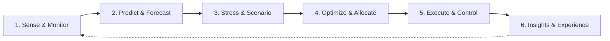
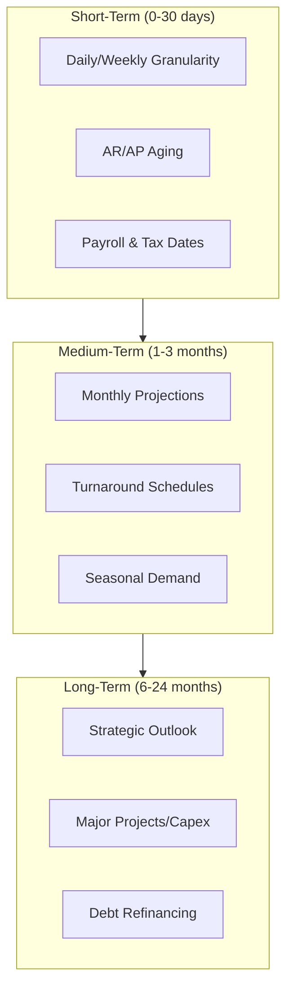
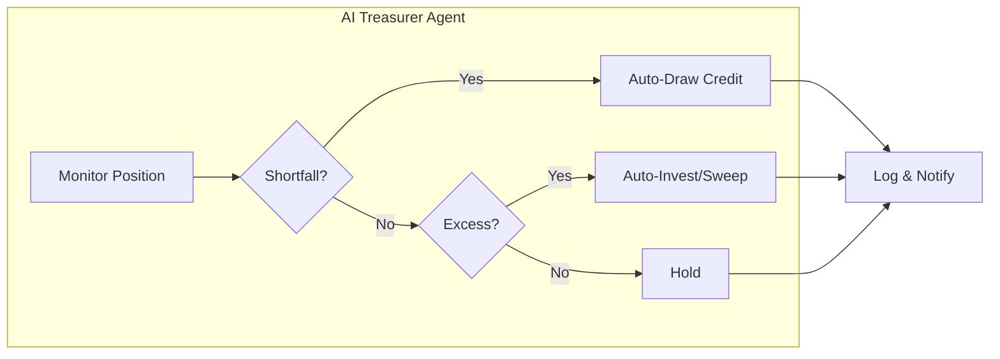

# T1: Cash & Liquidity (ALM)

## Overview

Cash and Liquidity Management is the cornerstone of treasury operations in downstream oil & gas. AI-powered solutions enable real-time visibility, accurate multi-horizon forecasting, stress testing, and optimal liquidity allocation across the enterprise.

This tower covers **6 use-case clusters** spanning the full liquidity management lifecycle:

| Cluster | Focus | Key Outcome |
|---------|-------|-------------|
| **Sense & Monitor** | Real-time visibility & early warnings | Instant global cash view, anomaly alerts |
| **Predict & Forecast** | Multi-horizon liquidity projections | Accurate 0-30 day, 1-3 month, 6-24 month forecasts |
| **Stress & Scenario** | What-if simulations & contingency planning | Resilience against commodity/FX shocks |
| **Optimize & Allocate** | Buffer, pooling & funding optimization | Minimized idle cash, lowest funding costs |
| **Execute & Control** | Automated actions & governance | 24/7 autonomous treasury operations |
| **Insights & Experience** | GenAI assistants & reporting | Natural language Q&A, auto-generated reports |

---

## 1. Sense & Monitor (Real-Time Visibility & Alerts)

### 1.1 Real-Time Cash Visibility & Analytics

| Aspect | Details |
|--------|---------|
| **What it does** | Aggregates multi-bank account balances across all entities and currencies into a live dashboard, highlighting idle cash vs. overdrafts |
| **Key Inputs** | Bank feeds (MT940/BAI2), intraday updates, TMS/ERP data, bank APIs |
| **AI Approach** | Data integration + entity matching + anomaly detection; LLM interface for natural queries |
| **Outputs** | Unified cash position by entity/currency, visualization dashboards, threshold alerts |
| **Primary KPIs** | % accounts covered real-time, hours saved in consolidation, overdraft incidents avoided |
| **Controls** | Bank cut-off times, data residency, role-based access, audit logs |

### 1.2 Intraday Liquidity Tracking & Alerts

| Aspect | Details |
|--------|---------|
| **What it does** | Monitors intraday flows and predicts potential shortfalls before bank cut-offs |
| **Key Inputs** | SWIFT MT942, RTGS updates, scheduled payment files, expected large inflows |
| **AI Approach** | Real-time analytics with threshold-based anomaly detection; ML classification of normal vs. unusual patterns |
| **Outputs** | End-of-day balance projections, overdraft warnings, credit line draw recommendations |
| **Primary KPIs** | Warnings issued vs. resolved, MTTD/MTTR for shortfalls, intraday credit avoidance |
| **Controls** | Currency/country cut-off compliance, false alarm minimization, human approval for auto-transfers |

### 1.3 Cash Flow Anomaly Detection

| Aspect | Details |
|--------|---------|
| **What it does** | Learns typical patterns and flags anomalies (e.g., payment 10x usual amount, duplicate payroll) to catch errors or fraud |
| **Key Inputs** | Historical transactions (ERP, TMS, bank), calendar of expected flows, vendor master data |
| **AI Approach** | Unsupervised anomaly detection (clustering, autoencoders), time-series pattern recognition |
| **Outputs** | Real-time alerts with explanations ("Outgoing $50M to Vendor X is 5x typical") |
| **Primary KPIs** | False positive rate, true anomalies caught, operational loss avoidance |
| **Controls** | Threshold retraining governance, segregation of duties, payment stop workflow integration |

### 1.4 Forecast vs. Actual Variance Analysis

| Aspect | Details |
|--------|---------|
| **What it does** | Compares forecasts to actuals, identifies variances, and pinpoints root causes automatically |
| **Key Inputs** | Cash forecast data, actual flows from bank/ERP, transaction metadata |
| **AI Approach** | Analytics + NLP: business rules match forecast to actuals; LLM generates narrative explanations via RAG |
| **Outputs** | Daily/weekly variance reports with top deviations, waterfall charts, narrative commentary |
| **Primary KPIs** | Forecast MAPE, large variance frequency, time to explain (days → minutes) |
| **Controls** | Materiality thresholds, audit trail of adjustments, LLM output verification |

---

## 2. Predict & Forecast (Multi-Horizon Liquidity Forecasting)

### 2.1 Short-Term Cash Forecasting (0-30 days)

| Aspect | Details |
|--------|---------|
| **What it does** | ML-driven daily/weekly cash flow forecasts accounting for crude payables and product sales |
| **Key Inputs** | ERP AR/AP ledgers, sales/delivery schedules, crude procurement, excise tax dates, oil prices |
| **AI Approach** | Time-series (gradient boosted, LSTM) with seasonality, continuously retrained ensembles |
| **Outputs** | Daily balance projections with confidence intervals, Most Likely/Worst/Best case scenarios |
| **Primary KPIs** | <5% error on 1-week horizon, surprise funding reduction, cash positioning accuracy |
| **Controls** | Data quality validation, forecast lock-down at T-1, human override logging |

### 2.2 Medium-Term Liquidity Forecasting (1-3 months)

| Aspect | Details |
|--------|---------|
| **What it does** | Projects monthly cash for the quarter, capturing turnarounds, seasonal swings, inventory builds |
| **Key Inputs** | Budget/production forecasts, maintenance schedules, capex plans, commodity forward curves, hedging P&L |
| **AI Approach** | Statistical models + scenario simulation; agent-based working capital modeling |
| **Outputs** | Monthly liquidity plan, early warning of buffer breaches, projected cash balance trends |
| **Primary KPIs** | 1-month and 3-month accuracy, forecast revision frequency, buffer utilization |
| **Controls** | Conservative scenario policy, borrowing threshold approvals, credit line headroom integration |

### 2.3 Long-Term Liquidity Planning (6-24 months)

| Aspect | Details |
|--------|---------|
| **What it does** | Strategic outlook incorporating major projects, refinancings, and market scenarios |
| **Key Inputs** | FP&A financial plan, capex forecasts, debt maturity schedule, macro indicators (inflation, FX) |
| **AI Approach** | Digital twin simulation, scenario toggling (oil $70 vs $90), sensitivity analysis, optimization |
| **Outputs** | Multi-quarter projections under base/alternative scenarios, recommendations for capital actions |
| **Primary KPIs** | Scenario coverage, liquidity ratios (current ratio, debt coverage), covenant compliance |
| **Controls** | Board/CFO scenario approval, 6-month minimum liquidity policy, alignment with enterprise risk |

### 2.4 Receivables Collection Prediction

| Aspect | Details |
|--------|---------|
| **What it does** | Predicts payment timing and default probability for customer invoices |
| **Key Inputs** | AR ledger, customer payment history/DSO, credit ratings, macro factors |
| **AI Approach** | Supervised learning (classification/regression) for days-to-payment; Monte Carlo for collection curves |
| **Outputs** | Adjusted inflow forecast, at-risk receivables dashboard, alerts for likely delays |
| **Primary KPIs** | AR timing prediction accuracy, DSO improvement, forecast variance reduction |
| **Controls** | Credit control collaboration, accounting rule compliance, customer data privacy |

### 2.5 Payables & Disbursement Forecasting

| Aspect | Details |
|--------|---------|
| **What it does** | Predicts outflow timing beyond due dates (e.g., "Supplier X usually paid ~5 days late due to document clearance") |
| **Key Inputs** | AP ledger, historical payment execution, supplier discount agreements, shipping/receiving data |
| **AI Approach** | Supervised ML similar to receivables; NLP for contract term extraction |
| **Outputs** | Refined outflow schedule with probabilities, alerts for payment concentration risks |
| **Primary KPIs** | Payment timing accuracy, cash utilization improvement, early discount capture rate |
| **Controls** | Supplier term adherence, procurement alignment, policy compliance |

### 2.6 Hedging & Collateral Cash Flow Prediction

| Aspect | Details |
|--------|---------|
| **What it does** | Forecasts margin calls and collateral postings from derivatives hedging (critical for O&G) |
| **Key Inputs** | ETRM/CTRM positions, exchange margin formulas, CSA terms, market prices/volatility |
| **AI Approach** | Monte Carlo simulation for market moves; VaR models; stress testing (±20% price moves) |
| **Outputs** | Daily collateral forecast under base/stress scenarios, threshold alerts, liquidity buffer integration |
| **Primary KPIs** | Margin call forecast accuracy, no liquidity breach from margin, collateral cost of carry |
| **Controls** | Regulatory VaR coverage, risk management coordination, hedge compliance |

---

## 3. Stress & Scenario (Liquidity Stress-Testing & Contingency)

### 3.1 Commodity & FX Shock Scenarios

| Aspect | Details |
|--------|---------|
| **What it does** | Simulates oil price crashes (e.g., Brent -20%), FX devaluations, and their liquidity impact |
| **Key Inputs** | Price scenarios (user-defined or options-implied), financial models linking price to cash, hedge positions |
| **AI Approach** | Scenario engine with AI for speed/nonlinear effects; stress testing ML for extreme-but-plausible combinations |
| **Outputs** | Cash flow change vs. base, minimum cash balance, covenant breach assessment, action recommendations |
| **Primary KPIs** | Key scenario coverage, time to run new scenario (minutes), pre-emptive funding actions taken |
| **Controls** | Risk management scenario alignment, conservative assumptions, management sign-off |

**Example Scenario Outputs:**

| Scenario | Cash Impact | Action Required |
|----------|-------------|-----------------|
| Oil -20% | -$X revenue, margin call +$Y | Draw $50M credit line |
| TRY -15% vs USD | Working capital squeeze | Delay discretionary capex |
| Refinery shutdown (1 month) | -$Z from lost sales | Inventory pre-build, credit facility draw |

### 3.2 Liquidity Contingency Planning

| Aspect | Details |
|--------|---------|
| **What it does** | Digital war-game for combined stress scenarios (customer default + oil crash + refinery shutdown) |
| **Key Inputs** | Multi-factor scenarios, contingency options (credit lines, asset sales, cost cuts, inter-company loans) |
| **AI Approach** | Optimization under stress: selects lowest-cost action combination to cover liquidity gap |
| **Outputs** | Contingency playbook, liquidity survival period, buffer adequacy report, emergency dashboard |
| **Primary KPIs** | Scenarios covered, time to liquidity exhaustion, contingency cost minimization |
| **Controls** | Board-defined action limits, regulatory constraints, disclosure requirements |

### 3.3 Counterparty Default Impact Simulation

| Aspect | Details |
|--------|---------|
| **What it does** | Assesses impact if a major customer defaults or a bank freezes a credit line |
| **Key Inputs** | Top counterparty exposures, bank facility amounts, credit ratings, news/CDS signals, credit insurance |
| **AI Approach** | Scenario analysis + AI news scanning for distress signals; LLM to parse bankruptcy risk hints |
| **Outputs** | Revised cash forecast with shock, recommended buffer increases, counterparty migration actions |
| **Primary KPIs** | At-risk cash identified, time to detect potential default, successful mitigation |
| **Controls** | Up-to-date exposure data, no false rumor actions, credit risk department coordination |

### 3.4 Regulatory/Compliance Liquidity Stress

| Aspect | Details |
|--------|---------|
| **What it does** | Tests internal policy metrics (LCR, current ratio) and covenants under stress scenarios |
| **Key Inputs** | Defined limits/ratios, scenario definitions, financial/cash flow data |
| **AI Approach** | Automated calculation + edge-case scenario generation; optimization to find breach points |
| **Outputs** | Metric report per scenario, breach highlights, minimum cash to avoid violation |
| **Primary KPIs** | Zero breaches in tested scenarios, regulatory stress test coverage, confidence level |
| **Controls** | Official metric definitions, regulator-dictated severity, risk committee sign-off |

---

## 4. Optimize & Allocate (Liquidity Optimization & Decision Support)

### 4.1 Dynamic Liquidity Buffer Optimization

| Aspect | Details |
|--------|---------|
| **What it does** | Determines optimal cash buffer (e.g., hold $70M instead of $100M, freeing $30M to invest) |
| **Key Inputs** | Forecast distribution with uncertainty, risk tolerance (99% confidence), interest rates, known large needs |
| **AI Approach** | Stochastic optimization, Monte Carlo shortfall probability, reinforcement learning for adaptation |
| **Outputs** | Recommended minimum balance, excess deployment suggestions, risk/return efficient frontier |
| **Primary KPIs** | Zero shortfall incidents, reduced idle cash, interest income/expense savings |
| **Controls** | Board policy minimum floor, regulatory minima, CFO approval for significant reductions |

### 4.2 Automated Cash Pooling & Sweeping

| Aspect | Details |
|--------|---------|
| **What it does** | Optimizes daily cash concentration across dozens of accounts/currencies |
| **Key Inputs** | Account balances, pooling structures/limits, FX rates, next-day forecast, transfer fees |
| **AI Approach** | Linear programming to minimize cost of funds; ML to predict next-day account needs |
| **Outputs** | Daily sweep instruction list, currency conversions, expected interest savings |
| **Primary KPIs** | Idle cash reduction (%), overdraft cost eliminated, STP% of pooling moves |
| **Controls** | Cross-border restrictions, transfer pricing rules, minimum account balance limits |

### 4.3 Short-Term Funding & Credit Line Optimization

| Aspect | Details |
|--------|---------|
| **What it does** | Decides when/where to draw or repay revolving credit, commercial paper, intra-group loans |
| **Key Inputs** | Facility limits/rates/fees, CP market rates, forecast shortfalls, debt covenants, rate forecasts |
| **AI Approach** | Prescriptive optimization (LP/IP) minimizing interest cost while keeping cash ≥ 0 |
| **Outputs** | Draw/repay recommendations with timing ("Draw $20M from Facility A, repay $10M on B") |
| **Primary KPIs** | Interest expense reduction, cheapest source utilization, zero cash shortfall days |
| **Controls** | Facility covenants, corporate policy (internal cash first), approval requirements |

### 4.4 Payment Scheduling & Prioritization

| Aspect | Details |
|--------|---------|
| **What it does** | Optimizes payment timing within allowed terms to manage liquidity or capture discounts |
| **Key Inputs** | Pending payments with due dates, payment terms/discounts, liquidity forecast, criticality tags |
| **AI Approach** | Scheduling optimization + integer programming for cash shortfall minimization / discount maximization |
| **Outputs** | Optimized payment run proposal with rationale ("Delay $2M to Vendor Z by 5 days to avoid overdraft") |
| **Primary KPIs** | Cash conserved, discount income earned, on-time payment adherence |
| **Controls** | Contractual due date compliance, supplier relationship management, internal approvals |

### 4.5 Multi-Currency Cash Optimization

| Aspect | Details |
|--------|---------|
| **What it does** | Decides when to convert currencies or hold for natural hedging (USD crude outflows vs. local inflows) |
| **Key Inputs** | Cash forecasts by currency, FX rates/forwards, interest differentials, hedging policy |
| **AI Approach** | FX simulation optimization; ML for short-term FX trend timing (within policy limits) |
| **Outputs** | Currency conversion/swap recommendations with expected benefit |
| **Primary KPIs** | FX exposure reduction, idle foreign currency minimization, no settlement failures |
| **Controls** | Hedging policy adherence, trading limits, currency control compliance |

### 4.6 Surplus Cash Investment Optimization

| Aspect | Details |
|--------|---------|
| **What it does** | Deploys excess cash into short-term investments matching forecasted liquidity needs |
| **Key Inputs** | Surplus amount/timing, allowable investments (yields, maturities), debt rates, market data |
| **AI Approach** | Portfolio optimization over short-term instruments; ML for rate forecasting |
| **Outputs** | Investment plan ("$10M in 30-day TD at 4%, $20M in 90-day CP at 4.5%"), compliance checks |
| **Primary KPIs** | Yield on surplus, cash utilization, zero liquidity shortfall from over-investment |
| **Controls** | Investment policy limits, segregation of duties, regulatory constraints |

---

## 5. Execute & Control (Automated Actions & Governance)

### 5.1 Autonomous Liquidity Actions (AI Treasurer Agent)

| Aspect | Details |
|--------|---------|
| **What it does** | Executes routine liquidity tasks automatically within guardrails (auto-draw, auto-sweep, FX swaps) |
| **Key Inputs** | Real-time positions, forecast vs. actual, decision rules, bank APIs, authority matrix |
| **AI Approach** | Agentic AI with event-driven logic; LLM for system interfacing; rule-based for safety |
| **Outputs** | Executed transactions with explanation notes, audit trail, escalation requests |
| **Primary KPIs** | Manual intervention reduction, response speed, zero unauthorized errors |
| **Controls** | SoD enforcement, defined authority limits, reversibility, regulatory compliance triggers |

### 5.2 AI-Assisted Payment Controls & Fraud Prevention

| Aspect | Details |
|--------|---------|
| **What it does** | Catches fraud, errors, or sanctions violations before payment release |
| **Key Inputs** | Payment details, vendor master, sanction/PEP lists (OFAC, EU), fraud patterns, user behavior |
| **AI Approach** | Anomaly detection, ML on payment history, NLP for fuzzy sanction name matching, graph analysis |
| **Outputs** | Real-time alerts/blocks with risk scores and explanations |
| **Primary KPIs** | Fraud attempts intercepted ($), false positive rate, compliance breaches avoided |
| **Controls** | Sanction regulation compliance, data privacy, model validation, human final release |

### 5.3 Automated Bank Reconciliation & Exception Handling

| Aspect | Details |
|--------|---------|
| **What it does** | Matches bank statement lines to expected flows daily, identifies missing funds or unknown charges |
| **Key Inputs** | Bank statements, ERP cash entries, treasury system data, matching rules |
| **AI Approach** | Fuzzy matching algorithms, NLP for remittance info, self-learning match improvement |
| **Outputs** | Daily reconciliation report (>95% auto-matched), exceptions with reasons |
| **Primary KPIs** | Reconciliation rate (>95%), time saved, error detection speed |
| **Controls** | Accounting policy limits, audit trail, data security |

### 5.4 Audit Trail & Compliance Automation

| Aspect | Details |
|--------|---------|
| **What it does** | Documents all transactions and AI decisions for audit-ready trails |
| **Key Inputs** | Logs from all use-cases, policy rules, approvals, market data snapshots |
| **AI Approach** | Natural Language Generation to narrate actions; process mining; anomaly flagging |
| **Outputs** | Traceable audit documents, compliance reports, exception alerts |
| **Primary KPIs** | Zero audit issues, instant report generation, 100% action logging |
| **Controls** | Auditor-approved formats, immutable logs, data retention policies |

---

## 6. Insights & Experience (GenAI-Driven Analysis & Reporting)

### 6.1 Treasury Q&A Assistant (Conversational AI)

| Aspect | Details |
|--------|---------|
| **What it does** | LLM chatbot for natural language queries ("How much USD cash do we have right now?") |
| **Key Inputs** | TMS/ERP data connections, forecasts, policies, user role permissions |
| **AI Approach** | LLM with RAG; tool plugins for SQL/calculations; secure context per session |
| **Outputs** | Interactive responses with figures, charts, context ("$5M higher than last week due to delayed capex") |
| **Primary KPIs** | Response accuracy (near 100%), usage adoption, routine analysis time reduction |
| **Controls** | Role-based data access, query/answer logging, domain boundaries |

### 6.2 Automated Treasury Report Generation

| Aspect | Details |
|--------|---------|
| **What it does** | Auto-creates weekly/monthly treasury bulletins with charts and narrative |
| **Key Inputs** | Cash positions, forecasts, market data (FX, oil), events, prior reports for style |
| **AI Approach** | LLM content generation with retrieval; data queries + chart generation; human review loop |
| **Outputs** | Polished PDF/slide with executive summary, trend charts, "so-what" insights |
| **Primary KPIs** | Preparation time (days → minutes), revision frequency, stakeholder satisfaction |
| **Controls** | Review workflow before release, disclosure policy compliance, communication standards |

### 6.3 Variance Explanation & Root-Cause Assistant

| Aspect | Details |
|--------|---------|
| **What it does** | Explains why cash is 15% lower: "Crude payments +$50M (price spike), inventory +$30M, offset by diesel sales +$20M" |
| **Key Inputs** | Cash flow time series by category, forecast data, event annotations, external context (oil prices) |
| **AI Approach** | Deterministic variance computation + LLM narrative with internal/external context |
| **Outputs** | Concise explanation (bullets or paragraphs), waterfall charts, source citations |
| **Primary KPIs** | Speed to answer, explanation completeness, user satisfaction |
| **Controls** | Data availability checks, factual grounding, confidentiality enforcement |

### 6.4 Treasury Policy & Knowledge Assistant

| Aspect | Details |
|--------|---------|
| **What it does** | Answers policy questions ("What's the approval limit for inter-company loans?") with document references |
| **Key Inputs** | Policy documents, SOPs, regulatory guidelines, historical Q&As, training materials |
| **AI Approach** | LLM with retrieval; policy section citations; fine-tuned on company terminology |
| **Outputs** | On-demand answers with policy references ("Per Treasury Policy Sec 5.3, the limit is...") |
| **Primary KPIs** | Usage frequency, answer accuracy, policy compliance improvement |
| **Controls** | Approved document sourcing, advice logging, prompt policy updates |

### 6.5 Market Intelligence & Forecast Assistant

| Aspect | Details |
|--------|---------|
| **What it does** | Scans news, social media, analyst reports for liquidity-impacting trends (port strikes, new taxes) |
| **Key Inputs** | News feeds, industry reports, social sentiment, internal schedules for cross-linking |
| **AI Approach** | NLP for relevance; LLM for impact assessment; knowledge graph for counterparty linking |
| **Outputs** | Alerts/briefings ("New VAT refund delay could impact ~$10M liquidity in Q2") |
| **Primary KPIs** | Relevant insights surfaced, lead time gained, action rate |
| **Controls** | Source credibility verification, false alarm tuning, legal guidance on sensitive info |

---

## Oil & Gas-Specific Drivers

Downstream oil & gas treasury faces unique liquidity challenges that generic solutions don't address:

| Driver | Impact on Liquidity | AI Solution |
|--------|---------------------|-------------|
| **Shipment Timing & Demurrage** | Delays incur $10K-100K+/day penalties; deferred receipts | Cargo milestone tracking, demurrage forecasting |
| **Margin & Collateral Calls** | Sudden price swings trigger massive cash demands (Shell reported billions in margin outflows) | Monte Carlo stress testing, VaR-based buffer sizing |
| **Refinery Turnarounds** | Planned/unplanned shutdowns create large cash swings | Maintenance schedule integration, scenario modeling |
| **Commodity-FX-Freight Correlation** | Oil prices, USD/TRY, and freight rates move together | Multi-factor correlation models, natural hedge optimization |
| **Multi-Entity Pooling Constraints** | Subsidiaries in capital-controlled countries can't freely sweep | Entity-level constraint optimization, trapped cash tracking |
| **Tax, Excise & Subsidy Timing** | Monthly excise tax creates large scheduled outflows; VAT refund lags | Excise calendar integration, seasonal pattern learning |

---

## AI/ML Techniques Summary

| Technique | Application Areas |
|-----------|-------------------|
| **Time Series (LSTM, Prophet, XGBoost)** | Short/medium/long-term forecasting |
| **Anomaly Detection (Autoencoders, Isolation Forest)** | Cash flow anomalies, fraud detection |
| **Monte Carlo Simulation** | Stress testing, margin call forecasting |
| **Optimization (LP, IP, Stochastic)** | Buffer sizing, pooling, funding, payments |
| **Reinforcement Learning** | Dynamic buffer management, autonomous actions |
| **NLP / LLM with RAG** | Q&A assistants, report generation, variance explanations |
| **Graph Analytics** | Counterparty relationship mapping, sanction screening |

---

## Scope Boundaries (What is NOT T1)

To keep T1 focused, the following belong to other towers:

| Topic | Tower | Reason |
|-------|-------|--------|
| Hedge ratio optimization | T2 FX/Risk | Focuses on market risk, not immediate liquidity |
| Inventory turnover improvement | T3 Working Capital | Beyond AR/AP timing that feeds forecasts |
| LC/guarantee processing | T4 Trade Finance | Operational trade finance, not cash positioning |
| Long-term investment portfolios | T5 Investments | Strategic horizon beyond liquidity surplus |
| Invoice OCR, expense processing | T6 Ops Automation | Back-office processing, not liquidity management |

---

## Expected Benefits

| Benefit | Impact |
|---------|--------|
| Forecast accuracy improvement | **50%+** |
| Manual reconciliation reduction | **95%** |
| Idle cash reduction | **20-30%** through optimized pooling |
| Fraud detection rate | **90%+** |
| Report preparation time | **Days → Minutes** |
| Overdraft incidents | **Near zero** with intraday monitoring |
| Buffer optimization savings | **Millions annually** (industry benchmarks) |
