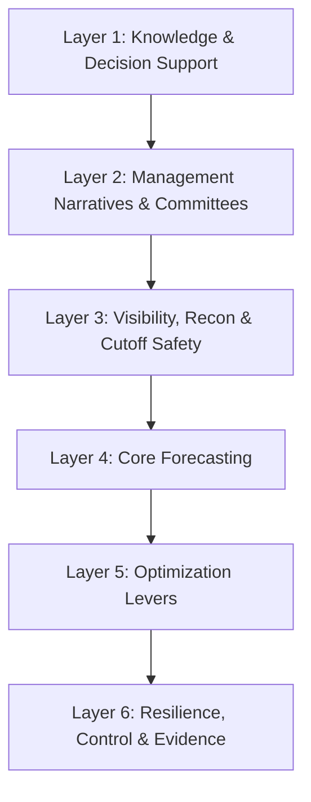

# T1: Cash & Liquidity (ALM)

## Overview

Cash and Liquidity Management is the cornerstone of treasury operations in downstream oil & gas. AI-powered solutions enable real-time visibility, accurate multi-horizon forecasting, stress testing, and optimal liquidity allocation across the enterprise.

!!! info "Oil & Gas Context"

    Downstream treasury operations face unique challenges: volatile crude prices, significant excise tax timing, margin call requirements, and complex intercompany funding structures. The use cases in this tower are specifically designed to address these industry-specific needs.

This tower organizes **32 AI use cases** across **6 functional layers**:



| Layer | Focus | Use Cases |
|-------|-------|-----------|
| **L1: Knowledge & Decision Support** | Copilot layer for policy Q&A and complex queries | 4 |
| **L2: Management Narratives & Committees** | ALCO reports, exposure summaries, risk attribution | 4 |
| **L3: Visibility, Recon & Cutoff Safety** | Day 0/Intraday cash position and reconciliation | 4 |
| **L4: Core Forecasting** | 13-week cash ladder with O&G signals | 6 |
| **L5: Optimization Levers** | Move money, fund, invest decisions | 8 |
| **L6: Resilience, Control & Evidence** | Stress testing, policy compliance, audit trails | 6 |

---

## Layer 1: Knowledge & Decision Support (Copilot Layer)

This layer provides AI-powered assistants that help treasury teams access information, answer questions, and navigate complex queries through natural language interfaces.

### 1.1 RAG-Powered Policy Q&A

**What it does:** Retrieval-Augmented Generation (RAG) system that answers questions about treasury policies, procedures, and guidelines with direct citations to source documents.

**Key Inputs:**

- Treasury policy documents (PDF, Word, SharePoint)
- Standard Operating Procedures (SOPs)
- Regulatory guidelines and compliance manuals
- Historical Q&A logs for continuous improvement

**AI/LLM Approach:** Claude indexes all treasury documents into a vector database. When a user asks a question, relevant document chunks are retrieved and Claude generates an answer with specific citations.

**Example Interaction:**

```
User: What is our approval limit for intercompany loans?

Claude: Based on Treasury Policy Document v3.2 (Section 5.3), intercompany
loan approval limits are:

| Loan Amount | Approval Required |
|-------------|-------------------|
| Up to $5M | Treasury Manager |
| $5M - $25M | Treasury Director |
| $25M - $100M | CFO |
| Above $100M | Board Finance Committee |

Additional requirements per Section 5.3.2:
- All loans require documented business justification
- Cross-border loans need transfer pricing documentation
- Loans to restricted jurisdictions require Legal review

📎 Sources: Treasury_Policy_v3.2.pdf (pages 23-24), IC_Loan_SOP.docx
```

**Outputs:**

- Instant answers with document citations
- Confidence scores for answer quality
- Links to source documents
- Suggested related policies

**KPIs:**

- Answer accuracy rate (target: >95%)
- Average response time (<5 seconds)
- User satisfaction score
- Policy compliance improvement rate

---

### 1.2 Multi-Step Agent for Complex Queries

**What it does:** An agentic AI that can browse multiple systems, validate data, and synthesize complex treasury queries that require multi-step reasoning and data from multiple sources.

**Key Inputs:**

- Access to TMS, ERP, banking portals
- Real-time market data feeds
- Historical transaction databases
- User query context and role permissions

**AI/LLM Approach:** Claude operates as an autonomous agent that breaks complex queries into sub-tasks, executes each step (database queries, calculations, validations), and synthesizes a comprehensive answer.

**Example Interaction:**

```
User: Why is our USD cash position $15M lower than forecasted this week,
and what should we do about it?

Claude: I'll analyze this variance for you. Let me check multiple sources...

📊 **Variance Analysis Complete**

**Finding: $15.2M negative variance identified**

| Category | Forecasted | Actual | Variance | Root Cause |
|----------|------------|--------|----------|------------|
| Crude Payments | $120M | $128M | -$8M | Brent +$3/bbl vs forecast |
| Customer Receipts | $95M | $91M | -$4M | Petrol Station Co. delayed (DSO +5 days) |
| Excise Tax | $45M | $48.2M | -$3.2M | Higher volume than planned |

**Recommended Actions:**

1. **Immediate**: Draw $10M from RCF-A (lowest cost at SOFR+85bps)
2. **This week**: Follow up with Petrol Station Co. on $4M receivable
3. **Adjust forecast**: Update crude payment model for current prices

**Impact if no action**: End-of-week balance projected at $8M vs. $25M
minimum buffer policy.

Shall I initiate the credit line draw request?
```

**Outputs:**

- Comprehensive analysis reports
- Root cause identification
- Actionable recommendations
- Draft transactions for approval

**KPIs:**

- Query resolution rate without escalation
- Time saved vs. manual analysis
- Recommendation acceptance rate
- Decision quality improvement

---

### 1.3 Taxonomy Cleanup Suggester

**What it does:** Analyzes treasury data taxonomies (account codes, entity mappings, cash flow categories) and suggests improvements for better data quality and retrieval accuracy.

**Key Inputs:**

- Chart of accounts and cash flow categories
- Historical categorization patterns
- Reconciliation exception logs
- Industry standard taxonomies (e.g., ISO 20022)

**AI/LLM Approach:** Claude analyzes patterns in miscategorized transactions, identifies inconsistencies, and suggests taxonomy improvements based on actual usage patterns and industry standards.

**Example Interaction:**

```
User: Review our cash flow categorization and suggest improvements.

Claude: I've analyzed 45,000 transactions from the past 6 months.
Here are my findings:

🔍 **Taxonomy Issues Identified**

**1. Duplicate Categories (High Priority)**
| Current | Suggested Action |
|---------|------------------|
| "FX Gain/Loss" + "Currency Revaluation" | Merge → "FX Impact" |
| "Bank Charges" + "Banking Fees" | Merge → "Bank Fees" |

**2. Miscategorization Patterns**
- 23% of "Other Operating" should be "Excise Tax Payments"
- Intercompany transfers often coded as external payments

**3. Missing Categories for O&G**
- No specific code for "Margin/Collateral Calls" (currently in "Other")
- "Demurrage Payments" lumped with "Logistics"

**Recommended New Taxonomy:**
```
Operating
├── Crude Procurement
├── Product Sales
├── Excise & Tax
├── Margin/Collateral
└── Demurrage & Laytime

Financing
├── Intercompany (In/Out)
├── Bank Facilities
└── ...
```

Implementing these changes would improve forecast accuracy by ~8%
based on historical analysis.
```

**Outputs:**

- Taxonomy audit report
- Merge/split recommendations
- New category suggestions
- Implementation roadmap

**KPIs:**

- Reduction in "Other" category usage
- Reconciliation exception rate decrease
- Forecast accuracy improvement
- Data quality score

---

### 1.4 Policy/Process Q&A for Cash Operations

**What it does:** Specialized Q&A assistant focused on day-to-day cash operations procedures, payment processes, and operational guidelines.

**Key Inputs:**

- Cash operations manuals
- Payment processing procedures
- Bank cut-off time schedules
- Emergency procedures and escalation paths

**AI/LLM Approach:** Claude is fine-tuned on operational procedures with emphasis on step-by-step guidance, checklists, and real-time operational context (current cut-off times, holiday calendars).

**Example Interaction:**

```
User: How do I process an urgent USD payment to a new beneficiary
after the CHIPS cut-off?

Claude: For urgent USD payments after CHIPS cut-off (5:00 PM ET),
follow this procedure:

**Option 1: Fedwire (if available)**
- Cut-off: 6:00 PM ET
- Steps:
  1. Request Fedwire from bank via secure message
  2. Additional fee: ~$25-50
  3. Approval: Treasury Manager (per SOP-PAY-003)

**Option 2: Next-day CHIPS with value-date protection**
- Submit before 8:00 PM ET for next-day value
- No additional fee
- Standard approval workflow

**New Beneficiary Requirements:**
⚠️ First-time beneficiary requires:
- [ ] Completed vendor setup form (Form-V01)
- [ ] Bank verification call (dual control)
- [ ] Sanctions screening (auto-runs, ~2 min)
- [ ] Treasury Director approval for amounts >$1M

**Current Status:**
- Time now: 5:23 PM ET
- Fedwire window: 37 minutes remaining
- Your role: Authorized for emergency payments up to $500K

Need me to start the Fedwire request workflow?
```

**Outputs:**

- Step-by-step procedural guidance
- Real-time operational context
- Checklist generation
- Workflow initiation

**KPIs:**

- Procedure compliance rate
- Time to resolution for operational queries
- Reduction in process errors
- User confidence scores

---

## Layer 2: Management Narratives & Committees

This layer automates the creation of management reports, committee presentations, and narrative explanations that treasury teams must produce for ALCO, board meetings, and executive briefings.

### 2.1 ALCO/Treasury Report Drafter

**What it does:** Automatically generates Asset-Liability Committee (ALCO) reports with key highlights, variance explanations, and forward-looking commentary ready for executive review.

**Key Inputs:**

- Current cash positions by entity and currency
- Liquidity forecasts and actuals
- Market data (FX rates, interest rates, commodity prices)
- Policy limits and utilization metrics
- Previous ALCO reports for style consistency

**AI/LLM Approach:** Claude aggregates data from multiple sources, calculates key metrics, identifies noteworthy items, and generates narrative commentary in the organization's established reporting style.

**Example Interaction:**

```
User: Generate this week's ALCO liquidity summary.

Claude: Here's the draft ALCO Liquidity Report for week ending Jan 10, 2025:

═══════════════════════════════════════════════════════════════
           WEEKLY LIQUIDITY REPORT - ALCO SUMMARY
═══════════════════════════════════════════════════════════════

**EXECUTIVE SUMMARY**
Group liquidity position remains robust at $285M against a $200M
policy minimum. Key developments this week:

• Cash position: $285M (+$12M vs. prior week)
• 13-week forecast: Adequate coverage with $45M buffer above minimum
• Credit facility headroom: $150M undrawn (RCF-A: $100M, RCF-B: $50M)

**KEY METRICS**

| Metric | Current | Policy Limit | Status |
|--------|---------|--------------|--------|
| Total Liquidity | $435M | >$200M | ✅ |
| Days Cash on Hand | 45 days | >30 days | ✅ |
| RCF Utilization | 25% | <75% | ✅ |
| Intercompany Exposure | $78M | <$100M | ✅ |

**NOTABLE ITEMS FOR DISCUSSION**

1. **Margin Call Spike (Week 2)**: Brent volatility may trigger
   $15-25M additional collateral. Recommend pre-positioning.

2. **Q1 Excise Tax**: $48M due Jan 25. Funding plan confirmed.

3. **Trapped Cash - Nigeria**: $12M remains restricted. Working
   with banks on repatriation options.

**FORWARD OUTLOOK**
No liquidity concerns for 13-week horizon under base case.
Stress scenario (Brent -15%) shows adequate buffer with
RCF utilization increasing to 45%.

───────────────────────────────────────────────────────────────
Prepared by: Treasury AI Assistant | Review required before distribution
```

**Outputs:**

- Draft ALCO report in standard format
- Key metrics dashboard
- Highlighted items requiring discussion
- Appendix with supporting data

**KPIs:**

- Report preparation time (days → minutes)
- Executive revision rate (fewer iterations)
- Metric accuracy (100% target)
- Stakeholder satisfaction score

---

### 2.2 Exposure & Compliance Summarizer

**What it does:** Summarizes treasury exposures (FX, counterparty, liquidity) and policy compliance status for committee presentations, highlighting any breaches or near-breaches.

**Key Inputs:**

- Exposure data by category (FX, interest rate, counterparty)
- Policy limits and thresholds
- Current utilization metrics
- Historical compliance trends

**AI/LLM Approach:** Claude consolidates exposure data, compares against policy limits, calculates headroom, and generates a compliance summary with traffic-light indicators.

**Example Interaction:**

```
User: Summarize our current treasury exposures for the Risk Committee.

Claude: **TREASURY EXPOSURE & COMPLIANCE SUMMARY**
As of: January 10, 2025

**COMPLIANCE DASHBOARD**

| Exposure Type | Current | Limit | Utilization | Status |
|---------------|---------|-------|-------------|--------|
| FX - USD/TRY | $45M | $60M | 75% | 🟡 |
| FX - EUR/USD | $28M | $50M | 56% | 🟢 |
| Counterparty - Bank A | $85M | $100M | 85% | 🟡 |
| Counterparty - Bank B | $42M | $100M | 42% | 🟢 |
| Liquidity Buffer | $285M | $200M min | 143% | 🟢 |
| Derivative Notional | $320M | $500M | 64% | 🟢 |

**ITEMS REQUIRING ATTENTION**

🟡 **USD/TRY Exposure (75% of limit)**
- Approaching policy ceiling due to TRY depreciation
- Recommendation: Accelerate TRY receivables collection or
  increase hedge ratio
- Projected to hit 85% by month-end if no action

🟡 **Bank A Concentration (85% of limit)**
- Driven by recent RCF draw and deposit placements
- Recommendation: Shift $15M deposits to Bank C to create headroom

**POLICY BREACHES: None**

**NEAR-MISS LOG (Past 30 Days)**
- Jan 3: Intraday liquidity briefly touched $195M (policy: $200M)
  Duration: 2 hours. Resolved via accelerated collection.

**TREND ANALYSIS**
Overall risk profile: STABLE
Compliance score: 94/100 (vs. 91 last month)
```

**Outputs:**

- Compliance dashboard with RAG status
- Breach and near-breach alerts
- Trend analysis
- Recommended actions

**KPIs:**

- Zero undetected policy breaches
- Near-breach early warning accuracy
- Committee preparation time reduction
- Compliance score improvement

---

### 2.3 Scenario Narrative Generator

**What it does:** Creates executive-ready narrative explanations of liquidity stress test results, explaining complex scenarios in business terms that non-treasury stakeholders can understand.

**Key Inputs:**

- Stress test results and scenario definitions
- Cash flow impact calculations
- Contingency action options
- Historical scenario comparisons

**AI/LLM Approach:** Claude translates technical stress test outputs into clear business narratives, contextualizes impacts, and explains recommended responses in plain language.

**Example Interaction:**

```
User: Write the narrative for our "Severe Commodity Shock" stress scenario.

Claude: **STRESS SCENARIO NARRATIVE: SEVERE COMMODITY SHOCK**

**Scenario Definition**
This scenario models a rapid 25% decline in Brent crude prices
(from $80 to $60/bbl) sustained over 90 days, combined with:
- 10% TRY depreciation against USD
- Two major customer payment delays (30 days each)

**Business Context**
This scenario reflects conditions similar to Q1 2020 when oil
prices collapsed due to demand shock. While severe, it represents
a plausible tail risk event that treasury must be prepared for.

**Impact Assessment**

The combined shock would reduce our liquidity position by
approximately $95M over 90 days:

| Impact Driver | Cash Effect | Timing |
|---------------|-------------|--------|
| Reduced product margins | -$40M | Months 1-3 |
| Margin call increases | -$35M | Month 1 |
| Customer payment delays | -$15M | Months 1-2 |
| TRY working capital squeeze | -$5M | Month 1 |

**Liquidity Trajectory**

Starting position: $285M
Day 30 position: $210M (above $200M minimum)
Day 60 position: $175M ⚠️ (below minimum without action)
Day 90 position: $145M ⚠️ (requires contingency activation)

**Contingency Response**

To maintain policy compliance throughout the scenario:

1. **Week 1**: Draw $30M from RCF-A (automatic trigger)
2. **Week 4**: Defer $15M discretionary capex
3. **Week 6**: Draw additional $20M from RCF-B
4. **Month 2**: Activate $25M intercompany loan from Parent

With these actions, minimum liquidity of $205M is maintained
throughout the stress period.

**Board Assurance**
Even under this severe scenario, the company maintains adequate
liquidity with contingency actions. No covenant breaches are
projected. Recovery to normal liquidity levels expected within
6 months post-scenario.
```

**Outputs:**

- Executive-ready scenario narratives
- Plain-language impact explanations
- Visual liquidity trajectories
- Contingency action summaries

**KPIs:**

- Narrative clarity score (stakeholder feedback)
- Board question reduction
- Scenario coverage completeness
- Time to produce narratives

---

### 2.4 Liquidity Risk Attribution Engine

**What it does:** Decomposes forecast variances and liquidity changes by driver (timing, volume, price, FX, operational factors) to explain what caused liquidity to deviate from plan.

**Key Inputs:**

- Forecasted vs. actual cash flows
- Transaction-level detail with metadata
- Market data (prices, FX rates)
- Operational data (volumes, shipments)

**AI/LLM Approach:** Claude performs multi-factor attribution analysis, isolating the contribution of each driver to the total variance and generating explanatory commentary.

**Example Interaction:**

```
User: Explain why our week 3 liquidity was $22M below forecast.

Claude: **LIQUIDITY VARIANCE ATTRIBUTION - WEEK 3**

Total Variance: -$22.0M (Forecast: $270M, Actual: $248M)

**WATERFALL DECOMPOSITION**

```
Forecast Starting Point          $270.0M
                                    │
├─ Price Effects                  -$8.5M
│  └─ Crude cost +$2.50/bbl → higher payments
│
├─ Volume Effects                 -$4.2M
│  └─ Product sales -3% vs plan
│
├─ Timing Effects                 -$6.8M
│  ├─ Customer X: 5 days late    -$4.1M
│  └─ Supplier Y: paid early     -$2.7M
│
├─ FX Effects                     -$1.5M
│  └─ TRY depreciation on working capital
│
├─ Operational Effects            -$1.0M
│  └─ Unplanned demurrage charges
│
└─ Actual Ending Point           $248.0M
```

**KEY INSIGHTS**

1. **Price is the dominant driver** (39% of variance)
   - Crude pricing moved against us mid-week
   - Forward curve suggests this may persist
   - Recommendation: Update forecast model with latest curves

2. **Timing effects are recoverable** (31% of variance)
   - Customer X payment expected within 5 days
   - Net timing impact should reverse next week

3. **Volume shortfall requires investigation** (19% of variance)
   - Sales team reports customer destocking
   - May be structural - requires forecast revision

**FORECAST ACCURACY IMPACT**
- This week's MAPE: 8.1%
- Rolling 4-week MAPE: 5.3%
- Attribution insight: Price model needs recalibration

Would you like me to prepare forecast adjustment recommendations?
```

**Outputs:**

- Waterfall variance decomposition
- Driver-level attribution
- Trend identification
- Forecast improvement recommendations

**KPIs:**

- Attribution accuracy (reconciles to total)
- Variance explanation speed
- Forecast model improvement rate
- Management understanding score

---

## Layer 3: Visibility, Recon & Cutoff Safety (Day 0/Intraday)

This layer provides real-time cash visibility, automated reconciliation, and proactive alerts to ensure same-day execution and accurate position tracking.

### 3.1 Daily Cash Position Copilot

**What it does:** Provides real-time consolidated cash position across all banks, entities, and currencies with reconciliation notes, variance highlights, and actionable alerts.

**Key Inputs:**

- Bank feeds (MT940, BAI2, API connections)
- Intraday balance updates (MT942)
- TMS/ERP expected transactions
- Opening balance from prior day
- FX rates for consolidation

**AI/LLM Approach:** Claude aggregates multi-source data, performs real-time consolidation, identifies discrepancies, and provides a natural language interface for position queries.

**Example Interaction:**

```
User: What's our current global cash position?

Claude: **GLOBAL CASH POSITION - As of Jan 10, 2025 14:32 UTC**

**CONSOLIDATED VIEW**

| Currency | Balance | USD Equiv | vs. Yesterday |
|----------|---------|-----------|---------------|
| USD | $142.5M | $142.5M | +$8.2M |
| EUR | €38.2M | $41.6M | -€2.1M |
| TRY | ₺485M | $14.2M | +₺25M |
| GBP | £12.8M | $16.1M | +£0.5M |
| **Total** | | **$214.4M** | **+$6.8M** |

**BY ENTITY**

| Entity | Local CCY | USD Equiv | Notes |
|--------|-----------|-----------|-------|
| HQ Turkey | $85M + ₺485M | $99.2M | Main ops account |
| Trading Sub | $45M + €30M | $77.7M | |
| Refinery OpCo | €8.2M | $8.9M | Excise due tomorrow |
| Nigeria Sub | $12M | $12M | ⚠️ Restricted |
| UK Marketing | £12.8M | $16.1M | |

**ALERTS**

⚠️ **Refinery OpCo**: €48M excise tax due tomorrow. Current balance
   €8.2M. Requires €40M funding today.

⚠️ **Nigeria**: $12M classified as restricted/trapped cash per
   capital controls. Not available for group use.

📊 **Intraday Movement**: $18M outflows expected by EOD (crude payment).
   Projected closing: $196M (above $200M minimum buffer).

Need details on any specific entity or currency?
```

**Outputs:**

- Consolidated cash dashboard
- Multi-currency position summary
- Entity-level breakdown
- Alerts and exceptions

**KPIs:**

- Position accuracy (target: 100%)
- Data freshness (< 15 min delay)
- Alert relevance rate
- Time to answer position queries

---

### 3.2 Auto-Recon Agent (Bank-to-Ledger)

**What it does:** Automatically reconciles bank statement entries with ERP/TMS expected transactions, identifies exceptions, and suggests resolutions for unmatched items.

**Key Inputs:**

- Bank statements (MT940, BAI2)
- ERP cash ledger entries
- TMS payment files
- Historical matching patterns
- Vendor/customer master data

**AI/LLM Approach:** Claude uses fuzzy matching algorithms, learns from historical patterns, and applies NLP to remittance information to achieve high auto-match rates.

**Example Interaction:**

```
User: Run reconciliation for yesterday's bank statements.

Claude: **BANK RECONCILIATION REPORT - January 9, 2025**

**SUMMARY**

| Bank Account | Transactions | Auto-Matched | Exceptions |
|--------------|--------------|--------------|------------|
| Citi USD Main | 847 | 831 (98.1%) | 16 |
| HSBC EUR | 234 | 228 (97.4%) | 6 |
| Garanti TRY | 412 | 398 (96.6%) | 14 |
| **Total** | **1,493** | **1,457 (97.6%)** | **36** |

**EXCEPTION ANALYSIS**

**Category 1: Likely Matches (Confidence >80%)**
| Bank Entry | Amount | Suggested Match | Confidence |
|------------|--------|-----------------|------------|
| "PETROL STA PAYMENT" | $4.2M | AR Invoice #8847 | 92% |
| "FX SETTLEMENT REF992" | €1.8M | FX Deal #FX-2301 | 88% |
| "CRUDEOIL-JAN-09" | $28.5M | PO #CR-2025-008 | 95% |

✅ **Action**: Approve suggested matches? [Approve All / Review Each]

**Category 2: Unidentified Receipts (Need Investigation)**
| Bank Entry | Amount | Notes |
|------------|--------|-------|
| "TRF FROM ACME CORP" | $125,000 | No matching AR. New customer? |
| "REF: REFUND-443" | $8,500 | Possible supplier refund |

🔍 **Action**: Route to AR team for identification

**Category 3: Duplicate Detection**
⚠️ Potential duplicate: Two payments of $45,000 to Supplier ABC
   on same day. Please verify.

**RECONCILIATION STATUS**
- Cash book balance: $142,512,847
- Bank balance: $142,513,102
- Unreconciled difference: $255 (timing items)

Shall I auto-approve the high-confidence matches?
```

**Outputs:**

- Daily reconciliation report
- Exception categorization
- Suggested matches with confidence
- Duplicate/anomaly alerts

**KPIs:**

- Auto-match rate (target: >95%)
- Exception resolution time
- Duplicate detection accuracy
- Reconciliation cycle time

---

### 3.3 Intraday Liquidity Forecaster

**What it does:** Predicts intraday cash movements hour-by-hour to ensure sufficient liquidity for payments throughout the day and avoid overdrafts.

**Key Inputs:**

- Scheduled payment files with execution times
- Expected inflows with estimated arrival times
- Historical intraday patterns by day/bank
- RTGS/payment system schedules
- Bank cut-off times

**AI/LLM Approach:** Claude analyzes payment queues, applies historical timing patterns, and forecasts hourly cash positions with confidence intervals.

**Example Interaction:**

```
User: Show me today's intraday liquidity forecast for the USD main account.

Claude: **INTRADAY LIQUIDITY FORECAST - USD Main Account**
Date: January 10, 2025

**HOURLY PROJECTION**

| Time (ET) | Outflows | Inflows | Net | Balance | Status |
|-----------|----------|---------|-----|---------|--------|
| 08:00 | -$2.1M | +$0 | -$2.1M | $140.4M | 🟢 |
| 09:00 | -$5.8M | +$3.2M | -$2.6M | $137.8M | 🟢 |
| 10:00 | -$28.5M | +$8.1M | -$20.4M | $117.4M | 🟢 |
| 11:00 | -$1.2M | +$15.0M | +$13.8M | $131.2M | 🟢 |
| 12:00 | -$0.8M | +$4.5M | +$3.7M | $134.9M | 🟢 |
| 13:00 | -$45.0M | +$2.0M | -$43.0M | $91.9M | 🟡 |
| 14:00 | -$3.2M | +$22.0M | +$18.8M | $110.7M | 🟢 |
| 15:00 | -$8.5M | +$5.0M | -$3.5M | $107.2M | 🟢 |
| 16:00 | -$2.0M | +$35.0M | +$33.0M | $140.2M | 🟢 |
| EOD | | | | **$140.2M** | 🟢 |

**CRITICAL ITEMS**

⚠️ **13:00 - Low Point**: Balance drops to $91.9M
- Large crude payment: $45M to Vitol Energy
- Minimum intraday threshold: $50M
- Buffer above minimum: $41.9M

**TIMING RISK ANALYSIS**

| Payment | Amount | Scheduled | Expected Inflow to Cover |
|---------|--------|-----------|-------------------------|
| Vitol crude | $45M | 13:00 | Chevron receipt $22M @ 14:00 |

📊 **Confidence**: 85% that 14:00 Chevron receipt arrives on time
   (based on historical pattern: avg arrival 13:47)

**RECOMMENDATION**
If Chevron receipt is delayed, intraday overdraft risk increases.
Options:
1. Request early payment from Chevron (contact: John Smith)
2. Delay Vitol payment to 14:30 (within contract terms)
3. Pre-position $20M from EUR account (FX cost: ~$800)

Want me to monitor and alert if Chevron receipt doesn't arrive by 13:30?
```

**Outputs:**

- Hourly balance projections
- Low-point identification
- Timing risk analysis
- Contingency recommendations

**KPIs:**

- Intraday forecast accuracy
- Overdraft incidents prevented
- Low-point prediction accuracy
- Alert lead time

---

### 3.4 Settlement Cutoff Sentinel

**What it does:** Monitors outbound payments scheduled for same-day execution and flags those at risk of missing bank cut-off times based on processing status and historical execution times.

**Key Inputs:**

- Payment queue with scheduled execution times
- Bank cut-off times by currency/payment system
- Current processing status of each payment
- Historical payment execution durations
- Approval workflow status

**AI/LLM Approach:** Claude continuously monitors payment queues, predicts completion times, and escalates payments at risk of missing cut-offs.

**Example Interaction:**

```
User: Which payments are at risk of missing today's cut-offs?

Claude: **SETTLEMENT CUTOFF RISK MONITOR**
Current Time: 3:45 PM ET | January 10, 2025

**PAYMENTS AT RISK**

| ID | Amount | CCY | Cut-off | Status | Risk | Issue |
|----|--------|-----|---------|--------|------|-------|
| PAY-2847 | $15.2M | USD | 5:00 PM | Pending Approval | 🔴 HIGH | Approver unavailable |
| PAY-2851 | €8.5M | EUR | 4:00 PM CET | In Queue #12 | 🟡 MED | May miss by ~10 min |
| PAY-2853 | £3.1M | GBP | 3:30 PM GMT | Review Hold | 🔴 HIGH | Beneficiary verification |

**DETAILED ANALYSIS**

🔴 **PAY-2847 - $15.2M USD to Supplier ABC**
- Required: Treasury Director approval
- Approver: Sarah Chen (status: In meeting until 4:30 PM)
- Average approval time: 15 minutes
- Time remaining: 75 minutes
- **Risk**: If approved after 4:45 PM, will miss CHIPS cut-off
- **Action**: Escalate to backup approver (Michael Ross) or
  request emergency approval via mobile

🟡 **PAY-2851 - €8.5M EUR to Vendor XYZ**
- Status: Queued for processing (position #12)
- Average processing time: 8 min/payment
- Estimated completion: 4:08 PM CET
- **Risk**: May miss 4:00 PM TARGET2 cut-off by 8 minutes
- **Action**: Move to priority queue (requires supervisor override)

🔴 **PAY-2853 - £3.1M GBP to New Beneficiary**
- Hold reason: First-time beneficiary requires verification call
- Verification team capacity: Currently at 100%
- Cut-off already passed (3:30 PM GMT)
- **Action**: Reschedule for tomorrow or use CHAPS emergency
  (additional fee: £25)

**RECOMMENDED ACTIONS**

1. PAY-2847: Sent push notification to Sarah Chen's mobile
   [Awaiting response]
2. PAY-2851: Request priority queue promotion? [Approve / Deny]
3. PAY-2853: Confirm CHAPS emergency or defer? [CHAPS / Defer]

**CUT-OFF SUMMARY (Remaining Today)**
- CHIPS (USD): 5:00 PM ET - 75 min remaining
- TARGET2 (EUR): 4:00 PM CET - 15 min remaining
- CHAPS (GBP): CLOSED (emergency only until 5:00 PM)
- SWIFT: 6:00 PM ET - 135 min remaining
```

**Outputs:**

- At-risk payment alerts
- Escalation recommendations
- Automated notifications
- Cut-off countdown dashboard

**KPIs:**

- Payments flagged that would have missed cut-off
- False positive rate
- Average warning lead time
- Successful interventions

---

## Layer 4: Core Forecasting (13-Week + O&G Signals)

This layer provides multi-horizon cash flow forecasting with specialized capabilities for oil & gas operational signals like cargo milestones, margin calls, and excise tax calendars.

### 4.1 Cash Ladder Forecaster (13-Week Rolling)

**What it does:** Generates rolling 13-week cash flow forecasts with weekly granularity, incorporating AR/AP aging, operational data, and variance analysis by customer/site.

**Key Inputs:**

- AR/AP ledgers with aging buckets
- Sales and procurement forecasts
- Historical payment patterns by customer
- Operational schedules (production, shipments)
- Bank holiday calendars

**AI/LLM Approach:** Claude combines time-series forecasting with customer-specific payment behavior models, continuously learning from actual vs. forecast variances.

**Example Interaction:**

```
User: Generate the 13-week cash forecast for our Turkey operations.

Claude: **13-WEEK CASH LADDER FORECAST - Turkey Operations**
Generated: January 10, 2025 | Base Currency: USD

**SUMMARY VIEW**

| Week | Starting | Inflows | Outflows | Net | Ending | vs. Policy |
|------|----------|---------|----------|-----|--------|------------|
| W1 | $142M | $85M | -$92M | -$7M | $135M | +$35M ✅ |
| W2 | $135M | $78M | -$118M | -$40M | $95M | -$5M ⚠️ |
| W3 | $95M | $105M | -$65M | +$40M | $135M | +$35M ✅ |
| W4 | $135M | $82M | -$88M | -$6M | $129M | +$29M ✅ |
| W5-8 | ... | ... | ... | ... | $115-140M | ✅ |
| W9-13 | ... | ... | ... | ... | $120-145M | ✅ |

**WEEK 2 ALERT: Below Policy Minimum**

⚠️ Week 2 ending balance ($95M) breaches $100M policy minimum

**Drivers:**
- Excise tax payment: $48M (due Jan 25)
- Crude cargo payment: $45M (MV Aurora delivery)
- Lower than usual collections (holiday hangover)

**Recommended Actions:**
1. Draw $15M from RCF-A (pre-approved facility)
2. Accelerate collection from Petrol Station Co. ($8M, 5 days overdue)

**DETAILED INFLOW FORECAST**

| Category | W1 | W2 | W3 | W4 | 13-Wk Total |
|----------|----|----|----|----|-------------|
| Product Sales | $65M | $58M | $72M | $63M | $842M |
| Intercompany | $15M | $12M | $25M | $14M | $195M |
| Other Operating | $5M | $8M | $8M | $5M | $78M |

**TOP 5 CUSTOMERS - Collection Risk**

| Customer | Expected | Confidence | DSO Trend |
|----------|----------|------------|-----------|
| Petrol Station Co. | $22M W1-2 | 75% | ↑ +3 days |
| Shell Turkey | $18M W2 | 95% | → stable |
| BP Distribution | $15M W1 | 90% | ↓ -2 days |
| Total Energies | $12M W3 | 85% | → stable |
| Local Retailers | $8M/wk | 80% | ↑ +5 days |

**FORECAST CONFIDENCE**
- W1-4: High (MAPE <5%)
- W5-8: Medium (MAPE 5-10%)
- W9-13: Indicative (MAPE 10-15%)

Would you like scenario analysis for crude price changes?
```

**Outputs:**

- Rolling 13-week cash ladder
- Weekly inflow/outflow detail
- Policy breach alerts
- Customer-level risk analysis

**KPIs:**

- Forecast accuracy (MAPE by horizon)
- Policy breach prediction accuracy
- Customer payment prediction accuracy
- Variance reduction over time

---

### 4.2 Working Capital Optimizer (Cargo Milestones)

**What it does:** Integrates cargo/shipment milestones into cash flow forecasts, tracking the cash impact of loading, discharge, documentation, and payment events for O&G operations.

**Key Inputs:**

- Cargo tracking data (AIS, port systems)
- Bill of lading and documentation status
- Letter of credit terms and deadlines
- Historical cargo-to-cash conversion times
- Demurrage and laytime data

**AI/LLM Approach:** Claude tracks cargo lifecycle events and predicts when each milestone will trigger a cash flow, adjusting forecasts as real-time data arrives.

**Example Interaction:**

```
User: What's the cash impact of our in-transit cargoes?

Claude: **CARGO-TO-CASH TRACKER**
As of: January 10, 2025

**ACTIVE CARGOES - CASH FLOW IMPACT**

| Vessel | Cargo | Value | Status | Cash Event | Days to Cash |
|--------|-------|-------|--------|------------|--------------|
| MV Aurora | Crude 95k MT | $72M | Discharging | Payment due | 3 days |
| MV Stellar | Diesel 45k MT | $38M | In transit | LC presentation | 8 days |
| MV Horizon | Gasoline 30k MT | $28M | Loading | B/L issuance | 12 days |
| MV Neptune | Crude 100k MT | $78M | Awaiting berth | Discharge start | 5 days |

**DETAILED MILESTONE TRACKING - MV Aurora**

```
Milestone              Status      Date        Cash Impact
─────────────────────────────────────────────────────────
Loading completed      ✅ Done     Jan 5       -
B/L issued            ✅ Done     Jan 5       -
Vessel departed       ✅ Done     Jan 6       -
In transit            ✅ Done     Jan 6-9     -
Arrived at port       ✅ Done     Jan 9       -
NOR tendered          ✅ Done     Jan 9       -
Discharging           🔄 Active   Jan 10      -
Discharge complete    ⏳ Expected Jan 11      -
Documents presented   ⏳ Expected Jan 12      -
Payment received      ⏳ Expected Jan 13      +$72M
```

**FORECAST ADJUSTMENTS**

| Original Forecast | Adjustment | Reason |
|-------------------|------------|--------|
| MV Neptune cash Jan 12 | Now Jan 15 | Port congestion (+3 days) |
| MV Stellar cash Jan 18 | Now Jan 17 | Early arrival (-1 day) |

**DEMURRAGE RISK**
⚠️ MV Neptune: 2 days demurrage likely ($45K/day = $90K)
   - Port congestion at discharge terminal
   - Recommend: Expedite berth allocation or divert

**WORKING CAPITAL TIED IN TRANSIT**
- Total cargo value in transit: $216M
- Average days to cash: 7.2 days
- Working capital opportunity: ~$4.2M (at 7% annual rate)
```

**Outputs:**

- Cargo milestone dashboard
- Cash event predictions
- Demurrage risk alerts
- Working capital optimization suggestions

**KPIs:**

- Cargo-to-cash prediction accuracy
- Demurrage costs avoided
- Working capital days improvement
- Documentation processing time

---

### 4.3 Liquidity Buffer Optimizer

**What it does:** Calculates optimal cash buffer levels based on forecast uncertainty, risk tolerance, and cost of liquidity, balancing safety against opportunity cost of idle cash.

**Key Inputs:**

- Historical forecast error distribution
- Cash flow volatility by category
- Risk tolerance parameters (e.g., 99% confidence)
- Cost of funds and investment returns
- Regulatory/policy minimum requirements

**AI/LLM Approach:** Claude runs Monte Carlo simulations on forecast distributions, calculates Value-at-Risk for cash positions, and optimizes buffer levels against cost/risk trade-offs.

**Example Interaction:**

```
User: What should our optimal liquidity buffer be?

Claude: **LIQUIDITY BUFFER OPTIMIZATION ANALYSIS**

**CURRENT STATE**
- Current buffer: $100M (policy minimum)
- Average daily cash: $145M
- Excess over minimum: $45M (earning 0% in current account)

**RISK ANALYSIS (Monte Carlo: 10,000 simulations)**

Based on your historical forecast volatility:

| Confidence Level | Required Buffer | Current Gap |
|------------------|-----------------|-------------|
| 95% (1-in-20 shortfall) | $78M | Excess $22M |
| 99% (1-in-100 shortfall) | $95M | Excess $5M |
| 99.5% (1-in-200 shortfall) | $108M | Deficit $8M |

**KEY RISK DRIVERS**

| Risk Factor | Contribution | Max Impact |
|-------------|--------------|------------|
| Crude price volatility | 35% | ±$25M |
| Customer payment timing | 28% | ±$18M |
| Margin call variability | 22% | ±$35M |
| FX movements | 15% | ±$12M |

**OPTIMIZATION RECOMMENDATION**

For 99% confidence (aligned with risk appetite):

```
Current Policy Minimum:     $100M
Recommended Optimal:        $85M  (↓$15M)
Potential Savings:          $525K/year (at 3.5% reinvestment)
```

**However**, given margin call exposure in volatile markets:

```
Stress-Adjusted Optimal:    $105M (↑$5M)
Rationale: Covers 2-sigma commodity move + margin call
```

**SCENARIO COMPARISON**

| Buffer Level | Shortfall Prob | Annual Cost | Risk-Adj Value |
|--------------|----------------|-------------|----------------|
| $80M | 3.2% | -$875K | Aggressive |
| $100M (current) | 0.8% | $0 | Neutral |
| $120M | 0.1% | +$700K | Conservative |
| **$105M (recommended)** | **0.5%** | **+$175K** | **Optimal** |

Shall I run stress scenarios with different crude price assumptions?
```

**Outputs:**

- Optimal buffer recommendation
- Risk-return analysis
- Scenario comparisons
- Cost/benefit quantification

**KPIs:**

- Zero unplanned shortfalls
- Idle cash reduction
- Interest income improvement
- Risk-adjusted buffer efficiency

---

### 4.4 FX & Collateral Liquidity Forecaster

**What it does:** Forecasts cash requirements from FX settlements, derivative margin calls, and collateral movements, critical for oil & gas companies with significant hedging programs.

**Key Inputs:**

- ETRM/CTRM derivative positions
- Exchange margin formulas and requirements
- CSA (Credit Support Annex) terms
- Market prices and volatility forecasts
- Historical margin call patterns

**AI/LLM Approach:** Claude simulates market price movements, calculates resulting margin requirements under various scenarios, and forecasts collateral cash flows.

**Example Interaction:**

```
User: What's our margin call exposure for the next 2 weeks?

Claude: **MARGIN & COLLATERAL FORECAST**
Period: January 10-24, 2025

**CURRENT COLLATERAL POSITION**

| Counterparty | Posted | Received | Net | Threshold |
|--------------|--------|----------|-----|-----------|
| ICE Clear | $45M | $0 | -$45M | N/A |
| CME | $28M | $0 | -$28M | N/A |
| Bank A (OTC) | $12M | $5M | -$7M | $10M |
| Bank B (OTC) | $8M | $0 | -$8M | $15M |
| **Total** | **$93M** | **$5M** | **-$88M** | |

**2-WEEK MARGIN FORECAST**

| Scenario | Probability | Day 5 | Day 10 | Day 14 | Action |
|----------|-------------|-------|--------|--------|--------|
| Base case | 50% | -$92M | -$95M | -$90M | Normal |
| Oil +10% | 20% | -$115M | -$125M | -$120M | Draw RCF |
| Oil -10% | 20% | -$70M | -$65M | -$68M | Release cash |
| Vol spike | 10% | -$135M | -$145M | -$140M | Emergency |

**BASE CASE DAILY PROJECTION**

```
Day    Margin Chg   Cum Position   Cash Impact
────────────────────────────────────────────
Jan 10    $0         -$88M          -
Jan 13   -$3M        -$91M         -$3M call
Jan 14   -$2M        -$93M         -$2M call
Jan 15   +$1M        -$92M         -
Jan 17   -$4M        -$96M         -$4M call
Jan 20   +$2M        -$94M         +$2M return
Jan 24   -$1M        -$95M         -$1M call
```

**STRESS SCENARIO: Brent +$8/bbl (10% move)**

⚠️ **Margin call spike: +$37M over 3 days**

| Day | ICE | CME | OTC | Total Call |
|-----|-----|-----|-----|------------|
| Day 1 | +$15M | +$8M | +$5M | $28M |
| Day 2 | +$5M | +$3M | +$1M | $9M |
| Day 3 | +$0M | +$0M | +$0M | $0M |

**Liquidity Impact:**
- Current available: $145M
- After margin calls: $108M
- vs. $100M minimum: Buffer $8M only

**RECOMMENDATION:**
Pre-position $20M in highly liquid instruments or confirm
RCF availability for rapid draw if oil rallies.
```

**Outputs:**

- Margin position summary
- Multi-scenario forecasts
- Daily call projections
- Stress test results

**KPIs:**

- Margin forecast accuracy
- No liquidity breaches from margin calls
- Collateral cost optimization
- Early warning effectiveness

---

### 4.5 Excise/Tax Payment Calendar Integrator

**What it does:** Incorporates statutory payment obligations (excise duty, VAT, corporate tax, withholding tax) into cash forecasts with accurate timing and amount calculations.

**Key Inputs:**

- Tax payment calendars by jurisdiction
- Excise duty rates and volume data
- VAT return schedules and amounts
- Corporate tax installment schedules
- Historical tax payment patterns

**AI/LLM Approach:** Claude maintains a calendar of tax obligations, calculates amounts based on operational data, and integrates these known outflows into cash forecasts.

**Example Interaction:**

```
User: What are our tax and excise obligations for the next 30 days?

Claude: **TAX & EXCISE PAYMENT CALENDAR**
Period: January 10 - February 9, 2025

**UPCOMING STATUTORY PAYMENTS**

| Date | Type | Jurisdiction | Amount | Status |
|------|------|--------------|--------|--------|
| Jan 15 | WHT on dividends | Turkey | $2.8M | Due in 5 days |
| Jan 20 | VAT return | Turkey | $12.4M | Due in 10 days |
| Jan 25 | Monthly excise | Turkey | $48.2M | Due in 15 days |
| Jan 31 | Corp tax installment | Turkey | $8.5M | Due in 21 days |
| Feb 5 | Fuel levy | UK | £1.2M | Due in 26 days |
| Feb 9 | VAT return | UK | £3.8M | Due in 30 days |

**30-DAY TAX CASH IMPACT: $78.3M**

**EXCISE DUTY DETAIL - January 25**

```
Product          Volume (MT)    Rate        Amount
─────────────────────────────────────────────────
Gasoline         125,000       $280/MT     $35.0M
Diesel           85,000        $145/MT     $12.3M
Kerosene         8,000         $112/MT     $0.9M
─────────────────────────────────────────────────
Total                                      $48.2M
```

**VARIANCE vs. FORECAST**

| Payment | Original Forecast | Current Estimate | Variance |
|---------|-------------------|------------------|----------|
| Excise | $45.0M | $48.2M | +$3.2M (↑7%) |
| VAT | $11.8M | $12.4M | +$0.6M (↑5%) |

**Variance Driver**: Higher than expected sales volume in week 1

**FUNDING PLAN FOR EXCISE (Jan 25)**

| Source | Amount | Status |
|--------|--------|--------|
| Operating cash | $35M | Available |
| Collection from Shell Turkey | $8M | Expected Jan 22 |
| Intercompany from UK | $5.2M | Requested |
| **Total** | **$48.2M** | ✅ Covered |

**UPCOMING CALENDAR RISKS**

⚠️ **Feb 25**: Q1 excise payment (~$52M) coincides with crude
   cargo payment. Combined outflow ~$100M.
   Recommendation: Pre-arrange RCF draw or accelerate collections.
```

**Outputs:**

- Tax payment calendar
- Amount calculations
- Variance analysis
- Funding plan recommendations

**KPIs:**

- Zero late tax payments
- Forecast accuracy for tax amounts
- Penalty avoidance
- Cash planning lead time

---

### 4.6 Delayed Cargo/Shipment Payment Adjustor

**What it does:** Automatically adjusts cash forecasts when cargo or shipment delays occur, recalculating expected payment dates based on updated logistics information.

**Key Inputs:**

- Real-time cargo tracking (AIS, port systems)
- Delay notifications from operations
- Historical delay-to-payment correlations
- Customer payment term triggers
- Weather and port congestion data

**AI/LLM Approach:** Claude monitors logistics events, detects delays, calculates the cash flow impact, and automatically updates forecasts with adjusted timing.

**Example Interaction:**

```
User: We just got notice that MV Neptune is delayed 4 days. What's the impact?

Claude: **CARGO DELAY IMPACT ANALYSIS**
Vessel: MV Neptune | Cargo: Crude 100,000 MT | Value: $78M

**DELAY DETAILS**

| Original | Revised | Delay |
|----------|---------|-------|
| ETA: Jan 12 | ETA: Jan 16 | +4 days |
| Discharge: Jan 13-14 | Discharge: Jan 17-18 | +4 days |
| Payment: Jan 18 | Payment: Jan 22 | +4 days |

**CASH FORECAST ADJUSTMENT**

```
Week 2 (Jan 13-19)
  Original inflow:  $78M
  Revised inflow:   $0
  Impact:          -$78M

Week 3 (Jan 20-26)
  Original inflow:  $45M
  Revised inflow:   $123M (+$78M shifted)
  Impact:          +$78M
```

**LIQUIDITY IMPACT**

| Metric | Before Delay | After Delay | Change |
|--------|--------------|-------------|--------|
| Week 2 Low Point | $115M | $37M | -$78M |
| Week 2 vs. Policy | +$15M | -$63M | ⚠️ BREACH |
| Week 3 Low Point | $95M | $118M | +$23M |

**⚠️ CRITICAL: Week 2 Policy Breach**

Without action, Week 2 ending balance ($37M) will breach
$100M policy minimum by $63M.

**RECOMMENDED ACTIONS**

| Action | Amount | Timing | Cost |
|--------|--------|--------|------|
| 1. Draw RCF-A | $50M | Jan 14 | SOFR+85bps |
| 2. Delay Supplier Z payment | $15M | Jan 15→18 | $0 (within terms) |
| 3. Accelerate Shell collection | $8M | Jan 13 | $0 (request early) |

**Alternative**: Request expedited discharge at destination
(estimated cost: $25K for priority berthing)

**SECONDARY EFFECTS**

| Item | Impact |
|------|--------|
| Demurrage risk | +$180K (4 days × $45K/day) |
| LC expiry | Check: LC valid until Jan 25 ✅ |
| Customer relationship | Notify buyer of delay |

Shall I initiate the RCF draw request and update the forecast?
```

**Outputs:**

- Forecast adjustment summary
- Liquidity impact analysis
- Policy breach alerts
- Recommended mitigation actions

**KPIs:**

- Forecast adjustment speed (minutes)
- Breach prediction accuracy
- Mitigation action success rate
- Demurrage cost avoidance

---

## Layer 5: Optimization Levers (Move Money / Fund / Invest)

This layer provides decision support and automation for liquidity optimization actions: intercompany movements, funding decisions, and short-term investment allocation.

### 5.1 Intercompany Netting & Sweeping Agent

**What it does:** Automates intercompany cash movements through intelligent netting of payables/receivables and physical cash sweeping to optimize group liquidity.

**Key Inputs:**

- Intercompany balances by entity pair
- Cash positions by entity
- Transfer pricing agreements
- Regulatory restrictions by jurisdiction
- Bank account structures and fees

**AI/LLM Approach:** Claude calculates optimal netting arrangements, generates sweep instructions, and executes within pre-approved parameters.

**Example Interaction:**

```
User: Optimize our intercompany positions for end of month.

Claude: **INTERCOMPANY OPTIMIZATION ANALYSIS**
Date: January 31, 2025

**CURRENT INTERCOMPANY MATRIX (in $M)**

| From \ To | HQ Turkey | Trading | UK | Nigeria | Net Position |
|-----------|-----------|---------|-----|---------|--------------|
| HQ Turkey | - | +$15 | -$8 | +$3 | +$10 |
| Trading | -$15 | - | +$22 | +$5 | +$12 |
| UK | +$8 | -$22 | - | +$2 | -$12 |
| Nigeria | -$3 | -$5 | -$2 | - | -$10 |

**NETTING OPPORTUNITY**

Before Netting: 12 bilateral settlements = $75M gross movements
After Netting: 4 net settlements = $22M net movements
**Savings: $53M gross reduction (71%)**

**RECOMMENDED NET SETTLEMENTS**

| Settlement | Amount | Direction | Due Date |
|------------|--------|-----------|----------|
| 1 | $10M | Trading → HQ Turkey | Feb 3 |
| 2 | $12M | HQ Turkey → UK | Feb 3 |
| 3 | $10M | Trading → Nigeria | Feb 3 |
| 4 | $2M | UK → Nigeria | Feb 3 |

**CASH SWEEPING RECOMMENDATIONS**

| Entity | Current | Target | Sweep | Destination |
|--------|---------|--------|-------|-------------|
| UK | £28M | £10M | £18M | HQ (convert to USD) |
| Trading | $65M | $20M | $45M | HQ Turkey |
| Nigeria | $12M | $12M | $0 | ⚠️ Restricted |

**BLOCKED CASH ALERT**
⚠️ Nigeria: $12M cannot be swept due to capital controls.
   Options being explored:
   - Dividend repatriation (tax: 10%)
   - Management fee allocation
   - Import prepayment structure

**EXECUTION PLAN**

| Step | Action | Amount | Timing | Status |
|------|--------|--------|--------|--------|
| 1 | Netting run | $22M net | Feb 1 | Ready |
| 2 | UK sweep | £18M | Feb 2 | Pending FX |
| 3 | Trading sweep | $45M | Feb 2 | Ready |

Estimated savings: $8,500 in transfer fees + $12,000 in FX spread

Execute netting and sweeps? [Approve / Modify / Reject]
```

**Outputs:**

- Netting matrix and recommendations
- Sweep instructions
- Blocked cash alerts
- Execution plan with approvals

**KPIs:**

- Netting efficiency ratio
- Gross settlement reduction
- Transfer fee savings
- Intercompany balance optimization

---

### 5.2 Multi-Currency Netting Recommender

**What it does:** Identifies opportunities to net cash flows across currencies to reduce FX conversion costs and optimize natural hedging.

**Key Inputs:**

- Cash flows by currency and entity
- FX exposure positions
- Hedging policy parameters
- FX rates and forward points
- Settlement calendars

**AI/LLM Approach:** Claude analyzes currency flows, identifies natural hedges, and recommends netting strategies that minimize FX transaction costs.

**Example Interaction:**

```
User: How can we optimize our multi-currency flows this month?

Claude: **MULTI-CURRENCY FLOW OPTIMIZATION**
Period: February 2025

**CURRENCY FLOW SUMMARY**

| Currency | Inflows | Outflows | Net | Current Action |
|----------|---------|----------|-----|----------------|
| USD | $185M | -$220M | -$35M | Buy USD |
| EUR | €45M | -€28M | +€17M | Sell EUR |
| GBP | £22M | -£18M | +£4M | Sell GBP |
| TRY | ₺850M | -₺920M | -₺70M | Buy TRY |

**NATURAL HEDGE OPPORTUNITIES**

```
Current Approach (Convert Everything):
─────────────────────────────────────
  Sell €17M → Buy $18.5M
  Sell £4M → Buy $5.0M
  Total FX volume: €17M + £4M + $35M + ₺70M
  Estimated spread cost: $45,000

Optimized Approach (Net & Match):
─────────────────────────────────
  Match: €12M EUR payable vs EUR inflow (no conversion)
  Match: £3M GBP payable vs GBP inflow (no conversion)
  Net: Sell €5M → Buy $5.4M
  Net: Sell £1M → Buy $1.25M
  Total FX volume: €5M + £1M + $35M + ₺70M
  Estimated spread cost: $28,000

  **Savings: $17,000 (38% reduction)**
```

**RECOMMENDATIONS**

| Action | Amount | Rate | Timing | Rationale |
|--------|--------|------|--------|-----------|
| Hold EUR | €12M | - | Feb 1-15 | Match against Feb 15 EUR payment |
| Hold GBP | £3M | - | Feb 1-20 | Match against Feb 20 GBP payment |
| Spot EUR | €5M→USD | 1.088 | Feb 1 | Excess after matching |
| Forward TRY | ₺70M | 34.2 | Feb 28 | Lock rate for month-end |

**HEDGING POLICY COMPLIANCE**

| Exposure | Policy | Current | Status |
|----------|--------|---------|--------|
| EUR | 50-80% hedged | 65% | ✅ |
| GBP | 50-80% hedged | 72% | ✅ |
| TRY | Natural only | 0% | ✅ |

Would you like me to execute the optimized FX strategy?
```

**Outputs:**

- Currency flow analysis
- Netting recommendations
- FX cost savings quantification
- Hedging compliance check

**KPIs:**

- FX conversion cost reduction
- Natural hedge utilization
- Spread cost per $M converted
- Policy compliance rate

---

### 5.3 Multi-Currency Liquidity Optimizer

**What it does:** Determines optimal currency holdings across the group to minimize FX exposure while ensuring sufficient liquidity in each currency for operational needs.

**Key Inputs:**

- Cash positions by currency
- Forecast flows by currency
- FX rates and volatility
- Interest rate differentials
- Operational currency requirements

**AI/LLM Approach:** Claude optimizes currency allocation using portfolio theory, balancing liquidity needs, FX risk, and interest income opportunities.

**Example Interaction:**

```
User: Optimize our currency holdings for next month.

Claude: **MULTI-CURRENCY LIQUIDITY OPTIMIZATION**
Optimization Period: February 2025

**CURRENT vs. OPTIMAL ALLOCATION**

| Currency | Current | Optimal | Change | Rationale |
|----------|---------|---------|--------|-----------|
| USD | $145M (68%) | $125M (59%) | -$20M | Over-allocated |
| EUR | €22M (10%) | €35M (16%) | +€13M | Under for Feb needs |
| GBP | £8M (4%) | £12M (6%) | +£4M | UK payroll Feb 15 |
| TRY | ₺425M (6%) | ₺600M (9%) | +₺175M | Excise + local ops |
| Other | $25M (12%) | $20M (10%) | -$5M | Consolidate |

**OPTIMIZATION DRIVERS**

1. **EUR increase**: €28M payables due Feb 1-15, plus €12M
   potential spot purchases needed. Building buffer.

2. **TRY increase**: February excise duty ₺1.6B ($47M equiv)
   due Feb 25. Pre-fund to avoid spot conversion at unfavorable rates.

3. **USD decrease**: Excess can earn 4.8% in EUR deposits vs.
   4.2% in USD (after hedging cost).

**REBALANCING TRANSACTIONS**

| Action | Amount | Rate | Value Date | Cost |
|--------|--------|------|------------|------|
| Sell USD / Buy EUR | $14M | 1.088 | Feb 1 | ~$1,400 |
| Sell USD / Buy GBP | $5M | 1.25 | Feb 1 | ~$500 |
| Sell USD / Buy TRY | $5M | 34.0 | Feb 1 | ~$2,500 |

**Total rebalancing cost: ~$4,400**
**Expected benefit: $12,000 (avoided emergency conversions) + $3,500 (interest differential)**
**Net benefit: ~$11,100**

**RISK ANALYSIS**

| Scenario | Impact on Position | Mitigation |
|----------|-------------------|------------|
| TRY -5% | -$2.3M mark-to-market | Natural hedge via TRY revenues |
| EUR -3% | -$1.1M mark-to-market | Matched with EUR payables |
| GBP -3% | -$0.4M mark-to-market | Covered by GBP inflows |

Execute rebalancing? [Approve All / Partial / Reject]
```

**Outputs:**

- Current vs. optimal allocation
- Rebalancing transactions
- Cost-benefit analysis
- Risk assessment

**KPIs:**

- FX transaction cost reduction
- Interest income optimization
- Emergency conversion avoidance
- Currency mismatch reduction

---

### 5.4 Short-Term Funding Optimizer

**What it does:** Recommends optimal use of available credit facilities, commercial paper, and intercompany loans to cover funding gaps at lowest cost.

**Key Inputs:**

- Credit facility terms (limits, rates, fees)
- Commercial paper market conditions
- Intercompany loan availability
- Cash forecast with shortfalls
- Covenant requirements

**AI/LLM Approach:** Claude optimizes across funding sources using linear programming, minimizing all-in cost while respecting covenants and operational constraints.

**Example Interaction:**

```
User: We need $50M for the next 30 days. What's the cheapest option?

Claude: **SHORT-TERM FUNDING OPTIMIZATION**
Requirement: $50M for 30 days

**AVAILABLE FUNDING SOURCES**

| Source | Available | Rate | Fees | All-in Cost |
|--------|-----------|------|------|-------------|
| RCF-A (Citi) | $100M | SOFR+85bps | 25bps unused | 6.10% |
| RCF-B (HSBC) | $50M | SOFR+95bps | 30bps unused | 6.25% |
| CP Program | $75M | SOFR+45bps | 15bps issuance | 5.80% |
| IC Loan (Parent) | $30M | SOFR+50bps | 0 | 5.75% |
| Overdraft | $10M | SOFR+150bps | 0 | 6.75% |

**OPTIMAL FUNDING MIX**

```
Objective: Minimize 30-day interest cost for $50M

Solution:
┌─────────────────────────────────────────────────┐
│  IC Loan from Parent    $30M  @ 5.75%  = $1,438 │
│  CP Issuance            $20M  @ 5.80%  = $  967 │
│  ─────────────────────────────────────────────  │
│  Total                  $50M            $2,405  │
└─────────────────────────────────────────────────┘

vs. Single Source (RCF-A only):
  $50M @ 6.10% = $2,542

**Savings: $137 (5.4% cost reduction)**
```

**RECOMMENDATION RATIONALE**

1. **IC Loan ($30M)**: Lowest cost, no market execution needed
   - Transfer pricing compliant (arm's length rate)
   - Same-day availability
   - No covenant impact

2. **CP ($20M)**: Second cheapest, maintains bank relationships
   - 3 dealer quotes received
   - Best rate: Bank C @ SOFR+42bps
   - Settlement: T+1

**COVENANT CHECK**

| Covenant | Limit | Current | After Draw | Status |
|----------|-------|---------|------------|--------|
| Total Debt/EBITDA | <3.0x | 2.1x | 2.2x | ✅ |
| Interest Coverage | >4.0x | 6.8x | 6.5x | ✅ |
| RCF Utilization | <75% | 0% | 0% | ✅ |

**EXECUTION STEPS**

| Step | Action | Timing | Approver |
|------|--------|--------|----------|
| 1 | Request IC loan from Parent | Today | Treasury Director |
| 2 | Issue CP via Bank C | Tomorrow | CFO |
| 3 | Funds available | T+1 | - |

Proceed with optimal funding mix? [Approve / Modify]
```

**Outputs:**

- Funding source comparison
- Optimal mix recommendation
- Covenant impact analysis
- Execution instructions

**KPIs:**

- All-in funding cost vs. benchmark
- Covenant headroom maintenance
- Funding speed (time to cash)
- Source diversification

---

### 5.5 AP Payment Timing Recommender

**What it does:** Optimizes payment timing within contractual terms to manage cash flow, capture early payment discounts, or defer payments during tight liquidity periods.

**Key Inputs:**

- AP ledger with due dates and terms
- Early payment discount terms
- Supplier criticality rankings
- Cash forecast and liquidity position
- Supplier relationship data

**AI/LLM Approach:** Claude analyzes payment terms, calculates discount APR equivalents, and recommends timing strategies based on liquidity forecast and supplier importance.

**Example Interaction:**

```
User: Optimize our payment schedule for next week given our cash position.

Claude: **AP PAYMENT TIMING OPTIMIZATION**
Period: January 13-17, 2025
Current Cash: $95M | Minimum Buffer: $100M | Projected Low: $88M

**⚠️ LIQUIDITY CONSTRAINT DETECTED**
Projected shortfall of $12M on Jan 15. Payment optimization required.

**PAYMENT SCHEDULE ANALYSIS**

| Supplier | Amount | Due Date | Terms | Discount | Recommendation |
|----------|--------|----------|-------|----------|----------------|
| Vitol (Crude) | $45M | Jan 15 | Net 0 | None | Pay on time ⚡ |
| Shell Trading | $12M | Jan 14 | Net 30 | None | Defer to Jan 18 |
| Local Supplier A | $3.2M | Jan 13 | 2/10 Net 30 | 2% | Take discount ✅ |
| Logistics Co | $1.8M | Jan 15 | Net 45 | None | Defer to Jan 20 |
| Maintenance Inc | $0.8M | Jan 16 | Net 30 | None | Defer to Jan 19 |

**DISCOUNT ANALYSIS - Local Supplier A**

```
Invoice: $3.2M
Discount: 2% if paid by Jan 13 (10 days early)
Discount value: $64,000
APR equivalent: 36.5% (exceptional return)

Recommendation: TAKE DISCOUNT
Even with liquidity tight, this APR exceeds our cost of funds (6%)
```

**OPTIMIZED vs. ORIGINAL SCHEDULE**

| Day | Original Outflow | Optimized Outflow | Cash Position |
|-----|------------------|-------------------|---------------|
| Jan 13 | $8.2M | $3.2M | $92M → $89M |
| Jan 14 | $12.0M | $0 | $89M → $94M |
| Jan 15 | $46.8M | $45.0M | $94M → $49M |
| Jan 16 | $0.8M | $0 | $49M → $72M |
| Jan 17 | $0 | $0 | $72M → $95M |
| Jan 18 | $0 | $12.0M | $95M → $108M |
| Jan 19 | $0 | $0.8M | $108M |
| Jan 20 | $0 | $1.8M | ... |

**RESULTS**

| Metric | Original | Optimized | Improvement |
|--------|----------|-----------|-------------|
| Lowest point | $88M (breach) | $102M | +$14M |
| Policy breach | Yes | No | Avoided |
| Discounts captured | $0 | $64,000 | +$64K |
| Late payments | 0 | 0 | Maintained |

**SUPPLIER IMPACT ASSESSMENT**

| Supplier | Delay | Relationship Risk | Mitigation |
|----------|-------|-------------------|------------|
| Shell Trading | 4 days | Low (strong terms) | Pre-notify |
| Logistics Co | 5 days | Medium | Personal call |
| Maintenance Inc | 3 days | Low | Standard |

Approve optimized payment schedule? [Approve / Modify]
```

**Outputs:**

- Optimized payment schedule
- Discount analysis
- Cash flow impact
- Supplier risk assessment

**KPIs:**

- Discounts captured vs. available
- Payment timing vs. due dates
- Supplier relationship scores
- Cash flow smoothing effectiveness

---

### 5.6 Surplus Cash Ladder Allocator

**What it does:** Allocates excess cash to short-term investments based on liquidity forecast, matching investment maturities to anticipated cash needs.

**Key Inputs:**

- Surplus cash amount and timing
- Investment policy constraints
- Available instruments (rates, maturities)
- Cash forecast with confidence bands
- Counterparty limits

**AI/LLM Approach:** Claude builds a "cash ladder" matching investments to forecast liquidity needs, optimizing yield while ensuring funds are available when needed.

**Example Interaction:**

```
User: We have $45M surplus for the next 90 days. How should we invest it?

Claude: **SURPLUS CASH INVESTMENT STRATEGY**
Available Surplus: $45M
Investment Horizon: 90 days (Jan 10 - Apr 10, 2025)

**LIQUIDITY FORECAST (Surplus Available)**

| Period | Minimum Surplus | Maximum Need | Investable |
|--------|-----------------|--------------|------------|
| Days 1-30 | $45M | $15M (W2 excise) | $30M |
| Days 31-60 | $40M | $20M (Q1 tax) | $20M |
| Days 61-90 | $35M | $10M (crude cargo) | $25M |

**INVESTMENT LADDER RECOMMENDATION**

```
$45M Surplus Allocation
────────────────────────────────────────────────────
│ Tranche │  Amount │ Instrument    │ Rate  │ Maturity │
├─────────┼─────────┼───────────────┼───────┼──────────┤
│    A    │   $15M  │ O/N MMF       │ 4.85% │ Daily    │
│    B    │   $10M  │ 30-day TD     │ 4.95% │ Feb 10   │
│    C    │   $10M  │ 60-day CP     │ 5.05% │ Mar 10   │
│    D    │   $10M  │ 90-day T-Bill │ 5.10% │ Apr 10   │
────────────────────────────────────────────────────
Blended Yield: 4.99%
```

**YIELD COMPARISON**

| Strategy | Yield | Liquidity | Risk |
|----------|-------|-----------|------|
| All O/N MMF | 4.85% | Immediate | Lowest |
| **Ladder (recommended)** | **4.99%** | **Matched** | **Low** |
| All 90-day | 5.10% | Poor | Medium |
| Current account | 0% | Immediate | None |

**Annual pickup vs. current account: $180,000**

**INVESTMENT POLICY COMPLIANCE**

| Constraint | Limit | Proposed | Status |
|------------|-------|----------|--------|
| Single issuer | <$20M | $15M max | ✅ |
| Credit rating | A- min | A to AAA | ✅ |
| Max maturity | 180 days | 90 days | ✅ |
| MMF concentration | <50% | 33% | ✅ |

**COUNTERPARTY ALLOCATION**

| Counterparty | Instrument | Amount | Rating |
|--------------|------------|--------|--------|
| State Street | O/N MMF | $15M | AAA |
| Citi | 30-day TD | $10M | A+ |
| JP Morgan | 60-day CP | $10M | AA- |
| US Treasury | 90-day Bill | $10M | AAA |

**MATURITY CALENDAR**

| Date | Maturity | Amount | Expected Use |
|------|----------|--------|--------------|
| Daily | MMF | $15M | Operating buffer |
| Feb 10 | TD | $10M | Q1 excise payment |
| Mar 10 | CP | $10M | Crude cargo payment |
| Apr 10 | T-Bill | $10M | Return to operating |

Execute investment ladder? [Approve / Modify]
```

**Outputs:**

- Investment ladder allocation
- Yield optimization analysis
- Policy compliance check
- Maturity calendar

**KPIs:**

- Yield vs. benchmark
- Investment policy compliance
- Liquidity match accuracy
- Counterparty diversification

---

### 5.7 Agent for Move/Borrow/Invest

**What it does:** An autonomous AI agent that can execute routine treasury actions (transfers, draws, investments) within pre-approved guardrails, reducing manual intervention.

**Key Inputs:**

- Real-time cash positions
- Pre-approved action parameters
- Authority matrix and limits
- Bank API connections
- Audit logging requirements

**AI/LLM Approach:** Claude operates as an autonomous agent with defined rules, executing actions within guardrails and escalating decisions that exceed parameters.

**Example Interaction:**

```
User: Enable autonomous mode for overnight liquidity management.

Claude: **AUTONOMOUS TREASURY AGENT - ACTIVATED**
Mode: Overnight Liquidity Management
Period: 6:00 PM - 8:00 AM ET

**GUARDRAILS CONFIRMED**

| Action Type | Limit | Approval |
|-------------|-------|----------|
| Internal transfers | Up to $25M | Auto-execute |
| RCF draws | Up to $10M | Auto-execute |
| RCF repayments | Unlimited | Auto-execute |
| MMF investments | Up to $20M | Auto-execute |
| FX conversions | Up to $5M | Auto-execute |
| External payments | $0 | Escalate always |

**MONITORING TRIGGERS**

| Condition | Action |
|-----------|--------|
| Cash < $105M | Draw from RCF-A |
| Cash > $150M | Invest in O/N MMF |
| EUR balance < €5M | Transfer from USD |
| Margin call received | Fund from buffer |

---

**OVERNIGHT LOG - January 10-11, 2025**

```
18:00  Agent activated. Starting position: $142M
18:15  Monitoring... No action required
21:00  Monitoring... No action required
23:45  ⚡ TRIGGER: End-of-day EUR balance €3.8M < €5M threshold
       ACTION: Converted $1.5M → €1.38M @ 1.087
       RESULT: EUR balance now €5.18M ✅
02:30  Monitoring... No action required
05:15  ⚡ TRIGGER: Margin call notification from ICE ($3.2M)
       ACTION: Transferred $3.2M to ICE margin account
       RESULT: Margin requirement satisfied ✅
06:00  ⚡ TRIGGER: Cash position $138M
       ACTION: Invested $15M in State Street O/N MMF @ 4.85%
       RESULT: Optimized idle cash ✅
08:00  Agent deactivated. Ending position: $123M + $15M invested
```

**OVERNIGHT SUMMARY**

| Metric | Value |
|--------|-------|
| Actions executed | 3 |
| Total value moved | $19.7M |
| Escalations | 0 |
| Policy breaches | 0 |
| Interest earned | $2,014 (overnight) |

**PENDING HUMAN REVIEW**

None - all actions within guardrails.

Continue autonomous mode tonight? [Yes / No / Modify Rules]
```

**Outputs:**

- Execution logs
- Action summaries
- Escalation alerts
- Performance metrics

**KPIs:**

- Manual intervention reduction
- Action accuracy (zero errors)
- Response time to triggers
- Interest optimization

---

### 5.8 Blocked Liquidity Unlock Recommender

**What it does:** Identifies trapped or restricted cash across the group and recommends strategies to unlock or repatriate funds while complying with regulations.

**Key Inputs:**

- Cash balances by jurisdiction
- Capital control regulations
- Tax treaty provisions
- Intercompany structures
- Historical repatriation methods

**AI/LLM Approach:** Claude monitors blocked cash positions, analyzes regulatory options, and recommends compliant unlock strategies with cost-benefit analysis.

**Example Interaction:**

```
User: How can we access our trapped cash in Nigeria and Argentina?

Claude: **BLOCKED LIQUIDITY ANALYSIS**

**TRAPPED CASH SUMMARY**

| Jurisdiction | Amount | Restriction Type | Duration |
|--------------|--------|------------------|----------|
| Nigeria | $12.0M | Capital controls | 18 months |
| Argentina | $8.5M | FX controls | 12 months |
| **Total** | **$20.5M** | | |

**Opportunity Cost**: $20.5M × 5% = $1.025M/year

---

**NIGERIA ($12.0M) - UNLOCK OPTIONS**

| Option | Amount | Timeline | Cost | Net Repatriation |
|--------|--------|----------|------|------------------|
| **1. Dividend** | $12M | 60 days | 10% WHT | $10.8M |
| **2. Management Fee** | $4M/yr | Ongoing | 10% WHT + TP doc | $3.6M/yr |
| **3. Loan Repayment** | $8M | 45 days | 0% (existing loan) | $8.0M |
| **4. Import Prepayment** | $5M | 30 days | Banking fees ~$5K | $4.95M |

**RECOMMENDED: Combination Strategy**

```
Step 1: Loan Repayment         $8.0M  → $8.0M   (immediate)
Step 2: Import Prepayment      $4.0M  → $3.95M  (30 days)
─────────────────────────────────────────────────────────
Total Unlocked:               $12.0M  → $11.95M
Effective cost:                           0.4%
```

**REGULATORY COMPLIANCE CHECK**
✅ Loan repayment: Existing IC loan documented
✅ Prepayment: Valid import contracts available
✅ CBN approval: Not required for these methods

---

**ARGENTINA ($8.5M) - UNLOCK OPTIONS**

| Option | Amount | Timeline | Cost | Net Repatriation |
|--------|--------|----------|------|------------------|
| **1. Blue chip swap** | $8.5M | 5 days | ~12% spread | $7.5M |
| **2. Export proceeds** | $3M/mo | Ongoing | 0% | $3.0M/mo |
| **3. Dividend (MULC)** | $8.5M | 90 days | 7% tax + 35% perception | $5.1M |
| **4. Technical services** | $2M/yr | Ongoing | 21% WHT | $1.6M/yr |

**RECOMMENDED: Wait + Export Matching**

```
Current: $8.5M blocked
Strategy:
- Match against import payments ($4M crude, reduces trapped)
- Use export proceeds channel ($3M/month)
- Avoid blue chip swap (12% cost too high)

Timeline to full unlock: 4-5 months
Cost: ~0% (natural business flow)
```

**ALTERNATIVE: Urgent Need**
If cash needed urgently, blue chip swap unlocks $7.5M in 5 days
(cost: $1M or 12%)

---

**EXECUTIVE SUMMARY**

| Country | Trapped | Unlockable | Timeline | Cost |
|---------|---------|------------|----------|------|
| Nigeria | $12.0M | $11.95M | 30 days | 0.4% |
| Argentina | $8.5M | $8.5M | 4-5 months | ~0% |
| **Total** | **$20.5M** | **$20.45M** | | **0.2%** |

Proceed with Nigeria unlock strategy? [Approve / Modify]
```

**Outputs:**

- Blocked cash inventory
- Unlock strategy options
- Cost-benefit analysis
- Regulatory compliance assessment

**KPIs:**

- Trapped cash identification accuracy
- Unlock success rate
- Repatriation cost vs. benchmark
- Time to unlock

---

## Layer 6: Resilience, Control & Evidence

This layer ensures treasury operations are resilient to stress events, compliant with policies, and fully documented for audit and regulatory purposes.

### 6.1 Counterparty Default Simulation

**What it does:** Models the liquidity impact if a major customer, bank, or trading counterparty defaults, helping treasury prepare contingency responses.

**Key Inputs:**

- Counterparty exposure data (AR, deposits, credit lines)
- Credit ratings and CDS spreads
- Replacement facility options
- Historical default patterns
- Insurance and guarantee coverage

**AI/LLM Approach:** Claude simulates default scenarios, calculates cascading impacts on cash flows and liquidity, and recommends pre-emptive mitigations.

**Example Interaction:**

```
User: What happens if our largest customer defaults?

Claude: **COUNTERPARTY DEFAULT SIMULATION**
Counterparty: Petrol Station Co. (largest customer)
Current Exposure: $28M (AR) + $5M (unbilled)

**IMMEDIATE IMPACT**

| Exposure Type | Amount | Recovery Est. | Net Loss |
|---------------|--------|---------------|----------|
| Outstanding AR | $28.0M | 35% (secured) | $18.2M |
| Unbilled deliveries | $5.0M | 0% | $5.0M |
| Pipeline orders | $12.0M | Cancelled | N/A |
| **Total Direct** | **$33.0M** | | **$23.2M** |

**CASH FLOW IMPACT (Next 13 Weeks)**

| Week | Expected Receipts | Post-Default | Impact |
|------|-------------------|--------------|--------|
| W1-2 | $8.0M | $0 | -$8.0M |
| W3-4 | $6.0M | $0 | -$6.0M |
| W5-8 | $12.0M | $4.2M (recovery) | -$7.8M |
| W9-13 | $15.0M | $5.6M (recovery) | -$9.4M |
| **Total** | **$41.0M** | **$9.8M** | **-$31.2M** |

**LIQUIDITY TRAJECTORY**

```
                Without Default    With Default
Week 1-2:         $142M              $134M
Week 3-4:         $135M              $121M
Week 5-8:         $128M              $105M  ⚠️ Near minimum
Week 9-13:        $140M              $112M
```

**SECONDARY EFFECTS**

| Risk | Description | Mitigation |
|------|-------------|------------|
| Concentration | 15% of AR from single customer | Reduce to <10% |
| Working capital | $12M pipeline orders cancelled | Redirect supply |
| Credit insurance | Policy covers 80% of $28M | File claim |

**CONTINGENCY PLAN**

| Action | Amount | Timing | Status |
|--------|--------|--------|--------|
| Draw RCF-A | $20M | Day 1 | Pre-approved |
| File insurance claim | $22.4M | Day 3 | Policy valid |
| Accelerate other collections | $8M | Week 1-2 | Contact list ready |
| Reduce supplier payments | $10M | Week 2-4 | Within terms |

**EARLY WARNING INDICATORS**

Currently monitoring Petrol Station Co.:
- Payment trend: ↑ DSO +5 days (yellow flag)
- Credit rating: Stable (BBB-)
- News sentiment: Neutral
- Trade credit insurance: Active, limit $30M

**Recommendation**: Reduce exposure by $5M over next 60 days
through tightened credit terms.
```

**Outputs:**

- Default impact analysis
- Cash flow projections
- Contingency playbook
- Early warning alerts

**KPIs:**

- Scenario coverage (top 10 counterparties)
- Contingency plan completeness
- Early warning accuracy
- Recovery rate vs. estimate

---

### 6.2 Stress Test Policy Validator

**What it does:** Automatically validates that liquidity policies remain compliant under various stress scenarios, identifying potential breaches before they occur.

**Key Inputs:**

- Policy definitions and limits
- Current positions and forecasts
- Stress scenario library
- Historical breach data
- Regulatory requirements

**AI/LLM Approach:** Claude runs policy rules against stressed positions, identifies breaches, calculates buffer erosion, and recommends preventive actions.

**Example Interaction:**

```
User: Validate our liquidity policies against standard stress scenarios.

Claude: **STRESS TEST POLICY VALIDATION**
Date: January 10, 2025

**POLICY FRAMEWORK**

| Policy | Metric | Limit | Current |
|--------|--------|-------|---------|
| P1 | Minimum Cash | $100M | $142M ✅ |
| P2 | Days Cash on Hand | >30 days | 42 days ✅ |
| P3 | RCF Utilization | <75% | 0% ✅ |
| P4 | Liquidity Coverage (LCR) | >100% | 145% ✅ |
| P5 | Intercompany Exposure | <$100M | $78M ✅ |

**STRESS SCENARIO RESULTS**

| Scenario | P1 | P2 | P3 | P4 | P5 | Overall |
|----------|-----|-----|-----|-----|-----|---------|
| Base case | ✅ | ✅ | ✅ | ✅ | ✅ | PASS |
| Oil -15% | ✅ | ✅ | ⚠️45% | ✅ | ✅ | PASS |
| Oil -25% | ⚠️$95M | ⚠️28d | ⚠️60% | ✅ | ✅ | WARNING |
| Customer default | ⚠️$105M | ✅ | ⚠️35% | ⚠️95% | ✅ | WARNING |
| Combined shock | ❌$72M | ❌22d | ❌85% | ❌78% | ✅ | FAIL |

**COMBINED SHOCK SCENARIO DETAIL**

Scenario: Oil -25% + Top customer default + TRY -10%

| Policy | Stressed Value | vs. Limit | Gap |
|--------|----------------|-----------|-----|
| P1: Min Cash | $72M | $100M | -$28M ❌ |
| P2: Days Cash | 22 days | 30 days | -8 days ❌ |
| P3: RCF Util | 85% | 75% | -10% ❌ |
| P4: LCR | 78% | 100% | -22% ❌ |

**BREACH ANALYSIS**

```
Current Position:        $142M
─────────────────────────────────────────
Oil -25% impact:        -$35M  (margin calls + revenue)
Customer default:       -$25M  (lost collections)
TRY -10% impact:        -$10M  (working capital)
─────────────────────────────────────────
Stressed Position:       $72M  (vs. $100M limit)

Gap to Close: $28M
```

**REMEDIATION OPTIONS**

| Action | Impact | Timeline | Recommendation |
|--------|--------|----------|----------------|
| Increase RCF-A limit | +$50M headroom | 30 days | Negotiate now |
| Standby LC facility | +$25M contingent | 45 days | Explore |
| Reduce buffer policy | -$15M requirement | Board approval | Not recommended |
| Increase hedge ratio | -$10M margin exposure | Immediate | Implement |

**POLICY HEALTH SCORE**

| Category | Score | Trend |
|----------|-------|-------|
| Base case compliance | 100% | → Stable |
| Moderate stress | 95% | → Stable |
| Severe stress | 68% | ↓ Declining |
| **Overall** | **87%** | ↓ -3% vs. prior |

**Recommendation**: Address combined shock vulnerability by
increasing RCF capacity or reducing margin call exposure.
```

**Outputs:**

- Policy compliance matrix
- Stress scenario results
- Breach analysis
- Remediation recommendations

**KPIs:**

- Policy compliance rate (base case)
- Stress test pass rate
- Early warning effectiveness
- Remediation completion

---

### 6.3 Policy Breach Watcher

**What it does:** Continuously monitors treasury positions against policy limits, alerting when breaches occur or are imminent, and logging all exceptions.

**Key Inputs:**

- Real-time positions
- Policy limit definitions
- Threshold configurations (warning, breach)
- Escalation rules
- Exception approval workflows

**AI/LLM Approach:** Claude monitors positions in real-time, calculates distance to limits, predicts future breaches based on forecasts, and manages exception workflows.

**Example Interaction:**

```
User: Show current policy monitoring status.

Claude: **REAL-TIME POLICY MONITORING DASHBOARD**
Last Updated: January 10, 2025 15:45 UTC

**ACTIVE ALERTS**

🔴 **BREACH: Intraday Minimum Cash (P1-Intraday)**
- Limit: $50M intraday minimum
- Current: $47M (at 14:30 UTC)
- Duration: 75 minutes
- Status: Auto-resolved at 15:15 UTC (customer receipt)
- Action Required: Log exception, no escalation needed

🟡 **WARNING: FX Exposure USD/TRY (P6)**
- Limit: $60M
- Current: $54M (90% of limit)
- Trigger: TRY depreciation increased exposure
- Projected: $62M by month-end (breach likely)
- Action Required: Review hedge strategy

**POLICY STATUS SUMMARY**

| Policy | Current | Limit | Buffer | Status |
|--------|---------|-------|--------|--------|
| P1: Min Cash | $142M | $100M | +$42M | 🟢 OK |
| P1-ID: Intraday Min | $142M | $50M | +$92M | 🟢 OK |
| P2: Days Cash | 42 days | 30 days | +12 days | 🟢 OK |
| P3: RCF Util | 0% | 75% | +75% | 🟢 OK |
| P4: LCR | 145% | 100% | +45% | 🟢 OK |
| P5: IC Exposure | $78M | $100M | +$22M | 🟢 OK |
| P6: FX USD/TRY | $54M | $60M | +$6M | 🟡 WARN |
| P7: Counterparty | $85M | $100M | +$15M | 🟢 OK |

**EXCEPTION LOG (Past 30 Days)**

| Date | Policy | Type | Duration | Resolution |
|------|--------|------|----------|------------|
| Jan 10 | P1-ID | Breach | 75 min | Auto-resolved |
| Jan 3 | P1 | Near-breach | 2 hours | Emergency sweep |
| Dec 28 | P6 | Warning | Ongoing | Hedge increase |
| Dec 15 | P7 | Warning | 3 days | Deposit shift |

**PREDICTED BREACHES (Next 7 Days)**

| Policy | Predicted | Confidence | Driver |
|--------|-----------|------------|--------|
| P6: FX USD/TRY | Jan 14 | 75% | TRY continued depreciation |
| P1: Min Cash | Jan 15 | 15% | Excise + crude payment |

**ESCALATION STATUS**

| Alert | Escalation Level | Notified | Response |
|-------|------------------|----------|----------|
| P6 Warning | Level 1 | Treasury Manager | Under review |
| P1-ID Breach | Level 0 | Logged only | N/A |

Configure alert thresholds or escalation rules? [Settings]
```

**Outputs:**

- Real-time monitoring dashboard
- Breach and warning alerts
- Exception log
- Predicted breach forecasts

**KPIs:**

- False positive rate
- Mean time to detect breaches
- Mean time to resolve
- Compliance trend

---

### 6.4 Treasury Audit Trace Generator

**What it does:** Automatically creates audit-ready documentation of all treasury transactions, decisions, and AI recommendations with complete audit trails.

**Key Inputs:**

- Transaction logs from all systems
- AI decision logs and recommendations
- Approval workflows and timestamps
- Market data snapshots
- Policy rule applications

**AI/LLM Approach:** Claude compiles transaction trails, generates narrative explanations of decisions, and formats documentation for internal and external auditors.

**Example Interaction:**

```
User: Generate audit trace for last week's RCF draw.

Claude: **TREASURY AUDIT TRACE**
Transaction: RCF-A Draw
Reference: RCF-2025-001
Date: January 8, 2025

═══════════════════════════════════════════════════════════════
                    COMPLETE AUDIT TRAIL
═══════════════════════════════════════════════════════════════

**1. TRANSACTION SUMMARY**

| Field | Value |
|-------|-------|
| Transaction Type | Credit Facility Draw |
| Facility | RCF-A (Citi) |
| Amount | $20,000,000.00 |
| Value Date | January 8, 2025 |
| Maturity | January 22, 2025 (14 days) |
| Rate | SOFR + 85bps (5.85% all-in) |
| Interest | $45,500.00 |

**2. BUSINESS JUSTIFICATION**

```
Reason: Fund January excise tax payment and crude cargo settlement
Business Need: Operational cash requirement
Alternatives Considered:
  - Intercompany loan: Not available (Parent liquidity tight)
  - Commercial paper: Market rate unfavorable (+15bps vs RCF)
  - Delay payments: Not possible (statutory deadline)

Decision: RCF-A selected as lowest cost available option
```

**3. APPROVAL WORKFLOW**

| Step | Actor | Action | Timestamp | IP Address |
|------|-------|--------|-----------|------------|
| 1 | AI Recommendation | Generated | Jan 7, 14:23:45 | N/A |
| 2 | Treasury Analyst | Reviewed | Jan 7, 15:10:22 | 10.0.1.45 |
| 3 | Treasury Manager | Approved | Jan 7, 16:45:11 | 10.0.1.67 |
| 4 | Treasury Director | Approved | Jan 8, 08:30:55 | 10.0.1.12 |
| 5 | Bank Portal | Submitted | Jan 8, 09:15:33 | N/A |
| 6 | Citi Bank | Confirmed | Jan 8, 09:45:00 | N/A |

**4. AI RECOMMENDATION LOG**

```
AI System: Treasury Copilot v2.1
Model: Claude Opus 4.5
Timestamp: January 7, 2025 14:23:45 UTC

Input Context:
- Cash forecast showing $35M shortfall on Jan 9-12
- Available facilities: RCF-A ($100M), RCF-B ($50M), IC ($0)
- Market rates: CP SOFR+95bps, RCF-A SOFR+85bps

Recommendation:
"Draw $20M from RCF-A for 14 days to cover excise tax and
crude payment. This is the lowest cost option at current rates.
Recommend repaying on Jan 22 when customer receipts arrive."

Confidence: 95%
Human Override: None
```

**5. COMPLIANCE CHECKS**

| Check | Result | Details |
|-------|--------|---------|
| Facility limit | ✅ Pass | $20M < $100M available |
| Covenant: Debt/EBITDA | ✅ Pass | 2.15x < 3.0x limit |
| Covenant: Interest coverage | ✅ Pass | 6.7x > 4.0x limit |
| Approval authority | ✅ Pass | Director approved (limit: $25M) |
| Sanctions screening | ✅ Pass | No flags |

**6. SETTLEMENT CONFIRMATION**

| Field | Value |
|-------|-------|
| Bank Reference | CITI-NYC-20250108-44521 |
| Credit Account | Citi NY 4458-7721-001 |
| Funds Received | Jan 8, 2025 10:15:00 ET |
| SWIFT Confirmation | MT900 received |

**7. SUPPORTING DOCUMENTS**

| Document | Reference | Location |
|----------|-----------|----------|
| Draw request | REQ-2025-0108-001 | SharePoint/Treasury/2025 |
| Facility agreement | RCF-A-2024 | Legal/Contracts |
| Board resolution | BR-2024-012 | Corporate Secretary |
| Cash forecast | FCT-2025-W02 | TMS Export |

───────────────────────────────────────────────────────────────
Audit Trace Generated: January 10, 2025 16:00:00 UTC
Retention: 7 years per policy
Hash: SHA256-a1b2c3d4e5f6...
```

**Outputs:**

- Complete transaction audit trails
- AI decision documentation
- Approval workflow records
- Compliance verification

**KPIs:**

- Audit trail completeness
- Documentation accuracy
- Auditor satisfaction
- Finding reduction

---

### 6.5 Liquidity Survival Horizon Calculator

**What it does:** Calculates how many days of cash "runway" the company has under various stress scenarios, helping assess resilience and trigger contingency planning.

**Key Inputs:**

- Current cash and available liquidity
- Forecast cash outflows (essential vs. discretionary)
- Stress scenario assumptions
- Contingency action options
- Regulatory minimum requirements

**AI/LLM Approach:** Claude models cash burn rates under stress, calculates survival horizons, and identifies actions that extend runway.

**Example Interaction:**

```
User: How long can we survive if all revenue stops?

Claude: **LIQUIDITY SURVIVAL HORIZON ANALYSIS**
Scenario: Complete Revenue Stoppage
Date: January 10, 2025

**STARTING POSITION**

| Liquidity Source | Amount | Available |
|------------------|--------|-----------|
| Cash on hand | $142M | Immediate |
| Money market investments | $45M | T+1 |
| Undrawn RCF-A | $100M | Same day |
| Undrawn RCF-B | $50M | Same day |
| **Total Available** | **$337M** | |

**CASH BURN ANALYSIS**

| Category | Monthly Burn | Essential? | Deferrable? |
|----------|--------------|------------|-------------|
| Payroll & benefits | $12M | Yes | No |
| Crude payments | $0M* | N/A | N/A |
| Excise tax | $48M | Yes | No (statutory) |
| Utilities & rent | $2M | Yes | No |
| Maintenance | $3M | Partial | $1.5M |
| Interest on debt | $1.5M | Yes | No |
| Insurance | $0.5M | Yes | No |
| Other operating | $4M | Partial | $2M |
| **Total Monthly** | **$71M** | | |
| **Essential Only** | **$64M** | | |

*No crude purchases if no revenue (production stops)

**SURVIVAL HORIZONS**

```
Scenario                    Horizon    Runway
─────────────────────────────────────────────────
No cuts, no draws:           2.0 months  60 days
Essential only, no draws:    2.2 months  66 days
Essential + RCF draws:       5.3 months  159 days
Essential + all contingency: 7.8 months  234 days
```

**DETAILED RUNWAY (Essential + RCF)**

| Month | Outflows | Liquidity | Runway |
|-------|----------|-----------|--------|
| Jan (remaining) | $32M | $305M | 159 days |
| February | $64M | $241M | 128 days |
| March | $64M | $177M | 96 days |
| April | $64M | $113M | 64 days |
| May | $64M | $49M | 23 days ⚠️ |
| June | $64M | -$15M | 0 days ❌ |

**RUNWAY EXTENSION OPTIONS**

| Action | Impact | New Horizon |
|--------|--------|-------------|
| Defer discretionary capex | +14 days | 173 days |
| Negotiate supplier terms | +21 days | 180 days |
| Asset sale (equipment) | +30 days | 189 days |
| Intercompany loan from Parent | +45 days | 204 days |
| Government support (if available) | +60 days | 219 days |

**TRIGGER POINTS**

| Days Remaining | Action Required |
|----------------|-----------------|
| 120 days | Activate contingency planning |
| 90 days | Board notification required |
| 60 days | Engage restructuring advisors |
| 30 days | Critical - all options on table |

**COMPARISON TO POLICY**

| Metric | Policy | Current | Status |
|--------|--------|---------|--------|
| Survival horizon (no action) | >60 days | 60 days | ⚠️ At limit |
| Survival (with facilities) | >120 days | 159 days | ✅ Above |
| Survival (full contingency) | >180 days | 234 days | ✅ Strong |

**Recommendation**: Current resilience is adequate but monitor
closely. Consider increasing RCF capacity to improve base scenario.
```

**Outputs:**

- Survival horizon calculations
- Cash burn analysis
- Runway extension options
- Trigger point alerts

**KPIs:**

- Survival days vs. policy
- Contingency plan completeness
- Early warning lead time
- Scenario coverage

---

### 6.6 Pre-Mortem Buffer Breach Simulator

**What it does:** Proactively tests whether current liquidity buffers can withstand combinations of adverse events ("pre-mortem" analysis before problems occur).

**Key Inputs:**

- Current liquidity position and buffers
- Historical stress event database
- Correlation assumptions
- Policy buffer requirements
- Recovery time assumptions

**AI/LLM Approach:** Claude generates plausible stress combinations, simulates their combined impact, and identifies buffer vulnerabilities before they materialize.

**Example Interaction:**

```
User: Run a pre-mortem analysis on our liquidity buffer.

Claude: **PRE-MORTEM BUFFER BREACH SIMULATION**
Analysis Date: January 10, 2025
Current Buffer: $42M above $100M minimum

**METHODOLOGY**
Testing buffer resilience against combinations of historically
plausible adverse events occurring within a 30-day window.

**SINGLE EVENT IMPACTS**

| Event | Probability | Buffer Impact | Remaining |
|-------|-------------|---------------|-----------|
| Oil price -15% | 15%/year | -$18M | $24M ✅ |
| Margin call spike | 20%/year | -$25M | $17M ✅ |
| Top 3 customer delay | 25%/year | -$22M | $20M ✅ |
| FX shock (TRY -10%) | 30%/year | -$8M | $34M ✅ |
| Refinery outage | 5%/year | -$15M | $27M ✅ |

**COMBINED EVENT SIMULATIONS**

| Combination | Joint Prob | Impact | Remaining | Status |
|-------------|------------|--------|-----------|--------|
| Oil + Margin | 3% | -$43M | -$1M | ❌ BREACH |
| Oil + Customer delay | 4% | -$40M | $2M | ⚠️ NEAR |
| Margin + Customer | 5% | -$47M | -$5M | ❌ BREACH |
| Oil + FX | 5% | -$26M | $16M | ✅ OK |
| Triple: Oil+Margin+Customer | 0.75% | -$65M | -$23M | ❌ BREACH |

**BREACH PROBABILITY ANALYSIS**

```
Monte Carlo Simulation: 10,000 scenarios

Buffer Breach Probability (30-day horizon):
├── From single events:     8%
├── From two events:       15%
├── From three+ events:     3%
└── Total breach prob:     26%

Expected breach frequency: ~3 times per year
```

**BUFFER ADEQUACY ASSESSMENT**

| Confidence Level | Required Buffer | Current | Gap |
|------------------|-----------------|---------|-----|
| 90% (1 in 10) | $35M | $42M | +$7M ✅ |
| 95% (1 in 20) | $48M | $42M | -$6M ⚠️ |
| 99% (1 in 100) | $68M | $42M | -$26M ❌ |

**TOP VULNERABILITIES**

1. **Margin + Oil correlation**: These events are 60% correlated
   (oil rally increases margin). Current buffer inadequate for
   combined event.

2. **Customer payment + Oil**: Not correlated but both tie up
   cash simultaneously. 40% of breach scenarios involve this.

3. **Timing concentration**: 3 large outflows in same week
   (excise, crude, margin) creates concentration risk.

**RECOMMENDED BUFFER IMPROVEMENTS**

| Action | Impact | Cost | Recommendation |
|--------|--------|------|----------------|
| Increase min cash to $115M | +$15M buffer | $525K/yr | ✅ Implement |
| Add $25M standby facility | Contingent buffer | $75K/yr | ✅ Implement |
| Smooth excise payments | Reduce concentration | $0 | ⚠️ Regulatory |
| Increase hedge ratio | Lower margin vol | Varies | ✅ Review |

**STRESS TEST CALENDAR**

| Month | Key Risk | Buffer Stress | Monitoring |
|-------|----------|---------------|------------|
| Jan | Excise + crude confluence | High | ⚠️ Active |
| Feb | Tax payment + oil vol | Medium | Standard |
| Mar | Quarter-end + turnaround | High | ⚠️ Upcoming |
| Apr | Dividend + capex | Medium | Standard |

**EXECUTIVE SUMMARY**

Current buffer of $42M provides:
- 90% confidence against single events ✅
- 85% confidence against event combinations ⚠️
- Inadequate protection at 99% level ❌

**Recommendation**: Increase policy minimum to $115M or add
$25M standby facility to achieve 95% confidence level.
```

**Outputs:**

- Combined event simulations
- Breach probability analysis
- Buffer adequacy assessment
- Improvement recommendations

**KPIs:**

- Buffer adequacy vs. target confidence
- Pre-mortem scenario coverage
- Vulnerability identification rate
- Recommendation implementation

---

## Summary: AI/ML Techniques Applied

| Layer | Key Techniques |
|-------|----------------|
| **L1: Knowledge & Decision Support** | RAG, LLM agents, NLP, semantic search |
| **L2: Management Narratives** | NLG, data aggregation, attribution analysis |
| **L3: Visibility & Recon** | Real-time analytics, fuzzy matching, anomaly detection |
| **L4: Core Forecasting** | Time series (LSTM, XGBoost), Monte Carlo, Bayesian |
| **L5: Optimization Levers** | Linear/integer programming, reinforcement learning |
| **L6: Resilience & Control** | Scenario simulation, policy engines, audit automation |

---

## O&G-Specific Considerations

| Factor | Treasury Impact | AI Solution |
|--------|-----------------|-------------|
| **Cargo timing & demurrage** | Payment delays, cost exposure | Milestone tracking, delay prediction |
| **Margin/collateral calls** | Sudden cash demands | Monte Carlo simulation, buffer sizing |
| **Refinery turnarounds** | Large planned/unplanned cash swings | Schedule integration, scenario modeling |
| **Excise tax cycles** | Monthly statutory outflows | Calendar integration, pre-funding |
| **Multi-entity pooling** | Trapped cash, transfer restrictions | Jurisdiction-aware optimization |
| **Commodity-FX correlation** | Combined exposure risk | Multi-factor models, natural hedging |

---

## Expected Benefits

| Benefit | Target Improvement |
|---------|-------------------|
| Forecast accuracy | 50%+ improvement in MAPE |
| Reconciliation automation | 95%+ auto-match rate |
| Idle cash reduction | 20-30% through optimization |
| Report preparation | Days → Minutes |
| Policy breach incidents | Near zero with early warning |
| Interest income | $500K-2M annually from optimization |
| Manual intervention | 70%+ reduction in routine tasks |

---

