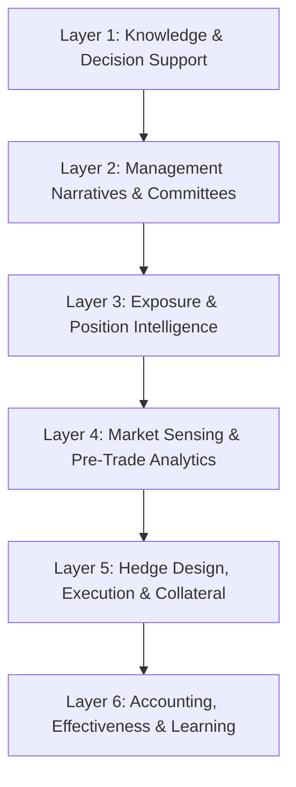

# T2: FX, Rates & Hedging Analysis

## Overview

FX, Rates & Hedging Analysis is the risk management backbone of treasury operations in downstream oil & gas. AI-powered solutions enable real-time exposure aggregation, market regime detection, optimal hedge design, automated execution, and continuous effectiveness monitoring across FX, interest rate, and commodity risks.

This tower organizes **36 AI use cases** across **6 functional layers**:



| Layer | Focus | Use Cases |
|-------|-------|-----------|
| **L1: Knowledge & Decision Support** | Copilot layer for risk policy Q&A and complex queries | 4 |
| **L2: Management Narratives & Committees** | Risk Committee reports, exposure summaries, scenario narratives | 4 |
| **L3: Exposure & Position Intelligence** | Capture, normalize, net, time-bucket exposures (FX/IR/Commodity) | 6 |
| **L4: Market Sensing & Pre-Trade Analytics** | Market signals, regime detection, VaR/CFaR, Greeks, stress testing | 6 |
| **L5: Hedge Design, Execution & Collateral** | Instrument selection, execution workflow, margin/CSA management | 10 |
| **L6: Accounting, Effectiveness & Learning** | IFRS 9 compliance, P&L attribution, backtesting, strategy tuning | 6 |

---

## Layer 1: Knowledge & Decision Support (Copilot Layer)

This layer provides AI-powered assistants that help risk managers access hedging policies, answer complex risk queries, and navigate regulatory requirements through natural language interfaces.

### 1.1 RAG-Powered Risk Policy Q&A

**What it does:** Retrieval-Augmented Generation (RAG) system that answers questions about hedging policies, risk limits, and derivative guidelines with direct citations to source documents.

**Key Inputs:**

- Treasury risk management policies (PDF, Word, SharePoint)
- Hedging strategy documents and SOPs
- ISDA Master Agreements and CSA terms
- Regulatory guidelines (EMIR, CMB Turkey, IFRS 9)

**AI/LLM Approach:** Claude indexes all risk policy documents into a vector database. When a user asks a question, relevant document chunks are retrieved and Claude generates an answer with specific citations.

**Example Interaction:**

```
User: What are our hedge ratio limits for FX exposures?

Claude: Based on Treasury Risk Policy v4.1 (Section 3.2), FX hedge ratio
requirements are:

| Exposure Type | Minimum Hedge | Maximum Hedge | Approval |
|---------------|---------------|---------------|----------|
| USD payables (crude) | 50% | 100% | Treasury |
| EUR receivables | 30% | 80% | Treasury |
| TRY exposures | Natural only | 50% | Risk Committee |
| Emerging market FX | 0% | 50% | CFO |

Additional requirements per Section 3.2.4:
- Hedge tenor must not exceed underlying exposure tenor
- Options require Risk Committee pre-approval if premium >$100K
- Natural hedges must be documented and monitored quarterly

📎 Sources: Risk_Policy_v4.1.pdf (pages 18-21), FX_Hedging_SOP.docx
```

**Outputs:**

- Instant answers with document citations
- Policy interpretation guidance
- Links to source documents
- Suggested related policies

**KPIs:**

- Answer accuracy rate (target: >95%)
- Average response time (<5 seconds)
- Policy compliance improvement rate
- User satisfaction score

---

### 1.2 Multi-Step Agent for Complex Risk Queries

**What it does:** An agentic AI that can browse multiple systems, validate exposures, calculate risk metrics, and synthesize complex risk queries requiring multi-step reasoning.

**Key Inputs:**

- Access to ETRM, TMS, ERP systems
- Real-time market data feeds (FX, rates, commodities)
- Historical hedge performance databases
- User query context and role permissions

**AI/LLM Approach:** Claude operates as an autonomous agent that breaks complex queries into sub-tasks, executes each step (exposure pulls, risk calculations, scenario analysis), and synthesizes a comprehensive answer.

**Example Interaction:**

```
User: Why did our FX hedge P&L underperform by $2M this month,
and what should we do about it?

Claude: I'll analyze this variance for you. Let me check multiple sources...

📊 **FX Hedge P&L Analysis Complete**

**Finding: $2.1M negative variance identified**

| Factor | Contribution | Root Cause |
|--------|--------------|------------|
| Basis risk | -$1.2M | Urals-Brent spread widened to $8 vs $3 hedged |
| Timing mismatch | -$0.5M | Cargo delays shifted exposures to next month |
| Rate deviation | -$0.3M | TRY depreciated 3% faster than forward implied |
| Execution slippage | -$0.1M | Large order moved market 2bps |

**Recommended Actions:**

1. **Immediate**: Adjust hedge ratios for Urals exposure (add basis swap)
2. **This week**: Review cargo-to-hedge synchronization process
3. **Policy change**: Consider TRY option collars vs forwards

**Risk if no action**: Projected $1.5M additional variance next month
if Urals spread remains elevated.

Shall I prepare the basis swap recommendation for Risk Committee?
```

**Outputs:**

- Comprehensive variance analysis
- Root cause identification
- Actionable recommendations
- Draft proposals for approval

**KPIs:**

- Query resolution rate without escalation
- Time saved vs. manual analysis
- Recommendation acceptance rate
- Variance explanation accuracy

---

### 1.3 Derivative Instrument Advisor

**What it does:** Provides guidance on derivative instruments (forwards, options, swaps) including pricing mechanics, accounting treatment, and suitability for specific hedging objectives.

**Key Inputs:**

- Derivative product specifications
- Current market conditions and pricing
- Accounting treatment rules (IFRS 9)
- Company risk appetite parameters

**AI/LLM Approach:** Claude combines product knowledge with real-time market context to explain instruments and recommend suitable structures for hedging needs.

**Example Interaction:**

```
User: Should we use options or forwards to hedge our Q2 USD exposure?

Claude: Let me analyze both alternatives for your $85M Q2 USD exposure:

**FORWARD vs OPTION ANALYSIS**

| Factor | Forward | Put Option | Collar |
|--------|---------|------------|--------|
| Protection level | 100% | 100% downside | 100% downside |
| Upside participation | 0% | 100% | Capped at cap strike |
| Upfront cost | $0 | $1.2M (1.4%) | $0 (zero-cost) |
| Accounting | Cash flow hedge | Complex | Cash flow hedge |
| Mark-to-market vol | High | Lower | Moderate |

**CURRENT MARKET CONDITIONS**

- USD/TRY 1M implied vol: 28% (elevated vs 22% avg)
- Forward points: 2.5% premium (TRY carry)
- Put/Call skew: Puts expensive (market expects TRY weakness)

**RECOMMENDATION: Zero-Cost Collar**

Given:
1. High implied vol makes buying puts expensive
2. Your budget is premium-neutral
3. Accepting cap at 36.50 (5% above spot) is tolerable

Structure: Buy 34.50 put, Sell 36.50 call
- Full protection below 34.50
- Participate up to 36.50
- Zero premium

Shall I get dealer quotes for this structure?
```

**Outputs:**

- Instrument comparison analysis
- Market condition assessment
- Structure recommendations
- Dealer quote requests

**KPIs:**

- Recommendation quality (user feedback)
- Cost savings from optimal structures
- Hedge accounting qualification rate
- Time to decision

---

### 1.4 Regulatory Compliance Q&A Assistant

**What it does:** Specialized Q&A assistant focused on derivative regulatory requirements including EMIR reporting, CMB Turkey disclosures, and IFRS 9 hedge accounting rules.

**Key Inputs:**

- EMIR regulatory texts and guidance
- CMB Turkey derivative regulations
- IFRS 9 hedge accounting standards
- Historical regulatory filings

**AI/LLM Approach:** Claude is trained on regulatory documents with emphasis on practical interpretation, deadlines, and compliance checklists.

**Example Interaction:**

```
User: What are our EMIR reporting obligations for this FX forward?

Claude: For your EUR/USD forward (notional €25M, 6-month tenor),
here are the EMIR obligations:

**EMIR REPORTING REQUIREMENTS**

✅ **Trade Reporting (Article 9)**
- Report to: DTCC or other registered TR
- Deadline: T+1 (next business day)
- UTI: Generate unique transaction identifier
- LEI: Use Tüpraş LEI (already registered)

✅ **Clearing Assessment (Article 4)**
- This forward is NOT subject to clearing obligation
- Reason: FX forwards <spot+2 days excluded
- Your forward: 6M tenor = Bilateral only

✅ **Risk Mitigation (Article 11)**
- Timely confirmation: Within T+1
- Portfolio reconciliation: Monthly (>100 trades)
- Dispute resolution: Document procedure
- Portfolio compression: Not required (<500 trades)

✅ **Margin Requirements**
- VM required: Yes (exchange daily)
- IM required: Check threshold (€8bn AUM)
- Your status: Likely below IM threshold

**UPCOMING DEADLINE**
Next EMIR Refit reporting: New fields required from Jan 2024

Need me to generate the trade report template?
```

**Outputs:**

- Regulatory obligation checklists
- Deadline tracking
- Compliance status assessment
- Report templates

**KPIs:**

- Zero regulatory breaches
- Filing timeliness (100% on-time)
- Audit finding reduction
- Query resolution time

---

## Layer 2: Management Narratives & Committees

This layer automates the creation of risk committee reports, exposure summaries, and narrative explanations for board and executive briefings.

### 2.1 Risk Committee Report Drafter

**What it does:** Automatically generates Risk Committee reports with key risk metrics, hedge portfolio performance, limit utilization, and forward-looking commentary.

**Key Inputs:**

- Current FX, IR, and commodity exposures
- Hedge portfolio positions and valuations
- Policy limits and utilization metrics
- Market data and forecasts
- Previous Risk Committee reports for style consistency

**AI/LLM Approach:** Claude aggregates data from multiple sources, calculates key metrics, identifies noteworthy items, and generates narrative commentary in the organization's established reporting style.

**Example Interaction:**

```
User: Generate this month's Risk Committee hedging summary.

Claude: Here's the draft Risk Committee Report for January 2025:

═══════════════════════════════════════════════════════════════
           MONTHLY RISK & HEDGING REPORT - RISK COMMITTEE
═══════════════════════════════════════════════════════════════

**EXECUTIVE SUMMARY**
Overall risk position remains within policy limits. Key developments:

• Total hedge book notional: $1.2B (FX: $650M, Comm: $480M, IR: $70M)
• Hedge P&L MTD: +$3.2M (FX: +$5.1M, Comm: -$1.9M)
• All exposures within policy limits; no breaches

**RISK METRICS DASHBOARD**

| Metric | Current | Limit | Utilization | Status |
|--------|---------|-------|-------------|--------|
| FX VaR (95%, 1-day) | $2.8M | $5.0M | 56% | ✅ |
| Commodity VaR | $4.2M | $8.0M | 53% | ✅ |
| Interest Rate DV01 | $85K | $150K | 57% | ✅ |
| Counterparty (Bank A) | $95M | $120M | 79% | 🟡 |
| Total Derivative Notional | $1.2B | $2.0B | 60% | ✅ |

**FX EXPOSURE & HEDGING**

| Currency | Gross Exposure | Hedge | Net Open | Policy |
|----------|----------------|-------|----------|--------|
| USD | $850M payable | 72% | $238M | 50-100% ✅ |
| EUR | €120M receivable | 65% | €42M | 30-80% ✅ |
| TRY | ₺2.1B mixed | 0% | ₺2.1B | Natural ✅ |

**ITEMS REQUIRING DISCUSSION**

1. **Bank A Concentration (79% of limit)**
   - Driven by recent forward rollovers
   - Recommendation: Shift €50M hedges to Bank B

2. **Q2 Crude Hedge Gap**
   - Only 45% hedged vs 60% target
   - Recommendation: Execute 15% via ICE Brent swaps

3. **TRY Volatility**
   - 30-day realized vol at 35% (elevated)
   - No hedge action recommended per policy

**FORWARD OUTLOOK**
No limit breaches expected under base case. Stress scenario
(TRY -15%, Brent +$10) shows VaR at 78% utilization.

───────────────────────────────────────────────────────────────
Prepared by: Treasury AI Assistant | Review required before distribution
```

**Outputs:**

- Draft Risk Committee report
- Key metrics dashboard
- Highlighted items for discussion
- Forward-looking commentary

**KPIs:**

- Report preparation time (days → hours)
- Executive revision rate
- Metric accuracy (100% target)
- Stakeholder satisfaction

---

### 2.2 FX & Commodity Exposure Summarizer

**What it does:** Consolidates and summarizes exposures across FX, interest rates, and commodities with policy compliance status and trend analysis.

**Key Inputs:**

- Exposure data by risk type and tenor
- Policy limits and thresholds
- Historical exposure trends
- Hedge coverage ratios

**AI/LLM Approach:** Claude consolidates multi-dimensional exposure data, compares against limits, and generates executive summaries with traffic-light indicators.

**Example Interaction:**

```
User: Summarize our current market risk exposures for the CFO.

Claude: **MARKET RISK EXPOSURE SUMMARY**
As of: January 15, 2025

**EXPOSURE BY RISK TYPE**

| Risk Type | Gross Exposure | Net (After Hedge) | Trend |
|-----------|----------------|-------------------|-------|
| FX - USD | $850M | $238M | ↑ +5% |
| FX - EUR | €120M | €42M | → stable |
| Commodity - Crude | 2.5M bbl | 0.8M bbl | ↓ -10% |
| Commodity - Products | 1.8M MT | 1.2M MT | → stable |
| Interest Rate | $450M floating | $380M floating | → stable |

**HEDGE EFFECTIVENESS (Last 12 Months)**

| Risk | Target | Actual | Variance Reduced |
|------|--------|--------|------------------|
| FX USD | 70% | 68% | 82% of P&L vol |
| Crude | 60% | 58% | 75% of margin vol |
| Interest | 50% fixed | 45% fixed | 65% of cost vol |

**KEY OBSERVATIONS**

✅ **Strengths**
- USD hedge coverage improved from 65% to 72%
- Commodity hedges locked in $18/bbl avg crack margin

⚠️ **Attention Areas**
- EUR hedge ratio at lower bound (65% vs 30-80% policy)
- Q2 crude coverage gap needs execution

📊 **12-Month Trend**
Net FX exposure reduced 15% through natural hedge optimization
and improved hedge timing.
```

**Outputs:**

- Multi-risk exposure dashboard
- Hedge effectiveness metrics
- Trend analysis
- Action recommendations

**KPIs:**

- Exposure data accuracy
- Report generation time
- Policy compliance visibility
- Trend prediction accuracy

---

### 2.3 Scenario Narrative Generator

**What it does:** Creates executive-ready narrative explanations of risk scenario results, explaining complex multi-factor scenarios in business terms.

**Key Inputs:**

- Stress test results and scenario definitions
- P&L impact calculations by risk factor
- Hedge performance under scenarios
- Historical scenario comparisons

**AI/LLM Approach:** Claude translates technical stress test outputs into clear business narratives, contextualizes impacts, and explains recommended responses.

**Example Interaction:**

```
User: Write the narrative for our "Oil Price Shock + TRY Crisis" scenario.

Claude: **STRESS SCENARIO NARRATIVE: OIL SHOCK + TRY CRISIS**

**Scenario Definition**
This scenario models a combined shock:
- Brent crude: +$25/bbl (from $80 to $105) sustained 90 days
- USD/TRY: +20% depreciation (from 34 to 41)
- Turkish interest rates: +500bps policy rate hike

**Business Context**
This scenario reflects conditions similar to 2022 energy crisis
combined with 2018 TRY stress. While severe, it represents a
plausible tail risk that treasury must prepare for.

**Impact Assessment**

The combined shock creates offsetting effects but net negative:

| Impact Driver | P&L Effect | Timing |
|---------------|------------|--------|
| Crude cost increase (unhedged) | -$45M | Immediate |
| Refining margin improvement | +$28M | Lagged 30 days |
| TRY revenue translation gain | +$15M | Immediate |
| TRY cost inflation | -$8M | 60-90 days |
| Margin call cash requirement | -$35M liquidity | Day 1-5 |
| **Net P&L Impact** | **-$10M** | |
| **Peak Liquidity Need** | **$35M** | |

**Hedge Portfolio Performance**

| Hedge Type | Notional | Scenario P&L | Effectiveness |
|------------|----------|--------------|---------------|
| Crude swaps (60% hedged) | $320M | +$18M | ✅ Performed |
| FX forwards (72% hedged) | $450M | +$12M | ✅ Performed |
| IR swaps | $70M | -$2M | ⚠️ MTM loss |

**Contingency Response**

To maintain operations through the scenario:

1. **Day 1**: Draw $25M from RCF-A for margin
2. **Week 1**: Accelerate TRY receivables collection
3. **Month 1**: Consider unwinding 20% of crude hedges at profit

**Board Assurance**
Even under this severe combined scenario, the company maintains
adequate liquidity with hedges reducing P&L impact by 65%.
```

**Outputs:**

- Executive scenario narratives
- Plain-language impact explanations
- Hedge performance assessment
- Contingency recommendations

**KPIs:**

- Narrative clarity score
- Board question reduction
- Scenario coverage completeness
- Time to produce narratives

---

### 2.4 Risk Attribution & Variance Explainer

**What it does:** Decomposes hedge P&L and risk metric changes by driver (market moves, basis, timing, execution) to explain what caused performance deviations.

**Key Inputs:**

- Hedge P&L actuals vs budget
- Market data changes
- Transaction-level detail
- Execution timestamps and rates

**AI/LLM Approach:** Claude performs multi-factor attribution analysis, isolating each driver's contribution and generating explanatory commentary.

**Example Interaction:**

```
User: Explain why our Q4 hedge P&L was $5M below budget.

Claude: **HEDGE P&L ATTRIBUTION - Q4 2024**

Total Variance: -$5.2M (Budget: +$8M, Actual: +$2.8M)

**WATERFALL DECOMPOSITION**

Budget Starting Point              +$8.0M
                                      │
├─ Market Move Deviation           -$2.1M
│  └─ USD/TRY moved 8% vs 12% budgeted
│
├─ Basis Risk                      -$1.8M
│  ├─ Urals-Brent: -$1.2M (spread widened)
│  └─ Crack spread: -$0.6M (diesel weak)
│
├─ Timing Mismatch                 -$0.8M
│  └─ Hedge tenors vs actual cargo dates
│
├─ Hedge Ratio Deviation           -$0.3M
│  └─ Under-hedged EUR by 5%
│
├─ Execution Costs                 -$0.2M
│  └─ Market impact on large orders
│
└─ Actual Result                   +$2.8M

**KEY INSIGHTS**

1. **Market direction correct but magnitude wrong** (40%)
   - USD/TRY hedges were directionally right
   - Budgeted larger move than occurred
   - Recommendation: Use probability-weighted scenarios

2. **Basis risk is the controllable factor** (35%)
   - Urals-Brent widening was unhedged
   - Recommendation: Add basis swap program

3. **Timing is structural** (15%)
   - Cargo delays are operational, not treasury
   - Recommendation: Improve ops-treasury coordination

**FORECAST ACCURACY IMPACT**
- Q4 hedge budget MAPE: 65%
- Recommendation: Revise hedge budget methodology
```

**Outputs:**

- Waterfall P&L decomposition
- Driver-level attribution
- Trend identification
- Process improvement recommendations

**KPIs:**

- Attribution accuracy (reconciles to total)
- Variance explanation speed
- Budget methodology improvement
- Management understanding score

---

## Layer 3: Exposure & Position Intelligence

This layer captures, normalizes, nets, and time-buckets exposures across FX, interest rates, and commodities to provide a consolidated view of risk positions.

### 3.1 Multi-Currency Exposure Aggregator

**What it does:** Automatically consolidates FX exposures from ERP (AR/AP), TMS (debt/investments), and ETRM (trading) into a unified exposure database with netting across entities.

**Key Inputs:**

- SAP AR/AP by currency and due date
- Debt instruments by currency and rate type
- Trading positions (crude purchases, product sales)
- Intercompany balances and planned dividends
- FX rates for consolidation

**AI/LLM Approach:** Claude aggregates multi-source data, applies netting rules, and provides real-time exposure queries with drill-down capability.

**Example Interaction:**

```
User: What is our consolidated USD exposure for Q2?

Claude: **CONSOLIDATED USD EXPOSURE - Q2 2025**

**GROSS EXPOSURE BY SOURCE**

| Source | Payable | Receivable | Net |
|--------|---------|------------|-----|
| Crude purchases (ETRM) | $720M | - | -$720M |
| Product sales (ETRM) | - | $180M | +$180M |
| AP - Operating (SAP) | $85M | - | -$85M |
| AR - Customers (SAP) | - | $42M | +$42M |
| Debt service (TMS) | $28M | - | -$28M |
| Intercompany (SAP) | $15M | $22M | +$7M |
| **Gross Total** | **$848M** | **$244M** | **-$604M** |

**NETTING ANALYSIS**

| Netting Type | Amount | Net Exposure |
|--------------|--------|--------------|
| Gross exposure | | -$604M |
| Natural hedge (USD rev vs cost) | +$180M | -$424M |
| Intercompany netting | +$7M | -$417M |
| **Net Exposure to Hedge** | | **-$417M** |

**TIME BUCKETING**

| Month | Net Exposure | Hedged | Open |
|-------|--------------|--------|------|
| Apr | -$145M | $105M (72%) | -$40M |
| May | -$138M | $95M (69%) | -$43M |
| Jun | -$134M | $90M (67%) | -$44M |
| **Q2 Total** | **-$417M** | **$290M (70%)** | **-$127M** |

**HEDGE GAP ALERT**
Current hedge coverage 70% vs 75% target = $21M under-hedged
```

**Outputs:**

- Consolidated exposure dashboard
- Netting analysis
- Time-bucketed positions
- Hedge gap alerts

**KPIs:**

- Data completeness (100% sources captured)
- Aggregation latency (<15 min)
- Netting accuracy
- Exposure variance vs actuals

---

### 3.2 Interest Rate Exposure Dashboard

**What it does:** Aggregates all debt and interest-bearing instruments to show fixed vs floating mix, repricing schedule, and interest rate sensitivity (DV01).

**Key Inputs:**

- Debt instruments (loans, bonds, facilities)
- Interest rate swaps and hedges
- Floating rate indices and reset dates
- Yield curves for valuation

**AI/LLM Approach:** Claude consolidates debt data, calculates interest rate risk metrics, and provides interactive sensitivity analysis.

**Example Interaction:**

```
User: Show me our interest rate exposure profile.

Claude: **INTEREST RATE EXPOSURE DASHBOARD**
As of: January 15, 2025

**DEBT PORTFOLIO SUMMARY**

| Category | Amount | % of Total | Avg Rate |
|----------|--------|------------|----------|
| Fixed rate debt | $280M | 62% | 5.8% |
| Floating rate debt | $170M | 38% | SOFR+120bps |
| **Total Debt** | **$450M** | **100%** | **5.2% blended** |

**FLOATING RATE DETAIL**

| Facility | Amount | Index | Spread | Next Reset |
|----------|--------|-------|--------|------------|
| RCF-A (Citi) | $80M | SOFR | +85bps | Feb 15 |
| Term Loan B | $60M | SOFR | +150bps | Mar 1 |
| Working Capital | $30M | SOFR | +175bps | Monthly |

**INTEREST RATE SENSITIVITY**

| Metric | Value | Limit | Status |
|--------|-------|-------|--------|
| DV01 (1bp parallel shift) | $85,000 | $150,000 | ✅ 57% |
| Annual cost per +100bps | $1.7M | - | - |
| Duration (years) | 3.2 | - | - |

**REPRICING SCHEDULE**

| Period | Repricing Amount | Cumulative |
|--------|------------------|------------|
| 0-3 months | $110M | 24% |
| 3-6 months | $60M | 38% |
| 6-12 months | $0 | 38% |
| 1-3 years | $120M | 64% |
| 3+ years | $160M | 100% |

**SCENARIO ANALYSIS**

| Scenario | Interest Cost Impact |
|----------|---------------------|
| +100bps parallel | +$1.7M/year |
| +200bps parallel | +$3.4M/year |
| Curve steepening +50bps | +$0.5M/year |
```

**Outputs:**

- Fixed/floating debt breakdown
- Repricing schedule
- DV01 and duration metrics
- Scenario sensitivity analysis

**KPIs:**

- Data accuracy (reconcile to GL)
- Update frequency (daily)
- Sensitivity calculation accuracy
- Coverage of all instruments

---

### 3.3 Commodity Exposure Tracker

**What it does:** Aggregates commodity exposures (crude purchases, product sales, inventory) and calculates net position by product, tenor, and pricing basis.

**Key Inputs:**

- ETRM trading positions
- Inventory levels by product
- Production and sales forecasts
- Pricing formulas and basis
- Market forward curves

**AI/LLM Approach:** Claude consolidates commodity data from multiple sources, applies pricing formulas, and provides exposure views by risk factor.

**Example Interaction:**

```
User: What is our commodity exposure for next quarter?

Claude: **COMMODITY EXPOSURE TRACKER - Q2 2025**

**CRUDE OIL EXPOSURE**

| Category | Volume (bbl) | Pricing Basis | USD Exposure |
|----------|--------------|---------------|--------------|
| Purchases - Urals | 2.1M | Dated Brent -$2 | $168M |
| Purchases - Azeri | 0.4M | Dated Brent +$1 | $33M |
| **Total Crude** | **2.5M** | | **$201M** |

**PRODUCT EXPOSURE (Sales)**

| Product | Volume (MT) | Pricing | USD Exposure |
|---------|-------------|---------|--------------|
| Diesel | 850K | Platts FOB Med | $72M |
| Gasoline | 620K | Platts CIF NWE | $54M |
| Jet Fuel | 180K | Platts FOB Med | $16M |
| Fuel Oil | 150K | Platts 380cst | $8M |
| **Total Products** | **1.8M** | | **$150M** |

**NET POSITION (Crack Spread View)**

| Metric | Volume | Equivalent |
|--------|--------|------------|
| Crude long | 2.5M bbl | -$201M exposure |
| Products short | 1.8M MT | +$150M exposure |
| Net refining margin exposed | | $51M at risk |

**BASIS RISK ANALYSIS**

| Basis | Exposure | Hedged | Open |
|-------|----------|--------|------|
| Urals-Brent differential | $168M | $0 | $168M ⚠️ |
| Crack spread (3-2-1) | $51M | $35M | $16M |
| Product timing | $25M | $0 | $25M |

**HEDGE COVERAGE**

| Exposure | Target | Current | Gap |
|----------|--------|---------|-----|
| Crude price | 60% | 55% | -5% |
| Crack spread | 50% | 68% | +18% ✅ |
| Basis (Urals) | 30% | 0% | -30% ⚠️ |
```

**Outputs:**

- Crude and product exposure summary
- Net position by risk factor
- Basis risk identification
- Hedge coverage vs target

**KPIs:**

- Volume reconciliation accuracy
- Pricing basis accuracy
- Hedge gap identification
- Real-time position updates

---

### 3.4 Natural Hedge Identifier

**What it does:** Analyzes correlations between exposures (e.g., USD/TRY vs oil price) to identify natural hedges that can reduce the need for financial derivatives.

**Key Inputs:**

- FX exposure by currency
- Commodity exposure by product
- Historical correlation data
- Revenue/cost currency breakdown

**AI/LLM Approach:** Claude performs correlation analysis, quantifies natural hedge effectiveness, and recommends adjustments to leverage natural offsets.

**Example Interaction:**

```
User: What natural hedges do we have between FX and commodities?

Claude: **NATURAL HEDGE ANALYSIS**

**IDENTIFIED NATURAL HEDGES**

| Relationship | Correlation | Offset Value | Effectiveness |
|--------------|-------------|--------------|---------------|
| Oil ↑ → USD/TRY ↑ | 0.72 | ~$45M/month | High |
| EUR/USD ↔ Product prices | 0.35 | ~$8M/month | Moderate |
| Urals spread ↔ Freight | -0.28 | ~$3M/month | Low |

**OIL-FX NATURAL HEDGE (Primary)**

When Brent rises $10/bbl:
- Crude cost increases: +$25M (negative)
- USD/TRY typically rises 3-4%: +$18M (positive on TRY costs)
- **Natural offset: ~70% of crude cost increase**

```
Historical Backtest (24 months):
─────────────────────────────────────
Oil price change    FX offset captured
    +$20/bbl             65%
    +$10/bbl             72%
    -$10/bbl             68%
    -$20/bbl             58%
─────────────────────────────────────
Average effectiveness: 66%
```

**RECOMMENDATIONS**

1. **Reduce USD hedge ratio by 10-15%**
   - Current: 75% hedged
   - With natural hedge: 60-65% sufficient
   - Savings: ~$200K/year in forward costs

2. **Monitor correlation stability**
   - Set alert if 30-day correlation drops below 0.5
   - Current: 0.72 (healthy)

3. **Document for hedge accounting**
   - Natural hedge can support IFRS 9 economic relationship
   - Prepare contemporaneous documentation

**CORRELATION BREAKDOWN RISK**

Historical correlation breakdown events:
- Q1 2022: Oil spike but TRY intervention (correlation = 0.15)
- Recommendation: Maintain 50% minimum FX hedge as backstop
```

**Outputs:**

- Natural hedge identification
- Correlation analysis
- Hedge ratio recommendations
- Correlation monitoring alerts

**KPIs:**

- Natural hedge savings quantified
- Correlation prediction accuracy
- Breakdown event detection
- Documentation compliance

---

### 3.5 Exposure Forecaster (Rolling 12-Month)

**What it does:** Projects future exposures based on business forecasts, contracts, and seasonal patterns to enable proactive hedging decisions.

**Key Inputs:**

- Sales and procurement forecasts
- Contract commitments
- Historical seasonal patterns
- Business plan assumptions

**AI/LLM Approach:** Claude combines deterministic (contracted) and probabilistic (forecast) exposures to generate rolling exposure projections with confidence intervals.

**Example Interaction:**

```
User: Project our FX exposure for the next 12 months.

Claude: **FX EXPOSURE FORECAST - Rolling 12 Months**

**USD EXPOSURE PROJECTION**

| Quarter | Contracted | Forecast | Total | Confidence |
|---------|------------|----------|-------|------------|
| Q1 2025 | -$380M | -$45M | -$425M | 95% |
| Q2 2025 | -$320M | -$97M | -$417M | 85% |
| Q3 2025 | -$180M | -$215M | -$395M | 70% |
| Q4 2025 | -$120M | -$290M | -$410M | 55% |

**EXPOSURE DRIVERS**

```
Q1 2025 Breakdown:
──────────────────────────────────────────────
Crude term contracts      -$350M (committed)
Spot crude estimate        -$30M (forecast)
Operating costs            -$25M (recurring)
Debt service               -$20M (scheduled)
──────────────────────────────────────────────
```

**SEASONALITY PATTERN**

| Factor | Q1 | Q2 | Q3 | Q4 |
|--------|----|----|----|----|
| Crude demand | High | Med | Med | High |
| Product sales | Low | High | High | Med |
| Net exposure | -$425M | -$417M | -$395M | -$410M |

**FORECAST RISK ANALYSIS**

| Scenario | Q2 Exposure | Change |
|----------|-------------|--------|
| Base case | -$417M | - |
| High crude run (+10%) | -$459M | -$42M |
| Low crude run (-10%) | -$375M | +$42M |
| Price spike (+$15/bbl) | -$480M | -$63M |

**HEDGING RECOMMENDATION**

| Horizon | Recommended | Current | Action |
|---------|-------------|---------|--------|
| 0-3 months | 80% | 75% | Add $21M |
| 3-6 months | 65% | 55% | Add $42M |
| 6-12 months | 50% | 30% | Add $79M |
```

**Outputs:**

- Rolling exposure forecast
- Confidence intervals
- Seasonality analysis
- Hedging recommendations

**KPIs:**

- Forecast accuracy (MAPE)
- Confidence calibration
- Lead time for hedge decisions
- Coverage optimization

---

### 3.6 Counterparty Exposure Monitor

**What it does:** Tracks derivative counterparty exposures including MTM values, potential future exposure (PFE), and concentration against credit limits.

**Key Inputs:**

- Derivative positions by counterparty
- Current MTM valuations
- Counterparty credit ratings and limits
- CSA/ISDA terms (thresholds, collateral)
- Market volatility for PFE calculation

**AI/LLM Approach:** Claude monitors real-time counterparty exposures, calculates PFE using Monte Carlo simulation, and alerts on limit breaches.

**Example Interaction:**

```
User: Show me our derivative counterparty exposure.

Claude: **COUNTERPARTY EXPOSURE MONITOR**
As of: January 15, 2025

**EXPOSURE BY COUNTERPARTY**

| Bank | MTM | PFE (95%) | Total Exp | Limit | Util |
|------|-----|-----------|-----------|-------|------|
| Bank A | +$12M | $18M | $30M | $50M | 60% ✅ |
| Bank B | +$8M | $14M | $22M | $40M | 55% ✅ |
| Bank C | -$5M | $12M | $7M | $30M | 23% ✅ |
| Bank D | +$3M | $8M | $11M | $25M | 44% ✅ |
| ICE Clear | +$15M | $25M | $40M | $80M | 50% ✅ |
| **Total** | **+$33M** | **$77M** | **$110M** | | |

**CONCENTRATION ANALYSIS**

| Metric | Value | Limit | Status |
|--------|-------|-------|--------|
| Largest single counterparty | $40M (ICE) | $80M | ✅ |
| Top 3 concentration | 82% | 90% | ✅ |
| Unrated counterparties | $0 | $10M | ✅ |

**COLLATERAL POSITION**

| Counterparty | Collateral Held | Collateral Posted | Net |
|--------------|-----------------|-------------------|-----|
| Bank A | $5M | $0 | +$5M |
| Bank B | $3M | $0 | +$3M |
| Bank C | $0 | $2M | -$2M |
| ICE Clear | $0 | $12M | -$12M |

**PFE STRESS SCENARIO**

If volatility doubles (2x current):
| Counterparty | Current PFE | Stressed PFE | Limit |
|--------------|-------------|--------------|-------|
| Bank A | $18M | $32M | $50M ✅ |
| Bank B | $14M | $25M | $40M ✅ |
| ICE Clear | $25M | $45M | $80M ✅ |

**ALERTS**
⚠️ Bank A approaching 70% threshold - monitor closely
✅ All counterparties within risk appetite
```

**Outputs:**

- Counterparty exposure dashboard
- PFE calculations
- Concentration analysis
- Collateral position summary

**KPIs:**

- Zero counterparty limit breaches
- PFE model accuracy
- Collateral optimization
- Concentration monitoring

---

## Layer 4: Market Sensing & Pre-Trade Analytics

This layer provides market intelligence, regime detection, and pre-trade risk analytics including VaR, CFaR, Greeks, and stress testing to inform hedging decisions.

### 4.1 Market Regime Detection Engine

**What it does:** Uses AI to detect shifts in market regimes (trending, mean-reverting, volatile) for FX, rates, and commodities, alerting treasury to adapt hedging strategies.

**Key Inputs:**

- Real-time and historical price data
- Implied and realized volatility
- Volume and liquidity metrics
- Macroeconomic indicators

**AI/LLM Approach:** Claude uses Hidden Markov Models and deep learning to classify market regimes and predict transitions, generating actionable alerts.

**Example Interaction:**

```
User: What is the current regime for USD/TRY and Brent?

Claude: **MARKET REGIME ANALYSIS**
As of: January 15, 2025

**USD/TRY REGIME**

| Metric | Current | 30-Day Avg | Signal |
|--------|---------|------------|--------|
| Regime | TRENDING UP | - | 🔴 |
| Realized Vol | 32% | 28% | Elevated |
| Implied Vol | 35% | 30% | Premium |
| Trend Strength | 0.78 | 0.45 | Strong |

```
Regime Probability Distribution:
├─ Trending Up:   78% ████████████████░░░░
├─ Mean-Revert:   15% ███░░░░░░░░░░░░░░░░░
└─ High Vol:       7% █░░░░░░░░░░░░░░░░░░░
```

**HEDGING IMPLICATION (USD/TRY)**
- Current regime favors forwards over options
- Trend continuation probability: 78%
- Recommended: Accelerate hedge execution
- Avoid: Short-dated options (high premium)

**BRENT CRUDE REGIME**

| Metric | Current | 30-Day Avg | Signal |
|--------|---------|------------|--------|
| Regime | RANGE-BOUND | - | 🟢 |
| Realized Vol | 22% | 25% | Normal |
| Implied Vol | 24% | 26% | Fair |
| Range | $78-$85 | - | Stable |

```
Regime Probability Distribution:
├─ Range-Bound:   65% █████████████░░░░░░░
├─ Breakout Up:   20% ████░░░░░░░░░░░░░░░░
└─ Breakout Down: 15% ███░░░░░░░░░░░░░░░░░
```

**HEDGING IMPLICATION (Brent)**
- Current regime favors collars or range forwards
- Options relatively cheap (vol below avg)
- Recommended: Buy downside protection
- Avoid: Over-hedging at current levels

**REGIME CHANGE ALERTS**
⚠️ Watch: Brent approaching resistance at $85
   If break above, regime shifts to TRENDING UP (25% probability)
```

**Outputs:**

- Regime classification
- Transition probabilities
- Hedging strategy implications
- Regime change alerts

**KPIs:**

- Regime classification accuracy
- Transition prediction lead time
- Strategy adaptation speed
- False alert rate

---

### 4.2 FX & Commodity Sentiment Monitor

**What it does:** Analyzes news, social media, and market commentary to detect sentiment shifts that may precede price moves in FX and commodity markets.

**Key Inputs:**

- News feeds (Reuters, Bloomberg, Dow Jones)
- Central bank communications
- OPEC statements and reports
- Social media sentiment (filtered)
- Analyst reports

**AI/LLM Approach:** Claude uses NLP to extract sentiment signals, identify key events, and correlate with market movements to provide early warnings.

**Example Interaction:**

```
User: What's the current market sentiment for oil and TRY?

Claude: **MARKET SENTIMENT MONITOR**
As of: January 15, 2025 14:00 UTC

**BRENT CRUDE SENTIMENT**

| Source | Sentiment | Change (7d) | Key Driver |
|--------|-----------|-------------|------------|
| News flow | Bullish | ↑ +15% | OPEC+ cuts |
| Analyst consensus | Neutral | → 0% | Mixed outlook |
| Options positioning | Bullish | ↑ +8% | Call buying |
| **Composite Score** | **+0.35** | **↑** | **Bullish** |

**KEY STORIES DRIVING SENTIMENT**

1. 🔴 **OPEC+ extends cuts** (High Impact)
   - 500K bbl/day extension through Q2
   - Market pricing in tighter supply
   - Sentiment impact: +0.25

2. 🟡 **China PMI disappoints** (Medium Impact)
   - Manufacturing PMI at 49.2 (contraction)
   - Offsets OPEC bullishness
   - Sentiment impact: -0.10

3. 🟢 **US inventory draw** (Low Impact)
   - EIA reports -4.5M bbl (vs -2M expected)
   - Short-term supportive
   - Sentiment impact: +0.08

**USD/TRY SENTIMENT**

| Source | Sentiment | Change (7d) | Key Driver |
|--------|-----------|-------------|------------|
| News flow | Bearish TRY | ↑ +22% | Inflation data |
| CBRT signals | Hawkish | → 0% | Rate guidance |
| CDS spreads | Widening | ↑ +35bps | Risk premium |
| **Composite Score** | **-0.45** | **↓** | **TRY Bearish** |

**EARLY WARNING SIGNALS**

⚠️ **TRY Stress Indicator: ELEVATED**
- CDS spread widening +35bps in 5 days
- Foreign portfolio outflows detected
- Historical pattern: Similar signals preceded 5%+ moves

**RECOMMENDED ACTIONS**

| Risk | Sentiment | Action |
|------|-----------|--------|
| Crude | Bullish | Consider call spreads for upside |
| TRY | Bearish | Accelerate USD hedge execution |
```

**Outputs:**

- Sentiment scores by asset
- Key story identification
- Early warning signals
- Action recommendations

**KPIs:**

- Sentiment-price correlation
- Early warning accuracy
- Story relevance ranking
- Alert lead time

---

### 4.3 VaR & Cash-Flow-at-Risk Calculator

**What it does:** Calculates Value-at-Risk (VaR) and Cash-Flow-at-Risk (CFaR) for the hedge portfolio and underlying exposures to quantify potential losses.

**Key Inputs:**

- Current positions and exposures
- Historical price data
- Correlation matrices
- Confidence levels and time horizons
- Monte Carlo parameters

**AI/LLM Approach:** Claude runs parametric, historical, and Monte Carlo VaR calculations, providing decomposition by risk factor and scenario analysis.

**Example Interaction:**

```
User: Calculate our current VaR and CFaR.

Claude: **RISK METRICS REPORT**
As of: January 15, 2025

**VALUE-AT-RISK (Hedge Portfolio)**

| Metric | 1-Day | 10-Day | Method |
|--------|-------|--------|--------|
| VaR (95%) | $2.8M | $8.9M | Parametric |
| VaR (99%) | $4.1M | $13.0M | Parametric |
| VaR (95%) | $3.1M | $9.8M | Historical |
| VaR (95%) | $2.9M | $9.2M | Monte Carlo |

**VaR DECOMPOSITION BY RISK FACTOR**

| Risk Factor | Standalone | Contribution | Diversified |
|-------------|------------|--------------|-------------|
| FX (USD/TRY) | $1.8M | 45% | $1.3M |
| Commodity (Brent) | $2.2M | 35% | $1.0M |
| Interest Rates | $0.6M | 15% | $0.4M |
| Basis/Other | $0.3M | 5% | $0.1M |
| **Total** | | | **$2.8M** |

Note: Diversification benefit = $1.6M (37%) from correlations

**CASH-FLOW-AT-RISK (12-Month Horizon)**

| Scenario | Probability | Cash Flow Impact |
|----------|-------------|------------------|
| Base case | 50% | $0 |
| Moderate stress | 40% | -$15M to -$25M |
| Severe stress (95%) | 5% | -$45M |
| Extreme (99%) | 1% | -$72M |

```
CFaR Distribution (95% confidence):
────────────────────────────────────────
         ▂▃▅▆█████████████▆▅▃▂
       ─$45M        $0        +$20M
                    │
              CFaR = -$45M
```

**STRESS SCENARIOS**

| Scenario | Probability | Impact |
|----------|-------------|--------|
| Brent +$20, TRY -15% | 5% | -$28M |
| Brent -$15, TRY +10% | 8% | -$18M |
| Rate shock +200bps | 3% | -$8M |
| Correlation breakdown | 2% | -$35M |

**POLICY COMPLIANCE**

| Limit | Value | Limit | Status |
|-------|-------|-------|--------|
| 1-Day VaR (95%) | $2.8M | $5.0M | ✅ 56% |
| CFaR (95%, 12M) | $45M | $75M | ✅ 60% |
```

**Outputs:**

- VaR by method and horizon
- Risk factor decomposition
- CFaR distribution
- Stress scenario analysis

**KPIs:**

- VaR backtesting accuracy
- CFaR prediction calibration
- Policy limit compliance
- Model stability

---

### 4.4 Greeks & Sensitivity Dashboard

**What it does:** Calculates and displays option Greeks (Delta, Gamma, Vega, Theta) and linear sensitivities for the derivative portfolio to monitor risk exposures.

**Key Inputs:**

- Option positions (FX, commodity)
- Forward and swap positions
- Market data (spots, vols, rates)
- Pricing models

**AI/LLM Approach:** Claude aggregates Greeks across the portfolio, identifies concentration risks, and provides hedging recommendations for unwanted exposures.

**Example Interaction:**

```
User: Show me our portfolio Greeks and sensitivities.

Claude: **GREEKS & SENSITIVITY DASHBOARD**
As of: January 15, 2025

**FX OPTIONS GREEKS**

| Greek | USD/TRY | EUR/USD | Total USD |
|-------|---------|---------|-----------|
| Delta | -$45M | +$8M | -$37M |
| Gamma | $1.2M/% | $0.3M/% | $1.5M/% |
| Vega | -$180K/vol | +$45K/vol | -$135K/vol |
| Theta | -$25K/day | -$8K/day | -$33K/day |

**INTERPRETATION**

| Greek | Position | Meaning | Action Needed |
|-------|----------|---------|---------------|
| Delta | -$37M | Short USD | Matches exposure ✅ |
| Gamma | +$1.5M/% | Long gamma | Benefits from moves ✅ |
| Vega | -$135K/vol | Short vol | Lose if vol rises ⚠️ |
| Theta | -$33K/day | Time decay | $1M/month cost ⚠️ |

**COMMODITY SENSITIVITIES**

| Factor | Sensitivity | Interpretation |
|--------|-------------|----------------|
| Brent +$1/bbl | +$850K | Long crude exposure |
| Crack spread +$1 | +$420K | Long margin |
| Urals basis +$1 | -$280K | Short basis ⚠️ |

**INTEREST RATE SENSITIVITIES**

| Factor | DV01 | Interpretation |
|--------|------|----------------|
| SOFR +1bp | -$85K | Floating rate exposure |
| TRY rates +1bp | -$12K | Minor TRY debt |
| EUR rates +1bp | +$8K | EUR swap receiver |

**RISK CONCENTRATION ALERTS**

⚠️ **Vega Concentration**
- 80% of Vega in USD/TRY options
- Risk: Vol spike costs $135K per 1% vol increase
- Recommendation: Consider vol hedge or reduce position

⚠️ **Basis Risk Unhedged**
- Urals-Brent basis: -$280K per $1 widening
- No basis swaps in place
- Recommendation: Add $100M Urals basis swap

**SCENARIO IMPACT**

| Scenario | Delta P&L | Gamma P&L | Vega P&L | Total |
|----------|-----------|-----------|----------|-------|
| TRY -5% | +$1.85M | +$0.19M | -$0.27M | +$1.77M |
| TRY +5% | -$1.85M | +$0.19M | -$0.14M | -$1.80M |
| Vol +5% | $0 | $0 | -$0.68M | -$0.68M |
```

**Outputs:**

- Portfolio Greeks summary
- Sensitivity analysis
- Concentration alerts
- Scenario impact

**KPIs:**

- Greek calculation accuracy
- Hedging recommendation quality
- Concentration detection
- P&L prediction accuracy

---

### 4.5 Stress Test & Scenario Engine

**What it does:** Runs comprehensive stress tests across FX, rates, and commodities including historical scenarios, hypothetical shocks, and reverse stress tests.

**Key Inputs:**

- Current positions and exposures
- Historical crisis data
- Scenario definitions
- Correlation assumptions

**AI/LLM Approach:** Claude runs multi-factor scenarios, calculates cascading impacts, and generates executive summaries with contingency recommendations.

**Example Interaction:**

```
User: Run stress tests for our hedge portfolio.

Claude: **STRESS TEST RESULTS**
As of: January 15, 2025

**HISTORICAL SCENARIO REPLAY**

| Scenario | Period | P&L Impact | Liquidity |
|----------|--------|------------|-----------|
| 2022 Energy Crisis | Feb-Jun 2022 | -$28M | -$45M margin |
| 2018 TRY Crisis | Aug 2018 | -$18M | -$22M margin |
| 2020 COVID Oil Crash | Mar 2020 | +$12M | -$35M margin |
| 2008 Financial Crisis | Sep-Nov 2008 | -$42M | -$55M margin |

**HYPOTHETICAL SCENARIOS**

| Scenario | Parameters | P&L | Margin Call |
|----------|------------|-----|-------------|
| Oil Spike | Brent +$25, TRY -10% | -$15M | $28M |
| Oil Crash | Brent -$20, TRY +5% | -$22M | $18M |
| Rate Shock | +200bps global | -$8M | $5M |
| EM Crisis | TRY -25%, rates +500bp | -$35M | $42M |
| Stagflation | Oil +$15, rates +150bp | -$12M | $22M |

**WORST CASE SCENARIO DETAIL**

**Scenario: EM Crisis (TRY -25%, rates +500bp)**

| Impact Category | Amount |
|-----------------|--------|
| FX hedge MTM loss | -$22M |
| Interest cost increase | -$4M |
| Commodity hedge gain | +$5M |
| Margin call requirement | $42M |
| **Net P&L** | **-$21M** |

**Liquidity Impact**
- Day 1 margin call: $25M
- Day 2-5 additional: $17M
- Peak liquidity need: $42M
- Available facilities: $150M ✅

**REVERSE STRESS TEST**

What would cause $50M loss?
| Scenario | Probability |
|----------|-------------|
| TRY -30% + Brent flat | 3% |
| Brent +$35 + no TRY move | 2% |
| Correlation breakdown | 1% |

**CONTINGENCY TRIGGERS**

| Trigger | Action |
|---------|--------|
| TRY -15% in 5 days | Draw $30M RCF |
| Brent +$20 | Close 30% commodity hedges |
| Margin call >$40M | Execute contingency plan |
```

**Outputs:**

- Historical scenario replay
- Hypothetical stress results
- Reverse stress analysis
- Contingency triggers

**KPIs:**

- Scenario coverage
- Model accuracy (vs historical)
- Contingency plan completeness
- Stress test frequency

---

### 4.6 Pre-Trade Impact Analyzer

**What it does:** Estimates the market impact, cost, and risk metrics change from a proposed hedge trade before execution to optimize trade structure and timing.

**Key Inputs:**

- Proposed trade details
- Current market conditions
- Historical execution data
- Liquidity metrics

**AI/LLM Approach:** Claude analyzes trade size vs market liquidity, estimates slippage, calculates incremental risk metrics, and recommends optimal execution.

**Example Interaction:**

```
User: Analyze the impact of hedging $50M USD/TRY forward.

Claude: **PRE-TRADE IMPACT ANALYSIS**
Proposed Trade: Sell $50M USD/TRY 3-month forward

**MARKET CONDITIONS**

| Metric | Current | Normal | Assessment |
|--------|---------|--------|------------|
| Spot rate | 34.25 | - | - |
| 3M forward | 35.12 | - | 2.5% premium |
| Bid-ask spread | 15 pips | 10 pips | Wide |
| Daily volume | $2.1B | $2.5B | Below avg |
| Time | 14:30 | - | Pre-London close |

**EXECUTION IMPACT ESTIMATE**

| Execution Method | Est. Rate | Slippage | Cost |
|------------------|-----------|----------|------|
| Market order (full) | 35.08 | 4 pips | $5,700 |
| TWAP (2 hours) | 35.10 | 2 pips | $2,850 |
| Iceberg (10% clips) | 35.11 | 1 pip | $1,425 |
| RFQ (3 banks) | 35.115 | 0.5 pips | $715 |

**RECOMMENDATION: RFQ to 3 Banks**
- Best expected rate: 35.115
- Estimated cost: $715
- Execution time: 5 minutes
- Risk: Minimal information leakage

**RISK METRIC IMPACT**

| Metric | Before | After | Change |
|--------|--------|-------|--------|
| USD exposure | -$127M | -$77M | +$50M |
| FX VaR (95%) | $2.8M | $2.1M | -$0.7M |
| Hedge ratio | 70% | 82% | +12% |

**HEDGE ACCOUNTING IMPACT**

| Check | Status |
|-------|--------|
| Within policy limits | ✅ Yes |
| Qualifies for CFH | ✅ Yes (matched to exposure) |
| Documentation | ⚠️ Update designation memo |

**TIMING RECOMMENDATION**

| Window | Rate Forecast | Recommendation |
|--------|---------------|----------------|
| Now (14:30) | 35.12 | Acceptable |
| London fix (16:00) | 35.08-35.15 | Higher volume |
| Tomorrow AM | Unknown | Wait risk |

**OPTIMAL EXECUTION PLAN**
1. Send RFQ to Banks A, B, C at 15:45
2. Execute at best rate
3. Confirm and book by 16:00
4. Update hedge documentation
```

**Outputs:**

- Market condition assessment
- Execution cost estimates
- Risk metric impact
- Optimal execution plan

**KPIs:**

- Slippage prediction accuracy
- Cost savings vs market order
- Risk metric prediction
- Execution quality

---

## Layer 5: Hedge Design, Execution & Collateral

This layer provides hedge optimization, execution workflow automation, approval controls, and collateral/margin management capabilities.

### 5.1 Hedge Ratio Optimizer

**What it does:** Calculates optimal hedge ratios by currency, commodity, and tenor based on exposure forecasts, risk appetite, hedge costs, and correlation analysis.

**Key Inputs:**

- Exposure forecasts by tenor
- Risk appetite parameters
- Hedge instrument costs (forward points, option premiums)
- Correlation data (natural hedges)
- Policy constraints

**AI/LLM Approach:** Claude uses convex optimization to find hedge ratios that minimize risk-adjusted cost while respecting policy limits and accounting constraints.

**Example Interaction:**

```
User: What's the optimal hedge ratio for our Q2 USD exposure?

Claude: **HEDGE RATIO OPTIMIZATION - Q2 USD EXPOSURE**

**EXPOSURE PROFILE**
- Gross USD exposure: -$417M (payable)
- Natural hedge offset: +$180M (USD revenues)
- Net exposure to hedge: -$237M

**OPTIMIZATION PARAMETERS**

| Parameter | Value |
|-----------|-------|
| Risk appetite | Moderate (50% variance reduction) |
| Hedge cost budget | $500K (implied) |
| Policy min/max | 50% / 100% |
| Accounting | Cash flow hedge eligible |

**OPTIMIZATION RESULTS**

```
Cost-Risk Efficient Frontier:
────────────────────────────────────────────
Risk │     ●─────────────○ Optimal
     │   ●               ○
     │ ●              ○
     │●           ○
     │        ○
     └──────────────────────────────────────
        0%    25%    50%    75%   100%
                  Hedge Ratio
────────────────────────────────────────────
```

| Hedge Ratio | Variance Reduction | Cost | Risk-Adj Score |
|-------------|-------------------|------|----------------|
| 50% (min) | 42% | $180K | 0.72 |
| 65% | 55% | $290K | 0.81 |
| **72% (optimal)** | **62%** | **$360K** | **0.85** |
| 85% | 71% | $480K | 0.79 |
| 100% (max) | 78% | $620K | 0.68 |

**OPTIMAL RECOMMENDATION: 72%**

| Month | Exposure | Hedge | Open |
|-------|----------|-------|------|
| Apr | -$85M | $61M | -$24M |
| May | -$78M | $56M | -$22M |
| Jun | -$74M | $53M | -$21M |
| **Total** | **-$237M** | **$170M** | **-$67M** |

**RATIONALE**
- Natural hedge provides ~40% offset
- 72% financial hedge on remaining achieves 62% variance reduction
- Marginal cost of hedging beyond 72% exceeds marginal benefit
- Aligns with moderate risk appetite

**SENSITIVITY ANALYSIS**

| If... | Optimal Ratio Changes To |
|-------|-------------------------|
| Vol +25% | 78% (more hedge value) |
| Correlation breaks | 85% (less natural hedge) |
| Budget tighter | 65% (cost constrained) |
```

**Outputs:**

- Optimal hedge ratio by tenor
- Efficient frontier analysis
- Cost-benefit breakdown
- Sensitivity analysis

**KPIs:**

- Variance reduction achieved
- Hedge cost efficiency
- Policy compliance
- Model accuracy (backtest)

---

### 5.2 Instrument Selection Recommender

**What it does:** Recommends optimal hedging instruments (forwards, options, swaps, collars) based on market conditions, accounting requirements, and risk preferences.

**Key Inputs:**

- Market data (spots, forwards, volatilities)
- Risk profile (symmetric vs asymmetric)
- Budget constraints
- Hedge accounting requirements
- Policy guidelines

**AI/LLM Approach:** Claude evaluates instrument alternatives, prices structures, and recommends based on cost-effectiveness and strategic fit.

**Example Interaction:**

```
User: What instrument should we use to hedge $80M USD exposure?

Claude: **INSTRUMENT SELECTION ANALYSIS**
Exposure: $80M USD payable, 6-month tenor

**INSTRUMENT COMPARISON**

| Instrument | Rate/Cost | Protection | Upside | Accounting |
|------------|-----------|------------|--------|------------|
| Forward | 35.85 | 100% both ways | None | CFH ✅ |
| Put option | 2.8% premium | 100% below 34.50 | Full | Complex |
| Collar (ZC) | 34.20-36.50 | Below 34.20 | To 36.50 | CFH ✅ |
| Seagull | 0.5% net | Below 34.00 | To 36.00 | Complex |
| Par forward | 35.85 avg | 100% avg rate | None | CFH ✅ |

**CURRENT MARKET CONDITIONS**

| Factor | Level | Implication |
|--------|-------|-------------|
| Implied vol | 28% | Elevated → Options expensive |
| Forward points | +1.60 | High carry → Forwards costly |
| Skew | Puts +3 vol | Bearish tilt → Puts pricey |
| Liquidity | Good | All instruments available |

**SCENARIO ANALYSIS**

| Scenario | Forward | Put | Collar | Best |
|----------|---------|-----|--------|------|
| TRY -10% (to 37.68) | 35.85 | 35.85 | 36.50 | Forward |
| TRY -20% (to 41.10) | 35.85 | 35.85 | 36.50 | Forward |
| TRY +5% (to 32.54) | 35.85 | 32.54 | 32.54 | Put/Collar |
| TRY flat | 35.85 | 35.77 | 34.25 | Collar |

**RECOMMENDATION: ZERO-COST COLLAR**

Structure:
- Buy $80M USD Put @ 34.20 (4.8% OTM)
- Sell $80M USD Call @ 36.50 (6.5% OTM)
- Net premium: $0

**Why Collar?**

| Factor | Assessment |
|--------|------------|
| Cost | Zero upfront ✅ |
| Protection | Full below 34.20 ✅ |
| Participation | To 36.50 (1.8% above forward) ✅ |
| Accounting | CFH eligible ✅ |
| View alignment | TRY weakness expected ✅ |

**ALTERNATIVE IF STRONG DIRECTIONAL VIEW**
If confident TRY will weaken significantly:
- Use forward at 35.85 (locks in rate)
- Saves 0.65 vs collar ceiling
```

**Outputs:**

- Instrument comparison matrix
- Scenario analysis
- Structure recommendation
- Accounting qualification

**KPIs:**

- Recommendation acceptance rate
- Cost savings vs alternatives
- Hedge accounting success rate
- Outcome vs recommendation

---

### 5.3 Hedge Timing Advisor

**What it does:** Recommends optimal timing for hedge execution based on market signals, seasonality, and technical analysis.

**Key Inputs:**

- Market price data
- Technical indicators
- Seasonal patterns
- Upcoming events calendar
- Exposure urgency

**AI/LLM Approach:** Claude analyzes market conditions and historical patterns to recommend execution timing while balancing urgency against potential rate improvement.

**Example Interaction:**

```
User: When should we execute our Q2 USD hedges?

Claude: **HEDGE TIMING ANALYSIS**
Hedge Required: $170M USD/TRY forwards for Q2

**CURRENT MARKET ASSESSMENT**

| Factor | Signal | Implication |
|--------|--------|-------------|
| Trend | Bullish USD | Wait may worsen rate |
| RSI | 68 (overbought) | Potential pullback |
| Moving averages | Price above all | Strong trend |
| Support level | 33.80 | 1.5% below current |
| Resistance | 35.50 | Recent high |

**TIMING SCENARIOS**

| Strategy | Probability | Expected Rate | Risk |
|----------|-------------|---------------|------|
| Execute now | - | 35.12 | None |
| Wait for pullback | 35% | 34.20 | May not occur |
| TWAP over 2 weeks | - | 34.85 | Trend continues |
| Event-based (post CBRT) | - | 34.50-35.50 | High volatility |

**UPCOMING EVENTS**

| Date | Event | Impact | Recommendation |
|------|-------|--------|----------------|
| Jan 18 | CBRT rate decision | High | Avoid day of |
| Jan 22 | US GDP | Medium | Minor impact |
| Jan 25 | Turkey CPI | High | Volatility spike |

**SEASONAL PATTERNS**

```
Historical USD/TRY Monthly Performance:
───────────────────────────────────────
Jan: +2.1% (TRY weak)
Feb: +0.8%
Mar: -0.3% (seasonal strength)
───────────────────────────────────────
```

**RECOMMENDATION: STAGED EXECUTION**

| Tranche | Amount | Timing | Rationale |
|---------|--------|--------|-----------|
| 1 | $60M (35%) | Now | Lock in portion |
| 2 | $55M (32%) | Post-CBRT (Jan 19) | After volatility |
| 3 | $55M (33%) | Late Jan | Potential pullback |

**Expected Blended Rate: 34.75 vs Current 35.12**
Potential Savings: $0.37 per USD = $63K total

**RISK WARNING**
- If TRY weakens further, waiting costs money
- Maximum regret if execute all now: +$180K (vs staged)
- Maximum regret if wait: -$350K (if TRY -3%)
```

**Outputs:**

- Market condition assessment
- Timing scenarios
- Event calendar
- Staged execution plan

**KPIs:**

- Rate improvement vs spot
- Timing recommendation accuracy
- Event impact prediction
- Risk-adjusted savings

---

### 5.4 FX Hedge Copilot

**What it does:** Interactive AI assistant that recommends FX hedges, explains rationale, prepares trade tickets, and guides through the execution workflow.

**Key Inputs:**

- Real-time FX exposures
- Market conditions
- Policy limits
- User preferences and history

**AI/LLM Approach:** Claude acts as a conversational hedge advisor, combining data analysis with natural language interaction to guide hedging decisions.

**Example Interaction:**

```
User: I need to hedge our March USD exposure. What do you recommend?

Claude: I've analyzed your March USD exposure and current market conditions.
Here's my recommendation:

**EXPOSURE SUMMARY**
- March USD payables: $145M
- Current hedge: $95M (66%)
- Open exposure: $50M
- Policy target: 75% minimum

**RECOMMENDATION**
Hedge an additional $14M to reach 75% coverage.

**PROPOSED TRADE**

| Field | Value |
|-------|-------|
| Direction | Sell USD / Buy TRY |
| Amount | $14,000,000 |
| Value date | March 28, 2025 |
| Instrument | Forward |
| Indicative rate | 35.42 |

**RATIONALE**
1. Brings coverage to policy minimum (75%)
2. Forward rate attractive (0.5% below yesterday)
3. Market regime suggests TRY weakness ahead
4. Full hedge accounting eligibility

**ACCOUNTING TREATMENT**
- Designation: Cash flow hedge
- Hedged item: Highly probable crude purchase
- Hedge ratio: 1:1
- Effectiveness: Expected >95%

**NEXT STEPS**
1. ☐ Review and confirm trade details
2. ☐ Route for approval (Treasury Manager)
3. ☐ Execute via RFQ to 3 banks
4. ☐ Book in TMS and update hedge documentation

Shall I prepare the approval request and generate the trade ticket?
```

**Outputs:**

- Hedge recommendations
- Trade ticket preparation
- Rationale documentation
- Workflow guidance

**KPIs:**

- Recommendation acceptance rate
- Time to hedge decision
- User satisfaction
- Policy compliance

---

### 5.5 Commodity Hedge Optimizer

**What it does:** Optimizes commodity hedging strategy including crude oil, refined products, and crack spread protection using futures, swaps, and options.

**Key Inputs:**

- Production and procurement forecasts
- Current hedge positions
- Forward curves
- Refining margin targets
- Basis differentials

**AI/LLM Approach:** Claude optimizes multi-product hedging strategies considering correlations, basis risks, and margin protection objectives.

**Example Interaction:**

```
User: Optimize our Q2 commodity hedge strategy.

Claude: **COMMODITY HEDGE OPTIMIZATION - Q2 2025**

**CURRENT POSITION**

| Commodity | Exposure | Current Hedge | Gap |
|-----------|----------|---------------|-----|
| Crude (Brent) | 2.5M bbl long | 1.4M (56%) | 1.1M |
| Diesel | 850K MT short | 510K (60%) | 340K |
| Gasoline | 620K MT short | 310K (50%) | 310K |
| Crack spread | $18/bbl target | $12/bbl locked | $6/bbl |

**OPTIMIZATION OBJECTIVES**
1. Protect minimum $15/bbl refining margin
2. Hedge crude to 65% coverage
3. Balance product hedges with crude
4. Minimize basis risk

**RECOMMENDED STRATEGY**

```
Crude Hedge Additions:
──────────────────────────────────
ICE Brent Futures:  +400K bbl @ $82.50
OTC Urals Swap:     +225K bbl @ Dated -$2.50
──────────────────────────────────
New coverage: 81% crude hedged
```

```
Product Hedge Additions:
──────────────────────────────────
Diesel Swap:     +200K MT @ $95/bbl
Gasoline Swap:   +150K MT @ $85/bbl
──────────────────────────────────
New coverage: 84% diesel, 74% gasoline
```

**CRACK SPREAD PROTECTION**

| Component | Action | Volume | Price |
|-----------|--------|--------|-------|
| Buy 3-2-1 crack | Swap | 300K bbl | $16.50 |
| Collar floor | Option | 200K bbl | $14.00 |
| Collar cap | Option | 200K bbl | $20.00 |

**Protected Margin: $15.20/bbl (vs $18 target)**

**BASIS RISK MITIGATION**

| Basis | Current | After | Reduction |
|-------|---------|-------|-----------|
| Urals-Brent | 100% exposed | 36% exposed | 64% ↓ |
| Crack timing | 40% exposed | 15% exposed | 63% ↓ |

**COST-BENEFIT ANALYSIS**

| Metric | Before | After | Improvement |
|--------|--------|-------|-------------|
| Margin VaR (95%) | $8.2M | $4.1M | -50% |
| Margin floor | $10/bbl | $15/bbl | +$5/bbl |
| Hedge cost | $0.8M | $1.4M | +$0.6M |
| Net benefit | | | +$3.2M expected |
```

**Outputs:**

- Optimized hedge positions
- Crack spread protection
- Basis risk reduction
- Cost-benefit analysis

**KPIs:**

- Margin protection achieved
- Hedge cost efficiency
- Basis risk reduction
- Optimization accuracy

---

### 5.6 Automated Execution Agent

**What it does:** Executes approved hedges automatically via API connections to banks and exchanges, within pre-defined guardrails and limits.

**Key Inputs:**

- Approved trade tickets
- Execution parameters (limits, algorithms)
- Bank/exchange connectivity
- Real-time market prices

**AI/LLM Approach:** Claude executes trades using rule-based algorithms, monitors for best execution, and escalates exceptions requiring human intervention.

**Example Interaction:**

```
User: Execute the approved $14M USD hedge.

Claude: **AUTOMATED EXECUTION INITIATED**
Trade: Sell $14M USD/TRY 3M Forward
Status: IN PROGRESS

**EXECUTION PARAMETERS**

| Parameter | Setting |
|-----------|---------|
| Algorithm | RFQ to 3 banks |
| Time limit | 60 seconds |
| Rate limit | Not worse than 35.40 |
| Fallback | TWAP if no quotes |

**RFQ SENT TO:**
- Bank A (Citi)
- Bank B (HSBC)
- Bank C (Garanti)

**QUOTES RECEIVED (T+15 seconds)**

| Bank | Bid | Offer | Spread |
|------|-----|-------|--------|
| Citi | 35.38 | 35.43 | 5 pips |
| HSBC | 35.39 | 35.44 | 5 pips |
| Garanti | 35.37 | 35.42 | 5 pips |

**EXECUTION DECISION**
✅ Best offer: Garanti @ 35.42
✅ Within rate limit (35.42 < 35.40 threshold)
✅ Executing with Garanti

**TRADE CONFIRMED**

| Field | Value |
|-------|-------|
| Trade ID | FX-2025-0142 |
| Counterparty | Garanti Bank |
| We sell | USD 14,000,000 |
| We buy | TRY 495,880,000 |
| Rate | 35.42 |
| Value date | March 28, 2025 |
| Status | CONFIRMED |

**POST-TRADE ACTIONS**
✅ Trade booked in TMS
✅ Confirmation sent to counterparty
✅ EMIR reporting initiated
✅ Hedge documentation updated
⏳ Awaiting counterparty confirmation

**EXECUTION QUALITY**
- Rate achieved: 35.42
- Best available: 35.42
- Slippage: 0 pips
- vs VWAP: -1 pip (outperformed)
```

**Outputs:**

- Real-time execution status
- Quote comparison
- Trade confirmation
- Post-trade processing

**KPIs:**

- Execution speed
- Slippage vs benchmark
- Error rate
- STP rate (straight-through processing)

---

### 5.7 Approval Workflow Manager

**What it does:** Manages hedge approval workflows including routing based on size/type, tracking approvals, and maintaining audit trails.

**Key Inputs:**

- Trade proposals
- Authority matrix
- Approval status
- Audit requirements

**AI/LLM Approach:** Claude routes trades to appropriate approvers, tracks status, sends reminders, and maintains complete audit documentation.

**Example Interaction:**

```
User: Submit this $25M FX hedge for approval.

Claude: **APPROVAL WORKFLOW INITIATED**

**TRADE SUMMARY**
| Field | Value |
|-------|-------|
| Type | FX Forward |
| Amount | $25,000,000 |
| Direction | Sell USD/Buy TRY |
| Tenor | 6 months |
| Rate | 36.25 |

**AUTHORITY MATRIX CHECK**

| Amount Range | Approver Required |
|--------------|-------------------|
| Up to $10M | Treasury Manager |
| $10M - $50M | Treasury Director |
| Above $50M | CFO |

**This trade requires: Treasury Director approval**

**APPROVAL ROUTING**

| Step | Approver | Status | Time |
|------|----------|--------|------|
| 1. Initiator | John Smith | ✅ Submitted | 14:32 |
| 2. Treasury Director | Sarah Chen | 🔄 Pending | - |
| 3. Booking | Auto | ⏳ Waiting | - |

**NOTIFICATION SENT**
📧 Email sent to Sarah Chen (Treasury Director)
📱 Mobile notification sent
⏰ Reminder scheduled: 2 hours if no response

**SUPPORTING DOCUMENTATION**

Attached to approval request:
- ☑️ Exposure analysis
- ☑️ Hedge rationale
- ☑️ Market conditions summary
- ☑️ Policy compliance check
- ☑️ Hedge accounting memo

**POLICY COMPLIANCE**
✅ Within daily trading limit ($100M)
✅ Within counterparty limit
✅ Complies with hedge ratio policy
✅ Approved instrument type

**AUDIT TRAIL**
All actions logged with timestamp and user ID.
Reference: WF-2025-0089
```

**Outputs:**

- Approval routing
- Status tracking
- Notification management
- Audit trail

**KPIs:**

- Approval turnaround time
- Escalation rate
- Policy compliance
- Audit completeness

---

### 5.8 CSA & Collateral Manager

**What it does:** Manages Credit Support Annex (CSA) terms, calculates margin requirements, tracks collateral positions, and optimizes collateral allocation.

**Key Inputs:**

- CSA terms by counterparty
- Current MTM positions
- Collateral inventory
- Margin call schedules

**AI/LLM Approach:** Claude monitors CSA thresholds, calculates margin calls, optimizes collateral use, and manages the margin call workflow.

**Example Interaction:**

```
User: What's our collateral position and are there any margin calls due?

Claude: **COLLATERAL & MARGIN MANAGEMENT**
As of: January 15, 2025

**CSA TERMS SUMMARY**

| Counterparty | Threshold | MTA | Eligible Collateral |
|--------------|-----------|-----|---------------------|
| Bank A | $5M | $500K | Cash (USD, EUR) |
| Bank B | $10M | $1M | Cash + G7 Govt |
| Bank C | $3M | $250K | Cash only |
| ICE Clear | $0 | $0 | Cash (variation) |

**CURRENT POSITIONS**

| Counterparty | MTM | Threshold | Call Amount | Status |
|--------------|-----|-----------|-------------|--------|
| Bank A | +$8.2M | $5M | $0 (we receive) | ✅ |
| Bank B | -$12.5M | $10M | -$2.5M | ⚠️ DUE |
| Bank C | +$4.1M | $3M | $0 (we receive) | ✅ |
| ICE Clear | -$18.3M | $0 | -$18.3M | ✅ Posted |

**MARGIN CALL DUE**

⚠️ **Bank B Margin Call: $2,500,000**

| Detail | Value |
|--------|-------|
| MTM (we owe) | -$12.5M |
| Threshold | $10.0M |
| Net call | $2.5M |
| MTA check | >$1M ✅ |
| Due by | Today 16:00 |
| Currency | USD preferred |

**COLLATERAL INVENTORY**

| Asset | Available | Pledged | Haircut |
|-------|-----------|---------|---------|
| USD Cash | $15.2M | $18.3M | 0% |
| EUR Cash | €5.8M | $0 | 0% |
| US Treasuries | $8.5M | $0 | 2% |
| **Total** | **$30.1M** | **$18.3M** | |

**OPTIMAL ALLOCATION (Bank B Call)**

| Option | Asset | Amount | Opportunity Cost |
|--------|-------|--------|-----------------|
| 1 | USD Cash | $2.5M | $2,850 (3 days @ 4.2%) |
| 2 | US Treasury | $2.55M | $0 (earns while pledged) |

**RECOMMENDATION: Use US Treasury**
- Post $2.55M (including 2% haircut)
- Maintains USD cash for operations
- Treasury continues earning yield

**COLLATERAL FORECAST (Next 7 Days)**

| Day | Expected MTM Change | Projected Call |
|-----|---------------------|----------------|
| +1 | +$1.2M (TRY move) | Return $0.5M |
| +3 | -$0.8M | No call |
| +7 | ±$3M range | Possible $2M call |

**ACTION REQUIRED**
1. ☐ Approve Treasury transfer to Bank B
2. ☐ Initiate SWIFT transfer by 15:00
3. ☐ Confirm receipt by 16:00
```

**Outputs:**

- Collateral position summary
- Margin call identification
- Optimal allocation
- Forecast and planning

**KPIs:**

- Margin call timeliness
- Collateral cost optimization
- Threshold utilization
- Call prediction accuracy

---

### 5.9 Margin Call Forecaster

**What it does:** Forecasts future margin calls based on current positions, market scenarios, and volatility to enable proactive liquidity planning.

**Key Inputs:**

- Current derivative positions
- Market price forecasts
- Volatility scenarios
- CSA terms

**AI/LLM Approach:** Claude simulates market scenarios, calculates resulting MTM changes, and forecasts margin call requirements with confidence intervals.

**Example Interaction:**

```
User: Forecast our margin requirements for the next 2 weeks.

Claude: **MARGIN CALL FORECAST**
Period: January 15-29, 2025

**CURRENT COLLATERAL POSITION**

| Category | Amount |
|----------|--------|
| Total posted | $18.3M |
| Available buffer | $30.1M |
| Maximum capacity | $48.4M |

**BASE CASE FORECAST**

| Day | Expected MTM | Net Collateral | Probability |
|-----|--------------|----------------|-------------|
| Jan 17 | -$19.5M | $19.5M | - |
| Jan 20 | -$21.2M | $21.2M | Base |
| Jan 22 | -$20.8M | $20.8M | - |
| Jan 24 | -$22.5M | $22.5M | - |
| Jan 29 | -$21.0M | $21.0M | - |

**STRESS SCENARIOS**

| Scenario | Peak Margin | Probability | Liquidity Gap |
|----------|-------------|-------------|---------------|
| Base case | $22.5M | 60% | None |
| Moderate stress | $32.0M | 25% | None |
| Severe stress | $45.0M | 10% | None |
| Extreme | $58.0M | 5% | $9.6M ⚠️ |

**EXTREME SCENARIO DETAIL**

If Brent +$15 AND TRY -10% (5% probability):

```
Day-by-Day Margin Build:
─────────────────────────────────────
Day 1:  $25M  ████████████████████
Day 2:  $38M  █████████████████████████████
Day 3:  $52M  ███████████████████████████████████████
Day 5:  $58M  ███████████████████████████████████████████
─────────────────────────────────────
Available: $48M   Shortfall: $10M
```

**CONTINGENCY PLAN**

| Trigger | Action |
|---------|--------|
| Margin >$35M | Alert Treasury Director |
| Margin >$45M | Prepare RCF draw |
| Margin >$55M | Execute RCF draw $15M |

**COLLATERAL OPTIMIZATION OPPORTUNITIES**

| Action | Benefit |
|--------|---------|
| Switch USD cash → Treasury | Save $850/month |
| Cross-margin with Bank A | Reduce $2M |
| Net ICE positions | Reduce $1.5M |

**RECOMMENDATIONS**

1. **Pre-position $10M liquidity buffer**
   - Current RCF headroom: $150M ✅
   - No action needed unless scenario hits

2. **Monitor oil price closely**
   - Primary margin driver (65% of variance)
   - Set alert at Brent >$88 (trigger level)

3. **Consider partial unwind**
   - If margin exceeds $40M, unwind 20% of crude hedges
   - Releases $8M margin
```

**Outputs:**

- Base case forecast
- Stress scenario analysis
- Contingency triggers
- Optimization opportunities

**KPIs:**

- Forecast accuracy
- Liquidity gap prediction
- Contingency activation success
- Cost optimization

---

### 5.10 Hedge Anomaly Detector

**What it does:** Monitors hedge transactions for anomalies including fat-finger errors, unauthorized trades, and unusual patterns that may indicate errors or fraud.

**Key Inputs:**

- Transaction data
- Historical patterns
- User behavior profiles
- Policy limits

**AI/LLM Approach:** Claude uses ML anomaly detection to identify unusual transactions, generating alerts for investigation while minimizing false positives.

**Example Interaction:**

```
User: Show me any anomalies in today's hedging activity.

Claude: **HEDGE ANOMALY DETECTION REPORT**
Date: January 15, 2025

**TRANSACTIONS ANALYZED: 24**
**ANOMALIES DETECTED: 2**

**ANOMALY #1: SIZE DEVIATION** 🔴 HIGH

| Field | Value | Normal Range |
|-------|-------|--------------|
| Trade ID | FX-2025-0138 |  |
| Amount | $85,000,000 | $5M - $25M |
| Type | USD/TRY Forward |  |
| User | J.Smith |  |
| Time | 09:15:32 |  |

**Analysis:**
- Trade size 3.4x larger than user's historical average
- Exceeds daily limit for this user ($50M)
- Rate within normal range (not fat-finger)

**Possible Explanations:**
1. Legitimate large hedge (requires escalation)
2. Extra zero added (fat-finger)
3. Unauthorized trade

**Required Action:**
⚠️ Trade HELD - Requires Treasury Director confirmation
📧 Notification sent to Sarah Chen

---

**ANOMALY #2: TIMING PATTERN** 🟡 MEDIUM

| Field | Value | Expected |
|-------|-------|----------|
| Trade ID | FX-2025-0141 |  |
| Amount | $12,000,000 |  |
| Time | 04:23:15 | 08:00-18:00 |
| User | System (auto) |  |

**Analysis:**
- Trade executed outside normal hours
- Triggered by automated system
- Rate was favorable (2 pips better than close)

**Possible Explanations:**
1. Scheduled overnight execution (intended)
2. System malfunction
3. Unauthorized script

**Required Action:**
ℹ️ Review with IT - likely legitimate scheduled trade
No hold required

---

**NO ANOMALIES DETECTED IN:**
✅ 22 other transactions
✅ Rate deviation checks (all within 10bps)
✅ Counterparty concentration
✅ Instrument policy compliance
✅ Duplicate trade check

**BEHAVIORAL ANALYTICS**

| User | Trades Today | vs Average | Flag |
|------|--------------|------------|------|
| J.Smith | 8 | +60% | Monitor |
| M.Jones | 4 | Normal | ✅ |
| A.Yilmaz | 6 | Normal | ✅ |
| System | 6 | Normal | ✅ |
```

**Outputs:**

- Anomaly alerts
- Root cause analysis
- Action recommendations
- Behavioral analytics

**KPIs:**

- Anomaly detection rate
- False positive rate
- Response time
- Fraud prevention

---

## Layer 6: Accounting, Effectiveness & Learning

This layer ensures hedge accounting compliance (IFRS 9), monitors hedge effectiveness, provides P&L attribution, and enables continuous strategy improvement through backtesting and learning.

### 6.1 IFRS 9 Hedge Accounting Automator

**What it does:** Automates IFRS 9 hedge accounting documentation, designation memos, and effectiveness testing to ensure compliance and reduce manual effort.

**Key Inputs:**

- Hedge relationships (hedged item, hedging instrument)
- IFRS 9 requirements
- Historical hedge data
- Accounting policy

**AI/LLM Approach:** Claude generates hedge documentation, performs prospective and retrospective effectiveness tests, and flags issues requiring attention.

**Example Interaction:**

```
User: Prepare the hedge accounting documentation for our Q1 FX hedges.

Claude: **IFRS 9 HEDGE ACCOUNTING DOCUMENTATION**
Period: Q1 2025

**HEDGE RELATIONSHIP SUMMARY**

| Relationship | Hedged Item | Instrument | Designation |
|--------------|-------------|------------|-------------|
| FX-H-2025-01 | USD crude purchases | FX forwards | Cash Flow |
| FX-H-2025-02 | EUR receivables | FX forwards | Cash Flow |
| COM-H-2025-01 | Brent price risk | ICE futures | Cash Flow |
| IR-H-2025-01 | Floating debt | IRS | Cash Flow |

**DESIGNATION MEMO GENERATED**

```
HEDGE DESIGNATION MEMORANDUM
────────────────────────────────────────

Relationship: FX-H-2025-01
Effective Date: January 1, 2025

1. RISK MANAGEMENT OBJECTIVE
To hedge the variability in cash flows attributable to
changes in USD/TRY exchange rates on highly probable
forecast crude oil purchases denominated in USD.

2. HEDGED ITEM
Highly probable USD-denominated crude purchases of
$145M per month for Q1 2025 ($435M total).

3. HEDGING INSTRUMENT
USD/TRY forward contracts with notional matching
hedged item timing and amount.

4. HEDGE RATIO
1:1 (forward notional equals forecast exposure)

5. SOURCES OF INEFFECTIVENESS
- Timing differences between forecast and actual
- Credit risk changes (assessed immaterial)
- Forward points excluded from hedge relationship

6. EFFECTIVENESS ASSESSMENT
Prospective: Critical terms match, economic relationship
exists, credit risk does not dominate value changes.
────────────────────────────────────────
```

**PROSPECTIVE EFFECTIVENESS TEST**

| Criteria | Assessment | Result |
|----------|------------|--------|
| Economic relationship | Terms closely matched | ✅ Pass |
| Credit risk dominance | Counterparty A-rated | ✅ Pass |
| Hedge ratio | 1:1, matches risk mgmt | ✅ Pass |

**RETROSPECTIVE EFFECTIVENESS TEST (Q4 2024)**

| Relationship | Method | Ratio | Result |
|--------------|--------|-------|--------|
| FX-H-2024-04 | Dollar offset | 92% | ✅ Effective |
| COM-H-2024-04 | Regression | R² = 0.94 | ✅ Effective |
| IR-H-2024-01 | Hypothetical derivative | 98% | ✅ Effective |

**JOURNAL ENTRIES PREPARED**

| Entry | Debit | Credit | Amount |
|-------|-------|--------|--------|
| MTM gain on forward | Derivative Asset | OCI | $2.1M |
| Ineffective portion | P&L (FX gain) | Derivative | $85K |
| Forward points | Interest expense | Derivative | $120K |

**AUDIT EVIDENCE PACKAGE**
☑️ Designation memos (4)
☑️ Effectiveness test workpapers
☑️ MTM calculations
☑️ Journal entry support
☑️ Risk management policy reference
```

**Outputs:**

- Designation memos
- Effectiveness test results
- Journal entries
- Audit documentation

**KPIs:**

- Hedge accounting qualification rate
- Documentation completeness
- Effectiveness test pass rate
- Audit finding reduction

---

### 6.2 Hedge Effectiveness Monitor

**What it does:** Continuously monitors hedge effectiveness ratios, alerts when hedges drift toward ineffective ranges, and recommends rebalancing actions.

**Key Inputs:**

- Hedge relationship data
- MTM valuations
- Hedged item fair values
- Effectiveness thresholds

**AI/LLM Approach:** Claude calculates effectiveness metrics daily, identifies deteriorating relationships, and recommends proactive adjustments.

**Example Interaction:**

```
User: How are our hedge relationships performing?

Claude: **HEDGE EFFECTIVENESS MONITOR**
As of: January 15, 2025

**EFFECTIVENESS DASHBOARD**

| Relationship | Cumulative Ratio | Trend | Status |
|--------------|------------------|-------|--------|
| FX-H-2025-01 | 94% | → Stable | ✅ Effective |
| FX-H-2025-02 | 88% | ↓ Declining | 🟡 Watch |
| COM-H-2025-01 | 91% | → Stable | ✅ Effective |
| IR-H-2025-01 | 97% | → Stable | ✅ Effective |

**WATCHLIST ITEM: FX-H-2025-02**

⚠️ EUR Receivables Hedge Declining

| Metric | Value | Threshold |
|--------|-------|-----------|
| Current ratio | 88% | 80-125% |
| Trend (30 days) | -4% | - |
| Projected (60 days) | 82% | - |

**Root Cause Analysis:**

| Factor | Contribution |
|--------|--------------|
| Timing mismatch | -8% (receivables early) |
| Amount variance | -3% (lower sales) |
| Rate correlation | -1% (basis) |

**RECOMMENDATIONS**

1. **Rebalance hedge relationship**
   - Reduce forward notional by €8M
   - Aligns with revised receivables forecast

2. **Update designation memo**
   - Document revised hedged amount
   - Effective date: February 1, 2025

3. **Consider de-designation**
   - If ratio falls below 85%, de-designate
   - Re-designate with new terms

**INEFFECTIVENESS RECOGNIZED**

| Period | Ineffective Amount | P&L Impact |
|--------|-------------------|------------|
| Q4 2024 | $85K | Recognized |
| Jan 2025 | $42K | Recognized |
| YTD | $127K | Total |

**EFFECTIVENESS HISTORY**

```
Effectiveness Ratio - FX-H-2025-02:
───────────────────────────────────────────
100%│    ╭──────╮
 95%│───╯       ╰──────────
 90%│                      ╲
 85%│                       ╲─── Current
 80%│─ ─ ─ ─ ─ ─ ─ ─ ─ ─ ─ ─ ─ Threshold
    └───────────────────────────────────
     Oct   Nov   Dec   Jan
───────────────────────────────────────────
```
```

**Outputs:**

- Effectiveness dashboard
- Trend analysis
- Root cause identification
- Rebalancing recommendations

**KPIs:**

- Hedge effectiveness maintenance
- Early warning accuracy
- Ineffectiveness minimization
- Rebalancing timeliness

---

### 6.3 P&L Attribution Engine

**What it does:** Decomposes hedge and exposure P&L by risk factor (market moves, basis, timing, execution) to explain results and identify improvement opportunities.

**Key Inputs:**

- P&L data (hedge and underlying)
- Market data history
- Transaction details
- Budget/forecast data

**AI/LLM Approach:** Claude performs multi-factor attribution, isolates each driver's contribution, and generates actionable insights.

**Example Interaction:**

```
User: Attribute this month's hedge P&L performance.

Claude: **HEDGE P&L ATTRIBUTION - January 2025**

**TOTAL HEDGE P&L: +$3.2M**

| Category | P&L | % of Total |
|----------|-----|------------|
| FX hedges | +$5.1M | 159% |
| Commodity hedges | -$1.9M | -59% |
| Interest rate hedges | $0M | 0% |

**FX HEDGE ATTRIBUTION (+$5.1M)**

```
Waterfall Decomposition:
────────────────────────────────────────────
Starting (Jan 1)          $0
                           │
├─ Market move (TRY -4%)  +$6.2M  ████████████
│  └─ Hedges protected against depreciation
│
├─ Forward points         -$0.8M  ██
│  └─ Cost of carry (TRY premium)
│
├─ Timing mismatch        -$0.2M  █
│  └─ Hedge maturity vs actual flows
│
├─ Execution              -$0.1M
│  └─ Slippage vs mid-market
│
└─ Ending (Jan 31)        +$5.1M
────────────────────────────────────────────
```

**COMMODITY HEDGE ATTRIBUTION (-$1.9M)**

| Factor | P&L | Explanation |
|--------|-----|-------------|
| Price move | +$2.8M | Brent +$4, hedges gained |
| Basis (Urals) | -$3.5M | Spread widened to $8 |
| Roll cost | -$0.8M | Contango steepened |
| Timing | -$0.4M | Cargo delays |
| **Net** | **-$1.9M** | |

**KEY INSIGHT: Basis Risk Dominated**

⚠️ Unhedged Urals-Brent basis caused $3.5M loss
- Spread widened from $3 to $8 during January
- No basis swaps in place

**COMPARISON TO BUDGET**

| Metric | Budget | Actual | Variance |
|--------|--------|--------|----------|
| FX hedge P&L | +$3.0M | +$5.1M | +$2.1M ✅ |
| Commodity hedge P&L | +$1.0M | -$1.9M | -$2.9M ⚠️ |
| Total | +$4.0M | +$3.2M | -$0.8M |

**RECOMMENDATIONS**

1. **Add Urals basis hedge**
   - $200M basis swap would have saved $1.8M
   - Recommend 50% basis coverage going forward

2. **Review roll strategy**
   - Contango costing $0.8M/month
   - Consider calendar spread optimization

3. **Improve cargo forecasting**
   - Timing mismatches cost $0.6M combined
   - Weekly ops-treasury sync recommended
```

**Outputs:**

- Waterfall decomposition
- Factor-level attribution
- Budget variance analysis
- Improvement recommendations

**KPIs:**

- Attribution accuracy
- Variance explanation rate
- Recommendation implementation
- Performance improvement

---

### 6.4 Strategy Backtester

**What it does:** Backtests alternative hedging strategies against historical data to evaluate what-if scenarios and optimize future approaches.

**Key Inputs:**

- Historical exposure data
- Historical market data
- Alternative strategy definitions
- Current strategy performance

**AI/LLM Approach:** Claude simulates alternative strategies, calculates hypothetical results, and provides statistically rigorous comparisons.

**Example Interaction:**

```
User: Backtest alternative FX hedging strategies for the past 2 years.

Claude: **STRATEGY BACKTEST RESULTS**
Period: January 2023 - December 2024

**STRATEGIES TESTED**

| Strategy | Description |
|----------|-------------|
| Current | 70% forward hedge, monthly execution |
| Alt 1 | 80% hedge ratio |
| Alt 2 | 60% hedge + 20% options |
| Alt 3 | Dynamic (50-90% based on regime) |
| Alt 4 | Layered (staggered tenors) |

**PERFORMANCE COMPARISON**

| Strategy | Total P&L | Volatility | Sharpe | Max DD |
|----------|-----------|------------|--------|--------|
| Current | +$18.2M | 12.5% | 0.72 | -$8.5M |
| Alt 1 (80%) | +$22.1M | 10.8% | 0.85 | -$6.2M |
| Alt 2 (Options) | +$15.8M | 8.2% | 0.78 | -$4.1M |
| **Alt 3 (Dynamic)** | **+$24.5M** | **9.5%** | **0.95** | **-$5.8M** |
| Alt 4 (Layered) | +$19.8M | 11.2% | 0.79 | -$7.2M |

**OPTIMAL STRATEGY: Dynamic Regime-Based**

```
Performance vs Current Strategy:
──────────────────────────────────────────────
Cumulative P&L (24 months):

$25M │              ╭─── Alt 3 (Dynamic)
     │           ╭──╯
$20M │       ╭───╯   ╭─── Current
     │    ╭──╯   ╭───╯
$15M │ ╭──╯  ╭───╯
     │╱  ╭───╯
$10M │╭──╯
     │
 $5M │
$0M  └──────────────────────────────────────
     Jan'23    Jul'23    Jan'24    Jul'24
──────────────────────────────────────────────
```

**DYNAMIC STRATEGY RULES**

| Regime | Hedge Ratio | Instrument |
|--------|-------------|------------|
| Trending (TRY weak) | 90% | Forwards |
| Range-bound | 60% | Collars |
| High volatility | 80% | Options |

**STATISTICAL ANALYSIS**

| Test | Result | Significance |
|------|--------|--------------|
| Outperformance | +$6.3M | p < 0.05 ✅ |
| Lower volatility | -3.0% | p < 0.01 ✅ |
| Better Sharpe | +0.23 | p < 0.05 ✅ |

**REGIME DETECTION ACCURACY**

| Regime | Correct | Accuracy |
|--------|---------|----------|
| Trending | 18/21 | 86% |
| Range-bound | 12/15 | 80% |
| Volatile | 8/12 | 67% |

**IMPLEMENTATION RECOMMENDATION**

| Phase | Action | Timeline |
|-------|--------|----------|
| 1 | Pilot with 20% of exposure | Q1 2025 |
| 2 | Expand to 50% if successful | Q2 2025 |
| 3 | Full implementation | H2 2025 |

**Expected Improvement: +$2.5-3.5M annually**
```

**Outputs:**

- Strategy comparison
- Statistical analysis
- Optimal strategy identification
- Implementation roadmap

**KPIs:**

- Backtest accuracy
- Strategy improvement
- Implementation success
- Live vs backtest performance

---

### 6.5 EMIR & Regulatory Reporter

**What it does:** Automates regulatory reporting for derivatives including EMIR trade reporting, CMB Turkey disclosures, and other regulatory requirements.

**Key Inputs:**

- Trade data
- Regulatory templates
- Reporting calendars
- Validation rules

**AI/LLM Approach:** Claude extracts required data, validates against regulatory schemas, generates reports, and tracks submission status.

**Example Interaction:**

```
User: Generate this week's EMIR reports.

Claude: **EMIR REPORTING PACKAGE**
Week: January 13-17, 2025

**REPORTABLE TRANSACTIONS**

| Day | New | Modified | Terminated | Total |
|-----|-----|----------|------------|-------|
| Mon | 4 | 2 | 1 | 7 |
| Tue | 3 | 1 | 0 | 4 |
| Wed | 5 | 3 | 2 | 10 |
| Thu | 2 | 1 | 0 | 3 |
| Fri | 4 | 2 | 1 | 7 |
| **Total** | **18** | **9** | **4** | **31** |

**VALIDATION STATUS**

| Check | Passed | Failed | Warning |
|-------|--------|--------|---------|
| LEI validation | 31 | 0 | 0 |
| UTI format | 31 | 0 | 0 |
| Mandatory fields | 31 | 0 | 0 |
| Counterparty match | 29 | 0 | 2 |
| Value date logic | 31 | 0 | 0 |

**⚠️ WARNINGS (2)**

| Trade ID | Issue | Resolution |
|----------|-------|------------|
| FX-2025-0139 | CP LEI pending | Counterparty updating LEI |
| COM-2025-0028 | Amount >$100M flag | Confirmed correct |

**REPORT FILES GENERATED**

| File | Records | Status |
|------|---------|--------|
| EMIR_NEW_20250117.xml | 18 | Ready |
| EMIR_MOD_20250117.xml | 9 | Ready |
| EMIR_TERM_20250117.xml | 4 | Ready |

**SUBMISSION STATUS**

| Trade Repository | Status | Timestamp |
|------------------|--------|-----------|
| DTCC | ⏳ Pending | - |
| Last submission | ✅ Accepted | Jan 16, 16:42 |
| Rejections (MTD) | 0 | - |

**CMB TURKEY QUARTERLY REPORT**

| Section | Data | Status |
|---------|------|--------|
| Derivative positions | Extracted | ✅ |
| Counterparty exposure | Calculated | ✅ |
| Risk metrics (VaR) | Updated | ✅ |
| Hedge accounting | Compiled | ✅ |

**Due date: January 31, 2025 (14 days)**

**UPCOMING REGULATORY DEADLINES**

| Report | Due Date | Status |
|--------|----------|--------|
| EMIR daily | Daily T+1 | Current |
| CMB quarterly | Jan 31 | On track |
| IFRS 9 disclosure | Mar 15 | Prep Q1 |
| EMIR Refit fields | Ongoing | Compliant |

**ACTION ITEMS**
1. ☐ Submit today's EMIR batch (auto-scheduled 17:00)
2. ☐ Follow up on 2 counterparty LEI warnings
3. ☐ Review CMB draft before submission
```

**Outputs:**

- Regulatory report files
- Validation results
- Submission tracking
- Deadline management

**KPIs:**

- Reporting timeliness
- Rejection rate
- Validation accuracy
- Deadline compliance

---

### 6.6 Learning Loop & Model Monitor

**What it does:** Continuously monitors AI model performance, detects drift, retrains models with new data, and incorporates user feedback to improve recommendations.

**Key Inputs:**

- Model predictions vs actuals
- User feedback
- New market data
- Performance metrics

**AI/LLM Approach:** Claude monitors model accuracy, identifies degradation, triggers retraining, and incorporates feedback to improve future recommendations.

**Example Interaction:**

```
User: How are our risk models performing?

Claude: **MODEL PERFORMANCE MONITOR**
As of: January 15, 2025

**MODEL INVENTORY**

| Model | Purpose | Last Trained | Status |
|-------|---------|--------------|--------|
| FX Forecast | USD/TRY prediction | Dec 15, 2024 | ✅ |
| Regime Detector | Market regime | Jan 1, 2025 | ✅ |
| VaR Engine | Risk measurement | Nov 30, 2024 | 🟡 |
| Hedge Optimizer | Ratio optimization | Dec 1, 2024 | ✅ |

**ACCURACY TRACKING**

| Model | Target | 30-Day | 90-Day | Trend |
|-------|--------|--------|--------|-------|
| FX Forecast (MAPE) | <5% | 4.2% | 4.8% | ✅ Stable |
| Regime Accuracy | >80% | 82% | 78% | ✅ Improving |
| VaR Exceedances | <5% | 7% | 4% | 🟡 Elevated |
| Hedge Rec Accept | >70% | 75% | 72% | ✅ Stable |

**⚠️ ALERT: VaR Model Drift Detected**

| Metric | Expected | Actual | Issue |
|--------|----------|--------|-------|
| 95% VaR breaches | 5% | 7% | Under-estimating risk |
| Consecutive breaches | 0 | 2 | Jan 10, Jan 14 |

**Root Cause Analysis:**

| Factor | Contribution |
|--------|--------------|
| TRY volatility spike | 60% (not in training) |
| Correlation change | 30% (FX-commodity) |
| Model age | 10% (6 weeks old) |

**RECOMMENDED ACTION: RETRAIN VaR MODEL**

| Step | Action | Timeline |
|------|--------|----------|
| 1 | Include recent TRY data | Immediate |
| 2 | Update correlation matrix | This week |
| 3 | Backtest new model | Before go-live |
| 4 | Deploy updated model | Jan 22 |

**USER FEEDBACK INCORPORATION**

| Feedback Category | Count | Action Taken |
|-------------------|-------|--------------|
| Hedge timing too early | 5 | Adjusted urgency threshold |
| Missing basis risk | 8 | Added Urals basis alerts |
| False regime alerts | 3 | Tuned confidence threshold |

**MODEL IMPROVEMENT LOG**

```
Recent Updates:
──────────────────────────────────────────────
Jan 10: Regime model retrained (+4% accuracy)
Jan 8:  FX forecast added news sentiment feature
Jan 5:  Hedge optimizer updated with 2024 data
Dec 20: VaR correlation matrix refreshed
──────────────────────────────────────────────
```

**LEARNING METRICS**

| Period | Models Updated | Accuracy Gain | Feedback Used |
|--------|----------------|---------------|---------------|
| Q4 2024 | 4 | +3.2% avg | 45 items |
| Q3 2024 | 3 | +2.8% avg | 38 items |
| Q2 2024 | 2 | +1.5% avg | 22 items |

**SCHEDULED RETRAINING**

| Model | Frequency | Next Scheduled |
|-------|-----------|----------------|
| FX Forecast | Monthly | Feb 1 |
| VaR Engine | Quarterly | Jan 22 (early) |
| Regime Detector | Monthly | Feb 1 |
| Hedge Optimizer | Quarterly | Mar 1 |
```

**Outputs:**

- Model performance dashboard
- Drift detection alerts
- Retraining recommendations
- Feedback incorporation tracking

**KPIs:**

- Model accuracy maintenance
- Drift detection speed
- Retraining effectiveness
- User satisfaction trend

---
