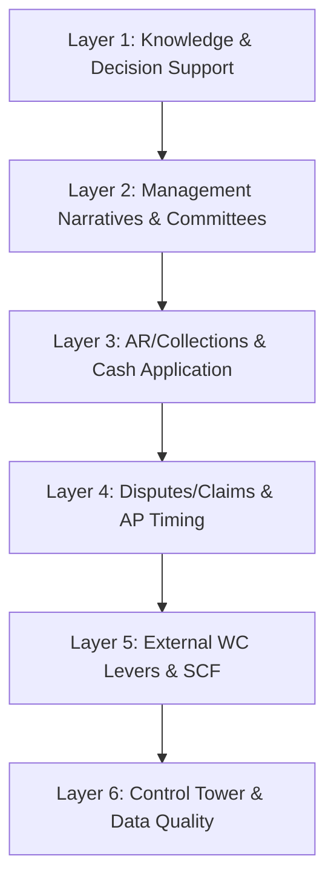

# T3: Working Capital Management

## Overview

Working Capital Management transforms Tüpraş's AR, AP, and inventory operations with AI-driven solutions that create self-adjusting loops, accelerate collections, optimize payment timing, and proactively manage disputes. AI and GenAI predict risks, digest unstructured inputs into actionable data, and orchestrate tasks across systems—releasing cash tied up in operations while maintaining finance-grade controls.

!!! tip "Cash Conversion Cycle Impact"

    Optimizing DSO, DPO, and DIO in oil & gas can release **hundreds of millions** in trapped cash. Each day of improvement in cash conversion cycle translates to significant working capital benefits at enterprise scale.

This tower organizes **40 AI use cases** across **6 functional layers**:



| Layer | Focus | Use Cases |
|-------|-------|-----------|
| **L1: Knowledge & Decision Support** | Copilot layer for working capital policy Q&A and complex queries | 4 |
| **L2: Management Narratives & Committees** | Working capital reports, CCC summaries, DSO/DPO attribution | 4 |
| **L3: AR/Collections & Cash Application** | Late-pay prediction, smart dunning, payment matching, deduction handling | 8 |
| **L4: Disputes/Claims & AP Timing** | Dispute prediction, evidence packs, payment optimization, DPO control | 8 |
| **L5: External WC Levers & SCF** | Factoring, SCF, dynamic discounting, inventory financing | 8 |
| **L6: Control Tower & Data Quality** | CCC cockpit, master data, terms intelligence, compliance monitoring | 8 |

---

## Layer 1: Knowledge & Decision Support (Copilot Layer)

This layer provides AI-powered assistants that help AR/AP teams access information, answer questions about working capital policies, and navigate complex O2C/P2P queries through natural language interfaces.

### 1.1 RAG-Powered Working Capital Policy Q&A

**What it does:** Retrieval-Augmented Generation (RAG) system that answers questions about credit policies, payment terms, collection procedures, and dispute resolution guidelines with direct citations to source documents.

**Key Inputs:**

- Credit policy documents (PDF, Word, SharePoint)
- Collection and dunning procedures (SOPs)
- Payment terms guidelines and approval matrices
- Dispute resolution workflows and escalation paths

**AI/LLM Approach:** Claude indexes all working capital policy documents into a vector database. When a user asks a question, relevant document chunks are retrieved and Claude generates an answer with specific citations.

**Example Interaction:**

```
User: What is our policy for placing a customer on credit hold?

Claude: Based on Credit Policy v2.4 (Section 4.1), credit hold triggers are:

| Condition | Action | Approval to Release |
|-----------|--------|---------------------|
| >60 days past due | Automatic hold | AR Manager |
| >$500K overdue | Automatic hold | Credit Director |
| DSO >90 days (customer) | Review trigger | Credit Analyst |
| Bankruptcy filing | Immediate hold | CFO + Legal |

Additional requirements per Section 4.1.3:
- Sales must be notified within 24 hours of hold
- Customer receives formal notice after 3 business days
- Release requires documented payment plan or payment received

📎 Sources: Credit_Policy_v2.4.pdf (pages 12-14), Credit_Hold_SOP.docx
```

**Outputs:**

- Instant answers with document citations
- Policy interpretation guidance
- Links to source documents
- Suggested related procedures

**KPIs:**

- Answer accuracy rate (target: >95%)
- Average response time (<5 seconds)
- Policy compliance improvement rate
- User satisfaction score

---

### 1.2 Multi-Step Agent for Complex AR/AP Queries

**What it does:** An agentic AI that can browse multiple systems, validate balances, calculate working capital metrics, and synthesize complex queries requiring multi-step reasoning across O2C and P2P processes.

**Key Inputs:**

- Access to ERP AR/AP modules, CRM, logistics systems
- Customer payment history and credit data
- Vendor master and payment terms data
- Real-time bank and cash position data

**AI/LLM Approach:** Claude operates as an autonomous agent that breaks complex queries into sub-tasks, executes each step (AR pulls, aging analysis, customer research), and synthesizes a comprehensive answer.

**Example Interaction:**

```
User: Why is DSO up 5 days this month, and what should we do about it?

Claude: I'll analyze this variance for you. Let me check multiple sources...

📊 **DSO Variance Analysis Complete**

**Finding: DSO increased from 42 to 47 days (+5 days)**

| Driver | Contribution | Root Cause |
|--------|--------------|------------|
| Customer A delays | +2.1 days | Dispute on 3 invoices ($2.3M) |
| Petrol Station Group | +1.8 days | Seasonal cash crunch |
| Export customers | +0.8 days | LC negotiation delays |
| New customer mix | +0.3 days | Higher-risk customers added |

**Recommended Actions:**

1. **Immediate**: Resolve Customer A dispute—evidence pack ready
2. **This week**: Call Petrol Station CFO to confirm payment date
3. **Process fix**: Accelerate LC document submission

**Impact if no action**: DSO projected to reach 50 days by month-end.

Shall I draft the credit note for Customer A's dispute?
```

**Outputs:**

- Comprehensive variance analysis
- Root cause identification with data
- Actionable recommendations
- Draft transactions for approval

**KPIs:**

- Query resolution rate without escalation
- Time saved vs. manual analysis
- Recommendation acceptance rate
- DSO/DPO improvement attribution

---

### 1.3 Customer Credit Risk Advisor

**What it does:** Provides guidance on customer credit assessment, payment terms optimization, and credit limit recommendations based on payment history, financial health, and industry benchmarks.

**Key Inputs:**

- Customer payment history and aging data
- External credit scores and financial data
- Industry payment benchmarks
- Company credit policy parameters

**AI/LLM Approach:** Claude combines internal payment data with external credit signals to assess customer risk and recommend appropriate credit terms.

**Example Interaction:**

```
User: Should we extend credit to Aegean Fuels Ltd for $2M?

Claude: Let me analyze Aegean Fuels Ltd's credit profile:

**CREDIT ASSESSMENT: AEGEAN FUELS LTD**

| Factor | Finding | Score |
|--------|---------|-------|
| Payment history (internal) | No history | N/A |
| D&B Rating | 3A2 (Good) | 75/100 |
| Years in business | 8 years | ✅ |
| Industry (fuel distribution) | Medium risk | 60/100 |
| Financial ratios | Current: 1.4, D/E: 0.8 | 70/100 |

**COMPOSITE SCORE: 68/100 (Medium Risk)**

**RECOMMENDATION: Conditional Approval**

| Metric | Standard Terms | Recommended |
|--------|----------------|-------------|
| Credit limit | $2M requested | $1M initial |
| Payment terms | Net 30 | Net 15 first 6 months |
| Security | None | Bank guarantee >$500K |
| Review | Annual | 90-day review |

Shall I prepare the credit application for approval?
```

**Outputs:**

- Credit risk assessment
- Terms recommendations
- Approval package preparation
- Monitoring triggers

**KPIs:**

- Bad debt rate vs. benchmark
- Credit decision turnaround time
- Terms optimization impact on DSO
- Customer acceptance rate

---

### 1.4 O2C/P2P Process Q&A Assistant

**What it does:** Specialized Q&A assistant focused on day-to-day Order-to-Cash and Procure-to-Pay procedures, helping AR/AP staff navigate processes and resolve exceptions.

**Key Inputs:**

- O2C and P2P process documentation
- Exception handling procedures
- System user guides (SAP, Oracle)
- Historical resolution patterns

**AI/LLM Approach:** Claude is trained on operational procedures with emphasis on step-by-step guidance, checklists, and real-time context.

**Example Interaction:**

```
User: How do I handle a short payment where customer paid $95K
against a $100K invoice?

Claude: For a $5K short payment (5% variance), follow this procedure:

**SHORT PAYMENT RESOLUTION (SOP-AR-007)**

**Step 1: Identify Reason**
- [ ] Pricing dispute (→ Sales validation)
- [ ] Quantity dispute (→ Logistics POD check)
- [ ] Tax/withholding (→ Tax team validation)
- [ ] Early payment discount taken (→ Terms verification)
- [ ] Damage/quality claim (→ Quality team)

**Step 2: Apply Based on Reason**

| Reason | If Valid | If Invalid |
|--------|----------|------------|
| Discount | Apply if within terms | Pursue balance |
| Damage claim | Credit note (≤$10K AR Mgr) | Reject with evidence |
| Tax withholding | Reclassify to tax account | Request gross-up |

**Your Authority Level:** AR Manager approval needed for $5K

Need me to start the deduction workflow?
```

**Outputs:**

- Step-by-step procedural guidance
- Authority level context
- Workflow initiation
- Exception documentation

**KPIs:**

- Procedure compliance rate
- Exception resolution time
- Process error reduction
- Staff productivity improvement

---

## Layer 2: Management Narratives & Committees

This layer automates the creation of working capital reports, committee presentations, and narrative explanations for management, board meetings, and executive briefings.

### 2.1 Working Capital Report Drafter

**What it does:** Automatically generates weekly/monthly working capital reports with DSO/DPO/DIO trends, variance explanations, and forward-looking commentary ready for executive review.

**Key Inputs:**

- AR aging and collection data
- AP aging and payment data
- Inventory levels and turns
- Cash conversion cycle calculations
- Previous reports for style consistency

**AI/LLM Approach:** Claude aggregates data from multiple sources, calculates key metrics, identifies noteworthy items, and generates narrative commentary in the organization's established reporting style.

**Example Interaction:**

```
User: Generate this month's working capital summary for the CFO.

Claude: Here's the draft Working Capital Report for January 2025:

═══════════════════════════════════════════════════════════════
           MONTHLY WORKING CAPITAL REPORT - CFO SUMMARY
═══════════════════════════════════════════════════════════════

**EXECUTIVE SUMMARY**
Working capital position improved $12M this month, driven by
collections acceleration and payment timing optimization.

• Cash Conversion Cycle: 52 days (vs. 58 days prior month)
• DSO: 45 days (target: 42) ↓ improved from 48
• DPO: 55 days (target: 55) → on target
• DIO: 52 days (target: 50) ↑ slight increase for turnaround prep

**KEY METRICS**

| Metric | Actual | Target | Prior Month | Trend |
|--------|--------|--------|-------------|-------|
| DSO | 45 days | 42 days | 48 days | ✅ ↓ |
| DPO | 55 days | 55 days | 54 days | ✅ → |
| DIO | 52 days | 50 days | 51 days | 🟡 ↑ |
| CCC | 52 days | 47 days | 55 days | ✅ ↓ |
| Overdue AR | $32M (11%) | <10% | $45M (15%) | ✅ |

**CASH IMPACT**
CCC improvement of 6 days = ~$45M cash released

───────────────────────────────────────────────────────────────
Prepared by: Treasury AI Assistant | Review required
```

**Outputs:**

- Draft working capital report
- Key metrics dashboard with trends
- Highlighted items requiring discussion
- Cash impact quantification

**KPIs:**

- Report preparation time (days → minutes)
- Executive revision rate
- Metric accuracy (100% target)
- Stakeholder satisfaction score

---

### 2.2 DSO/DPO Driver Attribution Report

**What it does:** Automatically analyzes and attributes changes in DSO and DPO to specific drivers (customers, segments, terms, disputes) for management understanding.

**Key Inputs:**

- Detailed AR aging by customer/segment
- AP aging by vendor/category
- Historical payment patterns
- Dispute and deduction data

**AI/LLM Approach:** Claude performs statistical decomposition of DSO/DPO changes into contributing factors and generates executive-ready attribution narratives.

**Example Interaction:**

```
User: Explain why DSO increased 3 days in the Refining segment.

Claude: **DSO DRIVER ATTRIBUTION: REFINING SEGMENT**

**Summary:** DSO increased from 38 to 41 days (+3 days)

| Driver | Days Impact | $ Impact | % of Change |
|--------|-------------|----------|-------------|
| Customer A dispute | +1.8 days | $4.2M | 60% |
| Seasonal slowdown | +0.7 days | $1.6M | 23% |
| New export customer | +0.4 days | $0.9M | 13% |
| Collection vacancy | +0.1 days | $0.2M | 4% |

**OUTLOOK**
With dispute resolution, DSO expected to return to 38-39 days
by end of February.
```

**Outputs:**

- Quantified driver attribution
- Root cause analysis
- Peer comparison context
- Forward-looking projection

**KPIs:**

- Attribution accuracy
- Management comprehension score
- Action item generation rate
- Forecast accuracy improvement

---

### 2.3 Collection Forecast Narrative Generator

**What it does:** Creates executive-ready narrative explanations of collection forecasts, explaining assumptions, risks, and recommended actions in business terms.

**Key Inputs:**

- AR aging and customer payment patterns
- Collection forecast models
- Historical forecast accuracy
- Known collection risks and opportunities

**AI/LLM Approach:** Claude translates technical forecast outputs into clear business narratives, contextualizes assumptions, and explains variances.

**Example Interaction:**

```
User: Write the narrative for our Q1 collection forecast.

Claude: **COLLECTION FORECAST NARRATIVE: Q1 2025**

**Forecast Summary**
Total Q1 collections projected at $245M against $268M in billings,
representing a 91% realization rate.

| Month | Billings | Projected Collections | Realization |
|-------|----------|----------------------|-------------|
| January | $88M | $78M | 89% |
| February | $90M | $84M | 93% |
| March | $90M | $83M | 92% |

**Key Assumptions**
1. Customer A Resolution ($4.2M) - 95% collection expected
2. Petrol Stations Payment Plan - 80% adherence modeled
3. Export LC Timing - 5-7 days bank processing

**Confidence Range**
- Base case: $245M
- Downside (P10): $232M
- Upside (P90): $258M
```

**Outputs:**

- Narrative forecast explanation
- Assumption documentation
- Risk/opportunity assessment
- Confidence ranges

**KPIs:**

- Forecast accuracy (actual vs. projected)
- Assumption validity rate
- Risk identification accuracy
- Executive understanding score

---

### 2.4 Working Capital Committee Briefing Pack

**What it does:** Generates comprehensive briefing packs for working capital committees including all KPIs, action items, decisions needed, and supporting analysis.

**Key Inputs:**

- All working capital metrics (DSO, DPO, DIO, CCC)
- Action item tracker from previous meetings
- Decisions requiring committee approval
- Industry benchmarks and peer comparisons

**AI/LLM Approach:** Claude assembles data from multiple sources into a structured briefing format, highlights decisions needed, and prepares supporting analysis.

**Example Interaction:**

```
User: Prepare the working capital committee briefing for Thursday.

Claude: **WORKING CAPITAL COMMITTEE BRIEFING PACK**
Meeting Date: January 16, 2025

**AGENDA & DECISIONS REQUIRED**

| # | Item | Type | Time |
|---|------|------|------|
| 1 | KPI Dashboard Review | Information | 10 min |
| 2 | Customer A Credit Note | Decision | 10 min |
| 3 | SCF Program Expansion | Decision | 15 min |
| 4 | Q1 Collection Forecast | Discussion | 10 min |

**1. KPI DASHBOARD**

| Metric | Jan | Target | Status |
|--------|-----|--------|--------|
| DSO | 45 | 42 | 🟡 |
| DPO | 55 | 55 | ✅ |
| DIO | 52 | 50 | 🟡 |
| CCC | 52 | 47 | 🟡 |

**2. DECISION: Customer A Credit Note ($180K)**
Recommendation: Approve - evidence supports claim

**3. DECISION: SCF Program Expansion**
Proposal: Add 15 suppliers (+$18M monthly volume)
Impact: +3 days DPO, $2.1M working capital release
Recommendation: Approve
```

**Outputs:**

- Complete briefing pack
- Decision summaries with options
- Supporting analysis
- Action item tracker

**KPIs:**

- Meeting preparation time reduction
- Decision quality (outcomes)
- Action item completion rate
- Committee satisfaction score

---

## Layer 3: AR/Collections Intelligence & Cash Application

This layer covers the core AR processes including late payment prediction, intelligent dunning orchestration, collection forecasting, automated cash application, and deduction management.

### 3.1 Late-Pay Propensity Scoring at Invoice Issuance

**What it does:** ML model that predicts the probability of late payment for each invoice at the time of issuance, enabling proactive collection strategies and risk-tiered dunning schedules.

**Key Inputs:**

- Invoice details (amount, terms, product type)
- Customer payment history and aging patterns
- Customer credit ratings and financial health
- Seasonal and macro factors (holidays, industry cycles)

**AI/LLM Approach:** Machine learning classification (gradient boosting) trained on historical invoice payment data to predict probability of late payment (beyond due date).

**Example Interaction:**

```
User: Show me the risk assessment for today's invoices.

Claude: **INVOICE RISK ASSESSMENT - January 15, 2025**

📊 **Today's Invoices: 47 total, $8.2M**

| Risk Tier | Count | Amount | Recommended Action |
|-----------|-------|--------|-------------------|
| 🔴 High (>70%) | 5 | $1.8M | Proactive outreach pre-due |
| 🟡 Medium (30-70%) | 12 | $2.9M | Standard dunning + monitor |
| 🟢 Low (<30%) | 30 | $3.5M | Automated reminders only |

**TOP 5 HIGH-RISK INVOICES**

| Invoice | Customer | Amount | Risk | Top Factors |
|---------|----------|--------|------|-------------|
| INV-4521 | Petrol Co | $650K | 85% | 3 late pays last 6mo, amount >avg |
| INV-4523 | RegionalFuel | $420K | 78% | Dispute history, industry stress |
| INV-4518 | Balkans Ltd | $380K | 74% | New customer, no history |
| INV-4525 | CoastalOil | $220K | 72% | Seasonal pattern (Jan slow) |
| INV-4519 | Metro Fuel | $130K | 71% | Small customer, cash flow issues |

**RECOMMENDED ACTIONS FOR HIGH-RISK**

1. **INV-4521 (Petrol Co)**: Schedule call with CFO before due date
2. **INV-4523 (RegionalFuel)**: Verify delivery acceptance proactively
3. **INV-4518 (Balkans Ltd)**: Request payment confirmation email

Shall I set up the proactive outreach tasks?
```

**Outputs:**

- Risk score per invoice with explanation
- Risk-tiered invoice dashboard
- Recommended collection actions
- Automated task creation

**KPIs:**

- Prediction accuracy (late vs. on-time)
- Reduction in past-due amounts
- Proactive resolution rate
- Collector productivity improvement

---

### 3.2 Smart Dunning Orchestrator

**What it does:** AI-driven dunning system that automatically tailors collection communication timing, channel, and tone based on customer risk profile, relationship tier, and payment patterns.

**Key Inputs:**

- Customer risk scores and payment history
- Customer relationship tier (Strategic, Key, Standard)
- Communication channel preferences
- Past dunning effectiveness by customer

**AI/LLM Approach:** Reinforcement learning optimizes dunning sequences based on historical response rates. GenAI personalizes message content based on customer context.

**Example Interaction:**

```
User: What's the dunning plan for Petrol Stations Inc (overdue $850K)?

Claude: **SMART DUNNING PLAN: PETROL STATIONS INC**

**Customer Profile**
- Tier: Key Account (Top 20 by volume)
- Credit Limit: $2M | Current AR: $1.2M
- Payment History: Avg 8 days late, improving trend
- Preferred Channel: Email to CFO, then phone

**CURRENT OVERDUE: $850K (45 days past due)**

| Invoice | Amount | Days Late | Risk |
|---------|--------|-----------|------|
| INV-4102 | $420K | 45 | High |
| INV-4156 | $280K | 32 | Medium |
| INV-4198 | $150K | 18 | Medium |

**AI-OPTIMIZED DUNNING SEQUENCE**

| Day | Action | Channel | Tone |
|-----|--------|---------|------|
| 0 (today) | Reminder + payment plan offer | Email (CFO) | Professional |
| +3 | Follow-up if no response | Phone (CFO) | Consultative |
| +7 | Escalation notice | Email (CFO + CEO) | Firm |
| +14 | Credit hold warning | Formal letter | Serious |
| +21 | Credit hold + Sales notify | System + call | Final |

**PERSONALIZED MESSAGE (Draft)**

Subject: Payment Reminder - $850K Outstanding (Petrol Stations Inc)

Dear Mr. Yılmaz,

I hope this finds you well. I'm reaching out regarding three
invoices totaling $850K that are currently past due.

Given your strong payment history with us, I'd like to discuss
a short-term payment arrangement if helpful. Would a 3-payment
plan over the next 30 days work for your cash flow?

Please let me know a convenient time to discuss.

[Ready for your review before sending]

Shall I execute this dunning plan?
```

**Outputs:**

- Personalized dunning schedule
- AI-generated message drafts
- Escalation triggers
- Effectiveness tracking

**KPIs:**

- Collection rate by dunning sequence
- Average days to payment post-dunning
- Customer response rate
- Escalation frequency reduction

---

### 3.3 Collections Forecast with Driver Attribution

**What it does:** Time-series forecasting model that projects cash collections for each period with explanations of key drivers and variances from prior forecasts.

**Key Inputs:**

- Open AR aging and due dates
- Customer payment behavior patterns
- Historical collection actuals
- Known risks (disputes, payment plans)

**AI/LLM Approach:** Ensemble time-series forecasting combining customer-level payment probability with macro patterns. GenAI generates narrative explanations of forecast drivers.

**Example Interaction:**

```
User: What's the 4-week collection forecast?

Claude: **COLLECTION FORECAST: Next 4 Weeks**

| Week | Expected | Low (P10) | High (P90) | Key Driver |
|------|----------|-----------|------------|------------|
| W1 (Jan 15-21) | $18.2M | $15.8M | $20.1M | INV-4521 timing |
| W2 (Jan 22-28) | $22.5M | $19.2M | $25.8M | Month-end push |
| W3 (Jan 29-Feb 4) | $15.8M | $13.1M | $18.2M | Normal flow |
| W4 (Feb 5-11) | $19.1M | $16.5M | $21.8M | Petrol Stn plan |
| **Total** | **$75.6M** | **$64.6M** | **$85.9M** | |

**DRIVER ATTRIBUTION (vs. Last Week's Forecast)**

| Driver | Impact | Explanation |
|--------|--------|-------------|
| Customer A resolution | +$4.2M | Dispute closed, payment confirmed |
| Petrol Stations plan | -$1.5M | Stretched from 2 to 3 weeks |
| New invoices issued | +$2.1M | Higher billings than planned |
| Seasonal adjustment | -$0.8M | January typically slower |

**RISKS TO MONITOR**

⚠️ INV-4521 ($650K): High-risk, may slip to W2
⚠️ Export LCs ($1.2M): Bank processing delays possible
⚠️ RegionalFuel dispute ($280K): Resolution uncertain

**COLLECTION ACTIONS TO HIT FORECAST**

1. Confirm INV-4521 payment date with Petrol Co (W1 risk)
2. Pre-submit LC documents to avoid delays (W2)
3. Escalate RegionalFuel dispute to management (W3)
```

**Outputs:**

- Multi-week collection forecast
- Confidence intervals
- Driver attribution vs. prior forecast
- Risk alerts and actions

**KPIs:**

- Forecast accuracy (MAPE)
- Variance explanation coverage
- Action item completion rate
- Cash flow predictability improvement

---

### 3.4 Payment-to-Invoice Matching (Cash Application)

**What it does:** AI-powered cash application that matches incoming bank payments to open invoices, even when remittance information is incomplete or scattered across emails and PDFs.

**Key Inputs:**

- Bank statement transaction details
- Remittance advice (email, PDF, portal)
- Open AR invoices in ERP
- Customer master data (identifiers, accounts)

**AI/LLM Approach:** NLP/LLM to parse unstructured remittances. ML fuzzy matching for payment-to-invoice alignment. Confidence scoring for auto-post vs. human review.

**Example Interaction:**

```
User: Show me today's cash application status.

Claude: **CASH APPLICATION STATUS - January 15, 2025**

📥 **Payments Received: 42 | Total: $12.8M**

| Category | Count | Amount | Rate |
|----------|-------|--------|------|
| ✅ Auto-matched (>95% conf) | 35 | $9.2M | 72% |
| 🟡 Suggested match (review) | 5 | $2.8M | 22% |
| 🔴 Unmatched (needs research) | 2 | $0.8M | 6% |

**ITEMS REQUIRING REVIEW**

**1. Payment: $1,250,000 from Petrol Stations Inc**
- Bank ref: "PSI-JAN15-PARTIAL"
- AI Suggestion (87% confidence):

| Invoice | Amount | Match Reason |
|---------|--------|--------------|
| INV-4102 | $420,000 | Amount + aging |
| INV-4156 | $280,000 | Customer pattern |
| INV-4198 | $150,000 | Remaining balance |
| Overpayment | $400,000 | Apply to INV-4235? |

**2. Payment: $850,000 from "AEGEAN TRADING"**
- No customer match (new?)
- AI found: Email from aegean.trading@... with remittance
- Suggested: Create new customer OR link to "Aegean Fuels Ltd"

**UNMATCHED REQUIRING RESEARCH**

| Amount | Bank Details | AI Notes |
|--------|--------------|----------|
| $520K | "TRF-COASTAL-1" | No matching customer |
| $280K | "FUEL-PAY-JAN" | Generic ref, multiple candidates |

Shall I approve the auto-matches and open review queue?
```

**Outputs:**

- Auto-applied payments
- Suggested matches for review
- Unmatched payment research queue
- Application status dashboard

**KPIs:**

- Auto-match rate (target: >85%)
- Unapplied cash aging (days)
- Manual touchpoints per payment
- Match accuracy (validated)

---

### 3.5 Remittance Ingestion & Parsing

**What it does:** GenAI-powered system that extracts structured payment information from unstructured remittance sources including emails, PDFs, customer portals, and free-form bank memo fields.

**Key Inputs:**

- Customer emails with remittance details
- PDF remittance advice documents
- Customer portal data exports
- Bank statement memo fields

**AI/LLM Approach:** LLM (Claude) with document understanding parses varied formats to extract invoice numbers, amounts, deductions, and reasons. OCR for scanned documents.

**Example Interaction:**

```
User: Parse this remittance email from Petrol Stations.

Claude: **REMITTANCE PARSING COMPLETE**

📧 **Source:** Email from ap@petrolstations.com (Jan 15, 10:23 AM)

**EXTRACTED PAYMENT DETAILS**

| Field | Extracted Value | Confidence |
|-------|-----------------|------------|
| Customer | Petrol Stations Inc | 99% |
| Payment Amount | $1,250,000 | 99% |
| Payment Date | January 15, 2025 | 95% |
| Payment Method | Wire Transfer | 90% |
| Bank Reference | PSI-JAN15-PARTIAL | 99% |

**INVOICE BREAKDOWN (from email body)**

| Invoice # | Gross | Deduction | Net Pay | Reason |
|-----------|-------|-----------|---------|--------|
| INV-4102 | $420,000 | $0 | $420,000 | Full pay |
| INV-4156 | $280,000 | $0 | $280,000 | Full pay |
| INV-4198 | $150,000 | $0 | $150,000 | Full pay |
| INV-4235 | $450,000 | $50,000 | $400,000 | Damage claim |

**DEDUCTION IDENTIFIED**

- Invoice: INV-4235
- Amount: $50,000
- Reason: "Damage to 500 barrels per QA report dated Jan 8"
- Action: Route to Dispute team for validation

**PARSING NOTES**
- Email contained partial attachment (PDF truncated)
- Inferred INV-4235 from context + amount match
- Recommend confirming with customer

Ready to apply to cash application queue?
```

**Outputs:**

- Structured remittance data
- Invoice-level breakdown
- Deduction identification and routing
- Parsing confidence scores

**KPIs:**

- Extraction accuracy rate
- Processing time per remittance
- Manual keying reduction
- Deduction capture rate

---

### 3.6 Deduction Reason Classifier

**What it does:** ML classifier that categorizes customer deductions (short-pays) into reason codes (pricing, shortage, damage, tax, etc.) and routes to appropriate teams for resolution.

**Key Inputs:**

- Deduction details (amount, customer, invoice)
- Remittance reason text
- Historical deduction patterns
- Resolution outcomes by category

**AI/LLM Approach:** NLP classification of deduction reasons into predefined categories. Pattern recognition for systematic deduction identification.

**Example Interaction:**

```
User: Classify the deductions from this week.

Claude: **DEDUCTION CLASSIFICATION - Week of Jan 13**

📊 **Total Deductions: 28 | Amount: $485K**

| Category | Count | Amount | % | Trend |
|----------|-------|--------|---|-------|
| Pricing disputes | 8 | $165K | 34% | ↑ +15% |
| Shortage claims | 6 | $125K | 26% | → stable |
| Damage/quality | 5 | $95K | 20% | ↓ -10% |
| Tax/withholding | 4 | $55K | 11% | → stable |
| Early pay discount | 3 | $25K | 5% | → stable |
| Unknown/other | 2 | $20K | 4% | ↓ -5% |

**ROUTING SUMMARY**

| Team | Items | Amount | SLA |
|------|-------|--------|-----|
| Sales/Pricing | 8 | $165K | 5 days |
| Logistics | 6 | $125K | 3 days |
| Quality | 5 | $95K | 7 days |
| Tax | 4 | $55K | 10 days |
| AR (auto-apply) | 3 | $25K | Auto |

**PATTERN ALERT 🚨**

Pricing disputes up 15% - Top contributors:
- Customer: RegionalFuel (4 deductions, $82K)
- Product: Diesel (6 of 8 pricing disputes)
- Root cause hypothesis: Price list not updated for Jan

**RECOMMENDED ACTION**
Review diesel pricing for RegionalFuel contract

Shall I route these deductions and create the investigation task?
```

**Outputs:**

- Categorized deductions
- Auto-routing to resolution teams
- Pattern identification alerts
- Root cause hypotheses

**KPIs:**

- Classification accuracy
- Routing accuracy
- Resolution time by category
- Pattern detection effectiveness

---

### 3.7 Unapplied Cash Resolver

**What it does:** AI assistant that researches and resolves unapplied cash items by matching with customer data, payment history, and external sources.

**Key Inputs:**

- Unapplied cash items and aging
- Customer AR and payment history
- Bank statement details
- Customer communication logs

**AI/LLM Approach:** ML matching algorithms combined with GenAI research to identify likely customers and invoices for unknown payments.

**Example Interaction:**

```
User: Help resolve the $520K unapplied payment.

Claude: **UNAPPLIED CASH RESEARCH: $520,000**

📋 **Payment Details**
- Date: January 14, 2025
- Bank: Garanti BBVA
- Ref: "TRF-COASTAL-1"
- Originator: "COASTAL ENERGY TRADING"

**RESEARCH FINDINGS**

🔍 **Customer Match Search**

| Candidate | Match Score | Reason |
|-----------|-------------|--------|
| Coastal Oil Co | 78% | Name similarity, prior payments |
| CoastalEnergy Ltd | 65% | Partial name match |
| (New Customer) | 40% | No existing match |

🔍 **Invoice Match Search (Coastal Oil Co)**

| Invoice | Amount | Status | Match |
|---------|--------|--------|-------|
| INV-4301 | $520,000 | Open | ✅ Exact |
| Due: Jan 15 | | | |

🔍 **Additional Evidence**
- Found email from coastal.oil@... on Jan 13
- Subject: "Wire confirmation - INV-4301"
- Content confirms $520K payment for INV-4301

**RECOMMENDATION**

✅ Apply $520,000 to Coastal Oil Co - INV-4301
- Confidence: 95%
- Evidence: Email confirmation + exact amount match
- Note: Update customer alias to include "COASTAL ENERGY TRADING"

Approve application?
```

**Outputs:**

- Research findings with evidence
- Match recommendations
- Customer data update suggestions
- Application queue updates

**KPIs:**

- Resolution rate for unapplied items
- Average resolution time
- Research accuracy
- Customer data quality improvement

---

### 3.8 Credit Limit & Hold Recommender

**What it does:** AI system that monitors customer credit exposure and recommends credit limit adjustments or credit holds based on payment behavior, AR aging, and risk signals.

**Key Inputs:**

- Customer credit limits and utilization
- AR aging and payment trends
- Risk scores and external credit data
- Policy rules for holds and limits

**AI/LLM Approach:** ML risk scoring combined with rule-based policy engine. GenAI generates recommendation narratives with supporting evidence.

**Example Interaction:**

```
User: Review credit status for at-risk customers.

Claude: **CREDIT RISK REVIEW - January 15, 2025**

🚨 **RECOMMENDED CREDIT ACTIONS**

**1. CREDIT HOLD RECOMMENDED: Metro Fuel Distributors**

| Metric | Value | Policy Limit | Status |
|--------|-------|--------------|--------|
| Credit Limit | $500K | - | - |
| Current AR | $620K | $500K | ⚠️ Over |
| Overdue | $280K | $100K | 🔴 2.8x |
| DSO (customer) | 72 days | 45 days | 🔴 |
| Risk Score | 82/100 | >75 = Hold | 🔴 |

**Evidence:**
- 3 consecutive late payments (avg 25 days late)
- Bounced check in December
- Industry news: layoffs announced

**Recommendation:** Place on credit hold
**Approval Required:** Credit Director

---

**2. CREDIT LIMIT INCREASE: Aegean Fuels Ltd**

| Metric | Current | Recommended | Rationale |
|--------|---------|-------------|-----------|
| Credit Limit | $1.0M | $1.5M | Strong performance |
| Utilization | 92% | 61% | Provide headroom |

**Evidence:**
- 12 months on-time payments
- Growing volume (+25% YoY)
- D&B upgrade from 3A2 to 2A1

**Recommendation:** Increase limit to $1.5M
**Approval Required:** Credit Manager

Shall I prepare the approval requests?
```

**Outputs:**

- Credit action recommendations
- Supporting evidence packages
- Policy compliance check
- Approval workflow initiation

**KPIs:**

- Credit loss prevention
- Credit decision accuracy
- Approval turnaround time
- Policy compliance rate

---

## Layer 4: Disputes/Claims & AP Timing Optimization

This layer covers invoice dispute prediction and resolution, evidence pack generation, and AP payment optimization including discount capture and DPO management.

### 4.1 Dispute Predictor (Pre-Due Risk)

**What it does:** ML model that predicts which invoices are likely to be disputed before the due date, enabling proactive evidence gathering and customer outreach.

**Key Inputs:**

- Invoice and order details
- Customer dispute history
- Delivery and quality data
- Product/shipment characteristics

**AI/LLM Approach:** Classification model trained on historical dispute data to identify risk factors (customer, product, delivery method, etc.) that correlate with disputes.

**Example Interaction:**

```
User: Which invoices are at risk of dispute?

Claude: **DISPUTE RISK ASSESSMENT - January 15, 2025**

📊 **Open Invoices Analyzed: 234 | Total: $45M**

| Risk Level | Count | Amount | Recommended Action |
|------------|-------|--------|-------------------|
| 🔴 High (>60%) | 8 | $3.2M | Pre-gather evidence |
| 🟡 Medium (30-60%) | 22 | $6.8M | Monitor closely |
| 🟢 Low (<30%) | 204 | $35M | Standard process |

**TOP HIGH-RISK INVOICES**

| Invoice | Customer | Amount | Risk | Top Risk Factors |
|---------|----------|--------|------|------------------|
| INV-4312 | RegionalFuel | $850K | 82% | 4 disputes last 12mo, bulk shipment |
| INV-4298 | Balkans Ltd | $620K | 75% | New customer, complex delivery |
| INV-4305 | Metro Fuel | $480K | 71% | Quality complaints on prior orders |
| INV-4318 | CoastalOil | $380K | 68% | Pricing complexity, promotions |
| INV-4322 | Industrial Co | $290K | 65% | Partial shipment, multiple POs |

**PROACTIVE ACTIONS RECOMMENDED**

**INV-4312 (RegionalFuel, $850K, 82% risk)**
- Risk drivers: Bulk diesel, this customer disputes 40% of bulk orders
- Action: Pre-call to confirm delivery satisfaction
- Evidence to gather: POD, tank gauge readings, quality certificate

**INV-4298 (Balkans Ltd, $620K, 75% risk)**
- Risk drivers: New customer, cross-border, complex Incoterms
- Action: Send delivery confirmation request
- Evidence to gather: CMR, customs clearance, acceptance form

Shall I create evidence gathering tasks for high-risk invoices?
```

**Outputs:**

- Dispute risk scores per invoice
- Risk factor explanations
- Proactive action recommendations
- Evidence gathering task creation

**KPIs:**

- Prediction accuracy (actual disputes vs. predicted)
- Proactive resolution rate
- Dispute volume reduction
- DSO impact from dispute prevention

---

### 4.2 Pre-Collect Evidence Pack Builder

**What it does:** Automatically assembles evidence packages (POD, quality certificates, contracts, photos) for high-risk invoices before disputes arise, enabling faster resolution.

**Key Inputs:**

- Delivery documents (POD, CMR, BOL)
- Quality inspection reports
- Contract and pricing terms
- Customer acceptance confirmations

**AI/LLM Approach:** Document retrieval and assembly automation with GenAI summarization of key evidence points for each invoice.

**Example Interaction:**

```
User: Build evidence pack for INV-4312 (RegionalFuel).

Claude: **EVIDENCE PACK: INV-4312**

📋 **Invoice Details**
- Customer: RegionalFuel Inc
- Amount: $850,000
- Product: Diesel (bulk, 25,000 barrels)
- Delivery: Jan 10, 2025 to İzmir terminal

**EVIDENCE COLLECTED**

| Document | Status | Source | Key Points |
|----------|--------|--------|------------|
| Proof of Delivery | ✅ Found | Logistics | Signed Jan 10, 14:32 |
| Quality Certificate | ✅ Found | QA System | Spec: EN 590, all tests pass |
| Tank Gauge Reading | ✅ Found | Terminal | 25,012 bbl received (within tol) |
| Customer PO | ✅ Found | SAP | PO-45231, matches invoice |
| Pricing Agreement | ✅ Found | Contract DB | Annual contract, fixed price |
| Delivery Photos | ⚠️ Partial | Mobile App | 2 of 4 photos available |

**EVIDENCE SUMMARY (AI-Generated)**

```
Invoice INV-4312 for $850,000 is supported by:

1. DELIVERY CONFIRMED: POD signed by "M. Demir" (RegionalFuel)
   on January 10, 2025 at 14:32 local time. No exceptions noted.

2. QUANTITY VERIFIED: Terminal gauge reading shows 25,012 barrels
   received vs. 25,000 invoiced (0.05% overage, within tolerance).

3. QUALITY COMPLIANT: QA certificate #QC-2025-0842 confirms
   product meets EN 590 specification. Sulfur: 8ppm (limit: 10ppm).

4. PRICING PER CONTRACT: Price of $34/bbl matches Annual Agreement
   dated Oct 1, 2024, Section 3.2 (Diesel pricing formula).

Missing: 2 delivery photos (driver handoff, tank connection).
Recommend requesting from logistics.
```

**DISPUTE DEFENSE STRENGTH: 92/100**

Shall I send missing photo request to logistics team?
```

**Outputs:**

- Assembled evidence package
- AI-generated evidence summary
- Defense strength score
- Missing document alerts

**KPIs:**

- Evidence completeness rate
- Time to assemble evidence pack
- Dispute win rate with evidence
- Missing document reduction

---

### 4.3 One-Click Claim Creation & Routing

**What it does:** Streamlines dispute resolution by auto-populating claim forms, routing to appropriate teams, and tracking resolution progress with escalation triggers.

**Key Inputs:**

- Dispute details (invoice, amount, reason)
- Evidence pack contents
- Resolution authority matrix
- Historical resolution patterns

**AI/LLM Approach:** Workflow automation with GenAI-generated claim narratives and resolution recommendations based on similar past cases.

**Example Interaction:**

```
User: Create claim for INV-4298 dispute ($50K damage claim).

Claude: **CLAIM CREATION: INV-4298**

📋 **Dispute Details**
- Invoice: INV-4298 | Amount: $620,000
- Customer: Balkans Ltd
- Claim: $50,000 (8% of invoice)
- Reason: "Damaged product - contamination detected"

**AUTO-POPULATED CLAIM FORM**

| Field | Value | Source |
|-------|-------|--------|
| Claim ID | CLM-2025-0089 | Auto-generated |
| Customer | Balkans Ltd | Invoice |
| Invoice | INV-4298 | User input |
| Claim Amount | $50,000 | Customer email |
| Category | Quality/Damage | AI classified |
| Product | Diesel EN 590 | Invoice |
| Delivery Date | Jan 8, 2025 | POD |
| Claim Date | Jan 15, 2025 | Today |

**AI ANALYSIS OF CLAIM**

**Similar Past Cases (3 found):**
| Case | Amount | Outcome | Resolution Time |
|------|--------|---------|-----------------|
| CLM-2024-0821 | $45K | Partial credit (60%) | 12 days |
| CLM-2024-0756 | $62K | Full credit | 8 days |
| CLM-2024-0698 | $38K | Rejected (no evidence) | 15 days |

**Initial Assessment:**
- Customer's contamination claim requires lab verification
- Our QC certificate shows clean product at loading
- Possible causes: Transit contamination, customer tank issue

**RECOMMENDED ROUTING**

| Step | Team | Action | SLA |
|------|------|--------|-----|
| 1 | Quality | Verify customer's lab results | 3 days |
| 2 | Logistics | Review transit conditions | 2 days |
| 3 | AR Manager | Resolution decision | 2 days |
| 4 | Finance | Credit note (if approved) | 1 day |

**RESOLUTION RECOMMENDATION**
Request customer's independent lab report. If contamination
confirmed and transit issue ruled out, offer 50% credit ($25K)
as goodwill given new customer status.

Create claim and initiate routing?
```

**Outputs:**

- Pre-populated claim form
- Similar case analysis
- Routing and SLA assignment
- Resolution recommendation

**KPIs:**

- Claim creation time
- First-time routing accuracy
- Resolution time by category
- Customer satisfaction with resolution

---

### 4.4 Dispute Next-Best-Action Engine

**What it does:** AI engine that recommends the optimal next action for each open dispute based on age, evidence, customer relationship, and resolution patterns.

**Key Inputs:**

- Open dispute details and status
- Time in current stage
- Evidence availability
- Customer relationship tier

**AI/LLM Approach:** Decision tree combined with ML to recommend optimal actions based on historical resolution success patterns.

**Example Interaction:**

```
User: What are the next actions for open disputes?

Claude: **DISPUTE NEXT-BEST-ACTION QUEUE**

📊 **Open Disputes: 18 | Total Value: $1.2M | Avg Age: 12 days**

**IMMEDIATE ACTIONS REQUIRED (Overdue SLA)**

| Dispute | Customer | Amount | Days | Next Action |
|---------|----------|--------|------|-------------|
| CLM-0078 | RegionalFuel | $82K | 18 | ⚠️ Escalate to Director |
| CLM-0081 | Metro Fuel | $35K | 15 | ⚠️ Final decision needed |

**TODAY'S ACTION QUEUE**

| Priority | Dispute | Customer | Amount | Action | Owner |
|----------|---------|----------|--------|--------|-------|
| 🔴 1 | CLM-0078 | RegionalFuel | $82K | Escalate - SLA breach | AR Director |
| 🔴 2 | CLM-0081 | Metro Fuel | $35K | Approve/reject decision | AR Manager |
| 🟡 3 | CLM-0089 | Balkans Ltd | $50K | Request lab report | Quality |
| 🟡 4 | CLM-0085 | CoastalOil | $28K | Review evidence | AR Analyst |
| 🟢 5 | CLM-0091 | Industrial | $15K | Await customer response | AR Analyst |

**CLM-0078 ESCALATION BRIEF (RegionalFuel, $82K)**

**Situation:** 18 days open, SLA = 14 days
**Issue:** Pricing dispute on January diesel delivery
**Evidence:** Our pricing per contract; customer claims verbal discount
**History:** Customer disputes 40% of invoices; 70% resolved with partial credit
**Recommendation:** Offer 15% credit ($12.3K) to resolve; customer is
strategic (Top 50 by volume)

**Quick Actions:**
[Approve 15% credit] [Counter-offer 10%] [Reject with evidence] [Escalate to CFO]
```

**Outputs:**

- Prioritized action queue
- Escalation alerts
- Resolution recommendations
- One-click action buttons

**KPIs:**

- SLA compliance rate
- Average resolution time
- Action recommendation accuracy
- Escalation frequency

---

### 4.5 AP Payment Date Prediction

**What it does:** Predicts optimal and expected payment dates for supplier invoices based on terms, cash position, and historical patterns.

**Key Inputs:**

- AP invoice details and terms
- Cash forecast and position
- Historical payment patterns
- Supplier relationship data

**AI/LLM Approach:** Time-series prediction of payment timing combined with optimization for cash efficiency.

**Example Interaction:**

```
User: When should we pay this week's invoices?

Claude: **AP PAYMENT OPTIMIZATION - Week of Jan 15**

📊 **Invoices Due: 85 | Total: $28.5M**

**PAYMENT SCHEDULE RECOMMENDATION**

| Payment Date | Count | Amount | Rationale |
|--------------|-------|--------|-----------|
| Jan 15 (today) | 12 | $4.2M | Discount capture window |
| Jan 17 | 8 | $3.8M | Critical suppliers |
| Jan 20 | 45 | $15.2M | Standard due date batch |
| Jan 22 | 20 | $5.3M | Cash optimization |

**DISCOUNT OPPORTUNITIES (Act Today)**

| Supplier | Invoice | Amount | Discount | Save | Deadline |
|----------|---------|--------|----------|------|----------|
| Crude Co. | INV-8821 | $2.1M | 2%/10 | $42K | Today |
| Chemicals Ltd | INV-8834 | $850K | 1.5%/10 | $12.8K | Today |
| Services Inc | INV-8842 | $420K | 2%/15 | $8.4K | Jan 17 |
| **Total** | | **$3.37M** | | **$63.2K** | |

**Effective APR of discounts: 36.7% (vs. cost of capital 8%)**
**Recommendation:** Take all discounts

**PAYMENT TIMING OPTIMIZATION**

| Strategy | DPO Impact | Cash Impact | Supplier Risk |
|----------|------------|-------------|---------------|
| Pay all on due date | 55 days | Baseline | None |
| Optimize (recommended) | 58 days | +$2.1M float | Low |
| Aggressive extension | 62 days | +$4.8M float | Medium |

**Recommended Strategy:** Optimize
- Take all discounts today ($63K savings)
- Defer non-critical to last day of terms
- Result: DPO +3 days, zero late payments
```

**Outputs:**

- Optimized payment schedule
- Discount capture recommendations
- DPO impact analysis
- Cash flow optimization

**KPIs:**

- Discount capture rate
- DPO vs. target
- Late payment incidents
- Cash savings from optimization

---

### 4.6 Discount Capture Optimizer (Take/Skip)

**What it does:** Evaluates each early payment discount opportunity against cost of capital and cash position to recommend take or skip decisions.

**Key Inputs:**

- Invoice discount terms (e.g., 2%/10 net 30)
- Current cost of capital / borrowing rate
- Cash position and forecast
- Supplier relationship factors

**AI/LLM Approach:** Financial optimization comparing effective APR of discount vs. cost of funds, adjusted for cash availability.

**Example Interaction:**

```
User: Should we take the 2% discount on the $5M crude invoice?

Claude: **DISCOUNT ANALYSIS: Crude Supplier Invoice**

📋 **Invoice Details**
- Supplier: International Crude Ltd
- Amount: $5,000,000
- Terms: 2% 10 / Net 60
- Due Date: March 15, 2025
- Discount Deadline: January 25, 2025 (10 days)

**FINANCIAL ANALYSIS**

| Metric | Value |
|--------|-------|
| Discount Amount | $100,000 (2%) |
| Early Payment | $4,900,000 |
| Days Early | 50 days |
| Effective APR | **14.9%** |
| Tüpraş Cost of Capital | 8.5% |
| Spread (Benefit) | **+6.4%** |

**CASH POSITION CHECK**

| Date | Projected Cash | Min Buffer | Headroom |
|------|----------------|------------|----------|
| Jan 25 (pay early) | $42M | $25M | ✅ $17M |
| Post-payment | $37M | $25M | ✅ $12M |

**RECOMMENDATION: ✅ TAKE DISCOUNT**

**Rationale:**
1. Effective APR (14.9%) exceeds cost of capital (8.5%) by 6.4%
2. Cash position sufficient ($17M headroom after payment)
3. Savings: $100,000
4. No credit line draw required

**Alternative Scenario:**
If cash tight, could draw $5M from RCF at SOFR+85bps (6.2%)
Still profitable: 14.9% - 6.2% = 8.7% net benefit

Approve early payment for discount capture?
```

**Outputs:**

- Take/skip recommendation
- Financial analysis (effective APR)
- Cash impact assessment
- Alternative funding options

**KPIs:**

- Discount capture rate
- Total discount savings
- Optimal decision rate
- Cash efficiency score

---

### 4.7 DPO Target Runbook Generator

**What it does:** Generates actionable playbooks to achieve DPO targets, with specific tactics by supplier category, criticality, and terms flexibility.

**Key Inputs:**

- Current DPO and target
- Supplier segmentation (critical, preferred, standard)
- Payment terms by supplier
- Historical payment patterns

**AI/LLM Approach:** Optimization algorithms identify DPO improvement levers. GenAI generates tactical runbooks for AP teams.

**Example Interaction:**

```
User: How do we get from 55 to 60 days DPO?

Claude: **DPO IMPROVEMENT RUNBOOK**

📊 **Current State**
- Current DPO: 55 days
- Target DPO: 60 days
- Gap: +5 days needed
- Spend Base: $1.2B annually

**IMPACT OF +5 DAYS DPO**
- Working capital release: ~$16.4M
- Interest savings (at 8%): ~$1.3M annually

**LEVER ANALYSIS**

| Lever | Suppliers | Spend | Potential | Risk |
|-------|-----------|-------|-----------|------|
| Extend standard terms | 180 | $420M | +3 days | Low |
| Negotiate with preferred | 45 | $380M | +2 days | Medium |
| SCF enrollment | 25 | $280M | +4 days | Low |
| Payment timing optimize | All | $1.2B | +1 day | None |

**RECOMMENDED PLAYBOOK**

**Phase 1: Quick Wins (Weeks 1-4) → +2 days**

| Action | Target | Impact | Owner |
|--------|--------|--------|-------|
| Align payments to last day of terms | All | +1 day | AP Team |
| Stop early payments (unless discount) | All | +0.5 day | AP Team |
| Consolidate payment runs to weekly | All | +0.5 day | Treasury |

**Phase 2: Terms Renegotiation (Months 2-3) → +2 days**

| Supplier Segment | Current | Target | Approach |
|------------------|---------|--------|----------|
| Category B (non-critical) | Net 30 | Net 45 | Procurement letter |
| Services | Net 15 | Net 30 | Contract renewal |
| MRO suppliers | Net 30 | Net 45 | Volume leverage |

**Phase 3: SCF Expansion (Month 3+) → +1 day**

- Enroll 25 additional suppliers in SCF program
- Suppliers get paid Day 10; Tüpraş pays bank Day 60
- Net effect: +50 days on enrolled spend

**GUARDRAILS**
⚠️ Never extend beyond terms for critical suppliers (crude, chemicals)
⚠️ Monitor supplier satisfaction quarterly
⚠️ Ensure no supply disruption risk

**TRACKING DASHBOARD**
[Generate weekly DPO tracking report with lever contribution]
```

**Outputs:**

- DPO improvement roadmap
- Tactical playbooks by phase
- Supplier-specific actions
- Risk guardrails

**KPIs:**

- DPO achievement vs. target
- Working capital released
- Supplier satisfaction maintained
- On-time payment rate

---

### 4.8 Supplier Criticality Payment Policy

**What it does:** Aligns payment timing with supplier criticality ensuring strategic suppliers are paid on time while optimizing cash for non-critical vendors.

**Key Inputs:**

- Supplier criticality tiers (Strategic, Preferred, Standard)
- Supply disruption risk scores
- Alternative supplier availability
- Payment terms by supplier

**AI/LLM Approach:** Risk-weighted optimization balancing DPO goals with supply continuity risk.

**Example Interaction:**

```
User: Show me the payment policy by supplier tier.

Claude: **SUPPLIER PAYMENT POLICY MATRIX**

**TIER DEFINITIONS**

| Tier | Criteria | Count | Annual Spend |
|------|----------|-------|--------------|
| 🔴 Critical | Sole source, crude, no alternative | 15 | $680M |
| 🟡 Preferred | Key partners, some alternatives | 85 | $320M |
| 🟢 Standard | Multiple alternatives, commodity | 420 | $200M |

**PAYMENT POLICY BY TIER**

| Tier | Payment Timing | DPO Target | Flexibility |
|------|----------------|------------|-------------|
| 🔴 Critical | On due date (never late) | Per terms | None |
| 🟡 Preferred | Within 5 days of due | Terms +5 | Moderate |
| 🟢 Standard | End of terms window | Terms +10 | High |

**CURRENT COMPLIANCE**

| Tier | Policy | Actual | Gap | Action |
|------|--------|--------|-----|--------|
| Critical | 45 days | 42 days | -3 (early!) | Stop early pay |
| Preferred | 40 days | 38 days | -2 | Optimize timing |
| Standard | 55 days | 52 days | -3 | Extend to limit |

**RECOMMENDED ADJUSTMENTS**

**Critical Suppliers (Paying 3 days early on average)**
- Identified: 8 suppliers receiving early payment
- Root cause: Manual payments before due date
- Action: Automate to pay on exact due date
- Impact: +$2.8M working capital

**Standard Suppliers (Room for extension)**
- 45 suppliers on Net 30, industry standard Net 45
- Action: Procurement to renegotiate to Net 45
- Impact: +$4.2M working capital

**EXCEPTION ALERTS THIS WEEK**

| Supplier | Tier | Issue | Action |
|----------|------|-------|--------|
| Crude Co | Critical | Payment 5 days late (system error) | Expedite today |
| Services Inc | Standard | Paid 15 days early | Investigate |
```

**Outputs:**

- Tier-based payment policy
- Compliance monitoring
- Exception alerts
- Optimization recommendations

**KPIs:**

- Policy compliance by tier
- Supply disruption incidents
- DPO by supplier tier
- Working capital efficiency

---

## Layer 5: External Working Capital Levers & SCF

This layer covers external financing options for working capital including factoring, supply chain finance, dynamic discounting, and inventory-linked financing.

### 5.1 Factoring/Forfaiting Eligibility Optimizer

**What it does:** Identifies AR invoices eligible and optimal for factoring or forfaiting, calculating net benefit after fees and recommending which receivables to monetize.

**Key Inputs:**

- Open AR invoices (amount, customer, due date)
- Customer credit ratings
- Factoring facility terms and pricing
- Cash requirements forecast

**AI/LLM Approach:** Optimization model selecting receivables that maximize cash release while minimizing factoring costs, considering customer creditworthiness.

**Example Interaction:**

```
User: Which invoices should we factor this month?

Claude: **FACTORING OPTIMIZATION - January 2025**

📊 **Eligible AR Pool: $42M | Factoring Facility: $30M available**

**RECOMMENDED FACTORING PORTFOLIO**

| Customer | Invoice | Amount | Days Out | Fee | Net Advance |
|----------|---------|--------|----------|-----|-------------|
| Aegean Fuels | INV-4401 | $2.8M | 45 | 0.8% | $2.78M |
| CoastalOil | INV-4398 | $2.2M | 52 | 0.9% | $2.18M |
| Balkans Ltd | INV-4412 | $1.8M | 38 | 0.7% | $1.79M |
| Industrial Co | INV-4405 | $1.5M | 48 | 0.85% | $1.49M |
| Metro Group | INV-4418 | $1.2M | 42 | 0.75% | $1.19M |
| **Total** | | **$9.5M** | | | **$9.43M** |

**OPTIMIZATION RATIONALE**

Selected invoices based on:
1. Strong customer credit (lower fees)
2. Longer days to due date (higher value of early cash)
3. No dispute risk (clean receivables)
4. Within facility concentration limits

**FINANCIAL ANALYSIS**

| Metric | Value |
|--------|-------|
| Gross Factored | $9.5M |
| Factoring Fee | $70K (0.74% avg) |
| Advance Rate | 98% |
| Net Cash Received | $9.31M |
| Effective Cost | 5.9% APR |
| Tüpraş Cost of Capital | 8.5% |
| **Net Benefit** | **$24K** |

**NOT RECOMMENDED FOR FACTORING**

| Invoice | Reason |
|---------|--------|
| INV-4421 (RegionalFuel) | Dispute pending |
| INV-4425 (NewCo) | Customer not approved by factor |
| INV-4430 (Petrol Stn) | Payment expected this week |

Proceed with factoring recommendation?
```

**Outputs:**

- Optimized factoring portfolio
- Fee and benefit analysis
- Exclusion reasons
- Facility utilization tracking

**KPIs:**

- Factoring efficiency (cost vs. benefit)
- Facility utilization rate
- Rejected receivables rate
- Cash acceleration achieved

---

### 5.2 Supply Chain Finance (SCF) Recommender

**What it does:** Identifies suppliers suitable for SCF/reverse factoring programs and calculates the win-win benefit for both Tüpraş (extended DPO) and suppliers (early payment).

**Key Inputs:**

- Supplier master and payment history
- Supplier financial health indicators
- Current payment terms
- SCF program terms (bank pricing)

**AI/LLM Approach:** Scoring model identifies suppliers who would benefit most from early payment and have acceptable credit profile for the SCF bank.

**Example Interaction:**

```
User: Which suppliers should we onboard to SCF?

Claude: **SCF PROGRAM EXPANSION ANALYSIS**

📊 **Current SCF Program**
- Active Suppliers: 42
- Monthly Volume: $45M
- Bank Partner: Garanti BBVA
- Tüpraş Benefit: +12 days DPO on enrolled spend

**RECOMMENDED NEW ENROLLMENTS**

| Supplier | Annual Spend | Current Terms | Supplier Benefit | Tüpraş Benefit |
|----------|--------------|---------------|------------------|----------------|
| Chemicals Ltd | $8.2M | Net 45 | Early pay @ 4.5% | +15 days DPO |
| MRO Supply Co | $5.6M | Net 30 | Early pay @ 5.2% | +20 days DPO |
| Logistics Inc | $4.8M | Net 30 | Early pay @ 4.8% | +20 days DPO |
| Packaging Co | $3.2M | Net 30 | Early pay @ 5.5% | +20 days DPO |
| Services Group | $2.8M | Net 15 | Early pay @ 6.0% | +35 days DPO |
| **Total** | **$24.6M** | | | |

**PROGRAM IMPACT**

| Metric | Before | After | Change |
|--------|--------|-------|--------|
| SCF Suppliers | 42 | 47 | +5 |
| SCF Monthly Volume | $45M | $47M | +$2M |
| Tüpraş DPO (blended) | 55 days | 57 days | +2 days |
| Working Capital Release | - | $4.1M | +$4.1M |

**SUPPLIER VALUE PROPOSITION (Example: Chemicals Ltd)**

```
Current: Paid on Day 45, Chemicals Ltd waits 45 days
SCF: Chemicals Ltd gets paid Day 5, at 4.5% annual discount
     Tüpraş pays bank on Day 60

Chemicals Ltd benefit:
- 40 days faster payment
- Cost: 4.5% APR (vs their borrowing cost ~8%)
- Net benefit: ~$15K annually

Tüpraş benefit:
- DPO extends from 45 to 60 days
- Working capital: +$1.4M
- No supplier relationship risk
```

**ENROLLMENT PROCESS**
1. Procurement outreach to supplier
2. Supplier accepts program terms
3. Bank KYC/onboarding (5-7 days)
4. First invoice eligible for SCF

Initiate outreach to recommended suppliers?
```

**Outputs:**

- SCF candidate ranking
- Value proposition per supplier
- Program impact modeling
- Enrollment workflow

**KPIs:**

- SCF enrollment rate
- DPO improvement from SCF
- Supplier satisfaction with program
- Working capital released

---

### 5.3 Dynamic Discounting Offer Engine

**What it does:** Generates and manages dynamic discount offers to suppliers where Tüpraş pays early in exchange for a sliding-scale discount, using excess cash productively.

**Key Inputs:**

- AP invoices eligible for early payment
- Cash position and forecast
- Supplier acceptance history
- Target discount rates by supplier

**AI/LLM Approach:** Dynamic pricing optimization determines optimal discount rates based on supplier behavior and Tüpraş cash position.

**Example Interaction:**

```
User: What dynamic discounts should we offer this week?

Claude: **DYNAMIC DISCOUNTING OPPORTUNITIES**

📊 **Cash Position:** $48M (excess above buffer: $23M)
**Eligible AP:** $32M in invoices due in 30-60 days

**RECOMMENDED DISCOUNT OFFERS**

| Supplier | Invoice | Amount | Due In | Offer | Discount | Effective APR |
|----------|---------|--------|--------|-------|----------|---------------|
| Services Co | INV-9012 | $1.2M | 45 days | Pay Day 5 | 1.8% | 14.6% |
| MRO Supply | INV-9018 | $850K | 38 days | Pay Day 5 | 1.5% | 14.2% |
| Logistics | INV-9024 | $620K | 52 days | Pay Day 5 | 2.2% | 15.4% |
| Packaging | INV-9031 | $480K | 42 days | Pay Day 5 | 1.6% | 13.9% |
| Equipment | INV-9038 | $350K | 35 days | Pay Day 5 | 1.2% | 12.5% |
| **Total** | | **$3.5M** | | | **$61K** | **14.1% avg** |

**FINANCIAL SUMMARY**

| Metric | Value |
|--------|-------|
| Total Early Payment | $3.5M |
| Total Discount Earned | $61,000 |
| Effective Return (APR) | 14.1% |
| Tüpraş Cost of Capital | 8.5% |
| **Net Gain** | **$19,600** |
| Cash Deployed | Uses excess cash productively |

**SUPPLIER ACCEPTANCE PREDICTION**

| Supplier | Offer | Historical Accept Rate | Predicted |
|----------|-------|------------------------|-----------|
| Services Co | 1.8% for 40 days | 85% | Likely |
| MRO Supply | 1.5% for 33 days | 70% | Probable |
| Logistics | 2.2% for 47 days | 90% | Likely |
| Packaging | 1.6% for 37 days | 65% | Possible |
| Equipment | 1.2% for 30 days | 45% | Uncertain |

**OFFER MECHANISM**
Offers sent via supplier portal with 48-hour acceptance window.
Sliding scale: Discount decreases as payment date approaches due date.

Generate and send discount offers?
```

**Outputs:**

- Dynamic discount offer generation
- ROI analysis
- Acceptance predictions
- Automated offer distribution

**KPIs:**

- Discount capture rate
- Effective return on early payment
- Supplier acceptance rate
- Cash utilization efficiency

---

### 5.4 Receivables Securitization Pack Builder

**What it does:** Prepares documentation packages for receivables securitization or borrowing base calculations, ensuring AR pool meets eligibility criteria.

**Key Inputs:**

- AR pool details and aging
- Securitization eligibility criteria
- Historical dilution and default rates
- Concentration limits

**AI/LLM Approach:** Automated eligibility checking and documentation assembly with GenAI-generated compliance narratives.

**Example Interaction:**

```
User: Prepare the borrowing base certificate for this month.

Claude: **BORROWING BASE CERTIFICATE - January 2025**

📊 **AR-Based Facility: $50M | Current Draw: $28M**

**ELIGIBLE RECEIVABLES CALCULATION**

| Category | Gross AR | Ineligible | Eligible | Advance Rate |
|----------|----------|------------|----------|--------------|
| Current (0-30 days) | $125M | $8M | $117M | 85% |
| 31-60 days | $42M | $12M | $30M | 75% |
| 61-90 days | $18M | $15M | $3M | 50% |
| >90 days | $12M | $12M | $0 | 0% |
| **Total** | **$197M** | **$47M** | **$150M** | |

**INELIGIBILITY REASONS**

| Reason | Amount | Invoices |
|--------|--------|----------|
| Disputed invoices | $18M | 24 |
| Concentration (>10% single customer) | $15M | 8 |
| Cross-aged (>25% past due) | $8M | 12 |
| Ineligible customers (no credit) | $4M | 15 |
| Intercompany | $2M | 5 |

**BORROWING BASE CALCULATION**

| Step | Amount |
|------|--------|
| Eligible Receivables | $150M |
| Weighted Advance Rate | 82% |
| Gross Borrowing Base | $123M |
| Less: Reserves | ($5M) |
| **Net Borrowing Base** | **$118M** |
| Current Facility | $50M |
| **Available to Draw** | **$50M** |

**COMPLIANCE STATUS**

| Covenant | Requirement | Actual | Status |
|----------|-------------|--------|--------|
| Dilution Rate | <5% | 3.2% | ✅ |
| Default Rate | <2% | 0.8% | ✅ |
| Concentration | <15% | 12% | ✅ |
| Aging >60 days | <20% | 15% | ✅ |

**CERTIFICATE READY FOR SIGNATURE**
[Download PDF] [Send to Bank]
```

**Outputs:**

- Borrowing base certificate
- Eligibility analysis
- Covenant compliance check
- Bank submission package

**KPIs:**

- Eligible AR percentage
- Borrowing capacity utilization
- Covenant compliance
- Certificate accuracy

---

### 5.5 Program Governance & Compliance Monitor

**What it does:** Monitors all external financing programs (factoring, SCF, securitization) for compliance with program terms, accounting treatment, and regulatory requirements.

**Key Inputs:**

- Program agreements and terms
- Transaction activity logs
- Accounting treatment rules
- Regulatory requirements

**AI/LLM Approach:** Rule-based compliance checking with GenAI explanation of any issues or concerns.

**Example Interaction:**

```
User: Check compliance status for all WC financing programs.

Claude: **WORKING CAPITAL FINANCING COMPLIANCE REVIEW**

📊 **Active Programs: 4 | Total Facility: $130M**

**PROGRAM STATUS SUMMARY**

| Program | Facility | Utilized | Compliance | Issues |
|---------|----------|----------|------------|--------|
| AR Factoring | $30M | $22M (73%) | ✅ | None |
| SCF (Garanti) | $50M | $45M (90%) | 🟡 | Near limit |
| Receivables Facility | $50M | $28M (56%) | ✅ | None |
| Dynamic Discounting | N/A | $3.5M/mo | ✅ | None |

**DETAILED COMPLIANCE CHECK**

**1. AR Factoring (Bank A)**
| Requirement | Status | Detail |
|-------------|--------|--------|
| Eligible receivables only | ✅ | All factored AR is eligible |
| No disputed invoices | ✅ | 0 disputes in factored pool |
| Customer concentration <20% | ✅ | Max 15% (Aegean Fuels) |
| Notification to customers | ✅ | All customers notified |
| True sale accounting | ✅ | Derecognition confirmed |

**2. SCF Program (Garanti BBVA)** 🟡
| Requirement | Status | Detail |
|-------------|--------|--------|
| Facility limit | ⚠️ | 90% utilized, watch limit |
| Approved suppliers only | ✅ | All enrolled are approved |
| Invoice approval workflow | ✅ | All invoices treasury-approved |
| Accounting treatment | ✅ | Trade payables (not debt) |

**ALERT:** SCF approaching 90% utilization. Consider:
- Request facility increase from Garanti
- Add second SCF bank for capacity

**3. Receivables Facility**
| Requirement | Status | Detail |
|-------------|--------|--------|
| Borrowing base coverage | ✅ | 236% coverage |
| Monthly certificate | ✅ | Submitted Jan 10 |
| Audit rights | ✅ | Annual audit scheduled Q2 |
| Financial covenants | ✅ | All covenants met |

**ACCOUNTING TREATMENT SUMMARY**

| Program | Classification | P&L Impact |
|---------|---------------|------------|
| Factoring | Off-balance (true sale) | Factoring fee in financing cost |
| SCF | Trade payables | No change (extended AP) |
| Receivables | Secured borrowing | Interest expense |

No compliance issues requiring immediate action.
```

**Outputs:**

- Multi-program compliance dashboard
- Issue alerts and recommendations
- Accounting treatment verification
- Regulatory compliance confirmation

**KPIs:**

- Zero compliance breaches
- Utilization efficiency
- Accounting accuracy
- Audit finding avoidance

---

### 5.6 Inventory Financing Optimizer

**What it does:** Evaluates inventory financing options (warehouse financing, commodity repos) to release cash tied up in physical inventory.

**Key Inputs:**

- Inventory levels and valuation
- Storage and carrying costs
- Financing facility terms
- Demand forecasts

**AI/LLM Approach:** Optimization model comparing cost of carry vs. financing costs to recommend optimal inventory funding strategies.

**Example Interaction:**

```
User: Should we finance the crude inventory build for turnaround?

Claude: **INVENTORY FINANCING ANALYSIS**

📊 **Turnaround Inventory Build**
- Product: Crude oil
- Additional Volume: 500,000 barrels
- Value: $40M (at $80/bbl)
- Duration: 45 days (turnaround period)
- Purpose: Buffer stock during maintenance

**FINANCING OPTIONS**

| Option | Mechanism | Cost | Cash Release |
|--------|-----------|------|--------------|
| Self-fund | Use cash | 8.5% CoC | $0 |
| Bank repo | Sell/buyback | 6.2% | $38M (95%) |
| Inventory loan | Secured loan | 7.0% | $32M (80%) |
| Trader prepay | Advance sale | 5.8% | $36M (90%) |

**RECOMMENDED: Trader Prepayment**

**Structure:**
- Sell 500K bbls forward to trading partner
- Receive $36M upfront (90% advance)
- Repurchase at cost + 5.8% APR in 45 days

**Financial Analysis:**

| Metric | Self-Fund | Trader Prepay | Savings |
|--------|-----------|---------------|---------|
| Cash tied up | $40M | $4M | $36M released |
| Financing cost | $0 | $258K | ($258K) |
| Opportunity cost | $425K | $42K | $383K saved |
| **Net Benefit** | | | **$125K** |

**Risk Considerations:**
- Counterparty risk: Low (investment grade trader)
- Basis risk: None (fixed price repo)
- Accounting: Financing transaction, inventory stays on books

**CONTANGO/BACKWARDATION CHECK**
Current market: Brent in $1.20 contango (45-day)
This makes financing MORE attractive (contango covers ~60% of cost)

Proceed with trader prepayment arrangement?
```

**Outputs:**

- Financing option comparison
- Cost/benefit analysis
- Market condition assessment
- Recommendation with rationale

**KPIs:**

- Inventory financing cost efficiency
- Cash release achieved
- Market timing benefit captured
- Counterparty risk managed

---

### 5.7 Turnaround Cash Impact Forecaster

**What it does:** Forecasts working capital impact of refinery turnarounds, including inventory builds, payment timing shifts, and collection delays.

**Key Inputs:**

- Turnaround schedule and scope
- Historical turnaround cash patterns
- Inventory build requirements
- Customer and supplier impacts

**AI/LLM Approach:** Scenario modeling combining historical patterns with current turnaround specifics to project cash flow impacts.

**Example Interaction:**

```
User: What's the cash impact of the Q2 turnaround?

Claude: **TURNAROUND CASH IMPACT FORECAST - Q2 2025**

📊 **Turnaround Details**
- Unit: İzmit Refinery CDU
- Duration: April 15 - May 30 (45 days)
- Scope: Major maintenance + catalyst change

**WORKING CAPITAL IMPACT BY WEEK**

| Week | Inventory | AR Impact | AP Impact | Net WC |
|------|-----------|-----------|-----------|--------|
| W-4 (Pre) | +$25M | $0 | +$5M | +$20M |
| W-2 (Pre) | +$15M | $0 | +$8M | +$7M |
| W1-2 | -$5M | -$12M | -$3M | -$14M |
| W3-4 | -$8M | -$18M | -$5M | -$21M |
| W5-6 | -$10M | -$15M | -$8M | -$17M |
| W+2 (Post) | -$12M | +$20M | +$5M | +$3M |
| W+4 (Post) | -$5M | +$25M | +$3M | +$17M |
| **Peak Need** | | | | **-$52M** |
| **Recovery** | | | | **+$5M** |

**CASH FLOW PROJECTION**

```
Peak working capital need: Week 4 of turnaround
Additional funding required: $52M

Timeline:
    Pre-TA    |    Turnaround    |    Recovery
  [-4w][-2w]  |  [W1][W2][W3][W4][W5][W6]  |  [+2w][+4w]
    ↑         |        ↓↓↓↓                |     ↑↑
  Build       |      Peak need             |   Normalize
```

**MITIGATION ACTIONS**

| Action | Impact | Timing |
|--------|--------|--------|
| Pre-arrange RCF draw | +$30M liquidity | W-2 |
| Accelerate pre-TA collections | +$8M | W-4 to W-2 |
| Inventory financing (repo) | +$20M | W-4 |
| Defer non-critical AP | +$5M | W1-4 |
| **Total Mitigation** | **$63M** | |

**Mitigation > Peak Need: ✅ Covered**

**RECOMMENDED FUNDING PLAN**

| Source | Amount | Cost | Timing |
|--------|--------|------|--------|
| Inventory repo | $20M | 5.8% | Week -4 |
| RCF draw (standby) | $25M | SOFR+85 | Week 1 if needed |
| Collection acceleration | $8M | 0% | Weeks -4 to -2 |

Generate detailed turnaround cash calendar?
```

**Outputs:**

- Week-by-week cash impact forecast
- Peak funding requirement
- Mitigation action plan
- Funding source recommendations

**KPIs:**

- Forecast accuracy vs. actual
- Peak cash need accuracy
- Mitigation effectiveness
- Turnaround cash cost

---

### 5.8 Collateral/Credit Line Utilization Monitor

**What it does:** Tracks utilization of all working capital facilities and collateral pledged, alerting when approaching limits or when optimization opportunities exist.

**Key Inputs:**

- All WC facility agreements
- Current utilization levels
- Collateral pledged
- Availability calculations

**AI/LLM Approach:** Real-time monitoring with threshold alerts and optimization recommendations.

**Example Interaction:**

```
User: Show me working capital facility utilization.

Claude: **WORKING CAPITAL FACILITY DASHBOARD**

📊 **Total WC Facilities: $180M | Total Utilized: $98M (54%)**

**FACILITY UTILIZATION**

| Facility | Limit | Utilized | Available | Status |
|----------|-------|----------|-----------|--------|
| AR Factoring | $30M | $22M | $8M | 🟡 73% |
| SCF Program | $50M | $45M | $5M | 🟡 90% |
| Receivables Revolver | $50M | $28M | $22M | ✅ 56% |
| Inventory Financing | $50M | $3M | $47M | ✅ 6% |

**COLLATERAL STATUS**

| Collateral Type | Pledged | Securing | Headroom |
|-----------------|---------|----------|----------|
| Eligible AR | $150M | $50M Revolver | $100M excess |
| Inventory | $120M | $50M Facility | $70M excess |
| LC/Guarantees | $15M | Various | - |

**ALERTS & RECOMMENDATIONS**

🟡 **SCF at 90% Utilization**
- Action: Request facility increase or add second bank
- Recommendation: Approach İş Bank for $25M SCF facility
- Benefit: Headroom for supplier onboarding

🟡 **AR Factoring Near Limit**
- Current: $22M of $30M
- Forecast: Will hit limit by month-end
- Action: Shift some receivables to Receivables Revolver

✅ **Optimization Opportunity**
- Inventory Financing only 6% utilized
- $47M available at competitive rates
- Consider for turnaround inventory build

**30-DAY PROJECTION**

| Facility | Current | Day 15 | Day 30 | Action Needed |
|----------|---------|--------|--------|---------------|
| Factoring | 73% | 85% | 95% | ⚠️ Near limit |
| SCF | 90% | 92% | 95% | ⚠️ Expand |
| Revolver | 56% | 58% | 55% | ✅ OK |
| Inventory | 6% | 25% | 40% | ✅ OK |

Generate facility expansion proposal for SCF?
```

**Outputs:**

- Real-time facility dashboard
- Collateral tracking
- Utilization alerts
- Optimization recommendations

**KPIs:**

- Facility utilization efficiency
- Zero limit breaches
- Collateral efficiency
- Cost of funding optimization

---

## Layer 6: Control Tower & Data Quality/Compliance

Layer 6 provides the executive cockpit for working capital management, combining real-time CCC metrics with scenario modeling, driver attribution, and narrative generation. It also ensures data quality through automated terms extraction, benchmarking, master-data governance, and comprehensive audit controls.

### 6.1 DSO/DPO/DIO/CCC Dashboard + Anomaly Alerts

**What it does:**

Provides a real-time executive dashboard displaying Days Sales Outstanding (DSO), Days Payable Outstanding (DPO), Days Inventory Outstanding (DIO), and Cash Conversion Cycle (CCC) metrics across business units, product lines, and regions with AI-powered anomaly detection.

**Key Inputs:**

- AR aging data (invoice-level)
- AP aging data (invoice-level)
- Inventory valuation and turnover data
- COGS and revenue figures
- Historical metric trends
- Budget and forecast targets
- Industry benchmarks

**AI/LLM Approach:**

- Real-time metric calculation and aggregation
- Statistical anomaly detection (z-score, IQR methods)
- Trend analysis and forecasting
- Pattern recognition across dimensions
- Root cause suggestion for anomalies
- Natural language alert generation

**Example Interaction:**

> **User:** Show me the current CCC dashboard with any anomalies flagged.

> **Claude:** Here's your Working Capital Control Tower dashboard:
>
> **Cash Conversion Cycle Overview:**
> | Metric | Current | Prior Month | YoY | Target | Status |
> |--------|---------|-------------|-----|--------|--------|
> | DSO | 52.3 days | 48.7 days | +4.1 | 45 days | ⚠️ Above target |
> | DPO | 61.2 days | 62.5 days | -0.8 | 65 days | ⚠️ Below target |
> | DIO | 38.4 days | 36.9 days | +2.1 | 35 days | ⚠️ Above target |
> | **CCC** | **29.5 days** | **23.1 days** | +5.4 | 15 days | 🔴 Alert |
>
> **Anomalies Detected (3):**
>
> 1. **DSO Spike - Industrial Segment** 🔴
>    - Current: 68.2 days (+15.4 vs. company avg)
>    - Driver: Three large customers delayed payments
>    - Impact: +$12.4M cash tied up
>    - Action: Review collection priority
>
> 2. **DPO Compression - Services Procurement** ⚠️
>    - Current: 41.3 days (-19.9 vs. company avg)
>    - Driver: Early payment batch processed incorrectly
>    - Impact: -$3.2M cash released early
>    - Action: Investigate payment timing
>
> 3. **DIO Increase - Lubricants Inventory** ⚠️
>    - Current: 52.1 days (+13.7 vs. company avg)
>    - Driver: Demand forecast miss in Q4
>    - Impact: +$8.7M excess inventory
>    - Action: Coordinate with supply chain
>
> Shall I drill into any specific anomaly or generate an executive summary?

**Outputs:**

- Real-time CCC dashboard
- Automated anomaly alerts
- Drill-down analytics
- Trend visualizations
- Alert notifications

**KPIs:**

- Dashboard refresh latency <5 minutes
- Anomaly detection precision >90%
- Alert-to-action time reduction
- Executive adoption rate

---

### 6.2 Scenario Studio (CCC Impact Simulator)

**What it does:**

Provides an interactive simulation environment where treasury can model "what-if" scenarios to understand the impact of various levers on the Cash Conversion Cycle, enabling data-driven decision making for working capital initiatives.

**Key Inputs:**

- Current CCC component metrics
- Historical sensitivity data
- Planned initiatives and timelines
- Customer/vendor term structures
- Inventory policies
- Market conditions and constraints
- Cost of capital assumptions

**AI/LLM Approach:**

- Monte Carlo simulation for uncertainty modeling
- Sensitivity analysis across multiple variables
- Optimization algorithms for target achievement
- Natural language scenario definition
- Impact attribution modeling
- Constraint-aware recommendations

**Example Interaction:**

> **User:** Simulate the impact if we reduce DSO by 5 days and extend DPO by 3 days. What's the cash release?

> **Claude:** Running CCC impact simulation with your parameters:
>
> **Scenario: DSO -5 days, DPO +3 days**
>
> | Component | Current | Simulated | Change |
> |-----------|---------|-----------|--------|
> | DSO | 52.3 days | 47.3 days | -5.0 |
> | DPO | 61.2 days | 64.2 days | +3.0 |
> | DIO | 38.4 days | 38.4 days | 0.0 |
> | **CCC** | **29.5 days** | **21.5 days** | **-8.0** |
>
> **Cash Impact Analysis:**
> | Driver | Daily Revenue/Cost | Days Changed | Cash Released |
> |--------|-------------------|--------------|---------------|
> | DSO reduction | $24.7M/day | -5 | +$123.5M |
> | DPO extension | $18.2M/day | +3 | +$54.6M |
> | **Total** | | | **+$178.1M** |
>
> **Implementation Feasibility:**
> - DSO -5 days: **Moderate difficulty**
>   - Requires: Enhanced collection focus on top 20 customers
>   - Timeline: 4-6 months
>   - Risk: Customer relationship impact (Low)
>
> - DPO +3 days: **High difficulty**
>   - Requires: Vendor term renegotiation (38 suppliers)
>   - Timeline: 6-9 months
>   - Risk: Early payment discount loss ~$1.2M/year
>
> **Net Annual Benefit:** $178.1M × 5.2% WACC = **$9.3M** (less $1.2M discount loss = **$8.1M net**)
>
> Want me to model alternative scenarios or identify the optimal lever combination?

**Outputs:**

- Scenario simulation results
- Cash impact quantification
- Feasibility assessment
- Implementation roadmaps
- Optimization recommendations

**KPIs:**

- Simulation accuracy vs. actuals
- Scenario coverage completeness
- Decision support utilization
- Initiative success rate

---

### 6.3 CCC Driver Attribution

**What it does:**

Automatically decomposes changes in the Cash Conversion Cycle into contributing factors, attributing movements to specific customers, vendors, product lines, business units, or operational changes to enable targeted improvement actions.

**Key Inputs:**

- Period-over-period CCC metrics
- Transaction-level AR/AP data
- Customer payment behavior changes
- Vendor term changes
- Inventory policy changes
- Seasonal patterns
- One-time events and adjustments

**AI/LLM Approach:**

- Shapley value attribution for fair allocation
- Variance decomposition analysis
- Cohort analysis for customer/vendor segments
- Anomaly isolation techniques
- Natural language explanation generation
- Root cause waterfall visualization

**Example Interaction:**

> **User:** Explain why CCC increased by 6.4 days this quarter versus last quarter.

> **Claude:** Here's the CCC driver attribution analysis for Q4 vs. Q3:
>
> **CCC Movement: +6.4 days (23.1 → 29.5 days)**
>
> ```
> Starting CCC (Q3)                           23.1 days
> ├─ DSO Impact                               +3.6 days
> │  ├─ Customer: Petkim delayed payments     +1.8 days
> │  ├─ Customer: SOCAR new terms             +0.9 days
> │  ├─ Segment: Industrial slowdown          +0.6 days
> │  └─ Seasonal (year-end)                   +0.3 days
> ├─ DPO Impact                               +1.3 days
> │  ├─ Vendor: Early pay for discounts       +0.8 days
> │  ├─ New vendor shorter terms              +0.4 days
> │  └─ System timing (favorable)             -0.0 days
> └─ DIO Impact                               +1.5 days
>    ├─ Lubricants demand miss                +0.9 days
>    ├─ Safety stock increase                 +0.4 days
>    └─ Crude mix optimization                +0.2 days
> ─────────────────────────────────────────────────────
> Ending CCC (Q4)                             29.5 days
> ```
>
> **Top 3 Actionable Drivers:**
>
> 1. **Petkim Payment Delays (+1.8 days, $44.5M)**
>    - Root cause: Their own cash flow constraints
>    - Action: Engage for payment plan or SCF enrollment
>    - Potential recovery: 1.2 days
>
> 2. **Lubricants Inventory Build (+0.9 days, $22.3M)**
>    - Root cause: Q4 demand 18% below forecast
>    - Action: Coordinate promotional campaign or production adjustment
>    - Potential recovery: 0.6 days
>
> 3. **Early Pay for Discounts (+0.8 days, $19.8M)**
>    - Root cause: Treasury decision for 2% discount
>    - Note: NPV positive, intentional trade-off
>    - No action needed
>
> Shall I generate an executive summary or action plan for the top drivers?

**Outputs:**

- Driver attribution waterfall
- Root cause explanations
- Action recommendations
- Impact quantification
- Trend analysis by driver

**KPIs:**

- Attribution accuracy vs. audit
- Explanation completeness
- Action item generation rate
- Driver resolution tracking

---

### 6.4 Working-Capital KPI Narrative Generator

**What it does:**

Automatically generates natural language narratives explaining working capital performance for board reports, management presentations, and stakeholder communications, translating complex metrics into clear business insights.

**Key Inputs:**

- CCC metrics and trends
- Budget vs. actual performance
- Peer benchmarks
- Initiative status updates
- Risk indicators
- Strategic context
- Audience preferences

**AI/LLM Approach:**

- Template-based narrative generation
- Dynamic insight prioritization
- Audience-aware language adaptation
- Chart and table integration
- Variance explanation automation
- Executive summary synthesis

**Example Interaction:**

> **User:** Generate the working capital section for the Q4 board report.

> **Claude:** Here's the Working Capital Performance narrative for the Q4 Board Report:
>
> ---
>
> **WORKING CAPITAL MANAGEMENT**
>
> **Executive Summary**
>
> Working capital efficiency moderated in Q4 2025, with the Cash Conversion Cycle increasing to 29.5 days from 23.1 days in Q3. This 6.4-day increase was primarily driven by extended customer collection timelines in the industrial segment and strategic inventory positioning ahead of planned maintenance. Despite the quarterly increase, full-year CCC of 25.8 days represents a 4.2-day improvement versus 2024, releasing approximately $104M in cash.
>
> **Key Performance Indicators**
>
> | Metric | Q4 2025 | Q3 2025 | FY 2025 | FY 2024 | Target |
> |--------|---------|---------|---------|---------|--------|
> | Days Sales Outstanding | 52.3 | 48.7 | 49.1 | 51.8 | 45.0 |
> | Days Payable Outstanding | 61.2 | 62.5 | 62.8 | 59.4 | 65.0 |
> | Days Inventory Outstanding | 38.4 | 36.9 | 36.2 | 37.6 | 35.0 |
> | Cash Conversion Cycle | 29.5 | 23.1 | 25.8 | 30.0 | 15.0 |
>
> **Notable Developments**
>
> - **Collections Performance:** DSO increased 3.6 days QoQ, with 72% of the impact attributable to two major customers (Petkim and SOCAR) experiencing their own liquidity constraints. Active engagement underway with both accounts.
>
> - **Payables Optimization:** DPO of 61.2 days reflects continued progress toward target, though strategic early payments for attractive discounts created 1.3 days of headwind.
>
> - **Inventory Management:** DIO increased 1.5 days primarily due to lubricants demand forecast variance and prudent safety stock additions ahead of turnaround.
>
> **Outlook**
>
> Q1 2026 CCC is expected to improve to approximately 26 days as collection efforts with key accounts mature and excess inventory is worked down. The Supply Chain Finance program expansion (targeting 15 additional suppliers) is on track for Q1 launch, expected to contribute 2-3 days of DPO improvement.
>
> ---
>
> Shall I adjust the tone, add specific charts, or create a condensed version for the executive summary?

**Outputs:**

- Board-ready narrative sections
- Management presentations
- Stakeholder communications
- Variance explanations
- Outlook statements

**KPIs:**

- Narrative generation time <10 minutes
- Executive approval rate >95%
- Manual editing reduction
- Stakeholder satisfaction scores

---

### 6.5 Customer/Vendor Terms Extraction

**What it does:**

Automatically extracts and digitizes payment terms, credit limits, discount structures, and other contractual conditions from customer and vendor agreements using AI-powered document analysis, creating a centralized terms repository.

**Key Inputs:**

- Customer contracts and agreements
- Vendor master agreements
- Purchase orders with terms
- Sales order confirmations
- Email correspondence with terms
- Amendment documents
- Historical terms database

**AI/LLM Approach:**

- Document OCR and text extraction
- Named entity recognition for terms
- Clause classification and categorization
- Term normalization and standardization
- Conflict detection across documents
- Confidence scoring for extracted values

**Example Interaction:**

> **User:** Extract payment terms from the new Petkim contract we just signed.

> **Claude:** I've analyzed the Petkim Supply Agreement (signed 2025-11-15, 47 pages). Here are the extracted terms:
>
> **Payment Terms Extraction:**
>
> | Term Category | Extracted Value | Confidence | Source Location |
> |---------------|-----------------|------------|-----------------|
> | Payment Due | Net 45 days | 98% | Section 7.2, p.12 |
> | Invoice Timing | Upon shipment | 95% | Section 7.1, p.12 |
> | Currency | USD | 100% | Section 7.4, p.13 |
> | Early Pay Discount | 2% if paid within 10 days | 92% | Section 7.3, p.12 |
> | Late Payment Interest | LIBOR + 3% | 97% | Section 7.5, p.13 |
> | Credit Limit | $50,000,000 | 100% | Exhibit B, p.41 |
> | Letter of Credit | Required >$10M orders | 89% | Section 8.1, p.15 |
>
> **Additional Terms Identified:**
> - Volume rebate: 1.5% on annual purchases >$100M (Section 9.2)
> - Force majeure: 60-day notification requirement (Section 14.3)
> - Payment netting: Allowed for mutual obligations (Section 7.6)
>
> **Comparison to Previous Contract:**
> | Term | Previous | New | Impact |
> |------|----------|-----|--------|
> | Payment Days | Net 30 | Net 45 | +15 days DSO |
> | Early Discount | 1.5%/10 | 2%/10 | Better terms |
> | Credit Limit | $35M | $50M | +$15M exposure |
>
> **Alert:** The Net 45 extension will add approximately 1.2 days to overall DSO based on Petkim's revenue share. Shall I flag this for working capital review?

**Outputs:**

- Structured terms database
- Extraction confidence scores
- Source document references
- Change tracking vs. prior terms
- Integration-ready term records

**KPIs:**

- Extraction accuracy >95%
- Processing time per document
- Terms coverage completeness
- Manual correction rate

---

### 6.6 Terms Benchmarking

**What it does:**

Compares customer and vendor payment terms against internal policies, peer benchmarks, and industry standards to identify optimization opportunities and ensure competitive positioning in working capital management.

**Key Inputs:**

- Internal terms database
- Industry benchmark data
- Peer company disclosures
- Customer segment profiles
- Vendor criticality ratings
- Credit risk assessments
- Market conditions

**AI/LLM Approach:**

- Statistical comparison and ranking
- Percentile positioning analysis
- Segment-appropriate benchmarking
- Opportunity quantification
- Risk-adjusted recommendations
- Natural language insight generation

**Example Interaction:**

> **User:** How do our customer payment terms compare to industry benchmarks?

> **Claude:** Here's the Customer Payment Terms Benchmarking Analysis:
>
> **Overall Position:**
> Your weighted average customer payment terms of 47.2 days ranks at the **62nd percentile** among European refining peers (better than average).
>
> **Terms Distribution vs. Benchmark:**
>
> | Term Range | Your Mix | Industry Avg | Gap |
> |------------|----------|--------------|-----|
> | Net 15 or less | 8% | 12% | -4% |
> | Net 16-30 | 31% | 35% | -4% |
> | Net 31-45 | 38% | 32% | +6% |
> | Net 46-60 | 18% | 16% | +2% |
> | Net 60+ | 5% | 5% | 0% |
>
> **Segment Analysis:**
>
> | Customer Segment | Your Terms | Benchmark | Percentile | Opportunity |
> |------------------|------------|-----------|------------|-------------|
> | Industrial | 52 days | 45 days | 28th | 🔴 Below avg |
> | Retail/Stations | 21 days | 25 days | 71st | ✅ Strong |
> | Export | 38 days | 42 days | 65th | ✅ Good |
> | Government | 67 days | 60 days | 22nd | 🔴 Weak |
> | Petrochemical | 45 days | 40 days | 35th | ⚠️ Below avg |
>
> **Top 5 Optimization Opportunities:**
>
> 1. **Industrial Segment Tightening**
>    - Current: 52 days → Target: 45 days (-7 days)
>    - Cash impact: +$18.4M
>    - Customers to renegotiate: 12
>
> 2. **Government Contract Review**
>    - Current: 67 days → Target: 55 days (-12 days)
>    - Cash impact: +$8.2M
>    - Note: Requires tender/contract cycle alignment
>
> 3. **Petrochemical New Customer Terms**
>    - Current: 45 days → Target: 38 days (-7 days)
>    - Cash impact: +$5.1M
>    - Apply to new contracts going forward
>
> **Total Opportunity:** 6.8 days DSO reduction = **$31.7M** cash release
>
> Shall I generate a terms renegotiation priority list or vendor-side analysis?

**Outputs:**

- Benchmark comparison reports
- Percentile rankings
- Gap analysis by segment
- Opportunity quantification
- Renegotiation recommendations

**KPIs:**

- Terms vs. benchmark improvement
- Renegotiation success rate
- Cash released from optimization
- Competitive position tracking

---

### 6.7 Master-Data Dedupe & Enrichment

**What it does:**

Identifies and resolves duplicate customer and vendor records in master data, enriches records with missing information, and maintains data quality standards essential for accurate working capital reporting and analytics.

**Key Inputs:**

- Customer master data
- Vendor master data
- External data sources (D&B, credit bureaus)
- Transaction history patterns
- Bank account information
- Tax identification numbers
- Address and contact data

**AI/LLM Approach:**

- Fuzzy matching for duplicate detection
- Entity resolution algorithms
- Data quality scoring
- Automated enrichment from external sources
- Conflict resolution rules
- Change impact analysis

**Example Interaction:**

> **User:** Run a master data quality check on our vendor records.

> **Claude:** I've completed the Vendor Master Data Quality Analysis. Here's the summary:
>
> **Overall Data Quality Score: 78/100** (Target: 90)
>
> **Duplicate Detection Results:**
>
> | Category | Count | Impact |
> |----------|-------|--------|
> | Definite duplicates | 23 pairs | High - merge recommended |
> | Probable duplicates | 47 pairs | Medium - review needed |
> | Possible duplicates | 112 pairs | Low - verify as needed |
>
> **Top 5 Duplicate Pairs for Immediate Action:**
>
> 1. **Shell Trading vs. Shell International Trading**
>    - Confidence: 98% duplicate
>    - Records: V-001234, V-005678
>    - Payment history: $124M across both
>    - Issue: DPO calculation splits across records
>    - Recommendation: Merge to V-001234
>
> 2. **BP Products North America vs. BP NA Products**
>    - Confidence: 96% duplicate
>    - Records: V-002345, V-008901
>    - Payment history: $87M across both
>    - Recommendation: Merge to V-002345
>
> 3. **TOTAL S.A. vs. TotalEnergies SE**
>    - Confidence: 94% duplicate (name change)
>    - Records: V-003456, V-009012
>    - Note: Legal entity renamed in 2021
>    - Recommendation: Update V-003456, archive V-009012
>
> **Data Enrichment Opportunities:**
>
> | Field | Missing | Enrichable | Source |
> |-------|---------|------------|--------|
> | DUNS Number | 234 (18%) | 198 | D&B API |
> | Credit Rating | 312 (24%) | 287 | Credit Bureau |
> | Industry Code | 156 (12%) | 156 | D&B API |
> | Payment Terms | 89 (7%) | 45 | Contract scan |
> | Bank Details | 67 (5%) | 0 | Manual entry |
>
> **Recommended Actions:**
> 1. Merge 23 definite duplicates (auto-merge ready)
> 2. Review 47 probable duplicates (workflow queued)
> 3. Run D&B enrichment for 198 DUNS numbers
> 4. Update credit ratings for 287 vendors
>
> Shall I proceed with the auto-merge for definite duplicates or generate a detailed review list?

**Outputs:**

- Duplicate identification reports
- Merge recommendations
- Data quality scorecards
- Enrichment status tracking
- Clean master data records

**KPIs:**

- Master data quality score
- Duplicate reduction rate
- Enrichment coverage
- Data accuracy metrics

---

### 6.8 SoD + Approvals + Audit Trail / Policy Compliance Monitor

**What it does:**

Monitors Segregation of Duties (SoD) compliance, enforces approval workflows, maintains comprehensive audit trails for working capital transactions, and continuously validates adherence to treasury policies and regulatory requirements.

**Key Inputs:**

- User role assignments
- Transaction authorization matrix
- Approval workflow configurations
- Policy documentation
- Transaction logs
- Audit findings history
- Regulatory requirements
- SoD rule definitions

**AI/LLM Approach:**

- Rule-based SoD conflict detection
- Workflow compliance validation
- Anomaly detection in approval patterns
- Natural language policy interpretation
- Risk scoring for violations
- Automated audit report generation

**Example Interaction:**

> **User:** Show me any SoD violations or approval policy exceptions in working capital transactions this month.

> **Claude:** Here's the Working Capital Controls & Compliance Report for December 2025:
>
> **Segregation of Duties Analysis:**
>
> | Control Area | Transactions | SoD Compliant | Violations | Risk Level |
> |--------------|--------------|---------------|------------|------------|
> | AR Credit Approval | 1,247 | 1,241 | 6 | ⚠️ Medium |
> | Cash Application | 8,934 | 8,934 | 0 | ✅ Clean |
> | Dispute Write-offs | 89 | 87 | 2 | 🔴 High |
> | AP Invoice Approval | 4,567 | 4,562 | 5 | ⚠️ Medium |
> | Payment Release | 2,341 | 2,341 | 0 | ✅ Clean |
> | Vendor Master Changes | 234 | 231 | 3 | ⚠️ Medium |
>
> **SoD Violations Detail:**
>
> 1. **AR Credit Limit Override (6 cases)** ⚠️
>    - User: J.Yilmaz (Credit Analyst)
>    - Issue: Same user requested AND approved credit increases
>    - Transactions: CR-2025-1234 through CR-2025-1239
>    - Root cause: Backup approver unavailable, emergency override used
>    - Mitigating control: Manager review completed post-facto
>
> 2. **Dispute Write-off Self-Approval (2 cases)** 🔴
>    - User: M.Demir (Collections Manager)
>    - Issue: Created dispute resolution AND approved write-off
>    - Amount: $45,200 total
>    - Transactions: DIS-2025-0892, DIS-2025-0901
>    - **Action Required:** Escalate for Finance Director review
>
> 3. **AP Invoice Entry + Approval (5 cases)** ⚠️
>    - User: A.Kaya (AP Specialist)
>    - Issue: Same user entered invoice AND approved for payment
>    - Amount: $12,340 total
>    - Root cause: System configuration gap in approval routing
>    - **Recommendation:** Fix workflow rule for <$5K invoices
>
> **Approval Policy Exceptions:**
>
> | Policy | Threshold | Exceptions | Details |
> |--------|-----------|------------|---------|
> | Payment >$1M | CFO approval | 3 | 2 late approvals, 1 proxy used |
> | Credit >$10M | Credit Committee | 1 | Emergency approval via email |
> | Terms extension >30d | Treasury Head | 2 | Both properly documented |
>
> **Audit Trail Completeness:** 99.4% (target: 99.9%)
> - Missing audit entries: 47 transactions
> - Root cause: System timeout during batch processing
> - Status: Recovery script scheduled
>
> **Recommended Actions:**
> 1. 🔴 Escalate dispute write-offs to Finance Director (2 cases)
> 2. ⚠️ Implement workflow fix for AP invoice approval routing
> 3. ⚠️ Review emergency override process for credit approvals
> 4. Monitor audit trail recovery completion
>
> Shall I generate the formal audit exception report or drill into any specific violation?

**Outputs:**

- SoD compliance reports
- Violation alerts and details
- Approval workflow analytics
- Complete audit trails
- Policy exception tracking
- Regulatory compliance dashboards

**KPIs:**

- Zero critical SoD violations
- Approval policy adherence >99%
- Audit trail completeness >99.9%
- Exception resolution time <48 hours

---

## Summary

T3 Working Capital encompasses 48 AI-powered use cases across six functional layers:

| Layer | Focus Area | Use Cases |
|-------|------------|-----------|
| Layer 1 | Knowledge & Decision Support | 4 |
| Layer 2 | Management Narratives & Committees | 4 |
| Layer 3 | AR/Collections & Cash Application | 8 |
| Layer 4 | Disputes/Claims & AP Timing | 8 |
| Layer 5 | External WC Levers & SCF | 8 |
| Layer 6 | Control Tower & Data Quality/Compliance | 8 |
| **Total** | | **40** |

These capabilities transform working capital management from reactive, spreadsheet-based processes into an AI-augmented operation that proactively optimizes the cash conversion cycle, automates routine tasks, and provides real-time visibility and control across the entire order-to-cash and procure-to-pay cycles.
