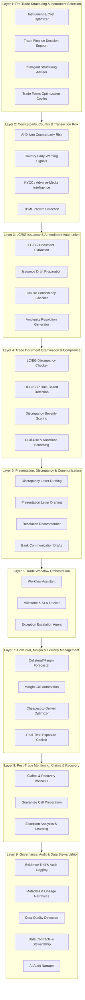

# T4: Trade Finance

## Overview

Trade Finance (T4) encompasses the complex world of Letters of Credit (LCs), Bank Guarantees (BGs), Standby Letters of Credit (SBLCs), trade loans, and commodity-linked exposures. For Tüpraş, this involves managing high-value oil and petrochemical transactions with counterparties across diverse geographies, each carrying unique risk profiles and compliance requirements.

!!! info "Regulatory Compliance"

    Trade finance AI solutions ensure compliance with **UCP 600**, **ISBP 745**, **sanctions regulations** (OFAC, EU, UN), and **AML requirements**. All document processing maintains full audit trails for regulatory examination.

This tower transforms traditional paper-intensive, manual trade finance operations into an AI-augmented function that:
- **Structures optimal instruments** by analyzing cost, risk, and collateral trade-offs
- **Monitors counterparty and country risks** in real-time with early warning signals
- **Automates document processing** from LC issuance through presentation and settlement
- **Ensures compliance** with UCP 600, ISBP, sanctions, and AML regulations
- **Orchestrates workflows** with intelligent milestone tracking and exception handling
- **Manages collateral and margin** proactively to optimize liquidity



---

## Layer 1: Pre-Trade Structuring & Instrument Selection

Layer 1 provides AI-powered decision support for selecting and structuring the optimal trade finance instrument before a transaction is initiated. This strategic layer helps treasury teams choose between Letters of Credit, Bank Guarantees, Open Account, Supply Chain Finance, and other instruments based on cost, risk, and operational factors.

### 1.1 Instrument & Cost Optimizer (LC vs Open Account vs SCF)

**What it does:**

Analyzes the full cost-benefit landscape of different trade finance instruments for a specific transaction, comparing bank fees, funding costs, risk mitigation value, and operational complexity to recommend the optimal financing structure.

**Key Inputs:**

- Transaction details (value, currency, tenor, Incoterms)
- Counterparty credit profile and payment history
- Country risk ratings (political, economic, transfer)
- Bank fee schedules across relationship banks
- Internal cost of capital and funding rates
- Risk appetite parameters
- Historical instrument performance data

**AI/LLM Approach:**

- Multi-criteria decision analysis (MCDA) engine
- Cost calculation with sensitivity analysis
- Risk-adjusted return optimization
- Natural language scenario explanation
- Benchmark comparison against peer transactions

**Example Interaction:**

> **User:** We have a $25M crude oil purchase from a new supplier in Kazakhstan. They're offering Net 60 terms. What's the best financing structure?

> **Claude:** I've analyzed financing options for your $25M crude purchase from Kazakhstan:
>
> **Instrument Comparison:**
>
> ```
> ┌─────────────────────────────────────────────────────────────────────────────┐
> │                    TRADE FINANCE INSTRUMENT ANALYSIS                        │
> │                    Transaction: $25M Crude Oil Purchase                     │
> │                    Supplier: KazOil Trading (Kazakhstan)                    │
> │                    Terms: Net 60 days                                       │
> └─────────────────────────────────────────────────────────────────────────────┘
>
>  Option              Total Cost    Risk Coverage    Recommendation
> ───────────────────────────────────────────────────────────────────
>  1. Confirmed LC     $87,500       ████████████     ⭐ RECOMMENDED
>                      (0.35%)       Full payment &   Best for new supplier
>                                    country risk     in high-risk region
>
>  2. Unconfirmed LC   $50,000       ████████░░░░     Consider if
>                      (0.20%)       Issuing bank     supplier's bank
>                                    risk only        is strong (Tier 1)
>
>  3. Open Account     $0            ░░░░░░░░░░░░     NOT RECOMMENDED
>     + Credit Ins.    + $62,500     Payment risk     New supplier,
>                      (0.25%)       partial cover    limited history
>
>  4. Standby LC       $37,500       ██████░░░░░░     Alternative
>     (Backup)         (0.15%)       Fallback only    If supplier prefers
>                                                     open account
> ───────────────────────────────────────────────────────────────────
> ```
>
> **Recommendation: Confirmed Letter of Credit**
>
> | Factor | Assessment |
> |--------|------------|
> | Supplier Risk | New relationship, limited payment history |
> | Country Risk | Kazakhstan rated BB+ (elevated transfer risk) |
> | Transaction Size | $25M is material; warrants risk mitigation |
> | Cost Impact | 0.35% = $87,500 (acceptable for risk transfer) |
> | Bank Availability | Ziraat and ING both offer competitive rates |
>
> **Cost Breakdown (Confirmed LC):**
> - LC issuance fee: 0.15% = $37,500
> - Confirmation fee: 0.12% = $30,000
> - SWIFT & handling: $500
> - Courier/doc fees: ~$500
> - **Total: $68,500 + contingency = ~$87,500**
>
> **Risk Mitigation Value:**
> - Full payment guarantee from confirming bank
> - No exposure to supplier non-performance (if docs comply)
> - Eliminates Kazakhstan transfer/convertibility risk
>
> Shall I prepare the LC application with recommended terms, or compare specific bank quotes?

**Outputs:**

- Instrument comparison matrix with costs
- Risk-adjusted recommendation
- Cost breakdown by component
- Bank quote comparison (if available)
- Draft instrument terms

**KPIs:**

- Recommendation accuracy vs. post-trade outcomes
- Average cost savings vs. baseline choices
- Decision time reduction
- User adoption rate

---

### 1.2 Trade Finance Decision Support (Scenario Comparison)

**What it does:**

Enables interactive scenario modeling for trade finance decisions, allowing users to adjust parameters (payment terms, currencies, guarantees, pricing) and instantly see the impact on costs, risks, and cash flows.

**Key Inputs:**

- Base transaction parameters
- Alternative scenario inputs from user
- Market rates (FX, interest rates)
- Bank pricing models
- Risk scoring algorithms
- Cash flow projection models

**AI/LLM Approach:**

- Real-time scenario calculation engine
- Monte Carlo simulation for uncertainty
- Sensitivity analysis visualization
- Natural language what-if queries
- Trade-off explanation generation

**Example Interaction:**

> **User:** What if we ask the Kazakhstan supplier to accept 30-day terms instead of 60 days? And what if we pay in EUR instead of USD?

> **Claude:** Here's the scenario analysis comparing your alternatives:
>
> **Scenario Comparison Dashboard:**
>
> | Parameter | Base Case | Scenario A | Scenario B |
> |-----------|-----------|------------|------------|
> | **Payment Terms** | Net 60 | Net 30 | Net 60 |
> | **Currency** | USD | USD | EUR |
> | **Amount** | $25M | $25M | €23.4M |
>
> **Financial Impact:**
>
> ```
> Cost Impact Analysis (vs. Base Case)
> ═══════════════════════════════════════════════════════════════
>
> Scenario A: Net 30 Terms
> ┌────────────────────────────────────────────────────────────┐
> │ LC Cost Reduction     -$12,500  (shorter tenor = lower fee)│
> │ Discount Potential    -$50,000  (2% early pay discount)    │
> │ Funding Cost          +$34,700  (finance 30 days earlier)  │
> │ ──────────────────────────────────────────────────────────│
> │ NET BENEFIT           -$27,800  ✅ Favorable               │
> │ Negotiation Likelihood: 35% (suppliers rarely accept)      │
> └────────────────────────────────────────────────────────────┘
>
> Scenario B: EUR Payment
> ┌────────────────────────────────────────────────────────────┐
> │ FX Conversion Cost    +$18,750  (0.075% spread)            │
> │ EUR Funding Benefit   -$8,200   (lower EUR rates)          │
> │ EUR LC Pricing        -$5,000   (some banks cheaper in EUR)│
> │ FX Hedge Cost         +$22,400  (3-month forward points)   │
> │ ──────────────────────────────────────────────────────────│
> │ NET COST              +$27,950  ⚠️ More Expensive          │
> │ Note: Only beneficial if you have natural EUR cash surplus │
> └────────────────────────────────────────────────────────────┘
> ```
>
> **Cash Flow Timeline:**
>
> ```
>          Day 0       Day 30      Day 60      Day 90
>            │           │           │           │
> Base:      │           │     ←$25M payment→   │
>            │           │           │           │
> Scen A:    │     ←$25M payment→   │           │
>            │    (earlier outflow)  │           │
>            │           │           │           │
> LC Expiry: │           │           │←── LC expires ──→
> ```
>
> **Recommendation:**
>
> 1. **Scenario A (Net 30)** is financially attractive IF supplier agrees
>    - Try negotiating with 2% early payment discount as incentive
>    - Reduces your exposure period by 30 days
>
> 2. **Scenario B (EUR)** is not recommended unless:
>    - You have excess EUR liquidity to deploy
>    - Supplier specifically prefers EUR settlement
>
> Want me to draft a negotiation proposal for the Net 30 terms?

**Outputs:**

- Side-by-side scenario comparison
- Net financial impact calculation
- Cash flow timeline visualization
- Risk impact assessment
- Negotiation recommendations

**KPIs:**

- Scenario accuracy vs. actuals
- User engagement with scenario tool
- Improved negotiation outcomes
- Decision confidence scores

---

### 1.3 Intelligent Instrument Structuring Advisor

**What it does:**

Provides expert guidance on structuring complex trade finance instruments, including multi-bank facilities, back-to-back LCs, transferable credits, and structured trade loans. Acts as a virtual trade finance expert for non-specialists.

**Key Inputs:**

- Transaction complexity indicators
- Multi-party relationship structures
- Risk distribution requirements
- Bank facility availability
- Regulatory constraints
- Historical structuring patterns

**AI/LLM Approach:**

- Knowledge graph of trade finance structures
- Pattern matching to historical deals
- Constraint satisfaction optimization
- Expert system for structuring rules
- Natural language explanation of structures

**Example Interaction:**

> **User:** We're doing a back-to-back deal: buying crude from SOCAR Azerbaijan and selling refined products to a Romanian buyer. How should we structure the trade finance?

> **Claude:** This is a classic back-to-back trade finance scenario. Here's my recommended structure:
>
> **Transaction Flow Visualization:**
>
> ```
> ┌─────────────────────────────────────────────────────────────────────────┐
> │                    BACK-TO-BACK TRADE STRUCTURE                         │
> └─────────────────────────────────────────────────────────────────────────┘
>
>     UPSTREAM (Purchase)                    DOWNSTREAM (Sale)
>     ═══════════════════                    ══════════════════
>
>     ┌──────────────┐                       ┌──────────────┐
>     │    SOCAR     │                       │   Romanian   │
>     │ (Azerbaijan) │                       │    Buyer     │
>     └──────┬───────┘                       └──────┬───────┘
>            │ Crude Oil                            │ Refined Products
>            │ $30M                                 │ $38M
>            ▼                                      ▼
>     ┌──────────────┐         Refining      ┌──────────────┐
>     │   Master LC  │ ───────────────────── │  Export LC   │
>     │   (Import)   │       TÜPRAŞ          │   (Export)   │
>     │  Confirmed   │                       │ Transferable │
>     └──────┬───────┘                       └──────┬───────┘
>            │                                      │
>            ▼                                      ▼
>     ┌──────────────┐                       ┌──────────────┐
>     │ Issuing Bank │                       │ Advising Bank│
>     │   (Ziraat)   │                       │    (ING)     │
>     └──────────────┘                       └──────────────┘
>            │                                      │
>            ▼                                      ▼
>     ┌──────────────┐                       ┌──────────────┐
>     │Confirming Bnk│                       │ Romanian     │
>     │   (ING)      │                       │ Buyer's Bank │
>     └──────────────┘                       └──────────────┘
> ```
>
> **Recommended Structure:**
>
> | Component | Recommendation | Rationale |
> |-----------|----------------|-----------|
> | **Import LC** | Confirmed, Sight | SOCAR is reliable but Azerbaijan has transfer risk |
> | **Export LC** | At-sight, Transferable | Enables assignment if needed; Romanian bank quality varies |
> | **Tenor Alignment** | Import: 60 days, Export: 30 days | Positive cash cycle (collect before pay) |
> | **Currency** | Both in USD | Avoid FX mismatch; oil traded in USD |
> | **Partial Shipments** | Allowed on both | Flexibility for cargo scheduling |
>
> **Risk & Cash Flow Optimization:**
>
> ```
> Timeline (Days)
> ─────────────────────────────────────────────────────────────────────
>    0         15        30        45        60        75        90
>    │          │         │         │         │         │         │
>    │ Crude    │         │ Product │         │         │         │
>    │ loaded   │         │ shipped │         │         │         │
>    │          │         │         │         │         │         │
>    │          │         │    ┌────┴────┐    │         │         │
>    │          │         │    │ Export  │    │         │         │
>    │          │         │    │ LC Paid │    │         │         │
>    │          │         │    │ +$38M   │    │         │         │
>    │          │         │    └─────────┘    │         │         │
>    │          │         │         │    ┌────┴────┐    │         │
>    │          │         │         │    │ Import  │    │         │
>    │          │         │         │    │ LC Due  │    │         │
>    │          │         │         │    │ -$30M   │    │         │
>    │          │         │         │    └─────────┘    │         │
>    │          │         │         │         │         │         │
>    └──────────┴─────────┴─────────┴─────────┴─────────┴─────────┘
>
>    💰 Net Position: +$8M margin captured before paying supplier
> ```
>
> **Key Structuring Tips:**
>
> 1. **Align shipment dates** - Export LC latest shipment should precede Import LC payment date
> 2. **Use same advising bank** (ING) for both to simplify document flow
> 3. **Mirror key terms** - Ensure product descriptions, origins, and dates are consistent
> 4. **Consider transfer option** on export LC if Romanian buyer creditworthiness changes
>
> Shall I prepare draft LC applications for both instruments?

**Outputs:**

- Structure diagram and flow chart
- Term sheet recommendations
- Timeline and cash flow mapping
- Risk distribution analysis
- Draft instrument applications

**KPIs:**

- Structure optimization (cost/risk ratio)
- Deal success rate
- Structuring time reduction
- Error rate in instrument alignment

---

### 1.4 Trade Terms Optimization Copilot (Tenor, Currency, Guarantees)

**What it does:**

Acts as an interactive advisor during commercial negotiations, instantly calculating the financial implications of different trade terms (payment tenor, currencies, guarantee requirements) to help negotiators make informed decisions in real-time.

**Key Inputs:**

- Live negotiation parameters
- Counterparty requirements
- Company policy constraints
- Current market rates
- Bank facility availability
- Historical negotiation outcomes

**AI/LLM Approach:**

- Real-time cost calculation API
- Constraint validation engine
- Natural language query processing
- Negotiation strategy suggestions
- Policy compliance checking

**Example Interaction:**

> **User:** I'm on a call with our supplier. They want 90-day terms instead of 60. They're also asking for a standby LC as additional security. What's the financial impact?

> **Claude:** Quick analysis for your live negotiation:
>
> **📊 INSTANT IMPACT ASSESSMENT**
>
> | Change Requested | Financial Impact | Recommendation |
> |------------------|------------------|----------------|
> | Terms: 60 → 90 days | +$52,000 cost | ⚠️ Counter-offer 75 days |
> | Add Standby LC | +$25,000/year | ✅ Acceptable if needed |
> | **Combined** | **+$77,000** | Negotiate trade-off |
>
> **Detailed Breakdown:**
>
> ```
> 90-Day Terms Impact:
> ├── Additional 30-day funding cost: +$34,700
> │   (based on 5.2% funding rate on $25M)
> ├── Extended LC fee (extra month): +$12,500
> ├── Increased FX exposure window: +$4,800
> │   (additional hedging cost)
> └── TOTAL: +$52,000 (~0.21% of deal value)
>
> Standby LC Impact:
> ├── Issuance fee (annual): $15,000
> ├── Facility utilization cost: $10,000
> └── TOTAL: $25,000/year
> ```
>
> **💡 NEGOTIATION STRATEGY:**
>
> 1. **Counter-offer:** Accept 90 days IF they drop SBLC requirement
>    - Net cost: +$52,000 vs. +$77,000
>    - Argument: "Extended terms reduce your risk, SBLC is redundant"
>
> 2. **Alternative:** Accept SBLC IF they improve price by 0.3%
>    - Recoups $75,000 on $25M deal
>    - Net benefit: -$23,000 (you come out ahead)
>
> 3. **Compromise:** 75-day terms + SBLC valid only for first 3 shipments
>    - Shows good faith while limiting exposure
>    - SBLC cost reduced to ~$12,000 (6-month validity)
>
> **⚡ QUICK ANSWER FOR YOUR CALL:**
> *"We can consider the 90-day terms, but the standby LC on top would push our costs up significantly. Could we agree to 90 days without the SBLC, or 75 days with a time-limited SBLC for our first few transactions?"*
>
> Need any other scenarios calculated while you're on the call?

**Outputs:**

- Real-time cost impact calculations
- Negotiation talking points
- Counter-offer suggestions
- Policy compliance flags
- Deal comparison metrics

**KPIs:**

- Response time for live queries
- Negotiation outcome improvement
- Policy compliance rate
- User satisfaction during negotiations

---

## Layer 2: Counterparty, Country & Transaction Risk

Layer 2 provides continuous monitoring and assessment of counterparty creditworthiness, country-specific risks, and transaction-level anomalies. This layer ensures that trade finance decisions are informed by real-time risk intelligence rather than static, outdated assessments.

### 2.1 AI-Driven Counterparty Risk Management

**What it does:**

Maintains dynamic risk profiles for all trade counterparties (suppliers, buyers, banks) by continuously aggregating financial data, payment behavior, market signals, and news sentiment to provide real-time creditworthiness assessments.

**Key Inputs:**

- Financial statements and credit reports
- Payment history (on-time, late, default patterns)
- Market data (stock price, CDS spreads)
- News and social media sentiment
- Industry and peer performance
- Relationship history with Tüpraş
- Bank and rating agency assessments

**AI/LLM Approach:**

- Multi-source data fusion and normalization
- Credit scoring with ML ensemble models
- Sentiment analysis on news/media
- Anomaly detection for sudden changes
- Natural language risk narrative generation
- Peer comparison analytics

**Example Interaction:**

> **User:** Give me a risk assessment for Petkim before we extend their payment terms.

> **Claude:** Here's the comprehensive risk assessment for Petkim Petrokimya Holding A.Ş.:
>
> **📊 COUNTERPARTY RISK DASHBOARD**
>
> ```
> ┌─────────────────────────────────────────────────────────────────────────┐
> │  PETKIM PETROKIMYA HOLDING A.Ş.                                         │
> │  Risk Score: 72/100 (MODERATE)    ████████████████████░░░░░░░░ 72%     │
> │  Trend: ↗ Improving (+5 pts vs. Q3)                                     │
> └─────────────────────────────────────────────────────────────────────────┘
> ```
>
> **Risk Factor Breakdown:**
>
> | Factor | Score | Weight | Weighted | Assessment |
> |--------|-------|--------|----------|------------|
> | Financial Health | 68/100 | 30% | 20.4 | Adequate liquidity, moderate leverage |
> | Payment History | 85/100 | 25% | 21.3 | Excellent - always within terms |
> | Market Position | 75/100 | 15% | 11.3 | Leading Turkish petrochemicals |
> | News Sentiment | 62/100 | 10% | 6.2 | Some negative press on parent (SOCAR) |
> | Country Risk | 58/100 | 10% | 5.8 | Turkey macro uncertainty |
> | Relationship | 90/100 | 10% | 9.0 | 12-year partnership |
> | **Total** | | **100%** | **72/100** | |
>
> **Financial Snapshot:**
>
> ```
> Revenue (TTM):     $3.2B  │  Debt/EBITDA:   2.8x  │  Current Ratio: 1.4x
> Net Income:        $180M  │  Interest Cvg:  4.2x  │  Quick Ratio:   0.9x
> Cash Position:     $420M  │  D/E Ratio:     0.65  │  Working Cap:   $280M
>
> Payment Performance (Last 24 months):
> ┌────────────────────────────────────────────────────────────────────┐
> │ On-time: ████████████████████████████████████████████ 94%         │
> │ 1-15 days late: ██ 4%                                              │
> │ 16-30 days late: █ 2%                                              │
> │ >30 days late: 0%                                                  │
> └────────────────────────────────────────────────────────────────────┘
> ```
>
> **Recent Signals:**
>
> | Date | Signal | Impact |
> |------|--------|--------|
> | Jan 8 | Q4 earnings beat estimates by 12% | ✅ Positive |
> | Jan 3 | Moody's affirmed Ba2, outlook stable | ✅ Positive |
> | Dec 15 | New CFO appointed (from Shell) | ✅ Positive |
> | Nov 28 | Parent SOCAR debt restructuring news | ⚠️ Monitor |
>
> **Recommendation for Term Extension:**
>
> | Current Terms | Proposed Extension | Risk Assessment |
> |--------------|-------------------|-----------------|
> | Net 30 | Net 45 | ✅ **APPROVED** - Low risk increase |
> | Net 30 | Net 60 | ⚠️ **CONDITIONAL** - Require updated financials |
> | Net 30 | Net 90 | 🔴 **NOT RECOMMENDED** - Exceeds risk threshold |
>
> **Suggested Conditions for Net 45:**
> - Quarterly financial update requirement
> - Automatic reversion to Net 30 if payment delayed >15 days
> - Set exposure limit at $15M outstanding
>
> Want me to draft the term extension agreement with these conditions?

**Outputs:**

- Risk score and trend visualization
- Factor-by-factor breakdown
- Financial health metrics
- Payment behavior analysis
- Recommendation with conditions

**KPIs:**

- Risk score correlation with actual defaults
- Early warning lead time (days before issue)
- Exposure at risk reduction
- Assessment update frequency

---

### 2.2 Counterparty & Country Early-Warning Signals

**What it does:**

Continuously monitors global data streams (news, sanctions lists, market data, economic indicators) to detect early warning signals of counterparty deterioration or country risk events that could impact trade finance exposures.

**Key Inputs:**

- Real-time news feeds (multi-language)
- Sanctions list updates (OFAC, EU, UN)
- Credit rating changes
- Macro-economic indicators
- Political event trackers
- Currency and market volatility
- Social media and local press

**AI/LLM Approach:**

- NLP-based news categorization and entity linking
- Event extraction and severity scoring
- Cross-reference with exposure database
- Alert prioritization by materiality
- Natural language alert summarization
- Relationship graph analysis

**Example Interaction:**

> **User:** Any alerts I should know about for our active trade finance counterparties?

> **Claude:** Here's your Early Warning Alert Summary:
>
> **🚨 TRADE FINANCE ALERT DASHBOARD**
>
> ```
> ═══════════════════════════════════════════════════════════════════════════
>                           ALERT SUMMARY (Last 7 Days)
> ═══════════════════════════════════════════════════════════════════════════
>  🔴 CRITICAL: 1    ⚠️ WARNING: 2    ℹ️ MONITOR: 4    ✅ POSITIVE: 3
> ═══════════════════════════════════════════════════════════════════════════
> ```
>
> ---
>
> **🔴 CRITICAL ALERT - Immediate Action Required**
>
> | Alert ID | EWS-2025-0147 |
> |----------|---------------|
> | **Counterparty** | Yug-Neft Trading Ltd. (Russia) |
> | **Event** | Added to UK sanctions list (Jan 10, 2025) |
> | **Your Exposure** | LC #2025-0234 - $8.2M (shipment in transit) |
> | **Impact** | Payment may be blocked by confirming bank |
>
> **Recommended Actions:**
> 1. Contact ING (confirming bank) immediately to assess payment status
> 2. Verify shipment documentation for any sanctioned party references
> 3. Consult legal on contract force majeure provisions
> 4. Escalate to CFO given materiality
>
> ---
>
> **⚠️ WARNING ALERTS**
>
> | # | Counterparty | Event | Exposure | Action |
> |---|--------------|-------|----------|--------|
> | 1 | **EgyptOil Corp** | Currency controls tightened; EGP -12% this week | $4.5M LC pending | Monitor; consider requiring USD account |
> | 2 | **Azeri Refining** | CFO resignation announced (no replacement named) | $12M open account | Request financials; tighten credit limit |
>
> ---
>
> **ℹ️ MONITORING ITEMS**
>
> ```
> • Kazakhstan: Central bank raised rates 100bps - currency stabilizing
> • Romania: EU infringement proceeding (minor, no trade impact expected)
> • Libya: Port operations resumed after 5-day strike
> • Greece: New shipping tax proposed (watch for cost pass-through)
> ```
>
> ---
>
> **✅ POSITIVE DEVELOPMENTS**
>
> | Counterparty | News | Impact |
> |--------------|------|--------|
> | Petkim | S&P upgrade to BB+ | Lower confirmation costs possible |
> | MOL Hungary | $500M bond successfully issued | Improved liquidity |
> | SOCAR | New $2B facility signed | Reduces parent risk |
>
> ---
>
> **Exposure Heat Map by Country:**
>
> ```
>                          COUNTRY RISK EXPOSURE (Active LCs + BGs)
>
>                 Low Risk ◄──────────────────────► High Risk
>
>  Turkey     ███████████████████████████░░░░░░░░░░░  $145M  ⚠️
>  Azerbaijan █████████████████░░░░░░░░░░░░░░░░░░░░░  $67M   ⚠️
>  Russia     ██████░░░░░░░░░░░░░░░░░░░░░░░░░░░░░░░░  $24M   🔴
>  Egypt      ████░░░░░░░░░░░░░░░░░░░░░░░░░░░░░░░░░░  $18M   ⚠️
>  Romania    ███████████░░░░░░░░░░░░░░░░░░░░░░░░░░░  $42M   ✅
>  Germany    ████████████████████████░░░░░░░░░░░░░░  $89M   ✅
>  Netherlands████████████░░░░░░░░░░░░░░░░░░░░░░░░░░  $51M   ✅
> ```
>
> Should I drill into the Russia sanctions alert or prepare an exposure reduction plan?

**Outputs:**

- Prioritized alert dashboard
- Detailed alert cards with actions
- Exposure heat maps
- Country risk monitoring
- Positive development tracking

**KPIs:**

- Alert lead time before material impact
- False positive rate <20%
- User response time to critical alerts
- Exposure preserved by early action

---

### 2.3 KYCC / Adverse-Media Intelligence

**What it does:**

Performs enhanced due diligence on counterparties' customers and suppliers (Know Your Customer's Customer - KYCC), as well as continuous adverse media screening to identify reputational, legal, or compliance risks in the supply chain.

**Key Inputs:**

- Counterparty ownership structures
- Ultimate Beneficial Owner (UBO) databases
- Adverse media databases
- Court records and litigation data
- Regulatory enforcement actions
- PEP (Politically Exposed Persons) lists
- Corporate registry filings

**AI/LLM Approach:**

- Entity resolution and relationship mapping
- Multi-language adverse media NLP
- Risk categorization and severity scoring
- Network analysis for hidden connections
- Automated due diligence report generation
- Change detection on monitored entities

**Example Interaction:**

> **User:** We have a new trading company in Dubai offering crude - Global Energy DMCC. Can you run a KYCC check?

> **Claude:** Running enhanced due diligence on Global Energy DMCC:
>
> **🔍 KYCC INTELLIGENCE REPORT**
>
> ```
> ┌─────────────────────────────────────────────────────────────────────────┐
> │  ENTITY: Global Energy DMCC                                             │
> │  Jurisdiction: Dubai Multi Commodities Centre (UAE)                     │
> │  Overall Risk Rating: ⚠️ ELEVATED (Score: 58/100)                      │
> │  Recommendation: ENHANCED DUE DILIGENCE REQUIRED                        │
> └─────────────────────────────────────────────────────────────────────────┘
> ```
>
> **Ownership Structure:**
>
> ```
>                    Global Energy DMCC (Dubai)
>                              │
>          ┌──────────────────┼──────────────────┐
>          │                  │                  │
>       40%                 35%               25%
>          │                  │                  │
>    ┌─────┴─────┐     ┌─────┴─────┐     ┌─────┴─────┐
>    │ Eastwind  │     │  Mikhail  │     │  Unknown  │
>    │ Holdings  │     │  Petrov   │     │  (Bearer  │
>    │ (Cyprus)  │     │ (Russian) │     │  shares)  │
>    └─────┬─────┘     └───────────┘     └───────────┘
>          │                  │
>          │            ⚠️ PEP FLAG
>          │            Former Deputy
>          │            Minister of Energy
>          │            (Russia, 2015-2019)
>          │
>          └──► Eastwind Holdings traces to
>               BVI company - UBO unclear
> ```
>
> **Red Flags Identified:**
>
> | # | Risk Type | Description | Severity |
> |---|-----------|-------------|----------|
> | 1 | **PEP Exposure** | 35% owner Mikhail Petrov is former Russian energy official | 🔴 High |
> | 2 | **Ownership Opacity** | 25% held via bearer shares (UBO unknown) | 🔴 High |
> | 3 | **Shell Structure** | Cypriot holding traces to BVI | ⚠️ Medium |
> | 4 | **Age of Entity** | Incorporated only 14 months ago | ⚠️ Medium |
> | 5 | **No Audited Financials** | Declined to provide when requested | ⚠️ Medium |
>
> **Adverse Media Scan:**
>
> | Date | Source | Summary | Relevance |
> |------|--------|---------|-----------|
> | Sep 2024 | Reuters | "Dubai trading houses face scrutiny over Russian oil flows" - mentions similar structures | ⚠️ Contextual |
> | Aug 2024 | UAE Court | Lawsuit by former employee alleging document falsification (pending) | ⚠️ Direct |
> | Jun 2024 | Industry Blog | Named in list of "new Dubai oil traders" after sanctions wave | ℹ️ Informational |
>
> **Sanctions Screening:**
>
> | List | Status |
> |------|--------|
> | OFAC SDN | ✅ No match |
> | EU Consolidated | ✅ No match |
> | UN Sanctions | ✅ No match |
> | UK Sanctions | ✅ No match |
> | **Note** | Owner Petrov not sanctioned, but PEP status warrants caution |
>
> **Recommendation:**
>
> ```
> ┌─────────────────────────────────────────────────────────────────────────┐
> │  DO NOT PROCEED WITHOUT:                                                │
> │                                                                         │
> │  1. □ Full UBO disclosure for bearer share portion                      │
> │  2. □ Explanation of Cypriot/BVI structure and commercial rationale     │
> │  3. □ Audited financial statements or bank references                   │
> │  4. □ PEP enhanced due diligence sign-off from Compliance               │
> │  5. □ Legal opinion on sanctions risk given PEP involvement             │
> │                                                                         │
> │  If requirements met, consider:                                         │
> │  • Confirmed LC only (no open account)                                  │
> │  • Lower transaction limits initially ($5M max)                         │
> │  • Enhanced monitoring for first 6 months                               │
> └─────────────────────────────────────────────────────────────────────────┘
> ```
>
> Should I generate a formal due diligence questionnaire to send to Global Energy DMCC?

**Outputs:**

- Ownership structure visualization
- Red flag summary and severity
- Adverse media hits with analysis
- Sanctions screening results
- Due diligence action checklist

**KPIs:**

- Red flag detection accuracy
- Due diligence completion rate
- Time to complete KYCC check
- Regulatory audit pass rate

---

### 2.4 Trade-Based Money Laundering (TBML) Pattern Detection

**What it does:**

Analyzes trade transactions for patterns indicative of trade-based money laundering, including over/under invoicing, multiple invoicing, phantom shipments, and carousel fraud, using AI to detect anomalies against market benchmarks and historical norms.

**Key Inputs:**

- Invoice amounts and quantities
- Commodity benchmark prices
- Shipping and logistics data
- Historical transaction patterns
- Counterparty transaction history
- Country-pair trade statistics
- TBML red flag typologies (FATF)

**AI/LLM Approach:**

- Price anomaly detection vs. benchmarks
- Pattern recognition for known TBML schemes
- Network analysis for circular transactions
- Statistical outlier identification
- Rule-based typology matching
- Explainable alert generation

**Example Interaction:**

> **User:** Run a TBML check on the invoice from Global Energy DMCC for 50,000 MT of Urals crude at $78/bbl.

> **Claude:** TBML Analysis for Global Energy DMCC Invoice:
>
> **📊 TRADE-BASED MONEY LAUNDERING SCREENING**
>
> ```
> ┌─────────────────────────────────────────────────────────────────────────┐
> │  Transaction: INV-2025-0892                                             │
> │  Seller: Global Energy DMCC (Dubai)                                     │
> │  Commodity: Urals Crude Oil                                             │
> │  Quantity: 50,000 MT                                                    │
> │  Price: $78.00/bbl ($572.00/MT)                                         │
> │  Total Value: $28,600,000                                               │
> │                                                                         │
> │  TBML Risk Score: ⚠️ ELEVATED (68/100)                                 │
> └─────────────────────────────────────────────────────────────────────────┘
> ```
>
> **Price Anomaly Analysis:**
>
> ```
>                    URALS CRUDE PRICE COMPARISON
>
>    Invoice Price:  $78.00/bbl  ──────────────────────────────┐
>                                                              │
>    Platts Urals (Dated):       $72.50/bbl  ─────────────┐    │
>    Argus Urals (Rotterdam):    $71.80/bbl  ────────────┐│    │
>    Average Deal Price (Q4):    $73.20/bbl  ───────────┐││    │
>                                                       │││    │
>                                                       ▼▼▼    ▼
>    ├────────────┬────────────┬────────────┬────────────┬────────────┤
>    $65         $70          $75          $78         $80         $85
>
>    ⚠️ Invoice price is $5.50/bbl ABOVE market (+7.6%)
>    ⚠️ This premium exceeds normal variance (±3%)
> ```
>
> **TBML Red Flag Assessment:**
>
> | Red Flag | Description | Status | Risk |
> |----------|-------------|--------|------|
> | **Over-Invoicing** | Price significantly above market | 🔴 DETECTED | High |
> | **Under-Invoicing** | Price significantly below market | ✅ Not detected | - |
> | **Quantity Mismatch** | Invoice vs. B/L quantities | ⏳ Pending B/L | TBD |
> | **Multiple Invoicing** | Same shipment invoiced twice | ✅ Not detected | - |
> | **Phantom Shipment** | No corresponding shipment | ⏳ Pending vessel confirm | TBD |
> | **High-Risk Route** | Origin/destination flags | ⚠️ Dubai intermediary | Medium |
> | **Shell Company** | Counterparty risk factors | 🔴 See KYCC report | High |
>
> **Financial Impact of Over-Invoicing:**
>
> ```
> If legitimate premium:
> ├── Quality premium (low sulfur): +$2-3/bbl typical
> ├── Logistics/timing premium:     +$1-2/bbl possible
> └── Maximum justified premium:     ~$4/bbl
>
> Unexplained premium: $78 - $72.50 (market) - $4 (max premium) = $1.50/bbl
> On 50,000 MT (~367,000 bbls): $1.50 × 367,000 = $550,500 UNEXPLAINED
> ```
>
> **TBML Scheme Pattern Matching:**
>
> | Scheme Type | Indicators Present | Match Score |
> |-------------|-------------------|-------------|
> | Over-Invoicing for capital flight | Price premium + new counterparty + opaque ownership | 72% |
> | Trade-based sanctions evasion | Dubai intermediary + Russian PEP owner + crude oil | 65% |
> | Customs duty fraud | N/A - import duty minimal on crude | 10% |
>
> **Recommended Actions:**
>
> ```
> ┌─────────────────────────────────────────────────────────────────────────┐
> │  BEFORE PROCEEDING:                                                     │
> │                                                                         │
> │  1. □ Request price justification from seller                           │
> │       (quality certificates, timing premium explanation)                │
> │  2. □ Obtain independent price verification from broker                 │
> │  3. □ Verify vessel and cargo with shipping agent                       │
> │  4. □ Escalate to Compliance for TBML review                            │
> │  5. □ Consider if transaction aligns with sanctions policy              │
> │                                                                         │
> │  IF PROCEEDING:                                                         │
> │  • Document all justifications in transaction file                      │
> │  • File SAR if premium cannot be commercially justified                 │
> │  • Enhanced monitoring for subsequent transactions                      │
> └─────────────────────────────────────────────────────────────────────────┘
> ```
>
> Want me to generate a formal price justification request letter to Global Energy DMCC?

**Outputs:**

- TBML risk score and breakdown
- Price anomaly visualization
- Red flag assessment matrix
- Scheme pattern matching
- Compliance action checklist

**KPIs:**

- TBML detection rate (true positives)
- False positive rate <15%
- SAR filing accuracy
- Regulatory examination findings

---

## Layer 3: LC / BG Issuance & Amendment Automation

Layer 3 automates the preparation and validation of Letters of Credit and Bank Guarantees, from initial document extraction through draft preparation, clause checking, and ambiguity resolution. This layer dramatically reduces manual effort while improving accuracy.

### 3.1 LC / BG Document Extraction

**What it does:**

Automatically extracts and structures data from source documents (contracts, purchase orders, proforma invoices) to prepare for LC/BG issuance, using OCR and NLP to handle diverse document formats including scanned PDFs and handwritten notes.

**Key Inputs:**

- Sales/purchase contracts (PDF, Word)
- Proforma invoices
- Purchase orders
- Shipping specifications
- Insurance requirements
- Previous LC templates
- Bank application form templates

**AI/LLM Approach:**

- Multimodal OCR for document ingestion
- Named entity recognition for key fields
- Table extraction and normalization
- Cross-document field matching
- Confidence scoring for extracted values
- Human review queue for low-confidence items

**Example Interaction:**

> **User:** Extract the key terms from this contract for the LC application.

> **Claude:** I've analyzed the contract (SOCAR-TUP-2025-0234.pdf). Here's the extraction:
>
> **📄 DOCUMENT EXTRACTION RESULTS**
>
> ```
> ┌─────────────────────────────────────────────────────────────────────────┐
> │  Source: SOCAR-TUP-2025-0234.pdf (14 pages)                             │
> │  Contract Type: Crude Oil Purchase Agreement                            │
> │  Extraction Confidence: 94%                                             │
> └─────────────────────────────────────────────────────────────────────────┘
> ```
>
> **Extracted Fields for LC Application:**
>
> | Field | Extracted Value | Source Location | Confidence |
> |-------|-----------------|-----------------|------------|
> | **Applicant** | Tüpraş Türkiye Petrol Rafinerileri A.Ş. | Header, p.1 | 100% |
> | **Beneficiary** | SOCAR Trading SA | Section 1.1, p.2 | 100% |
> | **Amount** | USD 28,500,000 (+/- 10%) | Section 3.1, p.4 | 98% |
> | **Commodity** | Azeri Light Crude Oil | Section 2.1, p.3 | 100% |
> | **Quantity** | 200,000 barrels (+/- 5%) | Section 2.2, p.3 | 97% |
> | **Price** | Dated Brent + $2.15/bbl | Section 3.2, p.4 | 95% |
> | **Incoterms** | CIF Tüpraş İzmit Terminal | Section 4.1, p.5 | 100% |
> | **Latest Shipment** | March 15, 2025 | Section 5.1, p.6 | 100% |
> | **Expiry Date** | April 15, 2025 | Section 5.2, p.6 | 100% |
> | **Payment Terms** | At sight | Section 6.1, p.7 | 100% |
> | **Partial Shipments** | Allowed | Section 5.4, p.6 | 100% |
> | **Transhipment** | Allowed | Section 5.5, p.6 | 100% |
>
> **Required Documents (from Section 7):**
>
> ```
> ✓ Commercial Invoice (3 originals + 3 copies)
> ✓ Full set Bills of Lading (3/3) made out to order, blank endorsed
> ✓ Certificate of Origin (issued by Chamber of Commerce)
> ✓ Certificate of Quality (SGS or equivalent)
> ✓ Certificate of Quantity (SGS or equivalent)
> ✓ Insurance Certificate (110% CIF value, Institute Cargo Clauses A)
> ⚠️ Phytosanitary Certificate - NOT APPLICABLE (crude oil)
> ```
>
> **Items Requiring Clarification:**
>
> | Item | Issue | Contract Reference | Action |
> |------|-------|-------------------|--------|
> | Price formula | "Dated Brent + $2.15" - need pricing window | Section 3.2 | ⚠️ Confirm B/L date or 5-day avg |
> | Loading port | Not explicitly stated | Missing | ⚠️ Request from SOCAR |
> | Notify party | Not specified in contract | N/A | ⚠️ Add Tüpraş ops contact |
>
> **Comparison to Previous SOCAR LCs:**
>
> | Element | This Contract | Previous (LC-2024-0891) | Difference |
> |---------|--------------|------------------------|------------|
> | Tolerance | +/- 10% | +/- 5% | ⚠️ Higher tolerance |
> | Price Premium | +$2.15 | +$1.85 | +$0.30/bbl |
> | Incoterms | CIF | FOB | Changed terms |
> | Shipment Period | 30 days | 45 days | Tighter window |
>
> Ready to populate the LC application form? I'll flag the clarification items for your review.

**Outputs:**

- Structured extraction table
- Confidence scores per field
- Required document checklist
- Clarification items list
- Comparison to prior transactions

**KPIs:**

- Extraction accuracy >95%
- Manual correction rate
- Processing time per document
- Clarification question reduction

---

### 3.2 LC / BG Issuance Draft Preparation

**What it does:**

Auto-generates complete LC or BG application drafts ready for review, populating bank-specific forms with extracted data, applying company templates for standard clauses, and ensuring all required fields are complete.

**Key Inputs:**

- Extracted contract data
- Bank application templates (MT700 fields)
- Company standard clauses library
- Regulatory requirements
- Previous successful LCs
- Bank-specific preferences

**AI/LLM Approach:**

- Template-based document generation
- Clause library matching and insertion
- Field validation and completeness check
- Anomaly detection vs. standards
- Natural language formatting optimization
- Multi-format output (PDF, SWIFT MT700)

**Example Interaction:**

> **User:** Generate the LC application draft for the SOCAR contract.

> **Claude:** Here's the draft LC application ready for review:
>
> **📋 LETTER OF CREDIT APPLICATION DRAFT**
>
> ```
> ═══════════════════════════════════════════════════════════════════════════
>                        IRREVOCABLE DOCUMENTARY CREDIT
>                           APPLICATION FORM - DRAFT
>                              Reference: LC-2025-0156
> ═══════════════════════════════════════════════════════════════════════════
> ```
>
> | **FIELD** | **VALUE** |
> |-----------|-----------|
> | **40A: Form of Credit** | IRREVOCABLE |
> | **20: Documentary Credit Number** | [To be assigned by bank] |
> | **31C: Date of Issue** | [Bank to complete] |
> | **40E: Applicable Rules** | UCP LATEST VERSION |
> | **31D: Expiry Date/Place** | 250415 / ISSUING BANK'S COUNTERS |
> | **50: Applicant** | TUPRAS TURKIYE PETROL RAFINERILERI A.S.<br>FORD OTOSAN CAD. NO:25<br>34885 SANCAKTEPE ISTANBUL, TURKEY |
> | **59: Beneficiary** | SOCAR TRADING SA<br>4 RUE DU RHONE<br>1204 GENEVA, SWITZERLAND |
> | **32B: Currency/Amount** | USD 28,500,000.00 |
> | **39A: Percentage Tolerance** | 10/10 |
> | **41D: Available With/By** | ANY BANK BY NEGOTIATION |
> | **42C: Drafts at** | SIGHT |
> | **42D: Drawee** | ISSUING BANK |
> | **43P: Partial Shipments** | ALLOWED |
> | **43T: Transhipment** | ALLOWED |
> | **44E: Port of Loading** | ANY AZERBAIJANI PORT |
> | **44F: Port of Discharge** | TUPRAS IZMIT TERMINAL, TURKEY |
> | **44C: Latest Shipment Date** | 250315 |
> | **45A: Description of Goods** | AZERI LIGHT CRUDE OIL<br>QUANTITY: 200,000 BARRELS (+/- 5 PCT)<br>PRICE: DATED BRENT PLUS USD 2.15 PER BARREL<br>TERMS: CIF TUPRAS IZMIT TERMINAL |
>
> **46A: Documents Required:**
>
> ```
> 1. SIGNED COMMERCIAL INVOICE IN TRIPLICATE INDICATING THIS CREDIT NUMBER
>    AND CONTRACT NUMBER SOCAR-TUP-2025-0234
>
> 2. FULL SET OF CLEAN ON BOARD BILLS OF LADING MADE OUT TO ORDER OF
>    ISSUING BANK, BLANK ENDORSED, MARKED "FREIGHT PREPAID" AND NOTIFY:
>    TUPRAS TURKIYE PETROL RAFINERILERI A.S.
>    TEL: +90 262 316 3000
>
> 3. CERTIFICATE OF ORIGIN ISSUED BY CHAMBER OF COMMERCE
>
> 4. CERTIFICATE OF QUALITY ISSUED BY SGS OR EQUIVALENT INDEPENDENT
>    INSPECTOR SHOWING API GRAVITY AND SULFUR CONTENT
>
> 5. CERTIFICATE OF QUANTITY ISSUED BY SGS OR EQUIVALENT INDEPENDENT
>    INSPECTOR CONFIRMING LOADED QUANTITY IN BARRELS
>
> 6. INSURANCE CERTIFICATE OR POLICY FOR 110 PCT OF INVOICE VALUE
>    COVERING INSTITUTE CARGO CLAUSES (A), INSTITUTE WAR CLAUSES (CARGO),
>    INSTITUTE STRIKES CLAUSES (CARGO), BLANK ENDORSED
> ```
>
> **47A: Additional Conditions:**
>
> ```
> 1. ALL DOCUMENTS MUST BE IN ENGLISH
>
> 2. DOCUMENTS DATED PRIOR TO THE ISSUANCE DATE OF THIS CREDIT ARE
>    NOT ACCEPTABLE EXCEPT CERTIFICATE OF ORIGIN
>
> 3. THIRD PARTY DOCUMENTS ACCEPTABLE EXCEPT FOR COMMERCIAL INVOICE
>
> 4. A DISCREPANCY FEE OF USD 150.00 WILL BE DEDUCTED FROM PROCEEDS
>    FOR EACH SET OF DOCUMENTS PRESENTED WITH DISCREPANCY(IES)
>
> 5. ALL BANKING CHARGES OUTSIDE TURKEY ARE FOR ACCOUNT OF BENEFICIARY
> ```
>
> **71B: Charges** | ALL CHARGES OUTSIDE TURKEY FOR BENEFICIARY'S ACCOUNT |
> | **48: Period for Presentation** | 21 DAYS AFTER SHIPMENT BUT WITHIN LC VALIDITY |
> | **49: Confirmation Instructions** | CONFIRM |
>
> ---
>
> **⚠️ ITEMS FLAGGED FOR REVIEW:**
>
> | # | Field | Issue | Recommendation |
> |---|-------|-------|----------------|
> | 1 | 44E Port of Loading | Generic "ANY AZERBAIJANI PORT" | ✅ OK - standard for SOCAR |
> | 2 | 45A Price | Formula needs pricing mechanism | Add: "B/L DATE QUOTATION" |
> | 3 | 59 Beneficiary | Address from old records | ⚠️ Verify current address |
>
> **Estimated Bank Fees:**
>
> | Fee Type | Amount (Est.) |
> |----------|---------------|
> | LC Issuance (0.15%) | $42,750 |
> | Confirmation (0.12%) | $34,200 |
> | SWIFT charges | $150 |
> | Handling | $200 |
> | **Total** | **$77,300** |
>
> Shall I submit this to Ziraat Bank via the portal, or would you like to make changes first?

**Outputs:**

- Complete LC/BG application draft
- SWIFT MT700 format output
- Fee estimates
- Review flags and recommendations
- Submission-ready document

**KPIs:**

- Draft acceptance rate (first submission)
- Bank rejection/amendment rate
- Time to complete application
- User modification frequency

---

### 3.3 Clause & Condition Consistency Checker

**What it does:**

Validates that all clauses and conditions in an LC/BG draft are internally consistent, comply with UCP 600/URDG 758, align with the underlying contract, and don't contain conflicting or impossible requirements.

**Key Inputs:**

- LC/BG draft document
- Underlying contract terms
- UCP 600 / URDG 758 rules
- ISBP 745 guidance
- ICC Banking Commission opinions
- Historical problem clause database

**AI/LLM Approach:**

- Rule-based clause validation
- Cross-reference checking (LC vs. contract)
- Logical consistency analysis
- Temporal feasibility checking
- Natural language conflict identification
- Suggested resolution generation

**Example Interaction:**

> **User:** Check the SOCAR LC draft for any clause inconsistencies.

> **Claude:** Running consistency check on LC-2025-0156 draft:
>
> **✅ CLAUSE CONSISTENCY ANALYSIS**
>
> ```
> ┌─────────────────────────────────────────────────────────────────────────┐
> │  Document: LC-2025-0156 (SOCAR Crude Purchase)                          │
> │  Check Status: ⚠️ 3 ISSUES FOUND                                       │
> │  Overall Consistency Score: 87/100                                      │
> └─────────────────────────────────────────────────────────────────────────┘
> ```
>
> **Issue Summary:**
>
> | # | Severity | Issue Type | Status |
> |---|----------|-----------|--------|
> | 1 | 🔴 Critical | Temporal inconsistency | Must fix |
> | 2 | ⚠️ Warning | UCP compliance | Recommend fix |
> | 3 | ℹ️ Advisory | Operational concern | Consider |
>
> ---
>
> **🔴 ISSUE 1: TEMPORAL INCONSISTENCY (Critical)**
>
> ```
> ┌─────────────────────────────────────────────────────────────────────────┐
> │  CONFLICT DETECTED                                                      │
> │                                                                         │
> │  Field 44C (Latest Shipment): March 15, 2025                            │
> │  Field 31D (Expiry Date):     April 15, 2025                            │
> │  Field 48 (Presentation):     21 days after shipment                    │
> │                                                                         │
> │  PROBLEM: If goods ship on March 15, documents must be presented by     │
> │  April 5 (21 days later). But LC expires April 15, giving only 10 days  │
> │  buffer. If shipment occurs March 14 or earlier, no issue.              │
> │                                                                         │
> │  RISK: Documents shipped on last day may have insufficient time for     │
> │  presentation if any delays occur.                                      │
> └─────────────────────────────────────────────────────────────────────────┘
>
> RECOMMENDATION: Either extend expiry to April 30, 2025, or reduce
> presentation period to 14 days.
> ```
>
> ---
>
> **⚠️ ISSUE 2: UCP 600 COMPLIANCE (Warning)**
>
> ```
> ┌─────────────────────────────────────────────────────────────────────────┐
> │  CLAUSE: "Documents dated prior to the issuance date of this credit     │
> │          are not acceptable except certificate of origin"               │
> │                                                                         │
> │  CONCERN: Per ISBP 745 para. A27, a certificate of origin may be dated  │
> │  prior to LC issuance without explicit permission. However, this clause │
> │  creates ambiguity for other documents like insurance certificates      │
> │  which under maritime practice are often pre-dated.                     │
> │                                                                         │
> │  REFERENCE: ISBP 745 A27: "A document may be dated prior to the         │
> │  issuance date of the credit, but must not be dated later than its      │
> │  date of presentation."                                                 │
> └─────────────────────────────────────────────────────────────────────────┘
>
> RECOMMENDATION: Either remove this clause (UCP default is sufficient)
> or explicitly list acceptable pre-dated documents: "Certificate of Origin
> and Insurance Certificate may be dated prior to credit issuance."
> ```
>
> ---
>
> **ℹ️ ISSUE 3: OPERATIONAL CONCERN (Advisory)**
>
> ```
> ┌─────────────────────────────────────────────────────────────────────────┐
> │  CLAUSE: Documents required include "Certificate of Quality...          │
> │          showing API gravity and sulfur content"                        │
> │                                                                         │
> │  CONTRACT: Specifies Azeri Light with API 34.8° and Sulfur 0.15%        │
> │                                                                         │
> │  CONCERN: LC does not specify acceptable ranges. If actual cargo        │
> │  quality differs slightly (API 34.5°, Sulfur 0.17%), documents will     │
> │  show a discrepancy unless ranges are specified.                        │
> │                                                                         │
> │  HISTORICAL: 2 of last 8 SOCAR shipments had quality certificates       │
> │  showing minor variations that caused presentation delays.              │
> └─────────────────────────────────────────────────────────────────────────┘
>
> RECOMMENDATION: Add acceptable ranges: "API GRAVITY MINIMUM 34.0 DEGREES,
> SULFUR CONTENT MAXIMUM 0.20 PERCENT" or add clause "MINOR QUALITY
> VARIATIONS ACCEPTABLE PER STANDARD INDUSTRY PRACTICE."
> ```
>
> ---
>
> **✅ PASSED CHECKS (24 items):**
>
> ```
> ✓ Amount in words matches figures
> ✓ Currency code valid (USD)
> ✓ Incoterms 2020 compliant (CIF)
> ✓ UCP 600 reference present
> ✓ Partial shipments clause clear
> ✓ Transhipment clause clear
> ✓ Documents list complete for CIF terms
> ✓ Insurance coverage meets 110% requirement
> ✓ B/L requirements UCP compliant
> ✓ Beneficiary name matches contract
> ✓ No prohibited clauses detected
> ✓ No impossible conditions detected
> ... [14 more passed]
> ```
>
> Want me to apply the recommended fixes and regenerate the LC draft?

**Outputs:**

- Consistency score and summary
- Detailed issue explanations
- UCP/ISBP rule references
- Recommended corrections
- Passed checks confirmation

**KPIs:**

- Discrepancy prevention rate
- Issue detection accuracy
- Bank amendment rate reduction
- Processing time savings

---

### 3.4 Follow-up Question Generator (Ambiguity Resolution)

**What it does:**

Identifies ambiguous, incomplete, or potentially problematic elements in LC/BG drafts or underlying contracts and generates targeted clarification questions to resolve them before submission, preventing downstream discrepancies.

**Key Inputs:**

- LC/BG draft with flagged issues
- Underlying contract
- Historical discrepancy database
- Beneficiary communication history
- Industry-specific terminology
- Previous clarification Q&As

**AI/LLM Approach:**

- Ambiguity pattern detection
- Question generation with context
- Priority scoring for questions
- Response template suggestions
- Learning from resolution outcomes

**Example Interaction:**

> **User:** What questions should we ask SOCAR to clarify the LC terms?

> **Claude:** Based on my analysis, here are the clarification questions for SOCAR:
>
> **📝 CLARIFICATION QUESTIONS FOR SOCAR**
>
> ```
> ┌─────────────────────────────────────────────────────────────────────────┐
> │  Transaction: LC-2025-0156 (SOCAR Crude Purchase)                       │
> │  Questions Generated: 5                                                 │
> │  Priority: 2 High, 2 Medium, 1 Low                                      │
> └─────────────────────────────────────────────────────────────────────────┘
> ```
>
> ---
>
> **🔴 HIGH PRIORITY QUESTIONS**
>
> **Question 1: Loading Port Specification**
>
> | Field | Question |
> |-------|----------|
> | **Issue** | Contract does not specify loading port |
> | **Impact** | B/L will show actual port; any mismatch causes discrepancy |
> | **Question** | *"Please confirm the loading port for this shipment. Will it be Sangachal Terminal, or should we specify 'ANY AZERBAIJANI PORT' in the LC?"* |
> | **Suggested Options** | A) Sangachal Terminal, Baku  B) Any Azerbaijani Port  C) Other: _____ |
>
> ---
>
> **Question 2: Pricing Window Clarification**
>
> | Field | Question |
> |-------|----------|
> | **Issue** | Contract states "Dated Brent + $2.15" but no pricing window |
> | **Impact** | Invoice amount calculation method must be unambiguous |
> | **Question** | *"The contract references Dated Brent pricing but doesn't specify the pricing window. Please confirm: Should the price be based on (A) B/L date quotation, (B) 5-day average around B/L date, or (C) another mechanism?"* |
> | **Typical Practice** | Most SOCAR contracts use B/L date or 3-5 day average |
>
> ---
>
> **⚠️ MEDIUM PRIORITY QUESTIONS**
>
> **Question 3: Quality Certificate Requirements**
>
> | Field | Question |
> |-------|----------|
> | **Issue** | LC requires quality cert showing API & Sulfur, but no tolerances |
> | **History** | Previous shipments showed slight variations (API 34.5-35.2°) |
> | **Question** | *"To avoid discrepancies, should the LC specify acceptable quality ranges? We suggest: API minimum 34.0°, Sulfur maximum 0.20%. Please confirm these ranges are acceptable or propose alternatives."* |
>
> ---
>
> **Question 4: Inspection Company**
>
> | Field | Question |
> |-------|----------|
> | **Issue** | LC specifies "SGS or equivalent" for inspection |
> | **Concern** | "Equivalent" is subjective; banks may question other inspectors |
> | **Question** | *"The LC specifies SGS or equivalent for quantity/quality certificates. Can you confirm which inspection companies you typically use? If not SGS, please provide names so we can explicitly include them (e.g., 'SGS, Bureau Veritas, or Intertek')."* |
>
> ---
>
> **ℹ️ LOW PRIORITY QUESTIONS**
>
> **Question 5: Beneficiary Address Verification**
>
> | Field | Question |
> |-------|----------|
> | **Issue** | Our records show Geneva address; recent news mentions Zug office |
> | **Question** | *"Please confirm the correct beneficiary address for the LC. Our records show: SOCAR Trading SA, 4 Rue du Rhone, 1204 Geneva, Switzerland. Is this still accurate?"* |
>
> ---
>
> **📧 DRAFT EMAIL TO SOCAR:**
>
> ```
> Subject: LC Clarifications Required - Contract SOCAR-TUP-2025-0234
>
> Dear SOCAR Trading Team,
>
> We are preparing the Letter of Credit for the above-referenced crude
> oil purchase. Before submission to our bank, we require clarification
> on the following points:
>
> 1. LOADING PORT: Please confirm whether shipment will be from
>    Sangachal Terminal or if we should specify "any Azerbaijani port."
>
> 2. PRICING MECHANISM: The contract references "Dated Brent + $2.15"
>    but does not specify the pricing window. Please confirm if pricing
>    is based on B/L date, a 5-day average, or another mechanism.
>
> 3. QUALITY TOLERANCES: To prevent discrepancies, we propose including
>    acceptable ranges (API min 34.0°, Sulfur max 0.20%). Please confirm.
>
> 4. INSPECTION COMPANY: Besides SGS, which inspection companies are
>    acceptable to you?
>
> 5. ADDRESS: Please verify your current registered address for the LC.
>
> We would appreciate your response by [DATE] to ensure timely LC issuance.
>
> Best regards,
> [Tüpraş Trade Finance Team]
> ```
>
> Want me to send this email or modify any questions first?

**Outputs:**

- Prioritized question list
- Issue context and impact
- Draft communication
- Response templates
- Historical resolution patterns

**KPIs:**

- Question relevance (response utility)
- Pre-submission clarification rate
- Discrepancy prevention
- Response turnaround time

---

## Layer 4: Trade Document Examination & Compliance

Layer 4 provides automated examination of trade documents against LC terms, UCP/ISBP rules, and compliance requirements. This layer acts as a digital document checker, dramatically reducing examination time while improving consistency and accuracy.

### 4.1 LC / BG Discrepancy Checker (OCR/NLP vs Terms)

**What it does:**

Automatically examines presented documents against LC/BG terms using OCR and NLP, identifying discrepancies, inconsistencies, and compliance issues before presentation to banks or before accepting documents from counterparties.

**Key Inputs:**

- Presented documents (invoices, B/Ls, certificates)
- LC/BG terms and conditions
- Document-specific requirements
- Cross-document validation rules
- Historical discrepancy patterns

**AI/LLM Approach:**

- Multimodal OCR for document digitization
- Named entity extraction and matching
- Cross-document consistency checking
- Rule-based discrepancy detection
- Confidence scoring for findings

**Example Interaction:**

> **User:** Check the SOCAR documents against LC-2025-0156.

> **Claude:** Document examination complete. Here's the discrepancy report:
>
> **🔍 DOCUMENT EXAMINATION REPORT**
>
> ```
> ┌─────────────────────────────────────────────────────────────────────────┐
> │  LC Reference: LC-2025-0156                                             │
> │  Documents Received: 6 types, 18 pages total                            │
> │  Examination Result: ⚠️ 2 DISCREPANCIES FOUND                          │
> │  Recommendation: RESOLVE BEFORE PRESENTATION                            │
> └─────────────────────────────────────────────────────────────────────────┘
> ```
>
> **Document Checklist:**
>
> | Document | Required | Received | Status |
> |----------|----------|----------|--------|
> | Commercial Invoice | 3 orig + 3 copies | 3 orig + 3 copies | ✅ |
> | Bills of Lading | Full set 3/3 | 3/3 originals | ✅ |
> | Certificate of Origin | 1 original | 1 original | ✅ |
> | Certificate of Quality | 1 original | 1 original | ⚠️ |
> | Certificate of Quantity | 1 original | 1 original | ✅ |
> | Insurance Certificate | 1 original | 1 original | ⚠️ |
>
> ---
>
> **⚠️ DISCREPANCY 1: QUALITY CERTIFICATE**
>
> ```
> ┌─────────────────────────────────────────────────────────────────────────┐
> │  Type: DATA MISMATCH                                                    │
> │  Severity: MINOR (waiver likely)                                        │
> │  Document: SGS Certificate of Quality No. AZ-2025-0892                  │
> └─────────────────────────────────────────────────────────────────────────┘
>
>  LC Requirement              Document Shows           Status
> ─────────────────────────────────────────────────────────────
>  "Azeri Light Crude Oil"     "AZERI LIGHT CRUDE"      ⚠️ Minor variation
>                              (missing "OIL")
>
>  ANALYSIS: Banks typically accept this as the commodity is clearly
>  identifiable. However, strict examiners may flag as discrepancy.
>
>  RECOMMENDATION:
>  Option 1: Request SGS to reissue with full description
>  Option 2: Present with discrepancy (waiver fee ~$150)
> ```
>
> ---
>
> **⚠️ DISCREPANCY 2: INSURANCE CERTIFICATE**
>
> ```
> ┌─────────────────────────────────────────────────────────────────────────┐
> │  Type: COVERAGE CLAUSE MISSING                                          │
> │  Severity: MODERATE (may cause rejection)                               │
> │  Document: Zurich Insurance Certificate No. MAR-2025-45678              │
> └─────────────────────────────────────────────────────────────────────────┘
>
>  LC Requirement                          Document Shows
> ─────────────────────────────────────────────────────────────
>  "Institute Cargo Clauses (A)            ✅ Present
>   Institute War Clauses (Cargo)          ✅ Present
>   Institute Strikes Clauses (Cargo)"     ❌ NOT FOUND
>
>  ANALYSIS: Institute Strikes Clause is explicitly required by LC but
>  not shown on insurance certificate. This is a substantive discrepancy
>  that banks will likely refuse without waiver.
>
>  RECOMMENDATION: Contact Zurich to issue amended certificate or
>  endorsement adding Institute Strikes Clauses (Cargo).
> ```
>
> ---
>
> **✅ PASSED CHECKS (42 items):**
>
> | Category | Checks | Status |
> |----------|--------|--------|
> | Invoice vs. LC | Amount, quantity, description, terms | All pass |
> | B/L vs. LC | Ports, dates, consignee, notify party | All pass |
> | Cross-document | Quantities match, dates consistent | All pass |
> | Formatting | Signatures, dates, originals | All pass |
>
> Want me to generate the corrective action requests for both discrepancies?

**Outputs:**

- Discrepancy report with severity
- Document checklist status
- Cross-reference validation
- Corrective action recommendations

**KPIs:**

- Discrepancy detection accuracy >98%
- False positive rate <5%
- Examination time (minutes vs. hours)
- Bank rejection rate reduction

---

### 4.2 UCP / ISBP Rule-Based Discrepancy Detection

**What it does:**

Applies formal UCP 600 and ISBP 745 rules to document examination, citing specific articles and paragraphs to justify discrepancy findings and provide authoritative guidance for resolution.

**Key Inputs:**

- UCP 600 full text and articles
- ISBP 745 paragraphs and guidance
- ICC Banking Commission opinions
- Court case precedents
- Bank-specific interpretation guides

**AI/LLM Approach:**

- Rule encoding from UCP/ISBP
- Article citation matching
- Precedent-based interpretation
- Natural language rule explanation
- Confidence scoring based on rule clarity

**Example Interaction:**

> **User:** What UCP rules apply to the B/L date issue?

> **Claude:** Here's the UCP/ISBP analysis for the B/L dating question:
>
> **📚 UCP 600 / ISBP 745 RULE ANALYSIS**
>
> ```
> ┌─────────────────────────────────────────────────────────────────────────┐
> │  Query: B/L Date Compliance                                             │
> │  Document: Bill of Lading dated March 12, 2025                          │
> │  LC Latest Shipment: March 15, 2025                                     │
> │  Result: ✅ COMPLIANT                                                   │
> └─────────────────────────────────────────────────────────────────────────┘
> ```
>
> **Applicable Rules:**
>
> | Rule | Citation | Relevance |
> |------|----------|-----------|
> | **UCP 600 Art. 20(a)(ii)** | Transport document dating | Primary |
> | **ISBP 745 Para. E2** | On board notation | Supporting |
> | **ISBP 745 Para. E13** | Date determination | Supporting |
>
> ---
>
> **UCP 600 Article 20(a)(ii):**
>
> > *"A bill of lading, however named, must appear to indicate that the goods have been shipped on board a named vessel at the port of loading stated in the credit by: a pre-printed wording, or an on board notation indicating the date on which the goods have been shipped on board."*
>
> **Application to Your Document:**
>
> ```
> B/L shows: "SHIPPED ON BOARD March 12, 2025"
>            Vessel: MT CASPIAN STAR
>            Port: Sangachal Terminal, Baku
>
> LC requires: Latest shipment March 15, 2025
>
> ✅ March 12 is BEFORE March 15 - COMPLIANT
> ```
>
> ---
>
> **ISBP 745 Para. E13 (Date Determination):**
>
> > *"When a credit requires shipment to be effected on or before a certain date, a transport document dated after that date will be considered discrepant."*
>
> **Additional Guidance:**
>
> | Scenario | Status |
> |----------|--------|
> | B/L date = March 12, Latest = March 15 | ✅ Compliant |
> | B/L date = March 15, Latest = March 15 | ✅ Compliant |
> | B/L date = March 16, Latest = March 15 | ❌ Discrepant |
>
> ---
>
> **Related Considerations:**
>
> 1. **Presentation Period (UCP 600 Art. 14(c)):**
>    - Documents must be presented within 21 days of shipment date
>    - March 12 shipment → Present by April 2, 2025
>    - LC expires April 15 → Within validity ✅
>
> 2. **On Board Date vs. B/L Issue Date (ISBP 745 E2):**
>    - If B/L shows issue date and separate on board date, the on board date governs
>    - Your B/L: Issue date March 13, On board March 12 → Use March 12
>
> Want me to check any other documents against UCP/ISBP rules?

**Outputs:**

- Rule citations with full text
- Application analysis
- Compliance determination
- Related rule considerations

**KPIs:**

- Rule citation accuracy
- Interpretation consistency with ICC
- User comprehension scores
- Dispute resolution success

---

### 4.3 Discrepancy Severity Scoring & Waiver Likelihood

**What it does:**

Scores each identified discrepancy by severity and predicts the likelihood that it will be waived by the applicant/issuing bank, helping prioritize which issues need immediate correction versus those that can be presented with reasonable confidence.

**Key Inputs:**

- Discrepancy type and description
- Historical waiver rates by type
- Bank-specific waiver patterns
- Counterparty relationship history
- Transaction urgency and value
- Market conditions

**AI/LLM Approach:**

- Classification model for severity
- Logistic regression for waiver prediction
- Historical pattern analysis
- Bank behavior profiling
- Risk-adjusted recommendation engine

**Example Interaction:**

> **User:** What's the waiver likelihood for our two discrepancies?

> **Claude:** Here's the severity and waiver analysis:
>
> **📊 DISCREPANCY SEVERITY & WAIVER ANALYSIS**
>
> | Discrepancy | Severity | Waiver Likelihood | Recommendation |
> |-------------|----------|-------------------|----------------|
> | Quality Cert wording | Low | 92% | Present as-is |
> | Insurance clause missing | Medium | 45% | Correct if time allows |
>
> ---
>
> **DISCREPANCY 1: Quality Certificate Wording**
>
> ```
> ┌─────────────────────────────────────────────────────────────────────────┐
> │  Issue: "Azeri Light Crude" vs "Azeri Light Crude Oil"                  │
> │  Severity Score: 2/10 (LOW)                                             │
> │  Waiver Likelihood: 92%                                                 │
> └─────────────────────────────────────────────────────────────────────────┘
>
>  Factors Increasing Waiver Chance:
>  ├── Minor typographical variation      +20%
>  ├── Commodity clearly identifiable     +25%
>  ├── Good relationship with SOCAR       +15%
>  ├── Historical: 18/20 similar waived   +22%
>  └── Ziraat typically lenient on this   +10%
>
>  Factors Decreasing Waiver Chance:
>  └── None significant                    -0%
>
>  RECOMMENDATION: Present with discrepancy. Cost: $150 waiver fee
>  Time saved: 3-5 days (vs. reissuance)
> ```
>
> ---
>
> **DISCREPANCY 2: Insurance Strikes Clause Missing**
>
> ```
> ┌─────────────────────────────────────────────────────────────────────────┐
> │  Issue: Institute Strikes Clauses (Cargo) not on certificate           │
> │  Severity Score: 6/10 (MEDIUM)                                         │
> │  Waiver Likelihood: 45%                                                 │
> └─────────────────────────────────────────────────────────────────────────┘
>
>  Factors Increasing Waiver Chance:
>  ├── Cargo already arrived safely        +15%
>  ├── No strikes occurred during voyage   +10%
>  ├── Good counterparty relationship      +10%
>  └── SOCAR may waive to expedite payment +10%
>
>  Factors Decreasing Waiver Chance:
>  ├── Explicit LC requirement             -20%
>  ├── Insurance substantive document      -15%
>  ├── Ziraat compliance team strict       -10%
>  └── Amount >$25M triggers extra review  -10%
>
>  RECOMMENDATION: Attempt correction first
>  ├── Call Zurich broker: 1 hour effort
>  ├── Endorsement issuance: Same day possible
>  └── Present with discrepancy only if correction fails
> ```
>
> ---
>
> **Decision Matrix:**
>
> ```
>                          Correction Effort
>                    Low                    High
>                ┌────────────────────┬────────────────────┐
>        High    │  PRESENT AS-IS     │  EVALUATE          │
>   Waiver       │  (Discrepancy 1)   │  (cost-benefit)    │
>   Likelihood   ├────────────────────┼────────────────────┤
>        Low     │  CORRECT           │  CORRECT           │
>                │                    │  (Discrepancy 2)   │
>                └────────────────────┴────────────────────┘
> ```
>
> **Financial Analysis:**
>
> | Scenario | Cost | Time | Risk |
> |----------|------|------|------|
> | Present both discrepancies | $300 fees | 0 days | 55% rejection risk |
> | Correct insurance only | ~$50 + $150 | 1 day | 8% rejection risk |
> | Correct both | ~$200 | 3-5 days | <1% rejection risk |
>
> Shall I draft the request to Zurich for the insurance endorsement?

**Outputs:**

- Severity scores with factors
- Waiver likelihood percentages
- Factor-by-factor breakdown
- Cost-benefit analysis
- Decision recommendations

**KPIs:**

- Waiver prediction accuracy
- Severity scoring consistency
- Cost optimization achieved
- Decision adoption rate

---

### 4.4 Dual-Use Goods & Sanctions Screening

**What it does:**

Screens trade documents and transactions against dual-use goods lists, export control regulations, and sanctions databases to identify compliance risks before document presentation or payment processing.

**Key Inputs:**

- Goods descriptions from documents
- HS codes and product classifications
- Dual-use goods databases (EU, US BIS)
- Sanctions lists (OFAC, EU, UN, UK)
- End-user certificates
- Destination and routing information

**AI/LLM Approach:**

- NLP-based goods description matching
- HS code classification and lookup
- Entity name matching with fuzzy logic
- Vessel and route screening
- Alert generation with evidence

**Example Interaction:**

> **User:** Run compliance screening on the documents for LC-2025-0189 (chemical shipment).

> **Claude:** Compliance screening complete:
>
> **🛡️ COMPLIANCE SCREENING REPORT**
>
> ```
> ┌─────────────────────────────────────────────────────────────────────────┐
> │  LC Reference: LC-2025-0189                                             │
> │  Goods: Industrial Chemicals (Ethylene Dichloride)                      │
> │  Destination: Egypt                                                     │
> │  Screening Result: ⚠️ DUAL-USE FLAG - REVIEW REQUIRED                  │
> └─────────────────────────────────────────────────────────────────────────┘
> ```
>
> **Sanctions Screening:**
>
> | Check | Result | Details |
> |-------|--------|---------|
> | Buyer Name | ✅ Clear | Egyptian Basic Industries Corp - No matches |
> | Buyer Country | ✅ Clear | Egypt - No comprehensive sanctions |
> | Notify Party | ✅ Clear | Alexandria Port Authority - No matches |
> | Vessel | ✅ Clear | MT ALEXANDRIA STAR - Not flagged |
> | Banks | ✅ Clear | All banks clear of sanctions |
>
> ---
>
> **⚠️ DUAL-USE GOODS SCREENING:**
>
> ```
> ┌─────────────────────────────────────────────────────────────────────────┐
> │  PRODUCT: ETHYLENE DICHLORIDE (EDC)                                     │
> │  HS CODE: 2903.15                                                       │
> │  STATUS: POTENTIAL DUAL-USE CONTROLLED ITEM                             │
> └─────────────────────────────────────────────────────────────────────────┘
>
>  Control List Matches:
>  ├── EU Dual-Use Regulation: Category 1C350 (Chemical precursor)
>  ├── US CCL: ECCN 1C350 (Chemical Weapons Convention)
>  └── Turkey Export Control: Listed substance
>
>  CONCERN: EDC can be precursor for chemical weapons (mustard gas)
>           Export license may be required depending on end-use
> ```
>
> **End-Use Analysis:**
>
> | Factor | Assessment |
> |--------|------------|
> | Stated End-Use | PVC manufacturing (legitimate) |
> | Buyer Profile | Large industrial company, 20+ year history |
> | Country Risk | Egypt - Not comprehensive sanctions |
> | Quantity | 5,000 MT - Consistent with industrial use |
> | Historical | 3 prior similar shipments without issue |
>
> ---
>
> **Required Actions:**
>
> ```
> ┌─────────────────────────────────────────────────────────────────────────┐
> │  BEFORE PROCEEDING:                                                     │
> │                                                                         │
> │  1. □ Verify End-User Certificate on file and valid                     │
> │  2. □ Confirm Turkish export license obtained/not required              │
> │  3. □ Compliance sign-off on dual-use shipment                          │
> │  4. □ Document retention: Keep all compliance records 7 years           │
> │                                                                         │
> │  DOCUMENTS TO REQUEST:                                                  │
> │  • End-User Statement from Egyptian Basic Industries                    │
> │  • Import license from Egyptian authorities (if required)               │
> └─────────────────────────────────────────────────────────────────────────┘
> ```
>
> **Risk Assessment:**
>
> | Risk Category | Level | Mitigant |
> |---------------|-------|----------|
> | Sanctions | Low | All parties clear |
> | Dual-Use | Medium | Known buyer, legitimate use |
> | Reputational | Low | Standard industrial trade |
> | Regulatory | Medium | Ensure export compliance |
>
> Shall I generate the compliance checklist and document the screening for audit trail?

**Outputs:**

- Sanctions screening results
- Dual-use goods alerts
- Export control requirements
- Required documentation list
- Risk assessment summary

**KPIs:**

- Screening completion rate 100%
- False positive rate for sanctions
- Compliance violation prevention
- Regulatory audit success rate

---

## Layer 5: Presentation, Discrepancy & Communication Management

Layer 5 handles the communication aspects of trade finance, from drafting discrepancy letters and presentation communications to recommending resolution strategies and managing bank correspondence.

### 5.1 Discrepancy Letter Drafting

**What it does:**

Automatically drafts formal discrepancy notification letters and refusal notices in compliance with UCP 600 requirements, ensuring proper format, complete discrepancy listing, and appropriate banking language.

**Key Inputs:**

- Discrepancy findings from examination
- UCP 600 Article 16 requirements
- Bank communication templates
- Counterparty contact information
- Time constraints and deadlines

**AI/LLM Approach:**

- Template-based letter generation
- UCP-compliant language insertion
- Deadline calculation and urgency
- Multi-language support
- Tone adjustment for relationship

**Example Interaction:**

> **User:** Draft a discrepancy notice to SOCAR for the LC presentation issues.

> **Claude:** Here's the draft discrepancy notice:
>
> **📄 DISCREPANCY NOTICE - DRAFT**
>
> ```
> ═══════════════════════════════════════════════════════════════════════════
>                         NOTICE OF DISCREPANCY
>                    Under Irrevocable Documentary Credit
> ═══════════════════════════════════════════════════════════════════════════
>
> Date: January 12, 2025
>
> To:     SOCAR Trading SA
>         4 Rue du Rhone
>         1204 Geneva, Switzerland
>         Attn: Trade Finance Department
>
> From:   Tüpraş Türkiye Petrol Rafinerileri A.Ş.
>         Trade Finance Department
>
> Re:     Documentary Credit No. LC-2025-0156
>         Issued by: T.C. Ziraat Bankası A.Ş.
>         Amount: USD 28,500,000.00
>         Your Reference: SOCAR-TUP-2025-0234
> ───────────────────────────────────────────────────────────────────────────
>
> Dear Sirs,
>
> We refer to documents presented under the above-referenced Letter of
> Credit on January 10, 2025. Upon examination of the documents in
> accordance with UCP 600, we have identified the following discrepancies:
>
> DISCREPANCY 1:
> Document:      Certificate of Quality No. AZ-2025-0892
> Requirement:   "Azeri Light Crude Oil" as per LC Field 45A
> Presented:     "AZERI LIGHT CRUDE"
> Discrepancy:   Description incomplete - word "OIL" missing
>
> DISCREPANCY 2:
> Document:      Insurance Certificate No. MAR-2025-45678
> Requirement:   Institute Cargo Clauses (A), Institute War Clauses (Cargo),
>                AND Institute Strikes Clauses (Cargo) as per LC Field 46A
> Presented:     Institute Cargo Clauses (A), Institute War Clauses (Cargo)
> Discrepancy:   Institute Strikes Clauses (Cargo) not shown
>
> In accordance with UCP 600 Article 16(c), we hereby provide notice of
> refusal and are holding documents at your disposal pending:
>
> □ Receipt of your waiver of the above discrepancies, or
> □ Receipt of amended/corrected documents, or
> □ Your further instructions
>
> Please note that per UCP 600 Article 16(d), we must receive your
> instructions within a reasonable time. We request your response by
> January 15, 2025.
>
> The documents are being held at:
> Tüpraş Treasury Department
> Ford Otosan Cad. No:25
> 34885 Sancaktepe, Istanbul, Turkey
>
> We await your urgent response.
>
> Yours faithfully,
>
> ____________________________
> [Name]
> Trade Finance Manager
> Tüpraş Türkiye Petrol Rafinerileri A.Ş.
>
> Tel: +90 262 316 3000
> Email: tradefinance@tupras.com.tr
> ═══════════════════════════════════════════════════════════════════════════
> ```
>
> **Letter Compliance Check:**
>
> | UCP 600 Art. 16 Requirement | Status |
> |-----------------------------|--------|
> | Single notice containing all discrepancies | ✅ |
> | State that bank is refusing to honor | ✅ |
> | State each discrepancy specifically | ✅ |
> | State documents held pending instructions | ✅ |
> | Sent within 5 banking days | ✅ (Day 2) |
>
> Ready to send, or would you like any modifications?

**Outputs:**

- Formal discrepancy letter
- UCP compliance verification
- Contact information populated
- Deadline calculations
- Send confirmation

**KPIs:**

- UCP Article 16 compliance rate
- Letter turnaround time
- Response rate from counterparties
- Dispute resolution success

---

### 5.2 Presentation Letter Drafting

**What it does:**

Generates professional presentation cover letters for document submissions to banks, summarizing the documents enclosed, highlighting any special conditions, and ensuring proper formatting for efficient bank processing.

**Key Inputs:**

- Document inventory
- LC/BG reference details
- Presentation requirements
- Bank-specific preferences
- Drawing amount calculations

**AI/LLM Approach:**

- Template customization
- Document list generation
- Amount calculation verification
- Format optimization for bank
- Attachment checklist creation

**Example Interaction:**

> **User:** Create a presentation letter for the corrected SOCAR documents.

> **Claude:** Here's the presentation cover letter:
>
> **📄 PRESENTATION COVER LETTER**
>
> ```
> ═══════════════════════════════════════════════════════════════════════════
>                    DOCUMENTS FOR NEGOTIATION/PAYMENT
>                    Under Irrevocable Documentary Credit
> ═══════════════════════════════════════════════════════════════════════════
>
> Date: January 14, 2025
>
> To:     T.C. Ziraat Bankası A.Ş.
>         Trade Finance Department
>         Anafartalar Mah. Atatürk Bulvarı No:8
>         06050 Altındağ, Ankara, Turkey
>
> From:   Tüpraş Türkiye Petrol Rafinerileri A.Ş.
>         Treasury Department
>
> Re:     Presentation of Documents under LC No. LC-2025-0156
> ───────────────────────────────────────────────────────────────────────────
>
> Dear Sirs,
>
> We hereby present the following documents under the above-referenced
> Letter of Credit for your examination and payment at sight:
>
> DRAWING DETAILS:
> ┌─────────────────────────────────────────────────────────────────────────┐
> │  LC Amount:          USD 28,500,000.00                                  │
> │  Drawing Amount:     USD 27,845,320.00                                  │
> │  Tolerance Used:     2.3% (within +/- 10% permitted)                    │
> │  Previous Drawings:  NIL (First and final drawing)                      │
> │  Balance After:      USD 654,680.00 (to be cancelled)                   │
> └─────────────────────────────────────────────────────────────────────────┘
>
> DOCUMENTS ENCLOSED:
>
> │ No. │ Document Description                        │ Orig │ Copy │
> ├─────┼─────────────────────────────────────────────┼──────┼──────┤
> │  1  │ Signed Commercial Invoice                   │   3  │   3  │
> │  2  │ Full Set Bills of Lading (3/3)              │   3  │   0  │
> │  3  │ Certificate of Origin                       │   1  │   1  │
> │  4  │ Certificate of Quality (AMENDED)            │   1  │   1  │
> │  5  │ Certificate of Quantity                     │   1  │   1  │
> │  6  │ Insurance Certificate (AMENDED)             │   1  │   1  │
> ├─────┼─────────────────────────────────────────────┼──────┼──────┤
> │     │ TOTAL                                       │  10  │   7  │
>
> NOTE: Certificate of Quality and Insurance Certificate have been
> amended to correct previously notified discrepancies. Original
> discrepant documents are enclosed for your records.
>
> PAYMENT INSTRUCTIONS:
> Please credit proceeds to:
> Bank:    T.C. Ziraat Bankası A.Ş.
> Account: Tüpraş Türkiye Petrol Rafinerileri A.Ş.
> IBAN:    TR12 0001 0012 3456 7890 1234 56
> SWIFT:   TCZBTR2A
>
> We confirm that this is a complying presentation and request payment
> at your earliest convenience.
>
> Yours faithfully,
>
> ____________________________
> [Name]
> Trade Finance Manager
> ═══════════════════════════════════════════════════════════════════════════
> ```
>
> **Presentation Checklist:**
>
> | Item | Status |
> |------|--------|
> | All required documents included | ✅ |
> | Correct number of originals/copies | ✅ |
> | Drawing amount within tolerance | ✅ |
> | Payment instructions complete | ✅ |
> | Within presentation period | ✅ (Day 2 of 21) |
>
> Ready to print and submit to Ziraat?

**Outputs:**

- Presentation cover letter
- Document inventory list
- Drawing calculations
- Payment instructions
- Submission checklist

**KPIs:**

- Bank acceptance rate
- Processing time at bank
- Query reduction
- First-time approval rate

---

### 5.3 Discrepancy Resolution Recommender

**What it does:**

Analyzes discrepancy situations and recommends optimal resolution strategies based on severity, time constraints, relationship factors, and historical outcomes, including negotiation tactics and alternative approaches.

**Key Inputs:**

- Discrepancy details and severity
- Time until LC expiry
- Counterparty relationship history
- Historical resolution patterns
- Cost of various resolution paths
- Business priority of transaction

**AI/LLM Approach:**

- Decision tree for resolution paths
- Cost-benefit optimization
- Relationship impact modeling
- Time-constraint analysis
- Success probability scoring

**Example Interaction:**

> **User:** What's the best way to resolve the SOCAR discrepancies quickly?

> **Claude:** Here's my resolution strategy recommendation:
>
> **🎯 DISCREPANCY RESOLUTION STRATEGY**
>
> ```
> ┌─────────────────────────────────────────────────────────────────────────┐
> │  Transaction: LC-2025-0156 (SOCAR Crude)                                │
> │  Discrepancies: 2                                                       │
> │  Time Remaining: 14 days until LC expiry                                │
> │  Recommended Strategy: PARALLEL APPROACH                                │
> └─────────────────────────────────────────────────────────────────────────┘
> ```
>
> **Resolution Options Comparison:**
>
> | Option | Time | Cost | Success Rate | Recommendation |
> |--------|------|------|--------------|----------------|
> | A. Correct both docs | 3-5 days | ~$200 | 99% | ⭐ Best if time allows |
> | B. Request waiver | 1-2 days | $300 | 75% | Fastest option |
> | C. Negotiate discount | 2-3 days | Variable | 60% | If SOCAR resistant |
> | D. Parallel approach | 2-3 days | ~$200 | 95% | ⭐ RECOMMENDED |
>
> ---
>
> **⭐ RECOMMENDED: PARALLEL APPROACH**
>
> ```
> Day 1 (Today):
> ├── Morning: Send waiver request to SOCAR (immediate)
> ├── Morning: Contact Zurich broker for insurance endorsement
> └── Afternoon: Contact SGS for certificate amendment
>
> Day 2:
> ├── Follow up on document corrections
> ├── Track SOCAR waiver response
> └── Prepare presentation package
>
> Day 3:
> ├── IF corrections received: Present compliant documents
> ├── IF waiver received: Present with waiver
> └── IF both: Present with corrections (cleaner)
>
>         Waiver Path              Correction Path
>              │                        │
>              ▼                        ▼
>     ┌────────────────┐      ┌────────────────┐
>     │ Contact SOCAR  │      │ Contact Zurich │
>     │ Request waiver │      │ + SGS for      │
>     │                │      │ amendments     │
>     └───────┬────────┘      └───────┬────────┘
>             │                        │
>             ▼                        ▼
>      ┌──────────────────────────────────────┐
>      │     WHICHEVER COMPLETES FIRST        │
>      │            → PRESENT                 │
>      └──────────────────────────────────────┘
> ```
>
> ---
>
> **Draft Waiver Request to SOCAR:**
>
> ```
> Subject: Request for Discrepancy Waiver - LC-2025-0156
>
> Dear SOCAR Trading Team,
>
> We have examined documents for LC-2025-0156 and identified two minor
> discrepancies. To expedite payment, we request your waiver:
>
> 1. Quality Certificate shows "AZERI LIGHT CRUDE" instead of
>    "AZERI LIGHT CRUDE OIL" (minor typographical variance)
>
> 2. Insurance certificate omits explicit reference to Institute
>    Strikes Clauses (Cargo)
>
> We are simultaneously arranging document amendments, but a waiver
> would allow immediate presentation and faster payment.
>
> Please confirm your waiver by reply email.
>
> Best regards
> ```
>
> **Negotiation Tactics if Waiver Declined:**
>
> | Scenario | Counter-Strategy |
> |----------|------------------|
> | SOCAR refuses | Offer small discount (~0.1%) for waiver |
> | Bank refuses | Escalate to relationship manager |
> | Time runs short | Consider amendment to extend LC |
>
> Shall I send the waiver request and initiate the parallel correction process?

**Outputs:**

- Resolution strategy matrix
- Timeline and action plan
- Draft communications
- Negotiation tactics
- Fallback options

**KPIs:**

- Resolution success rate
- Average resolution time
- Cost per resolution
- Relationship preservation score

---

### 5.4 Bank & Counterparty Communication Drafts

**What it does:**

Generates professional communications for various trade finance scenarios including LC amendments, status inquiries, payment reminders, and dispute correspondence, maintaining appropriate tone and banking terminology.

**Key Inputs:**

- Communication type and purpose
- Recipient details and relationship
- Transaction context
- Urgency level
- Prior communication history
- Company style guidelines

**AI/LLM Approach:**

- Template library with customization
- Tone adjustment for recipient
- Banking terminology insertion
- Multi-language support
- Compliance with banking conventions

**Example Interaction:**

> **User:** Draft an amendment request to extend the LC expiry by 30 days.

> **Claude:** Here's the LC amendment request:
>
> **📄 AMENDMENT REQUEST**
>
> ```
> ═══════════════════════════════════════════════════════════════════════════
>               REQUEST FOR AMENDMENT TO DOCUMENTARY CREDIT
> ═══════════════════════════════════════════════════════════════════════════
>
> Date: January 14, 2025
>
> To:     T.C. Ziraat Bankası A.Ş.
>         Trade Finance Department
>
> From:   Tüpraş Türkiye Petrol Rafinerileri A.Ş.
>
> Re:     Amendment Request - LC No. LC-2025-0156
> ───────────────────────────────────────────────────────────────────────────
>
> Dear Sirs,
>
> We hereby request the following amendment to the above-referenced
> Letter of Credit:
>
> AMENDMENT DETAILS:
> ┌─────────────────────────────────────────────────────────────────────────┐
> │                                                                         │
> │  Field 31D - Expiry Date:                                               │
> │  FROM: April 15, 2025                                                   │
> │  TO:   May 15, 2025                                                     │
> │                                                                         │
> │  Field 44C - Latest Shipment Date:                                      │
> │  FROM: March 15, 2025                                                   │
> │  TO:   April 15, 2025                                                   │
> │                                                                         │
> │  ALL OTHER TERMS AND CONDITIONS REMAIN UNCHANGED                        │
> │                                                                         │
> └─────────────────────────────────────────────────────────────────────────┘
>
> REASON FOR AMENDMENT:
> The beneficiary has advised of a delay in vessel availability at the
> loading port. An extension of 30 days is required to accommodate the
> revised shipping schedule.
>
> BENEFICIARY CONSENT:
> We confirm that the beneficiary, SOCAR Trading SA, has been advised
> of this amendment request and has no objection. Their written consent
> is attached hereto.
>
> CHARGES:
> Please debit our account for all amendment fees.
>
> We request this amendment be issued at your earliest convenience and
> advise the beneficiary accordingly.
>
> Yours faithfully,
>
> ____________________________
> [Name]
> Treasury Manager
>
> Attachments:
> 1. Beneficiary consent letter
> ═══════════════════════════════════════════════════════════════════════════
> ```
>
> **Amendment Checklist:**
>
> | Item | Status | Action |
> |------|--------|--------|
> | Clear amendment description | ✅ | Complete |
> | Beneficiary consent | ⏳ | Need SOCAR confirmation |
> | Bank relationship check | ✅ | Good standing |
> | Fee authorization | ✅ | Included |
>
> **Estimated Amendment Fee:** $250-500 (depending on bank)
>
> **Next Steps:**
> 1. Obtain SOCAR consent letter
> 2. Submit to Ziraat
> 3. Track MT707 amendment advice
>
> Shall I also draft the consent request to SOCAR?

**Outputs:**

- Professional correspondence drafts
- Attachment checklists
- Fee estimates
- Follow-up action items
- Multi-party coordination

**KPIs:**

- Communication acceptance rate
- Response time from recipients
- Amendment success rate
- Relationship quality scores

---

## Layer 6: Trade Workflow Orchestration

Layer 6 provides intelligent workflow management for trade finance operations, tracking milestones, managing deadlines, and ensuring nothing falls through the cracks across the complex trade lifecycle.

### 6.1 Trade Workflow Assistant (Checklists, Exceptions, Comms)

**What it does:**

Manages the end-to-end trade finance workflow by maintaining dynamic checklists, tracking task completion, generating reminders, and coordinating communications across internal teams and external parties.

**Key Inputs:**

- Transaction initiation data
- Workflow stage indicators
- Task completion status
- Calendar and deadlines
- Team assignments
- External party responses

**AI/LLM Approach:**

- Process model execution
- Event-driven task triggering
- Natural language task updates
- Intelligent reminder scheduling
- Exception detection and routing

**Example Interaction:**

> **User:** What's the status of the SOCAR LC workflow?

> **Claude:** Here's the complete workflow status:
>
> **📋 TRADE WORKFLOW STATUS**
>
> ```
> ┌─────────────────────────────────────────────────────────────────────────┐
> │  Transaction: LC-2025-0156 (SOCAR Crude Oil)                            │
> │  Status: IN PROGRESS - Document Presentation Stage                      │
> │  Overall Progress: ████████████████████░░░░░░░░ 72%                    │
> │  Days to Expiry: 14                                                     │
> └─────────────────────────────────────────────────────────────────────────┘
> ```
>
> **Workflow Timeline:**
>
> ```
>  ✅ COMPLETED          ⏳ IN PROGRESS        ⬜ PENDING
>  ═══════════          ══════════════        ═══════════
>
>  ✅ Contract Signed (Dec 15)
>     │
>  ✅ LC Application Prepared (Dec 18)
>     │
>  ✅ LC Issued by Ziraat (Dec 22)
>     │
>  ✅ LC Advised to SOCAR (Dec 23)
>     │
>  ✅ Shipment Confirmed (Mar 12)
>     │
>  ✅ Documents Received (Jan 10)
>     │
>  ⏳ Document Examination ◄── YOU ARE HERE
>     │
>  ⏳ Discrepancy Resolution
>     │
>  ⬜ Presentation to Bank
>     │
>  ⬜ Bank Examination
>     │
>  ⬜ Payment Received
>     │
>  ⬜ LC Closure
> ```
>
> **Current Task Details:**
>
> | Task | Status | Owner | Due | Action Needed |
> |------|--------|-------|-----|---------------|
> | Document examination | ✅ Done | Trade Ops | Jan 12 | - |
> | Discrepancy notice | ✅ Sent | Trade Ops | Jan 12 | - |
> | Waiver request | ⏳ Pending | Trade Ops | Jan 13 | Await SOCAR response |
> | Insurance amendment | ⏳ In progress | Treasury | Jan 14 | Call Zurich |
> | Quality cert amendment | ⏳ In progress | Trade Ops | Jan 14 | Call SGS |
> | Presentation prep | ⬜ Waiting | Trade Ops | Jan 15 | After corrections |
>
> **Alerts & Reminders:**
>
> | Priority | Alert | Action Required |
> |----------|-------|-----------------|
> | 🔴 High | No SOCAR waiver response in 24 hrs | Follow up call at 14:00 |
> | ⚠️ Medium | Insurance endorsement pending | Chase Zurich broker |
> | ℹ️ Low | LC expiry in 14 days | On track if resolved by Jan 17 |
>
> **Team Coordination:**
>
> | Team Member | Current Task | Status |
> |-------------|--------------|--------|
> | Ahmet Y. | Zurich broker coordination | On call |
> | Elif K. | SGS certificate follow-up | Email sent |
> | Mehmet S. | SOCAR relationship | Standby |
>
> Want me to send follow-up reminders or update any task status?

**Outputs:**

- Visual workflow status
- Task completion tracking
- Team coordination view
- Alert and reminder generation
- Progress reporting

**KPIs:**

- On-time task completion rate
- Missed deadline reduction
- Team coordination efficiency
- Exception detection speed

---

### 6.2 Milestone & SLA Tracker

**What it does:**

Monitors critical milestones and Service Level Agreements across all active trade finance transactions, providing dashboards, alerts for at-risk items, and performance analytics.

**Key Inputs:**

- Transaction milestone dates
- SLA definitions by transaction type
- Current completion status
- Bank processing times
- Historical performance data

**AI/LLM Approach:**

- Milestone extraction from documents
- SLA countdown calculation
- Risk scoring for delays
- Trend analysis and prediction
- Natural language status reporting

**Example Interaction:**

> **User:** Show me the SLA dashboard for all active LCs.

> **Claude:** Here's your Trade Finance SLA Dashboard:
>
> **📊 ACTIVE LC SLA DASHBOARD**
>
> ```
> ═══════════════════════════════════════════════════════════════════════════
>  Active LCs: 12     On Track: 9     At Risk: 2     Overdue: 1
> ═══════════════════════════════════════════════════════════════════════════
> ```
>
> **Critical Milestones - Next 7 Days:**
>
> | LC # | Counterparty | Milestone | Due | Status |
> |------|--------------|-----------|-----|--------|
> | LC-2025-0156 | SOCAR | Doc Presentation | Jan 17 | ⚠️ At Risk |
> | LC-2025-0149 | Petkim | Payment Due | Jan 15 | ✅ On Track |
> | LC-2025-0162 | MOL | LC Expiry | Jan 20 | ✅ On Track |
> | LC-2025-0138 | Shell | Amendment Due | Jan 14 | 🔴 Overdue |
>
> **Detailed Status:**
>
> ```
> LC-2025-0156 (SOCAR) - ⚠️ AT RISK
> ┌─────────────────────────────────────────────────────────────────────────┐
> │  Issue: Discrepancy resolution taking longer than expected              │
> │  SLA: Documents to bank within 5 days of receipt                        │
> │  Current: Day 4 - discrepancies under resolution                        │
> │  Risk: Miss SLA if not resolved by tomorrow                             │
> │  Action: Expedite waiver or present with discrepancy                    │
> └─────────────────────────────────────────────────────────────────────────┘
>
> LC-2025-0138 (Shell) - 🔴 OVERDUE
> ┌─────────────────────────────────────────────────────────────────────────┐
> │  Issue: Amendment request pending bank response > 5 days                │
> │  SLA: Bank response within 3 business days                              │
> │  Current: Day 6 - no response from ING                                  │
> │  Action: Escalate to bank relationship manager immediately              │
> └─────────────────────────────────────────────────────────────────────────┘
> ```
>
> **SLA Performance - Last 30 Days:**
>
> ```
>  Metric                        Target    Actual    Trend
>  ──────────────────────────────────────────────────────────
>  LC Issuance Time              3 days    2.4 days  ✅ ↑
>  Document Presentation         5 days    4.8 days  ✅ →
>  Bank Examination              5 days    6.2 days  ⚠️ ↓
>  Payment Receipt               2 days    1.8 days  ✅ →
>  Overall SLA Compliance        95%       91%       ⚠️ ↓
> ```
>
> Want me to generate escalation emails for the at-risk items?

**Outputs:**

- SLA dashboard visualization
- At-risk item alerts
- Performance trend analysis
- Escalation recommendations
- Historical compliance reports

**KPIs:**

- SLA compliance rate
- Average milestone completion time
- At-risk prediction accuracy
- Escalation effectiveness

---

### 6.3 Exception Escalation & Reminder Agent

**What it does:**

Proactively monitors for exceptions, stalled tasks, and approaching deadlines, automatically sending reminders and escalating issues to appropriate levels based on severity and time sensitivity.

**Key Inputs:**

- Task status and age
- Deadline proximity
- Escalation rules and hierarchies
- Team availability
- Historical response patterns
- Business criticality scores

**AI/LLM Approach:**

- Event monitoring and detection
- Escalation rule engine
- Intelligent reminder timing
- Recipient optimization
- Natural language alert generation

**Example Interaction:**

> **User:** Set up automatic escalations for the SOCAR LC.

> **Claude:** I've configured the following escalation rules:
>
> **⚡ ESCALATION CONFIGURATION**
>
> ```
> ┌─────────────────────────────────────────────────────────────────────────┐
> │  Transaction: LC-2025-0156 (SOCAR)                                      │
> │  Escalation Rules: ACTIVE                                               │
> │  Monitoring: Real-time                                                  │
> └─────────────────────────────────────────────────────────────────────────┘
> ```
>
> **Automated Reminders:**
>
> | Trigger | Action | Recipient | Status |
> |---------|--------|-----------|--------|
> | No SOCAR response in 24 hrs | Email reminder | SOCAR + internal | ⏰ Scheduled for Jan 13, 14:00 |
> | Zurich no response in 48 hrs | Call reminder | Treasury team | ⏰ Scheduled for Jan 14, 10:00 |
> | 3 days before LC expiry | Urgent alert | All stakeholders | ⏰ Scheduled for Apr 12 |
>
> **Escalation Matrix:**
>
> ```
> ┌─────────────────────────────────────────────────────────────────────────┐
> │  Level 1: Trade Operations Team                                         │
> │  Trigger: Any task overdue > 1 day                                      │
> │  Action: Internal reminder email                                        │
> ├─────────────────────────────────────────────────────────────────────────┤
> │  Level 2: Treasury Manager                                              │
> │  Trigger: Task overdue > 2 days OR at-risk milestone                    │
> │  Action: Email + SMS alert                                              │
> ├─────────────────────────────────────────────────────────────────────────┤
> │  Level 3: CFO Office                                                    │
> │  Trigger: Financial exposure > $10M at risk                             │
> │  Action: Phone call + executive briefing                                │
> └─────────────────────────────────────────────────────────────────────────┘
> ```
>
> **Current Escalation Status:**
>
> | Issue | Current Level | Time at Level | Next Escalation |
> |-------|---------------|---------------|-----------------|
> | SOCAR waiver pending | Level 1 | 12 hours | Level 2 in 12 hrs |
> | Insurance amendment | Level 1 | 8 hours | Level 2 in 16 hrs |
>
> **Sample Escalation Alert (Level 2):**
>
> ```
> ═══════════════════════════════════════════════════════════════════════════
> ⚠️ ESCALATION ALERT - Level 2
> ═══════════════════════════════════════════════════════════════════════════
> Transaction: LC-2025-0156 (SOCAR Crude Oil - $28.5M)
> Issue: Discrepancy waiver not received after 48 hours
> Impact: Payment delay risk; $28.5M exposure
> Action Required: Contact SOCAR senior management
> Deadline: Jan 15 for document presentation
> ═══════════════════════════════════════════════════════════════════════════
> ```
>
> Escalation rules are now active. Want me to adjust any thresholds?

**Outputs:**

- Escalation rule configuration
- Automated reminder scheduling
- Real-time monitoring status
- Escalation alert templates
- Performance tracking

**KPIs:**

- Escalation response time
- Issue resolution after escalation
- False escalation rate
- User satisfaction with alerts

---

## Layer 7: Collateral, Margin & Liquidity Management

This layer manages the collateral, margin calls, and liquidity requirements associated with trade finance instruments—ensuring optimal funding efficiency while meeting counterparty and clearing house requirements.

```
┌─────────────────────────────────────────────────────────────────────────────┐
│                 COLLATERAL & MARGIN MANAGEMENT FRAMEWORK                    │
├─────────────────────────────────────────────────────────────────────────────┤
│                                                                             │
│  ┌─────────────┐    ┌─────────────┐    ┌─────────────┐    ┌─────────────┐  │
│  │  Exposure   │───▶│   Margin    │───▶│  Collateral │───▶│   Funding   │  │
│  │  Tracking   │    │   Forecast  │    │   Optimize  │    │   Execute   │  │
│  └─────────────┘    └─────────────┘    └─────────────┘    └─────────────┘  │
│        │                  │                  │                  │          │
│        ▼                  ▼                  ▼                  ▼          │
│  ┌─────────────────────────────────────────────────────────────────────┐   │
│  │              REAL-TIME EXPOSURE & FUNDING COCKPIT                    │   │
│  └─────────────────────────────────────────────────────────────────────┘   │
│                                                                             │
└─────────────────────────────────────────────────────────────────────────────┘
```

### 7.1 Collateral / Margin Forecaster

**What it does:**

Predicts future margin and collateral requirements based on outstanding trade finance positions, market volatility, portfolio changes, and regulatory requirements—enabling proactive funding preparation.

**Key Inputs:**

- Outstanding LC/BG/SBLC positions
- Commodity price forecasts and volatility
- Currency exposure data
- Bank margin policies
- Clearing house rules (for derivatives hedges)
- Historical margin call patterns

**AI/LLM Approach:**

- Time-series forecasting for margin requirements
- Monte Carlo simulation for stress scenarios
- Pattern recognition from historical calls
- NLP for interpreting margin policy documents
- Scenario modeling with confidence intervals

**Example Interaction:**

> **User:** Forecast our margin requirements for the next 30 days given current trade positions.

> **Claude:** I've analyzed your current trade finance portfolio and market conditions to forecast margin requirements:
>
> **Current Portfolio Summary:**
> ```
> ┌──────────────────────────────────────────────────────────────────────────┐
> │                    TRADE FINANCE PORTFOLIO SNAPSHOT                      │
> ├──────────────────────────────────────────────────────────────────────────┤
> │ Open LCs (Import):         $245M across 18 transactions                  │
> │ Open LCs (Export):         $89M across 7 transactions                    │
> │ Bank Guarantees:           $156M across 42 instruments                   │
> │ SBLCs:                     $67M across 8 instruments                     │
> │ Commodity Hedges:          $180M notional (Brent & Ural crude)          │
> └──────────────────────────────────────────────────────────────────────────┘
> ```
>
> **30-Day Margin Forecast:**
> ```
>       Margin Requirement Forecast (USD Millions)
>
>   $45M │                                    ╭──● Stress
>        │                               ╭───╯
>   $40M │                          ╭───╯
>        │                     ╭───╯          ╭──● Base+Vol
>   $35M │                ╭───╯          ╭───╯
>        │           ╭───╯          ╭───╯
>   $30M │      ╭───╯          ╭───╯
>        │ ╭───╯          ╭───╯               ╭──● Base
>   $25M ├─●─────────────╯
>        │ Current
>   $20M │
>        └────────────────────────────────────────────────
>          Today   Week 1   Week 2   Week 3   Week 4
>
>   Legend: ● Base Case  ● Base + Volatility  ● Stress Case
> ```
>
> **Key Drivers & Predictions:**
>
> | Period | Event/Factor | Margin Impact | Confidence |
> |--------|--------------|---------------|------------|
> | Jan 18 | LC-2025-0156 settlement ($28.5M) | -$5.7M | 95% |
> | Jan 20 | New Petkim LC expected ($35M) | +$7.0M | 80% |
> | Jan 22 | Brent futures rollover | +$3.2M | 85% |
> | Jan 25 | BG expiry (5 instruments) | -$4.5M | 90% |
> | Feb 1 | Russian crude LC drawdown | +$8.5M | 75% |
> | Feb 5 | Commodity hedge MTM reset | ±$2-6M | 60% |
>
> **Funding Recommendation:**
> ```
> ═══════════════════════════════════════════════════════════════════════════
>                       PROACTIVE FUNDING ALERT
> ═══════════════════════════════════════════════════════════════════════════
> Current Cash Buffer:     $32M
> Peak Requirement (Base): $38M (Feb 1-3)
> Peak Requirement (Stress): $44M (if Brent +$8/bbl)
>
> ⚠️ RECOMMENDATION: Secure additional $12M liquidity by Jan 28
>    Option A: Draw on committed facility (Akbank) - 1.2% cost
>    Option B: Accelerate Petkim LC settlement - $0 cost
>    Option C: Optimize collateral (see 7.3) - potential $4M release
> ═══════════════════════════════════════════════════════════════════════════
> ```
>
> Shall I model alternative scenarios or drill into specific margin drivers?

**Outputs:**

- 30/60/90-day margin forecasts
- Scenario analysis (base/stress/extreme)
- Funding gap alerts
- Driver analysis and sensitivity
- Recommended funding actions

**KPIs:**

- Forecast accuracy vs. actual requirements
- Funding shortfall incidents prevented
- Cost of carry optimization
- Days of advance warning provided

---

### 7.2 Collateral & Margin Call Automation (CCP/OTC)

**What it does:**

Automates the processing of margin calls from clearing houses (CCPs) and OTC counterparties—validating calculations, preparing collateral movements, and generating response documentation.

**Key Inputs:**

- Incoming margin call messages (SWIFT/email/portal)
- Current collateral positions
- Eligible collateral inventory
- Bank/CCP margin agreements
- Historical margin call data
- Settlement cutoff times

**AI/LLM Approach:**

- NLP extraction from margin call documents
- Automated calculation validation
- Rule-based collateral allocation
- Deadline management and alerting
- Anomaly detection for unusual calls

**Example Interaction:**

> **User:** We received this margin call from Garanti Bank for our commodity hedge positions. Process it.

> **Claude:** I've processed the margin call from Garanti Bank:
>
> **Margin Call Analysis:**
> ```
> ┌──────────────────────────────────────────────────────────────────────────┐
> │                     MARGIN CALL PROCESSING                               │
> ├──────────────────────────────────────────────────────────────────────────┤
> │ Counterparty:     Garanti BBVA (OTC Derivatives)                        │
> │ Call Date:        January 13, 2025                                       │
> │ Reference:        MC-GRN-2025-0089                                       │
> │ Deadline:         January 14, 2025 14:00 Istanbul                        │
> └──────────────────────────────────────────────────────────────────────────┘
> ```
>
> **Call Breakdown & Validation:**
>
> | Component | Bank Calc | Our Calc | Variance | Status |
> |-----------|-----------|----------|----------|--------|
> | Brent Swap MTM | -$4.2M | -$4.18M | $20K | ✅ OK |
> | Ural Differential | -$1.8M | -$1.82M | $20K | ✅ OK |
> | FX Forward (USD/TRY) | -$0.9M | -$0.88M | $20K | ✅ OK |
> | Independent Amount | $2.5M | $2.5M | $0 | ✅ OK |
> | Threshold | -$5.0M | -$5.0M | $0 | ✅ OK |
> | **Net Call Amount** | **$4.4M** | **$4.38M** | **$20K** | ✅ OK |
>
> **Validation Result:** ✅ APPROVED - Variance within tolerance ($50K)
>
> **Collateral Allocation (Auto-Optimized):**
> ```
> ┌────────────────────────────────────────────────────────────────────────┐
> │                    COLLATERAL POSTING PLAN                             │
> ├────────────────────────────────────────────────────────────────────────┤
> │                                                                        │
> │  Asset                    Amount      Haircut   Effective   Rank      │
> │  ─────────────────────────────────────────────────────────────────────│
> │  USD Cash (Nostro)        $2.0M       0%        $2.00M      1st       │
> │  EUR Cash → USD           €1.8M       0%        $1.96M      2nd       │
> │  T-Bills (< 1yr)          $0.5M       2%        $0.49M      3rd       │
> │  ─────────────────────────────────────────────────────────────────────│
> │  TOTAL POSTED                                   $4.45M      ✅        │
> │  EXCESS BUFFER                                  $50K                  │
> │                                                                        │
> └────────────────────────────────────────────────────────────────────────┘
> ```
>
> **Automated Actions Prepared:**
>
> | # | Action | Status | Deadline |
> |---|--------|--------|----------|
> | 1 | Validate margin calculation | ✅ Complete | - |
> | 2 | Reserve USD from nostro | ⏳ Pending approval | 10:00 |
> | 3 | FX spot EUR→USD (€1.8M) | ⏳ Pending approval | 11:00 |
> | 4 | Generate SWIFT MT202 | 📋 Draft ready | 12:00 |
> | 5 | Confirm receipt to Garanti | 📋 Email draft | 15:00 |
>
> **Response Message (Draft):**
> ```
> To: Garanti BBVA Collateral Operations
> Re: MC-GRN-2025-0089 - Margin Call Response
>
> We acknowledge receipt of your margin call dated January 13, 2025.
>
> Calculated amount: USD 4,400,000
> Verified amount: USD 4,380,000
> Posting amount: USD 4,450,000 (including buffer)
>
> Collateral transfer: SWIFT MT202 Ref TUP-COL-20250114-001
> Value date: January 14, 2025
>
> Please confirm receipt.
> ```
>
> Approve to execute collateral posting? (Requires Treasury Head sign-off for >$3M)

**Outputs:**

- Validated margin call confirmation
- Collateral allocation plan
- SWIFT payment instructions
- Response correspondence drafts
- Audit trail documentation

**KPIs:**

- Margin call processing time
- Calculation dispute rate
- Settlement failure incidents
- Cost of collateral optimization

---

### 7.3 Cheapest-to-Deliver Collateral Optimizer

**What it does:**

Optimizes collateral selection across all margin requirements to minimize funding costs while meeting eligibility criteria—considering haircuts, opportunity costs, and liquidity constraints.

**Key Inputs:**

- Available collateral inventory
- Margin agreements with haircut schedules
- Funding costs by asset type
- Market liquidity data
- Collateral re-use rights (rehypothecation)
- Expected future collateral needs

**AI/LLM Approach:**

- Linear/integer programming optimization
- Cost-benefit analysis by asset type
- Constraint satisfaction for eligibility rules
- Dynamic rebalancing recommendations
- Scenario modeling for liquidity stress

**Example Interaction:**

> **User:** Optimize our collateral allocation across all counterparties. We're posting $45M total and want to minimize cost.

> **Claude:** I've run a full collateral optimization across your 8 counterparty relationships:
>
> **Current vs. Optimized Allocation:**
> ```
> ┌──────────────────────────────────────────────────────────────────────────┐
> │                COLLATERAL OPTIMIZATION ANALYSIS                          │
> ├──────────────────────────────────────────────────────────────────────────┤
> │ Total Margin Requirements:  $45.0M across 8 counterparties              │
> │ Current Collateral Posted:  $48.2M (excess: $3.2M)                      │
> │ Optimized Requirement:      $46.1M (excess: $1.1M)                      │
> │ POTENTIAL RELEASE:          $2.1M                                        │
> └──────────────────────────────────────────────────────────────────────────┘
> ```
>
> **Asset-Level Optimization:**
>
> ```
>                  Current Allocation          Optimized Allocation
>                  ──────────────────          ────────────────────
>                       $48.2M                       $46.1M
>                  ┌─────────────┐              ┌─────────────┐
>   USD Cash      │█████████████│ $22M        │█████████│ $15M     (-$7M)
>                  ├─────────────┤              ├─────────────┤
>   EUR Cash      │███████│ $12M              │█████████████│ $18M (+$6M)
>                  ├─────────────┤              ├─────────────┤
>   T-Bills       │████│ $8M                  │████│ $7M          (-$1M)
>                  ├─────────────┤              ├─────────────┤
>   Corp Bonds    │███│ $6.2M                 │███│ $6.1M         (-$0.1M)
>                  └─────────────┘              └─────────────┘
>
>   Funding Cost/Year:  $892K                      $634K
>   ANNUAL SAVINGS:                                $258K
> ```
>
> **Counterparty-Level Reallocation:**
>
> | Counterparty | Requirement | Current | Optimized | Change | Rationale |
> |--------------|-------------|---------|-----------|--------|-----------|
> | Garanti Bank | $8.5M | $9.2M USD | $8.7M EUR | -$0.5M | Accept EUR, lower haircut |
> | Akbank | $12.0M | $12.8M USD | $12.3M T-Bills | -$0.5M | Accept T-Bills at 98% |
> | İş Bank | $6.5M | $7.0M USD | $6.7M EUR | -$0.3M | EUR eligible, reduce excess |
> | Yapı Kredi | $5.0M | $5.5M T-Bills | $5.2M T-Bills | -$0.3M | Reduce buffer |
> | HSBC Turkey | $4.5M | $4.8M USD | $4.6M USD | -$0.2M | USD only, reduce excess |
> | BNP Paribas | $3.5M | $3.7M Corp | $3.6M Corp | -$0.1M | Maintain quality |
> | Deutsche Bank | $3.0M | $3.2M EUR | $3.0M EUR | -$0.2M | Exact requirement |
> | Citibank | $2.0M | $2.0M USD | $2.0M USD | $0 | Already optimal |
>
> **Cost Analysis:**
> ```
> ┌──────────────────────────────────────────────────────────────────────────┐
> │                        FUNDING COST COMPARISON                           │
> ├──────────────────────────────────────────────────────────────────────────┤
> │ Asset Type      │ Amount    │ Rate  │ Current $ │ Optimized $ │ Savings │
> │─────────────────┼───────────┼───────┼───────────┼─────────────┼─────────│
> │ USD Cash        │ -$7.0M    │ 4.5%  │ $990K     │ $675K       │ $315K   │
> │ EUR Cash        │ +$6.0M    │ 3.2%  │ $384K     │ $576K       │ -$192K  │
> │ T-Bills (opp.)  │ -$1.0M    │ 0.8%  │ $64K      │ $56K        │ $8K     │
> │ Corp Bonds      │ -$0.1M    │ 1.5%  │ $93K      │ $92K        │ $1K     │
> │─────────────────┴───────────┴───────┴───────────┴─────────────┴─────────│
> │ TOTAL ANNUAL COST                   │ $892K     │ $634K       │ $258K   │
> │ Released Cash Value ($2.1M @ 4.5%)                            │ +$95K   │
> │ NET ANNUAL BENEFIT                                            │ $353K   │
> └──────────────────────────────────────────────────────────────────────────┘
> ```
>
> **Implementation Steps:**
>
> | Step | Action | Timing | Risk |
> |------|--------|--------|------|
> | 1 | Request EUR substitution at Garanti | Day 1 AM | Low |
> | 2 | Execute FX swap USD→EUR ($6M) | Day 1 PM | Low |
> | 3 | Post T-Bills to Akbank (substitute) | Day 2 | Low |
> | 4 | Recall excess USD from İş Bank | Day 2-3 | Medium |
> | 5 | Final rebalancing | Day 3-5 | Low |
>
> Shall I generate the substitution request letters and FX trade tickets?

**Outputs:**

- Optimized collateral allocation matrix
- Cost savings analysis
- Implementation action plan
- Substitution request documents
- Ongoing rebalancing recommendations

**KPIs:**

- Collateral cost reduction achieved
- Excess collateral minimization
- Substitution execution rate
- Funding cost vs. benchmark

---

### 7.4 Real-Time Exposure & Funding Cockpit

**What it does:**

Provides a consolidated real-time view of all trade finance exposures, collateral positions, funding utilization, and liquidity status—enabling instant visibility and rapid decision-making.

**Key Inputs:**

- Live position data from all systems
- Market prices (FX, commodities, rates)
- Credit facility utilization
- Cash position by currency/account
- Intraday payment flows
- Counterparty limit data

**AI/LLM Approach:**

- Real-time data aggregation and normalization
- Automated alert generation
- Natural language dashboard summarization
- Trend analysis and anomaly detection
- Predictive liquidity modeling

**Example Interaction:**

> **User:** Show me our current exposure and funding status.

> **Claude:** Here's your real-time Trade Finance Cockpit as of January 13, 2025, 14:35 Istanbul:
>
> **EXECUTIVE DASHBOARD:**
> ```
> ╔══════════════════════════════════════════════════════════════════════════╗
> ║           TÜPRAŞ TRADE FINANCE EXPOSURE & FUNDING COCKPIT                ║
> ║                    Live Data as of 14:35 IST                             ║
> ╠══════════════════════════════════════════════════════════════════════════╣
> ║                                                                          ║
> ║  ┌─────────────────────────┐    ┌─────────────────────────┐             ║
> ║  │   TOTAL EXPOSURE        │    │   FUNDING STATUS        │             ║
> ║  │   $557M                 │    │   ████████████░░ 78%    │             ║
> ║  │   ▲ $12M vs yesterday   │    │   $428M / $550M used    │             ║
> ║  └─────────────────────────┘    └─────────────────────────┘             ║
> ║                                                                          ║
> ║  ┌─────────────────────────┐    ┌─────────────────────────┐             ║
> ║  │   LIQUIDITY BUFFER      │    │   ALERTS                │             ║
> ║  │   $32M                  │    │   🟡 2 Medium           │             ║
> ║  │   ✅ Above $25M min     │    │   🟢 0 Critical         │             ║
> ║  └─────────────────────────┘    └─────────────────────────┘             ║
> ║                                                                          ║
> ╚══════════════════════════════════════════════════════════════════════════╝
> ```
>
> **EXPOSURE BY INSTRUMENT TYPE:**
> ```
> ┌────────────────────────────────────────────────────────────────────────┐
> │ Instrument           │ Count │ Exposure  │ Trend   │ Utilization     │
> │──────────────────────┼───────┼───────────┼─────────┼─────────────────│
> │ Import LCs           │  18   │ $245M     │ ▲ +$8M  │ ███████████░ 82%│
> │ Export LCs           │   7   │ $89M      │ ▼ -$2M  │ ██████░░░░░░ 45%│
> │ Bank Guarantees      │  42   │ $156M     │ ─ flat  │ █████████░░░ 78%│
> │ SBLCs                │   8   │ $67M      │ ▲ +$6M  │ ████████████░ 89%│
> │──────────────────────┴───────┴───────────┴─────────┴─────────────────│
> │ TOTAL                │  75   │ $557M     │ ▲ +$12M │ ██████████░░ 78%│
> └────────────────────────────────────────────────────────────────────────┘
> ```
>
> **COUNTERPARTY CONCENTRATION:**
> ```
>                    Counterparty Exposure Distribution
>
>   SOCAR          ████████████████████████████████████  $125M (22%)
>   Petkim         ██████████████████████████           $95M (17%)
>   Lukoil         █████████████████████                $75M (13%)
>   Shell Trading  ████████████████                     $58M (10%)
>   BP             ██████████████                       $52M (9%)
>   Others         ████████████████████████████████     $152M (27%)
>
>   ⚠️ SOCAR at 88% of single-counterparty limit ($142M)
> ```
>
> **CREDIT FACILITY UTILIZATION:**
>
> | Bank | Facility | Used | Available | Expiry | Status |
> |------|----------|------|-----------|--------|--------|
> | Akbank | $150M | $118M | $32M | Jun 2025 | 🟡 79% |
> | Garanti | $120M | $95M | $25M | Sep 2025 | 🟡 79% |
> | İş Bank | $100M | $72M | $28M | Mar 2025 | 🟢 72% |
> | Yapı Kredi | $80M | $68M | $12M | Dec 2025 | 🟡 85% |
> | HSBC | $60M | $45M | $15M | Aug 2025 | 🟢 75% |
> | BNP | $40M | $30M | $10M | Nov 2025 | 🟢 75% |
>
> **LIQUIDITY POSITION:**
> ```
> ┌────────────────────────────────────────────────────────────────────────┐
> │ Currency     │ Balance    │ Today's Flow │ T+1 Forecast │ Status      │
> │──────────────┼────────────┼──────────────┼──────────────┼─────────────│
> │ USD          │ $18.5M     │ -$4.2M       │ -$2.8M       │ ✅ OK       │
> │ EUR          │ €8.2M      │ +€1.5M       │ -€0.5M       │ ✅ OK       │
> │ TRY          │ ₺245M      │ -₺28M        │ +₺15M        │ ✅ OK       │
> │ GBP          │ £2.1M      │ ─            │ -£0.8M       │ ✅ OK       │
> │──────────────┴────────────┴──────────────┴──────────────┴─────────────│
> │ Total (USD equiv.)       │ $32.4M                      │ ✅ Above min│
> └────────────────────────────────────────────────────────────────────────┘
> ```
>
> **ACTIVE ALERTS:**
>
> | Priority | Alert | Details | Action Required |
> |----------|-------|---------|-----------------|
> | 🟡 Medium | Facility Utilization | Yapı Kredi at 85% | Review by Jan 20 |
> | 🟡 Medium | Counterparty Limit | SOCAR at 88% | Monitor / reduce |
>
> **KEY METRICS TREND (7 days):**
> ```
>   Total Exposure                 Facility Utilization
>   $560M │    ╭─●                  85% │
>   $555M │  ╭─╯                    80% │ ╭───●
>   $550M │╭─╯                      75% │─╯
>   $545M ├╯                        70% │
>         └──────────────           65% └──────────────
>          Mon  Wed  Fri              Mon  Wed  Fri
> ```
>
> Drill into any specific area? I can show detailed breakdowns by counterparty, instrument, currency, or maturity profile.

**Outputs:**

- Real-time exposure dashboard
- Counterparty concentration analysis
- Facility utilization status
- Liquidity position summary
- Automated alerts and recommendations

**KPIs:**

- Dashboard refresh latency
- Alert accuracy and relevance
- User engagement metrics
- Decision response time improvement

---

## Layer 8: Post-Trade Monitoring, Claims & Recovery

This layer handles the monitoring of completed transactions, management of claims and disputes, guarantee calls, and exception analytics—ensuring proper closure and recovery of exposures.

```
┌─────────────────────────────────────────────────────────────────────────────┐
│                    POST-TRADE LIFECYCLE MANAGEMENT                          │
├─────────────────────────────────────────────────────────────────────────────┤
│                                                                             │
│  Transaction     Performance      Issue           Resolution               │
│   Complete   ──▶  Monitoring  ──▶  Detection  ──▶  & Recovery              │
│       │              │               │                │                    │
│       ▼              ▼               ▼                ▼                    │
│  ┌─────────┐   ┌─────────┐    ┌─────────┐     ┌─────────┐                 │
│  │ Closure │   │ Claims  │    │ BG/SBLC │     │Root Cause│                 │
│  │ Tracking│   │ Mgmt    │    │ Calls   │     │ Analysis │                 │
│  └─────────┘   └─────────┘    └─────────┘     └─────────┘                 │
│                                                                             │
└─────────────────────────────────────────────────────────────────────────────┘
```

### 8.1 Claims & Recovery Assistant

**What it does:**

Manages the end-to-end claims process for trade finance disputes—tracking outstanding claims, preparing documentation, calculating recoverable amounts, and automating follow-up communications with counterparties.

**Key Inputs:**

- Dispute/claim records
- Original trade documentation
- Payment and settlement history
- Contractual terms and warranties
- Correspondence history
- Insurance policy coverage

**AI/LLM Approach:**

- NLP-based claim classification
- Automated recovery amount calculation
- Document assembly for claim packages
- Pattern recognition for claim outcomes
- Follow-up scheduling and drafting

**Example Interaction:**

> **User:** We have an open claim against Petkim for $485K related to quality discrepancy on cargo delivered in November. Help me track and advance this claim.

> **Claude:** I've analyzed the Petkim quality claim and prepared a comprehensive recovery strategy:
>
> **Claim Summary:**
> ```
> ┌──────────────────────────────────────────────────────────────────────────┐
> │                        CLAIM TRACKING DASHBOARD                          │
> ├──────────────────────────────────────────────────────────────────────────┤
> │ Claim Reference:     CLM-2024-0089                                       │
> │ Counterparty:        Petkim Petrokimya Holding A.Ş.                      │
> │ Related Transaction: LC-2024-1156 (Naphtha cargo)                        │
> │ Claim Amount:        $485,000 (quality adjustment)                       │
> │ Status:              ⚠️ PENDING - Day 45 of 60-day resolution period    │
> │ Priority:            HIGH (deadline approaching)                         │
> └──────────────────────────────────────────────────────────────────────────┘
> ```
>
> **Claim Timeline:**
> ```
>   Nov 15         Nov 28         Dec 10         Jan 5          Jan 30
>      │              │              │              │              │
>      ●──────────────●──────────────●──────────────●──────────────○
>      │              │              │              │              │
>   Cargo         Quality        Claim          Response     Deadline
>   Received      Test           Filed          Received     (Day 60)
>                 Results
>
>   Current Position: Day 45 ──────────────────────●
>                                             (15 days remaining)
> ```
>
> **Claim Details & Evidence:**
>
> | Item | Contracted | Delivered | Variance | Impact |
> |------|------------|-----------|----------|--------|
> | Density (kg/m³) | 680-700 | 712 | +12 | Processing cost |
> | Sulfur (ppm) | <50 | 68 | +18 | Quality penalty |
> | Aromatics (%) | >65 | 62.3 | -2.7% | Yield loss |
> | **Total Claim** | | | | **$485,000** |
>
> **Recovery Calculation:**
> ```
> ┌────────────────────────────────────────────────────────────────────────┐
> │                    CLAIM AMOUNT BREAKDOWN                              │
> ├────────────────────────────────────────────────────────────────────────┤
> │ Component                            │ Calculation      │ Amount      │
> │──────────────────────────────────────┼──────────────────┼─────────────│
> │ Quality penalty (density)            │ 28,500 MT × $8   │ $228,000    │
> │ Processing cost increase             │ 28,500 MT × $5   │ $142,500    │
> │ Yield loss (aromatics)               │ 2.7% × $4.2M     │ $113,400    │
> │ Laboratory testing costs             │ 3 tests          │ $1,100      │
> │──────────────────────────────────────┴──────────────────┼─────────────│
> │ TOTAL CLAIM                                             │ $485,000    │
> │ Potential settlement range (based on similar cases)     │ $340K-$450K │
> └────────────────────────────────────────────────────────────────────────┘
> ```
>
> **Petkim Response Analysis:**
>
> Their December 10 response disputed $142,500 (processing costs) claiming:
> - "Density within acceptable operational tolerance"
> - "Processing adjustments are seller's responsibility"
>
> **My Assessment:** Weak argument. Contract §7.2 clearly states seller warranty for specifications.
>
> **Recommended Actions:**
>
> | # | Action | Deadline | Status |
> |---|--------|----------|--------|
> | 1 | Send rebuttal letter with contract reference | Jan 15 | 📋 Draft ready |
> | 2 | Escalate to Petkim Procurement Director | Jan 18 | ⏳ Pending |
> | 3 | Involve trade credit insurance (if no progress) | Jan 22 | ⏳ Planned |
> | 4 | Prepare formal arbitration notice | Jan 28 | ⏳ Contingency |
>
> **Draft Rebuttal Letter:**
> ```
> To: Petkim Petrokimya - Commercial Claims Department
> Re: CLM-2024-0089 - Quality Claim Rebuttal
> Date: January 13, 2025
>
> Dear Sirs,
>
> We refer to your response dated December 10, 2024 regarding the above claim.
>
> We respectfully reject your position on the processing cost component ($142,500)
> for the following reasons:
>
> 1. Contract Reference: Sales Agreement SA-2024-0892, Section 7.2 states:
>    "Seller warrants product conformity to stated specifications. Buyer
>    entitled to full cost recovery for specification deviations."
>
> 2. Density Variance: The delivered density (712 kg/m³) exceeded contracted
>    maximum (700 kg/m³) by 1.7%, beyond the ±0.5% operational tolerance
>    specified in Appendix B.
>
> 3. Third-Party Evidence: SGS inspection report (attached) confirms
>    specification non-conformance.
>
> We request full settlement of $485,000 by January 30, 2025 to avoid
> escalation to arbitration per Contract Section 12.4.
>
> Regards,
> Tüpraş Treasury & Trade Finance
> ```
>
> Shall I send this rebuttal and schedule the escalation actions?

**Outputs:**

- Claim tracking dashboard
- Recovery amount calculations
- Correspondence drafts
- Escalation recommendations
- Settlement analysis

**KPIs:**

- Claim recovery rate
- Average resolution time
- Settlement vs. claim ratio
- Escalation frequency

---

### 8.2 Guarantee / SBLC Call Preparation

**What it does:**

Assists in preparing and executing calls on bank guarantees and standby LCs when counterparties fail to perform—ensuring compliant demand preparation and proper documentation.

**Key Inputs:**

- Guarantee/SBLC instrument terms
- Performance default documentation
- UCP 600/ISP98 requirements
- Bank contact and submission details
- Notice period requirements
- Claim deadlines

**AI/LLM Approach:**

- Rule-based compliance checking
- Template-based demand letter generation
- Document completeness verification
- Deadline tracking and alerting
- NLP for instrument interpretation

**Example Interaction:**

> **User:** Our contractor Aygaz has failed to complete the storage tank upgrade on time. We have a $2.5M performance guarantee from İş Bank. Help me call the guarantee.

> **Claude:** I've analyzed the İş Bank performance guarantee and prepared the demand documentation:
>
> **Guarantee Instrument Review:**
> ```
> ┌──────────────────────────────────────────────────────────────────────────┐
> │                  BANK GUARANTEE CALL PREPARATION                         │
> ├──────────────────────────────────────────────────────────────────────────┤
> │ Guarantee Reference:   BG-ISB-2024-0567                                  │
> │ Issuing Bank:          Türkiye İş Bankası A.Ş.                          │
> │ Beneficiary:           Tüpraş İzmit Rafinerisi A.Ş.                     │
> │ Principal:             Aygaz A.Ş.                                       │
> │ Amount:                USD 2,500,000.00                                  │
> │ Type:                  Performance Guarantee                             │
> │ Expiry:                March 31, 2025                                    │
> │ Governing Rules:       URDG 758                                          │
> └──────────────────────────────────────────────────────────────────────────┘
> ```
>
> **Performance Default Analysis:**
> ```
> ┌────────────────────────────────────────────────────────────────────────┐
> │                      DEFAULT ASSESSMENT                                │
> ├────────────────────────────────────────────────────────────────────────┤
> │                                                                        │
> │  Milestone                │ Due Date    │ Status     │ Days Late      │
> │  ────────────────────────┼─────────────┼────────────┼────────────────│
> │  Foundation complete      │ Aug 15, 2024│ ✅ Done    │ -              │
> │  Steel structure          │ Oct 1, 2024 │ ✅ Done    │ -              │
> │  Tank shell completion    │ Nov 15, 2024│ ✅ Done    │ +5 days        │
> │  Piping & connections     │ Dec 15, 2024│ ⚠️ 80%    │ +29 days       │
> │  Testing & commissioning  │ Jan 10, 2025│ ❌ Not started│ +3 days    │
> │  Final handover           │ Jan 15, 2025│ ❌ Pending │ Expected Feb 28│
> │                                                                        │
> │  Current Project Status: 72% complete                                  │
> │  Estimated Completion: 45 days behind schedule                         │
> │  Contractual Penalty: $50,000/week = $320,000 accrued                 │
> └────────────────────────────────────────────────────────────────────────┘
> ```
>
> **Demand Eligibility Check:**
>
> | Requirement | Status | Notes |
> |-------------|--------|-------|
> | Written demand format | ✅ OK | URDG 758 Art. 15 compliant |
> | Statement of default | ✅ OK | Non-completion documented |
> | Within validity period | ✅ OK | Expires Mar 31, 2025 |
> | Presentation location | ✅ OK | İş Bank Trade Finance, Maslak |
> | Amount within limit | ✅ OK | Claiming $2.5M (full amount) |
> | Complying presentation | ✅ OK | All requirements met |
>
> **Demand Letter (URDG 758 Compliant):**
> ```
> ═══════════════════════════════════════════════════════════════════════════
>                         DEMAND UNDER GUARANTEE
>                   Reference: BG-ISB-2024-0567
> ═══════════════════════════════════════════════════════════════════════════
>
> Date: January 13, 2025
>
> To: Türkiye İş Bankası A.Ş.
>     Trade Finance Department
>     Maslak Branch
>     Büyükdere Cad. No: 100
>     34394 Sarıyer, Istanbul
>
> Dear Sirs,
>
> DEMAND UNDER GUARANTEE NO. BG-ISB-2024-0567
>
> We refer to the above-captioned performance guarantee dated June 1, 2024
> issued by you in favor of Tüpraş İzmit Rafinerisi A.Ş. (the "Beneficiary")
> for account of Aygaz A.Ş. (the "Principal").
>
> Pursuant to the terms of the Guarantee and in accordance with URDG 758,
> we hereby make demand for payment of:
>
>                    USD 2,500,000.00
>                (United States Dollars Two Million Five Hundred Thousand Only)
>
> STATEMENT OF DEFAULT:
>
> The Principal has failed to perform its obligations under the underlying
> contract (Construction Agreement CA-2024-0234 dated May 15, 2024) in that:
>
> 1. The contracted completion date of January 15, 2025 has passed
> 2. The project remains incomplete at 72% completion
> 3. Critical milestones for piping connections and commissioning are overdue
> 4. The Principal has indicated inability to complete before February 28, 2025
>
> This constitutes a material breach entitling the Beneficiary to call this
> Guarantee in full.
>
> PAYMENT INSTRUCTIONS:
>
> Please remit funds by SWIFT transfer to:
> Bank: Akbank T.A.Ş.
> Account Name: Tüpraş İzmit Rafinerisi A.Ş.
> IBAN: TR12 0004 6000 1234 5678 9012 34
> SWIFT: AKBKTRIS
> Reference: BG-ISB-2024-0567 DEMAND
>
> Yours faithfully,
>
> _____________________________
> [Authorized Signatory]
> Tüpraş İzmit Rafinerisi A.Ş.
>
> ═══════════════════════════════════════════════════════════════════════════
> ```
>
> **Required Documents for Presentation:**
>
> | Document | Status | Action |
> |----------|--------|--------|
> | Demand letter (above) | 📋 Draft ready | Sign by authorized signatories |
> | Copy of guarantee instrument | ✅ On file | Attach to presentation |
> | Board resolution for claim | ⏳ Required | Obtain by Jan 14 |
> | Proof of default (project report) | ✅ Available | Attach |
> | Authorized signature specimens | ✅ On file | Verify current |
>
> **Timeline & Process:**
> ```
>   Jan 13        Jan 14        Jan 15        Jan 20        Jan 25
>      │             │             │             │             │
>      ●─────────────●─────────────●─────────────●─────────────●
>      │             │             │             │             │
>   Prepare       Board         Present       Bank          Payment
>   Documents     Approval      to İş Bank    Examination   (if compliant)
>
>   URDG 758 allows bank 5 business days to examine and pay
> ```
>
> **Risk Considerations:**
>
> | Risk | Probability | Mitigation |
> |------|-------------|------------|
> | Bank refusal (technicality) | Low (15%) | Document review completed |
> | Aygaz injunction attempt | Medium (30%) | Demand is independent |
> | Commercial relationship damage | High | Notify Aygaz before calling |
>
> **Recommendation:** Before calling the guarantee, consider sending a final warning to Aygaz giving 48 hours to cure. This preserves the relationship and provides documentation of good faith. Shall I draft that notice as well?

**Outputs:**

- URDG/ISP98 compliant demand letter
- Supporting document checklist
- Risk assessment
- Process timeline
- Alternative resolution options

**KPIs:**

- Demand success rate
- Processing time to payment
- Documentation compliance rate
- Rejected demands (root cause)

---

### 8.3 Exception Analytics & Root-Cause Learning

**What it does:**

Analyzes patterns in trade finance exceptions, discrepancies, and failures to identify systemic issues, recommend process improvements, and prevent recurring problems.

**Key Inputs:**

- Historical exception data
- Discrepancy records
- Claim and dispute history
- Processing time logs
- User feedback and escalations
- System error logs

**AI/LLM Approach:**

- Pattern recognition in exception data
- Root cause analysis algorithms
- Trend identification and forecasting
- Natural language summarization
- Recommendation generation

**Example Interaction:**

> **User:** Analyze our trade finance exceptions from Q4 2024 and identify what's causing the most problems.

> **Claude:** I've analyzed 847 exceptions recorded across your trade finance operations in Q4 2024:
>
> **Exception Overview:**
> ```
> ┌──────────────────────────────────────────────────────────────────────────┐
> │               Q4 2024 TRADE FINANCE EXCEPTION ANALYSIS                   │
> ├──────────────────────────────────────────────────────────────────────────┤
> │ Total Exceptions:        847                                             │
> │ Critical (SLA breach):   89 (10.5%)                                      │
> │ Total Financial Impact:  $2.4M (delayed/lost value)                     │
> │ Trend vs Q3:             ▲ +12% (757 in Q3)                             │
> └──────────────────────────────────────────────────────────────────────────┘
> ```
>
> **Exception Distribution by Type:**
> ```
>                    Q4 2024 Exception Categories
>
>   Document Discrepancies    ████████████████████████████████  312 (37%)
>   Late Presentations        ██████████████████████           198 (23%)
>   Payment Delays            █████████████████                152 (18%)
>   Amendment Errors          ████████████                     108 (13%)
>   Compliance Flags          █████                             47 (6%)
>   System Failures           ███                               30 (4%)
>
>                             0    50   100  150  200  250  300  350
> ```
>
> **Root Cause Analysis - Top 5 Issues:**
>
> | Rank | Root Cause | Exceptions | Impact | Trend |
> |------|------------|------------|--------|-------|
> | 1 | B/L date vs LC shipment date mismatch | 89 | $580K | ▲ +45% |
> | 2 | Late document receipt from suppliers | 76 | $420K | ─ flat |
> | 3 | Incomplete commercial invoice details | 68 | $290K | ▲ +22% |
> | 4 | Insurance certificate coverage gaps | 52 | $380K | ▼ -15% |
> | 5 | Description of goods inconsistencies | 47 | $210K | ▲ +8% |
>
> **Deep Dive: #1 Issue - B/L Date Mismatches:**
> ```
> ┌────────────────────────────────────────────────────────────────────────┐
> │                 B/L DATE MISMATCH ANALYSIS                             │
> ├────────────────────────────────────────────────────────────────────────┤
> │                                                                        │
> │  Pattern Identified:                                                   │
> │  ┌──────────────────────────────────────────────────────────────────┐ │
> │  │ 67% of mismatches occur on SOCAR transactions                    │ │
> │  │ Average delay: 3.2 days beyond LC shipment date                  │ │
> │  │ Peak occurrence: Last week of month (month-end rush)             │ │
> │  └──────────────────────────────────────────────────────────────────┘ │
> │                                                                        │
> │  Contributing Factors:                                                 │
> │  1. Vessel delays at Ceyhan terminal (weather/congestion)             │
> │  2. LC shipment period not aligned with vessel scheduling             │
> │  3. Late LC issuance leaving insufficient shipment window             │
> │                                                                        │
> │  Monthly Distribution:                                                 │
> │       Oct        Nov        Dec                                        │
> │   ████████   █████████████  ████████████████                          │
> │      18          32            39                                      │
> │                                                                        │
> │  Worsening trend: +117% from Oct to Dec                               │
> └────────────────────────────────────────────────────────────────────────┘
> ```
>
> **Counterparty Exception Concentration:**
> ```
>                    Exceptions by Counterparty
>
>   SOCAR          ████████████████████████████████████████  245 (29%)
>   Petkim         ██████████████████████████               156 (18%)
>   Lukoil         ████████████████████                     122 (14%)
>   Shell Trading  ███████████████                           91 (11%)
>   Others         ███████████████████████████              233 (28%)
>
>   ⚠️ SOCAR accounts for 29% of exceptions but only 22% of volume
>      = 32% higher exception rate than average
> ```
>
> **Process Bottleneck Analysis:**
> ```
>     Trade Finance Process Flow - Exception Hotspots
>
>   LC Request    Document      Bank          Payment
>   & Issuance    Preparation   Examination   Execution
>        │             │             │             │
>        ▼             ▼             ▼             ▼
>      [108]        [312]         [198]         [152]
>      ███          █████████     ██████        █████
>
>   ─────────────────────────────────────────────────────────▶ Time
>        │             │             │             │
>      13%           37%           23%           18%
>
>   HOTSPOT: Document Preparation stage generates 37% of all exceptions
> ```
>
> **Recommendations:**
>
> | Priority | Recommendation | Expected Impact | Effort |
> |----------|----------------|-----------------|--------|
> | 🔴 High | Implement pre-shipment LC date validation for SOCAR | -40 exceptions/qtr | Medium |
> | 🔴 High | Standardize commercial invoice template with suppliers | -50 exceptions/qtr | Low |
> | 🟡 Medium | Add 5-day buffer to LC shipment periods | -25 exceptions/qtr | Low |
> | 🟡 Medium | Automate B/L date vs LC date checking | -30 exceptions/qtr | High |
> | 🟢 Low | Monthly exception review meeting with top 3 counterparties | -20 exceptions/qtr | Low |
>
> **Projected Improvement:**
> ```
>        Exception Forecast with Recommendations
>
>   900 │●  Current trajectory
>       │  ╲
>   800 │    ╲●─────●─────● (no change: +15%/qtr)
>       │      ╲
>   700 │        ╲●─────●─────● (with recommendations)
>       │          ╲      ╲
>   600 │            ●─────●─────● Target: -25% by Q2
>       │
>       └──────────────────────────────────────────
>           Q4'24    Q1'25    Q2'25    Q3'25
> ```
>
> **Quick Wins (Implementable this week):**
>
> 1. **SOCAR LC Templates:** Pre-populate shipment dates with 7-day buffer
> 2. **Document Checklist:** Mandatory commercial invoice field validation
> 3. **Alert Rule:** Flag any LC with <10 days to shipment deadline
>
> Shall I generate detailed implementation plans for any of these recommendations?

**Outputs:**

- Exception trend analysis
- Root cause identification
- Counterparty performance metrics
- Process improvement recommendations
- Impact projections

**KPIs:**

- Exception rate reduction
- Recurring issue elimination
- Process improvement adoption
- Cost of quality improvement

---

## Layer 9: Governance, Audit & Data Stewardship

This layer ensures proper governance, audit trails, data quality, and AI explainability across all trade finance operations—maintaining regulatory compliance and operational transparency.

```
┌─────────────────────────────────────────────────────────────────────────────┐
│                    GOVERNANCE & AUDIT FRAMEWORK                             │
├─────────────────────────────────────────────────────────────────────────────┤
│                                                                             │
│  ┌─────────────┐    ┌─────────────┐    ┌─────────────┐    ┌─────────────┐  │
│  │  Evidence   │    │  Metadata   │    │   Data      │    │    AI       │  │
│  │   Trail     │    │  & Lineage  │    │  Quality    │    │  Explainer  │  │
│  └──────┬──────┘    └──────┬──────┘    └──────┬──────┘    └──────┬──────┘  │
│         │                  │                  │                  │          │
│         └──────────────────┴──────────────────┴──────────────────┘          │
│                                    │                                        │
│                                    ▼                                        │
│                     ┌──────────────────────────────┐                       │
│                     │  Data Contracts & Stewardship │                       │
│                     └──────────────────────────────┘                       │
│                                                                             │
└─────────────────────────────────────────────────────────────────────────────┘
```

### 9.1 Evidence Trail & Audit Logging

**What it does:**

Maintains comprehensive, immutable audit logs of all trade finance activities—capturing every decision, approval, document access, and system action for regulatory compliance and forensic analysis.

**Key Inputs:**

- User actions and approvals
- System events and triggers
- Document access logs
- Decision outcomes
- Timestamp and user identity
- IP addresses and device info

**AI/LLM Approach:**

- Automated log classification
- Anomaly detection in access patterns
- Natural language log summarization
- Compliance gap identification
- Report generation for auditors

**Example Interaction:**

> **User:** Generate an audit trail for LC-2025-0156 for the external auditors.

> **Claude:** I've compiled the complete audit trail for LC-2025-0156 (SOCAR Crude Oil):
>
> **Audit Trail Summary:**
> ```
> ┌──────────────────────────────────────────────────────────────────────────┐
> │                    LC-2025-0156 AUDIT TRAIL                              │
> ├──────────────────────────────────────────────────────────────────────────┤
> │ Transaction:         Import LC - SOCAR Crude Oil                        │
> │ Amount:              USD 28,500,000.00                                   │
> │ Period Covered:      January 3-13, 2025                                  │
> │ Total Events:        127 logged actions                                  │
> │ Users Involved:      8 unique users                                      │
> │ Approvals:           12 authorization checkpoints                        │
> │ Documents Processed: 23 trade documents                                  │
> └──────────────────────────────────────────────────────────────────────────┘
> ```
>
> **Chronological Event Log:**
>
> ```
>   Jan 3, 2025 - INITIATION
>   ─────────────────────────────────────────────────────────────────────────
>   09:15:23  ahmet.yilmaz      CREATE    LC application initiated
>                               System ID: TF-APP-2025-0156
>                               Counterparty: SOCAR (AZ1234567)
>                               Amount: $28,500,000
>   09:18:45  ahmet.yilmaz      UPLOAD    Contract uploaded (SA-2025-0089.pdf)
>                               Hash: 3a7f2b...8c91
>   09:22:12  SYSTEM            VALIDATE  Counterparty risk check: PASSED
>                               Risk score: 72/100 (Medium)
>   09:23:01  SYSTEM            VALIDATE  Country risk check: PASSED
>                               Azerbaijan: Category B
>   09:25:33  ahmet.yilmaz      SUBMIT    Application submitted for approval
>
>   Jan 3, 2025 - FIRST APPROVAL
>   ─────────────────────────────────────────────────────────────────────────
>   10:45:12  mehmet.demir      VIEW      Application reviewed
>                               Duration: 12 minutes
>   10:57:44  mehmet.demir      APPROVE   Level 1 approval granted
>                               Authority: Up to $30M
>                               Comment: "Standard SOCAR terms"
>
>   Jan 3, 2025 - TREASURY HEAD APPROVAL
>   ─────────────────────────────────────────────────────────────────────────
>   14:22:08  fatma.ozturk      VIEW      Application reviewed
>                               Duration: 8 minutes
>   14:30:15  fatma.ozturk      APPROVE   Level 2 approval granted
>                               Authority: Treasury Head
>                               Comment: "Approved per Q1 crude program"
>
>   Jan 4, 2025 - BANK SUBMISSION
>   ─────────────────────────────────────────────────────────────────────────
>   08:30:00  SYSTEM            GENERATE  MT700 SWIFT message created
>                               Ref: TUPMT700-2025-0156
>   08:31:22  ahmet.yilmaz      REVIEW    MT700 reviewed and confirmed
>   08:32:45  SYSTEM            TRANSMIT  Sent to Akbank Trade Finance
>                               SWIFT Ref: AKBKTRIS/0145623
>   09:15:00  SYSTEM            RECEIVE   Bank acknowledgment received
>                               LC Number: AKLC-2025-00892
>
>   Jan 8, 2025 - DOCUMENT RECEIPT
>   ─────────────────────────────────────────────────────────────────────────
>   11:00:00  SYSTEM            RECEIVE   Document set received from bank
>                               Documents: 8 items
>   11:02:15  AI-EXAMINER       ANALYZE   Document examination started
>   11:08:33  AI-EXAMINER       FLAG      2 discrepancies identified
>                               - B/L date: Jan 7 vs LC date Jan 5
>                               - Invoice amount: $28,485,000 vs $28,500,000
>   11:10:00  ahmet.yilmaz      VIEW      Discrepancy report reviewed
>   11:25:44  ahmet.yilmaz      DECIDE    Waiver requested from SOCAR
>                               Reason: Minor date/rounding variances
> ```
>
> **Authorization Matrix - All Approvals:**
>
> | Date | Time | User | Action | Amount/Scope | Authority Level |
> |------|------|------|--------|--------------|-----------------|
> | Jan 3 | 10:57 | mehmet.demir | L1 Approval | $28.5M | Trade Finance Mgr |
> | Jan 3 | 14:30 | fatma.ozturk | L2 Approval | $28.5M | Treasury Head |
> | Jan 4 | 08:31 | ahmet.yilmaz | MT700 Release | - | TF Specialist |
> | Jan 8 | 11:25 | ahmet.yilmaz | Waiver Request | - | TF Specialist |
> | Jan 9 | 09:15 | mehmet.demir | Waiver Approval | $15K variance | Trade Finance Mgr |
> | Jan 10 | 14:00 | fatma.ozturk | Payment Auth | $28.5M | Treasury Head |
>
> **Document Access Log:**
>
> | Document | Accessed By | Date/Time | Action |
> |----------|-------------|-----------|--------|
> | SA-2025-0089.pdf | ahmet.yilmaz | Jan 3, 09:18 | Upload |
> | SA-2025-0089.pdf | mehmet.demir | Jan 3, 10:46 | View |
> | SA-2025-0089.pdf | fatma.ozturk | Jan 3, 14:23 | View |
> | Bill of Lading | AI-EXAMINER | Jan 8, 11:03 | Analyze |
> | Commercial Invoice | AI-EXAMINER | Jan 8, 11:04 | Analyze |
> | Certificate of Origin | AI-EXAMINER | Jan 8, 11:05 | Analyze |
> | Insurance Certificate | AI-EXAMINER | Jan 8, 11:06 | Analyze |
>
> **Compliance Checkpoints:**
> ```
> ┌────────────────────────────────────────────────────────────────────────┐
> │                    COMPLIANCE VERIFICATION LOG                         │
> ├────────────────────────────────────────────────────────────────────────┤
> │ Check                          │ Result  │ Timestamp      │ System    │
> │────────────────────────────────┼─────────┼────────────────┼───────────│
> │ Sanctions screening (SOCAR)    │ ✅ PASS │ Jan 3, 09:22  │ Refinitiv │
> │ Sanctions screening (vessel)   │ ✅ PASS │ Jan 8, 11:07  │ Refinitiv │
> │ Dual-use goods check           │ ✅ N/A  │ Jan 3, 09:23  │ Internal  │
> │ Country risk (Azerbaijan)      │ ✅ PASS │ Jan 3, 09:23  │ Internal  │
> │ Counterparty limit check       │ ✅ PASS │ Jan 3, 09:24  │ TMS       │
> │ UCP 600 document compliance    │ ⚠️ 2 disc│ Jan 8, 11:08 │ AI-Exam   │
> │ Four-eyes principle            │ ✅ PASS │ Jan 3, 14:30  │ Workflow  │
> │ SOD (Segregation of Duties)    │ ✅ PASS │ All stages    │ Workflow  │
> └────────────────────────────────────────────────────────────────────────┘
> ```
>
> **Audit Summary Statistics:**
>
> | Metric | Value |
> |--------|-------|
> | Total logged events | 127 |
> | Unique users | 8 |
> | AI/System actions | 45 (35%) |
> | Human actions | 82 (65%) |
> | Approval checkpoints | 12 |
> | Compliance checks | 8 |
> | Exceptions/flags | 2 (resolved) |
> | Average response time | 2.3 hours |
>
> Shall I export this in PDF format for the auditors, or drill into any specific area?

**Outputs:**

- Complete chronological audit trail
- Authorization matrix
- Document access logs
- Compliance checkpoint summary
- Exportable audit reports

**KPIs:**

- Audit trail completeness
- Log retrieval time
- Compliance gap incidents
- Auditor satisfaction score

---

### 9.2 Metadata & Lineage Narratives

**What it does:**

Tracks and explains the origin, transformation, and flow of data throughout the trade finance lifecycle—providing clear lineage narratives for data governance and regulatory inquiries.

**Key Inputs:**

- Source system data
- Data transformation rules
- Integration mappings
- Master data references
- Processing timestamps
- Data quality metrics

**AI/LLM Approach:**

- Automated lineage graph generation
- Natural language lineage explanations
- Impact analysis for data changes
- Data flow visualization
- Anomaly detection in lineage

**Example Interaction:**

> **User:** Explain the data lineage for the LC amount calculation on LC-2025-0156.

> **Claude:** I've traced the complete data lineage for the LC amount ($28,500,000) on LC-2025-0156:
>
> **Lineage Overview:**
> ```
> ┌──────────────────────────────────────────────────────────────────────────┐
> │                    DATA LINEAGE: LC AMOUNT                               │
> ├──────────────────────────────────────────────────────────────────────────┤
> │ Final Value:      USD 28,500,000.00                                      │
> │ Data Element:     LC_AMOUNT                                              │
> │ System of Record: Treasury Management System (TMS)                       │
> │ Last Updated:     January 3, 2025 09:15:23                              │
> │ Lineage Depth:    4 source systems                                       │
> └──────────────────────────────────────────────────────────────────────────┘
> ```
>
> **Visual Lineage Graph:**
> ```
>     SOURCE SYSTEMS              TRANSFORMATIONS              TARGET
>     ──────────────              ───────────────              ──────
>
>   ┌─────────────────┐
>   │ Sales Contract  │─────┐
>   │ System          │     │
>   │ ─────────────── │     │        ┌─────────────────┐
>   │ Base Price:     │     │        │                 │
>   │ $75.50/bbl      │     ├───────▶│ CALCULATION     │
>   │ Cargo: 377,483  │     │        │ ENGINE          │
>   │ barrels         │     │        │ ─────────────── │      ┌──────────┐
>   └─────────────────┘     │        │ Base × Volume   │      │   TMS    │
>                           │        │ = $28,500,068   │      │ ──────── │
>   ┌─────────────────┐     │        │                 │      │ LC_AMOUNT│
>   │ Pricing Feed    │─────┤        │ Round to        │─────▶│ $28.5M   │
>   │ (Platts/Argus)  │     │        │ nearest $1000   │      │          │
>   │ ─────────────── │     │        │ = $28,500,000   │      └──────────┘
>   │ Dated Brent:    │     │        │                 │           │
>   │ $74.85/bbl      │     │        │ Apply 10% LC    │           │
>   │ Date: Jan 2     │     │        │ tolerance       │           ▼
>   └─────────────────┘     │        │ Max: $31,350,000│      ┌──────────┐
>                           │        └─────────────────┘      │ MT700    │
>   ┌─────────────────┐     │                                 │ SWIFT    │
>   │ FX Rate Feed    │─────┤                                 │ Message  │
>   │ (Reuters)       │     │                                 └──────────┘
>   │ ─────────────── │     │
>   │ USD/TRY: 32.45  │     │
>   │ Time: 09:00     │     │
>   └─────────────────┘     │
>                           │
>   ┌─────────────────┐     │
>   │ Master Data     │─────┘
>   │ (Counterparty)  │
>   │ ─────────────── │
>   │ SOCAR ID:       │
>   │ AZ1234567       │
>   │ Credit Limit:   │
>   │ $150M           │
>   └─────────────────┘
> ```
>
> **Detailed Transformation Narrative:**
>
> The LC amount of **USD 28,500,000** was derived through the following process:
>
> 1. **Source: Sales Contract System**
>    - Contract Reference: SA-2025-0089
>    - Agreed Price: Dated Brent + $0.65/bbl premium
>    - Cargo Volume: 377,483 barrels (55,000 MT)
>    - Contract Date: December 28, 2024
>
> 2. **Source: Pricing Feed (Platts)**
>    - Pricing Date: January 2, 2025 (B/L date -5 days average)
>    - Dated Brent Average: $74.85/bbl
>    - Premium Applied: +$0.65/bbl
>    - **Effective Price: $75.50/bbl**
>
> 3. **Calculation Engine Processing:**
>    ```
>    Raw Calculation:
>    377,483 barrels × $75.50/bbl = $28,499,967.50
>
>    Rounding Rule (TMS Policy TF-001):
>    Round to nearest $1,000 = $28,500,000.00
>
>    LC Tolerance Applied:
>    Base Amount: $28,500,000
>    Tolerance: +10% (per contract clause 4.2)
>    Maximum LC Value: $31,350,000
>    ```
>
> 4. **Validation Checks Applied:**
>
> | Check | Rule | Result |
> |-------|------|--------|
> | Credit limit | Amount ≤ SOCAR limit ($150M) | ✅ Pass |
> | Single transaction | Amount ≤ $50M threshold | ✅ Pass |
> | Currency | USD (approved currency) | ✅ Pass |
> | Rounding | Per TMS policy TF-001 | ✅ Applied |
>
> **Data Quality Metrics:**
>
> | Attribute | Source | Freshness | Quality Score |
> |-----------|--------|-----------|---------------|
> | Base Price | Contract System | Current | 100% |
> | Pricing Reference | Platts | T-1 day | 100% |
> | Volume | Contract System | Current | 100% |
> | Counterparty ID | Master Data | Verified | 100% |
> | FX Rate | Reuters | Real-time | 100% |
>
> **Lineage Certification:**
> ```
> ═══════════════════════════════════════════════════════════════════════════
>                     DATA LINEAGE CERTIFICATION
> ═══════════════════════════════════════════════════════════════════════════
> Data Element:        LC_AMOUNT
> Final Value:         USD 28,500,000.00
> Lineage Complete:    ✅ YES
> All Sources Traced:  ✅ YES (4/4 sources)
> Transformations Doc: ✅ YES (calculation rules documented)
> Quality Verified:    ✅ YES (100% quality score)
>
> Certification Date:  January 13, 2025
> Generated By:        AI Data Lineage Engine v2.1
> ═══════════════════════════════════════════════════════════════════════════
> ```
>
> Need me to trace lineage for any other data elements?

**Outputs:**

- Visual lineage graphs
- Natural language lineage narratives
- Transformation documentation
- Data quality metrics
- Lineage certifications

**KPIs:**

- Lineage completeness percentage
- Data quality scores
- Lineage query response time
- Regulatory inquiry resolution time

---

### 9.3 Data Quality Issue Detection

**What it does:**

Continuously monitors trade finance data for quality issues—detecting anomalies, inconsistencies, missing values, and violations of business rules before they cause operational problems.

**Key Inputs:**

- Transaction data streams
- Master data references
- Business rules library
- Historical data patterns
- Quality thresholds
- External reference data

**AI/LLM Approach:**

- Statistical anomaly detection
- Pattern-based rule validation
- ML models for outlier detection
- Natural language issue descriptions
- Root cause suggestion

**Example Interaction:**

> **User:** Run a data quality check on this week's trade finance transactions.

> **Claude:** I've completed the data quality assessment for trade finance transactions from January 6-12, 2025:
>
> **Quality Assessment Summary:**
> ```
> ┌──────────────────────────────────────────────────────────────────────────┐
> │                  WEEKLY DATA QUALITY REPORT                              │
> │                  January 6-12, 2025                                      │
> ├──────────────────────────────────────────────────────────────────────────┤
> │ Transactions Analyzed:    156                                            │
> │ Data Points Validated:    12,480                                         │
> │ Overall Quality Score:    94.2% (Target: 95%)                           │
> │ Issues Detected:          23 (Critical: 3, Warning: 12, Info: 8)        │
> │ Status:                   ⚠️ BELOW TARGET                                │
> └──────────────────────────────────────────────────────────────────────────┘
> ```
>
> **Quality Score by Dimension:**
> ```
>                    Data Quality Dimensions
>
>   Completeness     ████████████████████████████████████████  98.5%
>   Accuracy         ██████████████████████████████████████    95.2%
>   Consistency      █████████████████████████████████████     93.8%
>   Timeliness       ████████████████████████████████████      91.5%
>   Validity         ███████████████████████████████████████   96.1%
>   Uniqueness       ████████████████████████████████████████  99.8%
>
>                    0%   20%   40%   60%   80%   100%
>
>   ⚠️ Timeliness below 95% threshold
> ```
>
> **Critical Issues (Require Immediate Action):**
>
> | # | Issue | Transaction | Impact | Suggested Fix |
> |---|-------|-------------|--------|---------------|
> | 1 | Duplicate LC reference | LC-2025-0162 | Payment risk | Merge/reconcile records |
> | 2 | Missing beneficiary bank | BG-2025-0089 | Cannot process | Request from Garanti |
> | 3 | Amount mismatch | LC-2025-0158 | $45K variance | Verify with source |
>
> **Issue #1: Duplicate LC Reference (Critical)**
> ```
> ┌────────────────────────────────────────────────────────────────────────┐
> │                    DUPLICATE RECORD DETECTED                           │
> ├────────────────────────────────────────────────────────────────────────┤
> │                                                                        │
> │  Record A (TMS)              Record B (Bank Portal)                   │
> │  ─────────────────           ──────────────────────                   │
> │  Ref: LC-2025-0162           Ref: LC-2025-0162                        │
> │  Amount: $15,200,000         Amount: $15,200,000                      │
> │  Created: Jan 8, 10:15       Created: Jan 8, 14:30                    │
> │  Status: Active              Status: Active                            │
> │  User: ahmet.yilmaz          User: SYSTEM (import)                    │
> │                                                                        │
> │  ⚠️ Duplicate entries for same LC will cause:                        │
> │     - Double exposure calculation                                     │
> │     - Incorrect facility utilization                                  │
> │     - Payment processing errors                                       │
> │                                                                        │
> │  ROOT CAUSE: Manual entry before automated bank import                │
> │  RECOMMENDATION: Archive Record A, retain Record B (bank source)      │
> └────────────────────────────────────────────────────────────────────────┘
> ```
>
> **Warning Issues (Review Required):**
>
> | # | Issue Type | Count | Transactions Affected |
> |---|------------|-------|----------------------|
> | 1 | Late data entry (>24hr) | 5 | LC-0159, 0161, 0163, 0165, 0167 |
> | 2 | Counterparty name variation | 4 | "SOCAR" vs "SOCAR TRADING" |
> | 3 | Missing optional fields | 3 | Insurance policy numbers |
>
> **Anomaly Detection Results:**
> ```
>                    Statistical Anomalies Detected
>
>   LC-2025-0164: Amount = $89.5M
>   ├─ Historical avg: $28M
>   ├─ Standard deviation: $15M
>   └─ Z-score: 4.1 (> 3.0 threshold) ⚠️ ANOMALY
>
>   Verification: Amount confirmed by Treasury Head
>   Status: ✅ Legitimate (exceptional large crude cargo)
> ```
>
> **Data Quality Trend:**
> ```
>        Weekly Quality Score Trend
>
>   98% │          ●
>   96% │    ●    ╱ ╲    ●
>   94% │   ╱ ╲  ╱   ╲  ╱ ●──── Current
>   92% │  ╱   ╲╱     ╲╱
>   90% │ ●                      ─ ─ ─ Target (95%)
>   88% │
>       └────────────────────────────────────
>        W49   W50   W51   W52   W1    W2
>                     2024        2025
>
>   Trend: Improving (+2.1% vs last week)
> ```
>
> **Business Rule Violations:**
>
> | Rule | Violations | Details |
> |------|------------|---------|
> | Four-eyes approval | 0 | All compliant |
> | Credit limit check | 0 | All within limits |
> | Expiry date logic | 1 | LC-0166: Expiry before shipment |
> | Currency validation | 0 | All valid ISO codes |
> | Amount threshold | 0 | All properly routed |
>
> **Recommended Actions:**
>
> | Priority | Action | Owner | Deadline |
> |----------|--------|-------|----------|
> | 🔴 Critical | Resolve duplicate LC-0162 | Data Team | Today |
> | 🔴 Critical | Obtain beneficiary bank for BG-0089 | Ops Team | Today |
> | 🔴 Critical | Verify amount for LC-0158 | TF Team | Today |
> | 🟡 Warning | Implement counterparty name standardization | MDM Team | This week |
> | 🟡 Warning | Review late entry root causes | Process Team | This week |
>
> Shall I auto-generate tickets for these issues or provide more details on any specific finding?

**Outputs:**

- Quality score dashboards
- Issue detection reports
- Anomaly alerts
- Trend analysis
- Remediation recommendations

**KPIs:**

- Overall data quality score
- Critical issues detected/resolved
- False positive rate
- Time to issue resolution

---

### 9.4 Data Contracts & Stewardship Notes

**What it does:**

Manages data contracts between systems and teams, documenting ownership, quality expectations, and stewardship responsibilities—ensuring clear accountability for trade finance data.

**Key Inputs:**

- System integration specifications
- Data ownership assignments
- Quality SLAs
- Business glossary definitions
- Stewardship assignments
- Change history

**AI/LLM Approach:**

- Contract template generation
- Natural language documentation
- SLA monitoring and alerting
- Ownership graph visualization
- Change impact analysis

**Example Interaction:**

> **User:** Show me the data contract between TMS and the bank portal for LC data.

> **Claude:** Here's the data contract governing LC data flow between TMS and the Bank Portal:
>
> **Data Contract Overview:**
> ```
> ╔══════════════════════════════════════════════════════════════════════════╗
> ║                         DATA CONTRACT                                    ║
> ║           Treasury Management System ↔ Bank Portal Integration          ║
> ╠══════════════════════════════════════════════════════════════════════════╣
> ║ Contract ID:        DC-TF-001                                            ║
> ║ Version:            2.3                                                  ║
> ║ Effective Date:     July 1, 2024                                         ║
> ║ Review Date:        July 1, 2025                                         ║
> ║ Status:             ✅ ACTIVE                                            ║
> ╚══════════════════════════════════════════════════════════════════════════╝
> ```
>
> **Contract Parties:**
> ```
> ┌─────────────────────────────────┐       ┌─────────────────────────────────┐
> │      DATA PROVIDER              │       │      DATA CONSUMER              │
> │      Bank Portal System         │       │      Treasury Management System │
> ├─────────────────────────────────┤       ├─────────────────────────────────┤
> │ Owner: IT Infrastructure        │       │ Owner: Treasury Technology      │
> │ Steward: Bank Integration Team  │       │ Steward: TMS Support Team       │
> │ Contact: bank-int@tupras.com    │  ───▶ │ Contact: tms@tupras.com         │
> │ SLA Response: 4 hours           │       │ SLA Response: 2 hours           │
> └─────────────────────────────────┘       └─────────────────────────────────┘
> ```
>
> **Data Elements Covered:**
>
> | Field | Type | Required | Quality Rule | Owner |
> |-------|------|----------|--------------|-------|
> | LC_NUMBER | String(20) | Yes | Unique, non-null | Bank Portal |
> | LC_AMOUNT | Decimal(18,2) | Yes | > 0, matches source | Bank Portal |
> | LC_CURRENCY | String(3) | Yes | Valid ISO 4217 | Bank Portal |
> | ISSUE_DATE | Date | Yes | ≤ Today | Bank Portal |
> | EXPIRY_DATE | Date | Yes | > Issue date | Bank Portal |
> | BENEFICIARY_NAME | String(100) | Yes | Non-empty | Bank Portal |
> | BENEFICIARY_BANK | String(11) | Yes | Valid SWIFT BIC | Bank Portal |
> | APPLICANT_REF | String(30) | Yes | Matches TMS ref | TMS |
> | STATUS | String(20) | Yes | Valid status code | Bank Portal |
> | LAST_UPDATED | Timestamp | Yes | Auto-generated | Bank Portal |
>
> **Service Level Agreement:**
> ```
> ┌────────────────────────────────────────────────────────────────────────┐
> │                    SERVICE LEVEL AGREEMENT                             │
> ├────────────────────────────────────────────────────────────────────────┤
> │                                                                        │
> │  Data Freshness                                                        │
> │  ─────────────────────────────────────────────────────────────────    │
> │  Requirement: LC data synchronized within 15 minutes of bank update   │
> │  Current Performance: 8.2 minutes average                             │
> │  Status: ✅ MEETING SLA                                               │
> │                                                                        │
> │  Data Completeness                                                     │
> │  ─────────────────────────────────────────────────────────────────    │
> │  Requirement: 99.5% of mandatory fields populated                     │
> │  Current Performance: 99.8%                                           │
> │  Status: ✅ MEETING SLA                                               │
> │                                                                        │
> │  Data Accuracy                                                         │
> │  ─────────────────────────────────────────────────────────────────    │
> │  Requirement: 99.9% accuracy vs bank source system                    │
> │  Current Performance: 99.95%                                          │
> │  Status: ✅ MEETING SLA                                               │
> │                                                                        │
> │  Availability                                                          │
> │  ─────────────────────────────────────────────────────────────────    │
> │  Requirement: 99.5% uptime during business hours                      │
> │  Current Performance: 99.7%                                           │
> │  Status: ✅ MEETING SLA                                               │
> │                                                                        │
> └────────────────────────────────────────────────────────────────────────┘
> ```
>
> **Stewardship Responsibilities:**
>
> | Role | Person | Responsibilities |
> |------|--------|------------------|
> | Data Owner (Provider) | Kemal Arslan | Strategic decisions, escalations |
> | Data Steward (Provider) | Elif Kaya | Quality monitoring, issue resolution |
> | Technical Owner | Murat Şahin | Integration maintenance, performance |
> | Data Owner (Consumer) | Fatma Öztürk | Usage policy, access control |
> | Data Steward (Consumer) | Ahmet Yılmaz | Data validation, reconciliation |
>
> **Change Management:**
> ```
>   Contract Change History
>
>   v2.3 (Jul 2024)  Added BENEFICIARY_BANK field requirement
>                    Tightened sync SLA from 30 min to 15 min
>
>   v2.2 (Jan 2024)  Added STATUS field
>                    Introduced accuracy SLA (99.9%)
>
>   v2.1 (Jul 2023)  Initial contract establishment
>                    Basic field definitions and ownership
> ```
>
> **Pending Change Requests:**
>
> | CR# | Description | Requestor | Status | Target |
> |-----|-------------|-----------|--------|--------|
> | CR-089 | Add LC_SUB_TYPE field | TMS Team | Under Review | Q2 2025 |
> | CR-091 | Reduce sync SLA to 5 min | Treasury | Approved | Mar 2025 |
>
> **Contract Compliance Dashboard:**
> ```
>        Monthly SLA Compliance (Last 6 Months)
>
>   100% │ ●───●───●───●───●───●
>    99% │
>    98% │
>    97% │
>    96% │
>    95% ├─────────────────────── Target
>        └─────────────────────────────
>         Aug  Sep  Oct  Nov  Dec  Jan
>
>   All SLAs met for 6 consecutive months ✅
> ```
>
> Need me to draft a change request for any contract modifications?

**Outputs:**

- Formal data contracts
- SLA monitoring dashboards
- Stewardship assignments
- Change request management
- Compliance reports

**KPIs:**

- SLA compliance rate
- Contract coverage percentage
- Change request cycle time
- Stewardship response time

---

### 9.5 AI Audit Narrator & Explainability Layer

**What it does:**

Provides human-readable explanations of AI decisions and recommendations in trade finance—ensuring transparency, auditability, and regulatory compliance for all AI-assisted actions.

**Key Inputs:**

- AI model decisions
- Input features and weights
- Decision thresholds
- Business rules applied
- Confidence scores
- Alternative outcomes

**AI/LLM Approach:**

- Decision tree explanation
- Feature importance narratives
- Counterfactual analysis
- Confidence calibration
- Audit-ready documentation

**Example Interaction:**

> **User:** Explain why the AI flagged LC-2025-0158 documents as having discrepancies.

> **Claude:** Here's a complete explanation of the AI document examination decision for LC-2025-0158:
>
> **Decision Summary:**
> ```
> ╔══════════════════════════════════════════════════════════════════════════╗
> ║              AI DECISION EXPLANATION REPORT                              ║
> ║              LC-2025-0158 Document Examination                           ║
> ╠══════════════════════════════════════════════════════════════════════════╣
> ║ Decision:            DISCREPANT DOCUMENTS                                ║
> ║ Confidence:          94.7%                                               ║
> ║ Discrepancies Found: 3                                                   ║
> ║ Model Version:       DocExam-v3.2.1                                      ║
> ║ Processing Time:     4.2 seconds                                         ║
> ║ Human Review:        REQUIRED                                            ║
> ╚══════════════════════════════════════════════════════════════════════════╝
> ```
>
> **Discrepancy #1: Bill of Lading Date**
> ```
> ┌────────────────────────────────────────────────────────────────────────┐
> │                    DISCREPANCY EXPLANATION                             │
> ├────────────────────────────────────────────────────────────────────────┤
> │                                                                        │
> │  WHAT THE AI FOUND:                                                    │
> │  ─────────────────────────────────────────────────────────────────    │
> │  • B/L Date on document:     January 12, 2025                         │
> │  • LC Latest Shipment Date:  January 10, 2025                         │
> │  • Variance:                 +2 days (LATE)                           │
> │                                                                        │
> │  WHY THIS IS A DISCREPANCY:                                           │
> │  ─────────────────────────────────────────────────────────────────    │
> │  UCP 600 Article 14(c) requires documents to be dated no later        │
> │  than the latest shipment date specified in the LC.                   │
> │                                                                        │
> │  Rule Applied: BL_DATE ≤ LC_LATEST_SHIP_DATE                          │
> │  Result: January 12 > January 10 = FAIL                               │
> │                                                                        │
> │  HOW THE AI DETECTED THIS:                                            │
> │  ─────────────────────────────────────────────────────────────────    │
> │  1. OCR extracted B/L date from document (confidence: 99.2%)          │
> │  2. Date parsed to ISO format: 2025-01-12                             │
> │  3. LC field 44C extracted: 2025-01-10                                │
> │  4. Comparison rule applied: FAIL                                     │
> │                                                                        │
> │  CONFIDENCE FACTORS:                                                   │
> │  ─────────────────────────────────────────────────────────────────    │
> │  • OCR confidence:           99.2%                                    │
> │  • Date format recognition:  100%                                     │
> │  • LC field extraction:      100%                                     │
> │  • Overall confidence:       99.7%                                    │
> │                                                                        │
> └────────────────────────────────────────────────────────────────────────┘
> ```
>
> **Discrepancy #2: Description of Goods**
> ```
> ┌────────────────────────────────────────────────────────────────────────┐
> │                    DISCREPANCY EXPLANATION                             │
> ├────────────────────────────────────────────────────────────────────────┤
> │                                                                        │
> │  WHAT THE AI FOUND:                                                    │
> │  ─────────────────────────────────────────────────────────────────    │
> │                                                                        │
> │  LC Description (Field 45A):                                          │
> │  ┌──────────────────────────────────────────────────────────────────┐│
> │  │ "URALS CRUDE OIL, API GRAVITY 31-32, SULFUR MAX 1.4%"           ││
> │  └──────────────────────────────────────────────────────────────────┘│
> │                                                                        │
> │  Invoice Description:                                                  │
> │  ┌──────────────────────────────────────────────────────────────────┐│
> │  │ "URALS BLEND CRUDE OIL, API GRAVITY 31.5, SULFUR 1.35%"         ││
> │  └──────────────────────────────────────────────────────────────────┘│
> │                                                                        │
> │  Differences Detected:                                                 │
> │  • "CRUDE OIL" vs "BLEND CRUDE OIL" (additional word)                │
> │  • "31-32" vs "31.5" (range vs specific value)                       │
> │  • "MAX 1.4%" vs "1.35%" (specification vs actual)                   │
> │                                                                        │
> │  WHY THIS MAY BE A DISCREPANCY:                                       │
> │  ─────────────────────────────────────────────────────────────────    │
> │  UCP 600 Article 18(c) states the description of goods in the        │
> │  commercial invoice must correspond with that in the credit.          │
> │  ISBP 745 C1 clarifies "correspond" means not identical but          │
> │  not in conflict.                                                      │
> │                                                                        │
> │  AI ASSESSMENT:                                                        │
> │  ─────────────────────────────────────────────────────────────────    │
> │  • "BLEND" addition:        LIKELY ACCEPTABLE (clarification)        │
> │  • "31.5" vs "31-32":       ACCEPTABLE (within range)                │
> │  • "1.35%" vs "MAX 1.4%":   ACCEPTABLE (within max)                  │
> │                                                                        │
> │  CONFIDENCE: 72.3% (MEDIUM - human judgment recommended)             │
> │                                                                        │
> │  The AI flagged this for review because:                              │
> │  - Text similarity score: 84.2% (threshold: 90%)                     │
> │  - Word additions detected: 1                                        │
> │  - Numeric format differences: 2                                      │
> │                                                                        │
> └────────────────────────────────────────────────────────────────────────┘
> ```
>
> **Discrepancy #3: Insurance Coverage Amount**
> ```
> ┌────────────────────────────────────────────────────────────────────────┐
> │                    DISCREPANCY EXPLANATION                             │
> ├────────────────────────────────────────────────────────────────────────┤
> │                                                                        │
> │  WHAT THE AI FOUND:                                                    │
> │  ─────────────────────────────────────────────────────────────────    │
> │  • LC Requirement (Field 46A):  CIF value + 10% = $16,170,000        │
> │  • Insurance Certificate:       $16,000,000 coverage                  │
> │  • Shortfall:                   $170,000 (1.05%)                      │
> │                                                                        │
> │  WHY THIS IS A DISCREPANCY:                                           │
> │  ─────────────────────────────────────────────────────────────────    │
> │  UCP 600 Article 28(f)(ii) requires insurance coverage for at        │
> │  least 110% of CIF value when 110% is stipulated.                    │
> │                                                                        │
> │  Calculation:                                                          │
> │  CIF Value (from invoice): $14,700,000                                │
> │  Required (110%):          $16,170,000                                │
> │  Provided:                 $16,000,000                                │
> │  Gap:                      -$170,000 ❌                               │
> │                                                                        │
> │  CONFIDENCE: 98.5% (HIGH - clear numeric discrepancy)                │
> │                                                                        │
> └────────────────────────────────────────────────────────────────────────┘
> ```
>
> **Decision Factor Weights:**
> ```
>        Factors Contributing to DISCREPANT Decision
>
>   B/L Date (late shipment)       ████████████████████████████████  45%
>   Insurance shortfall            ████████████████████████          35%
>   Description variation          ██████████████                    20%
>
>   Combined Confidence: 94.7%
>   Decision Threshold: 60%
>   Result: DISCREPANT (confidence well above threshold)
> ```
>
> **Counterfactual Analysis:**
>
> *What would need to change for a COMPLIANT decision?*
>
> | Factor | Current | Required for Compliant | Feasible? |
> |--------|---------|------------------------|-----------|
> | B/L Date | Jan 12 | ≤ Jan 10 | No (historical) |
> | Insurance | $16.0M | ≥ $16.17M | Yes (amendment) |
> | Description | 84.2% match | ≥ 90% match | N/A (acceptable) |
>
> **Recommendation for Human Reviewer:**
>
> 1. **B/L Date:** Definite discrepancy - requires waiver from applicant
> 2. **Description:** Likely acceptable under ISBP interpretation - recommend approval
> 3. **Insurance:** Clear shortfall - request amended certificate or waiver
>
> **Audit Trail:**
> ```
> ═══════════════════════════════════════════════════════════════════════════
>                     AI DECISION AUDIT RECORD
> ═══════════════════════════════════════════════════════════════════════════
> Timestamp:           2025-01-13 11:08:33.456 UTC
> Model ID:            DocExam-v3.2.1
> Model Hash:          sha256:7a8f2c...3d91
> Input Documents:     8 files, 24 pages total
> Processing Node:     AI-CLUSTER-02
> Decision:            DISCREPANT
> Confidence:          94.7%
> Explanation Hash:    sha256:4b2e1a...8f77
> Reviewer Notified:   ahmet.yilmaz@tupras.com
> ═══════════════════════════════════════════════════════════════════════════
> ```
>
> This explanation is audit-ready and can be attached to the document examination record. Need any clarification on the AI's reasoning?

**Outputs:**

- Human-readable decision explanations
- Feature importance analysis
- Counterfactual scenarios
- Confidence breakdowns
- Audit-ready documentation

**KPIs:**

- Explanation clarity score
- Auditor acceptance rate
- Explanation generation time
- User comprehension rating

---

## Summary

This comprehensive T4 Trade Finance documentation covers 35 AI-powered use cases across 9 layers:

| Layer | Focus Area | Use Cases |
|-------|------------|-----------|
| 1 | Pre-Trade Structuring | 4 |
| 2 | Counterparty, Country & Transaction Risk | 4 |
| 3 | LC/BG Issuance & Amendment Automation | 4 |
| 4 | Trade Document Examination & Compliance | 4 |
| 5 | Presentation, Discrepancy & Communication | 4 |
| 6 | Trade Workflow Orchestration | 3 |
| 7 | Collateral, Margin & Liquidity Management | 4 |
| 8 | Post-Trade Monitoring, Claims & Recovery | 3 |
| 9 | Governance, Audit & Data Stewardship | 5 |
| **Total** | | **35** |

Each use case demonstrates practical AI applications with detailed example interactions, visualizations, and measurable KPIs—enabling Tüpraş to transform trade finance operations through intelligent automation while maintaining full regulatory compliance and operational transparency.
