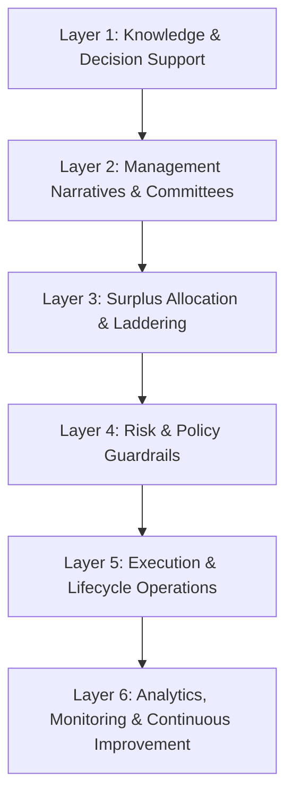
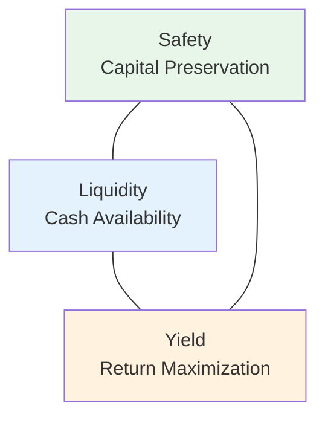
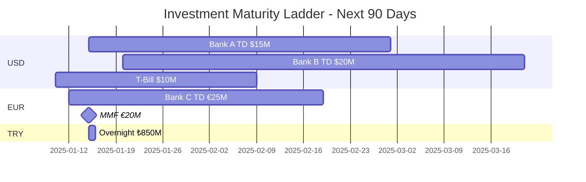
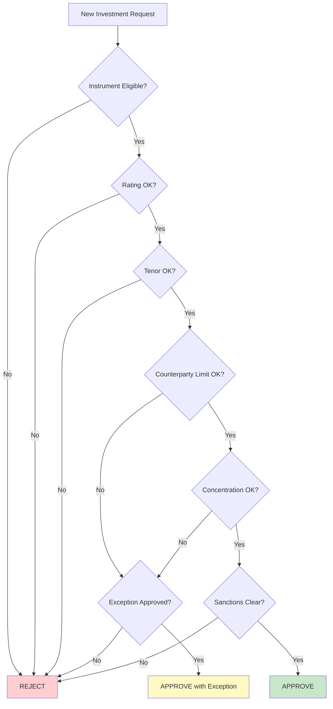
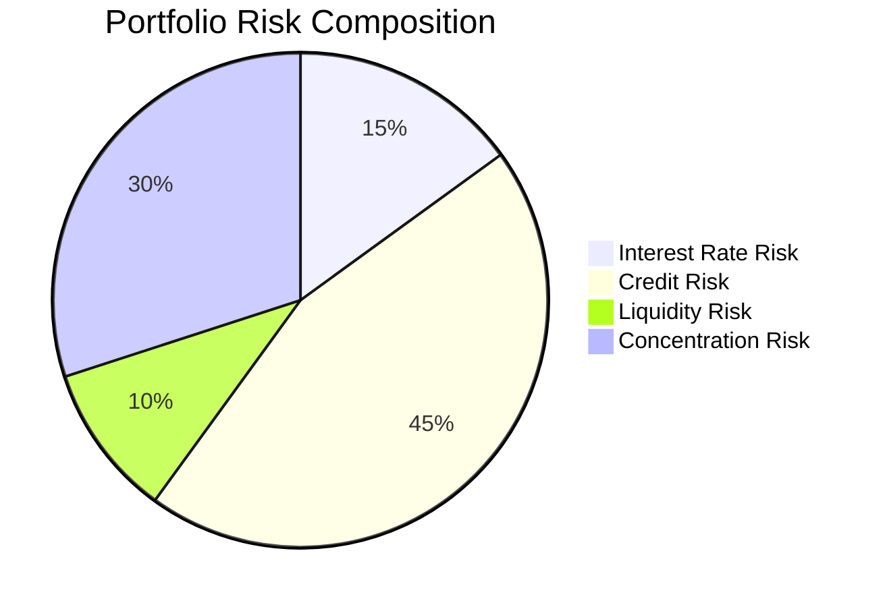

# T5: Surplus Cash & Investments

## Overview

Surplus Cash & Investments management is the strategic cornerstone for maximizing returns on idle liquidity while maintaining safety, liquidity, and compliance in downstream oil & gas treasury. AI-powered solutions enable intelligent investment allocation, cash laddering optimization, policy compliance automation, and straight-through processing of investment lifecycle operations.

**T5 Scope:** Invest, protect, and operationalize surplus liquidity (cash + near-cash) under constraints: **safety / liquidity / yield**, policy limits, and audit controls.

This tower organizes **15 AI use cases** across **6 functional layers**:



| Layer | Focus | Use Cases |
|-------|-------|-----------|
| **L1: Knowledge & Decision Support** | Copilot layer for investment policy Q&A and strategy queries | 2 |
| **L2: Management Narratives & Committees** | Investment reports, ALCO summaries, yield attribution | 2 |
| **L3: Surplus Allocation & Laddering** | Investable cash estimation, ladder optimization, sweep management | 3 |
| **L4: Risk & Policy Guardrails** | Policy compliance, concentration limits, stress testing, early warnings | 4 |
| **L5: Execution & Lifecycle Operations** | Trade execution, confirmation parsing, settlement, accounting | 3 |
| **L6: Analytics, Monitoring & Continuous Improvement** | Performance attribution, strategy backtesting, model refinement | 1 |

---

## The Safety-Liquidity-Yield Triangle

Every T5 decision balances three competing objectives:



| Objective | Priority | Constraints |
|-----------|----------|-------------|
| **Safety** | Highest | Investment-grade only, counterparty limits, no principal loss |
| **Liquidity** | High | Match maturities to cash needs, maintain buffers |
| **Yield** | Optimize | Maximize within safety/liquidity constraints |

---

## Layer 1: Knowledge & Decision Support (Copilot Layer)

This layer provides AI-powered assistants that help treasury teams access investment policies, answer complex questions about surplus cash strategies, and navigate investment decisions through natural language interfaces.

### 1.1 RAG-Powered Investment Policy Q&A

**What it does:** Retrieval-Augmented Generation (RAG) system that answers questions about investment policies, eligible instruments, counterparty limits, and regulatory guidelines with direct citations to source documents.

**Key Inputs:**

- Investment policy documents (PDF, Word, SharePoint)
- Counterparty limit matrices
- Regulatory guidelines (CMB Turkey, Basel III liquidity requirements)
- Historical investment decisions and rationales

**AI/LLM Approach:** Claude indexes all investment policy documents into a vector database. When a user asks a question, relevant document chunks are retrieved and Claude generates an answer with specific citations.

**Example Interaction:**

```
User: What instruments are eligible for investing our USD surplus?

Claude: Based on Investment Policy v3.1 (Section 4.2), eligible USD
instruments are:

| Instrument Type | Max Tenor | Min Rating | Max % of Portfolio |
|-----------------|-----------|------------|-------------------|
| Bank Term Deposits | 12 months | A- (S&P) | 30% per bank |
| Money Market Funds | N/A | AAA | 40% total |
| T-Bills (US/Turkey) | 12 months | Sovereign | Unlimited |
| Commercial Paper | 6 months | A-1 | 15% per issuer |
| Repo Agreements | 30 days | A- collateral | 25% total |

Additional requirements per Section 4.2.3:
- Overnight investments only with pre-approved banks
- Corporate bonds explicitly excluded for surplus cash
- Any new instrument type requires Risk Committee approval
- FX conversion for investment requires separate approval

📎 Sources: Investment_Policy_v3.1.pdf (pages 15-18),
   Counterparty_Limits_2025.xlsx
```

**Outputs:**

- Instant answers with document citations
- Policy interpretation guidance
- Eligibility confirmations
- Links to source documents

**KPIs:**

- Answer accuracy rate (target: >95%)
- Average response time (<5 seconds)
- Policy compliance improvement rate
- User satisfaction score

---

### 1.2 Investment Strategy Copilot (GenAI Advisor)

**What it does:** An agentic AI that can browse multiple systems, analyze market conditions, synthesize investment recommendations, and draft strategy memos for complex treasury decisions.

**Key Inputs:**

- Access to TMS, ERP, banking portals
- Real-time market data feeds (interest rates, FX)
- Current investment portfolio positions
- Cash flow forecasts from T1
- Counterparty exposure data

**AI/LLM Approach:** Claude operates as an autonomous agent that breaks complex queries into sub-tasks, executes each step (data queries, calculations, market analysis), and synthesizes comprehensive recommendations with supporting rationale.

**Example Interaction:**

```
User: What's the optimal investment strategy for our $50M USD surplus
over the next quarter, given current market conditions?

Claude: I'll analyze this for you. Let me check multiple sources...

📊 **Investment Strategy Analysis Complete**

**Current Position Assessment**
- Available surplus: $50M USD
- Forecast cash needs Q1: $15M (crude payment Feb 15), $20M (tax Mar 1)
- Current portfolio yield: 4.8% (vs benchmark 5.2%)
- Counterparty headroom: Bank A: $20M, Bank B: $35M, Bank C: $15M

**Market Context**
- Fed policy: Rates expected stable at 5.25-5.50%
- USD SOFR 3M: 5.35%
- Turkish overnight: 45% (high but TRY volatility risk)
- Yield curve: Inverted (short-term yields higher)

**Recommended Ladder Strategy**

| Tranche | Amount | Instrument | Tenor | Rate | Maturity Date |
|---------|--------|------------|-------|------|---------------|
| 1 | $15M | Bank A TD | 45 days | 5.40% | Feb 10 |
| 2 | $20M | MMF | On-demand | 5.25% | Liquid |
| 3 | $10M | Bank B TD | 90 days | 5.55% | Mar 25 |
| 4 | $5M | T-Bill | 30 days | 5.30% | Feb 5 |

**Projected Outcomes**
- Blended yield: 5.38% (+58bps vs current)
- Interest income: ~$670K for quarter
- Liquidity coverage: 100% for all forecast needs
- Policy compliance: ✅ All limits satisfied

**Risk Considerations**
- Bank A at 75% of limit after this allocation
- Consider shifting $5M to Bank C for diversification

Shall I draft the investment memo for approval?
```

**Outputs:**

- Comprehensive strategy recommendations
- Scenario analysis with alternatives
- Draft investment memos
- Market context summaries

**KPIs:**

- Recommendation adoption rate
- Yield improvement vs baseline
- Time saved vs manual analysis
- Strategy performance tracking

---

## Layer 2: Management Narratives & Committees

This layer automates the creation of investment reports, ALCO presentations, and narrative explanations that treasury teams must produce for committees and executive briefings.

### 2.1 Investment Portfolio Report Drafter

**What it does:** Automatically generates investment portfolio reports with key metrics, yield attribution, policy compliance status, and forward-looking commentary ready for ALCO and executive review.

**Key Inputs:**

- Current investment positions by instrument and counterparty
- Interest income earned and accrued
- Policy limits and utilization metrics
- Market benchmarks (SOFR, policy rates)
- Previous reports for style consistency

**AI/LLM Approach:** Claude aggregates data from multiple sources, calculates key metrics, identifies noteworthy items, and generates narrative commentary in the organization's established reporting style.

**Example Interaction:**

```
User: Generate this month's investment portfolio summary for ALCO.

Claude: Here's the draft Investment Portfolio Report for January 2025:

═══════════════════════════════════════════════════════════════════════
           MONTHLY INVESTMENT PORTFOLIO REPORT - ALCO SUMMARY
═══════════════════════════════════════════════════════════════════════

**EXECUTIVE SUMMARY**
Surplus cash portfolio remains fully invested within policy limits,
generating $892K interest income this month (+12% vs prior month).

• Total invested: $285M across 4 currencies
• Weighted average yield: 5.42% (benchmark: 5.25%, +17bps)
• Average tenor: 45 days (policy max: 365 days)
• All counterparty limits within tolerance

**PORTFOLIO COMPOSITION**

| Currency | Amount | % of Total | Avg Yield | Avg Tenor |
|----------|--------|------------|-----------|-----------|
| USD | $180M | 63% | 5.35% | 52 days |
| EUR | €45M | 18% | 3.85% | 38 days |
| TRY | ₺850M | 12% | 42.5% | 14 days |
| GBP | £15M | 7% | 4.95% | 30 days |

**COUNTERPARTY EXPOSURE**

| Counterparty | Exposure | Limit | Utilization | Status |
|--------------|----------|-------|-------------|--------|
| Bank A | $95M | $120M | 79% | 🟡 |
| Bank B | $75M | $100M | 75% | 🟡 |
| Bank C | $45M | $80M | 56% | ✅ |
| MMF Pool | $70M | $100M | 70% | ✅ |

**YIELD ATTRIBUTION**

| Driver | Contribution | Commentary |
|--------|--------------|------------|
| Duration extension | +8bps | Moved to 60-day vs 30-day avg |
| Bank selection | +5bps | Shifted to higher-paying banks |
| Currency mix | +4bps | Maintained TRY allocation |

**ITEMS FOR DISCUSSION**

1. **Bank A Concentration (79% of limit)**
   - Approaching policy ceiling
   - Recommendation: Redirect next $20M to Bank C

2. **TRY Yield Opportunity**
   - Overnight rates at 45%, but volatility elevated
   - Current allocation conservative (12% vs 20% max)
   - Recommendation: Maintain current level given vol

**FORWARD OUTLOOK**
Q1 cash needs of $35M manageable within current ladder.
No policy concerns anticipated.

───────────────────────────────────────────────────────────────────────
Prepared by: Treasury AI Assistant | Review required before distribution
```

**Investment Ladder Visualization:**



**Outputs:**

- Draft ALCO investment report
- Yield attribution analysis
- Policy compliance dashboard
- Forward-looking commentary

**KPIs:**

- Report preparation time (days → minutes)
- Executive revision rate
- Metric accuracy (100% target)
- Stakeholder satisfaction score

---

### 2.2 Yield Attribution & Performance Narrative

**What it does:** Creates detailed yield attribution analysis explaining portfolio performance vs benchmarks, identifying drivers of outperformance or underperformance.

**Key Inputs:**

- Portfolio returns by instrument
- Benchmark rates (SOFR, policy rates, peer averages)
- Decision logs (when and why investments were made)
- Market data during holding periods

**AI/LLM Approach:** Claude performs factor attribution analysis and generates narrative explanations suitable for non-technical executives.

**Example Interaction:**

```
User: Explain why our portfolio underperformed the benchmark by 15bps
this month.

Claude: **YIELD ATTRIBUTION ANALYSIS: JANUARY 2025**

**Summary:** Portfolio yield of 5.10% vs benchmark 5.25% (-15bps)

**ATTRIBUTION BREAKDOWN**

| Factor | Impact | Explanation |
|--------|--------|-------------|
| Duration drag | -12bps | Kept shorter tenor for Feb crude payment |
| Counterparty limit | -8bps | Bank D (highest rate) at limit |
| Currency mix | +3bps | TRY overnight allocation helped |
| Timing | +2bps | Caught rate rise mid-month |
| **Net** | **-15bps** | |

**WATERFALL VISUALIZATION**

    Benchmark:     5.25%
    Duration:     -0.12% ━━━━━━━━━━━━━━━━━━━━━━━━━━━━━━━━━━━
    Counterparty: -0.08% ━━━━━━━━━━━━━━━━━━━━━━━━
    Currency:     +0.03%          ━━━━━━━━━
    Timing:       +0.02%          ━━━━━━━
                  ─────────────────────────────────────────
    Actual:        5.10%

**CONTEXT & JUSTIFICATION**

The duration drag was a conscious decision:
- $35M crude payment due Feb 15 required liquidity
- Breaking deposits would have cost 25bps penalty
- Net effect: Correct decision given constraints

**RECOMMENDATION**
- Request increase in Bank D limit (+$20M) to capture higher rates
- Post-February payment: Extend ladder to 60-90 day average

This underperformance represents ~$42K in foregone interest,
justified by liquidity management requirements.
```

**Outputs:**

- Factor attribution breakdown
- Waterfall visualizations
- Contextual justifications
- Improvement recommendations

**KPIs:**

- Attribution accuracy (reconciles to total)
- Explanation clarity (stakeholder feedback)
- Actionable insight generation
- Performance trend tracking

---

## Layer 3: Surplus Allocation & Laddering

This layer contains the core T5 decision engines: determining how much cash is investable, where to place it, and for how long while meeting forecasted cash needs.

### 3.1 Investable Cash Estimator (True Surplus Calculator)

**What it does:** Determines the amount safely investable per entity/currency at any time horizon by analyzing bank balances, forecast cash needs, and minimum operating cash requirements.

**Key Inputs:**

- Real-time bank balances (all accounts, all currencies)
- Cash flow forecasts from T1 (inflows/outflows by date)
- Minimum operating cash rules (buffer requirements)
- Upcoming committed payments (crude, tax, debt service)
- Historical forecast accuracy data

**AI/LLM Approach:** Rules-based calculation combined with ML-predicted forecast confidence bands. The system uses historical forecast accuracy to determine appropriate safety buffers for different time horizons.

**Example Calculation:**

```
═══════════════════════════════════════════════════════════════════════
             INVESTABLE CASH ESTIMATOR - JANUARY 15, 2025
═══════════════════════════════════════════════════════════════════════

**CURRENT POSITION**

| Entity | Currency | Bank Balance | Operating Min | Available |
|--------|----------|--------------|---------------|-----------|
| Refinery A | USD | $125M | $20M | $105M |
| Refinery A | TRY | ₺2.8B | ₺500M | ₺2.3B |
| Trading | EUR | €65M | €10M | €55M |
| **Group** | **USD equiv** | **$245M** | **$45M** | **$200M** |

**FORECAST CASH NEEDS (Next 90 Days)**

| Date | Description | Currency | Amount | Confidence |
|------|-------------|----------|--------|------------|
| Jan 25 | Crude Payment | USD | $45M | 98% |
| Feb 1 | Excise Tax | TRY | ₺1.2B | 99% |
| Feb 15 | Crude Payment | USD | $52M | 95% |
| Mar 1 | Debt Service | USD | $15M | 100% |
| Mar 15 | Crude Payment | USD | $48M | 90% |

**INVESTABLE SURPLUS CALCULATION**

┌─────────────────────────────────────────────────────────────────────┐
│ Time Horizon │ Gross Avail │ Reserved │ Buffer │ Investable │
├─────────────────────────────────────────────────────────────────────┤
│ Overnight    │    $200M    │   $45M   │  $25M  │   $130M    │
│ 1-7 days     │    $200M    │   $45M   │  $20M  │   $135M    │
│ 8-30 days    │    $200M    │   $97M   │  $25M  │   $78M     │
│ 31-60 days   │    $200M    │   $149M  │  $30M  │   $21M     │
│ 61-90 days   │    $200M    │   $197M  │  $35M  │   -$32M    │
└─────────────────────────────────────────────────────────────────────┘

**VISUALIZATION: Liquidity Waterfall**

$200M ████████████████████████████████████████ Available
       ├─ Overnight: $130M investable ──────────────────►
       ├─ 7-day: $135M investable ──────────────────────►
       ├─ 30-day: $78M investable ──────────────────►
       ├─ 60-day: $21M investable ─────────►
       └─ 90-day: NEGATIVE (need inflows) ⚠️

**CONFIDENCE BANDS (Including Forecast Uncertainty)**

| Horizon | Base Case | P10 (Pessimistic) | P90 (Optimistic) |
|---------|-----------|-------------------|------------------|
| 30-day | $78M | $55M | $95M |
| 60-day | $21M | -$5M | $42M |

**ALERTS**
⚠️ 60-90 day horizon shows potential shortfall
   → Consider: Delay 60+ day investments until March inflows confirmed
   → Alternative: Arrange standby facility draw

**RECOMMENDATION**
Safe to invest: $78M in ≤30-day instruments
Proceed with caution: $21M in 31-60 day (monitor weekly)
Avoid: 60+ day commitments until inflow certainty improves
```

**Outputs:**

- Investable amount by time horizon and currency
- Confidence bands based on forecast accuracy
- Liquidity alerts and warnings
- Recommendations with risk context

**KPIs:**

- Idle cash percentage (target: <5% of available)
- Overdraft/emergency draw events (target: 0)
- Forecast-driven buffer accuracy
- Investable cash utilization rate

---

### 3.2 Cash-Need Linked Investment Ladder Optimizer

**What it does:** The core T5 optimization engine that constructs an investment ladder—amounts × maturities × instruments—optimized to maximize yield while ensuring all forecasted cash needs are met.

**Key Inputs:**

- Investable cash by time horizon (from 3.1)
- Yield curve by instrument type
- Eligible instruments with current rates
- Forecast outflows with confidence levels
- Policy constraints (concentration, tenor, ratings)

**AI/LLM Approach:** Linear programming / constraint optimization with policy limits as hard constraints. ML component predicts yield curve movements. GenAI layer explains the ladder plan in plain language.

**Example Optimization:**

```
═══════════════════════════════════════════════════════════════════════
         INVESTMENT LADDER OPTIMIZER - RECOMMENDATION OUTPUT
═══════════════════════════════════════════════════════════════════════

**OPTIMIZATION OBJECTIVE**
Maximize total interest income subject to:
- 100% coverage of forecast cash needs
- All policy constraints satisfied
- Minimum $25M overnight liquidity buffer

**CURRENT YIELD CURVE (USD)**

    5.50% │         ●────●
          │     ●───┘
    5.25% │ ●───┘
          │
    5.00% │
          └──────────────────────────
            O/N  7D  30D  60D  90D

**RECOMMENDED LADDER**

| Priority | Amount | Instrument | Rate | Start | Maturity | Purpose |
|----------|--------|------------|------|-------|----------|---------|
| 1 | $25M | MMF | 5.25% | Today | On-demand | Buffer |
| 2 | $20M | Bank A TD | 5.32% | Today | Jan 24 | Pre-crude |
| 3 | $15M | T-Bill | 5.28% | Today | Feb 5 | Flex |
| 4 | $25M | Bank B TD | 5.45% | Today | Feb 14 | Post-crude |
| 5 | $18M | Bank C TD | 5.52% | Today | Mar 10 | Q1 tail |

**LADDER VISUALIZATION**

    Jan 15    Jan 25    Feb 5     Feb 15    Mar 1     Mar 15
       │         │         │         │         │         │
    ───┼─────────┼─────────┼─────────┼─────────┼─────────┼───
       │         │         │         │         │         │
       ├─$25M MMF (on-demand liquidity buffer)─────────────►
       │         │         │         │         │         │
       ├─$20M Bank A──►│         │         │         │
       │         │    │         │         │         │
       │         │    ▼ CRUDE PAYMENT $45M │         │
       │         │         │         │         │         │
       ├────$15M T-Bill────►│         │         │         │
       │         │         │         │         │         │
       ├────────$25M Bank B─────────►│         │         │
       │         │         │         │         │         │
       │         │         │         ▼ CRUDE PAYMENT $52M │
       │         │         │         │         │         │
       ├──────────────$18M Bank C────────────────►        │
       │         │         │         │         │         │
       │         │         │         │         ▼ DEBT $15M│

**PROJECTED OUTCOMES**

| Metric | Current | Optimized | Improvement |
|--------|---------|-----------|-------------|
| Blended Yield | 4.95% | 5.38% | +43bps |
| Interest Income (90d) | $605K | $658K | +$53K |
| Liquidity Coverage | 95% | 100% | +5% |
| Avg Weighted Tenor | 22 days | 38 days | +16 days |

**CONSTRAINT SATISFACTION**

| Constraint | Limit | Utilized | Status |
|------------|-------|----------|--------|
| Bank A exposure | $120M | $95M | ✅ 79% |
| Bank B exposure | $100M | $75M | ✅ 75% |
| Bank C exposure | $80M | $38M | ✅ 48% |
| Max tenor | 365d | 54d | ✅ |
| Min rating | A- | A+ avg | ✅ |

**SENSITIVITY ANALYSIS**

If rates increase 25bps before execution:
- Recommended action: Lock in 60-day tranches immediately
- Opportunity cost of delay: ~$8K

If crude payment delayed 7 days:
- Ladder automatically accommodates (Jan 24 maturity provides buffer)
- Potential to extend Tranche 2 for additional yield

**APPROVAL REQUIRED**
Total placement: $103M across 5 instruments
Authority level: Treasury Director (per policy Section 6.1)

Execute this ladder? [Approve] [Modify] [Reject]
```

**Outputs:**

- Optimized investment ladder schedule
- Maturity-matched to cash flow needs
- Yield improvement quantification
- Constraint satisfaction verification

**KPIs:**

- Yield uplift vs naive allocation (target: >20bps)
- Liquidity shortfall incidents (target: 0)
- Breakage/penalty costs (target: <0.1% of portfolio)
- Ladder stability score

---

### 3.3 Idle Cash Sweep Optimizer

**What it does:** Manages daily/intraday placement of micro-surplus through automated sweeps to money market funds, overnight deposits, or same-day placements.

**Key Inputs:**

- Intraday balance projections
- Minimum balance requirements by account
- Settlement calendar and cut-off times
- Sweep instrument options with real-time rates
- Historical intraday patterns

**AI/LLM Approach:** Rules-based allocation with ML enhancement for predicting intraday patterns. Learns from historical timing to optimize sweep timing and amounts.

**Example Sweep Decision:**

```
═══════════════════════════════════════════════════════════════════════
              IDLE CASH SWEEP OPTIMIZER - DAILY EXECUTION
═══════════════════════════════════════════════════════════════════════

**END-OF-DAY POSITION FORECAST**

| Account | Balance | Min Required | Excess | Sweep Target |
|---------|---------|--------------|--------|--------------|
| USD Operating | $45.2M | $20.0M | $25.2M | Bank A O/N |
| EUR Operating | €18.5M | €5.0M | €13.5M | MMF-EUR |
| TRY Operating | ₺980M | ₺300M | ₺680M | TCMB O/N |

**SWEEP EXECUTION PLAN**

┌────────────────────────────────────────────────────────────────────┐
│ Time      │ Action                      │ Amount    │ Rate   │
├────────────────────────────────────────────────────────────────────┤
│ 14:00 ET  │ USD sweep to Bank A O/N     │ $25.0M    │ 5.30%  │
│ 15:00 CET │ EUR sweep to MMF-EUR        │ €13.5M    │ 3.75%  │
│ 17:00 TRT │ TRY sweep to TCMB O/N       │ ₺680M     │ 45.0%  │
│ 08:00+1   │ Auto-return to operating    │ All       │ --     │
└────────────────────────────────────────────────────────────────────┘

**INTRADAY PATTERN ANALYSIS**

    $M
    50 │                    ●
    45 │    ●           ●   │   ●
    40 │ ●     ●     ●      │      ●
    35 │         ●──────────┤ Sweep window
    30 │                    │
    25 │ ─ ─ ─ ─ ─ ─ ─ ─ ─ ─│─ ─ ─ ─ ─ Min balance
    20 │                    │
       └────────────────────┴───────────
         8AM   12PM   4PM   6PM   8PM

**NEXT-DAY INFLOW RISK CHECK**
- Expected receipts tomorrow: $12M (high confidence)
- First outflow tomorrow: $8M at 10:00 AM
- Assessment: ✅ Safe to sweep full excess

**SWEEP EFFICIENCY METRICS**

| Period | Avg Idle (No Sweep) | Avg Idle (With Sweep) | Yield Captured |
|--------|---------------------|----------------------|----------------|
| MTD | $28.4M | $2.1M | $38.5K |
| YTD | $31.2M | $1.8M | $485K |

**AUTOMATED EXECUTION STATUS**

[■■■■■■■■■■] USD Sweep: Executed at 14:02 ET ✅
[■■■■■■■■░░] EUR Sweep: Pending (15:00 CET)
[■■■░░░░░░░] TRY Sweep: Scheduled (17:00 TRT)

**EXCEPTION ALERTS**
⚠️ EUR balance lower than expected by €2M
   → Adjusting sweep to €11.5M (maintaining buffer)
   → Root cause: Customer receipt delayed (notified AR team)
```

**Outputs:**

- Sweep instructions with timing
- Exception alerts for manual review
- Efficiency metrics and yield captured
- Pattern analysis for optimization

**KPIs:**

- Idle cash time-weighted percentage (target: <3%)
- Overdraft fees avoided
- Sweep automation rate (target: >95%)
- Operational incident rate (target: <0.1%)

---

## Layer 4: Risk & Policy Guardrails

This layer ensures all investment decisions comply with policy, monitors concentration risks, and provides early warnings on counterparty and covenant issues.

### 4.1 Investment Policy Guardian (Pre-Trade Compliance)

**What it does:** Real-time validation of every investment decision against all policy rules—instrument eligibility, tenor limits, rating requirements, and concentration limits—before execution.

**Key Inputs:**

- Investment details (amount, tenor, instrument, counterparty)
- Treasury investment policy (digitized rules)
- Current portfolio positions and exposures
- Counterparty credit ratings and limits
- Regulatory requirements (sanctions, AML)

**AI/LLM Approach:** Deterministic rules engine for numeric checks combined with NLP/LLM to parse policy text and complex clauses. Provides clear Pass/Fail with clause-level explanations.

**Example Compliance Check:**

```
═══════════════════════════════════════════════════════════════════════
           INVESTMENT POLICY GUARDIAN - PRE-TRADE CHECK
═══════════════════════════════════════════════════════════════════════

**PROPOSED INVESTMENT**
- Instrument: 90-day Term Deposit
- Counterparty: Bank D (Deutsche Bank)
- Amount: $25M
- Rate: 5.65%
- Start Date: January 16, 2025

**COMPLIANCE CHECK RESULTS**

┌──────────────────────────────────────────────────────────────────────┐
│                    ❌ INVESTMENT NOT APPROVED                        │
│                                                                      │
│  2 of 8 policy checks failed. Details below.                        │
└──────────────────────────────────────────────────────────────────────┘

| Check | Rule | Current | Limit | Status |
|-------|------|---------|-------|--------|
| Instrument Type | Term Deposit | ✓ Eligible | -- | ✅ Pass |
| Credit Rating | A+ (S&P) | ✓ A+ | Min A- | ✅ Pass |
| Tenor | 90 days | ✓ 90d | Max 365d | ✅ Pass |
| **Counterparty Limit** | Bank D | **$95M** | **$100M** | ❌ **FAIL** |
| Single Investment | $25M | ✓ $25M | Max $30M | ✅ Pass |
| **Total Portfolio %** | Bank D | **38%** | **30%** | ❌ **FAIL** |
| Currency | USD | ✓ USD | Approved | ✅ Pass |
| Sanctions | Bank D | ✓ Clear | -- | ✅ Pass |

**DETAILED FAILURE ANALYSIS**

❌ **Counterparty Limit Breach (Policy Section 5.2.1)**

   "No single counterparty shall hold more than $100M in
    aggregate investment exposure..."

   Current Bank D exposure: $70M
   Proposed addition: $25M
   Would result in: $95M (within $100M ✅)

   However...

❌ **Portfolio Concentration Breach (Policy Section 5.2.3)**

   "No single counterparty shall represent more than 30% of
    the total investment portfolio..."

   Current portfolio: $285M
   Current Bank D %: 24.6% ($70M)
   Post-trade Bank D %: 33.8% ($95M) ← EXCEEDS 30%

**REMEDIATION OPTIONS**

| Option | Action | Yield Impact |
|--------|--------|--------------|
| 1 | Reduce amount to $15M | -$2.5K interest |
| 2 | Shift $20M from Bank D to Bank C first | -3bps on shifted |
| 3 | Request limit exception (Risk Committee) | 0 (if approved) |

**RECOMMENDATION**
Option 2: Shift existing exposure to create headroom
- Move $20M from Bank D 30-day TD to Bank C (rate: 5.55% vs 5.45%)
- Then proceed with $25M Bank D placement
- Net yield impact: -$200 over 30 days

**APPROVAL ROUTING**
If proceeding with exception request → Risk Committee
Normal approval → Treasury Director

[Proceed with Option 2] [Request Exception] [Cancel]
```

**Policy Visualization:**



**Outputs:**

- Pass/Fail with detailed rationale
- Specific policy clause citations
- Remediation options ranked by yield impact
- Approval routing instructions

**KPIs:**

- Policy breaches prevented (target: 100%)
- Compliance check time (<2 seconds)
- False positive rate (<1%)
- Audit findings (target: 0)

---

### 4.2 Concentration & Limit Monitor (Continuous)

**What it does:** Continuously monitors portfolio exposures against all limit types and alerts treasury when utilization approaches thresholds or when market movements cause drift toward breaches.

**Key Inputs:**

- Real-time portfolio positions
- Limit matrix (counterparty, sector, rating, tenor, currency)
- Market data (for MTM positions)
- Historical utilization patterns

**AI/LLM Approach:** Deterministic aggregation with predictive analytics to forecast limit utilization trends. Alert thresholds trigger at 70%, 85%, and 95% utilization.

**Example Monitor Dashboard:**

```
═══════════════════════════════════════════════════════════════════════
              CONCENTRATION & LIMIT MONITOR - LIVE DASHBOARD
═══════════════════════════════════════════════════════════════════════

**COUNTERPARTY LIMITS**

Bank A        [$95M / $120M]  ████████████████████░░░░  79% 🟡
Bank B        [$75M / $100M]  ███████████████░░░░░░░░░  75% 🟡
Bank C        [$38M / $80M]   █████████░░░░░░░░░░░░░░░  48% ✅
Bank D        [$70M / $100M]  ██████████████░░░░░░░░░░  70% 🟡
Sovereign     [$15M / Unlim]  █░░░░░░░░░░░░░░░░░░░░░░░  N/A ✅
MMF Pool      [$70M / $100M]  ██████████████░░░░░░░░░░  70% ✅

**RATING CONCENTRATION**

AAA/AA        [$85M]   30%  ███████████░░░░░░░░░░░░░░░░░░░░  [No limit]
A+/A          [$165M]  58%  ███████████████████████░░░░░░░░  [Max 70%] ✅
A-            [$35M]   12%  ████░░░░░░░░░░░░░░░░░░░░░░░░░░░  [Max 20%] ✅
Below A-      [$0M]    0%   ░░░░░░░░░░░░░░░░░░░░░░░░░░░░░░░  [Max 0%] ✅

**SECTOR CONCENTRATION**

Financial     [$245M]  86%  ██████████████████████████░░░░░  [Max 100%] ✅
Sovereign     [$15M]   5%   ██░░░░░░░░░░░░░░░░░░░░░░░░░░░░░  [No limit]
MMF           [$25M]   9%   ███░░░░░░░░░░░░░░░░░░░░░░░░░░░░  [Max 40%] ✅

**TENOR DISTRIBUTION**

< 7 days      [$95M]   33%  ██████████░░░░░░░░░░░░░░░░░░░░░
7-30 days     [$85M]   30%  █████████░░░░░░░░░░░░░░░░░░░░░░
31-90 days    [$75M]   26%  ████████░░░░░░░░░░░░░░░░░░░░░░░
91-180 days   [$30M]   11%  ███░░░░░░░░░░░░░░░░░░░░░░░░░░░░
> 180 days    [$0M]    0%   ░░░░░░░░░░░░░░░░░░░░░░░░░░░░░░░

**ACTIVE ALERTS**

🟡 WATCH: Bank A approaching limit (79%)
   - Projected to hit 85% in 7 days (new placements scheduled)
   - Action: Redirect $15M to Bank C on next maturity

🟡 WATCH: Multiple banks at 70-80% utilization
   - Bank B, Bank D nearing thresholds
   - Action: Review counterparty strategy in next ALCO

**TREND ANALYSIS (30-Day)**

Bank A utilization trend:
    85% │         ⚠️ Threshold
    80% │                    ●────→ Projected
    79% │                ●
    75% │            ●
    70% │        ●
    65% │    ●
        └─────────────────────────
          W1   W2   W3   W4   W5

**BREACH FORECAST**
No breaches forecast in next 14 days under current allocation plan.

**MTM IMPACT CHECK**
Market movements have not materially changed exposures today.
```

**Outputs:**

- Real-time limit utilization dashboard
- Threshold breach alerts
- Trend analysis and projections
- Recommended reallocation actions

**KPIs:**

- Limit breaches (target: 0)
- Early warning effectiveness (>7 days advance notice)
- Limit utilization efficiency (target: 70-85%)
- Time-to-detect drift (target: <1 hour)

---

### 4.3 Portfolio Risk & Stress Dashboard

**What it does:** Advanced risk analytics engine that assesses portfolio risk (credit, interest rate, liquidity) under normal and stressed conditions, similar to institutional-grade systems like BlackRock Aladdin.

**Key Inputs:**

- Current portfolio positions with instrument details
- Yield curves by currency
- Credit spreads and ratings
- Defined stress scenarios
- Liquidity haircut assumptions

**AI/LLM Approach:** Deterministic risk calculations (VaR, duration, PVBP) combined with scenario simulation. GenAI layer generates natural language explanations of risk metrics for non-technical stakeholders.

**Example Risk Report:**

```
═══════════════════════════════════════════════════════════════════════
             PORTFOLIO RISK & STRESS DASHBOARD - JANUARY 2025
═══════════════════════════════════════════════════════════════════════

**PORTFOLIO SUMMARY**
Total investments: $285M | Instruments: 24 | Counterparties: 6

**RISK METRICS**

| Metric | Value | Limit | Utilization | Status |
|--------|-------|-------|-------------|--------|
| Credit VaR (95%, 10d) | $1.2M | $5.0M | 24% | ✅ |
| Interest Rate PVBP | $28K | $75K | 37% | ✅ |
| Duration (Modified) | 0.12 years | 1.0 year | 12% | ✅ |
| Liquidity Score | 92/100 | >80 | -- | ✅ |

**DURATION PROFILE**

Duration contribution by tranche:

    < 30 days  │████████████████████████████│ 0.02y
    30-60 days │████████████████░░░░░░░░░░░░│ 0.05y
    60-90 days │████████░░░░░░░░░░░░░░░░░░░░│ 0.04y
    > 90 days  │████░░░░░░░░░░░░░░░░░░░░░░░░│ 0.01y
               └────────────────────────────┘
               Total Modified Duration: 0.12 years

**CREDIT QUALITY DISTRIBUTION**

    AAA/AA  ████████████ 30% ($85M)
    A+      ████████████████████ 42% ($120M)
    A       ████████ 18% ($50M)
    A-      █████ 10% ($30M)

    Weighted Average Rating: A+ (stable)

**STRESS TEST RESULTS**

| Scenario | Description | Portfolio Impact | Status |
|----------|-------------|------------------|--------|
| Base Case | Current conditions | $0 | ✅ |
| Rate +100bps | Parallel shift up | -$280K MTM | ✅ |
| Rate +200bps | Severe rate shock | -$560K MTM | ✅ |
| Credit Spread +50bps | Widening | -$140K MTM | ✅ |
| Single Default | Largest counterparty | -$95M (34%) | ⚠️ |
| Liquidity Stress | 30% haircuts | $200M avail | ✅ |

**SCENARIO DETAIL: Single Counterparty Default**

┌─────────────────────────────────────────────────────────────────────┐
│ Scenario: Bank A enters resolution/default                          │
├─────────────────────────────────────────────────────────────────────┤
│ Exposure at risk: $95M (33% of portfolio)                           │
│ Expected recovery (historical): 40-60%                              │
│ Net loss range: $38M - $57M                                         │
│ Liquidity impact: $95M unavailable for 6-24 months                  │
│                                                                     │
│ Mitigation: Current exposure within policy limits                   │
│ Recommendation: No action required; continue monitoring             │
└─────────────────────────────────────────────────────────────────────┘

**LIQUIDITY STRESS TEST**

If 30% haircut applied to all instruments:

    Current Value    │ $285M  ████████████████████████████
    Stressed Value   │ $200M  ███████████████████░░░░░░░░░
    Required Minimum │ $150M  ██████████████░░░░░░░░░░░░░░
                     └─────────────────────────────────────
                     Buffer: $50M above minimum ✅

**WHAT-IF ANALYSIS**

Q: "What happens to our risk if rates rise 50bps?"

A: If rates rise 50bps across the curve:
   - MTM loss: ~$140K (0.05% of portfolio)
   - New duration: 0.11 years
   - Impact is minimal due to short tenor profile
   - Recommendation: Acceptable; no hedging required

**AI INSIGHTS**

"Your portfolio is well-positioned for the current rate environment.
The short duration (0.12y) means interest rate sensitivity is very low.
The main risk is counterparty concentration—Bank A at 33% represents
the largest single-name risk. Consider gradually diversifying as
positions mature."
```

**Risk Visualization:**



**Outputs:**

- Comprehensive risk metrics dashboard
- Stress test results with explanations
- What-if scenario analysis
- Natural language risk summaries

**KPIs:**

- VaR utilization (target: <50%)
- Stress test pass rate (target: 100%)
- Risk report generation time (target: <5 min)
- Model validation score

---

### 4.4 Counterparty & Covenant Early Warning Sentinel

**What it does:** Monitors counterparty credit health and covenant compliance, alerting treasury when conditions suggest exposure should be reduced or when investment plans risk breaching financial covenants.

**Key Inputs:**

- Credit ratings and rating watch status
- CDS spreads and credit metrics
- News signals (optional ML-based sentiment)
- Financial covenant definitions from loan agreements
- Forecast cash and investment positions

**AI/LLM Approach:** Rules-based monitoring with optional ML scoring for credit deterioration signals. GenAI interprets covenant text and simulates how investment decisions impact covenant metrics.

**Example Early Warning:**

```
═══════════════════════════════════════════════════════════════════════
         COUNTERPARTY & COVENANT EARLY WARNING - ALERT REPORT
═══════════════════════════════════════════════════════════════════════

**COUNTERPARTY WATCHLIST**

| Counterparty | Exposure | Rating | Watch | CDS Spread | Alert |
|--------------|----------|--------|-------|------------|-------|
| Bank A | $95M | A+ | Stable | 45bps | ✅ |
| Bank B | $75M | A | Stable | 52bps | ✅ |
| Bank C | $38M | A | Negative | 78bps | 🟡 |
| Bank D | $70M | A+ | Stable | 48bps | ✅ |

**⚠️ ALERT: Bank C Credit Deterioration**

┌─────────────────────────────────────────────────────────────────────┐
│ BANK C - ELEVATED MONITORING                                        │
├─────────────────────────────────────────────────────────────────────┤
│ Current Rating: A (Moody's)                                         │
│ Outlook: NEGATIVE (changed from Stable on Jan 10)                   │
│ CDS Spread: 78bps (vs 55bps 30 days ago, +42%)                     │
│                                                                     │
│ Trigger: Rating outlook change + CDS spread widening                │
│                                                                     │
│ News Summary (AI-generated):                                        │
│ "Bank C faces headwinds from commercial real estate exposure.       │
│  Analysts project potential 1-notch downgrade in Q2 if losses       │
│  exceed reserves. No immediate solvency concerns."                  │
│                                                                     │
│ RECOMMENDATION:                                                     │
│ - Maintain current exposure ($38M)                                  │
│ - No new placements until outlook stabilizes                        │
│ - Monitor weekly (elevated from monthly)                            │
│ - Review in Risk Committee                                          │
└─────────────────────────────────────────────────────────────────────┘

**CDS SPREAD TREND: Bank C**

    100bps │
     90bps │                           ⚠️ Alert threshold
     80bps │ ─ ─ ─ ─ ─ ─ ─ ─ ─ ─ ─ ─●─
     70bps │                     ●
     60bps │                 ●
     50bps │         ●───●
     40bps │     ●
           └───────────────────────────
             Oct  Nov  Dec  Jan

**COVENANT MONITORING**

| Covenant | Definition | Current | Threshold | Cushion |
|----------|------------|---------|-----------|---------|
| Min Cash | Unrestricted cash | $125M | $75M | $50M ✅ |
| Current Ratio | CA/CL | 1.45x | 1.20x | 0.25x ✅ |
| Net Debt/EBITDA | Total | 2.1x | 3.5x | 1.4x ✅ |
| Interest Coverage | EBITDA/Interest | 8.2x | 3.0x | 5.2x ✅ |

**⚠️ COVENANT IMPACT SIMULATION**

Proposed Action: Invest $50M in 90-day term deposit

┌─────────────────────────────────────────────────────────────────────┐
│ SIMULATION RESULT: SAFE TO PROCEED                                  │
├─────────────────────────────────────────────────────────────────────┤
│                                                                     │
│ Minimum Cash Covenant Analysis:                                     │
│                                                                     │
│   Current unrestricted cash:        $125M                           │
│   Less: Proposed 90-day TD:         -$50M                           │
│   Remaining unrestricted:           $75M                            │
│   Covenant requirement:             $75M                            │
│   Cushion:                          $0M ⚠️                          │
│                                                                     │
│ WARNING: This investment leaves zero covenant cushion               │
│                                                                     │
│ Recommendation:                                                     │
│ - Reduce investment to $40M (preserves $10M cushion)                │
│ - OR confirm 90-day TD qualifies as "unrestricted" per             │
│   covenant definition (legal review required)                       │
│                                                                     │
└─────────────────────────────────────────────────────────────────────┘

**LEGAL INTERPRETATION ASSISTANT**

Q: "Does a 90-day term deposit count as unrestricted cash under
   our credit agreement?"

A: Based on Credit Agreement Section 1.01 (Definitions):

   "Unrestricted Cash" means cash and Cash Equivalents that are
   not subject to any Lien... "Cash Equivalents" includes
   "time deposits... maturing within 365 days."

   Analysis: A 90-day term deposit with a creditworthy bank
   (meeting the rating requirement) DOES qualify as unrestricted
   cash under this definition.

   Conclusion: Proposed $50M investment maintains covenant compliance.

   📎 Source: Credit_Agreement_2024.pdf, Section 1.01, Page 8
```

**Outputs:**

- Counterparty watchlist with risk signals
- Credit deterioration alerts
- Covenant impact simulations
- Natural language covenant interpretation

**KPIs:**

- Early warning lead time (target: >30 days before downgrade)
- Covenant breach prevention (target: 100%)
- False alarm rate (target: <10%)
- Exposure reduction timeliness

---

## Layer 5: Execution & Lifecycle Operations (STP)

This layer handles the operational lifecycle of investments: execution, confirmation, settlement, and accounting integration with straight-through processing.

### 5.1 Investment Execution Orchestrator

**What it does:** Orchestrates the end-to-end execution of approved investments with human-in-the-loop controls, evidence capture, and audit trail generation.

**Key Inputs:**

- Approved investment decisions
- Bank channel access (portals, APIs, SWIFT)
- Settlement calendars and cut-off times
- Role-based approval matrices

**AI/LLM Approach:** Workflow automation with agentic AI for exception handling. Deterministic routing for known steps; LLM interprets unusual responses and suggests resolutions.

**Example Execution Flow:**

```
═══════════════════════════════════════════════════════════════════════
            INVESTMENT EXECUTION ORCHESTRATOR - DEAL TICKET
═══════════════════════════════════════════════════════════════════════

**APPROVED INVESTMENT**
- Reference: INV-2025-0147
- Type: 60-day Term Deposit
- Counterparty: Bank B
- Amount: $20,000,000.00
- Rate: 5.45%
- Value Date: January 16, 2025
- Maturity Date: March 17, 2025
- Interest: $59,671.23 (ACT/360)
- Approved By: J. Smith (Treasury Director) at 14:32 ET

**EXECUTION WORKFLOW**

┌──────────────────────────────────────────────────────────────────────┐
│ Step 1: Pre-Execution Validation                                     │
│ ■■■■■■■■■■ Complete ✅                                               │
│ - Policy check: PASS                                                 │
│ - Limit check: PASS (Bank B at 75% → 95%)                           │
│ - Funds availability: CONFIRMED ($22.5M in USD Operating)            │
│ - Cut-off check: PASS (Bank B deadline 16:00 ET, current 14:35 ET) │
└──────────────────────────────────────────────────────────────────────┘

┌──────────────────────────────────────────────────────────────────────┐
│ Step 2: Rate Verification                                            │
│ ■■■■■■■■■■ Complete ✅                                               │
│ - Quoted rate: 5.45%                                                 │
│ - Benchmark (60d SOFR + spread): 5.42%                              │
│ - Variance: +3bps ✅ (within tolerance)                              │
│ - Rate locked at: 14:36:22 ET                                       │
└──────────────────────────────────────────────────────────────────────┘

┌──────────────────────────────────────────────────────────────────────┐
│ Step 3: Instruction Generation                                       │
│ ■■■■■■■■░░ In Progress                                               │
│                                                                      │
│ SWIFT MT320 (Foreign Exchange Confirmation) Generated:               │
│                                                                      │
│ :20: INV-2025-0147                                                  │
│ :22A: NEWT                                                          │
│ :94A: BILA                                                          │
│ :17R: L                                                             │
│ :22B: CONF                                                          │
│ :30T: 20250116                                                      │
│ :30V: 20250116                                                      │
│ :30P: 20250317                                                      │
│ :32B: USD20000000.00                                                │
│ :34E: USD20059671.23                                                │
│ :37G: 5.45                                                          │
│                                                                      │
│ [Send Instruction] [Edit] [Cancel]                                  │
└──────────────────────────────────────────────────────────────────────┘

┌──────────────────────────────────────────────────────────────────────┐
│ Step 4: Confirmation Matching                                        │
│ □□□□□□□□□□ Pending                                                   │
│ Awaiting bank confirmation...                                        │
└──────────────────────────────────────────────────────────────────────┘

┌──────────────────────────────────────────────────────────────────────┐
│ Step 5: Settlement                                                   │
│ □□□□□□□□□□ Pending                                                   │
│ Scheduled for: January 16, 2025                                      │
└──────────────────────────────────────────────────────────────────────┘

**EVIDENCE CAPTURE**

| Item | Status | Timestamp |
|------|--------|-----------|
| Approval screenshot | ✅ Captured | 14:32:15 |
| Rate quote screenshot | ✅ Captured | 14:36:22 |
| SWIFT instruction | ✅ Saved | 14:38:01 |
| Bank confirmation | ⏳ Pending | -- |

**AUDIT TRAIL**

14:30:00 | SYSTEM | Investment INV-2025-0147 created from ladder
14:32:15 | J.SMITH | Approved via workflow (auth level: Director)
14:35:00 | SYSTEM | Pre-execution validation complete - all checks PASS
14:36:22 | SYSTEM | Rate 5.45% locked with Bank B (quote ref: QB-78943)
14:38:01 | SYSTEM | SWIFT MT320 generated - awaiting release
14:38:30 | OPERATOR | Release instruction? [Awaiting confirmation]

**ESTIMATED COMPLETION**
- Instruction release: 14:40 ET (pending operator)
- Bank confirmation: 15:30 ET (typical)
- Settlement: January 16, 08:00 ET
```

**Outputs:**

- Executed deal tickets with evidence
- SWIFT/payment instructions
- Audit trail documentation
- Exception alerts for manual intervention

**KPIs:**

- Straight-through processing rate (target: >90%)
- Execution cycle time (target: <30 min)
- Error/exception rate (target: <1%)
- Evidence completeness (target: 100%)

---

### 5.2 Trade Capture & Confirmation Parser

**What it does:** Automatically parses bank confirmations (email, PDF, SWIFT) and validates against trade terms, booking into TMS with mismatch exception handling.

**Key Inputs:**

- Bank confirmations (various formats)
- Expected trade terms from execution
- TMS booking templates
- Historical parsing patterns

**AI/LLM Approach:** ML-based document extraction combined with deterministic validation. LLM handles unstructured formats and unusual layouts.

**Example Confirmation Parsing:**

```
═══════════════════════════════════════════════════════════════════════
          TRADE CAPTURE & CONFIRMATION PARSER - MATCHING REPORT
═══════════════════════════════════════════════════════════════════════

**INCOMING CONFIRMATION**
Source: Bank B (confirmation@bankb.com)
Received: January 16, 2025 15:28 ET
Format: PDF attachment

**EXTRACTED DATA (AI-PARSED)**

┌─────────────────────────────────────────────────────────────────────┐
│ BANK B TERM DEPOSIT CONFIRMATION                                    │
│                                                                     │
│ Deal Reference: BB-2025-012847                                      │
│ Trade Date: January 15, 2025                                        │
│ Value Date: January 16, 2025                                        │
│ Maturity Date: March 17, 2025                                       │
│ Principal Amount: USD 20,000,000.00                                 │
│ Interest Rate: 5.45% p.a.                                          │
│ Day Count: ACT/360                                                  │
│ Interest Amount: USD 59,671.23                                      │
│ Maturity Amount: USD 20,059,671.23                                 │
│ Settlement Instructions: [Account details extracted]                │
│                                                                     │
└─────────────────────────────────────────────────────────────────────┘

**MATCHING RESULTS**

| Field | Our Terms | Bank Confirm | Match |
|-------|-----------|--------------|-------|
| Principal | $20,000,000.00 | $20,000,000.00 | ✅ |
| Value Date | Jan 16, 2025 | Jan 16, 2025 | ✅ |
| Maturity Date | Mar 17, 2025 | Mar 17, 2025 | ✅ |
| Interest Rate | 5.45% | 5.45% | ✅ |
| Day Count | ACT/360 | ACT/360 | ✅ |
| Interest Amount | $59,671.23 | $59,671.23 | ✅ |
| Maturity Amount | $20,059,671.23 | $20,059,671.23 | ✅ |

**MATCH STATUS: ✅ FULL MATCH - AUTO-BOOKING ENABLED**

**TMS BOOKING PREVIEW**

┌─────────────────────────────────────────────────────────────────────┐
│ Booking to: SAP Treasury (TRM)                                      │
│ Transaction Type: MM_TD (Money Market Term Deposit)                 │
│ Company Code: 1000                                                  │
│ Business Partner: BANKB                                             │
│ Product Type: 5200 (USD TD)                                         │
│ Flow Type: 1110 (Principal Out) / 1210 (Principal + Int In)        │
│                                                                     │
│ Cash Flow Schedule:                                                 │
│ - Jan 16, 2025: -$20,000,000.00 (Principal out)                    │
│ - Mar 17, 2025: +$20,059,671.23 (Principal + interest in)          │
│                                                                     │
│ GL Accounts:                                                        │
│ - Dr: 1200100 (ST Investments) $20,000,000.00                      │
│ - Cr: 1100100 (Cash - Bank B) $20,000,000.00                       │
│                                                                     │
│ [Auto-Book] [Review First] [Reject]                                │
└─────────────────────────────────────────────────────────────────────┘

**EXCEPTION EXAMPLE (Different Scenario)**

If rate mismatch detected:

┌─────────────────────────────────────────────────────────────────────┐
│ ❌ MISMATCH DETECTED - MANUAL REVIEW REQUIRED                       │
├─────────────────────────────────────────────────────────────────────┤
│ Field: Interest Rate                                                │
│ Our Terms: 5.45%                                                    │
│ Bank Confirm: 5.40%                                                 │
│ Variance: -5bps                                                     │
│ Financial Impact: -$2,777.78 over term                             │
│                                                                     │
│ Possible Causes:                                                    │
│ 1. Rate changed between quote and execution                         │
│ 2. Bank applied different benchmark                                 │
│ 3. Data entry error                                                 │
│                                                                     │
│ Recommended Action:                                                 │
│ Contact Bank B dealer desk to reconcile                             │
│                                                                     │
│ [Escalate to Dealer] [Accept Bank Rate] [Reject Trade]             │
└─────────────────────────────────────────────────────────────────────┘
```

**Outputs:**

- Parsed confirmation data
- Match/mismatch report
- TMS booking entries (auto or manual)
- Exception queue for breaks

**KPIs:**

- Parsing accuracy (target: >99%)
- Auto-booking rate (target: >85%)
- Exception resolution time (target: <2 hours)
- Manual booking hours saved

---

### 5.3 Interest Accrual & Accounting Handoff

**What it does:** Calculates interest accruals, generates accounting entries, and prepares month-end packages for financial reporting.

**Key Inputs:**

- Investment positions and terms
- Day count conventions by instrument
- GL mapping rules
- Accounting calendar and close schedule

**AI/LLM Approach:** Deterministic calculations with GenAI-generated supporting schedules and narrative for close packages.

**Example Accrual Report:**

```
═══════════════════════════════════════════════════════════════════════
           INTEREST ACCRUAL & ACCOUNTING HANDOFF - JANUARY 2025
═══════════════════════════════════════════════════════════════════════

**ACCRUAL SUMMARY**

| Currency | Principal | Accrued Interest | Period | Method |
|----------|-----------|------------------|--------|--------|
| USD | $180M | $198,425.00 | Jan 1-31 | Daily |
| EUR | €45M | €38,750.00 | Jan 1-31 | Daily |
| TRY | ₺850M | ₺31,527,778.00 | Jan 1-31 | Daily |
| GBP | £15M | £18,493.00 | Jan 1-31 | Daily |

**ACCRUAL DETAIL - USD INVESTMENTS**

| Investment | Principal | Rate | Days | Accrual | GL Account |
|------------|-----------|------|------|---------|------------|
| Bank A TD #1 | $45M | 5.35% | 31 | $64,093.75 | 1200100 |
| Bank B TD #2 | $25M | 5.45% | 31 | $36,173.61 | 1200100 |
| Bank B TD #3 | $20M | 5.48% | 16 | $15,200.00 | 1200100 |
| MMF Pool | $70M | 5.25% | 31 | $99,270.83 | 1200200 |
| T-Bill | $10M | 5.18% | 15 | $6,541.67 | 1200300 |
| T-Bill | $10M | 5.22% | 16 | $6,960.00 | 1200300 |
| **Total USD** | **$180M** | **5.35% avg** | -- | **$198,425.00** | |

**ACCOUNTING ENTRIES - JANUARY 2025**

```
Journal Entry: JE-2025-0147
Description: Investment Interest Accrual - January 2025
Posting Date: January 31, 2025

Debit:
  1200100 - ST Investments (USD)              $198,425.00
  1200100 - ST Investments (EUR)               €38,750.00
  1200100 - ST Investments (TRY)          ₺31,527,778.00
  1200100 - ST Investments (GBP)               £18,493.00

Credit:
  4100100 - Interest Income (USD)             $198,425.00
  4100100 - Interest Income (EUR)              €38,750.00
  4100100 - Interest Income (TRY)         ₺31,527,778.00
  4100100 - Interest Income (GBP)              £18,493.00
```

**MONTH-END RECONCILIATION**

| Check | Status | Notes |
|-------|--------|-------|
| Position reconciliation | ✅ | TMS = GL = Bank statements |
| Accrual reconciliation | ✅ | Calc matches TMS |
| Matured investments | ✅ | 3 maturities booked correctly |
| New investments | ✅ | 5 new investments captured |
| Rate validation | ✅ | All rates within 5bps of market |

**CLOSE PACKAGE GENERATED**

📎 Attachments:
- Investment_Position_Report_Jan2025.xlsx
- Accrual_Calculation_Detail.xlsx
- Bank_Statement_Reconciliation.pdf
- Policy_Compliance_Certificate.pdf

All documents prepared for Controller review.
```

**Outputs:**

- Accrual calculations by investment
- Journal entry drafts
- Month-end reconciliation
- Close package documentation

**KPIs:**

- Accrual accuracy (target: 100%)
- Close cycle time contribution
- Audit adjustments (target: 0)
- Manual intervention rate (target: <5%)

---

## Layer 6: Analytics, Monitoring & Continuous Improvement

This layer provides performance analytics, strategy backtesting, and model refinement to continuously improve T5 outcomes.

### 6.1 Investment Performance Analytics & Strategy Backtester

**What it does:** Analyzes historical investment performance, backtests alternative strategies, and generates insights for strategy refinement.

**Key Inputs:**

- Historical investment decisions and outcomes
- Market data during investment periods
- Alternative strategies to backtest
- Benchmark returns

**AI/LLM Approach:** Statistical analysis for performance attribution combined with simulation for backtesting. GenAI generates insights and recommendations.

**Example Analysis:**

```
═══════════════════════════════════════════════════════════════════════
        INVESTMENT PERFORMANCE ANALYTICS - 2024 ANNUAL REVIEW
═══════════════════════════════════════════════════════════════════════

**ANNUAL PERFORMANCE SUMMARY**

| Metric | 2024 Actual | Benchmark | Variance |
|--------|-------------|-----------|----------|
| Total Interest Income | $8.45M | $7.92M | +$530K |
| Average Portfolio Yield | 5.28% | 5.05% | +23bps |
| Average Portfolio Size | $160M | -- | -- |
| Sharpe Ratio (vs cash) | 1.85 | 1.50 | +0.35 |
| Liquidity Events | 0 | 0 | On target |

**YIELD TREND (Monthly)**

    5.8% │                           ●
    5.6% │                       ●───┘
    5.4% │               ●───●───┘
    5.2% │       ●───●───┘
    5.0% │   ●───┘
    4.8% │●──┘
         └───────────────────────────────
          Jan Feb Mar Apr May Jun Jul Aug Sep Oct Nov Dec

**PERFORMANCE ATTRIBUTION**

What drove the +23bps outperformance?

| Factor | Contribution | % of Alpha |
|--------|--------------|------------|
| Duration management | +12bps | 52% |
| Bank selection | +7bps | 30% |
| Currency allocation (TRY) | +4bps | 18% |
| **Total Alpha** | **+23bps** | **100%** |

**STRATEGY BACKTESTING**

We backtested 3 alternative strategies against actual decisions:

**Strategy A: Always Shortest (Overnight Only)**
- Simulated yield: 4.85%
- vs Actual: -43bps (-$690K)
- Liquidity: Maximum
- Verdict: Too conservative; significant yield sacrifice

**Strategy B: Always Maximum Duration (365 days)**
- Simulated yield: 5.65%
- vs Actual: +37bps (+$590K)
- Liquidity risk: HIGH (would have caused 2 shortfalls)
- Verdict: Would have breached liquidity policy twice

**Strategy C: ML-Optimized Ladder (Simulated)**
- Simulated yield: 5.42%
- vs Actual: +14bps (+$225K)
- Liquidity: Maintained
- Verdict: Potential improvement with AI optimization

**BACKTEST VISUALIZATION**

Cumulative Return Comparison (2024):

    $9M │                               ●─ Strategy B
        │                           ●──┘
    $8M │                       ●──┘──●─ ML Optimized
        │                   ●──┘  ●──┘
    $7M │               ●──┘●───●─────●─ Actual
        │           ●──┘●
    $6M │       ●──┘●──┘
        │   ●───●──●─────────────────●─ Overnight Only
    $5M │───●
        └─────────────────────────────────
         Q1      Q2      Q3      Q4

**KEY INSIGHTS**

1. **Duration timing was excellent**: Extended tenor before rate peaks,
   shortened before anticipated cuts. Human judgment added value.

2. **Bank selection alpha**: Consistently captured 5-10bps by
   comparing dealer quotes. Recommend RFQ automation.

3. **TRY allocation debate**: 4bps contribution from TRY, but
   at cost of operational complexity. Review cost-benefit.

4. **ML opportunity**: Backtest shows 14bps potential improvement.
   Recommend pilot of AI ladder optimizer in Q1.

**RECOMMENDATIONS FOR 2025**

1. Implement RFQ aggregator for systematic best execution
2. Pilot ML-based ladder optimizer with 20% of portfolio
3. Increase TRY allocation if operational capacity permits
4. Extend average duration from 45 to 60 days
5. Seek 10-15bps improvement target
```

**Outputs:**

- Annual/quarterly performance reports
- Strategy backtest results
- AI-generated insights and recommendations
- Improvement roadmap

**KPIs:**

- Year-over-year yield improvement
- Strategy recommendation adoption
- Backtest accuracy vs forward performance
- Continuous improvement metrics

---

## T5 Data Flow Architecture

```mermaid
flowchart LR
    subgraph Data Sources
        B[Bank APIs/Statements]
        T[TMS/SAP TRM]
        E[ERP Cash Flows]
        M[Market Data]
        P[Policy Documents]
    end

    subgraph T5 Engine
        L1[Layer 1: Copilot]
        L3[Layer 3: Optimizer]
        L4[Layer 4: Guardrails]
        L5[Layer 5: Execution]
    end

    subgraph Outputs
        D[Dashboards]
        R[Reports]
        I[Instructions]
        A[Audit Trails]
    end

    B --> T5 Engine
    T --> T5 Engine
    E --> T5 Engine
    M --> T5 Engine
    P --> T5 Engine

    T5 Engine --> D
    T5 Engine --> R
    T5 Engine --> I
    T5 Engine --> A
```

---

## Implementation Roadmap

### Phase 1: Foundation (0-3 Months)
- Data integration sprint (bank APIs, TMS connectivity)
- Policy digitization for AI consumption
- Investable cash estimator (3.1) pilot
- Policy Q&A (1.1) deployment

### Phase 2: Core Optimization (3-6 Months)
- Ladder optimizer (3.2) pilot
- Policy guardian (4.1) integration
- Concentration monitor (4.2) deployment
- Sweep optimizer (3.3) automation

### Phase 3: Full Automation (6-12 Months)
- Execution orchestrator (5.1) with human-in-loop
- Confirmation parser (5.2) automation
- Risk & stress dashboard (4.3) integration
- Performance analytics (6.1) for continuous improvement

---

## Summary: T5 Use Case Matrix

| # | Use Case | Layer | AI Type | Difficulty | Value |
|---|----------|-------|---------|------------|-------|
| 1.1 | Investment Policy Q&A | L1 | GenAI (RAG) | 2 | 4 |
| 1.2 | Investment Strategy Copilot | L1 | GenAI + ML | 3 | 5 |
| 2.1 | Portfolio Report Drafter | L2 | GenAI | 2 | 4 |
| 2.2 | Yield Attribution Narrative | L2 | GenAI + Analytics | 3 | 4 |
| 3.1 | Investable Cash Estimator | L3 | Rules + ML | 3 | 5 |
| 3.2 | Ladder Optimizer | L3 | Optimization + ML | 4 | 5 |
| 3.3 | Sweep Optimizer | L3 | Rules + ML | 3 | 4 |
| 4.1 | Policy Guardian | L4 | Rules + NLP | 3 | 5 |
| 4.2 | Concentration Monitor | L4 | Rules + Analytics | 2 | 4 |
| 4.3 | Risk & Stress Dashboard | L4 | Risk Models + GenAI | 4 | 4 |
| 4.4 | Early Warning Sentinel | L4 | ML + NLP | 3 | 5 |
| 5.1 | Execution Orchestrator | L5 | Workflow + Agent | 4 | 5 |
| 5.2 | Confirmation Parser | L5 | ML + NLP | 3 | 4 |
| 5.3 | Accrual & Accounting | L5 | Deterministic | 2 | 3 |
| 6.1 | Performance Analytics | L6 | Analytics + GenAI | 3 | 4 |

**Difficulty Scale:** 1 (Simple) to 5 (Complex)
**Value Scale:** 1 (Low) to 5 (High)

---

## Key Success Metrics

| Category | Metric | Current | Target | Impact |
|----------|--------|---------|--------|--------|
| **Yield** | Portfolio yield vs benchmark | +10bps | +25bps | +$400K/year |
| **Efficiency** | Idle cash % | 8% | <3% | +$200K/year |
| **Risk** | Policy breaches | 2/year | 0 | Audit compliance |
| **Operations** | STP rate | 65% | >90% | 50% effort reduction |
| **Speed** | Decision-to-execution | 4 hours | <30 min | Opportunity capture |

---

## Appendix: Glossary

| Term | Definition |
|------|------------|
| **Ladder** | Investment portfolio structured with staggered maturities |
| **Sweep** | Automatic movement of excess cash to yield-bearing instruments |
| **PVBP** | Price Value of a Basis Point - interest rate sensitivity |
| **VaR** | Value at Risk - potential loss at confidence level |
| **STP** | Straight-Through Processing - fully automated execution |
| **MTM** | Mark-to-Market - current market value |
| **RFQ** | Request for Quote - process to obtain competitive pricing |
| **MMF** | Money Market Fund - liquid investment vehicle |
