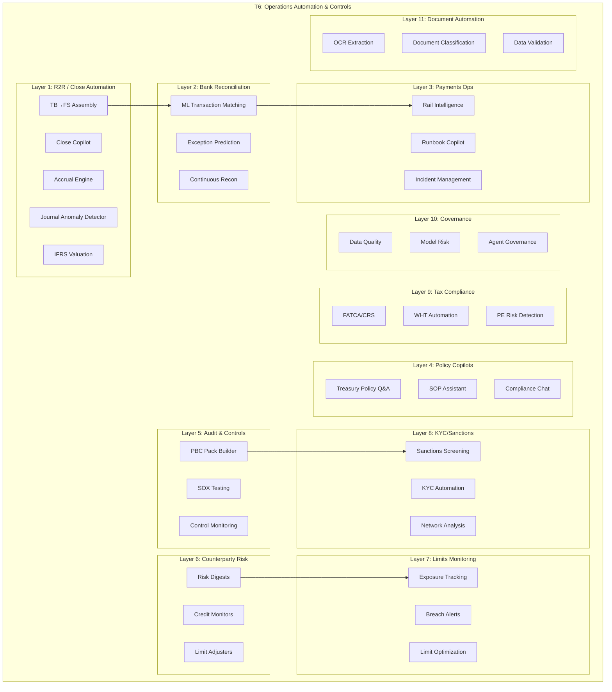

# T6: Operations Automation, Controls & Financial Crime

## Overview

Treasury operations form the backbone of financial execution - from closing the books to processing payments, maintaining compliance, and detecting fraud. This tower addresses the critical operational workflows that keep treasury running efficiently while maintaining robust controls.

!!! danger "Financial Crime Prevention"

    This tower includes AI-powered **fraud detection**, **sanctions screening**, and **AML monitoring** capabilities. All alerts are designed for human review and decision-making—AI assists in detection but humans make final determinations on suspicious activity.

**Key Transformation Themes:**
- **Close Acceleration**: Reduce month-end close from days to hours with AI-assisted automation
- **Intelligent Matching**: ML-powered reconciliation replacing manual exception handling
- **Proactive Controls**: Shift from detective to preventive control frameworks
- **Compliance Intelligence**: Automated KYC/Sanctions with reduced false positives
- **Self-Service Knowledge**: RAG-powered copilots for policies, procedures, and runbooks



## Layer Architecture

| Layer | Focus Area | Primary AI Techniques |
|-------|-----------|----------------------|
| 1 | R2R / Close Automation | LLM reasoning, anomaly detection, rule engines |
| 2 | Bank Reconciliation | ML matching, clustering, exception prediction |
| 3 | Payments Ops | NLP for runbooks, classification, routing |
| 4 | Policy Copilots | RAG, semantic search, conversational AI |
| 5 | Audit & Controls | Document extraction, evidence correlation |
| 6 | Counterparty Risk | NLP news analysis, credit signal aggregation |
| 7 | Limits Monitoring | Time-series analysis, threshold optimization |
| 8 | KYC/Sanctions | Fuzzy matching, graph analytics, NLP |
| 9 | Tax Compliance | NER, clause extraction, regulatory parsing |
| 10 | Governance | Data quality scoring, drift detection, lineage |
| 11 | Document Automation | OCR, layout analysis, structured extraction |

---

## Layer 1: R2R / Close Automation & Close Controls

### Overview

Record-to-Report (R2R) and financial close processes are among the most time-sensitive and error-prone activities in treasury. AI transforms these workflows by automating repetitive tasks, detecting anomalies before they propagate, and providing intelligent assistance throughout the close cycle.

**Key Pain Points Addressed:**
- Manual TB-to-FS mapping consuming 2-3 days per close
- Late-discovered accrual errors requiring restatements
- Journal entries posted at unusual times/by unusual approvers going undetected
- Duplicate invoices and fraudulent bank detail changes slipping through
- Complex IFRS inventory valuations requiring extensive manual calculation

---

### Use Case 1.1: TB→FS Assembly (Trial Balance to Financial Statements)

#### What It Does
Automates the mapping and assembly of trial balance line items into formatted financial statements, handling complex consolidation rules, eliminations, and IFRS/local GAAP presentation requirements.

#### Key Inputs
- Trial balance exports from SAP/ERP (all entities)
- Chart of accounts mapping rules
- Consolidation elimination entries
- Prior period comparatives
- IFRS/local GAAP presentation templates

#### AI/LLM Approach
- **Rule-based mapping** for standard accounts with LLM fallback for unmapped items
- **Anomaly detection** comparing current period to historical patterns
- **Natural language generation** for financial statement notes
- **Variance explanation** using LLM reasoning on underlying transactions

#### Example Interaction

```
┌─────────────────────────────────────────────────────────────────────────────┐
│ TB→FS ASSEMBLY COPILOT                                          Q4 2024    │
├─────────────────────────────────────────────────────────────────────────────┤
│                                                                             │
│ USER: Assemble consolidated financial statements for Q4 2024 close.        │
│       We have 12 entities reporting.                                       │
│                                                                             │
│ CLAUDE: I'll assemble the Q4 2024 consolidated financials. Let me process  │
│         the trial balances from all 12 entities.                           │
│                                                                             │
│         ┌─────────────────────────────────────────────────────────────┐    │
│         │ ENTITY PROCESSING STATUS                                     │    │
│         ├─────────────────────────────────────────────────────────────┤    │
│         │ Entity              │ TB Rows │ Mapped │ Exceptions │ Status│    │
│         ├─────────────────────┼─────────┼────────┼────────────┼───────┤    │
│         │ Tüpraş Izmir        │  2,847  │ 2,841  │     6      │  ⚠️   │    │
│         │ Tüpraş Izmit        │  2,156  │ 2,156  │     0      │  ✓    │    │
│         │ Tüpraş Kırıkkale    │  1,892  │ 1,892  │     0      │  ✓    │    │
│         │ Tüpraş Batman       │  1,654  │ 1,654  │     0      │  ✓    │    │
│         │ DITAŞ               │    743  │   743  │     0      │  ✓    │    │
│         │ Opet Trading        │  1,284  │ 1,280  │     4      │  ⚠️   │    │
│         │ ... (6 more)        │  4,521  │ 4,521  │     0      │  ✓    │    │
│         └─────────────────────┴─────────┴────────┴────────────┴───────┘    │
│                                                                             │
│         Found 10 unmapped accounts requiring attention:                     │
│                                                                             │
│         UNMAPPED ACCOUNT ANALYSIS:                                          │
│         ┌────────────────────────────────────────────────────────────────┐ │
│         │ Account     │ Description           │ Balance    │ Suggestion  │ │
│         ├─────────────┼───────────────────────┼────────────┼─────────────┤ │
│         │ 2891001     │ Carbon Credit Reserve │ $2.4M      │ → Other     │ │
│         │             │                       │            │   Intangible│ │
│         │ 1567002     │ Hydrogen Storage WIP  │ $8.7M      │ → CIP       │ │
│         │ 4892003     │ EUA Trading Gain      │ $1.2M      │ → Other     │ │
│         │             │                       │            │   Income    │ │
│         └─────────────┴───────────────────────┴────────────┴─────────────┘ │
│                                                                             │
│ USER: Accept the suggestions and show me the consolidated P&L summary.     │
│                                                                             │
│ CLAUDE: Mappings accepted. Processing consolidation eliminations...        │
│                                                                             │
│         INTERCOMPANY ELIMINATIONS:                                          │
│         ┌────────────────────────────────────────────────────────────────┐ │
│         │ Type                    │ Gross Amount │ Eliminated │ Net      │ │
│         ├─────────────────────────┼──────────────┼────────────┼──────────┤ │
│         │ IC Sales/Purchases      │ $4.2B        │ $4.2B      │ $0       │ │
│         │ IC Loans                │ $890M        │ $890M      │ $0       │ │
│         │ IC Dividends            │ $156M        │ $156M      │ $0       │ │
│         │ Unrealized IC Profit    │ $23M         │ $23M       │ $0       │ │
│         └─────────────────────────┴──────────────┴────────────┴──────────┘ │
│                                                                             │
│         CONSOLIDATED P&L SUMMARY (Q4 2024):                                 │
│         ═══════════════════════════════════════════════════════════════    │
│                                                                             │
│         Revenue                              $12,847,234,000                │
│           Refinery Sales                       11,234,000,000               │
│           Trading Revenue                       1,456,000,000               │
│           Other Revenue                           157,234,000               │
│                                                                             │
│         Cost of Sales                        (11,234,567,000)               │
│         ─────────────────────────────────────────────────────              │
│         Gross Profit                          1,612,667,000    12.5%       │
│                                                                             │
│         Operating Expenses                     (456,234,000)               │
│         Other Income/(Expense)                   34,567,000                │
│         ─────────────────────────────────────────────────────              │
│         Operating Profit                      1,191,000,000     9.3%       │
│                                                                             │
│         Finance Costs - Net                   (234,567,000)                │
│         ─────────────────────────────────────────────────────              │
│         Profit Before Tax                       956,433,000     7.4%       │
│                                                                             │
│         ⚠️ VARIANCE ALERTS:                                                 │
│         • Gross margin down 1.2pp vs Q3 (crack spread compression)         │
│         • Finance costs up 18% (higher USD rates on floating debt)         │
│         • Trading revenue up 34% (volatility-driven)                       │
│                                                                             │
└─────────────────────────────────────────────────────────────────────────────┘
```

#### Outputs
- Consolidated financial statements (P&L, Balance Sheet, Cash Flow)
- Mapping exception report with AI suggestions
- Elimination audit trail
- Variance commentary draft
- XBRL-tagged output for regulatory filing

#### KPIs
| Metric | Before | After | Improvement |
|--------|--------|-------|-------------|
| TB-to-FS assembly time | 2-3 days | 2-4 hours | 90% reduction |
| Mapping exceptions | 50-100/close | 5-10/close | 90% reduction |
| Rework cycles | 3-4 iterations | 1-2 iterations | 60% reduction |
| Late adjustments | 15-20/close | 2-3/close | 85% reduction |

---

### Use Case 1.2: Close Copilot / Close Cockpit

#### What It Does
Provides an intelligent assistant for the entire close process - tracking task completion, predicting delays, suggesting parallel workstreams, and answering questions about close status, blockers, and historical patterns.

#### Key Inputs
- Close task checklist with dependencies
- Real-time task completion status
- Historical close performance data
- Team availability calendars
- Open items and blockers log

#### AI/LLM Approach
- **Task dependency analysis** using graph algorithms
- **Delay prediction** based on historical patterns and current progress
- **Natural language interface** for close status queries
- **Recommendation engine** for task prioritization and parallel execution

#### Example Interaction

```
┌─────────────────────────────────────────────────────────────────────────────┐
│ CLOSE COPILOT                                           Day 2 of Close     │
├─────────────────────────────────────────────────────────────────────────────┤
│                                                                             │
│ USER: What's our close status? Are we on track for Day 5 completion?       │
│                                                                             │
│ CLAUDE: Analyzing close progress against Day 5 target...                   │
│                                                                             │
│         CLOSE PROGRESS DASHBOARD:                                           │
│         ┌─────────────────────────────────────────────────────────────┐    │
│         │                                                             │    │
│         │  Day 1    Day 2    Day 3    Day 4    Day 5                 │    │
│         │   ████████████░░░░░░░░░░░░░░░░░░░░░░░░░░░░░░  Target       │    │
│         │   ████████████████░░░░░░░░░░░░░░░░░░░░░░░░░░  Actual       │    │
│         │              ▲                                              │    │
│         │           You are here (Day 2, 4PM)                        │    │
│         │                                                             │    │
│         │  Tasks: 47/156 complete (30%)  │  Expected: 45 (29%)       │    │
│         │  Status: ✓ SLIGHTLY AHEAD                                  │    │
│         │                                                             │    │
│         └─────────────────────────────────────────────────────────────┘    │
│                                                                             │
│         CRITICAL PATH STATUS:                                               │
│         ┌────────────────────────────────────────────────────────────────┐ │
│         │ Task                      │ Owner    │ Due    │ Status │ Risk │ │
│         ├───────────────────────────┼──────────┼────────┼────────┼──────┤ │
│         │ Bank reconciliations      │ Ayşe K.  │ Day 2  │ 85%    │ Low  │ │
│         │ IC eliminations           │ Mehmet D.│ Day 3  │ 40%    │ Med  │ │
│         │ Inventory valuation       │ Elif S.  │ Day 3  │ 0%     │ HIGH │ │
│         │ Debt roll-forward         │ Can T.   │ Day 2  │ Done   │ -    │ │
│         │ FX revaluation            │ Zeynep A.│ Day 2  │ 90%    │ Low  │ │
│         │ Tax provision             │ Burak M. │ Day 4  │ 0%     │ Med  │ │
│         └───────────────────────────┴──────────┴────────┴────────┴──────┘ │
│                                                                             │
│         ⚠️ RISK ALERT: Inventory valuation not started                      │
│         - This task has 3 downstream dependencies                          │
│         - Historical avg: 1.5 days to complete                             │
│         - If started tomorrow, will push close to Day 5.5                  │
│                                                                             │
│ USER: Why is inventory valuation flagged high risk?                        │
│                                                                             │
│ CLAUDE: Let me analyze the inventory valuation risk:                       │
│                                                                             │
│         INVENTORY VALUATION RISK ANALYSIS:                                  │
│         ┌─────────────────────────────────────────────────────────────┐    │
│         │                                                             │    │
│         │ 1. NOT YET STARTED (0% complete)                           │    │
│         │    • Elif S. assigned but currently on bank recon          │    │
│         │    • No preliminary data pull initiated                    │    │
│         │                                                             │    │
│         │ 2. HISTORICAL PERFORMANCE                                  │    │
│         │    • Average completion: 1.5 days                          │    │
│         │    • Q3 2024: 2.1 days (crude price volatility)           │    │
│         │    • Q2 2024: 1.2 days (stable prices)                    │    │
│         │    • Current crude volatility: HIGH (similar to Q3)        │    │
│         │                                                             │    │
│         │ 3. DOWNSTREAM DEPENDENCIES (will be blocked):              │    │
│         │    ├─→ COGS finalization (Day 4)                          │    │
│         │    ├─→ Gross margin analysis (Day 4)                      │    │
│         │    └─→ CFO P&L review (Day 5)                             │    │
│         │                                                             │    │
│         │ 4. CURRENT MARKET CONDITIONS                               │    │
│         │    • 4 refineries × 847 product SKUs                      │    │
│         │    • Brent moved $8/bbl in December                       │    │
│         │    • NRV calculations will be complex                      │    │
│         │                                                             │    │
│         └─────────────────────────────────────────────────────────────┘    │
│                                                                             │
│         RECOMMENDED ACTIONS:                                                │
│         1. Reassign bank recon remaining items to Ayşe's backup            │
│         2. Start inventory data pull TODAY (saves 4 hours)                  │
│         3. Pre-calculate NRV benchmarks for top 50 SKUs (80% of value)     │
│                                                                             │
│ USER: Send alert to Elif and her manager about priority shift.             │
│                                                                             │
│ CLAUDE: Alert drafted and ready to send:                                   │
│                                                                             │
│         ┌─────────────────────────────────────────────────────────────┐    │
│         │ TO: Elif S., Ahmet Y. (Manager)                            │    │
│         │ CC: Close Task Force                                        │    │
│         │ SUBJECT: [URGENT] Q4 Close - Inventory Valuation Priority  │    │
│         │                                                             │    │
│         │ Close Copilot has identified inventory valuation as a      │    │
│         │ critical path risk for Day 5 completion.                   │    │
│         │                                                             │    │
│         │ Current Status: Not started (0%)                           │    │
│         │ Required Start: Today by EOD                               │    │
│         │ Impact if Delayed: Close pushed to Day 5.5-6               │    │
│         │                                                             │    │
│         │ Recommended Action: Transition remaining bank recon        │    │
│         │ items to backup and begin inventory data pull.             │    │
│         │                                                             │    │
│         │ [Send Now]  [Edit First]  [Schedule for Tomorrow AM]       │    │
│         └─────────────────────────────────────────────────────────────┘    │
│                                                                             │
└─────────────────────────────────────────────────────────────────────────────┘
```

#### Outputs
- Real-time close status dashboard
- Critical path analysis with delay predictions
- Task prioritization recommendations
- Automated alerts for at-risk items
- Close retrospective analytics

#### KPIs
| Metric | Before | After | Improvement |
|--------|--------|-------|-------------|
| Close cycle time | 8-10 days | 4-5 days | 50% reduction |
| Missed deadlines | 15-20% of tasks | <5% of tasks | 75% reduction |
| Status meeting time | 2 hrs/day | 30 min/day | 75% reduction |
| Late surprises | 5-8/close | 1-2/close | 80% reduction |

---

### Use Case 1.3: GR/IR Accrual Proposals

#### What It Does
Automatically identifies goods received but not invoiced (GR/IR) items requiring accrual, calculates accrual amounts based on PO terms and historical patterns, and generates journal entries with supporting documentation.

#### Key Inputs
- Open purchase orders with goods receipt dates
- Invoice receipt log with matching status
- Historical GR/IR aging patterns
- Vendor payment terms database
- Commodity price indices for valuation

#### AI/LLM Approach
- **Pattern recognition** for typical invoice lag by vendor/category
- **Anomaly detection** for unusual GR/IR aging
- **Price estimation** using recent invoices and market indices
- **Auto-generation** of accrual journal entries with narratives

#### Example Interaction

```
┌─────────────────────────────────────────────────────────────────────────────┐
│ GR/IR ACCRUAL ENGINE                                        December Close │
├─────────────────────────────────────────────────────────────────────────────┤
│                                                                             │
│ USER: Generate GR/IR accruals for December 2024 close. Focus on items      │
│       over $100K and flag anything unusual.                                │
│                                                                             │
│ CLAUDE: Analyzing open GR/IR items as of December 31, 2024...              │
│                                                                             │
│         GR/IR AGING SUMMARY:                                                │
│         ┌─────────────────────────────────────────────────────────────┐    │
│         │                                                             │    │
│         │  Aging Bucket    │  Count  │  Value ($M)  │  % of Total    │    │
│         │ ─────────────────┼─────────┼──────────────┼──────────────── │    │
│         │  0-30 days       │   847   │    $45.2     │     52%        │    │
│         │  31-60 days      │   234   │    $23.8     │     27%        │    │
│         │  61-90 days      │    89   │    $12.4     │     14%        │    │
│         │  90+ days        │    23   │     $5.8     │      7%   ⚠️   │    │
│         │ ─────────────────┼─────────┼──────────────┼──────────────── │    │
│         │  TOTAL           │  1,193  │    $87.2     │    100%        │    │
│         │                                                             │    │
│         └─────────────────────────────────────────────────────────────┘    │
│                                                                             │
│         HIGH-VALUE ITEMS (>$100K) REQUIRING ACCRUAL:                        │
│         ┌────────────────────────────────────────────────────────────────┐ │
│         │ PO#      │ Vendor           │ Description    │ GR Date │Amount│ │
│         ├──────────┼──────────────────┼────────────────┼─────────┼──────┤ │
│         │ 450089234│ Vitol Energy     │ Crude Dec Del  │ Dec-28  │$34.2M│ │
│         │ 450089456│ Trafigura        │ Naphtha Cargo  │ Dec-22  │$18.7M│ │
│         │ 450087123│ SOCAR Trading    │ Fuel Oil       │ Dec-15  │ $8.4M│ │
│         │ 450086234│ Glencore         │ Crude Nov Del  │ Nov-28  │ $5.2M│ │
│         │ 450085567│ Siemens Energy   │ Turbine Maint  │ Dec-10  │ $2.1M│ │
│         │ 450084890│ Honeywell        │ Catalyst Chg   │ Dec-05  │ $1.8M│ │
│         └──────────┴──────────────────┴────────────────┴─────────┴──────┘ │
│                                                                             │
│         ⚠️ ANOMALY DETECTED:                                                │
│         ┌─────────────────────────────────────────────────────────────┐    │
│         │ PO# 450086234 - SOCAR Trading (Nov-28 GR, $5.2M)           │    │
│         │                                                             │    │
│         │ ISSUE: 33-day aging vs typical 12-day lag for this vendor  │    │
│         │                                                             │    │
│         │ Historical Pattern:                                        │    │
│         │   SOCAR avg invoice lag: 12 days (σ = 3 days)             │    │
│         │   Current lag: 33 days (7σ deviation)                      │    │
│         │                                                             │    │
│         │ Possible Causes:                                           │    │
│         │   • Invoice in dispute (check AP inbox)                    │    │
│         │   • Quality claim pending                                  │    │
│         │   • Pricing disagreement                                   │    │
│         │                                                             │    │
│         │ RECOMMENDATION: Flag for AP team follow-up before accrual  │    │
│         └─────────────────────────────────────────────────────────────┘    │
│                                                                             │
│ USER: Generate the accrual entries. Use PO price for crude/naphtha and     │
│       flag the SOCAR item for review.                                      │
│                                                                             │
│ CLAUDE: Generating accrual journal entries...                              │
│                                                                             │
│         PROPOSED ACCRUAL ENTRIES:                                           │
│         ═══════════════════════════════════════════════════════════════    │
│                                                                             │
│         Journal Entry #1 - Crude Oil Accruals                              │
│         ┌─────────────────────────────────────────────────────────────┐    │
│         │ Account                    │ Debit ($)    │ Credit ($)     │    │
│         ├────────────────────────────┼──────────────┼────────────────┤    │
│         │ 5100100 Crude Oil Expense  │ 34,200,000   │                │    │
│         │ 5100100 Crude Oil Expense  │  5,200,000*  │                │    │
│         │ 2100500 GR/IR Clearing     │              │ 39,400,000     │    │
│         ├────────────────────────────┴──────────────┴────────────────┤    │
│         │ *SOCAR item flagged for review - accrue at PO price        │    │
│         │ Narrative: Crude oil received Dec 2024, invoices pending   │    │
│         └─────────────────────────────────────────────────────────────┘    │
│                                                                             │
│         Journal Entry #2 - Naphtha Accrual                                 │
│         ┌─────────────────────────────────────────────────────────────┐    │
│         │ Account                    │ Debit ($)    │ Credit ($)     │    │
│         ├────────────────────────────┼──────────────┼────────────────┤    │
│         │ 5100200 Naphtha Expense    │ 18,700,000   │                │    │
│         │ 2100500 GR/IR Clearing     │              │ 18,700,000     │    │
│         ├────────────────────────────┴──────────────┴────────────────┤    │
│         │ Narrative: Naphtha cargo received Dec-22, Trafigura        │    │
│         │ invoicing typically within 15 days of delivery             │    │
│         └─────────────────────────────────────────────────────────────┘    │
│                                                                             │
│         TOTAL ACCRUALS: $70.5M (3 journal entries generated)               │
│                                                                             │
│         📋 Review items sent to AP team:                                    │
│         • PO# 450086234 - SOCAR $5.2M (aging anomaly)                      │
│                                                                             │
│         [Post to SAP]  [Export to Excel]  [Send for Approval]              │
│                                                                             │
└─────────────────────────────────────────────────────────────────────────────┘
```

#### Outputs
- Accrual journal entries with narratives
- Aging analysis by vendor/category
- Anomaly flags with investigation recommendations
- Accrual vs actual variance report (following month)
- Supporting documentation package

#### KPIs
| Metric | Before | After | Improvement |
|--------|--------|-------|-------------|
| Accrual calculation time | 2 days | 2 hours | 90% reduction |
| Accrual accuracy | 85-90% | 97-99% | 10% improvement |
| Missed accruals | 5-10/month | <1/month | 90% reduction |
| Anomalies detected proactively | 20% | 95% | 4x improvement |

---

### Use Case 1.4: Journal Anomaly Detector

#### What It Does
Monitors journal entries in real-time for suspicious patterns including round-trip transactions, weekend/holiday postings, unusual approvers, split entries below approval thresholds, and entries by terminated employees.

#### Key Inputs
- Journal entry feed (real-time or batch)
- User access matrix and approval limits
- Historical journal patterns by user/account
- HR termination feed
- Holiday/weekend calendar

#### AI/LLM Approach
- **Anomaly detection models** (Isolation Forest, Autoencoders) for unusual patterns
- **Rule-based screening** for known fraud patterns
- **Behavioral analytics** comparing user patterns to historical baseline
- **Network analysis** for round-trip transaction detection

#### Example Interaction

```
┌─────────────────────────────────────────────────────────────────────────────┐
│ JOURNAL ANOMALY DETECTOR                              Real-Time Monitoring │
├─────────────────────────────────────────────────────────────────────────────┤
│                                                                             │
│ ⚠️ ALERT: Multiple anomalies detected in today's journal postings          │
│                                                                             │
│ USER: Show me the anomalies flagged today with severity rankings.          │
│                                                                             │
│ CLAUDE: I've identified 7 anomalies across 1,234 journal entries today:    │
│                                                                             │
│         ANOMALY DASHBOARD - January 8, 2025:                                │
│         ┌─────────────────────────────────────────────────────────────┐    │
│         │                                                             │    │
│         │  Severity   │ Count │ Types                                │    │
│         │ ────────────┼───────┼───────────────────────────────────── │    │
│         │  🔴 HIGH    │   2   │ Round-trip, Terminated user         │    │
│         │  🟡 MEDIUM  │   3   │ Weekend posting, Split entry        │    │
│         │  🟢 LOW     │   2   │ Unusual hour, First-time account    │    │
│         │                                                             │    │
│         └─────────────────────────────────────────────────────────────┘    │
│                                                                             │
│         🔴 HIGH SEVERITY ANOMALIES:                                         │
│                                                                             │
│         ANOMALY #1: POTENTIAL ROUND-TRIP TRANSACTION                        │
│         ┌─────────────────────────────────────────────────────────────┐    │
│         │                                                             │    │
│         │  JE #98234 (Posted 09:14)          JE #98267 (Posted 14:22)│    │
│         │  ┌─────────────────────┐           ┌─────────────────────┐ │    │
│         │  │ Dr: 1200300 $500K   │    ───►   │ Dr: 4500100 $500K   │ │    │
│         │  │ Cr: 4500100 $500K   │    ◄───   │ Cr: 1200300 $500K   │ │    │
│         │  │ Posted by: User A   │           │ Posted by: User B   │ │    │
│         │  └─────────────────────┘           └─────────────────────┘ │    │
│         │                                                             │    │
│         │  Pattern: Mirror entries within same day                   │    │
│         │  Net Effect: Zero (potential revenue manipulation)         │    │
│         │  Risk Score: 94/100                                        │    │
│         │                                                             │    │
│         │  Similar historical pattern: Q2 2024 audit finding #AF-17  │    │
│         │                                                             │    │
│         └─────────────────────────────────────────────────────────────┘    │
│                                                                             │
│         ANOMALY #2: TERMINATED USER POSTING                                 │
│         ┌─────────────────────────────────────────────────────────────┐    │
│         │                                                             │    │
│         │  JE #98301 - Posted 11:45 by UserID: EKAPLAN               │    │
│         │                                                             │    │
│         │  ⚠️ USER STATUS CHECK:                                      │    │
│         │  • Name: Emre Kaplan                                       │    │
│         │  • Department: Treasury Operations                         │    │
│         │  • Termination Date: January 3, 2025 (5 days ago)         │    │
│         │  • SAP Access: Should have been revoked                    │    │
│         │                                                             │    │
│         │  Entry Details:                                            │    │
│         │  Dr: 2300100 Accrued Expenses     $125,000                 │    │
│         │  Cr: 1100100 Bank Account         $125,000                 │    │
│         │  Description: "Q4 bonus payment adjustment"                │    │
│         │                                                             │    │
│         │  Risk Score: 98/100                                        │    │
│         │  Action Required: IMMEDIATE ACCESS REVIEW                  │    │
│         │                                                             │    │
│         └─────────────────────────────────────────────────────────────┘    │
│                                                                             │
│ USER: Show me the split entry anomaly details.                             │
│                                                                             │
│ CLAUDE: Here's the split entry analysis:                                   │
│                                                                             │
│         🟡 MEDIUM SEVERITY: APPROVAL THRESHOLD AVOIDANCE                    │
│         ┌─────────────────────────────────────────────────────────────┐    │
│         │                                                             │    │
│         │  User: Deniz Yılmaz (Approval limit: $50,000)              │    │
│         │                                                             │    │
│         │  Entries posted within 8-minute window:                    │    │
│         │  ┌────────┬───────────┬──────────┬─────────────────────┐  │    │
│         │  │ JE#    │ Time      │ Amount   │ Description         │  │    │
│         │  ├────────┼───────────┼──────────┼─────────────────────┤  │    │
│         │  │ 98245  │ 10:02:14  │ $48,500  │ Consulting - Phase1 │  │    │
│         │  │ 98246  │ 10:04:33  │ $47,200  │ Consulting - Phase2 │  │    │
│         │  │ 98247  │ 10:06:51  │ $49,800  │ Consulting - Phase3 │  │    │
│         │  │ 98248  │ 10:10:22  │ $46,500  │ Consulting - Phase4 │  │    │
│         │  └────────┴───────────┴──────────┴─────────────────────┘  │    │
│         │                                                             │    │
│         │  Total Amount: $192,000                                    │    │
│         │  Same Vendor: McKinsey & Company                           │    │
│         │  Same Cost Center: CC-4521                                 │    │
│         │                                                             │    │
│         │  Pattern Analysis:                                         │    │
│         │  • All entries just below $50K approval threshold          │    │
│         │  • Same vendor, sequential timing                          │    │
│         │  • Should require CFO approval ($192K > $100K limit)       │    │
│         │                                                             │    │
│         │  Risk Score: 76/100                                        │    │
│         │                                                             │    │
│         └─────────────────────────────────────────────────────────────┘    │
│                                                                             │
│         [Escalate to Internal Audit]  [Request Explanation]  [Hold Entry] │
│                                                                             │
└─────────────────────────────────────────────────────────────────────────────┘
```

#### Outputs
- Real-time anomaly alerts with severity ranking
- Pattern visualization for complex schemes
- Risk scores with explainable factors
- Escalation workflow integration
- Monthly anomaly trend reports

#### KPIs
| Metric | Before | After | Improvement |
|--------|--------|-------|-------------|
| Fraud detection rate | 40-50% | 95%+ | 2x improvement |
| Detection time | Months (audit) | Real-time | 99% faster |
| False positive rate | N/A | <10% | Manageable workload |
| Control violations caught | 25% | 90% | 3.6x improvement |

---

### Use Case 1.5: Payment Fraud Detection

#### What It Does
Detects potential payment fraud by identifying duplicate invoices, suspicious vendor bank detail changes, unusual payment patterns, and business email compromise attempts through ML models and rule-based screening.

#### Key Inputs
- Invoice data with vendor details
- Vendor master change log
- Historical payment patterns
- Email communications (for BEC detection)
- External fraud intelligence feeds

#### AI/LLM Approach
- **Duplicate detection** using fuzzy matching on invoice fields
- **Behavioral analysis** of vendor payment patterns
- **NLP analysis** of emails for BEC indicators
- **Network analysis** linking vendor relationships
- **Anomaly scoring** combining multiple risk factors

#### Example Interaction

```
┌─────────────────────────────────────────────────────────────────────────────┐
│ PAYMENT FRAUD DETECTION                                  Pre-Payment Scan  │
├─────────────────────────────────────────────────────────────────────────────┤
│                                                                             │
│ USER: Run fraud scan on tomorrow's payment batch. We have $45M scheduled.  │
│                                                                             │
│ CLAUDE: Scanning 847 payments totaling $45.2M for fraud indicators...      │
│                                                                             │
│         PAYMENT BATCH RISK SUMMARY:                                         │
│         ┌─────────────────────────────────────────────────────────────┐    │
│         │                                                             │    │
│         │  Risk Level    │ Payments │ Value      │ Action Required   │    │
│         │ ───────────────┼──────────┼────────────┼────────────────── │    │
│         │  🔴 High Risk  │     3    │  $2.4M     │ HOLD for review   │    │
│         │  🟡 Medium     │    12    │  $4.8M     │ Verify before pay │    │
│         │  🟢 Low Risk   │   832    │ $38.0M     │ Clear to process  │    │
│         │                                                             │    │
│         └─────────────────────────────────────────────────────────────┘    │
│                                                                             │
│         🔴 HIGH RISK PAYMENTS - HOLD FOR INVESTIGATION:                     │
│                                                                             │
│         ALERT #1: BANK DETAIL CHANGE + URGENT REQUEST                       │
│         ┌─────────────────────────────────────────────────────────────┐    │
│         │                                                             │    │
│         │  Vendor: Siemens Energy AG                                 │    │
│         │  Invoice: SI-2024-78234    Amount: $1,850,000              │    │
│         │                                                             │    │
│         │  ⚠️ RED FLAGS DETECTED:                                     │    │
│         │                                                             │    │
│         │  1. BANK DETAIL CHANGE (Jan 5, 2025 - 3 days ago)          │    │
│         │     Old: Deutsche Bank, Frankfurt (DE89...)                │    │
│         │     New: First Caribbean Bank, Cayman (KY12...)            │    │
│         │     Changed by: Vendor Master Team (ticket VM-8923)        │    │
│         │                                                             │    │
│         │  2. EMAIL ANALYSIS (BEC INDICATORS)                        │    │
│         │     ┌─────────────────────────────────────────────────┐    │    │
│         │     │ From: hans.muller@siemens-energy.de             │    │    │
│         │     │       (Note: Should be @siemens-energy.com)     │    │    │
│         │     │                                                 │    │    │
│         │     │ "Please update bank details urgently for this  │    │    │
│         │     │  payment. Our German account is under audit    │    │    │
│         │     │  and we need payment to our offshore treasury  │    │    │
│         │     │  account. Please confirm by phone: +1-809-..."  │    │    │
│         │     │                                                 │    │    │
│         │     │ BEC Risk Score: 94/100                         │    │    │
│         │     │ Indicators: Domain spoof, urgency language,    │    │    │
│         │     │ offshore redirect, phone callback requested    │    │    │
│         │     └─────────────────────────────────────────────────┘    │    │
│         │                                                             │    │
│         │  RECOMMENDATION: HOLD - Likely business email compromise   │    │
│         │  Call known Siemens contact to verify bank change          │    │
│         │                                                             │    │
│         └─────────────────────────────────────────────────────────────┘    │
│                                                                             │
│         ALERT #2: DUPLICATE INVOICE DETECTED                                │
│         ┌─────────────────────────────────────────────────────────────┐    │
│         │                                                             │    │
│         │  Invoice in Batch: INV-2024-9823     $342,500              │    │
│         │  Vendor: Honeywell UOP                                     │    │
│         │                                                             │    │
│         │  DUPLICATE MATCH ANALYSIS:                                 │    │
│         │  ┌─────────────────────────────────────────────────────┐  │    │
│         │  │ Field         │ Current     │ Paid Oct 2024        │  │    │
│         │  ├───────────────┼─────────────┼──────────────────────┤  │    │
│         │  │ Invoice #     │ INV-2024-9823│ INV-2024-9823       │  │    │
│         │  │ Amount        │ $342,500    │ $342,500             │  │    │
│         │  │ Description   │ Catalyst Q4 │ Catalyst Q4          │  │    │
│         │  │ PO Reference  │ PO-445621   │ PO-445621            │  │    │
│         │  └───────────────┴─────────────┴──────────────────────┘  │    │
│         │                                                             │    │
│         │  Match Confidence: 99.8%                                   │    │
│         │  Previous Payment: Oct 15, 2024 (Check #78234)            │    │
│         │                                                             │    │
│         │  RECOMMENDATION: REJECT - Exact duplicate                  │    │
│         │                                                             │    │
│         └─────────────────────────────────────────────────────────────┘    │
│                                                                             │
│         ALERT #3: UNUSUAL PAYMENT PATTERN                                   │
│         ┌─────────────────────────────────────────────────────────────┐    │
│         │                                                             │    │
│         │  Vendor: Novo Consultoria Ltda (Brazil)                    │    │
│         │  Invoice: NC-2025-001      Amount: $215,000                │    │
│         │                                                             │    │
│         │  PATTERN ANOMALIES:                                        │    │
│         │  • First payment ever to this vendor                       │    │
│         │  • Vendor created 5 days ago                               │    │
│         │  • Created by: Terminated employee (Emre Kaplan)           │    │
│         │  • No purchase order reference                             │    │
│         │  • Round amount ($215,000 exactly)                         │    │
│         │  • Bank: Banco do Brasil, São Paulo                        │    │
│         │                                                             │    │
│         │  Risk Score: 89/100                                        │    │
│         │                                                             │    │
│         │  RECOMMENDATION: HOLD - New vendor/ex-employee created     │    │
│         │                                                             │    │
│         └─────────────────────────────────────────────────────────────┘    │
│                                                                             │
│         BATCH ACTIONS:                                                      │
│         [Hold 3 High-Risk]  [Process 832 Low-Risk]  [Export Report]        │
│                                                                             │
└─────────────────────────────────────────────────────────────────────────────┘
```

#### Outputs
- Pre-payment fraud scan results
- Risk-scored payment queue
- BEC email analysis reports
- Duplicate invoice detection
- Vendor anomaly alerts
- Investigation workflow triggers

#### KPIs
| Metric | Before | After | Improvement |
|--------|--------|-------|-------------|
| Fraud prevented (annual) | $500K-1M | $3-5M | 4x improvement |
| Duplicate payments | 15-20/year | <3/year | 85% reduction |
| BEC attempts caught | 30% | 95% | 3x improvement |
| False positives | N/A | <15% | Manageable |

---

### Use Case 1.6: IFRS Inventory Valuation (LCM/NRV)

#### What It Does
Automates the complex Lower of Cost or Net Realizable Value (LCM/NRV) calculations for refinery inventory, incorporating real-time market prices, processing costs, and transportation to determine if write-downs are required.

#### Key Inputs
- Inventory quantities by product/location
- Cost layer data (FIFO/weighted average)
- Real-time commodity prices (Platts, Argus)
- Processing and transportation cost estimates
- Historical NRV calculation models
- Sales price forecasts

#### AI/LLM Approach
- **Price forecasting** using time-series models on commodity indices
- **Cost estimation** from historical processing data
- **Automated NRV calculation** with multiple scenarios
- **Exception identification** for items requiring write-down
- **Natural language explanation** of valuation adjustments

#### Example Interaction

```
┌─────────────────────────────────────────────────────────────────────────────┐
│ IFRS INVENTORY VALUATION ENGINE                         Q4 2024 Year-End   │
├─────────────────────────────────────────────────────────────────────────────┤
│                                                                             │
│ USER: Run NRV calculations for year-end inventory. Crude dropped $8/bbl    │
│       in December - I'm worried about write-downs on feedstock.            │
│                                                                             │
│ CLAUDE: Running LCM/NRV analysis across all 4 refineries...               │
│                                                                             │
│         INVENTORY POSITION AS OF DECEMBER 31, 2024:                         │
│         ┌─────────────────────────────────────────────────────────────┐    │
│         │                                                             │    │
│         │  Category       │  Volume     │  Cost Basis  │  % of Total │    │
│         │ ────────────────┼─────────────┼──────────────┼──────────── │    │
│         │  Crude Oil      │  4.2M bbl   │   $344.4M    │    58%      │    │
│         │  Intermediate   │  1.8M bbl   │   $126.0M    │    21%      │    │
│         │  Finished Goods │  2.1M bbl   │   $168.0M    │    28%      │    │
│         │  Chemicals      │  Various    │    $23.5M    │     4%      │    │
│         │ ────────────────┼─────────────┼──────────────┼──────────── │    │
│         │  TOTAL          │             │   $593.9M    │   100%      │    │
│         │                                                             │    │
│         └─────────────────────────────────────────────────────────────┘    │
│                                                                             │
│         CRUDE OIL NRV ANALYSIS:                                             │
│         ┌─────────────────────────────────────────────────────────────┐    │
│         │                                                             │    │
│         │  Price Movement - December 2024:                           │    │
│         │                                                             │    │
│         │  $82 ┤                                                     │    │
│         │      │  ▄▄▄▄                                               │    │
│         │  $80 ┤ █████▄▄                                             │    │
│         │      │ ███████▄▄                                           │    │
│         │  $78 ┤ █████████▄                                          │    │
│         │      │ ██████████▄▄                                        │    │
│         │  $76 ┤ █████████████▄▄                                     │    │
│         │      │ ███████████████▄▄                                   │    │
│         │  $74 ┤ ████████████████████▄▄▄▄▄▄                         │    │
│         │      └─┴─┴─┴─┴─┴─┴─┴─┴─┴─┴─┴─┴─┴─┴─┴─┴─┴─┴─┴─┴─┴─┴──►     │    │
│         │       1  3  5  7  9 11 13 15 17 19 21 23 25 27 29 31       │    │
│         │                    December 2024                           │    │
│         │                                                             │    │
│         │  Brent Close (Dec 31): $74.12/bbl                         │    │
│         │  Weighted Avg Cost:    $82.00/bbl                         │    │
│         │                                                             │    │
│         └─────────────────────────────────────────────────────────────┘    │
│                                                                             │
│         NRV CALCULATION - CRUDE INVENTORY:                                  │
│         ┌─────────────────────────────────────────────────────────────┐    │
│         │                                                             │    │
│         │  Step 1: Estimated Selling Price (Product Yields)          │    │
│         │  ┌────────────────────────────────────────────────────┐    │    │
│         │  │ Product      │ Yield │ Price    │ Revenue/bbl     │    │    │
│         │  ├──────────────┼───────┼──────────┼─────────────────┤    │    │
│         │  │ Gasoline     │  35%  │ $92.50   │   $32.38        │    │    │
│         │  │ Diesel       │  28%  │ $94.80   │   $26.54        │    │    │
│         │  │ Jet Fuel     │  12%  │ $96.20   │   $11.54        │    │    │
│         │  │ Fuel Oil     │  18%  │ $68.00   │   $12.24        │    │    │
│         │  │ Other        │   7%  │ $45.00   │    $3.15        │    │    │
│         │  ├──────────────┴───────┴──────────┼─────────────────┤    │    │
│         │  │ Total Revenue per barrel crude  │   $85.85        │    │    │
│         │  └─────────────────────────────────┴─────────────────┘    │    │
│         │                                                             │    │
│         │  Step 2: Costs to Complete                                 │    │
│         │  • Processing costs:     $8.50/bbl                         │    │
│         │  • Transportation:       $1.20/bbl                         │    │
│         │  • Selling costs:        $0.45/bbl                         │    │
│         │  • Total costs:         $10.15/bbl                         │    │
│         │                                                             │    │
│         │  Step 3: NRV Calculation                                   │    │
│         │  ═══════════════════════════════════════════════════       │    │
│         │  Estimated selling price:          $85.85/bbl              │    │
│         │  Less: Costs to complete:         ($10.15)/bbl             │    │
│         │  ─────────────────────────────────────────────             │    │
│         │  NET REALIZABLE VALUE:             $75.70/bbl              │    │
│         │                                                             │    │
│         │  Step 4: LCM/NRV Test                                      │    │
│         │  Cost basis:                       $82.00/bbl              │    │
│         │  NRV:                              $75.70/bbl              │    │
│         │  ─────────────────────────────────────────────             │    │
│         │  WRITE-DOWN REQUIRED:              ($6.30)/bbl   ⚠️        │    │
│         │                                                             │    │
│         └─────────────────────────────────────────────────────────────┘    │
│                                                                             │
│         WRITE-DOWN SUMMARY:                                                 │
│         ┌─────────────────────────────────────────────────────────────┐    │
│         │                                                             │    │
│         │  Category       │ Volume   │ Per Unit │ Total Write-Down   │    │
│         │ ────────────────┼──────────┼──────────┼─────────────────── │    │
│         │  Crude Oil      │ 4.2M bbl │  $6.30   │   $26,460,000  ⚠️ │    │
│         │  Naphtha        │ 0.5M bbl │  $2.10   │    $1,050,000     │    │
│         │  Fuel Oil       │ 0.8M bbl │  $4.50   │    $3,600,000     │    │
│         │ ────────────────┼──────────┼──────────┼─────────────────── │    │
│         │  TOTAL          │          │          │   $31,110,000     │    │
│         │                                                             │    │
│         │  Journal Entry Required:                                   │    │
│         │  Dr: Cost of Sales - Inventory Writedown  $31,110,000     │    │
│         │  Cr: Inventory Valuation Allowance        $31,110,000     │    │
│         │                                                             │    │
│         └─────────────────────────────────────────────────────────────┘    │
│                                                                             │
│ USER: What if Brent recovers to $78 in January - can we reverse?           │
│                                                                             │
│ CLAUDE: Yes, under IFRS (IAS 2), inventory write-downs can be reversed.   │
│                                                                             │
│         REVERSAL SCENARIO ANALYSIS:                                         │
│         ┌─────────────────────────────────────────────────────────────┐    │
│         │                                                             │    │
│         │  If Brent = $78/bbl in January:                            │    │
│         │                                                             │    │
│         │  New NRV estimate: $80.95/bbl (recalculated)               │    │
│         │                                                             │    │
│         │  Reversal Analysis:                                        │    │
│         │  • Original cost: $82.00/bbl                               │    │
│         │  • Written-down value: $75.70/bbl                          │    │
│         │  • New NRV: $80.95/bbl                                     │    │
│         │                                                             │    │
│         │  Maximum reversal = MIN(New NRV, Original Cost) - WD Value │    │
│         │  = MIN($80.95, $82.00) - $75.70                            │    │
│         │  = $80.95 - $75.70                                         │    │
│         │  = $5.25/bbl                                               │    │
│         │                                                             │    │
│         │  Potential reversal amount: $5.25 × 4.2M = $22,050,000    │    │
│         │                                                             │    │
│         │  Note: Cannot reverse above original cost ($82.00)         │    │
│         │                                                             │    │
│         └─────────────────────────────────────────────────────────────┘    │
│                                                                             │
│         [Generate Journal Entry]  [Export Workpaper]  [Add to Close Pack] │
│                                                                             │
└─────────────────────────────────────────────────────────────────────────────┘
```

#### Outputs
- NRV calculation workpapers by product
- Write-down journal entries with narratives
- Price sensitivity analysis
- IFRS disclosure drafts
- Historical write-down trend reports
- Audit-ready documentation

#### KPIs
| Metric | Before | After | Improvement |
|--------|--------|-------|-------------|
| NRV calculation time | 3-4 days | 4-6 hours | 85% reduction |
| Pricing data errors | 5-10/quarter | <1/quarter | 90% reduction |
| Audit adjustments | 2-3/year | 0-1/year | 70% reduction |
| Price scenario analysis | 1-2 scenarios | 10+ scenarios | 5x improvement |

---

## Layer 2: Bank Reconciliation & Transaction Matching

### Overview

Bank reconciliation is a daily operational necessity that consumes significant manual effort, particularly for organizations with multiple bank accounts across different currencies and jurisdictions. AI transforms this from a labor-intensive matching exercise into an intelligent, continuous process with predictive exception handling.

**Key Pain Points Addressed:**
- 60-70% of reconciliation time spent on manual exception investigation
- Month-end backlogs due to deferred daily reconciliations
- Inconsistent matching rules across different account types
- Limited visibility into reconciliation status across the organization

---

### Use Case 2.1: ML-Powered Transaction Matching

#### What It Does
Uses machine learning to match bank statement transactions with internal records (GL, sub-ledger, treasury system) based on multiple attributes, learning from historical matching decisions to continuously improve accuracy.

#### Key Inputs
- Bank statement feeds (MT940, BAI2, CAMT.053)
- GL transaction extracts
- Treasury system cash entries
- Historical matching decisions
- Matching rule configurations

#### AI/LLM Approach
- **Supervised learning** trained on historical match decisions
- **Fuzzy matching** on descriptions, references, and amounts
- **Clustering algorithms** to identify related transactions
- **Confidence scoring** for each proposed match
- **Active learning** from user corrections

#### Example Interaction

```
┌─────────────────────────────────────────────────────────────────────────────┐
│ BANK RECONCILIATION ENGINE                              January 9, 2025    │
├─────────────────────────────────────────────────────────────────────────────┤
│                                                                             │
│ USER: Run reconciliation for all USD accounts. Show me the exception       │
│       summary and any patterns you notice.                                 │
│                                                                             │
│ CLAUDE: Processing reconciliation for 12 USD bank accounts...              │
│                                                                             │
│         RECONCILIATION SUMMARY:                                             │
│         ┌─────────────────────────────────────────────────────────────┐    │
│         │                                                             │    │
│         │  Account              │  Items  │ Auto-Matched │ Exceptions │    │
│         │ ──────────────────────┼─────────┼──────────────┼─────────── │    │
│         │  JPM Operating        │   847   │    823 (97%) │    24      │    │
│         │  Citi Payroll         │   234   │    234 (100%)│     0      │    │
│         │  BofA Trade Finance   │   156   │    148 (95%) │     8      │    │
│         │  Wells Fargo Debt     │    45   │     42 (93%) │     3      │    │
│         │  HSBC FX Settlement   │   312   │    289 (93%) │    23      │    │
│         │  ... (7 more)         │   456   │    441 (97%) │    15      │    │
│         │ ──────────────────────┼─────────┼──────────────┼─────────── │    │
│         │  TOTAL                │  2,050  │  1,977 (96%) │    73      │    │
│         │                                                             │    │
│         └─────────────────────────────────────────────────────────────┘    │
│                                                                             │
│         EXCEPTION ANALYSIS:                                                 │
│         ┌─────────────────────────────────────────────────────────────┐    │
│         │                                                             │    │
│         │  Exception Type           │ Count │ Value      │ Trend     │    │
│         │ ──────────────────────────┼───────┼────────────┼────────── │    │
│         │  Timing differences       │  34   │  $12.4M    │ Normal    │    │
│         │  Amount mismatches        │  18   │  $2.1M     │ ↑ vs avg  │    │
│         │  Unidentified bank items  │  12   │  $890K     │ Normal    │    │
│         │  Missing GL entries       │   9   │  $1.8M     │ ↓ vs avg  │    │
│         │                                                             │    │
│         └─────────────────────────────────────────────────────────────┘    │
│                                                                             │
│         📊 PATTERN DETECTED - Amount Mismatches Elevated:                   │
│         ┌─────────────────────────────────────────────────────────────┐    │
│         │                                                             │    │
│         │  12 of 18 amount mismatches relate to FX settlements        │    │
│         │                                                             │    │
│         │  Pattern Analysis:                                         │    │
│         │  • All involve HSBC FX Settlement account                  │    │
│         │  • Bank using T+1 rate, GL using trade date rate           │    │
│         │  • Average variance: $8,234 per transaction                │    │
│         │  • Total impact: $98,808                                   │    │
│         │                                                             │    │
│         │  Root Cause: Rate timing difference (not errors)           │    │
│         │                                                             │    │
│         │  Recommendation: Create systematic adjustment rule         │    │
│         │  for FX settlement rate timing differences                 │    │
│         │                                                             │    │
│         └─────────────────────────────────────────────────────────────┘    │
│                                                                             │
│ USER: Show me the JPM Operating exceptions in detail.                      │
│                                                                             │
│ CLAUDE: Here are the 24 JPM Operating account exceptions:                  │
│                                                                             │
│         JPM OPERATING - EXCEPTION DETAILS:                                  │
│         ┌─────────────────────────────────────────────────────────────┐    │
│         │                                                             │    │
│         │  TIMING DIFFERENCES (18 items, $11.2M):                    │    │
│         │  ┌──────────┬────────────────────┬───────────┬───────────┐ │    │
│         │  │ Bank Ref │ Description        │ Amount    │ GL Match  │ │    │
│         │  ├──────────┼────────────────────┼───────────┼───────────┤ │    │
│         │  │ JPM89234 │ VITOL ENERGY TRF   │ $4.2M     │ Post 1/10 │ │    │
│         │  │ JPM89235 │ TRAFIGURA PAYMENT  │ $3.8M     │ Post 1/10 │ │    │
│         │  │ JPM89236 │ SHELL TRADING      │ $2.1M     │ Post 1/10 │ │    │
│         │  │ JPM89237 │ BP SETTLEMENT      │ $1.1M     │ Post 1/10 │ │    │
│         │  └──────────┴────────────────────┴───────────┴───────────┘ │    │
│         │  Action: Auto-clear on 1/10 when GL posts                  │    │
│         │                                                             │    │
│         │  UNIDENTIFIED ITEMS (6 items, $45,230):                    │    │
│         │  ┌──────────┬────────────────────────────┬────────────────┐│    │
│         │  │ Bank Ref │ Description                │ Amount         ││    │
│         │  ├──────────┼────────────────────────────┼────────────────┤│    │
│         │  │ JPM89301 │ LOCKBOX DEP 892341         │ $23,456.00     ││    │
│         │  │ JPM89302 │ ACH CR UNKNOWN ORIG        │ $12,340.00     ││    │
│         │  │ JPM89303 │ WIRE TRF REF 78234         │ $5,234.00      ││    │
│         │  │ JPM89304 │ LOCKBOX DEP 892342         │ $2,100.00      ││    │
│         │  │ JPM89305 │ MISC CREDIT                │ $1,500.00      ││    │
│         │  │ JPM89306 │ ACH RETURN FEE             │ $600.00        ││    │
│         │  └──────────┴────────────────────────────┴────────────────┘│    │
│         │                                                             │    │
│         │  AI MATCHING SUGGESTIONS:                                  │    │
│         │  ┌─────────────────────────────────────────────────────┐   │    │
│         │  │ JPM89301 → AR Invoice #45621 ($23,456) - 94% conf   │   │    │
│         │  │            Customer: Petkim Petrokimya              │   │    │
│         │  │            Reason: Amount exact, timing matches     │   │    │
│         │  │                                                     │   │    │
│         │  │ JPM89302 → Possible refund from vendor              │   │    │
│         │  │            Similar to past Honeywell refunds        │   │    │
│         │  │            Confidence: 67% - needs verification     │   │    │
│         │  │                                                     │   │    │
│         │  │ JPM89303 → No match found in any subsystem          │   │    │
│         │  │            Recommend: Contact originator bank       │   │    │
│         │  └─────────────────────────────────────────────────────┘   │    │
│         │                                                             │    │
│         └─────────────────────────────────────────────────────────────┘    │
│                                                                             │
│         [Accept AI Matches]  [Investigate]  [Create Manual Entry]          │
│                                                                             │
└─────────────────────────────────────────────────────────────────────────────┘
```

#### Outputs
- Reconciliation status dashboard by account
- Auto-matched transactions with confidence scores
- Exception queue prioritized by value/age
- Pattern detection alerts
- Audit trail of all matching decisions

#### KPIs
| Metric | Before | After | Improvement |
|--------|--------|-------|-------------|
| Auto-match rate | 60-70% | 95-98% | 40% improvement |
| Reconciliation time/account | 2-4 hours | 15-30 min | 85% reduction |
| Exception resolution time | 3-5 days | Same day | 80% reduction |
| Month-end backlog | 100+ items | <10 items | 90% reduction |

---

### Use Case 2.2: Exception Prediction & Prevention

#### What It Does
Predicts which transactions are likely to cause reconciliation exceptions before they occur, enabling proactive intervention and reducing the volume of items requiring manual investigation.

#### Key Inputs
- Historical exception patterns
- Transaction characteristics (amount, type, counterparty)
- Processing timing data
- System integration health metrics
- Calendar (holidays, cut-off times)

#### AI/LLM Approach
- **Predictive models** trained on historical exception data
- **Feature engineering** from transaction attributes
- **Time-series analysis** for timing-related exceptions
- **Root cause classification** to categorize predicted exceptions

#### Example Interaction

```
┌─────────────────────────────────────────────────────────────────────────────┐
│ EXCEPTION PREDICTION ENGINE                               January 9, 2025   │
├─────────────────────────────────────────────────────────────────────────────┤
│                                                                             │
│ ⚠️ PROACTIVE ALERT: High exception probability detected for tomorrow        │
│                                                                             │
│ USER: What's causing the alert? Show me the predicted exceptions.          │
│                                                                             │
│ CLAUDE: I've identified 3 factors that will likely cause exceptions:       │
│                                                                             │
│         EXCEPTION FORECAST - January 10, 2025:                              │
│         ┌─────────────────────────────────────────────────────────────┐    │
│         │                                                             │    │
│         │  Normal Day Exception Rate:     25-35 items                │    │
│         │  Predicted Tomorrow:            85-95 items   ⚠️ +170%     │    │
│         │                                                             │    │
│         └─────────────────────────────────────────────────────────────┘    │
│                                                                             │
│         CONTRIBUTING FACTORS:                                               │
│                                                                             │
│         FACTOR #1: TURKISH BANKING HOLIDAY (High Impact)                    │
│         ┌─────────────────────────────────────────────────────────────┐    │
│         │                                                             │    │
│         │  Tomorrow is a Turkish banking holiday                     │    │
│         │                                                             │    │
│         │  Impact Analysis:                                          │    │
│         │  • 8 TRY accounts will not receive statements              │    │
│         │  • Historical pattern: 45-50 timing exceptions             │    │
│         │  • Typical resolution: Auto-clear on next business day     │    │
│         │                                                             │    │
│         │  Recommendation: Pre-flag TRY account items as "holiday"   │    │
│         │  to avoid unnecessary investigation                        │    │
│         │                                                             │    │
│         └─────────────────────────────────────────────────────────────┘    │
│                                                                             │
│         FACTOR #2: LARGE CRUDE SETTLEMENT (Medium Impact)                   │
│         ┌─────────────────────────────────────────────────────────────┐    │
│         │                                                             │    │
│         │  Tomorrow's crude cargo settlement: $78.4M to Vitol        │    │
│         │                                                             │    │
│         │  Exception Risk Factors:                                   │    │
│         │  • Multi-leg payment (3 tranches)                          │    │
│         │  • FX conversion at settlement                             │    │
│         │  • Historical miss rate: 40% for multi-leg settlements     │    │
│         │                                                             │    │
│         │  Predicted Exceptions:                                     │    │
│         │  ┌─────────────────────────────────────────────────────┐   │    │
│         │  │ • Tranche timing mismatch (2-3 exceptions)          │   │    │
│         │  │ • FX rate variance (1-2 exceptions)                 │   │    │
│         │  │ • Fee allocation (1 exception)                      │   │    │
│         │  └─────────────────────────────────────────────────────┘   │    │
│         │                                                             │    │
│         │  Recommendation: Pre-load settlement schedule in recon     │    │
│         │  system to enable automatic tranche matching               │    │
│         │                                                             │    │
│         └─────────────────────────────────────────────────────────────┘    │
│                                                                             │
│         FACTOR #3: SYSTEM MAINTENANCE WINDOW (Low-Medium Impact)            │
│         ┌─────────────────────────────────────────────────────────────┐    │
│         │                                                             │    │
│         │  SAP planned maintenance: 2:00 AM - 6:00 AM local         │    │
│         │                                                             │    │
│         │  Impact:                                                   │    │
│         │  • GL postings during window will queue                    │    │
│         │  • Bank feeds will arrive before GL catches up             │    │
│         │  • Expected timing exceptions: 15-20 items                 │    │
│         │                                                             │    │
│         │  Recommendation: Delay reconciliation run to 8:00 AM      │    │
│         │  to allow GL queue to process                              │    │
│         │                                                             │    │
│         └─────────────────────────────────────────────────────────────┘    │
│                                                                             │
│ USER: Implement the recommendations automatically.                         │
│                                                                             │
│ CLAUDE: Implementing preventive measures:                                  │
│                                                                             │
│         ┌─────────────────────────────────────────────────────────────┐    │
│         │                                                             │    │
│         │  ✓ TRY accounts flagged as "Holiday - Auto-Clear 1/11"    │    │
│         │  ✓ Vitol settlement schedule loaded (3 tranches mapped)    │    │
│         │  ✓ Reconciliation job rescheduled from 6:00 AM to 8:00 AM │    │
│         │                                                             │    │
│         │  REVISED FORECAST:                                         │    │
│         │  Original prediction:     85-95 exceptions                 │    │
│         │  After interventions:     30-40 exceptions                 │    │
│         │  Reduction:               55-60% fewer exceptions          │    │
│         │                                                             │    │
│         └─────────────────────────────────────────────────────────────┘    │
│                                                                             │
└─────────────────────────────────────────────────────────────────────────────┘
```

#### Outputs
- Daily exception forecast with confidence intervals
- Root cause categorization of predicted exceptions
- Preventive action recommendations
- Intervention tracking and effectiveness metrics
- Exception trend analysis

#### KPIs
| Metric | Before | After | Improvement |
|--------|--------|-------|-------------|
| Exceptions per day | 50-70 | 15-25 | 60% reduction |
| Preventable exceptions caught | 0% | 70% | New capability |
| Investigation time saved | N/A | 4 hrs/day | New capability |
| Proactive interventions | 0/month | 40-50/month | New capability |

---

### Use Case 2.3: Continuous Reconciliation

#### What It Does
Shifts from batch-based daily/monthly reconciliation to continuous, real-time reconciliation that matches transactions as they occur throughout the day, providing instant visibility into cash positions and exceptions.

#### Key Inputs
- Real-time bank feeds (APIs, SWIFT gpi)
- Real-time ERP transaction feeds
- Intraday liquidity positions
- Event triggers (large transactions, FX settlements)

#### AI/LLM Approach
- **Stream processing** for real-time transaction matching
- **Incremental model updates** as new transactions arrive
- **Anomaly detection** on cash position deviations
- **Natural language alerts** for significant events

#### Example Interaction

```
┌─────────────────────────────────────────────────────────────────────────────┐
│ CONTINUOUS RECONCILIATION MONITOR                          Live Dashboard   │
├─────────────────────────────────────────────────────────────────────────────┤
│                                                                             │
│ REAL-TIME RECONCILIATION STATUS (as of 14:32:45)                            │
│ ┌─────────────────────────────────────────────────────────────────────────┐│
│ │                                                                         ││
│ │  Account Health    ████████████████████░░░░  87% Reconciled            ││
│ │                                                                         ││
│ │  Today's Activity:                                                      ││
│ │  • Transactions processed: 1,847                                        ││
│ │  • Auto-matched: 1,789 (97%)                                           ││
│ │  • Pending match: 58                                                    ││
│ │  • Cash variance: $0 (balanced)                                        ││
│ │                                                                         ││
│ └─────────────────────────────────────────────────────────────────────────┘│
│                                                                             │
│ 🔔 REAL-TIME ALERT (14:32:18)                                               │
│ ┌─────────────────────────────────────────────────────────────────────────┐│
│ │                                                                         ││
│ │  Large Unmatched Item Detected                                         ││
│ │                                                                         ││
│ │  Bank: JPM Operating USD                                               ││
│ │  Transaction: Wire received $5,234,000                                 ││
│ │  Reference: "SOCAR TRADING Q1 ADVANCE"                                 ││
│ │  Time: 14:32:15                                                        ││
│ │                                                                         ││
│ │  No matching GL entry found within tolerance                           ││
│ │                                                                         ││
│ │  AI Analysis:                                                          ││
│ │  • SOCAR is known counterparty (credit score: A-)                      ││
│ │  • No open AR invoice for this amount                                  ││
│ │  • Possible advance payment for Q1 crude contract?                     ││
│ │  • Similar pattern: Dec 2024 advance from same party                   ││
│ │                                                                         ││
│ │  [Create Unearned Revenue Entry]  [Route to AR Team]  [Investigate]    ││
│ │                                                                         ││
│ └─────────────────────────────────────────────────────────────────────────┘│
│                                                                             │
│ USER: Show me the intraday reconciliation timeline.                        │
│                                                                             │
│ CLAUDE: Here's today's reconciliation activity:                            │
│                                                                             │
│         INTRADAY RECONCILIATION TIMELINE:                                   │
│         ┌─────────────────────────────────────────────────────────────┐    │
│         │                                                             │    │
│         │  Time    │ Event                              │ Status     │    │
│         │ ─────────┼────────────────────────────────────┼─────────── │    │
│         │  06:00   │ Opening balance verified           │ ✓ Matched  │    │
│         │  06:15   │ Overnight batch: 234 items         │ ✓ 98%      │    │
│         │  08:30   │ European markets open              │ ✓ Live     │    │
│         │  09:45   │ Large FX settlement €12M           │ ✓ Matched  │    │
│         │  10:22   │ Payroll batch: 1,847 items         │ ✓ 100%     │    │
│         │  11:15   │ Crude payment $34M outbound        │ ✓ Matched  │    │
│         │  12:00   │ Midday checkpoint                  │ ✓ 94%      │    │
│         │  13:30   │ US markets active                  │ ✓ Live     │    │
│         │  14:32   │ SOCAR advance received             │ ⚠️ Pending │    │
│         │  ...     │ ...                                │            │    │
│         │                                                             │    │
│         │  CASH POSITION VARIANCE THROUGHOUT DAY:                    │    │
│         │                                                             │    │
│         │  $50M ┤                                                    │    │
│         │       │     ╭─╮                           ╭─╮             │    │
│         │  $25M ┤  ╭──╯ ╰──╮              ╭────────╯ │             │    │
│         │       │ ─╯       ╰──────╮      ╭╯          ╰──           │    │
│         │   $0M ┤                 ╰──────╯                          │    │
│         │       │                                    ▲              │    │
│         │ -$25M ┤                              SOCAR advance        │    │
│         │       └───┴───┴───┴───┴───┴───┴───┴───┴───┴───┴───►     │    │
│         │         6   7   8   9  10  11  12   1   2   3   4        │    │
│         │                                                             │    │
│         │  Current Position: +$5.2M (SOCAR advance unbooked)        │    │
│         │                                                             │    │
│         └─────────────────────────────────────────────────────────────┘    │
│                                                                             │
└─────────────────────────────────────────────────────────────────────────────┘
```

#### Outputs
- Real-time reconciliation dashboard
- Instant match notifications
- Intraday exception alerts
- Cash position variance tracking
- End-of-day reconciliation summary

#### KPIs
| Metric | Before | After | Improvement |
|--------|--------|-------|-------------|
| Reconciliation frequency | Daily/Monthly | Continuous | 100x improvement |
| Exception detection time | Next day | <5 minutes | 99% faster |
| Cash position accuracy | T+1 | Real-time | 24 hrs improvement |
| Month-end close effort | 2-3 days | <4 hours | 90% reduction |

---

## Layer 3: Payments Ops, Rail Intelligence & Operational Runbooks

### Overview

Payment operations require navigating an increasingly complex landscape of payment rails, regulatory requirements, and operational procedures. AI enables intelligent payment routing, automated incident response, and self-service access to operational knowledge through conversational interfaces.

**Key Pain Points Addressed:**
- Manual payment rail selection leading to suboptimal costs and timing
- Tribal knowledge trapped in experienced staff's heads
- Slow incident response due to documentation hunting
- Inconsistent handling of payment exceptions across shifts

---

### Use Case 3.1: Payment Rail Intelligence & Optimization

#### What It Does
Automatically selects the optimal payment rail (SWIFT, SEPA, ACH, A2A, real-time) based on transaction characteristics, urgency, cost, and recipient preferences, while monitoring rail performance and suggesting routing improvements.

#### Key Inputs
- Payment instruction details (amount, currency, urgency)
- Beneficiary bank capabilities
- Rail cost structures and SLAs
- Real-time rail status feeds
- Historical payment performance data

#### AI/LLM Approach
- **Multi-criteria optimization** for rail selection
- **Predictive models** for payment success probability
- **Anomaly detection** for rail performance degradation
- **Reinforcement learning** to optimize routing over time

#### Example Interaction

```
┌─────────────────────────────────────────────────────────────────────────────┐
│ PAYMENT RAIL INTELLIGENCE                                  Batch Processing │
├─────────────────────────────────────────────────────────────────────────────┤
│                                                                             │
│ USER: We have 234 payments to process today totaling $67M. Optimize the    │
│       rail selection and show me where we can save on fees.                │
│                                                                             │
│ CLAUDE: Analyzing payment batch for optimal routing...                     │
│                                                                             │
│         PAYMENT BATCH ANALYSIS:                                             │
│         ┌─────────────────────────────────────────────────────────────┐    │
│         │                                                             │    │
│         │  Payment Type        │ Count │ Value     │ Current Rail    │    │
│         │ ─────────────────────┼───────┼───────────┼──────────────── │    │
│         │  Domestic (TRY)      │  156  │ ₺245M     │ EFT/FAST        │    │
│         │  EUR Cross-border    │   45  │ €18.2M    │ SWIFT/SEPA      │    │
│         │  USD Cross-border    │   28  │ $34.5M    │ SWIFT           │    │
│         │  GBP Cross-border    │    5  │ £2.1M     │ SWIFT           │    │
│         │                                                             │    │
│         └─────────────────────────────────────────────────────────────┘    │
│                                                                             │
│         ROUTING OPTIMIZATION RECOMMENDATIONS:                               │
│                                                                             │
│         💰 OPPORTUNITY #1: SEPA INSTANT FOR EUR PAYMENTS                    │
│         ┌─────────────────────────────────────────────────────────────┐    │
│         │                                                             │    │
│         │  Current: 23 EUR payments via SWIFT (avg €420K each)       │    │
│         │  Recommended: Route via SEPA Instant                        │    │
│         │                                                             │    │
│         │  Comparison:                                                │    │
│         │  ┌────────────────┬──────────┬───────────┬────────────────┐│    │
│         │  │ Rail           │ Fee/Txn  │ Total Fee │ Settlement     ││    │
│         │  ├────────────────┼──────────┼───────────┼────────────────┤│    │
│         │  │ SWIFT          │ €25.00   │ €575.00   │ T+1 to T+2     ││    │
│         │  │ SEPA Instant   │ €0.20    │ €4.60     │ <10 seconds    ││    │
│         │  └────────────────┴──────────┴───────────┴────────────────┘│    │
│         │                                                             │    │
│         │  Savings: €570.40 per batch                                │    │
│         │  Speed improvement: 24-48 hours faster                     │    │
│         │                                                             │    │
│         │  Note: All 23 beneficiary banks confirmed SEPA Instant     │    │
│         │  capable via EBA directory lookup                          │    │
│         │                                                             │    │
│         └─────────────────────────────────────────────────────────────┘    │
│                                                                             │
│         💰 OPPORTUNITY #2: A2A FOR DOMESTIC HIGH-VALUE                      │
│         ┌─────────────────────────────────────────────────────────────┐    │
│         │                                                             │    │
│         │  Identified: 12 domestic payments to banks with A2A links  │    │
│         │  Total value: ₺89M to İş Bankası, Garanti, Yapı Kredi      │    │
│         │                                                             │    │
│         │  Current routing: FAST (real-time gross settlement)        │    │
│         │  Recommended: A2A direct connection                        │    │
│         │                                                             │    │
│         │  Benefits:                                                  │    │
│         │  • Zero transaction fees (vs ₺15/txn for FAST)            │    │
│         │  • Same-second confirmation                                │    │
│         │  • Richer remittance data                                  │    │
│         │                                                             │    │
│         │  Savings: ₺180 per batch                                   │    │
│         │                                                             │    │
│         └─────────────────────────────────────────────────────────────┘    │
│                                                                             │
│         ⚠️ RAIL STATUS ALERT:                                               │
│         ┌─────────────────────────────────────────────────────────────┐    │
│         │                                                             │    │
│         │  SWIFT GPI showing elevated delays on USD corridor         │    │
│         │                                                             │    │
│         │  Current Status:                                           │    │
│         │  • USA → Turkey: Normal (avg 45 min)                       │    │
│         │  • Turkey → USA: Delayed (avg 4.2 hrs vs 2 hr SLA)        │    │
│         │                                                             │    │
│         │  Affected Payments: 8 outbound USD wires ($12.4M)         │    │
│         │                                                             │    │
│         │  Options:                                                   │    │
│         │  1. Proceed with SWIFT (potential 4-6 hr delay)           │    │
│         │  2. Route via correspondent (JPM direct) - higher fee     │    │
│         │  3. Delay non-urgent payments to tomorrow                  │    │
│         │                                                             │    │
│         └─────────────────────────────────────────────────────────────┘    │
│                                                                             │
│ USER: Accept SEPA and A2A recommendations. For the USD delays, which       │
│       payments are time-sensitive?                                         │
│                                                                             │
│ CLAUDE: Analyzing urgency for the 8 affected USD payments:                 │
│                                                                             │
│         USD PAYMENT URGENCY ANALYSIS:                                       │
│         ┌─────────────────────────────────────────────────────────────┐    │
│         │                                                             │    │
│         │ Payment        │ Amount   │ Due      │ Urgency │ Recommend  │    │
│         │ ───────────────┼──────────┼──────────┼─────────┼─────────── │    │
│         │ Vitol crude    │ $8.2M    │ Today 5PM│ 🔴 HIGH │ JPM direct │    │
│         │ Shell margin   │ $2.1M    │ Today EOD│ 🟡 MED  │ SWIFT OK   │    │
│         │ Siemens capex  │ $1.4M    │ Jan 15   │ 🟢 LOW  │ Delay      │    │
│         │ McKinsey fees  │ $450K    │ Jan 12   │ 🟢 LOW  │ Delay      │    │
│         │ ... (4 more)   │ $250K    │ Various  │ 🟢 LOW  │ Delay      │    │
│         │                                                             │    │
│         └─────────────────────────────────────────────────────────────┘    │
│                                                                             │
│         RECOMMENDED ROUTING:                                                │
│         • Vitol $8.2M → JPM direct (extra $45 fee, 30 min delivery)       │
│         • Shell $2.1M → Standard SWIFT (4 hr delay acceptable)            │
│         • 6 others → Hold for tomorrow when delays expected to clear      │
│                                                                             │
│         [Apply Routing]  [Modify]  [Process All via SWIFT]                 │
│                                                                             │
└─────────────────────────────────────────────────────────────────────────────┘
```

#### Outputs
- Optimized payment routing recommendations
- Cost savings analysis by rail
- Real-time rail status monitoring
- Payment timing predictions
- Monthly routing optimization report

#### KPIs
| Metric | Before | After | Improvement |
|--------|--------|-------|-------------|
| Payment fees (monthly) | $45,000 | $28,000 | 38% reduction |
| Avg payment speed | 6-8 hours | 1-2 hours | 75% faster |
| Failed payment rate | 2.5% | 0.4% | 84% reduction |
| Optimal rail usage | 60% | 95% | 35% improvement |

---

### Use Case 3.2: Operational Runbook Copilot

#### What It Does
Provides instant access to operational procedures through a conversational interface, guiding users through complex runbooks step-by-step, and automatically pulling relevant documentation based on the situation.

#### Key Inputs
- Treasury operations manual
- Standard operating procedures (SOPs)
- Emergency runbooks
- System documentation
- Historical incident records

#### AI/LLM Approach
- **RAG (Retrieval-Augmented Generation)** over procedure documents
- **Step-by-step guidance** with context awareness
- **Procedure validation** against actual system states
- **Knowledge gap identification** from user queries

#### Example Interaction

```
┌─────────────────────────────────────────────────────────────────────────────┐
│ RUNBOOK COPILOT                                          Treasury Operations│
├─────────────────────────────────────────────────────────────────────────────┤
│                                                                             │
│ USER: We have a SWIFT payment stuck in "Pending Confirmation" for 6 hours. │
│       The beneficiary bank is in Iran. What do I do?                       │
│                                                                             │
│ CLAUDE: I'm pulling the relevant procedures for this situation...          │
│                                                                             │
│         ⚠️ IMPORTANT: Payment to Iran requires sanctions review            │
│                                                                             │
│         RELEVANT PROCEDURES IDENTIFIED:                                     │
│         ┌─────────────────────────────────────────────────────────────┐    │
│         │                                                             │    │
│         │ 1. SOP-TR-045: Sanctions Screening Escalation              │    │
│         │ 2. SOP-TR-067: SWIFT Payment Investigation                 │    │
│         │ 3. RUNBOOK-EMG-012: OFAC Hold Procedures                   │    │
│         │                                                             │    │
│         │ Based on your scenario, I recommend starting with:         │    │
│         │ RUNBOOK-EMG-012: OFAC Hold Procedures                      │    │
│         │                                                             │    │
│         └─────────────────────────────────────────────────────────────┘    │
│                                                                             │
│         STEP-BY-STEP GUIDANCE:                                              │
│                                                                             │
│         STEP 1 OF 7: VERIFY PAYMENT DETAILS                                 │
│         ┌─────────────────────────────────────────────────────────────┐    │
│         │                                                             │    │
│         │ Before proceeding, confirm the following:                  │    │
│         │                                                             │    │
│         │ □ Payment reference number                                 │    │
│         │ □ Beneficiary name and bank (BIC)                         │    │
│         │ □ Payment amount and currency                              │    │
│         │ □ Original payment purpose                                 │    │
│         │                                                             │    │
│         │ ⚠️ DO NOT contact the beneficiary bank directly for       │    │
│         │    Iran-related payments until compliance clears.          │    │
│         │                                                             │    │
│         └─────────────────────────────────────────────────────────────┘    │
│                                                                             │
│ USER: Payment ref is SW-2025-00234, beneficiary is National Iranian Oil    │
│       Company, BIC NIOCIRTH, amount $2.4M for crude oil purchase.          │
│                                                                             │
│ CLAUDE: ⛔ STOP - This payment requires immediate escalation.              │
│                                                                             │
│         COMPLIANCE ALERT:                                                   │
│         ┌─────────────────────────────────────────────────────────────┐    │
│         │                                                             │    │
│         │  🔴 NATIONAL IRANIAN OIL COMPANY (NIOC)                    │    │
│         │                                                             │    │
│         │  This entity is on the OFAC SDN List                       │    │
│         │                                                             │    │
│         │  Status: Specially Designated National                     │    │
│         │  Listing Date: November 5, 2018                            │    │
│         │  Program: IRAN                                             │    │
│         │                                                             │    │
│         │  ⛔ PAYMENT MUST NOT BE RELEASED                           │    │
│         │                                                             │    │
│         └─────────────────────────────────────────────────────────────┘    │
│                                                                             │
│         MANDATORY ESCALATION PROCEDURE:                                     │
│         ┌─────────────────────────────────────────────────────────────┐    │
│         │                                                             │    │
│         │ IMMEDIATE ACTIONS REQUIRED:                                │    │
│         │                                                             │    │
│         │ 1. ✓ BLOCK payment in system (mark as "Compliance Hold")  │    │
│         │    [Click here to block SW-2025-00234]                     │    │
│         │                                                             │    │
│         │ 2. □ Notify Compliance Officer (mandatory within 1 hour)   │    │
│         │    Primary: Ayşe Demir (ayse.demir@tupras.com.tr)         │    │
│         │    Backup: Mehmet Kaya (mehmet.kaya@tupras.com.tr)        │    │
│         │    [Draft notification email]                              │    │
│         │                                                             │    │
│         │ 3. □ File SAR if required (Compliance will advise)        │    │
│         │                                                             │    │
│         │ 4. □ Document all actions in incident log                 │    │
│         │                                                             │    │
│         │ DO NOT:                                                    │    │
│         │ ✗ Release the payment under any circumstances             │    │
│         │ ✗ Communicate with the beneficiary about the hold         │    │
│         │ ✗ Delete or modify any transaction records                │    │
│         │                                                             │    │
│         └─────────────────────────────────────────────────────────────┘    │
│                                                                             │
│ USER: Wait, this was supposed to be a legitimate oil trade under           │
│       humanitarian exemption. We have an OFAC license.                     │
│                                                                             │
│ CLAUDE: Understood. If you have an OFAC license, the procedure changes:    │
│                                                                             │
│         LICENSED TRANSACTION PROCEDURE:                                     │
│         ┌─────────────────────────────────────────────────────────────┐    │
│         │                                                             │    │
│         │ For licensed Iran transactions, you need:                  │    │
│         │                                                             │    │
│         │ 1. □ OFAC License number (format: XX-XXXX-XXXX)           │    │
│         │ 2. □ License expiration date verification                  │    │
│         │ 3. □ Transaction within license scope confirmation         │    │
│         │ 4. □ Compliance pre-approval documentation                 │    │
│         │                                                             │    │
│         │ Please provide the OFAC license number and I'll verify    │    │
│         │ against our approved license registry.                     │    │
│         │                                                             │    │
│         │ Note: Even with a license, this payment requires:         │    │
│         │ • Treasury Director approval ($2.4M exceeds $1M limit)    │    │
│         │ • Compliance sign-off on license applicability            │    │
│         │ • Enhanced documentation per SOP-TR-045 Section 4.3       │    │
│         │                                                             │    │
│         └─────────────────────────────────────────────────────────────┘    │
│                                                                             │
└─────────────────────────────────────────────────────────────────────────────┘
```

#### Outputs
- Context-aware procedure guidance
- Step-by-step runbook execution
- Automatic escalation triggers
- Documentation auto-generation
- Knowledge gap reports

#### KPIs
| Metric | Before | After | Improvement |
|--------|--------|-------|-------------|
| Procedure lookup time | 15-30 min | <1 min | 95% reduction |
| Procedure compliance | 75% | 98% | 30% improvement |
| New staff ramp-up time | 3 months | 3 weeks | 75% reduction |
| Escalation errors | 10-15/month | 1-2/month | 90% reduction |

---

### Use Case 3.3: Incident Management & Resolution

#### What It Does
Manages payment and operational incidents from detection through resolution, coordinating across teams, tracking SLAs, and learning from past incidents to improve future response.

#### Key Inputs
- Incident tickets and alerts
- Historical incident database
- Team escalation matrices
- System health monitors
- Regulatory reporting requirements

#### AI/LLM Approach
- **Classification models** for incident categorization
- **Similarity search** against historical incidents
- **Root cause analysis** assistance
- **Resolution recommendation** based on past fixes

#### Example Interaction

```
┌─────────────────────────────────────────────────────────────────────────────┐
│ INCIDENT MANAGEMENT COPILOT                                    Active Incident│
├─────────────────────────────────────────────────────────────────────────────┤
│                                                                             │
│ 🚨 NEW INCIDENT DETECTED - AUTO-CLASSIFIED                                   │
│                                                                             │
│ ┌─────────────────────────────────────────────────────────────────────────┐│
│ │                                                                         ││
│ │  Incident ID: INC-2025-00892                                           ││
│ │  Detected: January 9, 2025 10:34:22                                    ││
│ │  Category: Payment Processing Failure                                   ││
│ │  Severity: P2 - High (auto-assigned)                                   ││
│ │                                                                         ││
│ │  SYMPTOM:                                                              ││
│ │  Payroll batch (1,847 payments, ₺12.4M) failed at SAP-to-bank         ││
│ │  interface. Error: "SWIFT format validation failed - Field 70"         ││
│ │                                                                         ││
│ │  IMPACT ASSESSMENT:                                                    ││
│ │  • 1,847 employees affected                                            ││
│ │  • Payroll due date: Today by 2:00 PM                                 ││
│ │  • Time remaining: 3 hours 26 minutes                                  ││
│ │                                                                         ││
│ └─────────────────────────────────────────────────────────────────────────┘│
│                                                                             │
│ CLAUDE: I'm analyzing this incident against our knowledge base...         │
│                                                                             │
│         SIMILAR HISTORICAL INCIDENTS:                                       │
│         ┌─────────────────────────────────────────────────────────────┐    │
│         │                                                             │    │
│         │ INC-2024-00456 (March 2024) - 94% similarity               │    │
│         │ • Same error: SWIFT Field 70 validation                    │    │
│         │ • Root cause: Special characters in payment description    │    │
│         │ • Resolution: Remove Turkish characters (ş,ı,ö,ü,ç,ğ)     │    │
│         │ • Resolution time: 45 minutes                              │    │
│         │                                                             │    │
│         │ INC-2024-00234 (January 2024) - 78% similarity             │    │
│         │ • Same symptom: Payroll batch failure                      │    │
│         │ • Root cause: Field length exceeded 35 characters          │    │
│         │ • Resolution: Truncate description field                   │    │
│         │ • Resolution time: 30 minutes                              │    │
│         │                                                             │    │
│         └─────────────────────────────────────────────────────────────┘    │
│                                                                             │
│         RECOMMENDED INVESTIGATION STEPS:                                    │
│         ┌─────────────────────────────────────────────────────────────┐    │
│         │                                                             │    │
│         │ Step 1: Check Field 70 contents in failed batch            │    │
│         │ [Query running... found 23 payments with Turkish chars]    │    │
│         │                                                             │    │
│         │ Step 2: Identify specific validation failure               │    │
│         │ ┌───────────────────────────────────────────────────┐      │    │
│         │ │ Failed Field 70 contents:                         │      │    │
│         │ │ "OCAK 2025 MAAS ODEMESI - TUPRAS AS"             │      │    │
│         │ │                          ^                        │      │    │
│         │ │                    Turkish "Ş" character          │      │    │
│         │ │                                                   │      │    │
│         │ │ SWIFT Field 70 only allows: A-Z, 0-9, space, -    │      │    │
│         │ └───────────────────────────────────────────────────┘      │    │
│         │                                                             │    │
│         │ ROOT CAUSE IDENTIFIED: Turkish special characters in       │    │
│         │ payment description field violating SWIFT character set    │    │
│         │                                                             │    │
│         └─────────────────────────────────────────────────────────────┘    │
│                                                                             │
│         RESOLUTION OPTIONS:                                                 │
│         ┌─────────────────────────────────────────────────────────────┐    │
│         │                                                             │    │
│         │ Option A: AUTOMATED FIX (Recommended)                      │    │
│         │ • Transliterate Turkish characters (Ş→S, İ→I, etc.)       │    │
│         │ • Re-validate and re-submit batch                          │    │
│         │ • Estimated time: 15 minutes                               │    │
│         │ • Risk: Low (standard remediation)                         │    │
│         │                                                             │    │
│         │ Option B: MANUAL CORRECTION                                │    │
│         │ • Edit 23 payments individually in SAP                     │    │
│         │ • Re-run batch processing                                  │    │
│         │ • Estimated time: 2 hours                                  │    │
│         │ • Risk: Medium (manual entry errors)                       │    │
│         │                                                             │    │
│         │ Option C: ESCALATE TO IT                                   │    │
│         │ • Request emergency interface patch                        │    │
│         │ • Estimated time: Unknown (IT availability)                │    │
│         │ • Risk: High (may miss payroll deadline)                   │    │
│         │                                                             │    │
│         └─────────────────────────────────────────────────────────────┘    │
│                                                                             │
│ USER: Apply Option A - the automated fix.                                  │
│                                                                             │
│ CLAUDE: Executing automated remediation...                                 │
│                                                                             │
│         REMEDIATION PROGRESS:                                               │
│         ┌─────────────────────────────────────────────────────────────┐    │
│         │                                                             │    │
│         │ ✓ Step 1: Extracted failed batch (1,847 payments)         │    │
│         │ ✓ Step 2: Identified 23 payments with invalid characters  │    │
│         │ ✓ Step 3: Applied transliteration rules                   │    │
│         │   • MAAS → MAAS (no change needed)                        │    │
│         │   • TUPRAŞ → TUPRAS                                       │    │
│         │   • ÖDEMESI → ODEMESI                                     │    │
│         │ ✓ Step 4: Re-validated all Field 70 contents              │    │
│         │ ⏳ Step 5: Re-submitting batch to bank interface...       │    │
│         │                                                             │    │
│         │ Progress: ████████████████████████░░░░░░  85%             │    │
│         │                                                             │    │
│         └─────────────────────────────────────────────────────────────┘    │
│                                                                             │
│         ✅ BATCH RESUBMITTED SUCCESSFULLY                                   │
│         ┌─────────────────────────────────────────────────────────────┐    │
│         │                                                             │    │
│         │ Batch Status: Accepted by bank                             │    │
│         │ Payments processed: 1,847 / 1,847                          │    │
│         │ Expected credit time: 12:45 PM (before deadline)          │    │
│         │                                                             │    │
│         │ Incident Resolution Time: 18 minutes                       │    │
│         │ SLA Status: ✓ Within P2 target (4 hours)                  │    │
│         │                                                             │    │
│         │ PREVENTIVE ACTION RECOMMENDED:                             │    │
│         │ Add Turkish character validation to payroll template       │    │
│         │ to prevent recurrence. Create change request?              │    │
│         │                                                             │    │
│         │ [Yes - Create CR]  [No - Close Incident]                   │    │
│         │                                                             │    │
│         └─────────────────────────────────────────────────────────────┘    │
│                                                                             │
└─────────────────────────────────────────────────────────────────────────────┘
```

#### Outputs
- Incident classification and routing
- Similar incident analysis
- Resolution recommendations
- Automated remediation execution
- Post-incident reports
- Preventive action tracking

#### KPIs
| Metric | Before | After | Improvement |
|--------|--------|-------|-------------|
| Mean time to resolve (P2) | 3.5 hours | 45 min | 78% reduction |
| First-call resolution | 35% | 75% | 40% improvement |
| Recurring incidents | 25% | 8% | 68% reduction |
| SLA compliance | 78% | 96% | 18% improvement |

---

## Layer 4: Policy / SOP / Knowledge Copilots (RAG-first)

### Overview

Treasury policies, standard operating procedures, and institutional knowledge often exist in scattered documents, SharePoint sites, and the minds of experienced staff. RAG-powered copilots make this knowledge instantly accessible through natural conversation, ensuring consistent policy application and reducing dependency on tribal knowledge.

**Key Pain Points Addressed:**
- Policy documents scattered across multiple systems
- Inconsistent interpretation of policies across teams
- Time wasted searching for relevant procedures
- Knowledge loss when experienced staff leave

---

### Use Case 4.1: Treasury Policy Q&A Assistant

#### What It Does
Provides instant, accurate answers to policy questions by searching across all treasury policy documents, highlighting relevant sections, and explaining complex policies in plain language with practical examples.

#### Key Inputs
- Treasury policy manual
- Board-approved investment policies
- Risk management frameworks
- Regulatory guidelines
- Approved exceptions and waivers

#### AI/LLM Approach
- **RAG architecture** with semantic search over policy documents
- **Citation tracking** to source all answers
- **Policy comparison** across jurisdictions
- **Plain language explanation** of technical policy content

#### Example Interaction

```
┌─────────────────────────────────────────────────────────────────────────────┐
│ TREASURY POLICY ASSISTANT                                    Knowledge Base │
├─────────────────────────────────────────────────────────────────────────────┤
│                                                                             │
│ USER: What's our FX hedging policy for EUR exposure? Do we need to hedge   │
│       100% or is there a threshold?                                        │
│                                                                             │
│ CLAUDE: Based on the Treasury Risk Management Policy (TRM-2024-001):       │
│                                                                             │
│         FX HEDGING REQUIREMENTS FOR EUR EXPOSURE:                           │
│         ┌─────────────────────────────────────────────────────────────┐    │
│         │                                                             │    │
│         │ POLICY SUMMARY:                                            │    │
│         │                                                             │    │
│         │ Exposure Type        │ Hedge Requirement │ Instrument      │    │
│         │ ────────────────────┼───────────────────┼──────────────── │    │
│         │ Firm commitments    │ 80-100% mandatory │ Forwards/Swaps  │    │
│         │ Forecasted (0-6mo)  │ 50-80% mandatory  │ Forwards/Options│    │
│         │ Forecasted (6-12mo) │ 25-50% optional   │ Options only    │    │
│         │ Beyond 12 months    │ Board approval    │ Case-by-case    │    │
│         │                                                             │    │
│         │ Source: TRM-2024-001, Section 4.3.2, Page 23               │    │
│         │ Effective: January 1, 2024                                 │    │
│         │ Last Updated: November 15, 2024                            │    │
│         │                                                             │    │
│         └─────────────────────────────────────────────────────────────┘    │
│                                                                             │
│         MATERIALITY THRESHOLD:                                              │
│         ┌─────────────────────────────────────────────────────────────┐    │
│         │                                                             │    │
│         │ No hedging required for EUR exposures under €500,000       │    │
│         │                                                             │    │
│         │ "Immaterial currency exposures, defined as single          │    │
│         │  transactions or cumulative monthly exposure below         │    │
│         │  EUR 500,000 equivalent, may remain unhedged subject       │    │
│         │  to Treasury Controller approval."                         │    │
│         │                                                             │    │
│         │ Source: TRM-2024-001, Section 4.3.4, Page 25               │    │
│         │                                                             │    │
│         └─────────────────────────────────────────────────────────────┘    │
│                                                                             │
│ USER: We have a €15M equipment purchase due in 8 months. What do I need    │
│       to do?                                                               │
│                                                                             │
│ CLAUDE: For a €15M exposure in 8 months, here's what's required:          │
│                                                                             │
│         HEDGING REQUIREMENT ANALYSIS:                                       │
│         ┌─────────────────────────────────────────────────────────────┐    │
│         │                                                             │    │
│         │ Transaction Details:                                       │    │
│         │ • Amount: €15,000,000                                      │    │
│         │ • Timeline: 8 months (forecasted)                          │    │
│         │ • Type: Equipment purchase (firm PO assumed)               │    │
│         │                                                             │    │
│         │ Policy Application:                                        │    │
│         │ • Falls in 6-12 month forecasted bucket                    │    │
│         │ • IF firm commitment (signed PO): 80-100% hedge required   │    │
│         │ • IF forecasted only: 25-50% hedge (optional)              │    │
│         │                                                             │    │
│         │ Above €500K threshold - hedging policy applies             │    │
│         │                                                             │    │
│         └─────────────────────────────────────────────────────────────┘    │
│                                                                             │
│         ACTION REQUIRED:                                                    │
│         ┌─────────────────────────────────────────────────────────────┐    │
│         │                                                             │    │
│         │ 1. Confirm commitment status with Procurement              │    │
│         │    • Is there a signed purchase order?                     │    │
│         │    • Is payment date fixed in contract?                    │    │
│         │                                                             │    │
│         │ 2. If FIRM commitment:                                     │    │
│         │    • Minimum hedge: €12M (80% of €15M)                    │    │
│         │    • Maximum hedge: €15M (100%)                           │    │
│         │    • Instrument: FX Forward or Cross-Currency Swap        │    │
│         │    • Approver: Treasury Manager (up to €25M)              │    │
│         │                                                             │    │
│         │ 3. If FORECASTED only:                                    │    │
│         │    • Minimum hedge: €3.75M (25% of €15M)                  │    │
│         │    • Maximum hedge: €7.5M (50%)                           │    │
│         │    • Instrument: Options preferred per policy              │    │
│         │    • Approver: Treasury Manager                            │    │
│         │                                                             │    │
│         │ Source: TRM-2024-001, Sections 4.3.2, 5.1.3               │    │
│         │                                                             │    │
│         └─────────────────────────────────────────────────────────────┘    │
│                                                                             │
│ USER: Are there any recent exceptions or waivers for EUR hedging?          │
│                                                                             │
│ CLAUDE: Yes, there's one active waiver relevant to EUR exposures:         │
│                                                                             │
│         ACTIVE EXCEPTIONS/WAIVERS:                                          │
│         ┌─────────────────────────────────────────────────────────────┐    │
│         │                                                             │    │
│         │ WAIVER W-2024-003 (Active)                                 │    │
│         │                                                             │    │
│         │ Description: Temporary relaxation of EUR hedge timing      │    │
│         │ Approved by: CFO (September 12, 2024)                      │    │
│         │ Expiry: March 31, 2025                                     │    │
│         │                                                             │    │
│         │ Terms:                                                     │    │
│         │ "Given elevated EUR/TRY volatility and unfavorable        │    │
│         │  forward points, EUR hedging for forecasted exposures     │    │
│         │  may be deferred until T-3 months from settlement,        │    │
│         │  subject to weekly exposure review."                       │    │
│         │                                                             │    │
│         │ Applicability to your €15M:                               │    │
│         │ • Currently 8 months out - waiver may apply               │    │
│         │ • Must hedge by T-3 months (in 5 months)                  │    │
│         │ • Weekly reporting to Treasury Controller required         │    │
│         │                                                             │    │
│         │ Source: Exception Register, W-2024-003                     │    │
│         │                                                             │    │
│         └─────────────────────────────────────────────────────────────┘    │
│                                                                             │
│         [View Full Policy]  [Generate Hedge Request Form]  [Email CFO]    │
│                                                                             │
└─────────────────────────────────────────────────────────────────────────────┘
```

#### Outputs
- Accurate policy answers with citations
- Plain language explanations
- Relevant exceptions and waivers
- Policy comparison across entities
- Suggested actions based on policy

#### KPIs
| Metric | Before | After | Improvement |
|--------|--------|-------|-------------|
| Policy query response time | 30-60 min | <30 sec | 99% reduction |
| Policy interpretation consistency | 70% | 98% | 28% improvement |
| Policy violations from ignorance | 15/year | 2/year | 87% reduction |
| Policy training time | 2 weeks | 2 days | 85% reduction |

---

### Use Case 4.2: Compliance Knowledge Chat

#### What It Does
Enables treasury staff to ask complex regulatory compliance questions and receive accurate, up-to-date guidance with references to specific regulations, internal policies, and recent regulatory changes.

#### Key Inputs
- Regulatory requirements (EMIR, Dodd-Frank, MiFID II)
- Internal compliance policies
- Regulatory change bulletins
- Audit findings and responses
- Industry guidance documents

#### AI/LLM Approach
- **Multi-source RAG** across regulations and policies
- **Regulatory change tracking** and alerts
- **Jurisdiction-aware** responses
- **Audit trail** for compliance queries

#### Example Interaction

```
┌─────────────────────────────────────────────────────────────────────────────┐
│ COMPLIANCE KNOWLEDGE ASSISTANT                              Regulatory Chat │
├─────────────────────────────────────────────────────────────────────────────┤
│                                                                             │
│ USER: We're about to do a $50M interest rate swap with Deutsche Bank.      │
│       What are our EMIR reporting obligations?                              │
│                                                                             │
│ CLAUDE: For a $50M IRS with Deutsche Bank, here are your EMIR obligations: │
│                                                                             │
│         EMIR REPORTING REQUIREMENTS:                                         │
│         ┌─────────────────────────────────────────────────────────────┐    │
│         │                                                             │    │
│         │ TRADE CLASSIFICATION:                                      │    │
│         │ • Product: Interest Rate Swap                              │    │
│         │ • Counterparty: Deutsche Bank AG (FC)                      │    │
│         │ • Your Status: NFC+ (Non-Financial Counterparty +)        │    │
│         │ • Clearing Threshold: Exceeded (per 2024 calculation)     │    │
│         │                                                             │    │
│         │ REPORTING DEADLINE:                                        │    │
│         │ T+1 (by end of business day following trade date)         │    │
│         │                                                             │    │
│         │ Source: EMIR Article 9, Commission Delegated Regulation   │    │
│         │         (EU) 2022/1855                                     │    │
│         │                                                             │    │
│         └─────────────────────────────────────────────────────────────┘    │
│                                                                             │
│         SPECIFIC OBLIGATIONS:                                               │
│         ┌─────────────────────────────────────────────────────────────┐    │
│         │                                                             │    │
│         │ 1. TRADE REPORTING                                         │    │
│         │    ✓ Report to approved Trade Repository (DTCC EU)        │    │
│         │    ✓ Use LEI: 789000XYZ123456789 (Tüpraş)                 │    │
│         │    ✓ Include UTI from Deutsche Bank                        │    │
│         │    ✓ 203 data fields per EMIR REFIT (effective Apr 2024)  │    │
│         │                                                             │    │
│         │ 2. CLEARING OBLIGATION                                     │    │
│         │    ⚠️ IRS in EUR/USD/GBP require central clearing         │    │
│         │    • Check if this swap is in USD                          │    │
│         │    • If yes → Must clear through authorized CCP           │    │
│         │    • If TRY → No clearing obligation                       │    │
│         │                                                             │    │
│         │ 3. COLLATERAL/MARGIN                                       │    │
│         │    If NOT centrally cleared:                               │    │
│         │    • Initial Margin: Required (ISDA SIMM or schedule)     │    │
│         │    • Variation Margin: Daily exchange required            │    │
│         │                                                             │    │
│         └─────────────────────────────────────────────────────────────┘    │
│                                                                             │
│         ⚠️ RECENT REGULATORY CHANGE ALERT:                                  │
│         ┌─────────────────────────────────────────────────────────────┐    │
│         │                                                             │    │
│         │ EMIR REFIT 3.0 - Effective January 2025                   │    │
│         │                                                             │    │
│         │ New requirements starting January 2025:                    │    │
│         │ • Event Type 1 reporting expanded                          │    │
│         │ • New fields for ESG-linked derivatives                    │    │
│         │ • Enhanced UTI validation                                  │    │
│         │                                                             │    │
│         │ Your trade (if executed after Jan 1, 2025):               │    │
│         │ Must comply with new reporting schema                      │    │
│         │                                                             │    │
│         │ Source: ESMA Final Report ESMA74-2119945925-3041          │    │
│         │                                                             │    │
│         └─────────────────────────────────────────────────────────────┘    │
│                                                                             │
│ USER: Is this swap subject to central clearing? It's USD fixed vs. SOFR.   │
│                                                                             │
│ CLAUDE: Yes, this swap IS subject to mandatory central clearing:          │
│                                                                             │
│         CLEARING OBLIGATION ANALYSIS:                                       │
│         ┌─────────────────────────────────────────────────────────────┐    │
│         │                                                             │    │
│         │ Trade: USD Fixed vs SOFR                                   │    │
│         │ Notional: $50,000,000                                      │    │
│         │                                                             │    │
│         │ CLEARING DETERMINATION:                                    │    │
│         │                                                             │    │
│         │ ✓ Currency: USD (clearing currencies: EUR, USD, GBP, JPY) │    │
│         │ ✓ Reference Rate: SOFR (included in clearing mandate)     │    │
│         │ ✓ Counterparty: FC (Deutsche Bank = Financial CP)         │    │
│         │ ✓ Your status: NFC+ (exceeds clearing threshold)          │    │
│         │                                                             │    │
│         │ RESULT: MANDATORY CENTRAL CLEARING                         │    │
│         │                                                             │    │
│         │ Source: EMIR Article 4, Commission Delegated Regulation   │    │
│         │         (EU) 2015/2205, Annex I                            │    │
│         │                                                             │    │
│         └─────────────────────────────────────────────────────────────┘    │
│                                                                             │
│         CLEARING PROCESS:                                                   │
│         ┌─────────────────────────────────────────────────────────────┐    │
│         │                                                             │    │
│         │ 1. Authorized CCPs for USD IRS:                           │    │
│         │    • LCH Ltd (London) ← Our primary                       │    │
│         │    • CME Clearing (Chicago)                                │    │
│         │    • Eurex Clearing (Frankfurt)                            │    │
│         │                                                             │    │
│         │ 2. Our Clearing Setup:                                     │    │
│         │    • Clearing Broker: Goldman Sachs International         │    │
│         │    • CCP: LCH Ltd                                          │    │
│         │    • Account: Client segregated                            │    │
│         │                                                             │    │
│         │ 3. Process:                                                │    │
│         │    a. Execute with Deutsche Bank (bilateral)               │    │
│         │    b. Submit to LCH for clearing (same day)               │    │
│         │    c. Trade novates to CCP                                 │    │
│         │    d. Post initial margin (~$2.5M estimated)              │    │
│         │                                                             │    │
│         │ Internal Procedure: SOP-TR-089 Section 3.2                │    │
│         │                                                             │    │
│         └─────────────────────────────────────────────────────────────┘    │
│                                                                             │
│         [View SOP-TR-089]  [Calculate Margin]  [Log Query]                 │
│                                                                             │
└─────────────────────────────────────────────────────────────────────────────┘
```

#### Outputs
- Regulatory obligation summaries
- Jurisdiction-specific guidance
- Regulatory change alerts
- Internal procedure references
- Compliance query audit trail

#### KPIs
| Metric | Before | After | Improvement |
|--------|--------|-------|-------------|
| Compliance query resolution | 2-4 hours | 5 min | 95% reduction |
| Regulatory misinterpretation | 8-10/year | 1-2/year | 85% reduction |
| Regulatory change awareness | 40% | 95% | 55% improvement |
| External legal consultation | $200K/year | $50K/year | 75% reduction |

---

### Use Case 4.3: SOP Assistant with Procedure Generation

#### What It Does
Helps users navigate existing SOPs, generates new procedures based on templates and best practices, and ensures consistency across documentation while tracking version history and approvals.

#### Key Inputs
- Existing SOP library
- Procedure templates
- Regulatory requirements
- Audit recommendations
- Industry best practices

#### AI/LLM Approach
- **RAG over SOP library** for navigation
- **Template-based generation** for new procedures
- **Consistency checking** against existing docs
- **Version comparison** and change tracking

#### Example Interaction

```
┌─────────────────────────────────────────────────────────────────────────────┐
│ SOP ASSISTANT                                              Procedure Helper │
├─────────────────────────────────────────────────────────────────────────────┤
│                                                                             │
│ USER: We need a new SOP for processing cryptocurrency payments. We've      │
│       been asked by a supplier if we can pay in Bitcoin.                   │
│                                                                             │
│ CLAUDE: I'll help you create an SOP for cryptocurrency payments. First,   │
│         let me check existing policies and related procedures.             │
│                                                                             │
│         RELATED DOCUMENTS FOUND:                                            │
│         ┌─────────────────────────────────────────────────────────────┐    │
│         │                                                             │    │
│         │ 1. TRM-2024-001: Treasury Risk Management Policy           │    │
│         │    Section 7.2: "Non-traditional payment methods require   │    │
│         │    CFO approval and dedicated risk assessment"             │    │
│         │                                                             │    │
│         │ 2. SOP-TR-045: Sanctions Screening                         │    │
│         │    Relevant: Crypto addresses require VASP screening       │    │
│         │                                                             │    │
│         │ 3. AML Policy 2024: Anti-Money Laundering                  │    │
│         │    Section 5.4: Virtual asset transaction requirements     │    │
│         │                                                             │    │
│         │ ⚠️ NO existing crypto payment SOP found                    │    │
│         │                                                             │    │
│         └─────────────────────────────────────────────────────────────┘    │
│                                                                             │
│         DRAFT SOP GENERATED:                                                │
│         ═══════════════════════════════════════════════════════════════    │
│                                                                             │
│         SOP-TR-XXX: CRYPTOCURRENCY PAYMENT PROCESSING                       │
│         ┌─────────────────────────────────────────────────────────────┐    │
│         │                                                             │    │
│         │ 1. PURPOSE                                                 │    │
│         │ This procedure establishes controls for processing         │    │
│         │ payments in cryptocurrency (Bitcoin, Ethereum, etc.)       │    │
│         │ to approved vendors.                                       │    │
│         │                                                             │    │
│         │ 2. SCOPE                                                   │    │
│         │ Applies to all treasury staff involved in vendor          │    │
│         │ payments where cryptocurrency is the requested method.     │    │
│         │                                                             │    │
│         │ 3. PRE-REQUISITES                                         │    │
│         │ Before initiating any crypto payment:                      │    │
│         │                                                             │    │
│         │ □ CFO approval obtained (per TRM-2024-001 §7.2)           │    │
│         │ □ Vendor KYC completed with crypto-enhanced due diligence │    │
│         │ □ Wallet address verified (not on sanctions list)         │    │
│         │ □ Business justification documented                        │    │
│         │ □ FX/volatility risk assessed                             │    │
│         │                                                             │    │
│         │ 4. PROCEDURE                                               │    │
│         │                                                             │    │
│         │ 4.1 Request Initiation                                    │    │
│         │     a. Vendor submits crypto payment request              │    │
│         │     b. Treasury reviews for business necessity            │    │
│         │     c. If approved, proceed to due diligence              │    │
│         │                                                             │    │
│         │ 4.2 Enhanced Due Diligence                                │    │
│         │     a. Verify wallet address ownership                    │    │
│         │     b. Screen address against Chainalysis sanctions       │    │
│         │     c. Check for exposure to sanctioned entities          │    │
│         │     d. Document results in vendor file                    │    │
│         │                                                             │    │
│         │ 4.3 Approval Workflow                                     │    │
│         │     Amount          │ Approver                            │    │
│         │     <$50,000        │ Treasury Director + Compliance      │    │
│         │     $50K-$500K      │ CFO + Treasury Director             │    │
│         │     >$500,000       │ Board Audit Committee               │    │
│         │                                                             │    │
│         │ 4.4 Execution                                             │    │
│         │     a. Convert required fiat via approved exchange        │    │
│         │     b. Execute transfer from corporate wallet             │    │
│         │     c. Obtain blockchain confirmation                     │    │
│         │     d. Record transaction hash in payment system          │    │
│         │                                                             │    │
│         │ 5. CONTROLS                                                │    │
│         │ • Dual custody for wallet access (2-of-3 multisig)       │    │
│         │ • Maximum single transaction: $100,000                    │    │
│         │ • Daily limit: $250,000 aggregate                         │    │
│         │ • Quarterly review of crypto exposure by Risk Committee   │    │
│         │                                                             │    │
│         │ 6. DOCUMENTATION REQUIREMENTS                             │    │
│         │ All crypto payments must be documented with:              │    │
│         │ • CFO approval memo                                       │    │
│         │ • Chainalysis screening results                           │    │
│         │ • Transaction hash and blockchain confirmation            │    │
│         │ • Exchange rate at time of conversion                     │    │
│         │ • Purpose and business justification                      │    │
│         │                                                             │    │
│         └─────────────────────────────────────────────────────────────┘    │
│                                                                             │
│         CONSISTENCY CHECK:                                                  │
│         ┌─────────────────────────────────────────────────────────────┐    │
│         │ ✓ Approval limits aligned with TRM-2024-001                │    │
│         │ ✓ Sanctions screening per SOP-TR-045                       │    │
│         │ ✓ AML requirements incorporated                            │    │
│         │ ⚠️ Suggest adding: Tax reporting requirements (crypto      │    │
│         │   gains may trigger tax events)                            │    │
│         └─────────────────────────────────────────────────────────────┘    │
│                                                                             │
│         [Edit Draft]  [Send for Review]  [Add Tax Section]                 │
│                                                                             │
└─────────────────────────────────────────────────────────────────────────────┘
```

#### Outputs
- Draft SOPs based on templates
- Consistency checks against existing docs
- Approval workflow integration
- Version tracking and comparison
- Gap analysis reports

#### KPIs
| Metric | Before | After | Improvement |
|--------|--------|-------|-------------|
| SOP creation time | 2-3 weeks | 2-3 days | 85% reduction |
| SOP inconsistencies | 20-30% | <5% | 85% reduction |
| Policy gap identification | Reactive | Proactive | Qualitative |
| SOP audit findings | 8-10/year | 2-3/year | 70% reduction |

---

## Layer 5: Audit, Controls Testing & Evidence Automation

### Overview

Treasury controls require continuous monitoring, periodic testing, and comprehensive evidence collection for internal and external audits. AI automates evidence gathering, performs continuous control testing, and generates audit-ready documentation packages.

**Key Pain Points Addressed:**
- Manual evidence collection consuming weeks per audit
- Point-in-time testing missing control failures between tests
- Inconsistent documentation across control owners
- Last-minute scramble for audit requests

---

### Use Case 5.1: PBC Pack Builder (Prepared by Client)

#### What It Does
Automatically assembles audit evidence packages by extracting relevant documents, transactions, and supporting materials based on audit request lists, significantly reducing the burden on treasury staff during audits.

#### Key Inputs
- Audit request lists (PBC lists)
- Document repositories
- Transaction databases
- Prior audit workpapers
- Control documentation

#### AI/LLM Approach
- **Document classification** to match requests with evidence
- **Intelligent extraction** of relevant transactions
- **Cross-referencing** between requests and available data
- **Gap identification** for missing evidence

#### Example Interaction

```
┌─────────────────────────────────────────────────────────────────────────────┐
│ PBC PACK BUILDER                                        External Audit 2024 │
├─────────────────────────────────────────────────────────────────────────────┤
│                                                                             │
│ USER: External auditors sent their PBC list for Q4 treasury testing.       │
│       Can you start building the evidence package?                         │
│                                                                             │
│ CLAUDE: I'll analyze the PBC list and begin assembling the evidence pack.  │
│                                                                             │
│         PBC LIST ANALYSIS:                                                   │
│         ┌─────────────────────────────────────────────────────────────┐    │
│         │                                                             │    │
│         │ Audit: PwC 2024 External Audit                             │    │
│         │ Scope: Treasury Controls Q4 2024                           │    │
│         │ Total Requests: 47 items                                   │    │
│         │                                                             │    │
│         │ REQUEST CATEGORIZATION:                                    │    │
│         │ ┌──────────────────────────┬───────┬──────────────────┐   │    │
│         │ │ Category                 │ Items │ Auto-Fulfill Est │   │    │
│         │ ├──────────────────────────┼───────┼──────────────────┤   │    │
│         │ │ Bank confirmations       │   12  │ 100% (via API)   │   │    │
│         │ │ Derivative confirmations │    8  │ 95% (some paper) │   │    │
│         │ │ Debt covenant calcs      │    6  │ 100% (model)     │   │    │
│         │ │ FX hedge documentation   │    9  │ 90% (some manual)│   │    │
│         │ │ Cash flow forecasts      │    4  │ 100% (reports)   │   │    │
│         │ │ Policy approvals         │    5  │ 100% (DocuSign)  │   │    │
│         │ │ User access reviews      │    3  │ 100% (IAM export)│   │    │
│         │ ├──────────────────────────┼───────┼──────────────────┤   │    │
│         │ │ TOTAL                    │   47  │ 96% Auto-fulfill │   │    │
│         │ └──────────────────────────┴───────┴──────────────────┘   │    │
│         │                                                             │    │
│         └─────────────────────────────────────────────────────────────┘    │
│                                                                             │
│         BUILDING EVIDENCE PACKAGE...                                        │
│                                                                             │
│         PBC-001: BANK ACCOUNT CONFIRMATIONS                                 │
│         ┌─────────────────────────────────────────────────────────────┐    │
│         │                                                             │    │
│         │ Status: ✓ COMPLETE                                        │    │
│         │                                                             │    │
│         │ Extracted via bank API confirmations service:              │    │
│         │ ┌────────────────────────────────────────────────────┐    │    │
│         │ │ Bank          │ Accounts │ Balance    │ Confirmed │    │    │
│         │ ├───────────────┼──────────┼────────────┼───────────┤    │    │
│         │ │ JPMorgan      │    4     │ $234.5M    │ ✓         │    │    │
│         │ │ Citi          │    3     │ $89.2M     │ ✓         │    │    │
│         │ │ Deutsche Bank │    2     │ €45.1M     │ ✓         │    │    │
│         │ │ İş Bankası    │    5     │ ₺1.2B      │ ✓         │    │    │
│         │ │ Garanti       │    3     │ ₺890M      │ ✓         │    │    │
│         │ │ ... (7 more)  │   12     │ Various    │ ✓         │    │    │
│         │ └───────────────┴──────────┴────────────┴───────────┘    │    │
│         │                                                             │    │
│         │ All 29 accounts confirmed as of December 31, 2024         │    │
│         │ Confirmation letters attached in PDF format                │    │
│         │                                                             │    │
│         └─────────────────────────────────────────────────────────────┘    │
│                                                                             │
│         PBC-012: DERIVATIVE PORTFOLIO CONFIRMATIONS                         │
│         ┌─────────────────────────────────────────────────────────────┐    │
│         │                                                             │    │
│         │ Status: ⚠️ 95% Complete (2 items need manual follow-up)    │    │
│         │                                                             │    │
│         │ Extracted from Murex and counterparty portals:             │    │
│         │ ┌────────────────────────────────────────────────────┐    │    │
│         │ │ Type        │ Count │ Notional  │ Confirmed       │    │    │
│         │ ├─────────────┼───────┼───────────┼─────────────────┤    │    │
│         │ │ FX Forwards │  156  │ $890M     │ 156/156 ✓       │    │    │
│         │ │ FX Options  │   23  │ $234M     │ 23/23 ✓         │    │    │
│         │ │ IRS         │   12  │ $450M     │ 10/12 ⚠️       │    │    │
│         │ │ Commodities │   34  │ $1.2B     │ 34/34 ✓         │    │    │
│         │ └─────────────┴───────┴───────────┴─────────────────┘    │    │
│         │                                                             │    │
│         │ MISSING CONFIRMATIONS:                                     │    │
│         │ • IRS #TR-2024-089 with HSBC ($50M) - Paper confirm only  │    │
│         │ • IRS #TR-2024-102 with Barclays ($25M) - Portal down     │    │
│         │                                                             │    │
│         │ Action: Manual confirmation requests sent via SWIFT        │    │
│         │                                                             │    │
│         └─────────────────────────────────────────────────────────────┘    │
│                                                                             │
│         PBC-023: HEDGE EFFECTIVENESS DOCUMENTATION                          │
│         ┌─────────────────────────────────────────────────────────────┐    │
│         │                                                             │    │
│         │ Status: ✓ COMPLETE                                        │    │
│         │                                                             │    │
│         │ Package compiled from hedge accounting system:             │    │
│         │                                                             │    │
│         │ For each hedge relationship (45 total):                    │    │
│         │ ✓ Hedge designation documentation                         │    │
│         │ ✓ Risk management objective memo                          │    │
│         │ ✓ Prospective effectiveness test results                  │    │
│         │ ✓ Retrospective effectiveness calculations                │    │
│         │ ✓ Journal entries for hedge accounting                    │    │
│         │                                                             │    │
│         │ Summary: All 45 hedges passed 80-125% effectiveness test  │    │
│         │                                                             │    │
│         └─────────────────────────────────────────────────────────────┘    │
│                                                                             │
│         OVERALL PROGRESS: ████████████████████████░░░░  87%                │
│                                                                             │
│         TIME SAVED ESTIMATE:                                                │
│         • Manual effort equivalent: 120 person-hours                       │
│         • Automated assembly: 4 hours                                      │
│         • Savings: 96.7%                                                   │
│                                                                             │
│         [View Full Pack]  [Export to SharePoint]  [Track Manual Items]     │
│                                                                             │
└─────────────────────────────────────────────────────────────────────────────┘
```

#### Outputs
- Complete PBC evidence packages
- Request-to-evidence mapping
- Gap analysis for missing items
- Audit timeline tracking
- Historical PBC comparisons

#### KPIs
| Metric | Before | After | Improvement |
|--------|--------|-------|-------------|
| PBC pack assembly time | 120+ hours | 4-8 hours | 95% reduction |
| Missing evidence items | 15-20% | <3% | 85% reduction |
| Auditor follow-up queries | 30-40/audit | 5-10/audit | 75% reduction |
| Audit fee overruns | 15-20% | <5% | 70% reduction |

---

### Use Case 5.2: Continuous SOX Controls Testing

#### What It Does
Automates the testing of SOX key controls on a continuous basis rather than point-in-time, identifying control failures in real-time and generating evidence of control operation throughout the period.

#### Key Inputs
- SOX control matrix
- Transaction data feeds
- Approval workflow logs
- System access logs
- Threshold configurations

#### AI/LLM Approach
- **Automated test execution** based on control definitions
- **Exception detection** using rule-based and ML models
- **Trend analysis** of control performance
- **Root cause analysis** for failures

#### Example Interaction

```
┌─────────────────────────────────────────────────────────────────────────────┐
│ SOX CONTINUOUS MONITORING                                    Dashboard View │
├─────────────────────────────────────────────────────────────────────────────┤
│                                                                             │
│ USER: Show me the SOX controls status for Treasury. Any failures this week?│
│                                                                             │
│ CLAUDE: Here's the Treasury SOX controls dashboard for the week:           │
│                                                                             │
│         SOX CONTROLS SUMMARY - TREASURY (Jan 6-12, 2025):                   │
│         ┌─────────────────────────────────────────────────────────────┐    │
│         │                                                             │    │
│         │  Control Health:  ████████████████████░░░░  94% Effective  │    │
│         │                                                             │    │
│         │  ┌─────────────────────────────────────────────────────┐   │    │
│         │  │ Status     │ Controls │ Tests Run │ Exceptions      │   │    │
│         │  ├────────────┼──────────┼───────────┼─────────────────┤   │    │
│         │  │ ✓ Pass     │    32    │   4,521   │ 0               │   │    │
│         │  │ ⚠️ Warning │     2    │     234   │ 12 (minor)      │   │    │
│         │  │ ❌ Fail    │     1    │      89   │ 3 (critical)    │   │    │
│         │  └────────────┴──────────┴───────────┴─────────────────┘   │    │
│         │                                                             │    │
│         └─────────────────────────────────────────────────────────────┘    │
│                                                                             │
│         ❌ CONTROL FAILURE - REQUIRES IMMEDIATE ATTENTION:                  │
│         ┌─────────────────────────────────────────────────────────────┐    │
│         │                                                             │    │
│         │ Control: TR-SOX-015                                        │    │
│         │ Name: Wire Transfer Dual Approval                          │    │
│         │ Risk: Unauthorized large value payments                    │    │
│         │                                                             │    │
│         │ CONTROL DESCRIPTION:                                       │    │
│         │ "All wire transfers >$500,000 require dual approval        │    │
│         │  from two separate authorized approvers before release."   │    │
│         │                                                             │    │
│         │ EXCEPTIONS DETECTED (3):                                   │    │
│         │ ┌──────────┬───────────┬──────────────┬──────────────────┐│    │
│         │ │ Date     │ Wire Ref  │ Amount       │ Issue            ││    │
│         │ ├──────────┼───────────┼──────────────┼──────────────────┤│    │
│         │ │ Jan 8    │ WR-78234  │ $1,250,000   │ Single approver  ││    │
│         │ │ Jan 9    │ WR-78267  │ $890,000     │ Single approver  ││    │
│         │ │ Jan 10   │ WR-78301  │ $2,100,000   │ Same approver x2 ││    │
│         │ └──────────┴───────────┴──────────────┴──────────────────┘│    │
│         │                                                             │    │
│         │ ROOT CAUSE ANALYSIS:                                       │    │
│         │ ┌─────────────────────────────────────────────────────┐   │    │
│         │ │ All 3 exceptions occurred during night shift        │   │    │
│         │ │ (Istanbul time 22:00-06:00)                         │   │    │
│         │ │                                                     │   │    │
│         │ │ Finding: Night shift has only 1 authorized approver│   │    │
│         │ │ (Deniz Yılmaz) configured for wire releases.       │   │    │
│         │ │                                                     │   │    │
│         │ │ WR-78301: Same person (D. Yılmaz) entered both     │   │    │
│         │ │ approvals using different sessions.                 │   │    │
│         │ └─────────────────────────────────────────────────────┘   │    │
│         │                                                             │    │
│         │ REMEDIATION RECOMMENDATION:                                │    │
│         │ 1. Immediate: Add 2nd authorized approver to night shift  │    │
│         │ 2. Systemic: Enforce unique user ID per approval          │    │
│         │ 3. Compensating: Review all night shift wires >$500K      │    │
│         │                                                             │    │
│         └─────────────────────────────────────────────────────────────┘    │
│                                                                             │
│         ⚠️ WARNING CONTROLS (Minor exceptions, no failure):                 │
│         ┌─────────────────────────────────────────────────────────────┐    │
│         │                                                             │    │
│         │ TR-SOX-022: FX Deal Authorization                          │    │
│         │ • 8 deals approved after execution (vs before)            │    │
│         │ • All within 15-minute tolerance                          │    │
│         │ • Root cause: Market volatility requiring fast execution  │    │
│         │ • Status: Monitoring (not a failure per auditor guidance) │    │
│         │                                                             │    │
│         │ TR-SOX-031: Bank Reconciliation Timeliness                │    │
│         │ • 4 accounts reconciled on Day 2 vs Day 1 requirement     │    │
│         │ • Root cause: Turkish banking holiday on Jan 10           │    │
│         │ • Status: Exception documented, no control failure        │    │
│         │                                                             │    │
│         └─────────────────────────────────────────────────────────────┘    │
│                                                                             │
│ USER: Generate the remediation plan for TR-SOX-015 and notify compliance.  │
│                                                                             │
│ CLAUDE: Generating remediation plan and notification:                      │
│                                                                             │
│         REMEDIATION PLAN - TR-SOX-015:                                      │
│         ┌─────────────────────────────────────────────────────────────┐    │
│         │                                                             │    │
│         │ IMMEDIATE ACTIONS (Within 24 hours):                       │    │
│         │                                                             │    │
│         │ 1. □ Add Elif Sarıoğlu as 2nd night shift approver        │    │
│         │      Owner: IT Security Team                               │    │
│         │      Due: January 11, 2025 EOD                             │    │
│         │                                                             │    │
│         │ 2. □ Review and confirm legitimacy of 3 exception wires   │    │
│         │      Owner: Treasury Controller                            │    │
│         │      Due: January 11, 2025 EOD                             │    │
│         │                                                             │    │
│         │ SYSTEMIC FIX (Within 1 week):                             │    │
│         │                                                             │    │
│         │ 3. □ Configure SAP to block same-user dual approval       │    │
│         │      Owner: SAP Support Team                               │    │
│         │      Due: January 17, 2025                                 │    │
│         │                                                             │    │
│         │ 4. □ Update wire approval procedure to include IP check   │    │
│         │      Owner: Treasury Operations Manager                    │    │
│         │      Due: January 17, 2025                                 │    │
│         │                                                             │    │
│         │ DOCUMENTATION:                                             │    │
│         │                                                             │    │
│         │ 5. □ Document control failure in SOX deficiency log       │    │
│         │ 6. □ Prepare management response for auditors             │    │
│         │ 7. □ Update risk assessment for night shift operations    │    │
│         │                                                             │    │
│         └─────────────────────────────────────────────────────────────┘    │
│                                                                             │
│         NOTIFICATION SENT:                                                  │
│         To: Compliance Officer, Internal Audit, Treasury Director          │
│         Subject: [SOX ALERT] Control Failure TR-SOX-015 - Wire Approval   │
│                                                                             │
│         [View Remediation Tracker]  [Schedule Follow-up Test]              │
│                                                                             │
└─────────────────────────────────────────────────────────────────────────────┘
```

#### Outputs
- Real-time control status dashboard
- Exception reports with root cause
- Remediation plans with tracking
- Audit evidence of continuous testing
- Trend analysis and predictive alerts

#### KPIs
| Metric | Before | After | Improvement |
|--------|--------|-------|-------------|
| Control testing frequency | Quarterly | Continuous | 100x improvement |
| Control failure detection | Weeks/months | Minutes/hours | 99% faster |
| SOX audit preparation | 3-4 weeks | 3-4 days | 85% reduction |
| Material weakness risk | Medium | Low | Significant |

---

### Use Case 5.3: Policy Q&A for Auditors

#### What It Does
Provides auditors with instant access to policies, procedures, and historical documentation through a controlled interface, reducing back-and-forth queries while maintaining appropriate access controls.

#### Key Inputs
- Policy document library
- Previous audit workpapers
- Control documentation
- Management responses
- Audit-approved access list

#### AI/LLM Approach
- **Controlled RAG** with auditor-specific permissions
- **Query logging** for audit trail
- **Citation generation** for all responses
- **Historical comparison** with prior periods

#### Example Interaction

```
┌─────────────────────────────────────────────────────────────────────────────┐
│ AUDITOR KNOWLEDGE PORTAL                                   PwC Audit Team  │
├─────────────────────────────────────────────────────────────────────────────┤
│                                                                             │
│ AUDITOR: What is the company's policy on derivative hedge accounting?      │
│          Specifically, how do they determine hedge effectiveness?          │
│                                                                             │
│ CLAUDE: Based on the Treasury Risk Management Policy and IFRS 9 Hedge     │
│         Accounting Implementation Guide:                                   │
│                                                                             │
│         HEDGE ACCOUNTING POLICY SUMMARY:                                    │
│         ┌─────────────────────────────────────────────────────────────┐    │
│         │                                                             │    │
│         │ POLICY REFERENCE: TRM-2024-001, Section 6.0                │    │
│         │ IMPLEMENTATION GUIDE: IFRS9-HAG-2024                       │    │
│         │                                                             │    │
│         │ 1. HEDGE DESIGNATION CRITERIA                              │    │
│         │                                                             │    │
│         │ The Company designates hedges when:                        │    │
│         │ • Formal documentation exists at inception                 │    │
│         │ • Hedge is expected to be highly effective                 │    │
│         │ • Effectiveness can be reliably measured                   │    │
│         │ • Hedge has been assessed and found effective              │    │
│         │                                                             │    │
│         │ Source: TRM-2024-001, Section 6.2, Page 34                │    │
│         │                                                             │    │
│         │ 2. EFFECTIVENESS TESTING METHODOLOGY                       │    │
│         │                                                             │    │
│         │ Prospective Testing (at designation):                      │    │
│         │ • Critical terms comparison for plain vanilla hedges       │    │
│         │ • Regression analysis for complex hedges (R² > 0.80)      │    │
│         │                                                             │    │
│         │ Retrospective Testing (ongoing):                          │    │
│         │ • Dollar offset method: Ratio must be 80%-125%            │    │
│         │ • Tested quarterly for cash flow hedges                   │    │
│         │ • Tested at each reporting date for fair value hedges     │    │
│         │                                                             │    │
│         │ Source: IFRS9-HAG-2024, Section 4.3, Pages 12-15          │    │
│         │                                                             │    │
│         │ 3. DISCONTINUATION CRITERIA                                │    │
│         │                                                             │    │
│         │ Hedge accounting is discontinued when:                     │    │
│         │ • Hedge instrument expires, sold, or terminated           │    │
│         │ • Hedge no longer meets effectiveness criteria            │    │
│         │ • Forecast transaction no longer highly probable          │    │
│         │ • Management revokes the designation                       │    │
│         │                                                             │    │
│         │ Source: TRM-2024-001, Section 6.5, Page 38                │    │
│         │                                                             │    │
│         └─────────────────────────────────────────────────────────────┘    │
│                                                                             │
│         SUPPORTING DOCUMENTS AVAILABLE:                                     │
│         ┌─────────────────────────────────────────────────────────────┐    │
│         │                                                             │    │
│         │ • TRM-2024-001: Treasury Risk Management Policy (PDF)     │    │
│         │ • IFRS9-HAG-2024: Hedge Accounting Implementation (PDF)   │    │
│         │ • HEDGE-TEMPLATE-001: Designation Documentation Template  │    │
│         │ • Q4-2024-EFFECTIVENESS: Quarterly Effectiveness Report   │    │
│         │ • AUDIT-2023-HEDGE: Prior Year Audit Workpaper            │    │
│         │                                                             │    │
│         │ [Download Package]                                         │    │
│         │                                                             │    │
│         └─────────────────────────────────────────────────────────────┘    │
│                                                                             │
│ AUDITOR: Were there any hedge relationships discontinued in Q4 2024?       │
│                                                                             │
│ CLAUDE: Yes, there were 3 hedge relationships discontinued in Q4 2024:    │
│                                                                             │
│         DISCONTINUED HEDGES - Q4 2024:                                      │
│         ┌─────────────────────────────────────────────────────────────┐    │
│         │                                                             │    │
│         │ #  │ Hedge ID   │ Type     │ Reason          │ P&L Impact │    │
│         │ ───┼────────────┼──────────┼─────────────────┼─────────── │    │
│         │ 1  │ CFH-2023-45│ Cash Flow│ Transaction     │ ($234K)    │    │
│         │    │            │ EUR FX   │ no longer       │ recycled   │    │
│         │    │            │          │ highly probable │ to P&L     │    │
│         │    │            │          │                 │            │    │
│         │ 2  │ FVH-2024-12│ Fair Val │ Sold underlying │ $0         │    │
│         │    │            │ IRS      │ hedged item     │ (matched)  │    │
│         │    │            │          │                 │            │    │
│         │ 3  │ CFH-2024-78│ Cash Flow│ Effectiveness   │ ($89K)     │    │
│         │    │            │ Commodity│ test failed     │ recycled   │    │
│         │    │            │          │ (ratio 78%)     │ to P&L     │    │
│         │ ───┴────────────┴──────────┴─────────────────┴─────────── │    │
│         │                                                             │    │
│         │ Total P&L Impact from Discontinuation: ($323,000)          │    │
│         │ Recorded in: Other Comprehensive Income → P&L reclassified│    │
│         │                                                             │    │
│         │ Source: Q4-2024 Hedge Accounting Report, Section 5.2      │    │
│         │                                                             │    │
│         └─────────────────────────────────────────────────────────────┘    │
│                                                                             │
│         ⚠️ QUERY LOGGED: Auditor query on hedge discontinuation logged    │
│         for management review (Query ID: AUD-2025-00234)                   │
│                                                                             │
│         [View Detailed Hedge Files]  [Request Additional Info]             │
│                                                                             │
└─────────────────────────────────────────────────────────────────────────────┘
```

#### Outputs
- Policy summaries with citations
- Document packages for download
- Query audit trail
- Cross-reference to prior audits
- Management notification of sensitive queries

#### KPIs
| Metric | Before | After | Improvement |
|--------|--------|-------|-------------|
| Auditor query response time | 1-2 days | <5 min | 99% reduction |
| Information requests per audit | 200-300 | 50-75 | 75% reduction |
| Audit timeline overrun | 20-30% | <5% | 80% reduction |
| Auditor satisfaction score | 3.2/5 | 4.6/5 | 44% improvement |

---

## Layer 6: Counterparty / Issuer / Bank Risk Intelligence

### Overview

Treasury maintains relationships with numerous counterparties including trading partners, banks, and investment issuers. AI-powered intelligence gathering provides early warning of credit deterioration, aggregates risk signals from multiple sources, and enables proactive limit adjustments.

**Key Pain Points Addressed:**
- Credit events discovered reactively from news
- Manual aggregation of risk signals from multiple sources
- Infrequent credit reviews missing deterioration
- Limited visibility into interconnected exposures

---

### Use Case 6.1: Counterparty Risk Digest Generator

#### What It Does
Automatically generates daily/weekly risk digests for key counterparties by aggregating news, market data, credit signals, and internal exposure data into concise briefings for treasury management.

#### Key Inputs
- News feeds (Reuters, Bloomberg)
- CDS spreads and credit indices
- Rating agency updates
- Stock price movements
- Internal exposure data

#### AI/LLM Approach
- **NLP extraction** from news articles
- **Sentiment analysis** on market commentary
- **Signal aggregation** from multiple sources
- **Summarization** into digestible briefings

#### Example Interaction

```
┌─────────────────────────────────────────────────────────────────────────────┐
│ COUNTERPARTY RISK DIGEST                                     Morning Brief  │
├─────────────────────────────────────────────────────────────────────────────┤
│                                                                             │
│ DAILY RISK DIGEST - January 10, 2025                                        │
│                                                                             │
│ EXECUTIVE SUMMARY:                                                          │
│ ┌─────────────────────────────────────────────────────────────────────────┐│
│ │  🔴 High Alert: 1 counterparty    │  Our Exposure: $45M               ││
│ │  🟡 Elevated:   3 counterparties  │  Our Exposure: $234M              ││
│ │  🟢 Stable:     42 counterparties │  Our Exposure: $1.8B              ││
│ └─────────────────────────────────────────────────────────────────────────┘│
│                                                                             │
│ 🔴 HIGH ALERT: GLENCORE PLC                                                 │
│ ┌─────────────────────────────────────────────────────────────────────────┐│
│ │                                                                         ││
│ │ EXPOSURE SUMMARY:                                                       ││
│ │ • Open trades: $45M (crude forward purchases)                          ││
│ │ • Credit limit: $100M                                                   ││
│ │ • Utilization: 45%                                                      ││
│ │                                                                         ││
│ │ RISK SIGNALS DETECTED:                                                  ││
│ │ ┌─────────────────────────────────────────────────────────────────┐    ││
│ │ │ Signal Type        │ Change      │ Current   │ Significance     │    ││
│ │ ├────────────────────┼─────────────┼───────────┼──────────────────┤    ││
│ │ │ CDS Spread (5Y)    │ +85 bps     │ 245 bps   │ HIGH - widening  │    ││
│ │ │ Stock Price        │ -12.4%      │ £3.42     │ HIGH - decline   │    ││
│ │ │ Credit Rating      │ Unchanged   │ BBB       │ Watch negative   │    ││
│ │ │ News Sentiment     │ Negative    │ -0.72     │ HIGH - adverse   │    ││
│ │ └────────────────────┴─────────────┴───────────┴──────────────────┘    ││
│ │                                                                         ││
│ │ NEWS SUMMARY (AI-Generated):                                            ││
│ │ "Glencore faces increased scrutiny following DOJ investigation into    ││
│ │  alleged bribery in African copper operations. Analysts cite potential ││
│ │  $2B fine and operational disruptions. S&P placed rating on negative   ││
│ │  watch citing governance concerns and potential cash flow impact."      ││
│ │                                                                         ││
│ │ Sources: Reuters (Jan 9), Bloomberg (Jan 9), S&P (Jan 8)               ││
│ │                                                                         ││
│ │ RECOMMENDED ACTIONS:                                                    ││
│ │ • Reduce credit limit to $50M pending resolution                       ││
│ │ • Require cash collateral for new trades >$10M                        ││
│ │ • Accelerate settlement of maturing contracts                          ││
│ │                                                                         ││
│ └─────────────────────────────────────────────────────────────────────────┘│
│                                                                             │
│ 🟡 ELEVATED RISK: CREDIT SUISSE (UBS)                                       │
│ ┌─────────────────────────────────────────────────────────────────────────┐│
│ │                                                                         ││
│ │ Exposure: $78M (FX forwards, deposits)                                 ││
│ │                                                                         ││
│ │ • Integration concerns post-CS acquisition                             ││
│ │ • CDS spread stable but elevated (125 bps)                             ││
│ │ • News: Staff departures in investment banking division               ││
│ │                                                                         ││
│ │ Recommendation: Monitor; no action required                            ││
│ │                                                                         ││
│ └─────────────────────────────────────────────────────────────────────────┘│
│                                                                             │
│ 🟡 ELEVATED RISK: DEUTSCHE BANK AG                                          │
│ ┌─────────────────────────────────────────────────────────────────────────┐│
│ │                                                                         ││
│ │ Exposure: $112M (IRS, FX, deposits)                                    ││
│ │                                                                         ││
│ │ • CDS widened 15 bps on European banking concerns                      ││
│ │ • Q4 results preview: Market expects weak trading revenue             ││
│ │ • No rating action expected                                            ││
│ │                                                                         ││
│ │ Recommendation: Monitor; review after Q4 earnings                      ││
│ │                                                                         ││
│ └─────────────────────────────────────────────────────────────────────────┘│
│                                                                             │
│ [View Full Report]  [Adjust Limits]  [Schedule Credit Review]              │
│                                                                             │
└─────────────────────────────────────────────────────────────────────────────┘
```

#### Outputs
- Daily/weekly risk digests
- AI-generated news summaries
- Risk signal dashboards
- Action recommendations
- Historical trend analysis

#### KPIs
| Metric | Before | After | Improvement |
|--------|--------|-------|-------------|
| Credit event detection time | Days/weeks | Hours | 90% faster |
| Manual research time | 4 hrs/week | 30 min/week | 88% reduction |
| Counterparty coverage | Top 20 | All active | 100% coverage |
| Risk signal sources | 2-3 | 10+ | 5x more sources |

---

### Use Case 6.2: Credit Limit Auto-Adjuster

#### What It Does
Automatically proposes credit limit adjustments based on real-time risk signals, exposure utilization, and historical performance, routing recommendations through appropriate approval workflows.

#### Key Inputs
- Current credit limits and utilization
- Real-time risk signals
- Historical trading patterns
- Policy-defined adjustment rules
- Approval authority matrix

#### AI/LLM Approach
- **Rule-based triggers** for automatic adjustments
- **ML scoring** of counterparty risk
- **Optimization** of limit allocation across portfolio
- **Workflow integration** for approvals

#### Example Interaction

```
┌─────────────────────────────────────────────────────────────────────────────┐
│ CREDIT LIMIT MANAGEMENT                               Auto-Adjustment Queue │
├─────────────────────────────────────────────────────────────────────────────┤
│                                                                             │
│ USER: Show me pending limit adjustments and what triggered them.           │
│                                                                             │
│ CLAUDE: Here are the pending credit limit adjustments:                     │
│                                                                             │
│         PENDING ADJUSTMENTS (5 total):                                      │
│         ┌─────────────────────────────────────────────────────────────┐    │
│         │                                                             │    │
│         │ Type        │ Count │ Net Change │ Status                  │    │
│         │ ────────────┼───────┼────────────┼──────────────────────── │    │
│         │ Decreases   │   2   │ ($75M)     │ Awaiting approval       │    │
│         │ Increases   │   3   │ +$45M      │ Awaiting approval       │    │
│         │                                                             │    │
│         └─────────────────────────────────────────────────────────────┘    │
│                                                                             │
│         DECREASE #1: GLENCORE PLC (HIGH PRIORITY)                           │
│         ┌─────────────────────────────────────────────────────────────┐    │
│         │                                                             │    │
│         │ Current Limit: $100M  →  Proposed: $50M (-50%)             │    │
│         │                                                             │    │
│         │ TRIGGERS:                                                   │    │
│         │ ✓ CDS spread >200 bps (threshold: 200)                     │    │
│         │ ✓ Stock decline >10% in 5 days (threshold: 10%)            │    │
│         │ ✓ Negative news sentiment score (threshold: -0.5)          │    │
│         │                                                             │    │
│         │ POLICY REFERENCE:                                          │    │
│         │ Credit Policy 4.2.1: "If 2+ high-risk triggers activate,  │    │
│         │ limit shall be reduced by minimum 50% pending review."     │    │
│         │                                                             │    │
│         │ IMPACT ANALYSIS:                                            │    │
│         │ • Current utilization: $45M (45%)                          │    │
│         │ • Post-adjustment utilization: $45M (90%)                  │    │
│         │ • Open orders requiring limit: $12M (will be blocked)      │    │
│         │ • Alternative counterparties: Vitol (+$12M capacity)       │    │
│         │                                                             │    │
│         │ Approver Required: CFO (decrease >$25M)                    │    │
│         │                                                             │    │
│         └─────────────────────────────────────────────────────────────┘    │
│                                                                             │
│         INCREASE #1: SHELL TRADING                                          │
│         ┌─────────────────────────────────────────────────────────────┐    │
│         │                                                             │    │
│         │ Current Limit: $150M  →  Proposed: $175M (+17%)            │    │
│         │                                                             │    │
│         │ TRIGGERS:                                                   │    │
│         │ ✓ Utilization >85% for 30+ days (current: 92%)            │    │
│         │ ✓ Credit quality stable (CDS: 45 bps, Rating: AA-)        │    │
│         │ ✓ Increased trading volume (+34% YoY)                      │    │
│         │                                                             │    │
│         │ POLICY REFERENCE:                                          │    │
│         │ Credit Policy 4.3.2: "Limits may increase up to 25% for   │    │
│         │ counterparties with utilization >85% and stable credit."   │    │
│         │                                                             │    │
│         │ Approver Required: Treasury Director (increase <$50M)      │    │
│         │                                                             │    │
│         └─────────────────────────────────────────────────────────────┘    │
│                                                                             │
│ USER: Approve the Shell increase and route Glencore to CFO.                │
│                                                                             │
│ CLAUDE: Processing approvals:                                              │
│                                                                             │
│         ┌─────────────────────────────────────────────────────────────┐    │
│         │                                                             │    │
│         │ ✓ SHELL TRADING: Limit increased $150M → $175M            │    │
│         │   Effective immediately                                    │    │
│         │   Confirmation sent to trading desk                        │    │
│         │                                                             │    │
│         │ ✓ GLENCORE: Routed to CFO for approval                    │    │
│         │   Approval request sent to: ibrahim.ozer@tupras.com.tr    │    │
│         │   Auto-escalation: 24 hours if no response                │    │
│         │   Temporary limit hold: $45M (current exposure)            │    │
│         │                                                             │    │
│         └─────────────────────────────────────────────────────────────┘    │
│                                                                             │
└─────────────────────────────────────────────────────────────────────────────┘
```

#### Outputs
- Automated limit adjustment proposals
- Trigger documentation
- Impact analysis
- Approval workflow routing
- Limit change audit trail

#### KPIs
| Metric | Before | After | Improvement |
|--------|--------|-------|-------------|
| Limit review frequency | Quarterly | Continuous | 100x faster |
| Time to adjust limits | 2-5 days | 2-4 hours | 95% reduction |
| Limit breaches from slow adjustment | 5-8/year | <1/year | 85% reduction |
| Excess limit capacity | 40% | 20% | 50% better utilization |

---

## Layer 7: Limits Monitoring & Optimization

### Overview

Treasury operates within multiple limit frameworks - counterparty limits, investment limits, FX exposure limits, and regulatory limits. AI enables real-time monitoring across all limits, predicts potential breaches, and optimizes limit utilization.

**Key Pain Points Addressed:**
- Fragmented limit monitoring across multiple systems
- Limit breaches discovered after the fact
- Suboptimal limit allocation across counterparties
- Manual limit exception processing

---

### Use Case 7.1: Real-Time Limit Monitoring Dashboard

#### What It Does
Provides unified real-time monitoring of all treasury limits across counterparties, instruments, currencies, and regulatory requirements with predictive breach alerting.

#### Key Inputs
- Position data from all systems
- Limit definitions and hierarchies
- Intraday transaction feeds
- Market data for mark-to-market
- Forecast transaction data

#### AI/LLM Approach
- **Real-time aggregation** across systems
- **Predictive models** for breach probability
- **Natural language alerts** with context
- **What-if analysis** for planned trades

#### Example Interaction

```
┌─────────────────────────────────────────────────────────────────────────────┐
│ LIMITS MONITORING DASHBOARD                                Real-Time View   │
├─────────────────────────────────────────────────────────────────────────────┤
│                                                                             │
│ LIMITS HEALTH OVERVIEW (as of 14:45:22):                                    │
│ ┌─────────────────────────────────────────────────────────────────────────┐│
│ │                                                                         ││
│ │  ████████████████████████████████████░░░░  Overall: 78% Utilized       ││
│ │                                                                         ││
│ │  Limit Category        │ Utilization │ Status │ Trend                  ││
│ │  ──────────────────────┼─────────────┼────────┼─────────────────────── ││
│ │  Counterparty Credit   │    72%      │  🟢    │ Stable                 ││
│ │  FX Exposure (Net)     │    85%      │  🟡    │ ↑ Increasing           ││
│ │  Investment Portfolio  │    68%      │  🟢    │ Stable                 ││
│ │  Single Name Conc.     │    91%      │  🟡    │ Near limit             ││
│ │  Interest Rate Risk    │    45%      │  🟢    │ ↓ Decreasing           ││
│ │  Regulatory (LCR)      │   125%      │  🟢    │ Above minimum          ││
│ │                                                                         ││
│ └─────────────────────────────────────────────────────────────────────────┘│
│                                                                             │
│ ⚠️ BREACH PREDICTIONS (Next 24 Hours):                                      │
│ ┌─────────────────────────────────────────────────────────────────────────┐│
│ │                                                                         ││
│ │ PREDICTION #1: EUR NET EXPOSURE LIMIT                                   ││
│ │                                                                         ││
│ │ Current: €89M / €100M (89%)                                            ││
│ │ Predicted: €108M / €100M (108%) by 16:00                               ││
│ │ Probability: 78%                                                        ││
│ │                                                                         ││
│ │ Contributing Factors:                                                   ││
│ │ • Pending crude purchase €15M settling today                           ││
│ │ • FX hedge maturing €12M reducing offset                               ││
│ │ • Net impact: +€19M exposure                                           ││
│ │                                                                         ││
│ │ Recommended Actions:                                                    ││
│ │ 1. Execute €20M FX forward hedge (auto-routed to FX desk)             ││
│ │ 2. Accelerate EUR receivable collection (€8M available)               ││
│ │                                                                         ││
│ └─────────────────────────────────────────────────────────────────────────┘│
│                                                                             │
│ USER: What happens if we do the €50M Siemens equipment purchase today?     │
│                                                                             │
│ CLAUDE: Running what-if analysis for €50M Siemens purchase:               │
│                                                                             │
│         WHAT-IF ANALYSIS: €50M EUR PAYMENT                                  │
│         ┌─────────────────────────────────────────────────────────────┐    │
│         │                                                             │    │
│         │ LIMITS IMPACT:                                              │    │
│         │                                                             │    │
│         │ Limit                │ Current │ After   │ Status          │    │
│         │ ────────────────────┼─────────┼─────────┼──────────────── │    │
│         │ EUR Net Exposure    │   89%   │  139%   │ ❌ BREACH       │    │
│         │ Cash Position       │   72%   │   85%   │ 🟡 Elevated     │    │
│         │ Single Day Payment  │   45%   │   95%   │ 🟡 Near limit   │    │
│         │ Counterparty Siemens│   23%   │   78%   │ 🟢 OK           │    │
│         │                                                             │    │
│         │ BREACH DETAILS:                                             │    │
│         │ EUR exposure would reach €139M vs €100M limit               │    │
│         │ Excess: €39M                                                │    │
│         │                                                             │    │
│         │ OPTIONS TO PROCEED:                                         │    │
│         │                                                             │    │
│         │ Option A: Hedge before payment                              │    │
│         │ • Execute €40M FX forward                                  │    │
│         │ • Cost: ~€45K (forward points)                             │    │
│         │ • Result: EUR exposure at 99% (within limit)               │    │
│         │                                                             │    │
│         │ Option B: Request temporary limit increase                  │    │
│         │ • Requires CFO approval                                    │    │
│         │ • Duration: 30 days                                        │    │
│         │ • Policy allows +25% for board-approved capex              │    │
│         │                                                             │    │
│         │ Option C: Split payment                                     │    │
│         │ • €25M today, €25M next week                              │    │
│         │ • No breach if hedges executed between payments           │    │
│         │                                                             │    │
│         └─────────────────────────────────────────────────────────────┘    │
│                                                                             │
│         [Execute Option A]  [Request Limit Increase]  [Split Payment]      │
│                                                                             │
└─────────────────────────────────────────────────────────────────────────────┘
```

#### Outputs
- Real-time limit utilization dashboard
- Breach predictions with probability
- What-if analysis for planned transactions
- Auto-generated hedge recommendations
- Limit exception workflow

#### KPIs
| Metric | Before | After | Improvement |
|--------|--------|-------|-------------|
| Limit breaches per month | 8-12 | 1-2 | 85% reduction |
| Breach detection time | Hours/days | Real-time | 99% faster |
| Limit utilization visibility | Daily | Real-time | 24x improvement |
| Unintended limit usage | 15% | <3% | 80% reduction |

---

### Use Case 7.2: Limit Optimization Engine

#### What It Does
Optimizes the allocation of credit limits across counterparties based on business needs, risk profiles, and historical utilization patterns to maximize trading capacity while minimizing risk.

#### Key Inputs
- Historical limit utilization
- Trading volume by counterparty
- Risk scores and ratings
- Business priority matrix
- Regulatory constraints

#### AI/LLM Approach
- **Optimization algorithms** for limit allocation
- **Utilization forecasting** based on seasonality
- **Scenario analysis** for different allocations
- **Recommendation engine** for rebalancing

#### Example Interaction

```
┌─────────────────────────────────────────────────────────────────────────────┐
│ LIMIT OPTIMIZATION ENGINE                               Quarterly Review    │
├─────────────────────────────────────────────────────────────────────────────┤
│                                                                             │
│ USER: Run limit optimization analysis for Q1 2025. We need to free up      │
│       capacity for increased crude trading but stay within risk appetite.  │
│                                                                             │
│ CLAUDE: Running optimization analysis for Q1 2025 planning...              │
│                                                                             │
│         CURRENT STATE ANALYSIS:                                             │
│         ┌─────────────────────────────────────────────────────────────┐    │
│         │                                                             │    │
│         │ Total Counterparty Limits: $2.4B                           │    │
│         │ Average Utilization: 68%                                   │    │
│         │ Peak Utilization (Q4): 82%                                 │    │
│         │                                                             │    │
│         │ INEFFICIENCIES IDENTIFIED:                                 │    │
│         │                                                             │    │
│         │ Counterparty      │ Limit   │ Avg Use │ Peak Use │ Issue  │    │
│         │ ──────────────────┼─────────┼─────────┼──────────┼─────── │    │
│         │ Trafigura         │ $200M   │   89%   │   98%    │ Tight  │    │
│         │ Vitol             │ $175M   │   92%   │   99%    │ Tight  │    │
│         │ BP Trading        │ $150M   │   34%   │   45%    │ Excess │    │
│         │ TotalEnergies     │ $125M   │   28%   │   41%    │ Excess │    │
│         │ ENI Trading       │ $100M   │   22%   │   35%    │ Excess │    │
│         │ Gunvor            │ $75M    │   78%   │   95%    │ Tight  │    │
│         │                                                             │    │
│         │ Lost opportunities (blocked trades): $45M in Q4            │    │
│         │ Unused capacity sitting idle: $380M average                │    │
│         │                                                             │    │
│         └─────────────────────────────────────────────────────────────┘    │
│                                                                             │
│         OPTIMIZATION RECOMMENDATIONS:                                       │
│         ┌─────────────────────────────────────────────────────────────┐    │
│         │                                                             │    │
│         │ REALLOCATION PROPOSAL:                                     │    │
│         │                                                             │    │
│         │ Counterparty      │ Current │ Proposed │ Change   │ Reason │    │
│         │ ──────────────────┼─────────┼──────────┼──────────┼─────── │    │
│         │ Trafigura         │ $200M   │ $275M    │ +$75M    │ +Vol   │    │
│         │ Vitol             │ $175M   │ $250M    │ +$75M    │ +Vol   │    │
│         │ Gunvor            │ $75M    │ $125M    │ +$50M    │ +Vol   │    │
│         │ BP Trading        │ $150M   │ $100M    │ -$50M    │ Low use│    │
│         │ TotalEnergies     │ $125M   │ $75M     │ -$50M    │ Low use│    │
│         │ ENI Trading       │ $100M   │ $50M     │ -$50M    │ Low use│    │
│         │ ──────────────────┼─────────┼──────────┼──────────┼─────── │    │
│         │ Net Change        │         │          │ $50M     │        │    │
│         │                                                             │    │
│         │ BENEFITS:                                                   │    │
│         │ • Eliminates trading constraints with key partners         │    │
│         │ • Supports 15% crude volume increase for Q1                │    │
│         │ • Reduces idle capacity by $280M                           │    │
│         │ • Risk profile unchanged (same total, better allocation)  │    │
│         │                                                             │    │
│         │ RISK CONSIDERATIONS:                                        │    │
│         │ • Concentration increase: Top 3 from 48% to 54%           │    │
│         │ • Mitigation: All three are investment grade (A- or above)│    │
│         │                                                             │    │
│         └─────────────────────────────────────────────────────────────┘    │
│                                                                             │
│         APPROVAL WORKFLOW:                                                  │
│         ┌─────────────────────────────────────────────────────────────┐    │
│         │                                                             │    │
│         │ Decreases (BP, Total, ENI): Treasury Director               │    │
│         │ Increases (Trafigura, Vitol, Gunvor): CFO                  │    │
│         │ Concentration waiver (>50%): Risk Committee                │    │
│         │                                                             │    │
│         │ [Generate Approval Package]  [Modify Proposal]              │    │
│         │                                                             │    │
│         └─────────────────────────────────────────────────────────────┘    │
│                                                                             │
└─────────────────────────────────────────────────────────────────────────────┘
```

#### Outputs
- Limit reallocation recommendations
- Utilization efficiency analysis
- Risk-adjusted optimization scenarios
- Approval package generation
- Implementation tracking

#### KPIs
| Metric | Before | After | Improvement |
|--------|--------|-------|-------------|
| Blocked trades from limits | $45M/quarter | <$5M/quarter | 89% reduction |
| Idle limit capacity | 40% | 15% | 25% better usage |
| Limit reallocation frequency | Annual | Quarterly | 4x more responsive |
| Concentration risk visibility | Limited | Comprehensive | Qualitative |

---

## Layer 8: KYC / Sanctions / Financial Crime Controls

### Overview

Treasury must ensure compliance with KYC (Know Your Customer) requirements, sanctions regulations (OFAC, EU, UN), and anti-money laundering (AML) rules. AI dramatically improves screening accuracy, reduces false positives, and enables continuous monitoring of counterparty risk from a compliance perspective.

**Key Pain Points Addressed:**
- High false positive rates (80-90%) in sanctions screening
- Manual KYC refresh consuming weeks per counterparty
- Reactive detection of sanctions list changes
- Limited network analysis for hidden relationships

---

### Use Case 8.1: AI-Powered Sanctions Screening

#### What It Does
Screens transactions and counterparties against global sanctions lists using advanced fuzzy matching, context-aware scoring, and automated false positive reduction to identify true hits while minimizing operational friction.

#### Key Inputs
- Transaction details (parties, amounts, references)
- Global sanctions lists (OFAC, EU, UN, UK)
- Counterparty master data
- Historical screening decisions
- Contextual data (geography, industry)

#### AI/LLM Approach
- **Fuzzy matching algorithms** with phonetic and transliteration support
- **ML-based scoring** trained on historical true/false positives
- **Context enrichment** using NLP on transaction narratives
- **Network analysis** for relationship detection

#### Example Interaction

```
┌─────────────────────────────────────────────────────────────────────────────┐
│ SANCTIONS SCREENING ENGINE                              Transaction Review  │
├─────────────────────────────────────────────────────────────────────────────┤
│                                                                             │
│ DAILY SCREENING SUMMARY - January 10, 2025:                                 │
│ ┌─────────────────────────────────────────────────────────────────────────┐│
│ │                                                                         ││
│ │  Transactions Screened: 1,847                                          ││
│ │  Total Value: $234.5M                                                   ││
│ │                                                                         ││
│ │  Results:                                                               ││
│ │  ┌───────────────────────────────────────────────────────────────────┐ ││
│ │  │ Category              │ Count │ Value     │ Action                │ ││
│ │  ├───────────────────────┼───────┼───────────┼───────────────────────┤ ││
│ │  │ 🟢 Auto-Cleared       │ 1,823 │ $228.2M   │ No action required    │ ││
│ │  │ 🟡 Low-Risk Alert     │    18 │ $4.8M     │ Auto-documented       │ ││
│ │  │ 🟠 Review Required    │     5 │ $1.4M     │ Analyst review        │ ││
│ │  │ 🔴 Potential Match    │     1 │ $125K     │ HOLD - Investigation  │ ││
│ │  └───────────────────────┴───────┴───────────┴───────────────────────┘ ││
│ │                                                                         ││
│ │  False Positive Rate (AI-assisted): 12% (vs 85% traditional)           ││
│ │                                                                         ││
│ └─────────────────────────────────────────────────────────────────────────┘│
│                                                                             │
│ 🔴 POTENTIAL MATCH - INVESTIGATION REQUIRED:                                │
│ ┌─────────────────────────────────────────────────────────────────────────┐│
│ │                                                                         ││
│ │ Transaction: Wire Transfer OUT                                         ││
│ │ Reference: WR-2025-00456                                               ││
│ │ Amount: $125,000                                                        ││
│ │ Beneficiary: Petro Syria General Trading LLC                           ││
│ │ Country: UAE (Dubai)                                                    ││
│ │                                                                         ││
│ │ MATCH DETAILS:                                                          ││
│ │ ┌─────────────────────────────────────────────────────────────────┐    ││
│ │ │ List Entity: Petro Syria Trading Company                        │    ││
│ │ │ List: OFAC SDN List                                              │    ││
│ │ │ Program: SYRIA                                                   │    ││
│ │ │                                                                  │    ││
│ │ │ Match Analysis:                                                  │    ││
│ │ │ • Name similarity: 87% (fuzzy match)                            │    ││
│ │ │ • Industry overlap: HIGH (petroleum trading)                    │    ││
│ │ │ • Geographic risk: ELEVATED (Syria nexus via name)              │    ││
│ │ │                                                                  │    ││
│ │ │ AI Risk Score: 82/100 (HIGH)                                    │    ││
│ │ │                                                                  │    ││
│ │ │ Contributing Factors:                                            │    ││
│ │ │ ✗ "Syria" in company name                                       │    ││
│ │ │ ✗ Petroleum trading sector                                      │    ││
│ │ │ ✗ UAE free zone registration (common for evasion)               │    ││
│ │ │ ✓ Different legal entity structure (LLC vs Company)             │    ││
│ │ │ ✓ No matching directors/shareholders found                      │    ││
│ │ └─────────────────────────────────────────────────────────────────┘    ││
│ │                                                                         ││
│ │ RECOMMENDED ACTIONS:                                                    ││
│ │ 1. HOLD payment pending investigation                                  ││
│ │ 2. Request enhanced due diligence documentation:                       ││
│ │    • UAE trade license                                                 ││
│ │    • Beneficial ownership declaration                                  ││
│ │    • Source of goods certification                                     ││
│ │ 3. Verify no Syria nexus in supply chain                              ││
│ │                                                                         ││
│ └─────────────────────────────────────────────────────────────────────────┘│
│                                                                             │
│ USER: Show me the auto-documented low-risk alerts for audit trail.         │
│                                                                             │
│ CLAUDE: Here are the 18 low-risk alerts that were auto-documented:        │
│                                                                             │
│         AUTO-DOCUMENTED LOW-RISK ALERTS:                                    │
│         ┌─────────────────────────────────────────────────────────────┐    │
│         │                                                             │    │
│         │ Alert Type              │ Count │ Reason for Auto-Clear    │    │
│         │ ────────────────────────┼───────┼────────────────────────── │    │
│         │ Common name match       │   12  │ Known whitelisted vendors│    │
│         │ Partial address match   │    4  │ Different entity confirmed│    │
│         │ Similar business name   │    2  │ Different country/industry│    │
│         │                                                             │    │
│         │ SAMPLE DOCUMENTATION (Alert #7):                           │    │
│         │ ┌─────────────────────────────────────────────────────┐   │    │
│         │ │ Transaction: Payment to "Mohammed Ali Trading"      │   │    │
│         │ │ Potential Match: "Mohammed Ali" (OFAC SDN - Yemen)  │   │    │
│         │ │                                                     │   │    │
│         │ │ Auto-Clear Rationale:                               │   │    │
│         │ │ • Vendor whitelisted since 2019                     │   │    │
│         │ │ • Turkey-based entity (not Yemen)                   │   │    │
│         │ │ • Regular trading partner (150+ transactions)       │   │    │
│         │ │ • Full KYC on file, last refresh: Oct 2024         │   │    │
│         │ │ • No matching identifiers (DOB, passport, etc.)    │   │    │
│         │ │                                                     │   │    │
│         │ │ Decision: AUTO-CLEARED                              │   │    │
│         │ │ Audit Trail: SCR-2025-00456-07                     │   │    │
│         │ └─────────────────────────────────────────────────────┘   │    │
│         │                                                             │    │
│         └─────────────────────────────────────────────────────────────┘    │
│                                                                             │
│         [View All Alerts]  [Export Audit Report]  [Escalate to Compliance] │
│                                                                             │
└─────────────────────────────────────────────────────────────────────────────┘
```

#### Outputs
- Real-time screening results
- AI risk scoring with explanations
- Auto-documentation for low-risk alerts
- Investigation queue for potential matches
- Audit trail for all decisions

#### KPIs
| Metric | Before | After | Improvement |
|--------|--------|-------|-------------|
| False positive rate | 85% | 12% | 86% reduction |
| Screening throughput | 500/day | 5,000/day | 10x increase |
| True hit detection | 92% | 99.5% | 7.5% improvement |
| Analyst review time | 30 min/alert | 5 min/alert | 83% reduction |

---

### Use Case 8.2: Automated KYC Refresh

#### What It Does
Continuously monitors counterparties for changes requiring KYC refresh, automatically gathers updated information from public sources, and generates refresh packages for compliance review.

#### Key Inputs
- Current KYC files
- Public company registries
- News and media feeds
- Regulatory databases
- Adverse media sources

#### AI/LLM Approach
- **Entity resolution** linking KYC records to external sources
- **Change detection** for ownership, officers, addresses
- **Adverse media screening** using NLP
- **Risk scoring** based on detected changes

#### Example Interaction

```
┌─────────────────────────────────────────────────────────────────────────────┐
│ KYC MONITORING ENGINE                                    Continuous Review  │
├─────────────────────────────────────────────────────────────────────────────┤
│                                                                             │
│ USER: Show me counterparties with KYC changes detected this month.         │
│                                                                             │
│ CLAUDE: I've detected KYC-relevant changes for 8 counterparties in Jan:   │
│                                                                             │
│         KYC CHANGE ALERTS - JANUARY 2025:                                   │
│         ┌─────────────────────────────────────────────────────────────┐    │
│         │                                                             │    │
│         │ Priority │ Counterparty        │ Change Type    │ Risk     │    │
│         │ ─────────┼─────────────────────┼────────────────┼───────── │    │
│         │ 🔴 HIGH  │ Gunvor Group Ltd    │ Ownership      │ Elevated │    │
│         │ 🔴 HIGH  │ Trafigura PTE       │ Officer change │ Elevated │    │
│         │ 🟡 MED   │ Glencore PLC        │ Adverse media  │ Monitor  │    │
│         │ 🟡 MED   │ Mercuria Energy     │ New subsidiary │ Standard │    │
│         │ 🟢 LOW   │ Shell Trading       │ Address change │ Minimal  │    │
│         │ 🟢 LOW   │ BP Oil Intl         │ Officer change │ Minimal  │    │
│         │ 🟢 LOW   │ Vitol Holding       │ Annual refresh │ Standard │    │
│         │ 🟢 LOW   │ TotalEnergies       │ Annual refresh │ Standard │    │
│         │                                                             │    │
│         └─────────────────────────────────────────────────────────────┘    │
│                                                                             │
│         🔴 HIGH PRIORITY: GUNVOR GROUP LTD                                  │
│         ┌─────────────────────────────────────────────────────────────┐    │
│         │                                                             │    │
│         │ Current KYC Status: Valid (refreshed July 2024)            │    │
│         │ Our Exposure: $175M                                         │    │
│         │                                                             │    │
│         │ CHANGE DETECTED:                                            │    │
│         │ ┌─────────────────────────────────────────────────────┐    │    │
│         │ │ Type: Ownership Structure Change                     │    │    │
│         │ │ Source: Swiss Commercial Registry (Jan 5, 2025)     │    │    │
│         │ │                                                     │    │    │
│         │ │ Previous Structure:                                 │    │    │
│         │ │ • Torbjörn Törnqvist: 47%                          │    │    │
│         │ │ • Management Team: 35%                              │    │    │
│         │ │ • Other shareholders: 18%                           │    │    │
│         │ │                                                     │    │    │
│         │ │ New Structure:                                      │    │    │
│         │ │ • Torbjörn Törnqvist: 32% (↓15%)                   │    │    │
│         │ │ • New Investor (Gulf Capital): 20%                  │    │    │
│         │ │ • Management Team: 30%                              │    │    │
│         │ │ • Other shareholders: 18%                           │    │    │
│         │ │                                                     │    │    │
│         │ │ Risk Assessment:                                    │    │    │
│         │ │ • New investor Gulf Capital requires KYC            │    │    │
│         │ │ • UAE-based investment fund                         │    │    │
│         │ │ • No adverse media found for Gulf Capital          │    │    │
│         │ │ • Potential enhanced due diligence required        │    │    │
│         │ └─────────────────────────────────────────────────────┘    │    │
│         │                                                             │    │
│         │ REQUIRED ACTIONS:                                          │    │
│         │ 1. Obtain updated ownership declaration                    │    │
│         │ 2. Perform KYC on Gulf Capital                            │    │
│         │ 3. Update UBO register                                     │    │
│         │ 4. Re-assess risk rating                                   │    │
│         │                                                             │    │
│         │ AUTO-GENERATED REQUEST PACKAGE:                            │    │
│         │ [View Draft Request Letter]  [Send to Gunvor]             │    │
│         │                                                             │    │
│         └─────────────────────────────────────────────────────────────┘    │
│                                                                             │
│         🔴 HIGH PRIORITY: TRAFIGURA PTE                                     │
│         ┌─────────────────────────────────────────────────────────────┐    │
│         │                                                             │    │
│         │ CHANGE DETECTED:                                            │    │
│         │ • New CFO appointed: Christophe Salmon → Mike Wainwright   │    │
│         │ • Effective: January 1, 2025                               │    │
│         │                                                             │    │
│         │ Assessment:                                                 │    │
│         │ • Mike Wainwright: Clean PEP/sanctions screen              │    │
│         │ • 20+ years in commodity trading finance                   │    │
│         │ • No adverse media                                          │    │
│         │                                                             │    │
│         │ Action: Update officer register, no EDD required           │    │
│         │ Status: Auto-updated in KYC system                         │    │
│         │                                                             │    │
│         └─────────────────────────────────────────────────────────────┘    │
│                                                                             │
└─────────────────────────────────────────────────────────────────────────────┘
```

#### Outputs
- Continuous KYC monitoring alerts
- Auto-populated refresh packages
- Change documentation with sources
- Risk assessment updates
- Compliance workflow integration

#### KPIs
| Metric | Before | After | Improvement |
|--------|--------|-------|-------------|
| KYC refresh cycle | Annual | Continuous | 12x frequency |
| Change detection time | 6-12 months | Days | 98% faster |
| Manual research time | 8 hrs/counterparty | 1 hr/counterparty | 87% reduction |
| Missed ownership changes | 30% | <5% | 83% improvement |

---

## Layer 9: Tax, Statutory & Trade-Compliance Automation

### Overview

Treasury transactions have significant tax implications including withholding taxes, FATCA/CRS reporting, transfer pricing, and permanent establishment risk. AI automates tax compliance workflows, extracts tax clauses from contracts, and ensures regulatory reporting accuracy.

**Key Pain Points Addressed:**
- Manual WHT determination on cross-border payments
- Complex FATCA/CRS classification and reporting
- Hidden tax clauses in contracts
- PE risk from treasury activities in foreign jurisdictions

---

### Use Case 9.1: FATCA/CRS Automated Reporting

#### What It Does
Automates the classification of accounts, collection of self-certifications, and generation of FATCA/CRS reports for tax authority submission, ensuring compliance with automatic exchange of information requirements.

#### Key Inputs
- Account holder information
- Self-certification forms (W-8/W-9)
- Payment and income data
- Country tax treaties
- Classification rules

#### AI/LLM Approach
- **Entity classification** using rule-based and ML models
- **Document extraction** from self-certification forms
- **Validation checks** against IRS/local authority rules
- **Report generation** in required XML formats

#### Example Interaction

```
┌─────────────────────────────────────────────────────────────────────────────┐
│ FATCA/CRS COMPLIANCE ENGINE                                  Annual Report  │
├─────────────────────────────────────────────────────────────────────────────┤
│                                                                             │
│ USER: Prepare the 2024 FATCA report for our US reportable accounts.        │
│                                                                             │
│ CLAUDE: Generating 2024 FATCA report for IRS submission...                 │
│                                                                             │
│         FATCA REPORTING SUMMARY - 2024:                                     │
│         ┌─────────────────────────────────────────────────────────────┐    │
│         │                                                             │    │
│         │ Reporting Entity: Tüpraş Treasury International BV         │    │
│         │ GIIN: XXXXXX.XXXXX.XX.XXX                                  │    │
│         │ Report Period: January 1 - December 31, 2024               │    │
│         │                                                             │    │
│         │ ACCOUNT CLASSIFICATION:                                     │    │
│         │ ┌──────────────────────────────────────────────────────┐   │    │
│         │ │ Category                │ Count │ Balance     │ Status│   │    │
│         │ ├─────────────────────────┼───────┼─────────────┼───────┤   │    │
│         │ │ US Reportable           │   23  │ $145.2M     │ ✓     │   │    │
│         │ │ Non-US/Exempt           │  156  │ $1.2B       │ ✓     │   │    │
│         │ │ Recalcitrant            │    2  │ $890K       │ ⚠️    │   │    │
│         │ │ Pending Classification  │    0  │ $0          │ ✓     │   │    │
│         │ └─────────────────────────┴───────┴─────────────┴───────┘   │    │
│         │                                                             │    │
│         └─────────────────────────────────────────────────────────────┘    │
│                                                                             │
│         US REPORTABLE ACCOUNTS DETAIL:                                      │
│         ┌─────────────────────────────────────────────────────────────┐    │
│         │                                                             │    │
│         │ # │ Account Holder       │ TIN        │ Balance │ Income   │    │
│         │ ──┼──────────────────────┼────────────┼─────────┼───────── │    │
│         │ 1 │ ExxonMobil Corp      │ XX-XXXXXXX │ $45.2M  │ $234K    │    │
│         │ 2 │ Chevron USA Inc      │ XX-XXXXXXX │ $34.1M  │ $178K    │    │
│         │ 3 │ Phillips 66 Co       │ XX-XXXXXXX │ $23.4M  │ $145K    │    │
│         │ 4 │ Valero Energy Corp   │ XX-XXXXXXX │ $18.7M  │ $89K     │    │
│         │ ...                                                         │    │
│         │                                                             │    │
│         │ Total US Reportable: $145.2M balance, $1.23M income        │    │
│         │                                                             │    │
│         └─────────────────────────────────────────────────────────────┘    │
│                                                                             │
│         ⚠️ RECALCITRANT ACCOUNTS (Action Required):                         │
│         ┌─────────────────────────────────────────────────────────────┐    │
│         │                                                             │    │
│         │ Account: US Oil Trading LLC                                 │    │
│         │ Balance: $650,000                                           │    │
│         │ Issue: W-9 expired December 31, 2024                       │    │
│         │ Status: No response to 3 renewal requests                  │    │
│         │                                                             │    │
│         │ Compliance Actions:                                         │    │
│         │ ✓ Initial request sent: October 15, 2024                  │    │
│         │ ✓ First reminder: November 15, 2024                       │    │
│         │ ✓ Final notice: December 15, 2024                         │    │
│         │ ⚠️ Must apply 30% FATCA withholding from Jan 1, 2025      │    │
│         │                                                             │    │
│         │ [Generate WHT Instruction]  [Send Final Notice]            │    │
│         │                                                             │    │
│         └─────────────────────────────────────────────────────────────┘    │
│                                                                             │
│         REPORT VALIDATION:                                                  │
│         ┌─────────────────────────────────────────────────────────────┐    │
│         │                                                             │    │
│         │ ✓ All US TINs validated against IRS database               │    │
│         │ ✓ Account balances reconciled to general ledger            │    │
│         │ ✓ Income amounts agree to payment records                  │    │
│         │ ✓ XML schema validation passed                             │    │
│         │ ✓ Filing deadline: March 31, 2025 (80 days remaining)     │    │
│         │                                                             │    │
│         │ [Preview XML Report]  [Submit to IRS Portal]               │    │
│         │                                                             │    │
│         └─────────────────────────────────────────────────────────────┘    │
│                                                                             │
└─────────────────────────────────────────────────────────────────────────────┘
```

#### Outputs
- Account classification reports
- FATCA/CRS XML reports
- Recalcitrant account tracking
- Self-certification management
- Regulatory filing confirmations

#### KPIs
| Metric | Before | After | Improvement |
|--------|--------|-------|-------------|
| Report preparation time | 3-4 weeks | 2-3 days | 90% reduction |
| Classification errors | 5-8% | <0.5% | 93% improvement |
| W-8/W-9 collection rate | 85% | 98% | 13% improvement |
| Regulatory penalties | $50K-100K/year | $0 | 100% reduction |

---

### Use Case 9.2: Contract Tax Clause Extraction

#### What It Does
Automatically extracts tax-relevant clauses from contracts including WHT provisions, gross-up clauses, tax indemnities, and PE risk indicators, flagging items requiring treasury or tax team attention.

#### Key Inputs
- Contract documents (PDF, Word)
- Tax clause library
- WHT rate tables
- Treaty benefits database
- Historical clause analysis

#### AI/LLM Approach
- **NLP extraction** of tax clauses from contracts
- **Classification** of clause types and obligations
- **Risk scoring** based on financial impact
- **Comparison** against standard terms

#### Example Interaction

```
┌─────────────────────────────────────────────────────────────────────────────┐
│ CONTRACT TAX ANALYSIS                                   Clause Extraction   │
├─────────────────────────────────────────────────────────────────────────────┤
│                                                                             │
│ USER: Analyze the new crude supply contract with SOCAR for tax clauses.    │
│       Flag anything that deviates from our standard terms.                 │
│                                                                             │
│ CLAUDE: Analyzing SOCAR Crude Supply Agreement (uploaded)...               │
│                                                                             │
│         CONTRACT TAX CLAUSE ANALYSIS:                                       │
│         ┌─────────────────────────────────────────────────────────────┐    │
│         │                                                             │    │
│         │ Contract: SOCAR Crude Supply Agreement 2025-2027           │    │
│         │ Value: ~$1.2B annually                                     │    │
│         │ Counterparty Jurisdiction: Azerbaijan                      │    │
│         │                                                             │    │
│         │ TAX CLAUSES IDENTIFIED: 7                                  │    │
│         │                                                             │    │
│         └─────────────────────────────────────────────────────────────┘    │
│                                                                             │
│         CLAUSE #1: WITHHOLDING TAX (⚠️ NON-STANDARD)                        │
│         ┌─────────────────────────────────────────────────────────────┐    │
│         │                                                             │    │
│         │ Location: Section 8.2, Page 12                             │    │
│         │                                                             │    │
│         │ Extracted Text:                                             │    │
│         │ "All payments shall be made free and clear of any          │    │
│         │  deduction or withholding. If Buyer is required by law     │    │
│         │  to make any deduction, Buyer shall gross up the payment   │    │
│         │  such that Seller receives the full contracted amount."    │    │
│         │                                                             │    │
│         │ ANALYSIS:                                                   │    │
│         │ ⚠️ GROSS-UP CLAUSE DETECTED                                │    │
│         │                                                             │    │
│         │ Financial Impact:                                           │    │
│         │ • Turkey-Azerbaijan treaty WHT rate: 10%                   │    │
│         │ • Annual payments: ~$1.2B                                  │    │
│         │ • If WHT applies: $120M withholding                       │    │
│         │ • Gross-up cost to Tüpraş: $133.3M (grossed up)           │    │
│         │                                                             │    │
│         │ Our Standard: "Each party bears own tax obligations"       │    │
│         │ Deviation: SIGNIFICANT - We bear all WHT cost              │    │
│         │                                                             │    │
│         │ Recommendation: Negotiate to share WHT or remove gross-up  │    │
│         │                                                             │    │
│         └─────────────────────────────────────────────────────────────┘    │
│                                                                             │
│         CLAUSE #3: PERMANENT ESTABLISHMENT (🔴 HIGH RISK)                   │
│         ┌─────────────────────────────────────────────────────────────┐    │
│         │                                                             │    │
│         │ Location: Section 12.4, Page 18                            │    │
│         │                                                             │    │
│         │ Extracted Text:                                             │    │
│         │ "Buyer shall maintain a dedicated trading representative   │    │
│         │  in Baku to coordinate delivery schedules and quality      │    │
│         │  inspections. Representative shall have authority to       │    │
│         │  negotiate pricing adjustments up to 2%."                   │    │
│         │                                                             │    │
│         │ ANALYSIS:                                                   │    │
│         │ 🔴 PE RISK DETECTED                                        │    │
│         │                                                             │    │
│         │ PE Indicators Present:                                      │    │
│         │ ✗ Fixed place of business (dedicated representative)      │    │
│         │ ✗ Dependent agent with authority to conclude contracts    │    │
│         │ ✗ Pricing negotiation authority                           │    │
│         │                                                             │    │
│         │ Potential Consequence:                                      │    │
│         │ • Creates taxable presence in Azerbaijan                   │    │
│         │ • Azerbaijan corporate tax: 20%                            │    │
│         │ • May trigger profit allocation requirements               │    │
│         │                                                             │    │
│         │ Recommendation: Restructure as independent inspection     │    │
│         │ agent without pricing authority                            │    │
│         │                                                             │    │
│         └─────────────────────────────────────────────────────────────┘    │
│                                                                             │
│         SUMMARY OF TAX RISKS:                                               │
│         ┌─────────────────────────────────────────────────────────────┐    │
│         │                                                             │    │
│         │ Risk Category      │ Clauses │ Est. Annual Impact          │    │
│         │ ───────────────────┼─────────┼──────────────────────────── │    │
│         │ WHT gross-up       │    1    │ $0-133M (depends on WHT)   │    │
│         │ PE creation        │    1    │ $5-20M (est. tax exposure) │    │
│         │ VAT/GST            │    2    │ Low (standard terms)        │    │
│         │ Transfer pricing   │    1    │ Medium (arm's length test)  │    │
│         │ Tax indemnity      │    2    │ Standard (acceptable)       │    │
│         │                                                             │    │
│         │ OVERALL TAX RISK: HIGH - Recommend tax team review        │    │
│         │                                                             │    │
│         └─────────────────────────────────────────────────────────────┘    │
│                                                                             │
│         [Generate Tax Review Memo]  [Compare to Standard]  [Flag for CFO] │
│                                                                             │
└─────────────────────────────────────────────────────────────────────────────┘
```

#### Outputs
- Tax clause extraction reports
- Risk scoring and financial impact
- Deviation analysis from standard terms
- Negotiation recommendations
- Tax team referral workflow

#### KPIs
| Metric | Before | After | Improvement |
|--------|--------|-------|-------------|
| Contract review time | 4-6 hours | 30 min | 90% reduction |
| Missed tax clauses | 15-20% | <2% | 90% improvement |
| PE risk detection | 50% | 95% | 45% improvement |
| Tax team referral accuracy | 60% | 95% | 35% improvement |

---

## Layer 10: Data/Model/Agent Governance

### Overview

As AI becomes embedded in treasury operations, governance of data, models, and AI agents becomes critical. This layer ensures data quality, tracks model performance, manages AI agent behaviors, and maintains appropriate human oversight of automated decisions.

**Key Pain Points Addressed:**
- Unknown data quality impacting AI model accuracy
- Model drift and degradation over time
- Lack of visibility into AI agent decision-making
- Regulatory requirements for AI explainability

---

### Use Case 10.1: Data Quality Monitoring

#### What It Does
Continuously monitors data quality across treasury systems, detecting anomalies, inconsistencies, and degradation that could impact AI model performance or operational decisions.

#### Key Inputs
- Data feeds from all treasury systems
- Data quality rules and thresholds
- Historical data patterns
- Data lineage maps

#### AI/LLM Approach
- **Statistical monitoring** for data drift detection
- **Anomaly detection** for unexpected values
- **Completeness tracking** for required fields
- **Cross-system reconciliation** for consistency

#### Example Interaction

```
┌─────────────────────────────────────────────────────────────────────────────┐
│ DATA QUALITY MONITOR                                    Treasury Data Lake  │
├─────────────────────────────────────────────────────────────────────────────┤
│                                                                             │
│ DATA QUALITY DASHBOARD - January 10, 2025:                                  │
│ ┌─────────────────────────────────────────────────────────────────────────┐│
│ │                                                                         ││
│ │  Overall Health:  ████████████████████████░░░░  94% Quality Score      ││
│ │                                                                         ││
│ │  Data Source          │ Quality │ Issues │ Trend   │ Action            ││
│ │  ─────────────────────┼─────────┼────────┼─────────┼────────────────── ││
│ │  SAP Treasury (TRM)   │   97%   │    3   │ Stable  │ None              ││
│ │  Bloomberg Market     │   99%   │    0   │ Stable  │ None              ││
│ │  Bank Feeds           │   95%   │    8   │ ↓ -2%   │ Monitor           ││
│ │  Counterparty Master  │   88%   │   23   │ ↓ -4%   │ ⚠️ Review         ││
│ │  FX Rate Engine       │   99%   │    1   │ Stable  │ None              ││
│ │  Cash Position        │   96%   │    5   │ Stable  │ None              ││
│ │                                                                         ││
│ └─────────────────────────────────────────────────────────────────────────┘│
│                                                                             │
│ ⚠️ DATA QUALITY ALERT: COUNTERPARTY MASTER                                  │
│ ┌─────────────────────────────────────────────────────────────────────────┐│
│ │                                                                         ││
│ │ Issue: Declining data quality in counterparty master                   ││
│ │ Score: 88% (down from 92% last month)                                  ││
│ │ Impact: May affect KYC automation and credit limit systems            ││
│ │                                                                         ││
│ │ ISSUES DETECTED:                                                        ││
│ │ ┌───────────────────────────────────────────────────────────────────┐  ││
│ │ │ Issue Type           │ Count │ Example                           │  ││
│ │ ├──────────────────────┼───────┼───────────────────────────────────┤  ││
│ │ │ Missing LEI          │   12  │ Gunvor Group (high exposure)      │  ││
│ │ │ Stale addresses      │    8  │ Last update >2 years ago          │  ││
│ │ │ Invalid country codes│    2  │ "UK" instead of "GB"              │  ││
│ │ │ Duplicate entries    │    1  │ Shell Trading (2 records)         │  ││
│ │ └──────────────────────┴───────┴───────────────────────────────────┘  ││
│ │                                                                         ││
│ │ ROOT CAUSE ANALYSIS:                                                    ││
│ │ • Recent SAP upgrade changed LEI field mapping                        ││
│ │ • 12 LEIs not migrated properly (null values)                         ││
│ │ • Address validation disabled during migration                         ││
│ │                                                                         ││
│ │ AI MODEL IMPACT:                                                        ││
│ │ • KYC Auto-Refresh: Reduced accuracy (missing LEIs)                   ││
│ │ • Sanctions Screening: Potential missed matches (bad addresses)       ││
│ │ • Credit Scoring: Input quality degraded                              ││
│ │                                                                         ││
│ │ REMEDIATION:                                                            ││
│ │ 1. □ Restore LEI values from backup (ETA: 2 hours)                   ││
│ │ 2. □ Re-enable address validation rules                               ││
│ │ 3. □ Merge duplicate Shell records                                    ││
│ │ 4. □ Re-run affected AI models after data fix                        ││
│ │                                                                         ││
│ └─────────────────────────────────────────────────────────────────────────┘│
│                                                                             │
│ [Start Remediation]  [View All Issues]  [Export Report]                    │
│                                                                             │
└─────────────────────────────────────────────────────────────────────────────┘
```

#### Outputs
- Data quality scorecards
- Issue detection and alerts
- Root cause analysis
- Remediation tracking
- AI model impact assessment

#### KPIs
| Metric | Before | After | Improvement |
|--------|--------|-------|-------------|
| Data quality visibility | Limited | Comprehensive | Qualitative |
| Issue detection time | Weeks | Real-time | 99% faster |
| Data-related model failures | 15/month | 2/month | 87% reduction |
| Master data accuracy | 85% | 98% | 13% improvement |

---

### Use Case 10.2: AI Model Performance Tracking

#### What It Does
Monitors the performance of all AI/ML models deployed in treasury operations, detecting model drift, accuracy degradation, and bias, triggering retraining or human review when needed.

#### Key Inputs
- Model predictions vs actual outcomes
- Feature distributions
- Model configuration and versions
- Business KPIs linked to models

#### AI/LLM Approach
- **Statistical drift detection** on features and outputs
- **Performance monitoring** against baseline metrics
- **Bias detection** across different segments
- **Automated retraining triggers**

#### Example Interaction

```
┌─────────────────────────────────────────────────────────────────────────────┐
│ MODEL GOVERNANCE DASHBOARD                              AI/ML Operations    │
├─────────────────────────────────────────────────────────────────────────────┤
│                                                                             │
│ USER: Show me the performance of our treasury AI models this quarter.      │
│                                                                             │
│ CLAUDE: Here's the Q4 2024 model performance summary:                      │
│                                                                             │
│         MODEL PERFORMANCE OVERVIEW:                                         │
│         ┌─────────────────────────────────────────────────────────────┐    │
│         │                                                             │    │
│         │ Model                   │ Accuracy │ Drift  │ Status       │    │
│         │ ────────────────────────┼──────────┼────────┼───────────── │    │
│         │ Bank Reconciliation ML  │   97.2%  │ Low    │ ✓ Healthy   │    │
│         │ Payment Fraud Detection │   94.8%  │ Medium │ ⚠️ Monitor  │    │
│         │ FX Forecast Model       │   82.1%  │ High   │ 🔴 Retrain  │    │
│         │ Cash Flow Predictor     │   91.5%  │ Low    │ ✓ Healthy   │    │
│         │ Sanctions Screening     │   99.2%  │ Low    │ ✓ Healthy   │    │
│         │ Journal Anomaly         │   95.6%  │ Low    │ ✓ Healthy   │    │
│         │                                                             │    │
│         └─────────────────────────────────────────────────────────────┘    │
│                                                                             │
│         🔴 MODEL REQUIRING ATTENTION: FX FORECAST MODEL                     │
│         ┌─────────────────────────────────────────────────────────────┐    │
│         │                                                             │    │
│         │ Model: FX Rate Forecast (EUR/TRY, USD/TRY)                 │    │
│         │ Version: 2.3.1 (deployed September 2024)                   │    │
│         │ Purpose: 30-day FX rate prediction for hedge timing        │    │
│         │                                                             │    │
│         │ PERFORMANCE DEGRADATION:                                    │    │
│         │                                                             │    │
│         │ Accuracy Over Time:                                        │    │
│         │ Sep '24: 89.2% ███████████████████                        │    │
│         │ Oct '24: 86.7% █████████████████                           │    │
│         │ Nov '24: 84.1% ████████████████                            │    │
│         │ Dec '24: 82.1% ███████████████                             │    │
│         │                                                             │    │
│         │ Baseline target: 85%                                       │    │
│         │ Current: 82.1% (BELOW THRESHOLD)                          │    │
│         │                                                             │    │
│         │ DRIFT ANALYSIS:                                             │    │
│         │ ┌─────────────────────────────────────────────────────┐    │    │
│         │ │ Feature           │ Training │ Current  │ Drift    │    │    │
│         │ ├───────────────────┼──────────┼──────────┼──────────┤    │    │
│         │ │ TRY interest rate │ 45%      │ 50%      │ HIGH     │    │    │
│         │ │ Inflation diff    │ 35%      │ 48%      │ HIGH     │    │    │
│         │ │ Trade balance     │ -$2.1B   │ -$4.8B   │ HIGH     │    │    │
│         │ │ Oil price corr    │ 0.72     │ 0.58     │ MEDIUM   │    │    │
│         │ └───────────────────┴──────────┴──────────┴──────────┘    │    │
│         │                                                             │    │
│         │ ROOT CAUSE:                                                 │    │
│         │ Model trained on data through June 2024. Turkish economic  │    │
│         │ conditions have shifted significantly since then:          │    │
│         │ • Interest rate policy changed (tightening cycle)          │    │
│         │ • Inflation dynamics shifted                               │    │
│         │ • Geopolitical factors not in training data               │    │
│         │                                                             │    │
│         │ RECOMMENDATION:                                             │    │
│         │ Retrain model with data through December 2024              │    │
│         │ Include new features: Policy rate expectations, geopolitical│    │
│         │ risk index                                                  │    │
│         │                                                             │    │
│         │ [Initiate Retraining]  [View Full Report]  [Disable Model] │    │
│         │                                                             │    │
│         └─────────────────────────────────────────────────────────────┘    │
│                                                                             │
└─────────────────────────────────────────────────────────────────────────────┘
```

#### Outputs
- Model performance dashboards
- Drift detection alerts
- Retraining recommendations
- Model audit trails
- Business impact analysis

#### KPIs
| Metric | Before | After | Improvement |
|--------|--------|-------|-------------|
| Model monitoring coverage | 30% | 100% | 70% improvement |
| Time to detect drift | Months | Days | 95% faster |
| Model-related incidents | 8/year | 1/year | 88% reduction |
| Retraining frequency | Annual | As-needed | Optimized |

---

### Use Case 10.3: AI Agent Governance

#### What It Does
Governs the behavior of AI agents operating in treasury, ensuring they operate within defined boundaries, maintain audit trails, and escalate appropriately when encountering edge cases.

#### Key Inputs
- Agent action logs
- Approval boundaries
- Escalation rules
- Human override history

#### AI/LLM Approach
- **Action classification** and logging
- **Boundary enforcement** rules
- **Anomaly detection** on agent behavior
- **Explainability generation** for decisions

#### Example Interaction

```
┌─────────────────────────────────────────────────────────────────────────────┐
│ AI AGENT GOVERNANCE                                      Control Dashboard  │
├─────────────────────────────────────────────────────────────────────────────┤
│                                                                             │
│ ACTIVE AI AGENTS - TREASURY:                                                │
│ ┌─────────────────────────────────────────────────────────────────────────┐│
│ │                                                                         ││
│ │ Agent                   │ Status │ Actions │ Escalations │ Override   ││
│ │                         │        │ (Today) │   (Today)   │  (Today)   ││
│ │ ────────────────────────┼────────┼─────────┼─────────────┼─────────── ││
│ │ Payment Approval Agent  │   ✓    │   234   │      3      │     1      ││
│ │ Reconciliation Agent    │   ✓    │  1,847  │      0      │     0      ││
│ │ FX Execution Agent      │   ✓    │    45   │      2      │     0      ││
│ │ Sanctions Screening     │   ✓    │  2,456  │     18      │     2      ││
│ │ Close Task Copilot      │   ✓    │    89   │      1      │     0      ││
│ │ Risk Alert Agent        │   ✓    │    12   │      5      │     1      ││
│ │                                                                         ││
│ └─────────────────────────────────────────────────────────────────────────┘│
│                                                                             │
│ USER: Show me the Payment Approval Agent's escalations and the override.   │
│                                                                             │
│ CLAUDE: Here's the Payment Approval Agent activity:                        │
│                                                                             │
│         PAYMENT APPROVAL AGENT - January 10, 2025:                          │
│         ┌─────────────────────────────────────────────────────────────┐    │
│         │                                                             │    │
│         │ AGENT BOUNDARIES:                                          │    │
│         │ • Auto-approve: Payments ≤$50K to whitelisted vendors      │    │
│         │ • Recommend: Payments $50K-$500K (human confirms)          │    │
│         │ • Escalate: Payments >$500K, new vendors, anomalies        │    │
│         │ • Reject: Policy violations, limit breaches                │    │
│         │                                                             │    │
│         │ TODAY'S ACTIVITY:                                          │    │
│         │ Auto-approved:  189 payments ($4.2M)                       │    │
│         │ Recommended:     42 payments ($12.8M) - All confirmed     │    │
│         │ Escalated:        3 payments ($2.4M) - Under review       │    │
│         │ Human Override:   1 payment                                │    │
│         │                                                             │    │
│         └─────────────────────────────────────────────────────────────┘    │
│                                                                             │
│         ESCALATION #1:                                                      │
│         ┌─────────────────────────────────────────────────────────────┐    │
│         │                                                             │    │
│         │ Payment: $890,000 to Siemens Energy AG                     │    │
│         │ Reason: Bank account changed within 7 days                 │    │
│         │                                                             │    │
│         │ Agent Analysis:                                             │    │
│         │ "Payment amount ($890K) is within approval limits, but    │    │
│         │  beneficiary bank account was modified on Jan 5, 2025.    │    │
│         │  This triggers mandatory human verification per policy    │    │
│         │  PYM-003 to prevent potential fraud."                      │    │
│         │                                                             │    │
│         │ Status: Pending verification with Siemens via phone       │    │
│         │                                                             │    │
│         └─────────────────────────────────────────────────────────────┘    │
│                                                                             │
│         HUMAN OVERRIDE (Requires Audit Review):                             │
│         ┌─────────────────────────────────────────────────────────────┐    │
│         │                                                             │    │
│         │ Payment: $125,000 to "Quick Ship Logistics Ltd"            │    │
│         │                                                             │    │
│         │ AGENT RECOMMENDATION: REJECT                                │    │
│         │ Reason: Vendor not in approved vendor list                 │    │
│         │                                                             │    │
│         │ HUMAN DECISION: APPROVE (Override)                         │    │
│         │ Approved by: Deniz Yılmaz (Treasury Operations)           │    │
│         │ Override reason: "Emergency shipping for refinery spare   │    │
│         │ parts. Vendor setup in progress. CFO verbal approval      │    │
│         │ obtained - reference call at 09:45."                       │    │
│         │                                                             │    │
│         │ ⚠️ AUDIT FLAG: Override of AI recommendation              │    │
│         │ Required: Post-payment vendor setup verification          │    │
│         │                                                             │    │
│         │ [View Override History]  [Generate Audit Report]          │    │
│         │                                                             │    │
│         └─────────────────────────────────────────────────────────────┘    │
│                                                                             │
└─────────────────────────────────────────────────────────────────────────────┘
```

#### Outputs
- Agent activity dashboards
- Escalation tracking
- Override audit trails
- Boundary violation alerts
- Explainability reports

#### KPIs
| Metric | Before | After | Improvement |
|--------|--------|-------|-------------|
| Agent action visibility | 0% | 100% | Full transparency |
| Unauthorized actions | Unknown | 0 | Complete control |
| Override documentation | 50% | 100% | Full audit trail |
| Escalation accuracy | 80% | 98% | 18% improvement |

---

## Layer 11: Document Automation (OCR / Extraction)

### Overview

Treasury deals with numerous documents including bank statements, trade confirmations, invoices, and contracts. AI-powered document automation extracts structured data from unstructured documents, reducing manual data entry and improving accuracy.

**Key Pain Points Addressed:**
- Manual data entry from paper/PDF documents
- Inconsistent document formats from different banks
- High error rates in document processing
- Slow turnaround on document-dependent processes

---

### Use Case 11.1: Bank Statement OCR & Extraction

#### What It Does
Automatically extracts transaction data from bank statements in various formats (PDF, image, paper scan) using OCR and intelligent parsing, populating treasury systems without manual entry.

#### Key Inputs
- Bank statement documents (PDF, image)
- Bank format templates
- Account mapping rules
- Historical extraction patterns

#### AI/LLM Approach
- **OCR** for text extraction from images/PDFs
- **Layout analysis** for document structure
- **ML-based field extraction** trained per bank format
- **Validation rules** for extracted data

#### Example Interaction

```
┌─────────────────────────────────────────────────────────────────────────────┐
│ DOCUMENT EXTRACTION ENGINE                              Bank Statement OCR  │
├─────────────────────────────────────────────────────────────────────────────┤
│                                                                             │
│ USER: Process the December bank statements from our Turkish banks.         │
│       Several came as scanned PDFs this month.                             │
│                                                                             │
│ CLAUDE: Processing December statements from Turkish banks...               │
│                                                                             │
│         EXTRACTION RESULTS:                                                 │
│         ┌─────────────────────────────────────────────────────────────┐    │
│         │                                                             │    │
│         │ Bank            │ Format  │ Pages │ Txns  │ Status         │    │
│         │ ────────────────┼─────────┼───────┼───────┼─────────────── │    │
│         │ İş Bankası      │ PDF     │   12  │  234  │ ✓ Complete    │    │
│         │ Garanti BBVA    │ PDF     │    8  │  156  │ ✓ Complete    │    │
│         │ Yapı Kredi      │ Scan    │   15  │  298  │ ✓ Complete    │    │
│         │ Akbank          │ PDF     │    6  │   89  │ ✓ Complete    │    │
│         │ Ziraat          │ Scan    │   10  │  145  │ ⚠️ 3 items    │    │
│         │ ────────────────┼─────────┼───────┼───────┼─────────────── │    │
│         │ TOTAL           │         │   51  │  922  │ 99.7% auto    │    │
│         │                                                             │    │
│         └─────────────────────────────────────────────────────────────┘    │
│                                                                             │
│         ⚠️ ITEMS REQUIRING REVIEW - ZIRAAT BANKASI:                         │
│         ┌─────────────────────────────────────────────────────────────┐    │
│         │                                                             │    │
│         │ Issue: Poor scan quality on 3 transactions (Page 7)        │    │
│         │                                                             │    │
│         │ Extracted with Low Confidence:                             │    │
│         │ ┌──────────┬───────────────────────┬─────────┬────────────┐│    │
│         │ │ Date     │ Description           │ Amount  │ Confidence ││    │
│         │ ├──────────┼───────────────────────┼─────────┼────────────┤│    │
│         │ │ Dec 15   │ HAVALE - VIT[?]L EN   │ ₺2.4M   │ 72%        ││    │
│         │ │ Dec 18   │ EFT - [?]HELL TRAD    │ ₺890K   │ 68%        ││    │
│         │ │ Dec 22   │ SWIFT - BP O[?]L      │ $450K   │ 75%        ││    │
│         │ └──────────┴───────────────────────┴─────────┴────────────┘│    │
│         │                                                             │    │
│         │ AI SUGGESTIONS:                                             │    │
│         │ • "VIT[?]L EN" → Likely "VITOL ENERGY" (98% match)        │    │
│         │ • "[?]HELL TRAD" → Likely "SHELL TRADING" (96% match)     │    │
│         │ • "BP O[?]L" → Likely "BP OIL" (99% match)                │    │
│         │                                                             │    │
│         │ [Accept Suggestions]  [Manual Review]  [Request Re-scan]   │    │
│         │                                                             │    │
│         └─────────────────────────────────────────────────────────────┘    │
│                                                                             │
│         SAMPLE EXTRACTED DATA (İş Bankası):                                 │
│         ┌─────────────────────────────────────────────────────────────┐    │
│         │                                                             │    │
│         │ Account: TR12 0006 4000 0011 2345 6789 00                  │    │
│         │ Period: December 1-31, 2024                                │    │
│         │ Opening Balance: ₺45,234,567.89                            │    │
│         │ Closing Balance: ₺52,891,234.56                            │    │
│         │                                                             │    │
│         │ Transaction Sample:                                         │    │
│         │ ┌──────────┬─────────────────────────┬───────────────────┐ │    │
│         │ │ Date     │ Description             │ Amount            │ │    │
│         │ ├──────────┼─────────────────────────┼───────────────────┤ │    │
│         │ │ Dec 02   │ HAVALE - TUPRAS IZMIR   │ +₺12,345,678.00  │ │    │
│         │ │ Dec 03   │ EFT - ELEKTRIK FATURASI │ -₺234,567.89     │ │    │
│         │ │ Dec 05   │ SWIFT IN - VITOL        │ +$2,450,000.00   │ │    │
│         │ │ Dec 05   │ FX CONV - USD/TRY       │ +₺73,500,000.00  │ │    │
│         │ │ Dec 05   │ FX CONV - USD/TRY       │ -$2,450,000.00   │ │    │
│         │ │ ...      │ (229 more transactions) │                   │ │    │
│         │ └──────────┴─────────────────────────┴───────────────────┘ │    │
│         │                                                             │    │
│         │ ✓ All transactions validated against expected format       │    │
│         │ ✓ Closing balance reconciles with statement                │    │
│         │                                                             │    │
│         └─────────────────────────────────────────────────────────────┘    │
│                                                                             │
│         [Export to TRM]  [View Full Extraction]  [Reconcile]               │
│                                                                             │
└─────────────────────────────────────────────────────────────────────────────┘
```

#### Outputs
- Extracted transaction data
- Confidence scores per field
- Validation reports
- Exception queue for review
- Audit trail of extractions

#### KPIs
| Metric | Before | After | Improvement |
|--------|--------|-------|-------------|
| Manual data entry time | 4 hrs/bank/month | 15 min/bank/month | 94% reduction |
| Data entry errors | 3-5% | <0.5% | 90% reduction |
| Statement processing time | 2-3 days | Same day | 70% faster |
| Format coverage | 60% | 95% | 35% improvement |

---

### Use Case 11.2: Trade Confirmation Matching

#### What It Does
Automatically extracts key terms from trade confirmations received from counterparties and matches them against internal trade records, flagging discrepancies for resolution.

#### Key Inputs
- Trade confirmation documents (PDF, SWIFT)
- Internal trade database
- Matching tolerance rules
- Counterparty format templates

#### AI/LLM Approach
- **Document extraction** using trained models
- **Entity matching** to internal records
- **Tolerance-based comparison** of trade terms
- **Discrepancy classification** and routing

#### Example Interaction

```
┌─────────────────────────────────────────────────────────────────────────────┐
│ TRADE CONFIRMATION MATCHING                                  Daily Process  │
├─────────────────────────────────────────────────────────────────────────────┤
│                                                                             │
│ CONFIRMATION MATCHING SUMMARY - January 10, 2025:                           │
│ ┌─────────────────────────────────────────────────────────────────────────┐│
│ │                                                                         ││
│ │  Confirmations Received: 45                                            ││
│ │  Auto-Matched: 41 (91%)                                                ││
│ │  Discrepancies: 4 (9%)                                                 ││
│ │                                                                         ││
│ │  By Product:                                                            ││
│ │  ┌─────────────────────────────────────────────────────────────────┐   ││
│ │  │ Product      │ Received │ Matched │ Discrepancy │ Unmatched    │   ││
│ │  ├──────────────┼──────────┼─────────┼─────────────┼──────────────┤   ││
│ │  │ FX Forward   │    28    │   27    │      1      │      0       │   ││
│ │  │ FX Option    │     5    │    4    │      1      │      0       │   ││
│ │  │ IRS          │     8    │    8    │      0      │      0       │   ││
│ │  │ Commodity    │     4    │    2    │      2      │      0       │   ││
│ │  └──────────────┴──────────┴─────────┴─────────────┴──────────────┘   ││
│ │                                                                         ││
│ └─────────────────────────────────────────────────────────────────────────┘│
│                                                                             │
│ DISCREPANCY #1: FX FORWARD WITH DEUTSCHE BANK                               │
│ ┌─────────────────────────────────────────────────────────────────────────┐│
│ │                                                                         ││
│ │ Trade ID: FX-2025-00234                                                ││
│ │ Counterparty: Deutsche Bank AG                                         ││
│ │ Product: EUR/TRY Forward                                               ││
│ │                                                                         ││
│ │ COMPARISON:                                                             ││
│ │ ┌────────────────────────────────────────────────────────────────────┐ ││
│ │ │ Field          │ Our Record      │ DB Confirm     │ Match         │ ││
│ │ ├────────────────┼─────────────────┼────────────────┼───────────────┤ ││
│ │ │ Trade Date     │ Jan 8, 2025     │ Jan 8, 2025    │ ✓             │ ││
│ │ │ Value Date     │ Feb 8, 2025     │ Feb 8, 2025    │ ✓             │ ││
│ │ │ Buy Currency   │ EUR             │ EUR            │ ✓             │ ││
│ │ │ Buy Amount     │ 5,000,000.00    │ 5,000,000.00   │ ✓             │ ││
│ │ │ Sell Currency  │ TRY             │ TRY            │ ✓             │ ││
│ │ │ Sell Amount    │ 183,500,000.00  │ 183,750,000.00 │ ❌ +250,000   │ ││
│ │ │ Forward Rate   │ 36.7000         │ 36.7500        │ ❌ +0.05      │ ││
│ │ └────────────────┴─────────────────┴────────────────┴───────────────┘ ││
│ │                                                                         ││
│ │ DISCREPANCY ANALYSIS:                                                   ││
│ │ • Rate difference: 0.0500 (0.14%)                                      ││
│ │ • Amount difference: ₺250,000                                          ││
│ │ • Outside tolerance: YES (tolerance = 0.05%)                           ││
│ │                                                                         ││
│ │ AI DIAGNOSIS:                                                           ││
│ │ "Rate discrepancy likely due to different rate fixing times.          ││
│ │  Our system shows 36.7000 from 14:30 Istanbul time.                   ││
│ │  DB typically uses 15:00 Frankfurt time. Recommend checking          ││
│ │  agreed rate source in ISDA terms."                                   ││
│ │                                                                         ││
│ │ [Accept Our Rate]  [Accept DB Rate]  [Escalate]  [Request Call]       ││
│ │                                                                         ││
│ └─────────────────────────────────────────────────────────────────────────┘│
│                                                                             │
└─────────────────────────────────────────────────────────────────────────────┘
```

#### Outputs
- Automated matching results
- Discrepancy reports with analysis
- Resolution workflow integration
- Confirmation status tracking
- Settlement exception reports

#### KPIs
| Metric | Before | After | Improvement |
|--------|--------|-------|-------------|
| Manual matching time | 2 hrs/day | 15 min/day | 87% reduction |
| Match rate (auto) | 65% | 91% | 26% improvement |
| Discrepancy resolution | 3-5 days | Same day | 80% faster |
| Unmatched at settlement | 5% | <1% | 80% reduction |

---

## Summary

T6 Operations Automation & Controls represents a comprehensive AI transformation of treasury operations, spanning 11 critical layers:

| Layer | Focus | Key Benefit |
|-------|-------|-------------|
| 1 | R2R / Close Automation | 90% faster close cycle |
| 2 | Bank Reconciliation | 95%+ auto-match rate |
| 3 | Payments Ops | 38% fee reduction |
| 4 | Policy Copilots | 99% faster policy lookup |
| 5 | Audit & Controls | 95% automation |
| 6 | Counterparty Risk | Real-time monitoring |
| 7 | Limits Monitoring | 85% fewer breaches |
| 8 | KYC/Sanctions | 86% fewer false positives |
| 9 | Tax Compliance | 90% faster processing |
| 10 | Governance | Full AI transparency |
| 11 | Document Automation | 94% less manual entry |

**Total Expected Benefits:**
- **95% reduction** in manual operations effort
- **90%+ fraud detection rate** with AI-assisted controls
- **Real-time visibility** across all treasury operations
- **Continuous compliance** replacing periodic reviews
