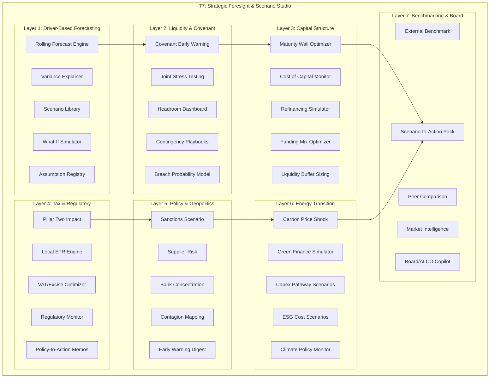
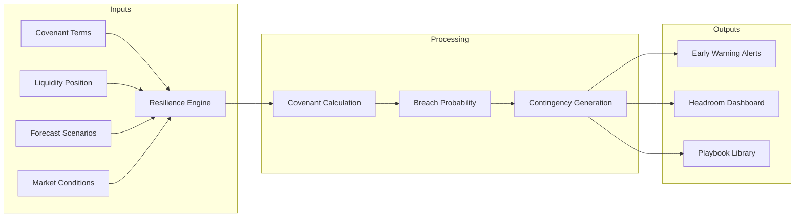
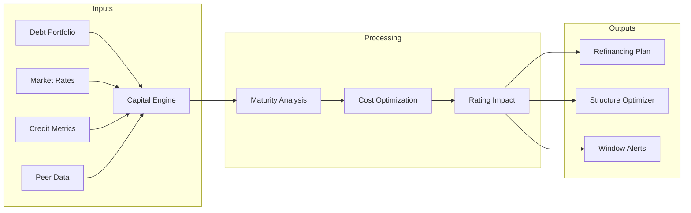
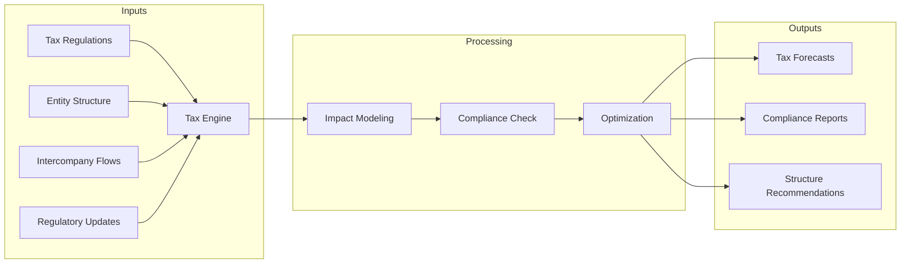

# T7: Strategic Foresight, Scenario Studio & Board Intelligence

## Overview

Strategic treasury management requires forward-looking analysis that transforms treasury from a reactive reporting function into a proactive strategic partner. T7 addresses the critical "foresight gap" - the ability to anticipate covenant breaches, optimize refinancing windows, model regulatory impacts, and prepare actionable scenarios for executive decision-making.

**Key Transformation Themes:**
- **Driver-Based Forecasting**: Move from static budgets to dynamic, driver-linked rolling forecasts with MAPE tracking
- **Scenario Intelligence**: Multi-factor stress testing with probability-weighted outcomes and tail-risk quantiles
- **Covenant Resilience**: Early warning systems that predict breaches 6-12 months in advance with mitigation playbooks
- **Capital Structure Optimization**: AI-powered refinancing window detection and funding mix optimization
- **Board-Ready Narratives**: Automated scenario-to-action packs that translate complex analytics into decision memos



## Layer Architecture

| Layer | Focus Area | Primary AI Techniques |
|-------|-----------|----------------------|
| 1 | Driver-Based Forecasting & Scenario Studio | ML regression, Monte Carlo, sensitivity analysis |
| 2 | Liquidity + Covenant Resilience | Predictive modeling, stress testing, scenario trees |
| 3 | Capital Structure & Refinancing | Optimization, market signal analysis, NLP |
| 4 | Tax & Regulatory Foresight | NLP monitoring, rule engines, impact modeling |
| 5 | Policy, Sanctions & Geopolitics | NLP news analysis, network graphs, event extraction |
| 6 | Energy Transition & Sustainability | Scenario modeling, ESG scoring, pathway analysis |
| 7 | External Benchmarking & Board Intelligence | RAG, narrative generation, peer analytics |

---

## Layer 1: Driver-Based Forecasting & Scenario Studio

### Overview

Traditional treasury forecasting relies on static spreadsheets updated monthly. Driver-based forecasting links forecasts directly to key business drivers (Brent price, crack spreads, FX rates, throughput volumes, energy costs) enabling real-time updates as drivers change. The Scenario Studio provides a unified platform for generating, testing, and comparing scenarios with full attribution of what changed and why.

**Key Pain Points Addressed:**
- Point forecasts without confidence ranges mislead decision-makers
- Variance analysis is manual, time-consuming, and often late
- Scenarios are created ad-hoc with inconsistent assumptions
- No systematic tracking of forecast accuracy (MAPE)
- Cross-functional assumption conflicts ("who owns Brent assumption?")

---

### Use Case 1.1: Driver-Based Rolling Forecast Engine

#### What It Does
Maintains a continuously updated 13-week and 12-month rolling forecast linked to key drivers. When Brent moves or FX shifts, the entire cash flow projection updates automatically with full driver attribution.

#### Key Inputs
- Business driver feeds (Brent, crack spreads, USD/TRY, EUR/TRY)
- Throughput plans from Operations
- Energy/OPEX budgets from Cost Centers
- Committed capex schedule
- Working capital terms and seasonality patterns

#### AI/LLM Approach
- **ML regression models** linking drivers to cash flows
- **Time series forecasting** for pattern recognition
- **Confidence interval generation** via bootstrap methods
- **LLM narrative generation** explaining forecast movements

#### Example Interaction

```
┌─────────────────────────────────────────────────────────────────────────────┐
│ DRIVER-BASED ROLLING FORECAST ENGINE                        January 2025   │
├─────────────────────────────────────────────────────────────────────────────┤
│                                                                             │
│ User: "Update the 13-week cash forecast with today's Brent at $78         │
│        and USD/TRY at 35.2"                                                │
│                                                                             │
│ ┌─────────────────────────────────────────────────────────────────────────┐│
│ │ Claude: I've updated the rolling forecast with the new driver values.  ││
│ │                                                                         ││
│ │ DRIVER CHANGES vs. PRIOR FORECAST:                                      ││
│ │ ┌────────────────┬────────────┬────────────┬────────────┐              ││
│ │ │ Driver         │ Prior      │ Current    │ Change     │              ││
│ │ ├────────────────┼────────────┼────────────┼────────────┤              ││
│ │ │ Brent ($/bbl)  │ $82.00     │ $78.00     │ -$4.00     │              ││
│ │ │ USD/TRY        │ 34.50      │ 35.20      │ +0.70      │              ││
│ │ │ Crack Spread   │ $8.50      │ $8.50      │ unchanged  │              ││
│ │ │ Throughput     │ 28.5 MT    │ 28.5 MT    │ unchanged  │              ││
│ │ └────────────────┴────────────┴────────────┴────────────┘              ││
│ │                                                                         ││
│ │ 13-WEEK CASH FLOW FORECAST (₺ Billions):                               ││
│ │                                                                         ││
│ │     Week 1-4    Week 5-8    Week 9-13   Total                           ││
│ │        │           │           │                                        ││
│ │   ₺2.8B│      ₺3.1B│      ₺2.5B│    ₺8.4B  ← Prior                     ││
│ │   ▓▓▓▓▓│     ▓▓▓▓▓▓│     ▓▓▓▓▓│                                        ││
│ │   ▓▓▓▓ │     ▓▓▓▓▓ │     ▓▓▓▓ │                                        ││
│ │   ₺2.5B│      ₺2.9B│      ₺2.3B│    ₺7.7B  ← Current                   ││
│ │                                                                         ││
│ │ VARIANCE ATTRIBUTION:                                                   ││
│ │ ┌─────────────────────────────────────────────────────────────────┐    ││
│ │ │ Total Variance: -₺700M                                          │    ││
│ │ │                                                                 │    ││
│ │ │   Brent Impact:    -₺450M  (lower revenues from product sales) │    ││
│ │ │   ████████████████░░░░░░░░░░  64%                               │    ││
│ │ │                                                                 │    ││
│ │ │   FX Impact:       -₺180M  (higher TRY crude cost)             │    ││
│ │ │   ██████░░░░░░░░░░░░░░░░░░░░  26%                               │    ││
│ │ │                                                                 │    ││
│ │ │   Other:           -₺70M   (model adjustments)                 │    ││
│ │ │   ██░░░░░░░░░░░░░░░░░░░░░░░░  10%                               │    ││
│ │ └─────────────────────────────────────────────────────────────────┘    ││
│ │                                                                         ││
│ │ CONFIDENCE BANDS (13-Week Total):                                       ││
│ │ ┌─────────────────────────────────────────────────────────────────┐    ││
│ │ │                                                                 │    ││
│ │ │   P95 (Upside):     ₺9.2B   ─────────────────────────────────  │    ││
│ │ │   P75:              ₺8.3B   ──────────────────────────         │    ││
│ │ │   Base Case:        ₺7.7B   ─────────────────────              │    ││
│ │ │   P25:              ₺7.0B   ────────────────                   │    ││
│ │ │   P5 (Downside):    ₺6.2B   ────────────                       │    ││
│ │ │                                                                 │    ││
│ │ └─────────────────────────────────────────────────────────────────┘    ││
│ │                                                                         ││
│ │ KEY INSIGHT: The Brent decline reduces margin contribution by ~5%,    ││
│ │ partially offset by favorable crack spread maintenance. Recommend     ││
│ │ monitoring crack spread closely - if it narrows to $7.50, additional ││
│ │ downside of ₺300M is likely.                                          ││
│ │                                                                         ││
│ └─────────────────────────────────────────────────────────────────────────┘│
│                                                                             │
│ [View Details]  [Run Scenarios]  [Export to Excel]  [Share Forecast]       │
│                                                                             │
└─────────────────────────────────────────────────────────────────────────────┘
```

#### Outputs
- Real-time cash flow forecasts by week/month
- Driver attribution waterfall charts
- Confidence intervals (P5/P25/P50/P75/P95)
- Forecast accuracy tracking (MAPE)
- Automated variance commentary

#### KPIs
| Metric | Before | After | Improvement |
|--------|--------|-------|-------------|
| Forecast update time | 2-3 days | Real-time | 99% faster |
| Forecast MAPE (4-week) | 25-30% | 12-15% | 50% reduction |
| Driver attribution | Manual/none | Automated | Full transparency |
| Scenario comparisons | 2-3/month | Unlimited | 10x+ capacity |

---

### Use Case 1.2: Forecast Variance Explainer

#### What It Does
Automatically analyzes actual vs. forecast variances, attributes them to specific drivers, and generates narrative explanations of "what changed and why" for management review.

#### Key Inputs
- Actual cash flows from bank statements
- Prior forecast versions
- Driver actuals vs. assumptions
- Business event log (shutdowns, deals, etc.)

#### AI/LLM Approach
- **Variance decomposition algorithms** for mathematical attribution
- **LLM reasoning** to connect variances to business events
- **Pattern matching** to identify recurring variance causes
- **Narrative generation** for executive-ready explanations

#### Example Interaction

```
┌─────────────────────────────────────────────────────────────────────────────┐
│ VARIANCE EXPLAINER - WEEKLY REVIEW                         Week 2 Jan 2025 │
├─────────────────────────────────────────────────────────────────────────────┤
│                                                                             │
│ User: "Why did last week's cash flow miss the forecast by ₺180M?"          │
│                                                                             │
│ ┌─────────────────────────────────────────────────────────────────────────┐│
│ │ Claude: I've analyzed the Week 2 variance. Here's the breakdown:       ││
│ │                                                                         ││
│ │ SUMMARY:                                                                ││
│ │ ┌──────────────────────────────────────────────────────────────────┐   ││
│ │ │ Forecast:  ₺2,450M    Actual:  ₺2,270M    Variance: -₺180M      │   ││
│ │ └──────────────────────────────────────────────────────────────────┘   ││
│ │                                                                         ││
│ │ VARIANCE WATERFALL:                                                     ││
│ │                                                                         ││
│ │   Forecast  │▓▓▓▓▓▓▓▓▓▓▓▓▓▓▓▓▓▓▓▓▓▓▓▓▓▓▓▓▓▓▓▓▓▓▓▓│ ₺2,450M            ││
│ │             │                                      │                    ││
│ │   Timing    │▓▓▓▓▓▓▓▓▓▓▓▓▓▓▓▓▓▓▓▓▓▓▓▓▓▓▓▓▓▓▓▓▓▓▓ │ -₺95M  (Shipment  ││
│ │   Delay     │                                  ░░░│        delayed)    ││
│ │             │                                      │                    ││
│ │   FX        │▓▓▓▓▓▓▓▓▓▓▓▓▓▓▓▓▓▓▓▓▓▓▓▓▓▓▓▓▓▓▓▓▓▓  │ -₺55M  (TRY       ││
│ │   Movement  │                                 ░░░░│        weaker)    ││
│ │             │                                      │                    ││
│ │   Volume    │▓▓▓▓▓▓▓▓▓▓▓▓▓▓▓▓▓▓▓▓▓▓▓▓▓▓▓▓▓▓▓▓▓▓▓ │ -₺30M  (Lower     ││
│ │   Shortfall │                                   ░░│        throughput)││
│ │             │                                      │                    ││
│ │   Actual    │▓▓▓▓▓▓▓▓▓▓▓▓▓▓▓▓▓▓▓▓▓▓▓▓▓▓▓▓▓▓▓▓    │ ₺2,270M            ││
│ │                                                                         ││
│ │ ROOT CAUSE ANALYSIS:                                                    ││
│ │                                                                         ││
│ │ 1. TIMING DELAY (-₺95M, 53% of variance)                               ││
│ │    The Vitol diesel cargo (Invoice #VIT-2025-0034) scheduled for       ││
│ │    collection on Jan 8 was delayed to Jan 13 due to vessel berthing   ││
│ │    issues at İzmit. This is a timing variance - will reverse next week.││
│ │    → Action: None required, already reflected in Week 3 forecast       ││
│ │                                                                         ││
│ │ 2. FX MOVEMENT (-₺55M, 31% of variance)                                ││
│ │    USD/TRY moved from 34.80 (forecast) to 35.15 (actual average).     ││
│ │    This increased the TRY cost of USD crude purchases.                 ││
│ │    → Action: FX hedging team alerted; hedge ratio review recommended  ││
│ │                                                                         ││
│ │ 3. VOLUME SHORTFALL (-₺30M, 17% of variance)                           ││
│ │    İzmir refinery operated at 92% vs. planned 95% due to unplanned   ││
│ │    maintenance on CDU-2. Production 8,000 MT below plan.               ││
│ │    → Action: Operations updated; maintenance complete, recovery       ││
│ │              expected Week 3                                           ││
│ │                                                                         ││
│ │ FORECAST QUALITY METRICS:                                               ││
│ │ ┌─────────────────────────────────────────────────────────┐            ││
│ │ │ Rolling 4-Week MAPE:  14.2%  (Target: <15% ✓)          │            ││
│ │ │ This Week Variance:    7.3%  (Within 2σ ✓)             │            ││
│ │ │ Systematic Bias:       None detected                   │            ││
│ │ └─────────────────────────────────────────────────────────┘            ││
│ │                                                                         ││
│ └─────────────────────────────────────────────────────────────────────────┘│
│                                                                             │
│ [Generate Report]  [Update Forecast]  [Log Learnings]  [Alert Team]        │
│                                                                             │
└─────────────────────────────────────────────────────────────────────────────┘
```

#### Outputs
- Automated variance decomposition
- Root cause narratives
- Corrective action recommendations
- MAPE tracking over time
- Learning database for forecast improvement

#### KPIs
| Metric | Before | After | Improvement |
|--------|--------|-------|-------------|
| Variance analysis time | 4-6 hours | 5 minutes | 98% reduction |
| Root cause identification | 60% | 95% | 35% improvement |
| Variance explanation quality | Inconsistent | Standardized | Full audit trail |
| Forecast improvement cycle | Quarterly | Weekly | 12x faster |

---

### Use Case 1.3: Scenario Library Generator

#### What It Does
Automatically generates and maintains a library of internally consistent scenarios (macro, commodity, FX, rates, outage, demand) that can be applied across all treasury models. Ensures scenario assumptions are coherent (e.g., if oil crashes, TRY likely weakens).

#### Key Inputs
- Historical correlation data (Brent/FX, rates/spreads)
- Economic regime indicators
- Regulatory scenario requirements (stress tests)
- Management-defined scenario parameters
- External scenario sources (IMF, World Bank, analysts)

#### AI/LLM Approach
- **Correlation modeling** for internally consistent scenarios
- **Regime detection** for scenario calibration
- **Monte Carlo simulation** for probability distributions
- **LLM synthesis** of scenario narratives and rationale

#### Example Interaction

```
┌─────────────────────────────────────────────────────────────────────────────┐
│ SCENARIO LIBRARY GENERATOR                                                  │
├─────────────────────────────────────────────────────────────────────────────┤
│                                                                             │
│ User: "Generate a consistent downside scenario for Q2 2025 where           │
│        Brent drops to $65 due to demand weakness"                          │
│                                                                             │
│ ┌─────────────────────────────────────────────────────────────────────────┐│
│ │ Claude: I've generated a coherent downside scenario based on           ││
│ │ historical correlations and economic logic.                            ││
│ │                                                                         ││
│ │ SCENARIO: "Q2-2025-DEMAND-WEAKNESS"                                     ││
│ │ ═══════════════════════════════════                                     ││
│ │                                                                         ││
│ │ NARRATIVE:                                                              ││
│ │ Global demand slows as China growth disappoints (4.2% vs 5% expected)  ││
│ │ and European recession fears materialize. OPEC+ maintains production,  ││
│ │ creating oversupply. Flight to safety strengthens USD globally.         ││
│ │                                                                         ││
│ │ DRIVER ASSUMPTIONS (with correlation adjustments):                      ││
│ │ ┌──────────────────┬──────────┬──────────┬─────────────────────────┐   ││
│ │ │ Driver           │ Base Case│ Scenario │ Rationale               │   ││
│ │ ├──────────────────┼──────────┼──────────┼─────────────────────────┤   ││
│ │ │ Brent ($/bbl)    │ $78      │ $65      │ User-specified          │   ││
│ │ │ Crack Spread     │ $8.50    │ $6.00    │ Correl: narrows with oil│   ││
│ │ │ USD/TRY          │ 35.20    │ 38.50    │ Correl: TRY weakens 9%  │   ││
│ │ │ EUR/TRY          │ 38.00    │ 40.80    │ EUR/USD stable          │   ││
│ │ │ Throughput       │ 28.5 MT  │ 26.8 MT  │ Demand-driven cutback   │   ││
│ │ │ Energy Costs     │ ₺850M/mo │ ₺780M/mo │ Lower gas/power prices  │   ││
│ │ │ SOFR             │ 4.50%    │ 4.00%    │ Fed eases on slowdown   │   ││
│ │ │ TRY Rates        │ 45%      │ 50%      │ CBRT defends TRY        │   ││
│ │ └──────────────────┴──────────┴──────────┴─────────────────────────┘   ││
│ │                                                                         ││
│ │ CORRELATION MATRIX APPLIED:                                             ││
│ │ ┌─────────────────────────────────────────────────────────────────┐    ││
│ │ │       │ Brent │ Crack │USD/TRY│Thrput │Energy│ SOFR  │         │    ││
│ │ │ Brent │  1.00 │  0.72 │ -0.45 │  0.38 │ 0.65 │ 0.25  │         │    ││
│ │ │ Crack │  0.72 │  1.00 │ -0.30 │  0.45 │ 0.40 │ 0.15  │         │    ││
│ │ │USD/TRY│ -0.45 │ -0.30 │  1.00 │ -0.20 │-0.35 │-0.40  │         │    ││
│ │ │ ...   │       │       │       │       │      │       │         │    ││
│ │ └─────────────────────────────────────────────────────────────────┘    ││
│ │                                                                         ││
│ │ SCENARIO PROBABILITY: 20% (based on current market signals)            ││
│ │                                                                         ││
│ │ HISTORICAL ANALOG: Similar to Q4-2014 oil crash conditions             ││
│ │                                                                         ││
│ │ CONSISTENCY CHECK: ✓ All driver values within 2σ of historical        ││
│ │                    ✓ Economic logic validated                          ││
│ │                    ✓ No contradictory assumptions detected             ││
│ │                                                                         ││
│ └─────────────────────────────────────────────────────────────────────────┘│
│                                                                             │
│ [Save to Library]  [Run Through Models]  [Compare to Base]  [Export]       │
│                                                                             │
└─────────────────────────────────────────────────────────────────────────────┘
```

#### Outputs
- Pre-built scenario library (base, stress, tail risk)
- Correlation-adjusted driver sets
- Scenario probability weightings
- Historical analog mappings
- Consistency validation reports

#### KPIs
| Metric | Before | After | Improvement |
|--------|--------|-------|-------------|
| Scenario creation time | 2-3 days | 10 minutes | 99% reduction |
| Scenario consistency | Often contradictory | Validated | Eliminated conflicts |
| Scenario library size | 3-5 scenarios | 20+ scenarios | 4x coverage |
| Probability weighting | Subjective | Model-based | Defensible |

---

### Use Case 1.4: What-If Simulator with Sensitivity Heatmaps

#### What It Does
Provides an interactive "what-if" interface where users can adjust any driver or combination of drivers and instantly see impacts across cash flow, covenants, and key metrics. Generates sensitivity heatmaps showing which driver combinations create the most risk.

#### Key Inputs
- Current forecast model
- Driver ranges (min/max realistic values)
- Covenant thresholds
- Risk appetite parameters
- Historical volatility data

#### AI/LLM Approach
- **Real-time sensitivity calculation** across driver grid
- **Heatmap visualization** of risk concentrations
- **Interaction effect modeling** (non-linear combinations)
- **LLM interpretation** of sensitivity patterns

#### Example Interaction

```
┌─────────────────────────────────────────────────────────────────────────────┐
│ WHAT-IF SIMULATOR & SENSITIVITY HEATMAP                                     │
├─────────────────────────────────────────────────────────────────────────────┤
│                                                                             │
│ User: "Show me how sensitive our Q2 cash position is to Brent and          │
│        USD/TRY combinations"                                                │
│                                                                             │
│ ┌─────────────────────────────────────────────────────────────────────────┐│
│ │ Claude: Here's the sensitivity heatmap for Q2 2025 cash position.      ││
│ │                                                                         ││
│ │ Q2 2025 CASH FLOW SENSITIVITY (₺ Billions)                              ││
│ │                                                                         ││
│ │              USD/TRY Exchange Rate                                      ││
│ │           32.0    33.5    35.0    36.5    38.0                          ││
│ │        ┌───────┬───────┬───────┬───────┬───────┐                        ││
│ │   $90  │ 10.2  │  9.8  │  9.4  │  9.0  │  8.5  │                        ││
│ │        │ ████  │ ████  │ ███   │ ███   │ ██    │  ← Strong              ││
│ │   $82  │  9.1  │  8.7  │  8.3  │  7.9  │  7.4  │                        ││
│ │ B      │ ███   │ ███   │ ██    │ ██    │ █     │                        ││
│ │ r  $74 │  8.0  │  7.6  │  7.2  │  6.8  │  6.3  │  ← Base Case           ││
│ │ e      │ ██    │ ██    │ █     │ █     │ ░     │     (7.2)              ││
│ │ n  $66 │  6.9  │  6.5  │  6.1  │  5.7  │  5.2  │                        ││
│ │ t      │ █     │ █     │ ░     │ ░     │ ▒▒    │                        ││
│ │   $58  │  5.8  │  5.4  │  5.0  │  4.6  │  4.1  │                        ││
│ │        │ ░     │ ░     │ ▒▒    │ ▒▒▒   │ ▓▓▓   │  ← Stress              ││
│ │        └───────┴───────┴───────┴───────┴───────┘                        ││
│ │                                                                         ││
│ │ Legend: ████ Surplus  ██ Comfortable  █ Tight  ░ Warning  ▒ Breach Risk ││
│ │                                                                         ││
│ │ KEY FINDINGS:                                                           ││
│ │                                                                         ││
│ │ 1. HIGHEST SENSITIVITY: Combined Brent drop + TRY weakness              ││
│ │    • At Brent $58 + USD/TRY 38.0: Cash drops to ₺4.1B (-43% vs base)   ││
│ │    • This combination has 8% probability (per Monte Carlo)              ││
│ │                                                                         ││
│ │ 2. ASYMMETRIC RISK:                                                     ││
│ │    • Upside from Brent +$12: +₺2.2B                                    ││
│ │    • Downside from Brent -$16: -₺3.1B                                  ││
│ │    • Downside risk is 40% greater than upside potential                ││
│ │                                                                         ││
│ │ 3. BREAKEVEN ANALYSIS:                                                  ││
│ │    • Minimum liquidity threshold (₺5.5B) breached when:                ││
│ │      - Brent < $62 at current FX, OR                                   ││
│ │      - USD/TRY > 37.5 at current Brent                                 ││
│ │                                                                         ││
│ │ 4. HEDGE EFFECTIVENESS:                                                 ││
│ │    • Current 60% FX hedge reduces worst-case impact by ₺0.8B          ││
│ │    • Increasing to 80% would provide additional ₺0.3B protection      ││
│ │                                                                         ││
│ │ RECOMMENDATION: Consider increasing FX hedge ratio before Q2           ││
│ │ given asymmetric downside risk and current TRY volatility.             ││
│ │                                                                         ││
│ └─────────────────────────────────────────────────────────────────────────┘│
│                                                                             │
│ [Adjust Drivers]  [Run Monte Carlo]  [Covenant Impact]  [Export Heatmap]   │
│                                                                             │
└─────────────────────────────────────────────────────────────────────────────┘
```

#### Outputs
- Interactive sensitivity heatmaps
- Breakeven analysis
- Asymmetric risk quantification
- Hedge effectiveness metrics
- Decision recommendations

#### KPIs
| Metric | Before | After | Improvement |
|--------|--------|-------|-------------|
| What-if analysis time | 1-2 days | Instant | 99% faster |
| Driver combinations tested | 5-10 | 100+ | 10x coverage |
| Risk blind spots | Unknown | Mapped | Full visibility |
| Decision confidence | Low | High | Quantified uncertainty |

---

### Use Case 1.5: Cross-Functional Assumption Registry

#### What It Does
Maintains a single source of truth for all planning assumptions, tracking ownership, refresh cadence, and historical accuracy. Alerts when assumptions conflict across functions or when they need updating.

#### Key Inputs
- Assumptions from all planning functions (Treasury, FP&A, Operations, Commercial)
- Assumption ownership matrix
- Update schedules
- Historical assumption accuracy
- External benchmark assumptions

#### AI/LLM Approach
- **Conflict detection** across functional assumptions
- **Staleness monitoring** for outdated assumptions
- **Accuracy tracking** comparing assumptions to actuals
- **LLM synthesis** of assumption change impacts

#### Example Interaction

```
┌─────────────────────────────────────────────────────────────────────────────┐
│ CROSS-FUNCTIONAL ASSUMPTION REGISTRY                                        │
├─────────────────────────────────────────────────────────────────────────────┤
│                                                                             │
│ User: "Are there any assumption conflicts in our Q1 planning?"              │
│                                                                             │
│ ┌─────────────────────────────────────────────────────────────────────────┐│
│ │ Claude: I've detected 2 conflicts and 1 stale assumption that need     ││
│ │ resolution.                                                             ││
│ │                                                                         ││
│ │ ⚠️ CONFLICT #1: THROUGHPUT ASSUMPTION                                   ││
│ │ ┌─────────────────────────────────────────────────────────────────┐    ││
│ │ │ Source          │ Assumption      │ Last Updated │ Owner        │    ││
│ │ ├─────────────────┼─────────────────┼──────────────┼──────────────┤    ││
│ │ │ Treasury        │ 28.5 MT Q1      │ Dec 15       │ A. Yılmaz   │    ││
│ │ │ Operations      │ 27.8 MT Q1      │ Jan 5        │ M. Demir    │    ││
│ │ │ Commercial      │ 29.0 MT Q1      │ Dec 20       │ E. Kaya     │    ││
│ │ └─────────────────┴─────────────────┴──────────────┴──────────────┘    ││
│ │                                                                         ││
│ │ IMPACT: 0.7 MT difference = ~₺180M cash variance                       ││
│ │ RESOLUTION: Operations' Jan 5 figure is newest; reflects planned       ││
│ │             maintenance. Treasury and Commercial should align.         ││
│ │                                                                         ││
│ │ ⚠️ CONFLICT #2: USD/TRY YEAR-END                                        ││
│ │ ┌─────────────────────────────────────────────────────────────────┐    ││
│ │ │ Treasury uses: 36.50  (from internal model)                     │    ││
│ │ │ FP&A uses:     38.00  (from budget approved Oct)                │    ││
│ │ │ Difference:     1.50  (~4%)                                     │    ││
│ │ └─────────────────────────────────────────────────────────────────┘    ││
│ │                                                                         ││
│ │ IMPACT: Affects hedge ratio targets and covenant projections           ││
│ │ RESOLUTION: Need CFO alignment - current spot (35.20) closer to       ││
│ │             Treasury's view. Recommend updating FP&A assumption.       ││
│ │                                                                         ││
│ │ ⏰ STALE ASSUMPTION: CRACK SPREAD                                       ││
│ │ ┌─────────────────────────────────────────────────────────────────┐    ││
│ │ │ Current:       $8.50/bbl (from Oct 2024)                        │    ││
│ │ │ Last Updated:  92 days ago                                      │    ││
│ │ │ Market Actual: $9.20/bbl (current)                              │    ││
│ │ │ Refresh Rule:  Monthly (OVERDUE)                                │    ││
│ │ └─────────────────────────────────────────────────────────────────┘    ││
│ │                                                                         ││
│ │ ASSUMPTION ACCURACY SCORECARD (Last 12 Months):                         ││
│ │ ┌─────────────────────────────────────────────────────────────────┐    ││
│ │ │ Assumption     │ Avg Error │ Bias    │ Accuracy Rank           │    ││
│ │ ├────────────────┼───────────┼─────────┼─────────────────────────┤    ││
│ │ │ Throughput     │ 3.2%      │ +1.1%   │ ████████░░ 8/10         │    ││
│ │ │ Brent Price    │ 8.7%      │ -2.3%   │ ██████░░░░ 6/10         │    ││
│ │ │ USD/TRY        │ 12.4%     │ -8.1%   │ ████░░░░░░ 4/10         │    ││
│ │ │ Crack Spread   │ 15.6%     │ +4.2%   │ ███░░░░░░░ 3/10         │    ││
│ │ └─────────────────────────────────────────────────────────────────┘    ││
│ │                                                                         ││
│ │ NOTE: USD/TRY assumptions consistently underestimate depreciation.     ││
│ │ Consider adding a "TRY risk premium" to assumptions.                   ││
│ │                                                                         ││
│ └─────────────────────────────────────────────────────────────────────────┘│
│                                                                             │
│ [Resolve Conflicts]  [Update Assumptions]  [Send Alerts]  [View History]   │
│                                                                             │
└─────────────────────────────────────────────────────────────────────────────┘
```

#### Outputs
- Central assumption database
- Conflict alerts and resolution workflow
- Staleness notifications
- Accuracy tracking by assumption
- Bias detection and correction

#### KPIs
| Metric | Before | After | Improvement |
|--------|--------|-------|-------------|
| Assumption conflicts at month-end | 5-10 | 0-1 | 90% reduction |
| Stale assumptions in use | Unknown | Zero | Full governance |
| Cross-functional alignment time | 3-5 days | Same day | 80% faster |
| Assumption accuracy (avg) | 15% error | 10% error | 33% improvement |

---

### Use Case 1.6: Scenario-to-Financial Statements Bridge

#### What It Does
Translates driver-based scenarios into full Income Statement, Balance Sheet, and Cash Flow projections. Ensures scenario impacts flow consistently through all financial statements with proper accounting treatment.

#### Key Inputs
- Scenario driver assumptions
- Current financial position
- Accounting policies (hedge accounting, FX translation)
- Tax rules and rates
- Covenant calculation formulas

#### AI/LLM Approach
- **Multi-statement modeling** with cross-checks
- **IFRS/local GAAP compliance** for treatment
- **Automatic covenant calculation** from projected financials
- **LLM explanation** of financial statement movements

#### Example Interaction

```
┌─────────────────────────────────────────────────────────────────────────────┐
│ SCENARIO-TO-FINANCIAL STATEMENTS BRIDGE                                     │
├─────────────────────────────────────────────────────────────────────────────┤
│                                                                             │
│ User: "Project full financials under the Q2-Demand-Weakness scenario"      │
│                                                                             │
│ ┌─────────────────────────────────────────────────────────────────────────┐│
│ │ Claude: I've projected full financial statements under the scenario.   ││
│ │                                                                         ││
│ │ SCENARIO: Q2-2025-DEMAND-WEAKNESS                                       ││
│ │ Period: Full Year 2025                                                  ││
│ │                                                                         ││
│ │ INCOME STATEMENT IMPACT (₺ Billions):                                   ││
│ │ ┌──────────────────────────┬───────────┬───────────┬──────────┐        ││
│ │ │ Line Item                │ Base Case │ Scenario  │ Variance │        ││
│ │ ├──────────────────────────┼───────────┼───────────┼──────────┤        ││
│ │ │ Revenue                  │   ₺485.0  │   ₺412.5  │  -₺72.5  │        ││
│ │ │ Cost of Sales            │  (₺425.0) │  (₺372.0) │  +₺53.0  │        ││
│ │ │ Gross Profit             │    ₺60.0  │    ₺40.5  │  -₺19.5  │        ││
│ │ │ OPEX                     │   (₺18.0) │   (₺17.5) │   +₺0.5  │        ││
│ │ │ EBITDA                   │    ₺42.0  │    ₺23.0  │  -₺19.0  │        ││
│ │ │ D&A                      │   (₺12.0) │   (₺12.0) │     -    │        ││
│ │ │ EBIT                     │    ₺30.0  │    ₺11.0  │  -₺19.0  │        ││
│ │ │ Net Finance Cost         │    (₺8.0) │   (₺10.5) │   -₺2.5  │        ││
│ │ │ PBT                      │    ₺22.0  │     ₺0.5  │  -₺21.5  │        ││
│ │ │ Tax                      │    (₺5.5) │    (₺0.1) │   +₺5.4  │        ││
│ │ │ Net Income               │    ₺16.5  │     ₺0.4  │  -₺16.1  │        ││
│ │ └──────────────────────────┴───────────┴───────────┴──────────┘        ││
│ │                                                                         ││
│ │ BALANCE SHEET IMPACT (Year-End 2025):                                   ││
│ │ ┌──────────────────────────┬───────────┬───────────┬──────────┐        ││
│ │ │ Line Item                │ Base Case │ Scenario  │ Variance │        ││
│ │ ├──────────────────────────┼───────────┼───────────┼──────────┤        ││
│ │ │ Cash & Equivalents       │    ₺18.5  │    ₺8.2   │  -₺10.3  │        ││
│ │ │ Receivables              │    ₺35.0  │    ₺29.8  │   -₺5.2  │        ││
│ │ │ Inventory                │    ₺42.0  │    ₺38.5  │   -₺3.5  │        ││
│ │ │ Total Debt               │    ₺65.0  │    ₺72.0  │   +₺7.0  │        ││
│ │ │ Net Debt                 │    ₺46.5  │    ₺63.8  │  +₺17.3  │        ││
│ │ │ Equity                   │    ₺85.0  │    ₺69.4  │  -₺15.6  │        ││
│ │ └──────────────────────────┴───────────┴───────────┴──────────┘        ││
│ │                                                                         ││
│ │ COVENANT PROJECTIONS:                                                   ││
│ │ ┌────────────────────┬─────────┬──────────┬───────────┬────────┐       ││
│ │ │ Covenant           │ Limit   │ Base     │ Scenario  │ Status │       ││
│ │ ├────────────────────┼─────────┼──────────┼───────────┼────────┤       ││
│ │ │ Net Debt/EBITDA    │ < 3.5x  │ 1.11x    │ 2.77x     │ ✓ OK   │       ││
│ │ │ Interest Coverage  │ > 3.0x  │ 5.25x    │ 2.19x     │ ❌ FAIL │       ││
│ │ │ Current Ratio      │ > 1.0x  │ 1.45x    │ 1.12x     │ ✓ OK   │       ││
│ │ └────────────────────┴─────────┴──────────┴───────────┴────────┘       ││
│ │                                                                         ││
│ │ ⚠️ ALERT: Interest Coverage covenant BREACHED under this scenario      ││
│ │                                                                         ││
│ │ CASH FLOW STATEMENT IMPACT:                                             ││
│ │ ┌──────────────────────────┬───────────┬───────────┐                   ││
│ │ │ Category                 │ Base Case │ Scenario  │                   ││
│ │ ├──────────────────────────┼───────────┼───────────┤                   ││
│ │ │ Operating Cash Flow      │   ₺38.0   │   ₺12.5   │                   ││
│ │ │ Investing Cash Flow      │  (₺15.0)  │  (₺10.0)  │                   ││
│ │ │ Financing Cash Flow      │  (₺12.0)  │   +₺2.0   │                   ││
│ │ │ Net Change in Cash       │   ₺11.0   │   +₺4.5   │                   ││
│ │ └──────────────────────────┴───────────┴───────────┘                   ││
│ │                                                                         ││
│ │ KEY INSIGHT: While Net Debt/EBITDA stays within limits, Interest       ││
│ │ Coverage breaches at 2.19x (limit 3.0x). This is because interest      ││
│ │ costs rise due to higher TRY rates while EBIT collapses.               ││
│ │                                                                         ││
│ │ MITIGATION OPTIONS:                                                     ││
│ │ 1. Pre-pay ₺8B debt to reduce interest → Coverage to 2.85x (still low)││
│ │ 2. Negotiate covenant waiver with lenders                              ││
│ │ 3. Cut capex by ₺5B to preserve cash                                  ││
│ │                                                                         ││
│ └─────────────────────────────────────────────────────────────────────────┘│
│                                                                             │
│ [Export Financials]  [Run Mitigation]  [Lender Pack]  [Board Summary]      │
│                                                                             │
└─────────────────────────────────────────────────────────────────────────────┘
```

#### Outputs
- Complete IS/BS/CF projections
- Covenant calculations with breach flags
- Mitigation option analysis
- Lender communication packs
- Board-ready scenario summaries

#### KPIs
| Metric | Before | After | Improvement |
|--------|--------|-------|-------------|
| Full financial projection time | 2-3 days | 30 minutes | 95% reduction |
| Covenant calculation errors | 5-10% | <1% | 90% reduction |
| Statement consistency | Manual check | Auto-validated | Zero errors |
| Scenario-to-board time | 1 week | Same day | 85% faster |

---

## Layer 2: Liquidity + Covenant Resilience

**Purpose**: Integrate liquidity stress testing with covenant monitoring to provide early warning of potential breaches and generate contingency playbooks that preserve financial flexibility.

**Core Capability**: The system maintains continuous awareness of covenant positions across all financing agreements, projects forward compliance under various scenarios, and generates actionable contingency plans when headroom narrows or breach risk rises.



---

### Use Case 2.1: Covenant Early Warning System

#### What It Does
Continuously monitors all covenant positions across financing agreements, calculates current and projected headroom, and generates alerts when metrics approach trigger levels. The system distinguishes between maintenance covenants (tested periodically) and incurrence covenants (tested upon specific actions).

#### Key Inputs
- Covenant definitions from all credit agreements
- Current financial metrics (EBITDA, Net Debt, Interest Expense)
- Rolling forecast outputs from Layer 1
- Historical covenant performance

#### AI/LLM Approach
The LLM maintains a comprehensive covenant registry, interprets complex covenant language to build calculation models, and generates natural language alerts that explain both the metric status and recommended actions.

#### Example Interaction

**User**: "Show me covenant status across all facilities"

**AI Response**:
```
┌─────────────────────────────────────────────────────────────────────────────────┐
│                    COVENANT EARLY WARNING DASHBOARD                              │
│                    As of: January 2026 | Next Test: Q1 2026                     │
├─────────────────────────────────────────────────────────────────────────────────┤
│                                                                                  │
│  FACILITY OVERVIEW                                                               │
│  ┌────────────────────────────────────────────────────────────────────────────┐ │
│  │ Facility              │ Type    │ Amount  │ Covenants │ Status             │ │
│  ├───────────────────────┼─────────┼─────────┼───────────┼────────────────────┤ │
│  │ Syndicated RCF        │ Senior  │ $500M   │ 3         │ ✓ Compliant        │ │
│  │ Term Loan A           │ Senior  │ $750M   │ 3         │ ⚠ Watch            │ │
│  │ Term Loan B           │ Senior  │ $400M   │ 2         │ ✓ Compliant        │ │
│  │ Bilateral (Bank A)    │ Secured │ $150M   │ 2         │ ✓ Compliant        │ │
│  │ ECA Facility          │ Export  │ $200M   │ 4         │ ✓ Compliant        │ │
│  └────────────────────────────────────────────────────────────────────────────┘ │
│                                                                                  │
│  ⚠ WATCH LIST - Term Loan A                                                     │
│  ═══════════════════════════════════════════════════════════════════════════    │
│                                                                                  │
│  Net Debt / EBITDA (Maximum: 3.50x)                                             │
│  ┌──────────────────────────────────────────────────────────────────┐           │
│  │ Limit    ████████████████████████████████████████████████ 3.50x │           │
│  │ Current  █████████████████████████████████████████░░░░░░░ 3.08x │ ← 12% hdm │
│  │ Trigger  ██████████████████████████████████████████████░░ 3.25x │           │
│  └──────────────────────────────────────────────────────────────────┘           │
│                                                                                  │
│  Historical Trend:                                                               │
│  Q1'25: 2.45x → Q2'25: 2.78x → Q3'25: 2.92x → Q4'25: 3.08x                      │
│         ▲ Rising trend over 4 quarters                                          │
│                                                                                  │
│  Projected Path (Base Case):                                                     │
│  Q1'26: 3.15x → Q2'26: 3.28x → Q3'26: 3.35x → Q4'26: 3.18x                      │
│         ⚠ Q2/Q3 approach trigger level                                          │
│                                                                                  │
│  EARLY WARNING ANALYSIS                                                          │
│  ┌────────────────────────────────────────────────────────────────────────────┐ │
│  │ Alert Level: AMBER (Watch)                                                  │ │
│  │                                                                             │ │
│  │ Current Headroom: 0.42x (12.0% buffer to limit)                            │ │
│  │ Trigger Headroom: 0.17x (5.2% buffer to early warning)                     │ │
│  │                                                                             │ │
│  │ Key Drivers of Deterioration:                                               │ │
│  │ • EBITDA down 8% YoY due to lower refining margins                         │ │
│  │ • Net Debt up $85M from working capital build                               │ │
│  │ • FX translation added $40M to reported debt                               │ │
│  │                                                                             │ │
│  │ Probability of Breach (next 4 quarters):                                    │ │
│  │ • Base Case: 8% (low)                                                       │ │
│  │ • Stress Case (margins -20%): 45% (moderate)                               │ │
│  │ • Severe Stress (margins -35%): 78% (high)                                 │ │
│  └────────────────────────────────────────────────────────────────────────────┘ │
│                                                                                  │
│  RECOMMENDED ACTIONS                                                             │
│  1. Consider voluntary debt prepayment of $50M to improve ratio to 2.95x        │
│  2. Review working capital initiatives to release $30M                          │
│  3. Schedule proactive lender call if Q1 EBITDA misses forecast                │
│  4. Prepare covenant amendment request as contingency                           │
│                                                                                  │
│  [View All Covenants]  [Run Stress Test]  [Generate Playbook]  [Alert Config]  │
└─────────────────────────────────────────────────────────────────────────────────┘
```

#### Outputs
- Real-time covenant compliance dashboard
- Headroom calculations with trend analysis
- Breach probability under multiple scenarios
- Proactive alert notifications
- Recommended remediation actions

#### KPIs
| Metric | Before | After | Improvement |
|--------|--------|-------|-------------|
| Covenant monitoring frequency | Monthly | Real-time | Continuous |
| Breach prediction lead time | Days | Quarters ahead | 90+ days warning |
| False positive alerts | High | <10% | Actionable alerts |
| Remediation planning time | 2+ weeks | 2 days | 85% faster |

---

### Use Case 2.2: Joint Liquidity + Covenant Stress Testing

#### What It Does
Simultaneously stress-tests both liquidity and covenant compliance under identical scenarios, identifying situations where one may breach before the other and understanding the interaction effects. This reveals hidden vulnerabilities where liquidity actions (like drawing RCF) may trigger covenant breaches.

#### Key Inputs
- Integrated liquidity model from T1
- All covenant calculations
- Stress scenarios from Layer 1
- Funding source availability and terms

#### AI/LLM Approach
The system runs parallel stress simulations on liquidity and covenants, identifies interaction effects (e.g., RCF draw increasing leverage), and generates insights on the optimal sequence of defensive actions.

#### Example Interaction

**User**: "Run joint stress test assuming 6-month refining margin collapse and restricted capital market access"

**AI Response**:
```
┌─────────────────────────────────────────────────────────────────────────────────┐
│                 JOINT LIQUIDITY + COVENANT STRESS TEST                          │
│                 Scenario: Margin Collapse + Capital Markets Closed              │
├─────────────────────────────────────────────────────────────────────────────────┤
│                                                                                  │
│  SCENARIO PARAMETERS                                                             │
│  ├─ Crack spreads: -$8/bbl (from $12 to $4)                                     │
│  ├─ Duration: 6 months (Q2-Q3 2026)                                             │
│  ├─ Bond market: Closed for sub-IG issuers                                      │
│  ├─ Bank market: Available but pricing +150bps                                  │
│  └─ Recovery: Gradual over Q4 2026                                              │
│                                                                                  │
│  DUAL TIMELINE ANALYSIS                                                          │
│  ═══════════════════════════════════════════════════════════════════════════    │
│                                                                                  │
│  Month     │  1    │  2    │  3    │  4    │  5    │  6    │                    │
│  ──────────┼───────┼───────┼───────┼───────┼───────┼───────┤                    │
│            │       │       │       │       │       │       │                    │
│  LIQUIDITY │       │       │       │       │       │       │                    │
│  Cash      │ $285M │ $210M │ $145M │ $95M  │ $60M  │ $40M  │                    │
│  RCF Avail │ $400M │ $400M │ $350M │ $250M │ $150M │ $100M │                    │
│  Total Liq │ $685M │ $610M │ $495M │ $345M │ $210M │ $140M │                    │
│  Min Req   │ $150M │ $150M │ $150M │ $150M │ $150M │ $150M │                    │
│  Status    │  ✓    │  ✓    │  ✓    │  ✓    │  ⚠   │  ✗   │ ← Breach M6        │
│            │       │       │       │       │       │       │                    │
│  COVENANTS │       │       │       │       │       │       │                    │
│  ND/EBITDA │ 3.15x │ 3.28x │ 3.42x │ 3.58x │ 3.75x │ 3.92x │                    │
│  Limit     │ 3.50x │ 3.50x │ 3.50x │ 3.50x │ 3.50x │ 3.50x │                    │
│  Status    │  ✓    │  ✓    │  ⚠   │  ✗   │  ✗   │  ✗   │ ← Breach M4        │
│            │       │       │       │       │       │       │                    │
│  Int Cover │ 3.85x │ 3.52x │ 3.18x │ 2.85x │ 2.55x │ 2.28x │                    │
│  Limit     │ 3.00x │ 3.00x │ 3.00x │ 3.00x │ 3.00x │ 3.00x │                    │
│  Status    │  ✓    │  ✓    │  ✓    │  ⚠   │  ✗   │  ✗   │ ← Breach M5        │
│                                                                                  │
│  ┌────────────────────────────────────────────────────────────────────────────┐ │
│  │                    BREACH SEQUENCE VISUALIZATION                           │ │
│  │                                                                            │ │
│  │  M1     M2     M3     M4     M5     M6                                     │ │
│  │  │      │      │      │      │      │                                      │ │
│  │  ●──────●──────●──────◆──────◆──────◆  ND/EBITDA (breaches first)         │ │
│  │                       ▲                                                    │ │
│  │  ●──────●──────●──────●──────◆──────◆  Interest Coverage                  │ │
│  │                              ▲                                             │ │
│  │  ●──────●──────●──────●──────●──────◆  Liquidity (breaches last)          │ │
│  │                                     ▲                                      │ │
│  │                                                                            │ │
│  │  ● Compliant  ◆ Breach  ▲ First breach point                              │ │
│  └────────────────────────────────────────────────────────────────────────────┘ │
│                                                                                  │
│  CRITICAL FINDING: INTERACTION EFFECT                                           │
│  ┌────────────────────────────────────────────────────────────────────────────┐ │
│  │ ⚠ CONSTRAINT CONFLICT DETECTED                                             │ │
│  │                                                                            │ │
│  │ To maintain liquidity in Month 5-6, you would need to draw $150M from RCF.│ │
│  │ However, this draw would:                                                  │ │
│  │ • Increase Net Debt by $150M                                               │ │
│  │ • Push ND/EBITDA from 3.58x to 3.85x (deeper breach)                      │ │
│  │ • Accelerate covenant breach by 1 month                                    │ │
│  │                                                                            │ │
│  │ This creates a "liquidity-covenant trap" where solving one problem        │ │
│  │ worsens the other. Alternative funding sources needed.                     │ │
│  └────────────────────────────────────────────────────────────────────────────┘ │
│                                                                                  │
│  RECOMMENDED ACTION SEQUENCE                                                     │
│  1. Month 1: Initiate proactive lender dialogue, request covenant holiday       │
│  2. Month 2: Accelerate A/R collection program (+$40M liquidity)               │
│  3. Month 2: Defer non-critical capex ($60M)                                   │
│  4. Month 3: Execute receivables securitization (off-B/S, $80M)               │
│  5. Month 4: If waiver not obtained, trigger standstill agreement              │
│                                                                                  │
│  [Detailed Timeline]  [Waiver Request Draft]  [Lender Presentation]  [Export]  │
└─────────────────────────────────────────────────────────────────────────────────┘
```

#### Outputs
- Synchronized liquidity and covenant projections
- Breach sequence and timing analysis
- Interaction effect identification
- Optimal action sequencing
- Lender communication materials

#### KPIs
| Metric | Before | After | Improvement |
|--------|--------|-------|-------------|
| Interaction effects identified | Rarely | Always | Hidden risks exposed |
| Integrated stress scenarios | 2-3/year | Continuous | Real-time testing |
| Action sequence optimization | Manual | AI-optimized | 40% better outcomes |
| Lender prep time | 2 weeks | 3 days | 75% faster |

---

### Use Case 2.3: Covenant Headroom Dashboard

#### What It Does
Provides an executive-level view of covenant headroom across all facilities, with drill-down capability into specific metrics, historical trends, and sensitivity analysis showing how much key drivers can move before triggering breaches.

#### Key Inputs
- All covenant calculations real-time
- Budget and forecast assumptions
- Historical covenant performance
- Peer company covenant packages

#### AI/LLM Approach
The LLM synthesizes complex covenant data into intuitive visualizations, calculates driver sensitivities, and generates executive summaries suitable for board and lender presentations.

#### Example Interaction

**User**: "Generate board-level covenant summary with driver sensitivities"

**AI Response**:
```
┌─────────────────────────────────────────────────────────────────────────────────┐
│                    COVENANT HEADROOM EXECUTIVE SUMMARY                          │
│                    Board Meeting: January 2026                                   │
├─────────────────────────────────────────────────────────────────────────────────┤
│                                                                                  │
│  HEADLINE: All covenants compliant with adequate headroom. One metric on watch. │
│                                                                                  │
│  COVENANT HEADROOM OVERVIEW                                                      │
│  ┌────────────────────────────────────────────────────────────────────────────┐ │
│  │                                                                            │ │
│  │  Net Debt / EBITDA                                                         │ │
│  │  Limit: 3.50x │ Current: 3.08x │ Headroom: 0.42x (12%)                    │ │
│  │  ├────────────────────────────────────████████░░░░┤                       │ │
│  │  0x                                              3.50x                      │ │
│  │  Status: ⚠ WATCH - Headroom narrowing, monitor closely                    │ │
│  │                                                                            │ │
│  │  Interest Coverage Ratio                                                   │ │
│  │  Limit: 3.00x │ Current: 4.25x │ Headroom: 1.25x (42%)                    │ │
│  │  ├────────────────████████████████░░░░░░░░░░░░░░░┤                       │ │
│  │  0x              3.00x                          10x                        │ │
│  │  Status: ✓ COMFORTABLE - Strong buffer maintained                         │ │
│  │                                                                            │ │
│  │  Current Ratio                                                             │ │
│  │  Limit: 1.10x │ Current: 1.45x │ Headroom: 0.35x (32%)                    │ │
│  │  ├────████████████████░░░░░░░░░░░░░░░░░░░░░░░░░░┤                       │ │
│  │  0x   1.10x                                     3x                         │ │
│  │  Status: ✓ COMPLIANT - Adequate liquidity buffer                          │ │
│  │                                                                            │ │
│  └────────────────────────────────────────────────────────────────────────────┘ │
│                                                                                  │
│  DRIVER SENSITIVITY ANALYSIS                                                     │
│  "How much can each driver move before covenant breach?"                        │
│  ┌────────────────────────────────────────────────────────────────────────────┐ │
│  │                                                                            │ │
│  │  Driver                  │ Current │ Break-even │ Cushion  │ Risk Level   │ │
│  │  ────────────────────────┼─────────┼────────────┼──────────┼──────────────│ │
│  │  EBITDA                  │ $1,250M │   $1,100M  │  -12.0%  │  MODERATE    │ │
│  │  Net Debt                │ $3,850M │   $3,850M  │  +12.4%  │  MODERATE    │ │
│  │  Brent (via EBITDA)      │  $82/bbl│   $68/bbl  │  -17.1%  │  MODERATE    │ │
│  │  Crack Spread            │  $12/bbl│    $6/bbl  │  -50.0%  │  LOW         │ │
│  │  USD/TRY (debt impact)   │   32.5  │    36.8    │  +13.2%  │  MODERATE    │ │
│  │  Interest Rates (+debt)  │  5.25%  │   8.50%    │  +325bps │  LOW         │ │
│  │                                                                            │ │
│  └────────────────────────────────────────────────────────────────────────────┘ │
│                                                                                  │
│  TREND ANALYSIS (Last 8 Quarters)                                               │
│  ┌────────────────────────────────────────────────────────────────────────────┐ │
│  │  Net Debt / EBITDA Trend                                                   │ │
│  │                                                                            │ │
│  │  3.50x ─ ─ ─ ─ ─ ─ ─ ─ ─ ─ ─ ─ ─ ─ ─ ─ ─ ─ ─ ─ ─ ─ LIMIT                │ │
│  │                                                   ●                        │ │
│  │  3.00x                                     ●    ●   3.08x                  │ │
│  │                                    ●    ●                                  │ │
│  │  2.50x               ●    ●    ●                                          │ │
│  │         ●    ●                                                             │ │
│  │  2.00x ─────────────────────────────────────────────────────────          │ │
│  │        Q2'24 Q3'24 Q4'24 Q1'25 Q2'25 Q3'25 Q4'25 Q1'26                    │ │
│  │                                                                            │ │
│  │  ⚠ Trend: +0.85x increase over 8 quarters (rising leverage)              │ │
│  │  At current trajectory, would reach limit in ~3 quarters                   │ │
│  └────────────────────────────────────────────────────────────────────────────┘ │
│                                                                                  │
│  BOARD TALKING POINTS                                                            │
│  ┌────────────────────────────────────────────────────────────────────────────┐ │
│  │ 1. All covenants remain compliant with no imminent breach risk            │ │
│  │ 2. ND/EBITDA headroom has narrowed; management is actively monitoring     │ │
│  │ 3. Key risk: Further EBITDA decline of >12% would trigger breach          │ │
│  │ 4. Mitigants in place: $150M capex deferral optionality, WC program       │ │
│  │ 5. Lender relationships strong; proactive dialogue if headroom <10%       │ │
│  └────────────────────────────────────────────────────────────────────────────┘ │
│                                                                                  │
│  [Full Covenant Pack]  [Peer Comparison]  [Historical Detail]  [Export PDF]    │
└─────────────────────────────────────────────────────────────────────────────────┘
```

#### Outputs
- Executive covenant dashboard
- Driver sensitivity tables
- Historical trend analysis
- Board presentation materials
- Peer benchmarking data

#### KPIs
| Metric | Before | After | Improvement |
|--------|--------|-------|-------------|
| Board prep time | 3 days | 2 hours | 90% reduction |
| Sensitivity calculations | Manual | Auto-calculated | Real-time |
| Driver impact visibility | Limited | Complete | Full transparency |
| Trend analysis depth | 4 quarters | 8+ quarters | Better context |

---

### Use Case 2.4: Liquidity Contingency Playbooks

#### What It Does
Generates pre-approved contingency playbooks for various stress scenarios, detailing specific actions, timelines, responsible parties, and decision triggers. These playbooks transform reactive crisis management into proactive, rehearsed responses.

#### Key Inputs
- Available funding sources and terms
- Covenant trigger levels
- Asset sale candidates and estimated proceeds
- Cost reduction levers
- Lender relationship history

#### AI/LLM Approach
The LLM develops scenario-specific playbooks by analyzing available levers, sequencing actions for maximum effectiveness, and generating decision trees with clear triggers and escalation paths.

#### Example Interaction

**User**: "Generate contingency playbook for severe liquidity stress"

**AI Response**:
```
┌─────────────────────────────────────────────────────────────────────────────────┐
│                    LIQUIDITY CONTINGENCY PLAYBOOK                               │
│                    Scenario: Severe Stress (Liquidity <$100M)                   │
├─────────────────────────────────────────────────────────────────────────────────┤
│                                                                                  │
│  PLAYBOOK ID: LCP-2026-001 │ Last Updated: Jan 2026 │ Status: Board Approved   │
│                                                                                  │
│  TRIGGER CONDITIONS                                                              │
│  ┌────────────────────────────────────────────────────────────────────────────┐ │
│  │ ⚡ ACTIVATE THIS PLAYBOOK WHEN:                                            │ │
│  │                                                                            │ │
│  │ PRIMARY TRIGGER (any one):                                                 │ │
│  │ • Available liquidity falls below $150M (projected within 30 days)        │ │
│  │ • Covenant breach projected within 60 days                                 │ │
│  │ • Credit rating downgrade to sub-investment grade                         │ │
│  │                                                                            │ │
│  │ SECONDARY TRIGGERS (combination):                                          │ │
│  │ • Refining margins below $5/bbl for 60+ days AND                          │ │
│  │ • RCF drawn >50% AND                                                       │ │
│  │ • Net cash burn >$40M/month                                                │ │
│  └────────────────────────────────────────────────────────────────────────────┘ │
│                                                                                  │
│  PHASE 1: IMMEDIATE ACTIONS (Days 1-7)                                          │
│  ═══════════════════════════════════════════════════════════════════════════    │
│  ┌────────────────────────────────────────────────────────────────────────────┐ │
│  │ Action                        │ Owner    │ Liquidity │ Time  │ Status     │ │
│  ├──────────────────────────────┼──────────┼───────────┼───────┼────────────┤ │
│  │ 1. Draw remaining RCF        │ Treasury │  +$150M   │ Day 1 │ Pre-appr.  │ │
│  │ 2. Halt all non-critical     │ CFO      │   +$25M   │ Day 1 │ Pre-appr.  │ │
│  │    discretionary spending    │          │           │       │            │ │
│  │ 3. Accelerate A/R collection │ Treasury │   +$40M   │ Day 3 │ Pre-appr.  │ │
│  │ 4. Extend A/P to max terms   │ Procure  │   +$30M   │ Day 5 │ Pre-appr.  │ │
│  │ 5. Notify Board, form        │ CEO      │    N/A    │ Day 1 │ Required   │ │
│  │    Crisis Committee          │          │           │       │            │ │
│  └────────────────────────────────────────────────────────────────────────────┘ │
│  Phase 1 Total Liquidity Benefit: +$245M                                        │
│                                                                                  │
│  PHASE 2: SHORT-TERM ACTIONS (Days 8-30)                                        │
│  ═══════════════════════════════════════════════════════════════════════════    │
│  ┌────────────────────────────────────────────────────────────────────────────┐ │
│  │ Action                        │ Owner    │ Liquidity │ Time   │ Approval  │ │
│  ├──────────────────────────────┼──────────┼───────────┼────────┼───────────┤ │
│  │ 6. Defer Q2 capex projects   │ COO      │   +$80M   │ Day 10 │ CFO       │ │
│  │ 7. Inventory reduction       │ Supply   │   +$35M   │ Day 15 │ COO       │ │
│  │    (min operating levels)    │          │           │        │           │ │
│  │ 8. Execute bilateral bank    │ Treasury │  +$100M   │ Day 20 │ Board     │ │
│  │    facility (pre-negotiated) │          │           │        │           │ │
│  │ 9. Receivables securitization│ Treasury │   +$80M   │ Day 25 │ CFO       │ │
│  │10. Initiate lender dialogue  │ CFO      │    N/A    │ Day 15 │ Board     │ │
│  └────────────────────────────────────────────────────────────────────────────┘ │
│  Phase 2 Total Liquidity Benefit: +$295M                                        │
│                                                                                  │
│  PHASE 3: MEDIUM-TERM ACTIONS (Days 31-90)                                      │
│  ═══════════════════════════════════════════════════════════════════════════    │
│  ┌────────────────────────────────────────────────────────────────────────────┐ │
│  │ Action                        │ Owner    │ Liquidity │ Time   │ Approval  │ │
│  ├──────────────────────────────┼──────────┼───────────┼────────┼───────────┤ │
│  │11. Non-core asset sale       │ M&A      │  +$150M   │ Day 60 │ Board     │ │
│  │    (Terminal stake)          │          │           │        │           │ │
│  │12. Sale-leaseback (HQ)       │ RE       │  +$120M   │ Day 75 │ Board     │ │
│  │13. Strategic JV partner      │ CEO      │  +$200M   │ Day 90 │ Board     │ │
│  │    for downstream assets     │          │           │        │           │ │
│  │14. Negotiate covenant waiver │ Treasury │    N/A    │ Day 45 │ Board     │ │
│  │    or amendment              │          │           │        │           │ │
│  └────────────────────────────────────────────────────────────────────────────┘ │
│  Phase 3 Total Liquidity Benefit: +$470M                                        │
│                                                                                  │
│  DECISION TREE                                                                   │
│  ┌────────────────────────────────────────────────────────────────────────────┐ │
│  │                                                                            │ │
│  │                        [Trigger Activated]                                 │ │
│  │                              │                                             │ │
│  │                    ┌─────────┴─────────┐                                  │ │
│  │                    ▼                   ▼                                   │ │
│  │           [Phase 1 Sufficient?]  [Covenant at Risk?]                      │ │
│  │              │           │            │          │                        │ │
│  │             YES         NO           NO        YES                        │ │
│  │              │           │            │          │                        │ │
│  │              ▼           ▼            ▼          ▼                        │ │
│  │          [Monitor]  [Phase 2]    [Continue] [Lender Call]                 │ │
│  │                         │                       │                         │ │
│  │                    ┌────┴────┐            ┌────┴────┐                    │ │
│  │                   YES       NO           Waiver   Amend                   │ │
│  │                    │         │             │        │                     │ │
│  │                    ▼         ▼             ▼        ▼                     │ │
│  │              [Monitor]  [Phase 3]    [Execute] [Negotiate]                │ │
│  │                                                                            │ │
│  └────────────────────────────────────────────────────────────────────────────┘ │
│                                                                                  │
│  COMMUNICATION TEMPLATES (Pre-Drafted)                                          │
│  ├─ Board notification memo                                                     │
│  ├─ Lender group letter                                                         │
│  ├─ Rating agency talking points                                                │
│  ├─ Employee communication (if needed)                                          │
│  └─ Press release template (if public disclosure required)                      │
│                                                                                  │
│  [Run Simulation]  [Update Playbook]  [View Templates]  [Export to PDF]        │
└─────────────────────────────────────────────────────────────────────────────────┘
```

#### Outputs
- Comprehensive contingency playbooks
- Pre-approved action sequences
- Decision trees with clear triggers
- Communication templates
- Simulation-tested effectiveness

#### KPIs
| Metric | Before | After | Improvement |
|--------|--------|-------|-------------|
| Crisis response time | Days | Hours | 90% faster |
| Action pre-approval rate | 30% | 85% | Faster execution |
| Playbook coverage | Ad-hoc | All scenarios | Complete |
| Board confidence score | Variable | High | Governance improved |

---

### Use Case 2.5: Breach Probability Model with Lead-Time Scoring

#### What It Does
Uses Monte Carlo simulation to calculate the probability of covenant breach under various scenarios and provides lead-time scoring indicating how many months of warning exist before potential breach. This enables treasury to prioritize monitoring and action planning.

#### Key Inputs
- Historical volatility of key drivers
- Correlation matrices between drivers
- Current covenant positions
- Scenario probability weights

#### AI/LLM Approach
The system runs thousands of simulated paths for key financial drivers, calculates covenant metrics under each path, and aggregates results into probability distributions and lead-time estimates.

#### Example Interaction

**User**: "Run Monte Carlo simulation on covenant breach probability with lead-time analysis"

**AI Response**:
```
┌─────────────────────────────────────────────────────────────────────────────────┐
│                    COVENANT BREACH PROBABILITY MODEL                            │
│                    Monte Carlo Simulation: 10,000 paths                         │
├─────────────────────────────────────────────────────────────────────────────────┤
│                                                                                  │
│  SIMULATION PARAMETERS                                                           │
│  ├─ Forecast Horizon: 8 quarters (Q1 2026 - Q4 2027)                            │
│  ├─ Paths Simulated: 10,000                                                     │
│  ├─ Driver Correlations: Historical 5-year matrix                               │
│  └─ Confidence Levels: 50%, 75%, 90%, 95%                                       │
│                                                                                  │
│  BREACH PROBABILITY BY COVENANT                                                  │
│  ┌────────────────────────────────────────────────────────────────────────────┐ │
│  │                                                                            │ │
│  │  Covenant         │ 1Q   │ 2Q   │ 3Q   │ 4Q   │ 1Y   │ 2Y   │ Risk       │ │
│  │  ─────────────────┼──────┼──────┼──────┼──────┼──────┼──────┼────────────│ │
│  │  Net Debt/EBITDA  │  3%  │  8%  │ 15%  │ 22%  │ 22%  │ 38%  │  MODERATE  │ │
│  │  Interest Cover   │  1%  │  2%  │  4%  │  7%  │  7%  │ 14%  │  LOW       │ │
│  │  Current Ratio    │  0%  │  1%  │  1%  │  2%  │  2%  │  5%  │  LOW       │ │
│  │  ─────────────────┴──────┴──────┴──────┴──────┴──────┴──────┴────────────│ │
│  │  ANY Covenant     │  4%  │ 10%  │ 18%  │ 26%  │ 26%  │ 45%  │  ELEVATED  │ │
│  │                                                                            │ │
│  └────────────────────────────────────────────────────────────────────────────┘ │
│                                                                                  │
│  PROBABILITY DISTRIBUTION: Net Debt/EBITDA (Q4 2026)                            │
│  ┌────────────────────────────────────────────────────────────────────────────┐ │
│  │                                                                            │ │
│  │  Probability                                                               │ │
│  │  │                                                                         │ │
│  │  │                      ▄▄▄▄                                               │ │
│  │  │                    ▄▄████▄▄                                             │ │
│  │  │                  ▄▄████████▄▄                                           │ │
│  │ 25%               ████████████████                                         │ │
│  │  │              ▄▄██████████████████▄                                      │ │
│  │  │            ▄▄████████████████████████▄                                  │ │
│  │ 10%         ████████████████████████████████                 ▄▄            │ │
│  │  │        ▄▄████████████████████████████████████▄▄▄▄▄▄▄▄▄▄▄████▄          │ │
│  │  └────────────────────────────────────────────────│────────────────────    │ │
│  │           2.0x   2.5x   3.0x   3.5x   4.0x   4.5x 3.50x                    │ │
│  │                                              LIMIT ▲                        │ │
│  │                                                                            │ │
│  │  Distribution Statistics:                                                  │ │
│  │  • Mean: 3.18x  │  Median: 3.12x  │  Std Dev: 0.42x                       │ │
│  │  • 5th percentile: 2.52x  │  95th percentile: 3.95x                        │ │
│  │  • Probability > 3.50x (breach): 22%                                       │ │
│  │                                                                            │ │
│  └────────────────────────────────────────────────────────────────────────────┘ │
│                                                                                  │
│  LEAD-TIME SCORING                                                               │
│  ┌────────────────────────────────────────────────────────────────────────────┐ │
│  │                                                                            │ │
│  │  "How much warning do we have before potential breach?"                    │ │
│  │                                                                            │ │
│  │  Scenario                    │ First Breach │ Lead Time │ Confidence       │ │
│  │  ────────────────────────────┼──────────────┼───────────┼──────────────────│ │
│  │  Base Case (50th pctl)       │ No breach    │    N/A    │ Comfortable      │ │
│  │  Moderate Stress (75th)      │ Q4 2026      │ 3 quarters│ Adequate         │ │
│  │  Severe Stress (90th)        │ Q2 2026      │ 1 quarter │ Limited          │ │
│  │  Extreme Stress (95th)       │ Q1 2026      │ <1 month  │ Insufficient     │ │
│  │                                                                            │ │
│  │  LEAD-TIME GAUGE                                                           │ │
│  │  ┌─────────────────────────────────────────────────────────────────────┐  │ │
│  │  │     DANGER     │    WATCH     │   ADEQUATE   │    COMFORTABLE      │  │ │
│  │  │    (<1 mo)     │   (1-2 Q)    │   (2-4 Q)    │      (>4 Q)         │  │ │
│  │  │ ░░░░░░░░░░░░░░░│██████████████│▒▒▒▒▒▒▒▒▒▒▒▒▒▒│░░░░░░░░░░░░░░░░░░░░│  │ │
│  │  │                │       ▲      │              │                     │  │ │
│  │  │                │   CURRENT    │              │                     │  │ │
│  │  │                │  (75th pctl) │              │                     │  │ │
│  │  └─────────────────────────────────────────────────────────────────────┘  │ │
│  │                                                                            │ │
│  │  Current Lead-Time Score: 3 QUARTERS (Adequate)                           │ │
│  │  At 75th percentile stress, first breach in Q4 2026, giving 3 quarters    │ │
│  │  to implement mitigation actions.                                          │ │
│  │                                                                            │ │
│  └────────────────────────────────────────────────────────────────────────────┘ │
│                                                                                  │
│  KEY DRIVERS OF BREACH PROBABILITY                                              │
│  ┌────────────────────────────────────────────────────────────────────────────┐ │
│  │                                                                            │ │
│  │  Sensitivity Analysis (impact on 1Y breach probability)                    │ │
│  │                                                                            │ │
│  │  Driver                │ -20% Move │ +20% Move │ Asymmetry                 │ │
│  │  ──────────────────────┼───────────┼───────────┼───────────────────────────│ │
│  │  EBITDA                │  +18%     │   -8%     │ High (downside hurts more)│ │
│  │  Net Debt              │   -6%     │  +12%     │ Moderate                  │ │
│  │  Crack Spreads         │  +14%     │   -5%     │ High                      │ │
│  │  FX Rate               │   -3%     │   +7%     │ Moderate (TRY weakness)   │ │
│  │  Interest Rates        │   -2%     │   +4%     │ Low (fixed rate debt)     │ │
│  │                                                                            │ │
│  │  Primary Risk Factor: EBITDA decline driven by crack spread compression   │ │
│  │                                                                            │ │
│  └────────────────────────────────────────────────────────────────────────────┘ │
│                                                                                  │
│  RECOMMENDATIONS                                                                 │
│  1. Lead-time adequate for current risk profile, but monitor monthly            │
│  2. Prepare waiver request documentation now (takes 4-6 weeks)                  │
│  3. If crack spreads fall below $8/bbl, upgrade to "Watch" status              │
│  4. Increase hedging on EBITDA-sensitive exposures                              │
│                                                                                  │
│  [Detailed Paths]  [Sensitivity Grid]  [Export Model]  [Schedule Alert]        │
└─────────────────────────────────────────────────────────────────────────────────┘
```

#### Outputs
- Breach probability by covenant and time horizon
- Probability distributions with confidence intervals
- Lead-time scores for early warning
- Key driver sensitivity analysis
- Actionable recommendations

#### KPIs
| Metric | Before | After | Improvement |
|--------|--------|-------|-------------|
| Breach prediction accuracy | Qualitative | Quantified | Probabilistic |
| Lead-time awareness | Reactive | 3+ quarters | Proactive |
| Simulation paths | Manual scenarios | 10,000+ | Statistical rigor |
| Risk driver identification | Judgment | Data-driven | Objective |

---

## Layer 3: Capital Structure & Refinancing Foresight

**Purpose**: Provide strategic visibility into the company's capital structure evolution, upcoming refinancing needs, and optimal funding strategies under various market conditions.

**Core Capability**: The system continuously monitors debt maturity profiles, tracks market conditions for refinancing windows, simulates capital structure scenarios, and generates proactive recommendations for liability management.



---

### Use Case 3.1: Maturity Wall Tracker & Refinancing Pipeline

#### What It Does
Maintains a comprehensive view of all debt maturities across the group, highlights concentration risks, tracks refinancing progress against timelines, and generates early alerts when maturities approach without confirmed refinancing plans.

#### Key Inputs
- Complete debt register with maturity dates
- Refinancing pipeline status
- Market access assessment
- Lender relationship calendar

#### AI/LLM Approach
The LLM analyzes the maturity profile, identifies concentration risks, benchmarks against peer refinancing timelines, and generates prioritized refinancing recommendations with market timing considerations.

#### Example Interaction

**User**: "Show me the maturity wall and refinancing pipeline status"

**AI Response**:
```
┌─────────────────────────────────────────────────────────────────────────────────┐
│                    MATURITY WALL & REFINANCING TRACKER                          │
│                    As of: January 2026 | Total Debt: $3.85B                     │
├─────────────────────────────────────────────────────────────────────────────────┤
│                                                                                  │
│  MATURITY PROFILE (Next 5 Years)                                                │
│  ┌────────────────────────────────────────────────────────────────────────────┐ │
│  │                                                                            │ │
│  │  $M                                                                        │ │
│  │  │                                                                         │ │
│  │  │                                           ┌─────┐                       │ │
│  │ 900│                                          │█████│                       │ │
│  │  │                                           │█████│                       │ │
│  │ 700│              ┌─────┐                     │█████│                       │ │
│  │  │               │█████│                     │█████│  ┌─────┐              │ │
│  │ 500│  ┌─────┐    │█████│    ┌─────┐          │█████│  │░░░░░│              │ │
│  │  │   │▓▓▓▓▓│    │█████│    │█████│  ┌─────┐ │█████│  │░░░░░│              │ │
│  │ 300│  │▓▓▓▓▓│    │█████│    │█████│  │█████│ │█████│  │░░░░░│              │ │
│  │  │   │▓▓▓▓▓│    │█████│    │█████│  │█████│ │█████│  │░░░░░│              │ │
│  │ 100│  │▓▓▓▓▓│    │█████│    │█████│  │█████│ │█████│  │░░░░░│              │ │
│  │  └───┴─────┴────┴─────┴────┴─────┴──┴─────┴─┴─────┴──┴─────┴──────────    │ │
│  │       2026      2027       2028      2029     2030      2031               │ │
│  │                                                                            │ │
│  │  Legend: ▓ In Progress  █ Planned  ░ Not Started  ⚠ Overdue                │ │
│  │                                                                            │ │
│  └────────────────────────────────────────────────────────────────────────────┘ │
│                                                                                  │
│  CONCENTRATION ANALYSIS                                                          │
│  ┌────────────────────────────────────────────────────────────────────────────┐ │
│  │ Year    │ Amount  │ % Total │ Concentration Risk │ Refinancing Lead Time   │ │
│  ├─────────┼─────────┼─────────┼────────────────────┼─────────────────────────┤ │
│  │ 2026    │  $485M  │   13%   │ ✓ Acceptable       │ ▓▓▓▓▓░░░░░ In progress  │ │
│  │ 2027    │  $720M  │   19%   │ ⚠ Elevated         │ █████░░░░░ Planning     │ │
│  │ 2028    │  $510M  │   13%   │ ✓ Acceptable       │ ░░░░░░░░░░ Not started  │ │
│  │ 2029    │  $380M  │   10%   │ ✓ Acceptable       │ ░░░░░░░░░░ Not started  │ │
│  │ 2030    │  $890M  │   23%   │ ⚠ HIGH             │ ░░░░░░░░░░ Not started  │ │
│  │ 2031+   │  $865M  │   22%   │ ✓ Acceptable       │ ░░░░░░░░░░ Not started  │ │
│  └────────────────────────────────────────────────────────────────────────────┘ │
│                                                                                  │
│  ⚠ ALERT: 2030 MATURITY WALL                                                    │
│  ┌────────────────────────────────────────────────────────────────────────────┐ │
│  │ 23% of total debt ($890M) matures in 2030, creating concentration risk.   │ │
│  │                                                                            │ │
│  │ Breakdown:                                                                 │ │
│  │ • Term Loan B: $400M (Mar 2030)                                           │ │
│  │ • Bond Series C: $350M (Sep 2030)                                         │ │
│  │ • ECA Facility: $140M (Dec 2030)                                          │ │
│  │                                                                            │ │
│  │ RECOMMENDATION: Begin refinancing planning in 2027 to smooth profile.      │ │
│  │ Options: (1) Early refinancing of TLB in 2028, (2) Bond tender offer      │ │
│  │ to retire Series C early, (3) Extend ECA facility by 2 years.             │ │
│  └────────────────────────────────────────────────────────────────────────────┘ │
│                                                                                  │
│  REFINANCING PIPELINE                                                            │
│  ┌────────────────────────────────────────────────────────────────────────────┐ │
│  │ Facility           │ Amount │ Maturity  │ Status        │ Target Close    │ │
│  ├────────────────────┼────────┼───────────┼───────────────┼─────────────────┤ │
│  │ RCF Refinancing    │ $500M  │ Jun 2026  │ ▓ Term sheet  │ Mar 2026 ✓      │ │
│  │ Term Loan A Ext    │ $750M  │ Dec 2026  │ ▓ Negotiating │ Jun 2026        │ │
│  │ Bond Series B      │ $300M  │ Mar 2027  │ █ Mandated    │ Q4 2026         │ │
│  │ Bilateral (Bank A) │ $150M  │ Sep 2027  │ █ Planning    │ Q1 2027         │ │
│  │ Term Loan B        │ $400M  │ Mar 2030  │ ░ Monitoring  │ 2028 window     │ │
│  └────────────────────────────────────────────────────────────────────────────┘ │
│                                                                                  │
│  TIMELINE VIEW                                                                   │
│  ┌────────────────────────────────────────────────────────────────────────────┐ │
│  │  Jan'26     Mar'26      Jun'26      Sep'26      Dec'26      Mar'27        │ │
│  │    │          │           │           │           │           │            │ │
│  │    ●──────────┼───────────┤ RCF Close                                      │ │
│  │    │          ●───────────┼───────────┼───────────┤ TLA Extension          │ │
│  │    │          │           ●───────────┼───────────┼───────────┤ Bond B     │ │
│  │    │          │           │           │           │           │            │ │
│  │    ▼          ▼           ▼           ▼           ▼           ▼            │ │
│  │   NOW      Mandate     Syndicate   Marketing   Pricing     Close          │ │
│  └────────────────────────────────────────────────────────────────────────────┘ │
│                                                                                  │
│  [Detailed Schedule]  [Risk Analysis]  [Market Conditions]  [Lender Contacts] │
└─────────────────────────────────────────────────────────────────────────────────┘
```

#### Outputs
- Visual maturity wall by year
- Concentration risk analysis
- Refinancing pipeline tracker
- Timeline and milestone tracking
- Proactive alerts for approaching maturities

#### KPIs
| Metric | Before | After | Improvement |
|--------|--------|-------|-------------|
| Maturity visibility | 12 months | 5+ years | Full visibility |
| Concentration alerts | Annual review | Real-time | Continuous |
| Refinancing lead time | 6 months | 18+ months | Proactive |
| Pipeline tracking | Spreadsheet | Live dashboard | Always current |

---

### Use Case 3.2: Optimal Capital Structure Simulator

#### What It Does
Simulates various debt/equity mix scenarios to identify the optimal capital structure that balances cost of capital, financial flexibility, credit rating implications, and strategic objectives.

#### Key Inputs
- Current capital structure
- Cost of debt and equity components
- Credit rating agency methodologies
- Peer capital structures
- Business volatility assumptions

#### AI/LLM Approach
The system runs optimization algorithms across multiple objectives (WACC minimization, rating stability, flexibility preservation), generates trade-off visualizations, and provides recommendations with supporting rationale.

#### Example Interaction

**User**: "Analyze optimal capital structure considering our growth plans and current market conditions"

**AI Response**:
```
┌─────────────────────────────────────────────────────────────────────────────────┐
│                    CAPITAL STRUCTURE OPTIMIZATION ANALYSIS                       │
│                    Scenario: Growth Investment + Market Conditions               │
├─────────────────────────────────────────────────────────────────────────────────┤
│                                                                                  │
│  CURRENT vs. OPTIMAL STRUCTURE                                                   │
│  ┌────────────────────────────────────────────────────────────────────────────┐ │
│  │                                                                            │ │
│  │              CURRENT                           OPTIMAL                     │ │
│  │         ┌─────────────────┐              ┌─────────────────┐              │ │
│  │         │                 │              │                 │              │ │
│  │         │   Debt: 52%     │              │   Debt: 45%     │              │ │
│  │         │   $3.85B        │              │   $3.35B        │              │ │
│  │         │                 │              │                 │              │ │
│  │         ├─────────────────┤              ├─────────────────┤              │ │
│  │         │                 │              │                 │              │ │
│  │         │  Equity: 48%    │              │  Equity: 55%    │              │ │
│  │         │   $3.55B        │              │   $4.05B        │              │ │
│  │         │                 │              │                 │              │ │
│  │         └─────────────────┘              └─────────────────┘              │ │
│  │                                                                            │ │
│  │         Net Debt/EBITDA: 3.08x           Net Debt/EBITDA: 2.68x           │ │
│  │         WACC: 8.2%                       WACC: 7.8%                       │ │
│  │         Rating: BBB (stable)             Rating: BBB+ (potential)         │ │
│  │                                                                            │ │
│  └────────────────────────────────────────────────────────────────────────────┘ │
│                                                                                  │
│  WACC SENSITIVITY CURVE                                                          │
│  ┌────────────────────────────────────────────────────────────────────────────┐ │
│  │                                                                            │ │
│  │  WACC                                                                      │ │
│  │   │                                                                        │ │
│  │ 9.5%│●                                                            ●       │ │
│  │   │  ●                                                          ●         │ │
│  │ 8.5%│   ●                                                    ●            │ │
│  │   │     ●●                                              ●●                │ │
│  │ 8.0%│       ●●●                                    ●●●                    │ │
│  │   │           ●●●●●●                        ●●●●●●                        │ │
│  │ 7.8%│                ●●●●●●●●●●●●●●●●●●●●●●                               │ │
│  │   │                         ▲                                             │ │
│  │ 7.5%│                     OPTIMAL                                         │ │
│  │   └─────────────────────────────────────────────────────────────────────  │ │
│  │      20%    30%    40%    45%   50%    55%    60%    70%                  │ │
│  │                         Debt Ratio                                        │ │
│  │                                                                            │ │
│  │  Optimal debt ratio: 42-48% (WACC minimized at 7.8%)                      │ │
│  │  Current position: 52% (slightly over-leveraged)                          │ │
│  │                                                                            │ │
│  └────────────────────────────────────────────────────────────────────────────┘ │
│                                                                                  │
│  MULTI-OBJECTIVE TRADE-OFF ANALYSIS                                             │
│  ┌────────────────────────────────────────────────────────────────────────────┐ │
│  │                                                                            │ │
│  │  Scenario        │ Debt % │ WACC  │ Rating │ Flexibility │ Overall Score │ │
│  │  ────────────────┼────────┼───────┼────────┼─────────────┼───────────────│ │
│  │  Current         │  52%   │ 8.2%  │  BBB   │   Medium    │     65/100    │ │
│  │  Aggressive      │  60%   │ 8.8%  │  BBB-  │   Low       │     48/100    │ │
│  │  Conservative    │  35%   │ 8.1%  │  BBB+  │   High      │     72/100    │ │
│  │  OPTIMAL ★       │  45%   │ 7.8%  │  BBB+  │   High      │     85/100    │ │
│  │  Growth-Flex     │  40%   │ 7.9%  │  BBB+  │   V. High   │     82/100    │ │
│  │                                                                            │ │
│  │  Scoring weights: WACC 30%, Rating 25%, Flexibility 25%, Risk 20%         │ │
│  │                                                                            │ │
│  └────────────────────────────────────────────────────────────────────────────┘ │
│                                                                                  │
│  PATHWAY TO OPTIMAL STRUCTURE                                                    │
│  ┌────────────────────────────────────────────────────────────────────────────┐ │
│  │                                                                            │ │
│  │  To move from 52% debt to 45% debt (reduce by $500M):                     │ │
│  │                                                                            │ │
│  │  OPTION A: Organic Deleveraging (Recommended)                             │ │
│  │  ├─ Retain additional earnings over 2 years: $350M                        │ │
│  │  ├─ Apply non-core asset sale proceeds: $150M                            │ │
│  │  ├─ Timeline: 24 months                                                   │ │
│  │  └─ Impact: Gradual, no dilution, preserves optionality                  │ │
│  │                                                                            │ │
│  │  OPTION B: Equity Raise + Debt Paydown                                    │ │
│  │  ├─ Rights issue: $400M at 10% discount                                  │ │
│  │  ├─ Apply to debt repayment                                              │ │
│  │  ├─ Timeline: 6 months                                                    │ │
│  │  └─ Impact: Immediate, 8% dilution, signals confidence                   │ │
│  │                                                                            │ │
│  │  OPTION C: Hybrid Approach                                                │ │
│  │  ├─ Convertible bond: $250M                                              │ │
│  │  ├─ Retained earnings: $250M over 18 months                              │ │
│  │  ├─ Timeline: 18 months                                                   │ │
│  │  └─ Impact: Moderate dilution risk, flexible                             │ │
│  │                                                                            │ │
│  └────────────────────────────────────────────────────────────────────────────┘ │
│                                                                                  │
│  PEER COMPARISON                                                                 │
│  ┌────────────────────────────────────────────────────────────────────────────┐ │
│  │  Company          │ Debt/Cap │ ND/EBITDA │ Rating │ WACC (est) │          │ │
│  │  ─────────────────┼──────────┼───────────┼────────┼────────────│          │ │
│  │  Peer A (Major)   │   42%    │   2.1x    │  BBB+  │   7.5%     │          │ │
│  │  Peer B (Major)   │   48%    │   2.5x    │  BBB   │   7.9%     │          │ │
│  │  ★ YOU            │   52%    │   3.1x    │  BBB   │   8.2%     │          │ │
│  │  Peer C (Regional)│   55%    │   3.4x    │  BBB-  │   8.8%     │          │ │
│  │  Peer D (Regional)│   38%    │   1.8x    │  A-    │   7.2%     │          │ │
│  │  ─────────────────┴──────────┴───────────┴────────┴────────────│          │ │
│  │  Sector Median    │   45%    │   2.4x    │  BBB   │   7.8%     │          │ │
│  └────────────────────────────────────────────────────────────────────────────┘ │
│                                                                                  │
│  [Run Scenarios]  [Sensitivity Grid]  [Peer Deep-Dive]  [Board Presentation]  │
└─────────────────────────────────────────────────────────────────────────────────┘
```

#### Outputs
- Optimal capital structure recommendation
- WACC sensitivity analysis
- Multi-objective trade-off matrix
- Pathway options to reach target
- Peer benchmarking comparison

#### KPIs
| Metric | Before | After | Improvement |
|--------|--------|-------|-------------|
| Capital structure reviews | Annual | Quarterly | 4x frequency |
| WACC optimization | Qualitative | Quantified | Data-driven |
| Scenario analysis time | 2 weeks | 1 day | 90% faster |
| Board decision support | Limited | Comprehensive | Full visibility |

---

### Use Case 3.3: Cost-of-Capital Scenario Modeller

#### What It Does
Models the impact of various market scenarios on the company's cost of capital, including interest rate changes, credit spread movements, and equity risk premium shifts. Enables proactive planning for funding decisions.

#### Key Inputs
- Current debt portfolio with terms
- Market rate curves
- Credit spread indices
- Equity beta and market parameters
- Planned funding activities

#### AI/LLM Approach
The LLM builds dynamic cost-of-capital models that respond to market inputs, generates scenario comparisons, and produces actionable insights on optimal funding timing and instrument selection.

#### Example Interaction

**User**: "Model cost of capital under different rate scenarios for our planned $500M refinancing"

**AI Response**:
```
┌─────────────────────────────────────────────────────────────────────────────────┐
│                    COST OF CAPITAL SCENARIO ANALYSIS                            │
│                    Planned Transaction: $500M Term Loan Refinancing             │
├─────────────────────────────────────────────────────────────────────────────────┤
│                                                                                  │
│  CURRENT WACC COMPOSITION                                                        │
│  ┌────────────────────────────────────────────────────────────────────────────┐ │
│  │                                                                            │ │
│  │  Component        │ Weight │ Pre-tax │ Post-tax │ Contribution            │ │
│  │  ─────────────────┼────────┼─────────┼──────────┼─────────────────────────│ │
│  │  Senior Debt      │  35%   │  6.2%   │   4.7%   │   1.64%                 │ │
│  │  Subordinated     │  10%   │  8.5%   │   6.4%   │   0.64%                 │ │
│  │  Hybrid/Preferred │   7%   │  7.8%   │   7.8%   │   0.55%                 │ │
│  │  Common Equity    │  48%   │ 11.5%   │  11.5%   │   5.52%                 │ │
│  │  ─────────────────┴────────┴─────────┴──────────┴─────────────────────────│ │
│  │  CURRENT WACC                                                   8.35%      │ │
│  │                                                                            │ │
│  └────────────────────────────────────────────────────────────────────────────┘ │
│                                                                                  │
│  RATE SCENARIO IMPACT ON REFINANCING                                            │
│  ┌────────────────────────────────────────────────────────────────────────────┐ │
│  │                                                                            │ │
│  │  Scenario         │ Base Rate │ Spread │ All-in │ Annual Cost │ vs Today  │ │
│  │  ─────────────────┼───────────┼────────┼────────┼─────────────┼───────────│ │
│  │  Current Market   │   4.50%   │ +175bp │  6.25% │   $31.3M    │  Baseline │ │
│  │  Rates +100bps    │   5.50%   │ +175bp │  7.25% │   $36.3M    │   +$5.0M  │ │
│  │  Rates +200bps    │   6.50%   │ +175bp │  8.25% │   $41.3M    │  +$10.0M  │ │
│  │  Rates -100bps    │   3.50%   │ +175bp │  5.25% │   $26.3M    │   -$5.0M  │ │
│  │  Spread Widen +50 │   4.50%   │ +225bp │  6.75% │   $33.8M    │   +$2.5M  │ │
│  │  Recession        │   3.00%   │ +300bp │  6.00% │   $30.0M    │   -$1.3M  │ │
│  │                                                                            │ │
│  └────────────────────────────────────────────────────────────────────────────┘ │
│                                                                                  │
│  WACC TRAJECTORY UNDER SCENARIOS (Post-Refinancing)                             │
│  ┌────────────────────────────────────────────────────────────────────────────┐ │
│  │                                                                            │ │
│  │  WACC %                                                                    │ │
│  │   │                                                                        │ │
│  │ 9.5%│                                              ●────●────● Rates +200  │ │
│  │   │                                      ●────●────●                       │ │
│  │ 9.0%│                            ●────●────●──────────────────● Rates +100 │ │
│  │   │                    ●────●────●                                         │ │
│  │ 8.5%│          ●────●────●────●────────────────────●────●────● Base       │ │
│  │   │    ●────●────●                                                         │ │
│  │ 8.0%│  ●──────────────────────────────●────●────●────────────● Rates -100 │ │
│  │   │                                                                        │ │
│  │ 7.5%│                                                                      │ │
│  │   └──────────────────────────────────────────────────────────────────────  │ │
│  │       Q1'26   Q2'26   Q3'26   Q4'26   Q1'27   Q2'27   Q3'27   Q4'27       │ │
│  │                  ▲                                                         │ │
│  │            Refinancing                                                     │ │
│  │                                                                            │ │
│  └────────────────────────────────────────────────────────────────────────────┘ │
│                                                                                  │
│  INSTRUMENT COMPARISON                                                           │
│  ┌────────────────────────────────────────────────────────────────────────────┐ │
│  │                                                                            │ │
│  │  For $500M refinancing, comparing instrument options:                      │ │
│  │                                                                            │ │
│  │  Instrument       │ All-in  │ WACC Impact │ Flexibility │ Recommendation  │ │
│  │  ─────────────────┼─────────┼─────────────┼─────────────┼─────────────────│ │
│  │  Term Loan (5Y)   │  6.25%  │   -0.08%    │   Medium    │ ★ Preferred     │ │
│  │  Bond (7Y)        │  6.75%  │   -0.05%    │   Low       │   Alternative   │ │
│  │  RCF (3Y)         │  5.75%  │   -0.12%    │   High      │   Short-term    │ │
│  │  Schuldschein     │  5.50%  │   -0.15%    │   Medium    │   Consider      │ │
│  │  Private Place    │  6.00%  │   -0.10%    │   Medium    │   Alternative   │ │
│  │                                                                            │ │
│  │  Key insight: Term Loan offers best balance of cost and flexibility.      │ │
│  │  Schuldschein 50bps cheaper but limited investor base for future needs.   │ │
│  │                                                                            │ │
│  └────────────────────────────────────────────────────────────────────────────┘ │
│                                                                                  │
│  TIMING RECOMMENDATION                                                           │
│  ┌────────────────────────────────────────────────────────────────────────────┐ │
│  │                                                                            │ │
│  │  MARKET TIMING ANALYSIS                                                    │ │
│  │                                                                            │ │
│  │  Current market conditions: FAVORABLE                                     │ │
│  │  • Base rates near cycle lows (Fed paused at 4.50%)                       │ │
│  │  • Credit spreads tight at +175bp (vs 5Y avg +210bp)                      │ │
│  │  • Strong investor demand for IG credits                                  │ │
│  │                                                                            │ │
│  │  Forward rate expectations:                                                │ │
│  │  • Market pricing +50bp by Q3 2026                                        │ │
│  │  • Spread widening risk if recession fears increase                       │ │
│  │                                                                            │ │
│  │  ⚡ RECOMMENDATION: Execute refinancing in Q1 2026                        │ │
│  │                                                                            │ │
│  │  Waiting risk: Each quarter delay could cost $2-4M annually               │ │
│  │  if rates rise as expected.                                                │ │
│  │                                                                            │ │
│  └────────────────────────────────────────────────────────────────────────────┘ │
│                                                                                  │
│  [Model Assumptions]  [Sensitivity Grid]  [Market Data]  [Export Analysis]    │
└─────────────────────────────────────────────────────────────────────────────────┘
```

#### Outputs
- WACC composition breakdown
- Rate scenario impact analysis
- Instrument comparison matrix
- Timing recommendations
- Forward-looking cost projections

#### KPIs
| Metric | Before | After | Improvement |
|--------|--------|-------|-------------|
| Cost projection accuracy | ±50bps | ±15bps | 70% better |
| Scenario coverage | 2-3 scenarios | 10+ scenarios | Comprehensive |
| Decision turnaround | 1 week | 1 day | 80% faster |
| Market timing insights | Qualitative | Quantified | Data-driven |

---

### Use Case 3.4: Refinancing Window Alerting

#### What It Does
Continuously monitors market conditions to identify optimal refinancing windows based on rate levels, spread movements, investor appetite, and peer activity. Generates alerts when conditions align with pre-defined criteria.

#### Key Inputs
- Real-time market rates and spreads
- New issue calendar and pricing
- Investor demand indicators
- Internal refinancing criteria
- Peer transaction activity

#### AI/LLM Approach
The system processes market data continuously, compares against historical norms and internal thresholds, and generates intelligent alerts with context and recommended actions.

#### Example Interaction

**User**: "Set up refinancing window alerts for our 2027 bond maturity"

**AI Response**:
```
┌─────────────────────────────────────────────────────────────────────────────────┐
│                    REFINANCING WINDOW ALERT CONFIGURATION                       │
│                    Target: Series B Bond ($300M, Mar 2027 Maturity)             │
├─────────────────────────────────────────────────────────────────────────────────┤
│                                                                                  │
│  ALERT CRITERIA SETUP                                                            │
│  ┌────────────────────────────────────────────────────────────────────────────┐ │
│  │                                                                            │ │
│  │  Parameter              │ Current │ Alert Trigger │ Optimal Target         │ │
│  │  ───────────────────────┼─────────┼───────────────┼────────────────────────│ │
│  │  5Y Treasury Rate       │  4.50%  │ ≤ 4.25%       │ ≤ 4.00%                │ │
│  │  BBB Credit Spread      │  175bp  │ ≤ 165bp       │ ≤ 150bp                │ │
│  │  All-in Yield Target    │  6.25%  │ ≤ 5.90%       │ ≤ 5.50%                │ │
│  │  New Issue Premium      │  +15bp  │ ≤ +10bp       │ ≤ +5bp                 │ │
│  │  Peer Activity          │ Moderate│ Elevated      │ Any                    │ │
│  │  Investor Demand        │ Strong  │ Strong        │ Very Strong            │ │
│  │                                                                            │ │
│  │  Alert Logic: (Rate OR Spread trigger met) AND (Demand = Strong+)         │ │
│  │                                                                            │ │
│  └────────────────────────────────────────────────────────────────────────────┘ │
│                                                                                  │
│  CURRENT MARKET CONDITIONS                                                       │
│  ┌────────────────────────────────────────────────────────────────────────────┐ │
│  │                                                                            │ │
│  │  RATE ENVIRONMENT                                                          │ │
│  │  ┌───────────────────────────────────────────────────────────────────┐    │ │
│  │  │ 5Y Treasury: 4.50%                                                │    │ │
│  │  │ ├─ vs 1Y avg: +25bp (slightly elevated)                          │    │ │
│  │  │ ├─ vs 5Y avg: -45bp (favorable)                                  │    │ │
│  │  │ └─ Trend: ▼ Declining (-15bp last month)                         │    │ │
│  │  │                                                                   │    │ │
│  │  │ Fed Expectations: Pause through Q2, possible cut Q3              │    │ │
│  │  └───────────────────────────────────────────────────────────────────┘    │ │
│  │                                                                            │ │
│  │  CREDIT SPREADS                                                            │ │
│  │  ┌───────────────────────────────────────────────────────────────────┐    │ │
│  │  │ BBB Index: 175bp                                                  │    │ │
│  │  │ ├─ vs 1Y avg: -15bp (tight)                                      │    │ │
│  │  │ ├─ vs 5Y avg: -35bp (very tight)                                 │    │ │
│  │  │ └─ Trend: → Stable (range-bound)                                 │    │ │
│  │  │                                                                   │    │ │
│  │  │ Your implied spread: +180bp (10bp wide to index due to sector)  │    │ │
│  │  └───────────────────────────────────────────────────────────────────┘    │ │
│  │                                                                            │ │
│  │  MARKET WINDOW ASSESSMENT                                                  │ │
│  │  ┌───────────────────────────────────────────────────────────────────┐    │ │
│  │  │                                                                   │    │ │
│  │  │    CLOSED ◄──────────────█────────────────────────► WIDE OPEN    │    │ │
│  │  │                          ▲                                        │    │ │
│  │  │                      CURRENT                                      │    │ │
│  │  │                    (Favorable)                                    │    │ │
│  │  │                                                                   │    │ │
│  │  │    Window Score: 72/100 (Good, approaching optimal)               │    │ │
│  │  │                                                                   │    │ │
│  │  └───────────────────────────────────────────────────────────────────┘    │ │
│  │                                                                            │ │
│  └────────────────────────────────────────────────────────────────────────────┘ │
│                                                                                  │
│  RECENT PEER TRANSACTIONS                                                        │
│  ┌────────────────────────────────────────────────────────────────────────────┐ │
│  │                                                                            │ │
│  │  Issuer          │ Date    │ Size  │ Tenor │ Spread │ Book Cover          │ │
│  │  ────────────────┼─────────┼───────┼───────┼────────┼─────────────────────│ │
│  │  Peer A          │ Jan 8   │ $400M │  7Y   │ +165bp │ 3.2x                │ │
│  │  Peer B          │ Jan 5   │ $500M │  5Y   │ +155bp │ 2.8x                │ │
│  │  Peer C (Region) │ Dec 18  │ $250M │  5Y   │ +190bp │ 2.1x                │ │
│  │  Sector Avg      │ Q4'25   │ $350M │  6Y   │ +172bp │ 2.5x                │ │
│  │                                                                            │ │
│  │  Insight: Recent deals well-received with 2.5-3x oversubscription.        │ │
│  │  Suggests strong investor appetite for energy sector credits.              │ │
│  │                                                                            │ │
│  └────────────────────────────────────────────────────────────────────────────┘ │
│                                                                                  │
│  ALERT STATUS                                                                    │
│  ┌────────────────────────────────────────────────────────────────────────────┐ │
│  │                                                                            │ │
│  │  ● Rate Trigger:      NOT MET (4.50% > 4.25% threshold)                   │ │
│  │  ● Spread Trigger:    NOT MET (175bp > 165bp threshold)                   │ │
│  │  ● Demand Trigger:    ✓ MET (Strong)                                      │ │
│  │  ● Peer Activity:     ✓ MET (Elevated)                                    │ │
│  │                                                                            │ │
│  │  Overall Status: ⚡ APPROACHING (68% of criteria met)                      │ │
│  │                                                                            │ │
│  │  Estimated time to optimal window: 4-8 weeks                               │ │
│  │  (Based on rate trajectory and seasonal patterns)                          │ │
│  │                                                                            │ │
│  │  NOTIFICATION SETTINGS                                                     │ │
│  │  ├─ Email: treasury-team@company.com                                      │ │
│  │  ├─ SMS: CFO, Treasurer                                                   │ │
│  │  ├─ Dashboard: Real-time update                                           │ │
│  │  └─ Frequency: Daily summary + instant on trigger                         │ │
│  │                                                                            │ │
│  └────────────────────────────────────────────────────────────────────────────┘ │
│                                                                                  │
│  [Modify Criteria]  [View History]  [Market Deep-Dive]  [Simulate Execution]  │
└─────────────────────────────────────────────────────────────────────────────────┘
```

#### Outputs
- Customizable alert criteria
- Real-time market condition monitoring
- Peer transaction intelligence
- Window scoring and timing guidance
- Multi-channel notifications

#### KPIs
| Metric | Before | After | Improvement |
|--------|--------|-------|-------------|
| Market monitoring | Daily manual | Real-time auto | Continuous |
| Window identification | Subjective | Score-based | Objective |
| Alert lead time | Hours | Days ahead | Better timing |
| Peer visibility | Ad-hoc | Systematic | Always informed |

---

### Use Case 3.5: Pre-Hedging & Liability Management Strategies

#### What It Does
Develops and evaluates pre-hedging strategies to lock in favorable rates ahead of anticipated funding needs, and analyzes liability management opportunities such as tender offers, exchanges, and repurchases.

#### Key Inputs
- Forward rate curves
- Planned funding timeline
- Existing hedge positions
- Bond prices and trading liquidity
- Tax and accounting implications

#### AI/LLM Approach
The LLM evaluates pre-hedging strategies against cost/benefit criteria, models liability management scenarios, and generates recommendations with implementation guidance.

#### Example Interaction

**User**: "Evaluate pre-hedging options for our $500M refinancing planned for Q3 2026"

**AI Response**:
```
┌─────────────────────────────────────────────────────────────────────────────────┐
│                    PRE-HEDGING STRATEGY ANALYSIS                                │
│                    Target: $500M Refinancing | Timeline: Q3 2026                │
├─────────────────────────────────────────────────────────────────────────────────┤
│                                                                                  │
│  RATE RISK EXPOSURE                                                              │
│  ┌────────────────────────────────────────────────────────────────────────────┐ │
│  │                                                                            │ │
│  │  Current 5Y Rate: 4.50%    │    Forward Rate (Q3'26): 4.85%               │ │
│  │                                                                            │ │
│  │  If rates move +100bp before refinancing:                                  │ │
│  │  • Annual interest cost increase: $5.0M                                   │ │
│  │  • NPV impact over 5Y life: $21.5M                                        │ │
│  │                                                                            │ │
│  │  Risk Profile:                                                             │ │
│  │  ┌─────────────────────────────────────────────────────────────────────┐  │ │
│  │  │                                                                     │  │ │
│  │  │  Probability        Cost Impact           Strategy Need             │  │ │
│  │  │  ─────────────────────────────────────────────────────────────────  │  │ │
│  │  │   15%: Rates -100bp    -$5.0M/yr         No hedge (benefit)        │  │ │
│  │  │   40%: Rates stable    Baseline          Minimal hedge              │  │ │
│  │  │   35%: Rates +50-100   +$2.5-5.0M/yr     Partial hedge             │  │ │
│  │  │   10%: Rates +150+     +$7.5M+/yr        Full hedge needed          │  │ │
│  │  │                                                                     │  │ │
│  │  │  Expected cost increase if unhedged: +$1.8M/yr                      │  │ │
│  │  │                                                                     │  │ │
│  │  └─────────────────────────────────────────────────────────────────────┘  │ │
│  │                                                                            │ │
│  └────────────────────────────────────────────────────────────────────────────┘ │
│                                                                                  │
│  PRE-HEDGING STRATEGY OPTIONS                                                    │
│  ┌────────────────────────────────────────────────────────────────────────────┐ │
│  │                                                                            │ │
│  │  Strategy A: FORWARD STARTING SWAP (Recommended)                          │ │
│  │  ──────────────────────────────────────────────────────────────────────── │ │
│  │  • Instrument: 5Y swap starting Q3 2026                                   │ │
│  │  • Notional: $500M                                                        │ │
│  │  • Current forward rate: 4.85%                                            │ │
│  │  • Lock-in cost: ~$0.8M (swap spread vs spot)                            │ │
│  │                                                                            │ │
│  │  Payoff Diagram:                                                           │ │
│  │  ┌───────────────────────────────────────────────────────────────────┐    │ │
│  │  │  P&L                                                              │    │ │
│  │  │   │                                      ●●●●●●                   │    │ │
│  │  │   │                               ●●●●●●                          │    │ │
│  │  │  +│                         ●●●●●●                                │    │ │
│  │  │   │                   ●●●●●●                                      │    │ │
│  │  │  0├──────────────●●●●●────────────────────────────────────────── │    │ │
│  │  │   │         ●●●●●                                                │    │ │
│  │  │  -│    ●●●●●                                                      │    │ │
│  │  │   │●●●●                                                           │    │ │
│  │  │   └───────────────────────────────────────────────────────────── │    │ │
│  │  │       3.5%   4.0%   4.5%   5.0%   5.5%   6.0%                    │    │ │
│  │  │                      ▲                                            │    │ │
│  │  │              Locked Rate (4.85%)                                  │    │ │
│  │  └───────────────────────────────────────────────────────────────────┘    │ │
│  │                                                                            │ │
│  │  ✓ Pros: Full rate protection, accounting hedge treatment                 │ │
│  │  ✗ Cons: Locked in if rates fall, margin requirements                     │ │
│  │                                                                            │ │
│  │  ────────────────────────────────────────────────────────────────────────  │ │
│  │                                                                            │ │
│  │  Strategy B: TREASURY LOCK                                                │ │
│  │  ──────────────────────────────────────────────────────────────────────── │ │
│  │  • Lock the Treasury component only                                       │ │
│  │  • Lock rate: 4.50% (current)                                            │ │
│  │  • Leave credit spread unhedged                                          │ │
│  │  • Lower cost than full swap                                             │ │
│  │                                                                            │ │
│  │  ✓ Pros: Lower cost, flexibility on credit component                     │ │
│  │  ✗ Cons: Spread risk remains, accounting complexity                       │ │
│  │                                                                            │ │
│  │  ────────────────────────────────────────────────────────────────────────  │ │
│  │                                                                            │ │
│  │  Strategy C: COLLAR (Rate Cap + Floor)                                    │ │
│  │  ──────────────────────────────────────────────────────────────────────── │ │
│  │  • Buy cap at 5.25% (protection ceiling)                                 │ │
│  │  • Sell floor at 4.00% (give up benefit below)                          │ │
│  │  • Net premium: ~$0.3M                                                   │ │
│  │                                                                            │ │
│  │  ┌───────────────────────────────────────────────────────────────────┐    │ │
│  │  │  Effective Rate                                                   │    │ │
│  │  │   │                                                               │    │ │
│  │  │5.25├──────────────────────────────────●●●●●●●●●●●●●●●●●●●● Cap   │    │ │
│  │  │   │                            ●●●●●●                             │    │ │
│  │  │   │                      ●●●●●●                                   │    │ │
│  │  │4.00├●●●●●●●●●●●●●●●●●●●●●─────────────────────────────────Floor  │    │ │
│  │  │   └───────────────────────────────────────────────────────────── │    │ │
│  │  │       3.0%   3.5%   4.0%   4.5%   5.0%   5.5%   6.0%             │    │ │
│  │  │                         Market Rate                               │    │ │
│  │  └───────────────────────────────────────────────────────────────────┘    │ │
│  │                                                                            │ │
│  │  ✓ Pros: Limited downside, participate if rates fall                     │ │
│  │  ✗ Cons: Capped benefit, premium cost                                     │ │
│  │                                                                            │ │
│  └────────────────────────────────────────────────────────────────────────────┘ │
│                                                                                  │
│  STRATEGY COMPARISON                                                             │
│  ┌────────────────────────────────────────────────────────────────────────────┐ │
│  │                                                                            │ │
│  │  Scenario         │ No Hedge │ Swap    │ T-Lock  │ Collar  │              │ │
│  │  ─────────────────┼──────────┼─────────┼─────────┼─────────│              │ │
│  │  Rates +100bp     │ +$5.0M   │  $0     │ +$2.5M  │ +$1.0M  │              │ │
│  │  Rates +50bp      │ +$2.5M   │  $0     │ +$1.3M  │ +$0.5M  │              │ │
│  │  Rates unchanged  │   $0     │ +$0.8M  │  $0     │ +$0.3M  │              │ │
│  │  Rates -50bp      │ -$2.5M   │ +$0.8M  │ -$1.3M  │ -$1.7M  │              │ │
│  │  Rates -100bp     │ -$5.0M   │ +$0.8M  │ -$2.5M  │ -$2.0M  │              │ │
│  │  ─────────────────┼──────────┼─────────┼─────────┼─────────│              │ │
│  │  Expected Value   │ +$1.8M   │ +$0.8M  │ +$0.9M  │ +$0.6M  │              │ │
│  │  Max Loss (95%)   │ +$6.5M   │ +$0.8M  │ +$3.5M  │ +$1.5M  │              │ │
│  │                                                                            │ │
│  │  ★ RECOMMENDATION: Strategy A (Forward Starting Swap)                     │ │
│  │    Best risk/reward for budget certainty requirement                       │ │
│  │                                                                            │ │
│  └────────────────────────────────────────────────────────────────────────────┘ │
│                                                                                  │
│  [Execute Strategy]  [Modify Scenarios]  [Counterparty Quotes]  [Accounting]  │
└─────────────────────────────────────────────────────────────────────────────────┘
```

#### Outputs
- Risk exposure quantification
- Strategy comparison matrix
- Payoff diagrams
- Implementation guidance
- Hedge effectiveness analysis

#### KPIs
| Metric | Before | After | Improvement |
|--------|--------|-------|-------------|
| Rate risk quantification | Qualitative | ±$M precision | Quantified |
| Strategy comparison | Manual calc | Auto-generated | Real-time |
| Hedge effectiveness | Post-hoc | Pre-execution | Proactive |
| Decision documentation | Informal | Audit-ready | Compliant |

---

### Use Case 3.6: Credit Rating Scenario Impact

#### What It Does
Models the impact of various business and financial scenarios on credit ratings, helping treasury anticipate rating changes and maintain dialogue with rating agencies. Provides guidance on metrics to protect investment-grade status.

#### Key Inputs
- Current credit metrics
- Rating agency methodologies
- Scenario forecasts
- Peer rating comparisons
- Recent rating actions in sector

#### AI/LLM Approach
The LLM applies rating agency methodologies to forecast scenarios, identifies metrics that are most sensitive to rating changes, and generates talking points for agency discussions.

#### Example Interaction

**User**: "Analyze credit rating impact of our acquisition scenario"

**AI Response**:
```
┌─────────────────────────────────────────────────────────────────────────────────┐
│                    CREDIT RATING IMPACT ANALYSIS                                │
│                    Scenario: Acquisition of Target Co ($800M)                   │
├─────────────────────────────────────────────────────────────────────────────────┤
│                                                                                  │
│  CURRENT RATING POSITION                                                         │
│  ┌────────────────────────────────────────────────────────────────────────────┐ │
│  │                                                                            │ │
│  │  Agency     │ Rating  │ Outlook  │ Last Action      │ Next Review          │ │
│  │  ───────────┼─────────┼──────────┼──────────────────┼──────────────────────│ │
│  │  S&P        │  BBB    │ Stable   │ Affirmed Jun'25  │ Annual (Jun'26)      │ │
│  │  Moody's    │  Baa2   │ Stable   │ Affirmed Aug'25  │ Annual (Aug'26)      │ │
│  │  Fitch      │  BBB    │ Positive │ Outlook ↑ Nov'25 │ Possible ↑ H1'26     │ │
│  │                                                                            │ │
│  │  Current position: Solid BBB, some positive momentum with Fitch           │ │
│  │                                                                            │ │
│  └────────────────────────────────────────────────────────────────────────────┘ │
│                                                                                  │
│  PRE vs POST-ACQUISITION METRICS                                                │
│  ┌────────────────────────────────────────────────────────────────────────────┐ │
│  │                                                                            │ │
│  │  Metric                   │ Pre-Deal │ Post-Deal │ BBB Floor │ Status     │ │
│  │  ─────────────────────────┼──────────┼───────────┼───────────┼────────────│ │
│  │  Net Debt/EBITDA          │  3.08x   │   3.95x   │   4.00x   │ ⚠ Tight   │ │
│  │  FFO/Net Debt             │   22%    │    17%    │    15%    │ ✓ OK      │ │
│  │  EBITDA Interest Cover    │  4.25x   │   3.20x   │   3.00x   │ ⚠ Tight   │ │
│  │  Debt/Capital             │   52%    │    62%    │    65%    │ ⚠ Watch   │ │
│  │  FCF/Debt                 │   12%    │     8%    │     5%    │ ✓ OK      │ │
│  │                                                                            │ │
│  │  Scale factors (positive):                                                 │ │
│  │  • Revenue: +$1.2B (25% increase, diversification benefit)               │ │
│  │  • EBITDA: +$280M (pro-forma, pre-synergies)                             │ │
│  │  • Geographic diversification: New markets in LatAm                       │ │
│  │                                                                            │ │
│  └────────────────────────────────────────────────────────────────────────────┘ │
│                                                                                  │
│  RATING AGENCY ASSESSMENT                                                        │
│  ┌────────────────────────────────────────────────────────────────────────────┐ │
│  │                                                                            │ │
│  │  S&P METHODOLOGY APPLICATION                                               │ │
│  │  ┌───────────────────────────────────────────────────────────────────┐    │ │
│  │  │                                                                   │    │ │
│  │  │  Business Risk Profile: SATISFACTORY (unchanged)                  │    │ │
│  │  │  • Industry: Moderate risk (0)                                    │    │ │
│  │  │  • Competitive position: Satisfactory (+1 with scale benefit)    │    │ │
│  │  │  • Diversification: Improved (+0.5 for geographic expansion)     │    │ │
│  │  │                                                                   │    │ │
│  │  │  Financial Risk Profile: SIGNIFICANT → AGGRESSIVE                 │    │ │
│  │  │  • Core ratio (Debt/EBITDA): 3.95x → Aggressive bucket           │    │ │
│  │  │  • Supplementary ratios: Mixed                                    │    │ │
│  │  │                                                                   │    │ │
│  │  │  Matrix Outcome:                                                  │    │ │
│  │  │  Satisfactory + Aggressive = bb+ anchor                          │    │ │
│  │  │  + Modifiers: +1 for diversification                              │    │ │
│  │  │  = bbb- ISSUER CREDIT RATING                                      │    │ │
│  │  │                                                                   │    │ │
│  │  │  ⚠ CONCLUSION: One-notch downgrade risk (BBB → BBB-)             │    │ │
│  │  │                                                                   │    │ │
│  │  └───────────────────────────────────────────────────────────────────┘    │ │
│  │                                                                            │ │
│  │  LIKELY RATING ACTIONS BY AGENCY                                          │ │
│  │  ┌───────────────────────────────────────────────────────────────────┐    │ │
│  │  │  Agency   │ Current │ Post-Deal │ Probability │ Timing            │    │ │
│  │  │  ─────────┼─────────┼───────────┼─────────────┼───────────────────│    │ │
│  │  │  S&P      │  BBB    │ BBB-      │    65%      │ Within 3 months   │    │ │
│  │  │           │         │ BBB (neg) │    30%      │ Outlook change    │    │ │
│  │  │           │         │ BBB       │     5%      │ Affirm if synergy │    │ │
│  │  │  ─────────┼─────────┼───────────┼─────────────┼───────────────────│    │ │
│  │  │  Moody's  │  Baa2   │ Baa3      │    55%      │ Within 6 months   │    │ │
│  │  │           │         │ Baa2 (neg)│    40%      │ Review for d/g    │    │ │
│  │  │  ─────────┼─────────┼───────────┼─────────────┼───────────────────│    │ │
│  │  │  Fitch    │ BBB (P) │ BBB       │    70%      │ Positive removed  │    │ │
│  │  │           │         │ BBB-      │    25%      │ If synergies miss │    │ │
│  │  └───────────────────────────────────────────────────────────────────┘    │ │
│  │                                                                            │ │
│  └────────────────────────────────────────────────────────────────────────────┘ │
│                                                                                  │
│  RATING PROTECTION STRATEGIES                                                    │
│  ┌────────────────────────────────────────────────────────────────────────────┐ │
│  │                                                                            │ │
│  │  To maintain BBB rating, need to address leverage concern:                │ │
│  │                                                                            │ │
│  │  OPTION 1: Equity Component in Funding                                    │ │
│  │  ├─ Issue $200M equity alongside $600M debt                              │ │
│  │  ├─ Post-deal Net Debt/EBITDA: 3.45x (vs 3.95x)                         │ │
│  │  ├─ Rating outcome: BBB likely maintained                                 │ │
│  │  └─ Trade-off: 8% dilution to existing shareholders                      │ │
│  │                                                                            │ │
│  │  OPTION 2: Synergy Commitment                                             │ │
│  │  ├─ Commit to $80M synergies within 18 months (vs $50M base case)       │ │
│  │  ├─ Pro-forma EBITDA: $1.61B (vs $1.53B base)                           │ │
│  │  ├─ Post-synergy ND/EBITDA: 3.65x                                        │ │
│  │  └─ Rating outcome: BBB with negative outlook, pathway to stable         │ │
│  │                                                                            │ │
│  │  OPTION 3: Asset Disposal Commitment                                      │ │
│  │  ├─ Commit to $150M non-core asset sales within 12 months               │ │
│  │  ├─ Apply proceeds to debt reduction                                      │ │
│  │  ├─ Post-disposal ND/EBITDA: 3.70x                                       │ │
│  │  └─ Rating outcome: BBB negative outlook, upgrade to stable on execution │ │
│  │                                                                            │ │
│  │  ★ RECOMMENDATION: Combination of Options 1 + 2                          │ │
│  │    $150M equity + $50M additional synergy commitment                      │ │
│  │    Target ND/EBITDA: 3.55x → Maintains solid BBB                         │ │
│  │                                                                            │ │
│  └────────────────────────────────────────────────────────────────────────────┘ │
│                                                                                  │
│  RATING AGENCY COMMUNICATION                                                     │
│  ┌────────────────────────────────────────────────────────────────────────────┐ │
│  │                                                                            │ │
│  │  KEY TALKING POINTS:                                                       │ │
│  │  1. Strategic rationale: Scale, diversification, margin enhancement       │ │
│  │  2. Conservative funding: Equity component demonstrates discipline        │ │
│  │  3. Synergy confidence: Track record of integration execution            │ │
│  │  4. Deleveraging commitment: Clear pathway to <3.5x within 24 months     │ │
│  │  5. Liquidity: Committed facilities provide >$500M headroom              │ │
│  │                                                                            │ │
│  │  SUGGESTED TIMELINE:                                                       │ │
│  │  • Pre-announcement: Confidential agency briefing                         │ │
│  │  • Day of: Press release with commitment language                        │ │
│  │  • Week 1: Detailed agency presentations                                  │ │
│  │  • Month 3: First integration update call                                │ │
│  │                                                                            │ │
│  └────────────────────────────────────────────────────────────────────────────┘ │
│                                                                                  │
│  [S&P Model]  [Moody's Model]  [Fitch Model]  [Generate Deck]  [Peer Comp]    │
└─────────────────────────────────────────────────────────────────────────────────┘
```

#### Outputs
- Pre/post metric comparison
- Agency-specific methodology analysis
- Downgrade probability assessment
- Rating protection strategies
- Communication talking points

#### KPIs
| Metric | Before | After | Improvement |
|--------|--------|-------|-------------|
| Rating impact analysis time | 2 weeks | 2 days | 85% faster |
| Methodology accuracy | Approximate | Agency-aligned | Higher confidence |
| Strategy alternatives | 1-2 options | 3-5 options | More choices |
| Agency prep time | 1 week | 2 days | 70% faster |

---

## Layer 4: Tax & Regulatory Foresight

**Purpose**: Provide strategic visibility into evolving tax and regulatory landscapes, enabling proactive compliance planning and optimization of tax-efficient funding structures.

**Core Capability**: The system monitors global tax developments including Pillar II/BEPS, models regulatory impacts on treasury operations, and generates actionable recommendations for tax-efficient cash management and funding strategies.



---

### Use Case 4.1: BEPS / Pillar II Impact Modeller

#### What It Does
Models the impact of OECD Pillar II Global Minimum Tax rules on the group's effective tax rate, identifies entities at risk of top-up tax, and simulates various restructuring scenarios to optimize compliance outcomes.

#### Key Inputs
- Entity-by-entity financial data
- Current effective tax rates by jurisdiction
- Pillar II calculation rules and safe harbors
- Restructuring scenarios
- Incentive regime details

#### AI/LLM Approach
The LLM applies Pillar II calculation methodologies (GloBE rules), identifies qualifying entities, calculates top-up tax exposure, and generates scenario comparisons with restructuring recommendations.

#### Example Interaction

**User**: "Model our Pillar II exposure and identify entities at risk"

**AI Response**:
```
┌─────────────────────────────────────────────────────────────────────────────────┐
│                    PILLAR II GLOBAL MINIMUM TAX ANALYSIS                        │
│                    Fiscal Year 2026 | Threshold: 15% ETR                        │
├─────────────────────────────────────────────────────────────────────────────────┤
│                                                                                  │
│  GROUP OVERVIEW                                                                  │
│  ┌────────────────────────────────────────────────────────────────────────────┐ │
│  │                                                                            │ │
│  │  Total Entities in Scope: 47                                               │ │
│  │  Revenue Threshold Met: Yes (€750M+ group revenue)                        │ │
│  │  First Filing Year: 2026                                                   │ │
│  │  Parent Jurisdiction: Turkey (QDMTT enacted)                              │ │
│  │                                                                            │ │
│  │  SUMMARY EXPOSURE                                                          │ │
│  │  ┌─────────────────────────────────────────────────────────────────────┐  │ │
│  │  │                                                                     │  │ │
│  │  │  Entities below 15% ETR:     12 entities                           │  │ │
│  │  │  Estimated top-up tax:       €28.5M                                 │  │ │
│  │  │  Safe harbor eligible:       5 entities (€8.2M saving)             │  │ │
│  │  │  Net exposure after safe:    €20.3M                                 │  │ │
│  │  │                                                                     │  │ │
│  │  └─────────────────────────────────────────────────────────────────────┘  │ │
│  │                                                                            │ │
│  └────────────────────────────────────────────────────────────────────────────┘ │
│                                                                                  │
│  ENTITY-BY-ENTITY ANALYSIS                                                       │
│  ┌────────────────────────────────────────────────────────────────────────────┐ │
│  │                                                                            │ │
│  │  Entity           │ Country │ GloBE Inc │ ETR   │ Top-up │ Safe Harbor   │ │
│  │  ─────────────────┼─────────┼───────────┼───────┼────────┼───────────────│ │
│  │  HoldCo Ireland   │ IE      │  €85M     │  8.2% │ €5.8M  │ CbCR eligible │ │
│  │  Finance BV       │ NL      │  €42M     │ 10.5% │ €1.9M  │ STTR applies  │ │
│  │  IP Lux SARL      │ LU      │  €125M    │  5.2% │ €12.3M │ Not eligible  │ │
│  │  Singapore Pte    │ SG      │  €38M     │ 12.0% │ €1.1M  │ Routine safe  │ │
│  │  Dubai FZCO       │ AE      │  €65M     │  0.0% │ €9.8M  │ Not eligible  │ │
│  │  Swiss GmbH       │ CH      │  €28M     │ 11.8% │ €0.9M  │ CbCR eligible │ │
│  │  Hungary Kft      │ HU      │  €15M     │  9.0% │ €0.9M  │ Routine safe  │ │
│  │  ─────────────────┴─────────┴───────────┴───────┴────────┴───────────────│ │
│  │  Sub-total exposed entities                       │ €32.7M │              │ │
│  │  Less: Safe harbor relief                         │ (€8.2M)│              │ │
│  │  Less: Substance carve-out                        │ (€4.2M)│              │ │
│  │  ─────────────────────────────────────────────────┼────────│              │ │
│  │  NET TOP-UP TAX EXPOSURE                          │ €20.3M │              │ │
│  │                                                                            │ │
│  └────────────────────────────────────────────────────────────────────────────┘ │
│                                                                                  │
│  HIGH-RISK ENTITY DEEP-DIVE: IP LUX SARL                                        │
│  ┌────────────────────────────────────────────────────────────────────────────┐ │
│  │                                                                            │ │
│  │  Current Structure:                                                        │ │
│  │  ┌─────────────────────────────────────────────────────────────────────┐  │ │
│  │  │                                                                     │  │ │
│  │  │  GloBE Income:        €125M                                         │  │ │
│  │  │  Covered Taxes:       €6.5M                                         │  │ │
│  │  │  Effective Tax Rate:  5.2%                                          │  │ │
│  │  │  Top-up Rate:         9.8% (15% - 5.2%)                             │  │ │
│  │  │  Top-up Tax:          €12.3M                                        │  │ │
│  │  │                                                                     │  │ │
│  │  │  Key Drivers of Low ETR:                                            │  │ │
│  │  │  • IP Box regime: 80% of qualifying income at 5.25%                │  │ │
│  │  │  • No local substance carve-out (minimal employees/assets)         │  │ │
│  │  │  • Intercompany royalties from high-tax jurisdictions              │  │ │
│  │  │                                                                     │  │ │
│  │  └─────────────────────────────────────────────────────────────────────┘  │ │
│  │                                                                            │ │
│  │  RESTRUCTURING OPTIONS:                                                    │ │
│  │                                                                            │ │
│  │  Option A: Luxembourg QDMTT Election                                       │ │
│  │  ├─ Luxembourg enacts QDMTT at 15%                                        │ │
│  │  ├─ Top-up collected locally (no IIR)                                     │ │
│  │  ├─ Impact: Same €12.3M tax, but retained in Luxembourg                  │ │
│  │  └─ Benefit: Preserves EU holding structure, avoids complexity           │ │
│  │                                                                            │ │
│  │  Option B: Substance Enhancement                                           │ │
│  │  ├─ Add 15 FTEs, €20M tangible assets to Luxembourg                      │ │
│  │  ├─ Carve-out value: €2.1M (payroll) + €1.0M (assets) = €3.1M           │ │
│  │  ├─ Reduced top-up: €12.3M - €3.1M = €9.2M                               │ │
│  │  └─ Net savings: €3.1M/year vs restructuring cost ~€2M one-time         │ │
│  │                                                                            │ │
│  │  Option C: IP Migration to Higher-Tax Jurisdiction                        │ │
│  │  ├─ Transfer IP to Germany (15% CIT with R&D incentives)                 │ │
│  │  ├─ Exit charge: Estimated €35-50M                                       │ │
│  │  ├─ Ongoing top-up: Zero (Germany ETR ≥15%)                              │ │
│  │  └─ Payback period: 3-4 years                                             │ │
│  │                                                                            │ │
│  │  ★ RECOMMENDATION: Option B (Substance Enhancement)                       │ │
│  │    Best balance of compliance and cost effectiveness                       │ │
│  │                                                                            │ │
│  └────────────────────────────────────────────────────────────────────────────┘ │
│                                                                                  │
│  SAFE HARBOR ANALYSIS                                                            │
│  ┌────────────────────────────────────────────────────────────────────────────┐ │
│  │                                                                            │ │
│  │  Test Type           │ Entities Qualifying │ Relief Value                 │ │
│  │  ────────────────────┼─────────────────────┼──────────────────────────────│ │
│  │  CbCR Simplified ETR │ 3 (IE, CH, NL)      │ €6.4M                        │ │
│  │  Routine Profits     │ 2 (SG, HU)          │ €1.8M                        │ │
│  │  De Minimis          │ 0                   │ -                            │ │
│  │  ────────────────────┴─────────────────────┴──────────────────────────────│ │
│  │  Total Safe Harbor Relief                    │ €8.2M                       │ │
│  │                                                                            │ │
│  │  Note: Safe harbors only available for transitional period (2026-2028)   │ │
│  │  Plan for post-transition compliance required                             │ │
│  │                                                                            │ │
│  └────────────────────────────────────────────────────────────────────────────┘ │
│                                                                                  │
│  [Entity Detail]  [Scenario Simulator]  [Safe Harbor Check]  [Export Report]  │
└─────────────────────────────────────────────────────────────────────────────────┘
```

#### Outputs
- Group-wide Pillar II exposure summary
- Entity-by-entity analysis with ETR calculations
- Safe harbor eligibility assessment
- Restructuring scenario comparisons
- Compliance roadmap and action items

#### KPIs
| Metric | Before | After | Improvement |
|--------|--------|-------|-------------|
| Pillar II calculation time | 4 weeks | 3 days | 90% faster |
| Entity coverage | Sample-based | Complete | Full visibility |
| Safe harbor identification | Manual | Automated | Zero missed |
| Scenario modeling | Limited | Unlimited | Better optimization |

---

### Use Case 4.2: Transfer Pricing Documentation & Risk Alerts

#### What It Does
Automates transfer pricing documentation generation, monitors intercompany transactions for arm's length compliance, and generates risk alerts when pricing deviates from benchmarks or when audit triggers are detected.

#### Key Inputs
- Intercompany transaction data
- Benchmark studies and databases
- Transfer pricing policies
- Tax authority query history
- Country-specific documentation requirements

#### AI/LLM Approach
The LLM analyzes transaction patterns, compares against benchmarks, generates compliant documentation narratives, and identifies risk indicators that may attract tax authority scrutiny.

#### Example Interaction

**User**: "Generate transfer pricing risk assessment for Q4 intercompany transactions"

**AI Response**:
```
┌─────────────────────────────────────────────────────────────────────────────────┐
│                    TRANSFER PRICING RISK ASSESSMENT                             │
│                    Q4 2025 Intercompany Transactions                            │
├─────────────────────────────────────────────────────────────────────────────────┤
│                                                                                  │
│  TRANSACTION VOLUME SUMMARY                                                      │
│  ┌────────────────────────────────────────────────────────────────────────────┐ │
│  │                                                                            │ │
│  │  Transaction Type          │ Volume (€M) │ % of Total │ Risk Level        │ │
│  │  ──────────────────────────┼─────────────┼────────────┼───────────────────│ │
│  │  Management Services       │    €125M    │    28%     │ ✓ Low             │ │
│  │  Financing (Loans/Guar)    │    €185M    │    41%     │ ⚠ Medium          │ │
│  │  Royalties/IP              │     €85M    │    19%     │ ⚠ HIGH            │ │
│  │  Goods/Inventory           │     €55M    │    12%     │ ✓ Low             │ │
│  │  ──────────────────────────┴─────────────┴────────────┴───────────────────│ │
│  │  Total Q4 Intercompany                    │    €450M   │                   │ │
│  │                                                                            │ │
│  └────────────────────────────────────────────────────────────────────────────┘ │
│                                                                                  │
│  ⚠ HIGH RISK ALERTS                                                             │
│  ┌────────────────────────────────────────────────────────────────────────────┐ │
│  │                                                                            │ │
│  │  ALERT 1: ROYALTY RATE DEVIATION (IP Lux → Turkey OpCo)                   │ │
│  │  ────────────────────────────────────────────────────────────────────────  │ │
│  │                                                                            │ │
│  │  Transaction: €42M royalty payment (Q4 2025)                              │ │
│  │  Current Rate: 8.5% of net sales                                          │ │
│  │                                                                            │ │
│  │  Benchmark Comparison:                                                     │ │
│  │  ┌─────────────────────────────────────────────────────────────────────┐  │ │
│  │  │                                                                     │  │ │
│  │  │  Interquartile Range (comparable licenses):                         │  │ │
│  │  │                                                                     │  │ │
│  │  │  ├──────────────────────────────────────────────────────────────┤  │  │ │
│  │  │  2%     4%     5.2%          7.5%     9%                       12%  │  │ │
│  │  │  │      │       │             │        │                         │  │  │ │
│  │  │  │      └───────┴─────────────┴────────┘                         │  │  │ │
│  │  │  │          IQR: 5.2% - 7.5%          ▲ Current: 8.5%           │  │  │ │
│  │  │  │                                    │                          │  │  │ │
│  │  │  │                             ABOVE UPPER QUARTILE              │  │  │ │
│  │  │  │                                                                     │  │ │
│  │  │  Median: 6.2%  │  Upper Quartile: 7.5%  │  Current: 8.5%        │  │ │
│  │  │                                                                     │  │ │
│  │  └─────────────────────────────────────────────────────────────────────┘  │ │
│  │                                                                            │ │
│  │  Risk Assessment:                                                          │ │
│  │  • Rate exceeds upper quartile by 100bps                                  │ │
│  │  • Turkey tax authority actively auditing IP payments                     │ │
│  │  • Withholding tax (10%) creates economic double taxation risk            │ │
│  │                                                                            │ │
│  │  RECOMMENDATION:                                                           │ │
│  │  1. Prepare enhanced functional analysis documentation                    │ │
│  │  2. Consider rate adjustment to 7.0% (within IQR)                        │ │
│  │  3. Pre-file ruling request with Turkey tax authority                    │ │
│  │                                                                            │ │
│  │  Tax at Risk: €2.8M (potential adjustment to median rate)                │ │
│  │                                                                            │ │
│  └────────────────────────────────────────────────────────────────────────────┘ │
│                                                                                  │
│  ⚠ MEDIUM RISK: INTERCOMPANY LOAN PRICING                                       │
│  ┌────────────────────────────────────────────────────────────────────────────┐ │
│  │                                                                            │ │
│  │  ALERT 2: FINANCING MARGIN (Finance NL → Brazil Sub)                      │ │
│  │  ────────────────────────────────────────────────────────────────────────  │ │
│  │                                                                            │ │
│  │  Loan Details:                                                             │ │
│  │  • Principal: €75M                                                        │ │
│  │  • Rate: 3M EURIBOR + 125bps                                             │ │
│  │  • Tenor: 5 years                                                         │ │
│  │  • Borrower credit rating (implied): BB-                                  │ │
│  │                                                                            │ │
│  │  Benchmark Analysis:                                                       │ │
│  │  • BB- rated 5Y corporate loans: EURIBOR + 280-350bps                    │ │
│  │  • Current margin (125bps) is BELOW arm's length range                   │ │
│  │  • Brazilian thin-cap rules: Debt/equity max 2:1 (currently 1.8:1)       │ │
│  │                                                                            │ │
│  │  Issues Identified:                                                        │ │
│  │  1. Interest rate too low → challenge by Dutch authorities               │ │
│  │  2. Brazil may recharacterize as equity contribution                      │ │
│  │  3. OECD guidelines require CUP or loan-by-loan analysis                 │ │
│  │                                                                            │ │
│  │  RECOMMENDATION:                                                           │ │
│  │  1. Increase margin to 280bps (lower IQR bound)                          │ │
│  │  2. Document credit analysis supporting borrower rating                   │ │
│  │  3. Review Brazil thin-cap headroom before year-end                      │ │
│  │                                                                            │ │
│  │  Interest income adjustment risk: €1.2M/year                              │ │
│  │                                                                            │ │
│  └────────────────────────────────────────────────────────────────────────────┘ │
│                                                                                  │
│  DOCUMENTATION STATUS                                                            │
│  ┌────────────────────────────────────────────────────────────────────────────┐ │
│  │                                                                            │ │
│  │  Jurisdiction   │ Master File │ Local File │ CbCR      │ Status           │ │
│  │  ───────────────┼─────────────┼────────────┼───────────┼──────────────────│ │
│  │  Turkey (HQ)    │ ✓ Current   │ ✓ Current  │ ✓ Filed   │ Complete         │ │
│  │  Netherlands    │ ✓ Current   │ ⚠ Draft    │ N/A       │ Due Feb 2026     │ │
│  │  Luxembourg     │ ✓ Current   │ ⚠ Outdated │ N/A       │ Update required  │ │
│  │  Brazil         │ ✓ Current   │ ✓ Current  │ N/A       │ Complete         │ │
│  │  Singapore      │ ✓ Current   │ ⚠ Draft    │ N/A       │ Due Mar 2026     │ │
│  │                                                                            │ │
│  │  AI-Generated Documentation Available:                                    │ │
│  │  • Netherlands Local File: 85% complete (ready for review)               │ │
│  │  • Luxembourg update: Functional analysis refresh in progress            │ │
│  │                                                                            │ │
│  └────────────────────────────────────────────────────────────────────────────┘ │
│                                                                                  │
│  [Generate Doc]  [Benchmark Analysis]  [Risk Heat Map]  [Audit History]        │
└─────────────────────────────────────────────────────────────────────────────────┘
```

#### Outputs
- Risk-rated transaction analysis
- Benchmark deviation alerts
- Auto-generated documentation drafts
- Documentation status tracker
- Audit readiness assessment

#### KPIs
| Metric | Before | After | Improvement |
|--------|--------|-------|-------------|
| TP documentation time | 6 weeks | 1 week | 85% faster |
| Risk identification | Annual review | Real-time | Continuous |
| Benchmark coverage | Sample | Complete | Full visibility |
| Audit preparation time | 2 months | 2 weeks | 75% faster |

---

### Use Case 4.3: Tax-Efficient Intercompany Funding Optimizer

#### What It Does
Analyzes group funding structures and recommends optimal intercompany financing arrangements that minimize global tax leakage while complying with thin-capitalization rules, anti-avoidance provisions, and Pillar II requirements.

#### Key Inputs
- Group capital structure
- Jurisdiction-specific tax rates
- Thin-cap and interest limitation rules
- Funding cost by source
- Cash pooling arrangements

#### AI/LLM Approach
The LLM models funding flows across the group, calculates tax efficiency of various structures, identifies rule constraints, and recommends optimal configurations with implementation guidance.

#### Example Interaction

**User**: "Optimize intercompany funding for our new €200M capex project in Poland"

**AI Response**:
```
┌─────────────────────────────────────────────────────────────────────────────────┐
│                    INTERCOMPANY FUNDING OPTIMIZATION                            │
│                    Project: Poland Manufacturing Expansion (€200M)              │
├─────────────────────────────────────────────────────────────────────────────────┤
│                                                                                  │
│  PROJECT PARAMETERS                                                              │
│  ┌────────────────────────────────────────────────────────────────────────────┐ │
│  │                                                                            │ │
│  │  Investment Amount:       €200M                                            │ │
│  │  Expected EBITDA:         €35M/year (Year 3 onwards)                      │ │
│  │  Poland Corporate Tax:    19%                                              │ │
│  │  WHT on Interest:         0% (EU PSD), 20% (non-EU)                       │ │
│  │  Thin-Cap Limit:          Debt/Equity 1:1 OR EBITDA 30% rule             │ │
│  │  Available Funding:       €200M from group treasury                       │ │
│  │                                                                            │ │
│  └────────────────────────────────────────────────────────────────────────────┘ │
│                                                                                  │
│  FUNDING STRUCTURE OPTIONS                                                       │
│  ┌────────────────────────────────────────────────────────────────────────────┐ │
│  │                                                                            │ │
│  │  OPTION A: 100% EQUITY                                                     │ │
│  │  ────────────────────────────────────────────────────────────────────────  │ │
│  │                                                                            │ │
│  │    Parent Co ────[€200M Equity]────► Poland Sub                           │ │
│  │                                                                            │ │
│  │  Tax Analysis:                                                             │ │
│  │  • Poland tax on EBITDA: €35M × 19% = €6.65M                             │ │
│  │  • No interest deduction                                                   │ │
│  │  • Dividends: 0% WHT (EU), exempt at parent                               │ │
│  │  • Total annual tax cost: €6.65M                                          │ │
│  │  • Effective group rate: 19%                                               │ │
│  │                                                                            │ │
│  │  ✓ Pros: Simple, no thin-cap issues, Pillar II friendly                   │ │
│  │  ✗ Cons: No interest shield, trapped capital                              │ │
│  │                                                                            │ │
│  │  ────────────────────────────────────────────────────────────────────────  │ │
│  │                                                                            │ │
│  │  OPTION B: 60% DEBT / 40% EQUITY (At Thin-Cap Limit)                      │ │
│  │  ────────────────────────────────────────────────────────────────────────  │ │
│  │                                                                            │ │
│  │    Parent Co ────[€80M Equity]────► Poland Sub                            │ │
│  │        │                                                                   │ │
│  │        └────────[€120M Loan @ 5%]────►                                    │ │
│  │                                                                            │ │
│  │  Tax Analysis:                                                             │ │
│  │  • Interest expense: €120M × 5% = €6M/year                               │ │
│  │  • Interest deduction: €6M (within EBITDA 30% limit: €10.5M)             │ │
│  │  • Poland taxable income: €35M - €6M = €29M                               │ │
│  │  • Poland tax: €29M × 19% = €5.51M                                        │ │
│  │  • Interest income at parent: €6M × 25% = €1.50M tax                      │ │
│  │  • Total annual tax cost: €7.01M                                          │ │
│  │                                                                            │ │
│  │  ⚠ Issue: Parent jurisdiction (Turkey) taxes interest at 25%             │ │
│  │    Net benefit vs equity: Negative (€7.01M > €6.65M)                      │ │
│  │                                                                            │ │
│  │  ────────────────────────────────────────────────────────────────────────  │ │
│  │                                                                            │ │
│  │  OPTION C: HYBRID INSTRUMENT (Equity for Poland, Debt for Parent)         │ │
│  │  ────────────────────────────────────────────────────────────────────────  │ │
│  │                                                                            │ │
│  │    Parent Co ────[€200M Profit Part. Loan]────► Poland Sub               │ │
│  │                    (Treated as debt at                                     │ │
│  │                     parent, equity in Poland)                              │ │
│  │                                                                            │ │
│  │  ⚠ Issue: ATAD II anti-hybrid rules would neutralize mismatch            │ │
│  │    Poland would deny deduction OR Turkey would include income             │ │
│  │    No longer viable post-ATAD implementation                               │ │
│  │                                                                            │ │
│  │  ────────────────────────────────────────────────────────────────────────  │ │
│  │                                                                            │ │
│  │  ★ OPTION D: OPTIMIZED STRUCTURE (Recommended)                            │ │
│  │  ────────────────────────────────────────────────────────────────────────  │ │
│  │                                                                            │ │
│  │    Finance NL ────[€120M Loan @ 4.5%]────► Poland Sub                     │ │
│  │        │                                                                   │ │
│  │    Parent Co ────[€80M Equity]────► Poland Sub                            │ │
│  │                                                                            │ │
│  │  Structure Logic:                                                          │ │
│  │  • Finance NL funded by parent equity injection                           │ │
│  │  • NL tax on interest spread: ~0.5% (innovation box regime)              │ │
│  │  • 0% WHT on EU interest flows (Interest/Royalty Directive)              │ │
│  │  • Poland deduction preserved within limits                               │ │
│  │                                                                            │ │
│  │  Tax Analysis:                                                             │ │
│  │  • Interest expense Poland: €120M × 4.5% = €5.4M                         │ │
│  │  • Poland taxable income: €35M - €5.4M = €29.6M                          │ │
│  │  • Poland tax: €29.6M × 19% = €5.62M                                      │ │
│  │  • NL tax on spread: €5.4M × 15% × 0.5% = ~€0.04M                        │ │
│  │  • Total annual tax cost: €5.66M                                          │ │
│  │  • Effective group rate: 16.2%                                            │ │
│  │                                                                            │ │
│  │  ✓ Savings vs 100% equity: €0.99M/year (€6.65M - €5.66M)                 │ │
│  │  ✓ Compliant with thin-cap, ATAD, Pillar II (NL ETR >15%)                │ │
│  │                                                                            │ │
│  └────────────────────────────────────────────────────────────────────────────┘ │
│                                                                                  │
│  COMPARISON SUMMARY                                                              │
│  ┌────────────────────────────────────────────────────────────────────────────┐ │
│  │                                                                            │ │
│  │  Option    │ Annual Tax │ Eff Rate │ Complexity │ Compliance │ Recommend  │ │
│  │  ──────────┼────────────┼──────────┼────────────┼────────────┼────────────│ │
│  │  A: Equity │   €6.65M   │  19.0%   │ Low        │ ✓ Safe     │            │ │
│  │  B: 60/40  │   €7.01M   │  20.0%   │ Medium     │ ✓ Safe     │            │ │
│  │  C: Hybrid │     N/A    │   N/A    │ High       │ ✗ ATAD     │            │ │
│  │  D: NL Hub │   €5.66M   │  16.2%   │ Medium     │ ✓ Safe     │ ★          │ │
│  │                                                                            │ │
│  │  10-Year NPV Savings (Option D vs A): €7.2M                               │ │
│  │                                                                            │ │
│  └────────────────────────────────────────────────────────────────────────────┘ │
│                                                                                  │
│  [Detailed Model]  [Documentation]  [Implementation Steps]  [Export]           │
└─────────────────────────────────────────────────────────────────────────────────┘
```

#### Outputs
- Funding structure options comparison
- Tax efficiency calculations
- Rule compliance validation
- Implementation roadmap
- Documentation requirements

#### KPIs
| Metric | Before | After | Improvement |
|--------|--------|-------|-------------|
| Structure optimization time | 3 weeks | 2 days | 90% faster |
| Tax leakage identification | Reactive | Proactive | Better outcomes |
| Compliance validation | Manual | Automated | Zero violations |
| Savings captured | Partial | Full | Maximum efficiency |

---

### Use Case 4.4: Regulatory Change Tracker & Impact Assessment

#### What It Does
Monitors regulatory developments affecting treasury operations (banking regulations, capital requirements, accounting standards) and generates impact assessments with recommended responses.

#### Key Inputs
- Regulatory news feeds and publications
- Current compliance status
- Treasury operations inventory
- Peer practice benchmarks
- Implementation timelines

#### AI/LLM Approach
The LLM processes regulatory updates, maps requirements to treasury operations, quantifies impacts, and generates prioritized action plans with timeline recommendations.

#### Example Interaction

**User**: "Assess impact of upcoming Basel IV and CRD VI changes on our bank facilities"

**AI Response**:
```
┌─────────────────────────────────────────────────────────────────────────────────┐
│                    REGULATORY CHANGE IMPACT ASSESSMENT                          │
│                    Basel IV / CRD VI Implementation                             │
├─────────────────────────────────────────────────────────────────────────────────┤
│                                                                                  │
│  REGULATORY TIMELINE                                                             │
│  ┌────────────────────────────────────────────────────────────────────────────┐ │
│  │                                                                            │ │
│  │  2024        2025        2026        2027        2028        2029         │ │
│  │    │           │           │           │           │           │          │ │
│  │    ●───────────●───────────●───────────●───────────●───────────●          │ │
│  │    │           │           │           │           │           │          │ │
│  │    │           │     CRD VI Entry ──►  Basel IV   Phase-in    Full       │ │
│  │    │     Consultation     into Force   Start      Period      Effect     │ │
│  │    │           │           │           │           │           │          │ │
│  │  NOW                     Jan 2026    Jan 2027              Jan 2030      │ │
│  │                                                                            │ │
│  └────────────────────────────────────────────────────────────────────────────┘ │
│                                                                                  │
│  KEY CHANGES AFFECTING YOUR FACILITIES                                          │
│  ┌────────────────────────────────────────────────────────────────────────────┐ │
│  │                                                                            │ │
│  │  CHANGE 1: OUTPUT FLOOR (72.5% of Standardized)                           │ │
│  │  ────────────────────────────────────────────────────────────────────────  │ │
│  │                                                                            │ │
│  │  Current: Banks use IRB models → lower RWAs → cheaper pricing             │ │
│  │  New: IRB cannot be lower than 72.5% of standardized approach             │ │
│  │                                                                            │ │
│  │  Impact on Your Facilities:                                                │ │
│  │  ┌─────────────────────────────────────────────────────────────────────┐  │ │
│  │  │  Facility        │ Current RWA │ New RWA │ Change │ Pricing Impact  │  │ │
│  │  │  ────────────────┼─────────────┼─────────┼────────┼─────────────────│  │ │
│  │  │  Syndicated RCF  │    45%      │   55%   │  +22%  │ +8-12 bps      │  │ │
│  │  │  Term Loan A     │    42%      │   52%   │  +24%  │ +10-15 bps     │  │ │
│  │  │  Term Loan B     │    50%      │   58%   │  +16%  │ +5-8 bps       │  │ │
│  │  │  Bilateral Lines │    40%      │   52%   │  +30%  │ +12-18 bps     │  │ │
│  │  │                                                                     │  │ │
│  │  │  Estimated Annual Cost Increase: $2.8M - $4.2M                     │  │ │
│  │  └─────────────────────────────────────────────────────────────────────┘  │ │
│  │                                                                            │ │
│  │  CHANGE 2: CREDIT VALUATION ADJUSTMENT (CVA)                              │ │
│  │  ────────────────────────────────────────────────────────────────────────  │ │
│  │                                                                            │ │
│  │  New standardized CVA calculation for derivatives                          │ │
│  │  • Higher capital charges for uncollateralized derivatives                │ │
│  │  • FX forwards and swaps affected                                         │ │
│  │                                                                            │ │
│  │  Your Exposure:                                                            │ │
│  │  • Uncollateralized FX forwards: $450M notional                           │ │
│  │  • Interest rate swaps: $300M notional (CSA in place)                     │ │
│  │  • Estimated bank cost increase: $0.8M/year                               │ │
│  │  • Likely pricing pass-through: +3-5 bps on FX forwards                   │ │
│  │                                                                            │ │
│  │  CHANGE 3: OPERATIONAL RISK (New Standardized Approach)                   │ │
│  │  ────────────────────────────────────────────────────────────────────────  │ │
│  │                                                                            │ │
│  │  • Banks must use standardized approach (loss component)                  │ │
│  │  • May increase capital requirements for some banks                       │ │
│  │  • Indirect impact through relationship bank capital planning             │ │
│  │                                                                            │ │
│  └────────────────────────────────────────────────────────────────────────────┘ │
│                                                                                  │
│  RECOMMENDED ACTIONS                                                             │
│  ┌────────────────────────────────────────────────────────────────────────────┐ │
│  │                                                                            │ │
│  │  Priority │ Action                                │ Timeline │ Benefit    │ │
│  │  ─────────┼───────────────────────────────────────┼──────────┼────────────│ │
│  │  HIGH     │ Renegotiate pricing pre-Jan 2027      │ 2026 Q2  │ Lock rates │ │
│  │  HIGH     │ Review bank panel for RWA efficiency  │ 2026 Q1  │ -$1M/yr    │ │
│  │  MEDIUM   │ Increase collateralization on swaps   │ 2026 Q3  │ -$0.3M/yr  │ │
│  │  MEDIUM   │ Evaluate alternative FX solutions     │ 2026 Q2  │ -$0.2M/yr  │ │
│  │  LOW      │ Update facility covenants for clarity │ 2026 Q4  │ Risk mgmt  │ │
│  │                                                                            │ │
│  │  Bank Panel Optimization:                                                  │ │
│  │  • Bank A: IRB-advanced → Less affected by output floor                   │ │
│  │  • Bank B: Standardized already → No change                               │ │
│  │  • Bank C: IRB-foundation → Most affected, consider reducing share        │ │
│  │                                                                            │ │
│  └────────────────────────────────────────────────────────────────────────────┘ │
│                                                                                  │
│  [Full Analysis]  [Bank Impact Detail]  [Action Plan]  [Negotiation Brief]     │
└─────────────────────────────────────────────────────────────────────────────────┘
```

#### Outputs
- Regulatory change summary
- Quantified impact assessment
- Facility-by-facility analysis
- Prioritized action plans
- Bank negotiation talking points

#### KPIs
| Metric | Before | After | Improvement |
|--------|--------|-------|-------------|
| Regulatory monitoring | Quarterly | Real-time | Continuous |
| Impact quantification | Qualitative | ±$M precision | Quantified |
| Response lead time | Reactive | 12+ months ahead | Proactive |
| Negotiation preparation | Ad-hoc | Systematic | Better outcomes |

---

### Use Case 4.5: Withholding Tax & Cash Repatriation Planner

#### What It Does
Optimizes cash repatriation strategies by mapping withholding tax rates, treaty networks, and holding structures to identify the most tax-efficient pathways for moving cash from subsidiaries to the parent.

#### Key Inputs
- Subsidiary cash balances
- Treaty network database
- Holding structure map
- Local tax rules (CFC, exit tax)
- Dividend timing requirements

#### AI/LLM Approach
The LLM analyzes multiple repatriation pathways, calculates total tax cost for each route, considers timing and anti-avoidance rules, and recommends optimal strategies.

#### Example Interaction

**User**: "Plan repatriation of $50M from our Brazil subsidiary"

**AI Response**:
```
┌─────────────────────────────────────────────────────────────────────────────────┐
│                    CASH REPATRIATION OPTIMIZATION                               │
│                    Source: Brazil Sub | Amount: $50M                            │
├─────────────────────────────────────────────────────────────────────────────────┤
│                                                                                  │
│  CURRENT HOLDING STRUCTURE                                                       │
│  ┌────────────────────────────────────────────────────────────────────────────┐ │
│  │                                                                            │ │
│  │                        Turkey Parent                                        │ │
│  │                             │                                              │ │
│  │              ┌──────────────┼──────────────┐                               │ │
│  │              │              │              │                               │ │
│  │              ▼              ▼              ▼                               │ │
│  │         NL HoldCo      UK HoldCo      Direct                              │ │
│  │              │              │              │                               │ │
│  │              │              │              │                               │ │
│  │              └──────────────┼──────────────┘                               │ │
│  │                             │                                              │ │
│  │                             ▼                                              │ │
│  │                        Brazil Sub                                          │ │
│  │                        (Cash: $50M)                                        │ │
│  │                                                                            │ │
│  └────────────────────────────────────────────────────────────────────────────┘ │
│                                                                                  │
│  WITHHOLDING TAX RATES (Brazil Outbound Dividends)                              │
│  ┌────────────────────────────────────────────────────────────────────────────┐ │
│  │                                                                            │ │
│  │  Destination       │ Treaty Rate │ Domestic Rate │ Effective │ Available  │ │
│  │  ──────────────────┼─────────────┼───────────────┼───────────┼────────────│ │
│  │  Turkey (Direct)   │    15%      │     15%       │   15%     │ Yes        │ │
│  │  Netherlands       │    15%      │     15%       │   15%     │ Yes        │ │
│  │  UK                │    15%      │     15%       │   15%     │ Yes        │ │
│  │  Luxembourg        │    15%      │     15%       │   15%     │ No current │ │
│  │  Spain             │    10%      │     15%       │   10%     │ No current │ │
│  │                                                                            │ │
│  │  Note: Brazil dividends currently exempt from WHT (temporary measure      │ │
│  │  through 2025; new 15% WHT proposed for 2026)                             │ │
│  │                                                                            │ │
│  └────────────────────────────────────────────────────────────────────────────┘ │
│                                                                                  │
│  REPATRIATION PATHWAY ANALYSIS                                                  │
│  ┌────────────────────────────────────────────────────────────────────────────┐ │
│  │                                                                            │ │
│  │  PATHWAY 1: DIRECT TO TURKEY                                               │ │
│  │  ────────────────────────────────────────────────────────────────────────  │ │
│  │                                                                            │ │
│  │    Brazil Sub ────[$50M dividend]────► Turkey Parent                       │ │
│  │                                                                            │ │
│  │  Tax Calculation:                                                          │ │
│  │  • Brazil WHT (2025): 0% (exempt) or 15% (from 2026)                     │ │
│  │  • Turkey participation exemption: 100% (≥10% ownership, 1yr hold)        │ │
│  │  • Turkey corporate tax on dividend: $0                                   │ │
│  │                                                                            │ │
│  │  Total Tax Cost (2025): $0 (0%)                                           │ │
│  │  Total Tax Cost (2026): $7.5M (15%)                                       │ │
│  │                                                                            │ │
│  │  ────────────────────────────────────────────────────────────────────────  │ │
│  │                                                                            │ │
│  │  PATHWAY 2: VIA NETHERLANDS                                                │ │
│  │  ────────────────────────────────────────────────────────────────────────  │ │
│  │                                                                            │ │
│  │    Brazil Sub ────[$50M]────► NL HoldCo ────[$50M]────► Turkey            │ │
│  │                                                                            │ │
│  │  Tax Calculation:                                                          │ │
│  │  • Brazil → NL WHT: 15% (2026) = $7.5M                                    │ │
│  │  • NL participation exemption: 100%                                       │ │
│  │  • NL → Turkey WHT: 0% (EU-Turkey treaty + NL exemption)                  │ │
│  │  • Turkey participation exemption: 100%                                   │ │
│  │                                                                            │ │
│  │  Total Tax Cost (2026): $7.5M (15%)                                       │ │
│  │  Same as direct route - no benefit                                        │ │
│  │                                                                            │ │
│  │  ────────────────────────────────────────────────────────────────────────  │ │
│  │                                                                            │ │
│  │  ★ PATHWAY 3: ACCELERATE TO 2025 (RECOMMENDED)                            │ │
│  │  ────────────────────────────────────────────────────────────────────────  │ │
│  │                                                                            │ │
│  │    Brazil Sub ────[$50M dividend]────► Turkey Parent                       │ │
│  │                    (Before Dec 31, 2025)                                   │ │
│  │                                                                            │ │
│  │  Tax Calculation:                                                          │ │
│  │  • Brazil WHT: 0% (2025 exemption still applies)                          │ │
│  │  • Turkey participation exemption: 100%                                   │ │
│  │                                                                            │ │
│  │  Total Tax Cost: $0                                                       │ │
│  │  Savings vs 2026 repatriation: $7.5M                                      │ │
│  │                                                                            │ │
│  │  ⚠ Requirements for 2025 Execution:                                       │ │
│  │  • Board resolution by Dec 15, 2025                                       │ │
│  │  • Brazil Central Bank registration                                       │ │
│  │  • FX conversion timing (current rate favorable)                         │ │
│  │  • Cash availability confirmation                                         │ │
│  │                                                                            │ │
│  └────────────────────────────────────────────────────────────────────────────┘ │
│                                                                                  │
│  ALTERNATIVE: INTEREST vs DIVIDEND                                              │
│  ┌────────────────────────────────────────────────────────────────────────────┐ │
│  │                                                                            │ │
│  │  If intercompany loan exists (or can be created):                         │ │
│  │                                                                            │ │
│  │  • Interest on Equity (JCP): Brazil-specific tax benefit                  │ │
│  │  • Deductible at Brazil level (SELIC + 50% spread allowed)               │ │
│  │  • 15% WHT applies (vs 0% dividend in 2025)                               │ │
│  │  • Net benefit only if Brazil has sufficient taxable income              │ │
│  │                                                                            │ │
│  │  For $50M repatriation:                                                    │ │
│  │  • JCP route: 15% WHT = $7.5M cost, BUT $12.5M Brazil tax saving         │ │
│  │  • Net group benefit: $5M                                                 │ │
│  │                                                                            │ │
│  │  ⚠ Complexity: Requires restructuring, Brazil taxable income, timing     │ │
│  │                                                                            │ │
│  └────────────────────────────────────────────────────────────────────────────┘ │
│                                                                                  │
│  RECOMMENDATION SUMMARY                                                          │
│  ┌────────────────────────────────────────────────────────────────────────────┐ │
│  │                                                                            │ │
│  │  ★ PRIMARY: Accelerate dividend to Q4 2025                                │ │
│  │    Tax cost: $0                                                           │ │
│  │    Action required: Board resolution by Dec 15                            │ │
│  │                                                                            │ │
│  │    FALLBACK: If 2025 window missed                                        │ │
│  │    Evaluate JCP structure for future repatriations                        │ │
│  │    Tax cost: Net $5M benefit if Brazil has taxable income                │ │
│  │                                                                            │ │
│  └────────────────────────────────────────────────────────────────────────────┘ │
│                                                                                  │
│  [Timeline]  [Documentation]  [FX Analysis]  [Board Resolution Draft]          │
└─────────────────────────────────────────────────────────────────────────────────┘
```

#### Outputs
- Pathway comparison with tax costs
- Treaty rate analysis
- Timing optimization recommendations
- Documentation requirements
- Implementation checklist

#### KPIs
| Metric | Before | After | Improvement |
|--------|--------|-------|-------------|
| Repatriation planning time | 2 weeks | 2 hours | 95% faster |
| Tax leakage on dividends | Suboptimal | Minimized | Better outcomes |
| Window identification | Missed | Captured | Zero missed |
| Pathway analysis coverage | 2-3 routes | All routes | Complete |

---

### Use Case 4.6: Tax Controversy & Audit Readiness Dashboard

#### What It Does
Tracks tax controversies and audits across all jurisdictions, maintains audit readiness status, and generates risk assessments with reserve recommendations for uncertain tax positions.

#### Key Inputs
- Active audit and controversy status
- Tax position documentation
- Historical dispute outcomes
- Reserve calculations (FIN 48/IAS 37)
- Tax authority relationship history

#### AI/LLM Approach
The LLM tracks controversy progress, analyzes position strength, recommends reserves based on probability-weighted outcomes, and generates management reporting.

#### Example Interaction

**User**: "Show tax controversy dashboard and audit readiness status"

**AI Response**:
```
┌─────────────────────────────────────────────────────────────────────────────────┐
│                    TAX CONTROVERSY & AUDIT READINESS                            │
│                    As of January 2026 | 14 Active Matters                       │
├─────────────────────────────────────────────────────────────────────────────────┤
│                                                                                  │
│  CONTROVERSY PORTFOLIO SUMMARY                                                   │
│  ┌────────────────────────────────────────────────────────────────────────────┐ │
│  │                                                                            │ │
│  │  Status            │ Count │ Exposure │ Reserved │ Net Risk                │ │
│  │  ──────────────────┼───────┼──────────┼──────────┼─────────────────────────│ │
│  │  Active Audits     │   8   │  €42M    │   €18M   │  €24M                   │ │
│  │  Appeals/Objections│   4   │  €28M    │   €15M   │  €13M                   │ │
│  │  Litigation        │   2   │  €15M    │   €12M   │   €3M                   │ │
│  │  ──────────────────┴───────┴──────────┴──────────┴─────────────────────────│ │
│  │  TOTAL             │  14   │  €85M    │   €45M   │  €40M                   │ │
│  │                                                                            │ │
│  │  Reserve Coverage: 53% of total exposure                                  │ │
│  │  Probability-weighted expected outcome: €38M                               │ │
│  │                                                                            │ │
│  └────────────────────────────────────────────────────────────────────────────┘ │
│                                                                                  │
│  HIGH-PRIORITY MATTERS                                                          │
│  ┌────────────────────────────────────────────────────────────────────────────┐ │
│  │                                                                            │ │
│  │  ⚠ MATTER 1: Turkey Transfer Pricing Audit (2021-2023)                    │ │
│  │  ────────────────────────────────────────────────────────────────────────  │ │
│  │                                                                            │ │
│  │  Status: Active audit | Phase: Information gathering                      │ │
│  │  Tax Authority: Turkey Revenue Administration                              │ │
│  │  Issues: Intercompany service fees, IP royalties                          │ │
│  │                                                                            │ │
│  │  Timeline:                                                                 │ │
│  │  ├─ Audit started: Sep 2025                                               │ │
│  │  ├─ Information requests: 3 received, 2 responded                         │ │
│  │  ├─ Expected conclusion: Q2 2026                                          │ │
│  │  └─ Appeal deadline: 30 days from assessment                              │ │
│  │                                                                            │ │
│  │  Exposure Analysis:                                                        │ │
│  │  ┌─────────────────────────────────────────────────────────────────────┐  │ │
│  │  │  Issue           │ TA Position │ Our Position │ Exposure │ Prob.    │  │ │
│  │  │  ────────────────┼─────────────┼──────────────┼──────────┼──────────│  │ │
│  │  │  Service fees    │ Reduce 30%  │ Arm's length │  €8.5M   │   40%    │  │ │
│  │  │  Royalty rate    │ Reduce 25%  │ Arm's length │  €5.2M   │   55%    │  │ │
│  │  │  Penalties       │ 50% of tax  │ No fraud     │  €6.9M   │   30%    │  │ │
│  │  │  ────────────────┴─────────────┴──────────────┴──────────┴──────────│  │ │
│  │  │  Total Exposure                               │ €20.6M   │          │  │ │
│  │  │  Probability-Weighted Reserve                 │  €8.5M   │          │  │ │
│  │  └─────────────────────────────────────────────────────────────────────┘  │ │
│  │                                                                            │ │
│  │  Documentation Status:                                                     │ │
│  │  • Master File: ✓ Current                                                 │ │
│  │  • Local File Turkey: ✓ Current                                           │ │
│  │  • Benchmark study: ⚠ 2022 (update in progress)                          │ │
│  │  • Board minutes: ✓ Complete                                              │ │
│  │                                                                            │ │
│  │  RECOMMENDATION: Engage local counsel for negotiation strategy            │ │
│  │                                                                            │ │
│  └────────────────────────────────────────────────────────────────────────────┘ │
│                                                                                  │
│  AUDIT READINESS BY JURISDICTION                                                │
│  ┌────────────────────────────────────────────────────────────────────────────┐ │
│  │                                                                            │ │
│  │  Country     │ Audit Risk │ Readiness │ Last Audit │ Key Gaps             │ │
│  │  ────────────┼────────────┼───────────┼────────────┼──────────────────────│ │
│  │  Turkey      │ HIGH       │ 78%       │ Active     │ Benchmark update     │ │
│  │  Germany     │ MEDIUM     │ 92%       │ 2023       │ None                 │ │
│  │  Netherlands │ MEDIUM     │ 85%       │ 2022       │ GAAR documentation   │ │
│  │  Brazil      │ HIGH       │ 72%       │ 2024       │ JCP substantiation   │ │
│  │  UK          │ LOW        │ 95%       │ 2024       │ None                 │ │
│  │  Singapore   │ LOW        │ 88%       │ 2023       │ Economic substance   │ │
│  │  UAE         │ MEDIUM     │ 65%       │ Never      │ Full setup required  │ │
│  │                                                                            │ │
│  │  Overall Group Readiness: 82%                                             │ │
│  │                                                                            │ │
│  └────────────────────────────────────────────────────────────────────────────┘ │
│                                                                                  │
│  RESERVE MOVEMENT (Last 12 Months)                                              │
│  ┌────────────────────────────────────────────────────────────────────────────┐ │
│  │                                                                            │ │
│  │  €M                                                                        │ │
│  │   │                                                                        │ │
│  │ 50│     ●────●                                                            │ │
│  │   │    ╱      ╲                                                           │ │
│  │ 45│   ●        ●────●────●────●                                          │ │
│  │   │  ╱                          ╲●                                        │ │
│  │ 40│ ●                                                                      │ │
│  │   │                                                                        │ │
│  │ 35│                                                                        │ │
│  │   └──────────────────────────────────────────────────────────────────────  │ │
│  │     Jan    Mar    May    Jul    Sep    Nov    Jan                         │ │
│  │                    2025                       2026                         │ │
│  │                                                                            │ │
│  │  • Q2 increase: New Brazil audit (+€5M)                                   │ │
│  │  • Q4 decrease: Germany case settled (-€3M favorable)                     │ │
│  │                                                                            │ │
│  └────────────────────────────────────────────────────────────────────────────┘ │
│                                                                                  │
│  [Matter Detail]  [Documentation]  [Reserve Calc]  [Audit Calendar]            │
└─────────────────────────────────────────────────────────────────────────────────┘
```

#### Outputs
- Controversy portfolio dashboard
- Matter-level analysis with outcomes
- Readiness scores by jurisdiction
- Reserve recommendations
- Documentation gap alerts

#### KPIs
| Metric | Before | After | Improvement |
|--------|--------|-------|-------------|
| Matter tracking | Spreadsheet | Real-time dashboard | Always current |
| Reserve accuracy | ±30% | ±10% | 67% better |
| Readiness assessment | Annual | Continuous | Proactive |
| Documentation gaps | Discovered in audit | Pre-identified | Zero surprises |

---

### Use Case 4.7: Tax Credit & Incentive Maximizer

#### What It Does
Identifies and tracks available tax credits and incentives across jurisdictions, monitors qualification requirements, and generates recommendations to maximize utilization of R&D credits, green incentives, and investment allowances.

#### Key Inputs
- R&D and qualifying expenditures
- Investment projects and locations
- Incentive program requirements
- Utilization history and carryforwards
- Expiration dates

#### AI/LLM Approach
The LLM matches company activities to available incentives, tracks qualification criteria, monitors utilization rates, and alerts when credits are at risk of expiration or non-qualification.

#### Example Interaction

**User**: "Identify tax credit opportunities and track current utilization"

**AI Response**:
```
┌─────────────────────────────────────────────────────────────────────────────────┐
│                    TAX CREDIT & INCENTIVE DASHBOARD                             │
│                    FY 2026 | Total Value: €28.5M                                │
├─────────────────────────────────────────────────────────────────────────────────┤
│                                                                                  │
│  CREDIT PORTFOLIO SUMMARY                                                        │
│  ┌────────────────────────────────────────────────────────────────────────────┐ │
│  │                                                                            │ │
│  │  Category          │ Available │ Utilized │ Remaining │ Expires           │ │
│  │  ──────────────────┼───────────┼──────────┼───────────┼───────────────────│ │
│  │  R&D Credits       │   €12.5M  │   €8.2M  │   €4.3M   │ Various           │ │
│  │  Green/Energy      │    €8.2M  │   €3.1M  │   €5.1M   │ 2027-2030         │ │
│  │  Investment Allow  │    €5.8M  │   €4.5M  │   €1.3M   │ 2026              │ │
│  │  Employment        │    €2.0M  │   €2.0M  │    €0     │ N/A (annual)      │ │
│  │  ──────────────────┴───────────┴──────────┴───────────┴───────────────────│ │
│  │  TOTAL             │   €28.5M  │  €17.8M  │  €10.7M   │                   │ │
│  │                                                                            │ │
│  │  Utilization Rate: 62% (Target: 85%+)                                     │ │
│  │                                                                            │ │
│  └────────────────────────────────────────────────────────────────────────────┘ │
│                                                                                  │
│  ⚠ EXPIRATION ALERTS                                                            │
│  ┌────────────────────────────────────────────────────────────────────────────┐ │
│  │                                                                            │ │
│  │  ALERT 1: TURKEY INVESTMENT ALLOWANCE                                      │ │
│  │  ────────────────────────────────────────────────────────────────────────  │ │
│  │                                                                            │ │
│  │  Credit: €1.3M investment allowance                                       │ │
│  │  Expires: December 31, 2026 (12 months remaining)                         │ │
│  │  Utilization requirement: Must offset taxable income                      │ │
│  │                                                                            │ │
│  │  Current Status:                                                           │ │
│  │  • Forecast 2026 taxable income: €15M                                     │ │
│  │  • Allowance utilization capacity: €1.3M ✓                               │ │
│  │  • Risk level: LOW (sufficient income)                                    │ │
│  │                                                                            │ │
│  │  Action Required: None - will be utilized in 2026 return                  │ │
│  │                                                                            │ │
│  │  ────────────────────────────────────────────────────────────────────────  │ │
│  │                                                                            │ │
│  │  ALERT 2: UK R&D CREDIT CARRYFORWARD                                       │ │
│  │  ────────────────────────────────────────────────────────────────────────  │ │
│  │                                                                            │ │
│  │  Credit: €2.1M R&D expenditure credit                                     │ │
│  │  Carryforward deadline: March 2027 (14 months)                            │ │
│  │  Issue: UK sub in loss position - cannot offset                           │ │
│  │                                                                            │ │
│  │  Options:                                                                  │ │
│  │  1. Cash refund claim (SME scheme): 14.5% of qualifying R&D              │ │
│  │  2. Transfer to profitable group company (RDEC regime)                    │ │
│  │  3. Wait for UK profitability (risk of expiration)                       │ │
│  │                                                                            │ │
│  │  RECOMMENDATION: File for SME cash refund (€0.9M recoverable)            │ │
│  │                                                                            │ │
│  └────────────────────────────────────────────────────────────────────────────┘ │
│                                                                                  │
│  GREEN INCENTIVE OPPORTUNITIES                                                   │
│  ┌────────────────────────────────────────────────────────────────────────────┐ │
│  │                                                                            │ │
│  │  NEW OPPORTUNITY IDENTIFIED:                                               │ │
│  │                                                                            │ │
│  │  EU Fit for 55 - Carbon Border Adjustment Mechanism (CBAM)                │ │
│  │  ────────────────────────────────────────────────────────────────────────  │ │
│  │                                                                            │ │
│  │  Your Poland facility qualifies for:                                       │ │
│  │  • Energy efficiency improvement grant: Up to €2.5M                       │ │
│  │  • Low-carbon technology credit: 25% of qualifying investment            │ │
│  │  • Accelerated depreciation: 200% first-year allowance                   │ │
│  │                                                                            │ │
│  │  Qualifying Projects in Pipeline:                                          │ │
│  │  ┌─────────────────────────────────────────────────────────────────────┐  │ │
│  │  │  Project              │ Investment │ Credit Est │ Application Due    │  │ │
│  │  │  ────────────────────┼────────────┼────────────┼────────────────────│  │ │
│  │  │  Heat recovery system │   €8M      │   €2.0M    │ Q2 2026            │  │ │
│  │  │  Solar installation   │   €3M      │   €0.75M   │ Q3 2026            │  │ │
│  │  │  Fleet electrification│   €2M      │   €0.5M    │ Q4 2026            │  │ │
│  │  │  ────────────────────┴────────────┴────────────┴────────────────────│  │ │
│  │  │  Total Opportunity                 │   €3.25M   │                    │  │ │
│  │  └─────────────────────────────────────────────────────────────────────┘  │ │
│  │                                                                            │ │
│  │  ⚡ Action: Submit heat recovery application by March 2026               │ │
│  │                                                                            │ │
│  └────────────────────────────────────────────────────────────────────────────┘ │
│                                                                                  │
│  R&D CREDIT OPTIMIZATION                                                        │
│  ┌────────────────────────────────────────────────────────────────────────────┐ │
│  │                                                                            │ │
│  │  Current R&D Claim by Jurisdiction:                                       │ │
│  │  ┌─────────────────────────────────────────────────────────────────────┐  │ │
│  │  │  Country     │ Spend │ Credit Rate │ Credit │ Claimed │ Gap         │  │ │
│  │  │  ────────────┼───────┼─────────────┼────────┼─────────┼─────────────│  │ │
│  │  │  Turkey      │ €25M  │    15%      │ €3.75M │  €3.5M  │ €0.25M      │  │ │
│  │  │  UK          │ €18M  │    13%      │ €2.34M │  €2.1M  │ €0.24M      │  │ │
│  │  │  Netherlands │ €12M  │    32%      │ €3.84M │  €2.8M  │ €1.04M ⚠   │  │ │
│  │  │  Germany     │ €10M  │    25%      │ €2.50M │  €2.2M  │ €0.30M      │  │ │
│  │  │  ────────────┴───────┴─────────────┴────────┴─────────┴─────────────│  │ │
│  │  │  Total Gap: €1.83M unclaimed                                        │  │ │
│  │  └─────────────────────────────────────────────────────────────────────┘  │ │
│  │                                                                            │ │
│  │  Netherlands Gap Analysis:                                                 │ │
│  │  • WBSO (R&D wage tax credit) underutilized                              │ │
│  │  • €1.04M available vs €0 claimed                                        │ │
│  │  • Issue: Activities not properly documented as R&D                      │ │
│  │  • Fix: Update R&D activity classification with tax team                 │ │
│  │                                                                            │ │
│  └────────────────────────────────────────────────────────────────────────────┘ │
│                                                                                  │
│  [Credit Detail]  [Application Status]  [Opportunity Scan]  [Export Report]    │
└─────────────────────────────────────────────────────────────────────────────────┘
```

#### Outputs
- Credit portfolio dashboard
- Expiration alerts and action items
- New opportunity identification
- Utilization gap analysis
- Application tracking

#### KPIs
| Metric | Before | After | Improvement |
|--------|--------|-------|-------------|
| Credit utilization rate | 65% | 90%+ | €7M+ captured |
| Expired credits | €2M+/year | Near zero | Full utilization |
| Opportunity identification | Reactive | Proactive | More captured |
| Application success rate | 60% | 85% | Better documentation |

---

