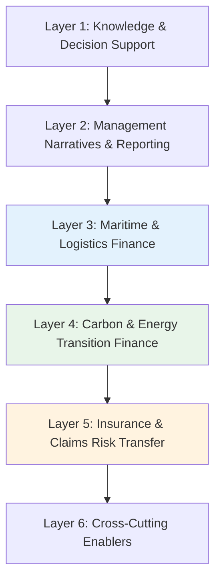
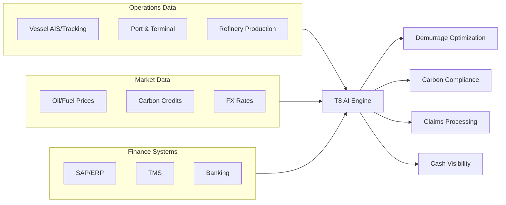

# T8: Specialized Treasury for Refining

## Overview

Specialized Treasury for Refining addresses the unique financial challenges of downstream oil & gas operations. Unlike generic treasury functions, refining treasury must manage vessel operations, fuel procurement, environmental compliance, insurance claims, and complex documentation workflows that are specific to the industry.

!!! info "Industry-Specific Solutions"

    T8 covers **domain-specific** treasury challenges unique to refining: demurrage/laytime optimization, bunker fuel procurement, crack spread hedging, carbon credit management, and marine insurance claims—capabilities not found in generic treasury platforms.

**T8 Scope:** Domain-specific AI solutions for maritime logistics finance, carbon/ESG compliance, insurance optimization, and cross-cutting treasury enablers that support the entire refining value chain.

This tower organizes **28 AI use cases** across **6 functional layers**:



| Layer | Focus | Use Cases |
|-------|-------|-----------|
| **L1: Knowledge & Decision Support** | Policy Q&A, treasury copilot for self-serve queries | 2 |
| **L2: Management Narratives & Reporting** | Weekly bulletins, ESG reports, variance narratives | 2 |
| **L3: Maritime & Logistics Finance** | Voyage optimization, demurrage, bunker fuel management | 6 |
| **L4: Carbon & Energy Transition Finance** | Carbon credits, compliance pathways, green project ROI | 5 |
| **L5: Insurance & Claims Risk Transfer** | Coverage optimization, claims automation, recovery | 4 |
| **L6: Cross-Cutting Enablers** | Cash visibility, fraud monitoring, document automation | 9 |

---

## T8 Domain Architecture

Refining treasury sits at the intersection of multiple specialized domains:



---

## The Refining Treasury Value Chain

```
┌─────────────────────────────────────────────────────────────────────────────┐
│                        REFINING TREASURY VALUE CHAIN                         │
├─────────────────────────────────────────────────────────────────────────────┤
│                                                                             │
│  CRUDE PROCUREMENT          REFINING              PRODUCT SALES             │
│  ─────────────────          ────────              ─────────────             │
│                                                                             │
│  ┌─────────┐    ┌─────────┐    ┌─────────┐    ┌─────────┐    ┌─────────┐   │
│  │ Charter │───►│ Voyage  │───►│Refinery │───►│ Product │───►│ Export  │   │
│  │ & Ship  │    │& Bunker │    │  Ops    │    │ Storage │    │ & LC    │   │
│  └─────────┘    └─────────┘    └─────────┘    └─────────┘    └─────────┘   │
│       │              │              │              │              │         │
│       ▼              ▼              ▼              ▼              ▼         │
│  ┌─────────┐    ┌─────────┐    ┌─────────┐    ┌─────────┐    ┌─────────┐   │
│  │Demurrage│    │ Bunker  │    │ Carbon  │    │Insurance│    │  Trade  │   │
│  │& Laytime│    │  Fuel   │    │ Credits │    │& Claims │    │ Finance │   │
│  └─────────┘    └─────────┘    └─────────┘    └─────────┘    └─────────┘   │
│       │              │              │              │              │         │
│       └──────────────┴──────────────┴──────────────┴──────────────┘         │
│                                    │                                        │
│                           ┌────────▼────────┐                               │
│                           │  T8 TREASURY AI │                               │
│                           │    PLATFORM     │                               │
│                           └─────────────────┘                               │
│                                                                             │
└─────────────────────────────────────────────────────────────────────────────┘
```

---

## Layer 1: Knowledge & Decision Support (Copilot Layer)

This layer provides AI-powered assistants for policy queries and self-serve data access across all T8 domains.

### 1.1 RAG-Powered Policy & Compliance Q&A

**What it does:** Retrieval-Augmented Generation (RAG) system that answers questions about treasury policies, IFRS 9 hedge accounting, internal limits, regulatory requirements, and operational procedures with direct citations.

**Key Inputs:**

- Treasury policy documents and SOPs
- IFRS 9 hedge accounting guidance
- Internal risk limits and approval matrices
- Regulatory guidelines (CMB Turkey, EMIR, EU ETS)
- Historical decisions and interpretations

**AI/LLM Approach:** Claude indexes all policy documents into a vector database. Questions are answered with specific citations to source documents, ensuring auditability.

**Example Interaction:**

```
User: Does our new bunker fuel swap qualify for hedge accounting under IFRS 9?

Claude: Based on Treasury Policy v4.2 and IFRS 9 Guidelines (Section 6.4),
I've analyzed the qualification criteria:

**HEDGE ACCOUNTING ELIGIBILITY CHECK**

| Criterion | Requirement | Your Swap | Status |
|-----------|-------------|-----------|--------|
| Hedging relationship | Documented at inception | ✓ Documented | ✅ |
| Hedged item | Highly probable | Bunker purchase Q2 | ✅ |
| Hedge effectiveness | 80-125% prospective | 94% expected | ✅ |
| Credit risk | Not dominant | Bank A (AA-) | ✅ |
| Hedge ratio | Reflects quantity | 1:1 match | ✅ |

**ASSESSMENT: QUALIFIES for Cash Flow Hedge Accounting**

Additional requirements per Section 6.4.3:
- Effectiveness testing required quarterly (next: Mar 31)
- Documentation must include risk management objective
- Discontinuation triggers if cargo is canceled

**Documentation Checklist:**
- [ ] Hedge designation memo (template: HM-CFH-001)
- [ ] Prospective effectiveness test
- [ ] Risk management strategy reference

📎 Sources: Treasury_Policy_v4.2.pdf (pages 45-48),
   IFRS9_Hedge_Accounting_Guide.pdf (Section 6.4.1-6.4.5)

Shall I generate the hedge designation memo?
```

**Outputs:**

- Policy answers with document citations
- Compliance checklists
- Document templates
- Audit-ready rationale

**KPIs:**

- Answer accuracy rate (target: >95%)
- Average response time (<5 seconds)
- Policy compliance improvement rate
- Audit findings related to documentation (target: 0)

---

### 1.2 Natural-Language Treasury Copilot

**What it does:** Self-serve query interface allowing treasury staff to ask questions in plain English and get instant answers from trusted data sources—eliminating ad-hoc spreadsheet analysis.

**Key Inputs:**

- SAP/ERP data (cash flows, balances, transactions)
- TMS data (positions, exposures, hedges)
- Market data (oil prices, FX, carbon credits)
- Operational data (vessel positions, refinery status)

**AI/LLM Approach:** Claude retrieves data from governed sources (SAP, TMS, market feeds), performs calculations, and generates narrative explanations. The LLM never invents numbers—it pulls from approved systems.

**Example Interaction:**

```
User: What's our USD exposure next month by business unit, and why did
it change from last week's forecast?

Claude: I've analyzed the USD exposure data from SAP and TMS...

📊 **USD EXPOSURE FORECAST - FEBRUARY 2025**

| Business Unit | Exposure | Hedged | Net Open | Change vs Last Week |
|---------------|----------|--------|----------|---------------------|
| Crude Imports | $285M | $228M (80%) | $57M | +$12M |
| Product Exports | -$145M | -$87M (60%) | -$58M | -$8M |
| Bunker Fuel | $32M | $0 | $32M | +$5M |
| Capex | $18M | $0 | $18M | -- |
| **Net Long USD** | **$190M** | **$141M** | **$49M** | **+$9M** |

**VARIANCE EXPLANATION (+$9M)**

The $9M increase in net USD exposure is driven by:

| Driver | Impact | Root Cause |
|--------|--------|------------|
| Additional crude cargo | +$12M | Spot purchase added Jan 22 |
| Higher export receipts | -$8M | Jet fuel contract extended |
| Bunker timing | +$5M | Vessel schedule shifted |

**HEDGE COVERAGE ASSESSMENT**

Current: 74% hedged → Below 80% policy minimum for Feb
Recommendation: Add $15M forward to reach policy compliance

**DATA SOURCES**
- Exposure: SAP FI (as of Jan 25, 2025 18:00)
- Hedges: Kyriba TMS (real-time)
- Cargo schedule: Logistics system (updated daily)

Would you like me to draft the hedge recommendation memo?
```

**Outputs:**

- Real-time data answers with source citations
- Variance explanations
- Trend analysis
- Actionable recommendations

**KPIs:**

- Query adoption rate (target: >80% of treasury staff)
- Time saved vs manual analysis (target: >70%)
- Data accuracy (100% match to source systems)
- User satisfaction score

---

## Layer 2: Management Narratives & Reporting

This layer automates the creation of executive reports, risk narratives, and ESG disclosures.

### 2.1 Executive Reporting Automation (Weekly Treasury Bulletin)

**What it does:** Generates weekly treasury bulletins summarizing cash positions, market moves, risk exposures, and key events with variance explanations and forward outlook.

**Key Inputs:**

- Cash positions by entity/currency
- Market data (oil, FX, rates)
- Risk exposures and hedge coverage
- Operational events (vessel delays, refinery status)
- Previous bulletins for style consistency

**AI/LLM Approach:** RAG pulls latest data from trusted sources; GenAI generates narrative summaries with charts, explanations, and "so-what" implications. Human review required before distribution.

**Example Output:**

```
═══════════════════════════════════════════════════════════════════════════════
              WEEKLY TREASURY BULLETIN - WEEK ENDING JANUARY 24, 2025
═══════════════════════════════════════════════════════════════════════════════

**EXECUTIVE SUMMARY**

Group liquidity remains strong at $312M (+$18M WoW), driven by accelerated
product receivables. Key developments:

• Cash position: $312M (+6% WoW) | Policy minimum: $200M ✅
• Brent crude: $82.40/bbl (+3.2% WoW) – crude cost up ~$4M/month
• USD/TRY: 35.85 (+1.8% WoW) – TRY weakness continues
• Net FX exposure: $49M long USD (74% hedged) ⚠️ Below 80% policy

═══════════════════════════════════════════════════════════════════════════════

**CASH & LIQUIDITY**

    $M
    350 │                              ●
    300 │          ●─────●────●────●───┘
    250 │      ●───┘
    200 │──────────────────────────────── Policy Min
    150 │
        └─────────────────────────────────
          W1   W2   W3   W4   W5   W6

| Metric | This Week | Last Week | Change | Status |
|--------|-----------|-----------|--------|--------|
| Total Cash | $312M | $294M | +$18M | ✅ |
| RCF Available | $150M | $150M | -- | ✅ |
| Working Capital | $85M | $78M | +$7M | ✅ |

**Variance Driver:** +$18M from early receipt of January gasoline exports
($22M received Jan 23 vs expected Jan 28).

═══════════════════════════════════════════════════════════════════════════════

**MARKET WATCH**

| Indicator | Current | WoW Δ | MoM Δ | Treasury Impact |
|-----------|---------|-------|-------|-----------------|
| Brent | $82.40 | +3.2% | +5.1% | Crude cost +$4M/mo |
| USD/TRY | 35.85 | +1.8% | +4.2% | Export revenue ↑ |
| EUR/USD | 1.0420 | -0.5% | -1.2% | Minor impact |
| EU Carbon | €68.50 | -2.1% | +8.3% | Compliance cost ↓ |

**AI INSIGHT:** "Brent's rise above $80 increases crude payment needs by
~$4M monthly. Recommend monitoring crack spreads—current 3-2-1 at $28/bbl
remains favorable for margins."

═══════════════════════════════════════════════════════════════════════════════

**RISK EXPOSURES**

| Risk Type | Gross | Hedged | Net Open | Policy | Status |
|-----------|-------|--------|----------|--------|--------|
| FX - USD | $190M | $141M | $49M | 80% min | ⚠️ 74% |
| Commodity - Crude | 2.1M bbl | 1.7M bbl | 0.4M bbl | 80% min | ✅ 81% |
| Interest Rate | $450M | $320M | $130M | 50% min | ✅ 71% |

**ACTION REQUIRED:** FX hedge ratio at 74% vs 80% policy. Recommend
adding $15M USD forward by Feb 1.

═══════════════════════════════════════════════════════════════════════════════

**KEY EVENTS & OUTLOOK**

✅ **Completed:** Q4 carbon credits purchased (45K EUAs at €67.20)
⏳ **Pending:** Crude cargo M/T Aegean Star - ETA Izmit Jan 28 (no demurrage risk)
📅 **Upcoming:** Feb 1 excise tax payment (₺1.8B) – funding confirmed

**NEXT WEEK FOCUS:**
1. Execute USD hedge to restore policy compliance
2. Monitor crude cargo arrival for demurrage risk
3. Prepare Q4 2024 treasury results for ALCO

───────────────────────────────────────────────────────────────────────────────
Prepared by: Treasury AI Assistant | Reviewed by: [Pending] | Approved: [Pending]
Distribution: CFO, Treasurer, Risk Committee
```

**Outputs:**

- Weekly executive bulletin
- Variance explanations with root causes
- Market impact analysis
- Action items and forward outlook

**KPIs:**

- Report preparation time (target: 1 day → 1 hour)
- Executive feedback score
- Action item tracking completion
- Zero factual errors

---

### 2.2 ESG Reporting Automation

**What it does:** Generates audit-ready ESG narratives explaining emission trends, carbon compliance status, and green project performance for sustainability reporting.

**Key Inputs:**

- Emissions data from refinery operations
- Carbon credit portfolio and transactions
- Green project investments and returns
- Regulatory requirements (EU ETS, CBAM, CMB)

**AI/LLM Approach:** GenAI synthesizes operational emissions data with regulatory requirements to produce compliant narratives with supporting evidence.

**Example Output:**

```
═══════════════════════════════════════════════════════════════════════════════
              ESG TREASURY REPORT - Q4 2024
═══════════════════════════════════════════════════════════════════════════════

**CARBON COMPLIANCE SUMMARY**

| Metric | Q4 2024 | Q4 2023 | YoY Change |
|--------|---------|---------|------------|
| CO2 Emissions | 2.45 MT | 2.68 MT | -8.6% ✅ |
| Free Allowances | 1.80 MT | 1.95 MT | -7.7% |
| Purchased EUAs | 0.65 MT | 0.73 MT | -11.0% |
| Carbon Cost | €44.5M | €38.2M | +16.5% |
| Cost per Ton | €68.50 | €52.30 | +31.0% |

**NARRATIVE:**

"Tüpraş's Q4 2024 carbon emissions decreased 8.6% year-over-year,
reflecting operational efficiency improvements and the hydrogen
desulfurization project commissioned in September 2024. Despite
reduced emissions, carbon costs increased 16.5% due to higher EU
ETS prices (€68.50 vs €52.30 average). The company maintained full
compliance with EU ETS Phase IV requirements, surrendering 2.45M
allowances by the November 30 deadline."

**CARBON CREDIT PORTFOLIO**

| Vintage | Quantity | Avg Cost | Current Value | Unrealized G/L |
|---------|----------|----------|---------------|----------------|
| 2024 | 450K EUAs | €65.20 | €68.50 | +€1.49M |
| 2025 | 200K EUAs | €67.80 | €69.20 | +€0.28M |
| **Total** | **650K EUAs** | **€66.00** | **€68.70** | **+€1.77M** |

**GREEN PROJECT TREASURY IMPACT**

| Project | Investment | Annual Savings | IRR | Payback |
|---------|------------|----------------|-----|---------|
| H2 Desulf Unit | €45M | €8.2M | 14.2% | 5.5 yrs |
| Solar Farm | €12M | €1.8M | 12.5% | 6.7 yrs |
| Flare Recovery | €8M | €2.1M | 18.3% | 3.8 yrs |

📎 Data sources: SAP Sustainability Module, EU ETS Registry, Project Finance DB
```

**Outputs:**

- Quarterly ESG narratives
- Carbon portfolio valuation
- Green project ROI analysis
- Regulatory compliance status

**KPIs:**

- ESG report preparation time (target: 5 days → 4 hours)
- Audit findings (target: 0)
- Carbon cost per ton (tracking)
- Green project IRR achievement

---

## Layer 3: Maritime & Logistics Finance

This layer optimizes shipping costs, demurrage, and bunker fuel procurement—unique challenges for refining treasury.

### 3.1 Voyage Cost Optimization

**What it does:** AI predicts optimal charter routing, steaming speeds, and scheduling to minimize total voyage costs (freight + fuel + demurrage risk).

**Key Inputs:**

- Vessel AIS tracking data (position, speed, ETA)
- Charter party terms and freight rates
- Port congestion data and berth availability
- Weather forecasts and sea conditions
- Crude delivery schedules from trading

**AI/LLM Approach:** ML models predict optimal routes and speeds; GenAI analyzes unstructured port reports and weather data to recommend adjustments.

**Example Analysis:**

```
═══════════════════════════════════════════════════════════════════════════════
              VOYAGE COST OPTIMIZER - M/T AEGEAN STAR
═══════════════════════════════════════════════════════════════════════════════

**VOYAGE DETAILS**
- Vessel: M/T Aegean Star (Suezmax, 157,000 DWT)
- Route: Basrah → Izmit (via Suez)
- Cargo: 145,000 MT Basrah Light Crude
- Charter: Time Charter @ $42,000/day
- Loading: Completed Jan 18, 2025
- Original ETA Izmit: Jan 28, 2025 14:00

**CURRENT STATUS**

    BASRAH                 SUEZ                  IZMIT
       ●━━━━━━━━━━━━━━━━━━━━●━━━━━━━━▶○
    Departed              Transited            ETA Jan 28
    Jan 18                Jan 23               14:00

    Current Position: 35.2°N, 26.8°E (Aegean Sea)
    Current Speed: 12.5 knots
    Distance Remaining: 380 nm

**OPTIMIZATION ANALYSIS**

┌─────────────────────────────────────────────────────────────────────────────┐
│                        SCENARIO COMPARISON                                  │
├─────────────────────────────────────────────────────────────────────────────┤
│                                                                             │
│  Scenario A: Current Speed (12.5 kts)                                      │
│  ─────────────────────────────────────                                      │
│  ETA: Jan 28, 14:00                                                        │
│  Fuel consumption: 58 MT/day × 1.3 days = 75 MT                            │
│  Fuel cost: 75 MT × $580 = $43,500                                         │
│  Charter cost: 1.3 days × $42,000 = $54,600                                │
│  Demurrage risk: LOW (berth available)                                      │
│  TOTAL: $98,100                                                             │
│                                                                             │
│  Scenario B: Slow Steam (10.5 kts) ⭐ RECOMMENDED                           │
│  ─────────────────────────────────────                                      │
│  ETA: Jan 29, 08:00                                                        │
│  Fuel consumption: 42 MT/day × 1.5 days = 63 MT                            │
│  Fuel cost: 63 MT × $580 = $36,540                                         │
│  Charter cost: 1.5 days × $42,000 = $63,000                                │
│  Demurrage risk: LOW (berth confirmed for Jan 29)                          │
│  TOTAL: $99,540                                                             │
│                                                                             │
│  Scenario C: Fast Steam (14.0 kts)                                         │
│  ─────────────────────────────────────                                      │
│  ETA: Jan 28, 06:00                                                        │
│  Fuel consumption: 72 MT/day × 1.1 days = 79 MT                            │
│  Fuel cost: 79 MT × $580 = $45,820                                         │
│  Charter cost: 1.1 days × $42,000 = $46,200                                │
│  Demurrage risk: MEDIUM (may wait for berth 8 hrs)                         │
│  TOTAL: $92,020 + potential demurrage $15K                                 │
│                                                                             │
└─────────────────────────────────────────────────────────────────────────────┘

**AI RECOMMENDATION: Scenario B - Slow Steam**

Rationale:
- Fuel savings ($6,960) nearly offset charter extension ($8,400)
- Berth confirmed for Jan 29 AM eliminates demurrage risk
- Environmental benefit: 12 MT less fuel = ~38 MT CO2 avoided
- Net cost difference: +$1,440 vs current, but lower risk

**PORT INTELLIGENCE (GenAI Analysis)**

"Izmit Terminal reports 2 vessels ahead in queue. Terminal operations
normal, no weather delays expected. Berth B-3 confirmed for Jan 29
08:00. Recommend slow steaming to arrive just-in-time."

📎 Sources: Vessel AIS (MarineTraffic), Port Authority bulletin,
   Weather: ECMWF forecast, Berth: Terminal confirmation email
```

**Voyage Cost Breakdown Visualization:**

```
    $K
    120│
    100│   ┌───┐    ┌───┐    ┌───┐
     80│   │   │    │   │    │   │
     60│   │ C │    │ F │    │ C │ + Demurrage Risk
     40│   │   │    │   │    │   │
     20│   │   │    │   │    │   │
      0│   └───┘    └───┘    └───┘
        Current   SlowSteam  FastSteam

    C = Charter    F = Fuel    █ = Demurrage Risk
```

**Outputs:**

- Optimal speed/route recommendations
- Cost comparison scenarios
- Port intelligence summaries
- Demurrage risk alerts

**KPIs:**

- Voyage cost per ton (target: -5% vs baseline)
- Demurrage hours saved (target: >20 hrs/month)
- Fuel efficiency improvement
- Forecast vs actual ETA accuracy (target: >90%)

---

### 3.2 Demurrage & Laytime Prediction + Accrual Forecasting

**What it does:** Predicts likely demurrage exposure based on port conditions and vessel schedules, and generates accurate accrual forecasts for financial planning.

**Key Inputs:**

- Charter party laytime terms
- Historical demurrage records
- Port congestion data
- Vessel schedules and ETAs
- Weather forecasts

**AI/LLM Approach:** ML predicts arrival times and port delays; rules engine calculates laytime and demurrage; GenAI generates explanations for accrual recommendations.

**Example Prediction:**

```
═══════════════════════════════════════════════════════════════════════════════
              DEMURRAGE & LAYTIME PREDICTOR - JANUARY 2025
═══════════════════════════════════════════════════════════════════════════════

**ACTIVE VOYAGES - DEMURRAGE RISK ASSESSMENT**

| Vessel | Port | Laytime | Used | Remaining | Risk | Est. Demurrage |
|--------|------|---------|------|-----------|------|----------------|
| Aegean Star | Izmit | 36 hrs | 0 | 36 hrs | 🟢 Low | $0 |
| Med Carrier | Aliaga | 48 hrs | 42 hrs | 6 hrs | 🟡 Med | $15K-25K |
| Black Sea | Ceyhan | 36 hrs | 52 hrs | -16 hrs | 🔴 High | $48K |

**DETAILED ANALYSIS: M/V MED CARRIER (Medium Risk)**

┌─────────────────────────────────────────────────────────────────────────────┐
│                     LAYTIME CALCULATION                                     │
├─────────────────────────────────────────────────────────────────────────────┤
│                                                                             │
│  NOR Tendered:        Jan 20, 06:00                                        │
│  Laytime Commenced:   Jan 20, 12:00 (6hr notice per CP)                    │
│  Allowed Laytime:     48 hours                                              │
│  Laytime Expires:     Jan 22, 12:00                                        │
│                                                                             │
│  Current Time:        Jan 22, 06:00                                        │
│  Laytime Used:        42 hours                                              │
│  Laytime Remaining:   6 hours                                              │
│                                                                             │
│  Discharge Progress:  85,000 MT / 120,000 MT (71%)                         │
│  Discharge Rate:      2,500 MT/hr                                          │
│  Est. Completion:     Jan 22, 20:00 (14 more hours needed)                 │
│                                                                             │
│  PREDICTED DEMURRAGE: 8 hours × $3,000/hr = $24,000                        │
│                                                                             │
└─────────────────────────────────────────────────────────────────────────────┘

**RISK FACTORS IDENTIFIED**

| Factor | Impact | Source |
|--------|--------|--------|
| Pump maintenance (4hr delay) | +4 hrs | Terminal notice |
| Weather hold possible | +2-4 hrs | Forecast: 25kt winds |
| Night operation restrictions | +0 hrs | None at Aliaga |

**MITIGATION OPTIONS**

| Option | Action | Cost | Demurrage Saved |
|--------|--------|------|-----------------|
| 1 | Request additional pump | $8,000 | $12,000 |
| 2 | Accept demurrage | $0 | $0 |
| 3 | Negotiate with terminal | $0 | $6,000 (est.) |

**AI RECOMMENDATION:** Option 3 - Negotiate with terminal to prioritize
completion. Historical success rate: 65% at Aliaga.

**MONTHLY DEMURRAGE ACCRUAL FORECAST**

| Month | Confirmed | Predicted | Risk Range | Accrual Rec. |
|-------|-----------|-----------|------------|--------------|
| Jan 2025 | $48K | $24K | $18K-35K | $95K |
| Feb 2025 | $0 | $65K | $45K-90K | $70K |
| Mar 2025 | $0 | $55K | $35K-75K | $60K |

**ACCRUAL JOURNAL ENTRY RECOMMENDATION**

```
Dr: Demurrage Expense (6200100)     $72,000
Cr: Demurrage Accrual (2100300)             $72,000

Basis: Known demurrage ($48K) + probable ($24K) per IAS 37
Review: Monthly with Operations
```

**Outputs:**

- Real-time demurrage risk dashboard
- Laytime calculations with audit trail
- Accrual recommendations
- Mitigation action suggestions

**KPIs:**

- Demurrage forecast accuracy (target: ±15%)
- Demurrage cost reduction (target: -10% YoY)
- Accrual accuracy vs actual (target: ±10%)
- Mitigation success rate

---

### 3.3 Port Congestion & Performance Analytics

**What it does:** Analyzes port performance data to support negotiations with terminals and optimize vessel scheduling.

**Key Inputs:**

- Historical port waiting times
- Berth productivity metrics
- Terminal performance benchmarks
- Industry port reports

**AI/LLM Approach:** ML identifies patterns in port delays; GenAI generates negotiation briefs with supporting evidence.

**Example Analysis:**

```
═══════════════════════════════════════════════════════════════════════════════
              PORT PERFORMANCE ANALYTICS - NEGOTIATION SUPPORT
═══════════════════════════════════════════════════════════════════════════════

**ALIAGA TERMINAL PERFORMANCE REVIEW**

Period: 2024 (12 months, 48 vessel calls)

**WAITING TIME ANALYSIS**

    Hours
     48│
     36│         ●
     24│     ●       ●   ●       ●
     12│ ●       ●       ●   ●       ●
      0│─●───────────────────────────●──
        J  F  M  A  M  J  J  A  S  O  N  D

    Average: 18.5 hours | Industry benchmark: 12 hours
    Worst month: April (36 hrs - turnaround maintenance)
    Best month: December (8 hrs)

**PRODUCTIVITY METRICS**

| Metric | Aliaga | Industry Avg | Variance |
|--------|--------|--------------|----------|
| Avg Wait Time | 18.5 hrs | 12.0 hrs | +54% ⚠️ |
| Discharge Rate | 2,800 MT/hr | 3,200 MT/hr | -13% |
| Berth Efficiency | 78% | 85% | -7% |
| Weather Delays | 4.2 hrs/call | 3.0 hrs | +40% |

**DEMURRAGE IMPACT**

2024 demurrage at Aliaga: $385,000
- Attributable to terminal delays: $210,000 (55%)
- Attributable to Tüpraş delays: $85,000 (22%)
- Weather/force majeure: $90,000 (23%)

**AI-GENERATED NEGOTIATION BRIEF**

"Aliaga Terminal's 2024 performance shows waiting times 54% above
industry benchmark, costing Tüpraş an estimated $210,000 in excess
demurrage. Key issues:

1. **Berth allocation delays** (8.5 hrs avg vs 5 hrs benchmark)
   - Evidence: 12 instances of >24hr wait despite confirmed slots

2. **Pump reliability** (3 significant breakdowns in 2024)
   - Evidence: Apr 15, Jul 22, Oct 8 incidents documented

3. **Night operation restrictions** (unnecessary per terminal license)
   - Evidence: Competitor terminals operate 24/7

**Recommended negotiation targets:**
- Guaranteed 12-hour berth window (with penalty clause)
- Minimum 3,000 MT/hr discharge rate commitment
- Night operation clearance for Tüpraş vessels
- 10% tariff reduction to offset historical demurrage

**Estimated annual savings if achieved: $180,000**"

📎 Supporting documents attached: Vessel logs, Terminal correspondence,
   Industry benchmark report (Drewry 2024)
```

**Outputs:**

- Port performance scorecards
- Negotiation briefs with evidence
- Benchmark comparisons
- Savings opportunity analysis

**KPIs:**

- Average port waiting time reduction
- Terminal negotiation success rate
- Demurrage attributed to terminal (trending)
- Cost per vessel call

---

### 3.4 Bunker Fuel Procurement Timing + Supplier Scoring

**What it does:** Optimizes bunker fuel procurement timing based on price forecasts and scores suppliers on reliability, quality, and pricing.

**Key Inputs:**

- Bunker fuel price feeds (Singapore, Rotterdam, Fujairah)
- Supplier historical performance data
- Vessel consumption forecasts
- Quality test results

**AI/LLM Approach:** ML predicts short-term price movements; scoring algorithm ranks suppliers; GenAI explains recommendations.

**Example Analysis:**

```
═══════════════════════════════════════════════════════════════════════════════
              BUNKER FUEL PROCUREMENT OPTIMIZER
═══════════════════════════════════════════════════════════════════════════════

**CURRENT MARKET**

VLSFO 0.5% Prices ($/MT):
- Singapore: $612 (▲ +$8 WoW)
- Rotterdam: $598 (▲ +$5 WoW)
- Fujairah: $605 (▲ +$6 WoW)
- Istanbul: $595 (▲ +$4 WoW)

**PRICE FORECAST (Next 30 Days)**

    $/MT
    640│                    ●───●
    620│            ●───●───┘
    600│    ●───●───┘
    580│●───┘
       └──────────────────────────
        W1   W2   W3   W4   W5

    AI Forecast: +3-5% increase expected
    Confidence: 72%
    Driver: Crude rally, refinery maintenance season

**PROCUREMENT RECOMMENDATION**

┌─────────────────────────────────────────────────────────────────────────────┐
│ ⭐ RECOMMENDED ACTION: BUY NOW                                              │
│                                                                             │
│ Rationale:                                                                  │
│ - Prices expected to rise 3-5% over next 30 days                           │
│ - Current Istanbul price ($595) is 2% below 30-day average                 │
│ - Vessel M/T Aegean Star arriving Jan 28 - ideal timing                    │
│                                                                             │
│ Suggested purchase: 1,500 MT VLSFO @ Istanbul                              │
│ Estimated savings vs waiting: $9,000-15,000                                │
└─────────────────────────────────────────────────────────────────────────────┘

**SUPPLIER SCORECARD - ISTANBUL**

| Supplier | Price | Quality | Delivery | Payment | Score | Rank |
|----------|-------|---------|----------|---------|-------|------|
| Petrol Ofisi | $595 | 92/100 | 95/100 | Net 30 | 94 | ⭐ 1 |
| Turkuaz | $592 | 85/100 | 88/100 | Net 15 | 87 | 2 |
| Opet Marine | $598 | 90/100 | 92/100 | Net 30 | 91 | 3 |
| Shell Turkey | $608 | 98/100 | 98/100 | Net 45 | 89 | 4 |

**SCORING METHODOLOGY**

| Factor | Weight | Description |
|--------|--------|-------------|
| Price competitiveness | 30% | vs market benchmark |
| Quality consistency | 25% | Lab test history |
| Delivery reliability | 25% | On-time %, quantity accuracy |
| Payment terms | 10% | Credit period, flexibility |
| Dispute resolution | 10% | Historical claims handling |

**RECOMMENDATION:** Petrol Ofisi at $595/MT
- Best overall score (94/100)
- Strong quality record (no off-spec deliveries in 24 months)
- Reliable delivery (98% on-time)
- Competitive payment terms

Request quote for 1,500 MT VLSFO, delivery Jan 28-29?
```

**Outputs:**

- Price forecasts with confidence levels
- Buy/wait recommendations
- Supplier scorecards
- Procurement timing optimization

**KPIs:**

- Bunker cost vs market benchmark (target: -2%)
- Supplier quality incidents (target: 0)
- Procurement timing savings captured
- Forecast accuracy (target: >70%)

---

### 3.5 Bunker Fuel Quality Anomaly Detection

**What it does:** Monitors bunker fuel quality test results to detect anomalies that could cause engine damage or regulatory non-compliance.

**Key Inputs:**

- Fuel sample lab test results
- ISO 8217 specifications
- Historical quality data by supplier
- Engine manufacturer tolerances

**AI/LLM Approach:** ML detects anomalies vs specifications and historical patterns; GenAI generates alerts with root cause analysis.

**Example Alert:**

```
═══════════════════════════════════════════════════════════════════════════════
              ⚠️ BUNKER FUEL QUALITY ALERT
═══════════════════════════════════════════════════════════════════════════════

**VESSEL:** M/T Mediterranean Star
**Bunker Stem:** 850 MT VLSFO
**Supplier:** Turkuaz Marine (Istanbul)
**Delivery Date:** January 22, 2025
**Sample ID:** BQ-2025-0142

**ANOMALY DETECTED: Catalytic Fines (Cat Fines)**

| Parameter | Result | ISO 8217 Limit | Status |
|-----------|--------|----------------|--------|
| Density | 0.9720 | Max 0.9900 | ✅ Pass |
| Viscosity | 342 cSt | Max 380 cSt | ✅ Pass |
| Sulfur | 0.42% | Max 0.50% | ✅ Pass |
| **Cat Fines (Al+Si)** | **72 ppm** | **Max 60 ppm** | ❌ **FAIL** |
| Flash Point | 68°C | Min 60°C | ✅ Pass |
| Water | 0.03% | Max 0.50% | ✅ Pass |

**RISK ASSESSMENT**

┌─────────────────────────────────────────────────────────────────────────────┐
│ SEVERITY: HIGH                                                              │
│                                                                             │
│ Cat fines at 72 ppm exceed ISO limit (60 ppm) by 20%                       │
│                                                                             │
│ Engine damage risk: ELEVATED                                                │
│ - Cat fines cause abrasive wear to cylinder liners and piston rings        │
│ - Estimated repair cost if unmitigated: $150,000 - $500,000                │
│                                                                             │
│ Regulatory risk: NON-COMPLIANT                                              │
│ - Fuel does not meet ISO 8217:2017 DM Grade specifications                 │
│                                                                             │
└─────────────────────────────────────────────────────────────────────────────┘

**ROOT CAUSE ANALYSIS**

Historical data shows Turkuaz has delivered 3 stems in past 12 months
with elevated cat fines (65, 58, 72 ppm). Pattern suggests:
- Possible FCC unit proximity at refinery source
- Inadequate settling/purification before delivery

**RECOMMENDED ACTIONS**

| Priority | Action | Owner | Deadline |
|----------|--------|-------|----------|
| 1 | Increase purifier throughput on vessel | Chief Eng | Immediate |
| 2 | Extend fuel settling time before use | Chief Eng | Immediate |
| 3 | File quality claim with supplier | Bunker Mgr | Jan 23 |
| 4 | Request fuel replacement or discount | Bunker Mgr | Jan 24 |
| 5 | Update supplier scorecard | Treasury | Jan 25 |

**FINANCIAL IMPACT**

- Estimated claim value: $8,500 (price discount)
- Additional purifier costs: ~$2,000
- Net expected recovery: $6,500

**CLAIM DOCUMENTATION GENERATED**

📎 Attached:
- Lab test report (SGS certified)
- BDN (Bunker Delivery Note)
- Quantity survey report
- Claim letter template

Supplier notification drafted - ready for review and send?
```

**Outputs:**

- Real-time quality alerts
- Risk assessments
- Root cause analysis
- Claim documentation packages

**KPIs:**

- Off-spec fuel detection rate (target: 100%)
- Claim recovery rate (target: >80%)
- Engine incidents from fuel (target: 0)
- Supplier quality trend

---

### 3.6 Bunker Fuel Hedging Support

**What it does:** Provides decision support for bunker fuel hedging strategies, analyzing exposure and recommending hedge structures.

**Key Inputs:**

- Bunker consumption forecasts
- Forward price curves
- Hedge policy parameters
- Historical hedge effectiveness

**AI/LLM Approach:** Quantitative models analyze exposure and hedge alternatives; GenAI explains trade-offs and generates recommendation memos.

**Example Analysis:**

```
═══════════════════════════════════════════════════════════════════════════════
              BUNKER FUEL HEDGING ANALYSIS - Q2 2025
═══════════════════════════════════════════════════════════════════════════════

**EXPOSURE SUMMARY**

| Quarter | Est. Consumption | Current Hedged | Open Exposure | Policy |
|---------|------------------|----------------|---------------|--------|
| Q2 2025 | 18,000 MT | 7,200 MT (40%) | 10,800 MT | 60% min |
| Q3 2025 | 16,500 MT | 0 MT (0%) | 16,500 MT | 60% min |
| Q4 2025 | 17,000 MT | 0 MT (0%) | 17,000 MT | 60% min |

**GAP TO POLICY: Q2 needs additional 3,600 MT hedged (20%)**

**MARKET ANALYSIS**

Current spot (VLSFO Singapore): $612/MT
Q2 2025 forward: $628/MT (+2.6% vs spot)
Q3 2025 forward: $635/MT (+3.8% vs spot)

Forward curve: Contango (premium for future delivery)

**HEDGING OPTIONS**

| Option | Structure | Volume | Price | Cost/Benefit |
|--------|-----------|--------|-------|--------------|
| A | Q2 Swap (fixed) | 3,600 MT | $628 | Lock in $628 |
| B | Q2 Call Option | 3,600 MT | Cap $650 | Premium $18K |
| C | Q2 Collar | 3,600 MT | $610-$660 | Zero cost |

**SCENARIO ANALYSIS**

Price at expiry → | $550 | $600 | $628 | $650 | $700 |
─────────────────────────────────────────────────────────
Option A (Swap)   | -$281K| -$101K|  $0  | +$79K| +$259K|
Option B (Call)   | -$18K | -$18K | -$18K| -$18K| +$162K|
Option C (Collar) | -$216K| -$36K | +$65K| +$79K| +$79K |
Unhedged          | -$281K| -$101K|  $0  | +$79K| +$259K|

**AI RECOMMENDATION: Option C - Zero-Cost Collar**

Rationale:
1. Protects against prices above $660 (breakeven at $642)
2. Participates in declines to $610 floor
3. Zero upfront premium preserves budget
4. Achieves policy compliance (60% hedge ratio)
5. Hedge accounting eligible per IFRS 9

**HEDGE DESIGNATION MEMO (DRAFT)**

"This memo designates a bunker fuel collar as a cash flow hedge...
[Full memo available for review]"

Proceed with execution? [Request Quotes] [Modify] [Defer]
```

**Outputs:**

- Exposure analysis and gap to policy
- Hedge structure comparisons
- Scenario analysis
- Recommendation memos

**KPIs:**

- Hedge ratio vs policy (target: compliance)
- Hedge effectiveness (target: 80-125%)
- Cost savings vs unhedged (tracking)
- Hedge accounting qualification rate

---

## Layer 4: Carbon & Energy Transition Finance

This layer manages the financial aspects of carbon compliance and green investments.

### 4.1 Carbon Credit Requirement Forecasting

**What it does:** Forecasts carbon credit requirements based on production plans and regulatory allocations.

**Key Inputs:**

- Refinery production forecasts
- Emission factors by process unit
- Free allocation schedules (EU ETS)
- Regulatory calendar

**AI/LLM Approach:** ML models forecast emissions based on production; rules engine calculates credit requirements.

**Example Forecast:**

```
═══════════════════════════════════════════════════════════════════════════════
              CARBON CREDIT REQUIREMENT FORECAST - 2025
═══════════════════════════════════════════════════════════════════════════════

**ANNUAL EMISSIONS FORECAST**

| Refinery | Production (MT) | Emission Factor | Est. Emissions (tCO2) |
|----------|-----------------|-----------------|----------------------|
| Izmit | 11.2M | 0.28 | 3.14M |
| Izmir | 5.8M | 0.26 | 1.51M |
| Kirikkale | 5.0M | 0.30 | 1.50M |
| Batman | 1.1M | 0.32 | 0.35M |
| **Total** | **23.1M** | **0.28 avg** | **6.50M** |

**CREDIT REQUIREMENT CALCULATION**

┌─────────────────────────────────────────────────────────────────────────────┐
│                   2025 CARBON CREDIT BALANCE                                │
├─────────────────────────────────────────────────────────────────────────────┤
│                                                                             │
│  Forecast Emissions:                  6,500,000 tCO2                        │
│  Less: Free Allocations:             (4,200,000) tCO2                       │
│  ────────────────────────────────────────────────                           │
│  Net Purchase Required:               2,300,000 tCO2                        │
│                                                                             │
│  Current Inventory:                     650,000 EUAs                        │
│  ────────────────────────────────────────────────                           │
│  Additional Purchase Needed:          1,650,000 EUAs                        │
│                                                                             │
│  At current price (€68.50):           €113.0M budget required               │
│                                                                             │
└─────────────────────────────────────────────────────────────────────────────┘

**QUARTERLY PURCHASE SCHEDULE (Recommended)**

| Quarter | Volume (EUAs) | Budget (€M) | Rationale |
|---------|---------------|-------------|-----------|
| Q1 2025 | 400,000 | 27.4 | Take advantage of current levels |
| Q2 2025 | 500,000 | 35.0 | Pre-summer buying |
| Q3 2025 | 400,000 | 28.0 | Post-allocation adjustment |
| Q4 2025 | 350,000 | 24.5 | Final true-up |
| **Total** | **1,650,000** | **€114.9M** | |

**SENSITIVITY ANALYSIS**

If emissions +10%: Additional 650K EUAs needed (€44.5M)
If emissions -10%: 650K EUAs surplus (potential sale)
If price +20%: Budget increases €23M
If price -20%: Budget decreases €23M

**AI INSIGHT:**

"2025 free allocations reduced 4.5% vs 2024 per EU ETS Phase IV schedule.
Combined with expected production increase, net purchase requirement rises
18% YoY. Recommend front-loading purchases in Q1-Q2 given price volatility."
```

**Outputs:**

- Emission forecasts by facility
- Credit requirement calculations
- Purchase schedules
- Sensitivity analysis

**KPIs:**

- Forecast accuracy (target: ±5%)
- Compliance deadline achievement (100%)
- Budget variance (target: ±10%)
- Cost per ton vs market average

---

### 4.2 Carbon Price Prediction + Portfolio Valuation

**What it does:** Predicts carbon credit prices and values the company's carbon portfolio for treasury planning.

**Key Inputs:**

- Historical EU ETS prices
- Market fundamentals (gas prices, coal prices, power demand)
- Regulatory news and policy signals
- Portfolio positions

**AI/LLM Approach:** ML models predict prices; GenAI summarizes market drivers and policy impacts.

**Example Analysis:**

```
═══════════════════════════════════════════════════════════════════════════════
              CARBON MARKET INTELLIGENCE - JANUARY 2025
═══════════════════════════════════════════════════════════════════════════════

**CURRENT MARKET**

EU ETS (Dec 2025): €68.50
- WoW: -2.1% (€70.00)
- MoM: +8.3% (€63.25)
- YoY: +12.8% (€60.75)

**PRICE FORECAST**

    €/tCO2
    90│                        ●───● P90
    80│            ●───●───●───┘
    70│    ●───●───┘               ●─── Base
    60│●───┘
    50│                            ●─── P10
      └─────────────────────────────────
       Jan  Feb  Mar  Apr  May  Jun

| Horizon | P10 | Base Case | P90 |
|---------|-----|-----------|-----|
| 3 months | €62 | €72 | €82 |
| 6 months | €58 | €78 | €92 |
| 12 months | €55 | €85 | €105 |

**MARKET DRIVERS (GenAI Analysis)**

"EU ETS prices declined 2.1% this week on milder weather reducing
power demand. However, medium-term outlook remains bullish:

BULLISH FACTORS:
- CBAM implementation (Oct 2026) increasing demand
- MSR (Market Stability Reserve) reducing supply
- REPowerEU increasing ambition
- Gas prices elevated vs coal (favoring renewables)

BEARISH FACTORS:
- Economic slowdown risk reducing industrial activity
- High inventory levels from 2023 buying
- Potential certificate release if prices spike

BASE CASE: €85/tCO2 by Dec 2025 (+24% from current)"

**PORTFOLIO VALUATION**

| Vintage | Quantity | Avg Cost | Current Price | MTM Value | Unreal. G/L |
|---------|----------|----------|---------------|-----------|-------------|
| 2024 | 450,000 | €65.20 | €68.50 | €30.8M | +€1.49M |
| 2025 | 200,000 | €67.80 | €68.50 | €13.7M | +€0.14M |
| **Total** | **650,000** | **€66.00** | **€68.50** | **€44.5M** | **+€1.63M** |

**RISK METRICS**

- Portfolio VaR (95%, 1-month): €3.2M
- Maximum drawdown (historical): €8.5M (Q3 2023)
- Correlation with gas: 0.72 (high)

**AI RECOMMENDATION:**

"Current portfolio shows €1.63M unrealized gain. Given bullish outlook,
recommend holding existing positions and executing Q1 purchases per
schedule. Consider hedging 30% of 2025 requirements via forward contracts
to lock in current levels."
```

**Outputs:**

- Price forecasts with confidence ranges
- Market driver analysis
- Portfolio valuation and risk metrics
- Trading recommendations

**KPIs:**

- Forecast accuracy (target: directionally correct >70%)
- Portfolio return vs benchmark
- Risk metric compliance
- Cost of compliance vs budget

---

### 4.3 Compliance Pathway Optimization (Buy vs Reduce)

**What it does:** Analyzes whether to achieve carbon compliance through credit purchases or emission reduction investments.

**Key Inputs:**

- Current and forecast emissions
- Carbon credit prices (spot and forward)
- Emission reduction project options
- Project costs and implementation timelines

**AI/LLM Approach:** Optimization models compare buy vs reduce strategies; GenAI explains trade-offs.

**Example Analysis:**

```
═══════════════════════════════════════════════════════════════════════════════
              COMPLIANCE PATHWAY OPTIMIZER - 2025-2030
═══════════════════════════════════════════════════════════════════════════════

**COMPLIANCE GAP FORECAST (Without Action)**

| Year | Emissions | Free Alloc | Gap | @ €85/tCO2 |
|------|-----------|------------|-----|------------|
| 2025 | 6.50M | 4.20M | 2.30M | €196M |
| 2026 | 6.45M | 3.98M | 2.47M | €210M |
| 2027 | 6.40M | 3.77M | 2.63M | €224M |
| 2028 | 6.35M | 3.57M | 2.78M | €236M |
| 2029 | 6.30M | 3.38M | 2.92M | €248M |
| 2030 | 6.25M | 3.20M | 3.05M | €259M |
| **Total** | | | **16.15M** | **€1,373M** |

**EMISSION REDUCTION PROJECTS AVAILABLE**

| Project | Capex | Annual Reduction | Marginal Cost | IRR |
|---------|-------|------------------|---------------|-----|
| Energy efficiency | €25M | 120K tCO2 | €42/tCO2 | 18% |
| Hydrogen unit | €180M | 450K tCO2 | €67/tCO2 | 12% |
| CCS pilot | €95M | 280K tCO2 | €85/tCO2 | 8% |
| Green power PPA | €15M | 180K tCO2 | €35/tCO2 | 22% |
| Process heat recovery | €40M | 150K tCO2 | €53/tCO2 | 15% |

**OPTIMIZATION RESULTS**

┌─────────────────────────────────────────────────────────────────────────────┐
│ OPTIMAL PATHWAY: Hybrid (Projects + Purchasing)                             │
├─────────────────────────────────────────────────────────────────────────────┤
│                                                                             │
│ PROJECTS TO IMPLEMENT:                                                      │
│ 1. Green power PPA (2025) - €15M capex, 180K tCO2/yr reduction             │
│ 2. Energy efficiency (2025) - €25M capex, 120K tCO2/yr reduction           │
│ 3. Process heat recovery (2026) - €40M capex, 150K tCO2/yr reduction       │
│                                                                             │
│ Total project investment: €80M                                              │
│ Total annual reduction: 450K tCO2/yr (by 2027)                             │
│                                                                             │
│ REMAINING GAP (To purchase):                                                │
│ 2025: 2.00M tCO2 (vs 2.30M without projects)                               │
│ 2030: 2.35M tCO2 (vs 3.05M without projects)                               │
│                                                                             │
└─────────────────────────────────────────────────────────────────────────────┘

**6-YEAR NPV COMPARISON**

| Strategy | Capex | Credit Costs | Total NPV | vs BAU |
|----------|-------|--------------|-----------|--------|
| BAU (Buy all) | €0 | €1,373M | €1,373M | -- |
| All projects | €355M | €485M | €840M | -€533M |
| **Optimal hybrid** | **€80M** | **€892M** | **€972M** | **-€401M** |

**VISUALIZATION: Compliance Cost Trajectory**

    €M/yr
    300│
    250│                    ●───●───● BAU
    200│        ●───●───●───┘
    150│    ●───┘       ●───●───●───● Optimal
    100│●───┘
        └─────────────────────────────────
         2025 2026 2027 2028 2029 2030

**AI RECOMMENDATION:**

"The optimal hybrid pathway saves €401M NPV over 6 years vs pure credit
purchasing. Key actions:

1. **Immediate (Q1 2025):** Approve Green Power PPA (highest IRR at 22%)
2. **Q2 2025:** Launch energy efficiency program (18% IRR)
3. **2026:** Implement heat recovery (15% IRR)

The hydrogen unit and CCS projects do not clear the hurdle rate at
current carbon prices (<€100/tCO2). Reassess if prices exceed €95."
```

**Outputs:**

- Compliance gap forecasts
- Project evaluation with IRR
- Optimized pathway recommendation
- NPV comparisons

**KPIs:**

- Compliance cost vs budget (target: -10% vs BAU)
- Project IRR achievement
- Emission reduction target progress
- NPV of pathway vs alternatives

---

### 4.4 Green Project Cashflow/ROI Evaluation

**What it does:** Evaluates green project investments from a treasury perspective, analyzing cash flows, funding requirements, and ROI.

**Key Inputs:**

- Project capital costs and timeline
- Operating savings forecasts
- Carbon credit savings
- Funding options (internal, green bonds, subsidies)

**AI/LLM Approach:** Financial models calculate IRR, NPV, payback; GenAI generates investment memos.

**Example Evaluation:**

```
═══════════════════════════════════════════════════════════════════════════════
              GREEN PROJECT EVALUATION - SOLAR FARM EXPANSION
═══════════════════════════════════════════════════════════════════════════════

**PROJECT SUMMARY**

| Parameter | Value |
|-----------|-------|
| Project | Izmit Solar Farm Phase 2 |
| Capacity | 25 MW |
| Capital cost | €18.5M |
| Construction | 12 months |
| Operating life | 25 years |
| Location | Izmit refinery grounds |

**CASH FLOW PROJECTION**

| Year | Capex | Energy Savings | Carbon Savings | Net CF | Cumulative |
|------|-------|----------------|----------------|--------|------------|
| 0 | (€18.5M) | -- | -- | (€18.5M) | (€18.5M) |
| 1 | -- | €2.1M | €0.3M | €2.4M | (€16.1M) |
| 2 | -- | €2.1M | €0.4M | €2.5M | (€13.6M) |
| 3 | -- | €2.2M | €0.4M | €2.6M | (€11.0M) |
| 4 | -- | €2.2M | €0.5M | €2.7M | (€8.3M) |
| 5 | -- | €2.3M | €0.5M | €2.8M | (€5.5M) |
| ... | | | | | |
| 10 | -- | €2.5M | €0.7M | €3.2M | €10.8M |

**KEY METRICS**

| Metric | Result | Benchmark | Assessment |
|--------|--------|-----------|------------|
| IRR | 14.2% | 10% hurdle | ✅ Exceeds |
| NPV (10% disc) | €8.4M | >€0 | ✅ Positive |
| Payback | 6.8 years | <8 years | ✅ Within target |
| LCOE | €42/MWh | Grid: €85/MWh | ✅ Competitive |

**SENSITIVITY ANALYSIS**

| Scenario | IRR | NPV | Comment |
|----------|-----|-----|---------|
| Base case | 14.2% | €8.4M | -- |
| Energy price -20% | 10.8% | €4.1M | Still viable |
| Carbon price +50% | 16.5% | €12.1M | Upside scenario |
| Capex +15% | 12.1% | €5.8M | Conservative buffer |

**FUNDING OPTIONS**

| Source | Amount | Cost | Impact on IRR |
|--------|--------|------|---------------|
| Internal cash | €18.5M | 8% WACC | 14.2% (base) |
| Green bond | €15.0M | 5.5% | 15.8% (+1.6%) |
| EU subsidy | €3.0M | 0% | 17.4% (+3.2%) |

**RECOMMENDATION:** Pursue EU subsidy application + green bond
financing to maximize IRR to 17.4%

**AI-GENERATED INVESTMENT MEMO (Summary)**

"The Izmit Solar Farm Phase 2 represents a compelling green investment
with 14.2% base-case IRR, exceeding the 10% corporate hurdle rate.
Key value drivers:

1. **Energy savings:** €2.1M+ annually from self-generated power
2. **Carbon savings:** 4,500 tCO2/year avoided, worth €0.3-0.7M/year
3. **Regulatory optionality:** Prepares for stricter EU carbon rules

Risk mitigation:
- Fixed EPC contract limits construction risk
- 25-year panel warranty from tier-1 supplier
- Site already owned (no land acquisition)

Treasury recommendation: APPROVE, subject to EU subsidy application
and green bond issuance planning."

📎 Full financial model attached: SolarFarm_Phase2_Model_v3.xlsx
```

**Outputs:**

- Cash flow projections
- IRR, NPV, payback calculations
- Sensitivity analysis
- Investment memos

**KPIs:**

- Project IRR vs hurdle rate
- Budget variance during implementation
- Actual vs projected savings
- Green financing achieved

---

### 4.5 Carbon Market News & Policy Monitoring

**What it does:** Monitors carbon market news and policy developments, alerting treasury to material changes.

**Key Inputs:**

- Regulatory announcements (EU, Turkey, global)
- Market news feeds
- Policy consultation documents
- Academic and think tank research

**AI/LLM Approach:** GenAI summarizes news and extracts treasury-relevant implications.

**Example Alert:**

```
═══════════════════════════════════════════════════════════════════════════════
              CARBON POLICY ALERT - MATERIAL DEVELOPMENT
═══════════════════════════════════════════════════════════════════════════════

**ALERT TYPE:** Regulatory Change
**Source:** European Commission
**Date:** January 23, 2025
**Impact:** HIGH

**HEADLINE:**

EU Proposes Accelerated Emission Reduction Target for 2030

**SUMMARY:**

The European Commission today proposed increasing the 2030 emission
reduction target from 55% to 62% (vs 1990 baseline), exceeding
previous expectations. If adopted:

- EU ETS cap reduction accelerated from 4.3% to 5.5% annually
- Free allocations to refiners cut additional 15% by 2030
- CBAM scope expanded to include refined products (diesel, gasoline)

**TREASURY IMPACT ASSESSMENT**

| Impact Area | Current Assumption | New Scenario | Financial Impact |
|-------------|-------------------|--------------|------------------|
| Free allocations | 3.2M tCO2 (2030) | 2.7M tCO2 | +€42M cost/yr |
| Carbon price | €85/tCO2 | €110/tCO2 | +€58M cost/yr |
| Export competitiveness | Neutral | Advantage | Positive |

**ESTIMATED TOTAL IMPACT: +€100M annual compliance cost by 2030**

**RECOMMENDED ACTIONS**

| Priority | Action | Owner | Deadline |
|----------|--------|-------|----------|
| 1 | Update compliance pathway model | Treasury | Feb 15 |
| 2 | Accelerate green project pipeline | Operations | Mar 1 |
| 3 | Review forward hedging strategy | Risk | Feb 1 |
| 4 | Engage industry association | Public Affairs | Immediate |

**TIMELINE**

- Commission proposal: January 2025
- Parliament first reading: June 2025
- Expected adoption: December 2025
- Effective: January 2026

**AI INSIGHT:**

"This proposal exceeds market expectations and explains this week's
carbon price rally. The 62% target implies ~€110/tCO2 equilibrium
price by 2030 (vs our €85 base case). Treasury should update budget
assumptions and consider locking in current prices for 2026-2028."

📎 Full proposal document attached
📎 Impact analysis spreadsheet attached
```

**Outputs:**

- Policy alerts with impact assessment
- Market news summaries
- Action recommendations
- Scenario updates

**KPIs:**

- Alert timeliness (within 24 hours of material news)
- Impact assessment accuracy
- Action item completion rate
- Budget forecast accuracy post-update

---

## Layer 5: Insurance & Claims Risk Transfer

This layer optimizes insurance coverage and automates claims processing for refinery assets and operations.

### 5.1 Insurance Coverage Gap Detection + Premium Optimization

**What it does:** Analyzes insurance coverage against asset values and risks to identify gaps and optimize premium spend.

**Key Inputs:**

- Policy documents (property, liability, marine, D&O)
- Asset register and valuations
- Loss history
- Premium schedules
- Benchmark data

**AI/LLM Approach:** ML identifies coverage gaps and optimal deductible levels; GenAI reads policy documents to extract terms.

**Example Analysis:**

```
═══════════════════════════════════════════════════════════════════════════════
              INSURANCE COVERAGE ANALYSIS - 2025 RENEWAL
═══════════════════════════════════════════════════════════════════════════════

**CURRENT COVERAGE SUMMARY**

| Policy Type | Insured Value | Premium | Deductible | Insurer |
|-------------|---------------|---------|------------|---------|
| Property/BI | $4.2B | $8.5M | $10M | Allianz |
| Marine Cargo | $2.1B | $3.2M | $500K | Swiss Re |
| Liability | $500M | $1.8M | $1M | AXA |
| D&O | $100M | $450K | $250K | Chubb |
| **Total** | | **$13.95M** | | |

**COVERAGE GAP ANALYSIS**

┌─────────────────────────────────────────────────────────────────────────────┐
│ ⚠️ GAPS IDENTIFIED                                                          │
├─────────────────────────────────────────────────────────────────────────────┤
│                                                                             │
│ 1. PROPERTY UNDERINSURANCE                                                  │
│    Current insured value: $4.2B                                             │
│    Estimated replacement cost: $5.1B                                        │
│    Gap: $900M (18% underinsured)                                            │
│    Risk: Partial recovery in major loss; co-insurance penalty               │
│    Recommendation: Increase to $5.1B (+$1.2M premium est.)                  │
│                                                                             │
│ 2. CYBER COVERAGE MISSING                                                   │
│    Current: None                                                            │
│    Exposure: Refinery OT systems, SAP, customer data                        │
│    Recommended limit: $50M                                                   │
│    Estimated premium: $350K                                                 │
│                                                                             │
│ 3. ENVIRONMENTAL LIABILITY SUBLIMIT                                         │
│    Current sublimit: $25M                                                   │
│    Estimated exposure: $75M (based on peer claims)                          │
│    Gap: $50M                                                                │
│    Recommendation: Increase sublimit (+$180K premium est.)                  │
│                                                                             │
└─────────────────────────────────────────────────────────────────────────────┘

**DEDUCTIBLE OPTIMIZATION**

Historical loss analysis (5 years, 47 claims):

| Loss Range | # Claims | Total Paid | Avg Claim |
|------------|----------|------------|-----------|
| < $500K | 38 | $4.2M | $110K |
| $500K - $2M | 6 | $5.8M | $967K |
| $2M - $10M | 2 | $8.5M | $4.25M |
| > $10M | 1 | $45M | $45M |

**AI RECOMMENDATION:**

"Current $10M property deductible is appropriate given loss history.
However, marine cargo deductible ($500K) could increase to $1M:

- 89% of cargo claims are below $500K (self-insured anyway)
- Increasing deductible saves ~$280K annual premium
- Breakeven: 2.8 claims >$500K per year (historical avg: 1.2)

Net savings: $280K - $200K expected additional retention = $80K/year"

**PREMIUM BENCHMARKING**

| Policy | Your Rate | Industry Avg | Variance |
|--------|-----------|--------------|----------|
| Property | 0.20% | 0.18% | +11% ⚠️ |
| Marine | 0.15% | 0.14% | +7% |
| Liability | 0.36% | 0.38% | -5% ✅ |

**RENEWAL RECOMMENDATIONS**

| Action | Premium Impact | Risk Impact |
|--------|----------------|-------------|
| Increase property to $5.1B | +$1.2M | Gap closed |
| Add cyber $50M | +$350K | New coverage |
| Increase environmental | +$180K | Gap reduced |
| Increase marine deductible | -$280K | Acceptable |
| Market property competitively | -$400K (est.) | None |
| **Net** | **+$1.05M** | **Improved** |

📎 Full analysis report: Insurance_Gap_Analysis_2025.pdf
```

**Outputs:**

- Coverage gap identification
- Deductible optimization analysis
- Premium benchmarking
- Renewal recommendations

**KPIs:**

- Coverage adequacy ratio (target: 100%)
- Premium vs benchmark (target: ≤ market avg)
- Uninsured loss events (target: 0)
- Renewal savings achieved

---

### 5.2 Claims Intake Automation

**What it does:** Automates claims intake by extracting incident details from reports and drafting claim packs.

**Key Inputs:**

- Incident reports (various formats)
- Policy documents
- Supporting evidence (photos, logs, invoices)
- Historical claim templates

**AI/LLM Approach:** OCR + NLP extracts incident details; GenAI drafts claim forms and evidence summaries.

**Example Processing:**

```
═══════════════════════════════════════════════════════════════════════════════
              CLAIMS INTAKE AUTOMATION - NEW INCIDENT
═══════════════════════════════════════════════════════════════════════════════

**INCIDENT REPORT RECEIVED**

Source: Operations (email attachment)
Date: January 24, 2025 08:45
File: Incident_Report_240125.pdf

**AI EXTRACTION RESULTS**

┌─────────────────────────────────────────────────────────────────────────────┐
│ EXTRACTED INCIDENT DETAILS                                                  │
├─────────────────────────────────────────────────────────────────────────────┤
│                                                                             │
│ Date/Time:        January 23, 2025, 14:32 local time                       │
│ Location:         Izmit Refinery, Crude Distillation Unit 2                │
│ Incident Type:    Equipment Failure - Pump                                  │
│ Description:      Main crude feed pump (P-2201A) catastrophic failure      │
│                   due to bearing seizure. Fire suppression activated.       │
│ Injuries:         None reported                                             │
│ Environmental:    Minor oil spill (est. 200 liters), contained             │
│ Production Impact: CDU-2 shutdown for 72 hours (est.)                      │
│ Equipment Damage: Pump P-2201A total loss, motor damage                    │
│ Estimated Loss:   $850,000 - $1,200,000                                    │
│                                                                             │
│ Confidence: 94%                                                             │
│                                                                             │
└─────────────────────────────────────────────────────────────────────────────┘

**POLICY MATCHING**

| Coverage | Policy # | Applicable | Deductible | Status |
|----------|----------|------------|------------|--------|
| Property Damage | PD-2025-001 | ✅ Yes | $10M | Below ded. |
| Business Interruption | BI-2025-001 | ✅ Yes | 72 hrs | Meets waiting |
| Environmental | ENV-2025-001 | ✅ Yes | $100K | Likely below |

**CLAIM RECOMMENDATION**

⚠️ Property damage ($850K-1.2M) below $10M deductible - NO CLAIM

✅ Business Interruption may apply:
- 72-hour waiting period met
- Estimated BI loss: $2.5M (3 days × $830K/day margin)
- Net claimable: ~$2.5M - admin costs

**DRAFT CLAIM PACK GENERATED**

```
NOTICE OF LOSS

To: Allianz Global Corporate & Specialty
Policy: BI-2025-001

Insured: Tüpraş Türkiye Petrol Rafinerileri A.Ş.
Date of Loss: January 23, 2025
Location: Izmit Refinery, Turkey

Description of Loss:
On January 23, 2025 at approximately 14:32 local time, the main crude
feed pump (P-2201A) at Crude Distillation Unit 2 experienced a
catastrophic failure due to bearing seizure. The incident triggered
fire suppression systems. No personnel injuries occurred.

The unit was shut down for repairs, resulting in loss of production
for an estimated 72+ hours, triggering Business Interruption coverage
under the above-referenced policy.

Estimated Loss: $2,500,000 (subject to adjustment)

Supporting Documents Attached:
1. Incident Report (Operations)
2. Pump Inspection Report (Maintenance)
3. Production Records (pre/post incident)
4. Margin Calculation Worksheet

We request acknowledgment of this notice and assignment of an adjuster.

[Signature block]
```

**EVIDENCE CHECKLIST**

| Document | Status | Source |
|----------|--------|--------|
| Incident report | ✅ Attached | Operations |
| Pump inspection | ⏳ Pending | Maintenance |
| Production records | ✅ Auto-pulled | SAP |
| Margin calculation | ✅ Generated | Finance |
| Photos | ⏳ Pending | HSE |
| Fire brigade report | ⏳ Pending | External |

**NEXT STEPS**

1. Review extracted details for accuracy [Human Required]
2. Collect pending documents
3. Submit notice of loss (deadline: Jan 30)
4. Await adjuster assignment

[Approve & Send Notice] [Edit] [Escalate to Legal]
```

**Outputs:**

- Extracted incident details
- Policy coverage matching
- Draft claim packs
- Evidence checklists

**KPIs:**

- Extraction accuracy (target: >95%)
- Claims submission time (target: -50%)
- Documentation completeness
- Human review time saved

---

### 5.3 Claims Outcome Prediction + Reserving Support

**What it does:** Predicts likely claim outcomes and recommends appropriate reserves based on historical patterns.

**Key Inputs:**

- Claim details and documentation
- Historical claim outcomes
- Adjuster reports
- Settlement data

**AI/LLM Approach:** ML predicts outcomes based on claim characteristics; GenAI explains rationale for reserve recommendations.

**Example Prediction:**

```
═══════════════════════════════════════════════════════════════════════════════
              CLAIMS OUTCOME PREDICTOR - CLM-2025-0012
═══════════════════════════════════════════════════════════════════════════════

**CLAIM DETAILS**

| Field | Value |
|-------|-------|
| Claim ID | CLM-2025-0012 |
| Type | Business Interruption |
| Incident Date | January 23, 2025 |
| Initial Estimate | $2,500,000 |
| Policy Limit | $500M |
| Deductible | 72 hours (met) |

**OUTCOME PREDICTION**

┌─────────────────────────────────────────────────────────────────────────────┐
│ AI PREDICTION MODEL RESULTS                                                 │
│                                                                             │
│ Most Likely Outcome: PARTIAL SETTLEMENT                                     │
│ Confidence: 78%                                                             │
│                                                                             │
│ Predicted Settlement Range:                                                 │
│                                                                             │
│     $0        $1M       $2M       $2.5M     $3M                             │
│      │         │         │         │        │                              │
│      └─────────┴─────────┴────●────┴────────┘                              │
│                              │                                              │
│                    Most likely: $2.1M                                       │
│                    Range: $1.8M - $2.4M (80% confidence)                   │
│                                                                             │
│ Settlement vs Claim: 84% (typical for BI claims: 75-90%)                   │
│                                                                             │
└─────────────────────────────────────────────────────────────────────────────┘

**PREDICTION FACTORS**

| Factor | Value | Impact on Outcome |
|--------|-------|-------------------|
| Claim type (BI) | Similar to 12 prior | Baseline pattern |
| Documentation quality | Good | +5% settlement |
| Waiting period margin | Just met | Neutral |
| Causation clarity | High | +8% settlement |
| Adjuster assigned | Experienced | Faster resolution |
| Historical insurer | Allianz | 88% avg settlement |

**TIMELINE PREDICTION**

| Stage | Predicted Date | Confidence |
|-------|----------------|------------|
| Adjuster site visit | Jan 28-30 | High |
| Initial adjuster report | Feb 15 | Medium |
| Reserve established | Feb 28 | Medium |
| Settlement negotiation | Mar-Apr | Medium |
| Final settlement | Apr 30 | Low |

**RESERVING RECOMMENDATION**

| Reserve Type | Current | Recommended | Change |
|--------------|---------|-------------|--------|
| Incurred | $2.5M | $2.5M | -- |
| IBNR adjustment | -- | ($300K) | New |
| Net reserve | $2.5M | $2.2M | ($300K) |

**RATIONALE:**

"Based on 47 similar BI claims in our database, the average settlement
ratio is 84% of initial estimate. Given strong documentation and clear
causation, we predict settlement at ~$2.1M (+/- $300K). Recommend
reserving $2.2M as prudent estimate.

Key risk: If production restart extends beyond 72 hours, claim could
increase to $3.5M+. Monitor restart progress closely."

**ACCOUNTING IMPACT**

| Account | Debit | Credit |
|---------|-------|--------|
| Insurance Receivable | $2,200,000 | |
| BI Loss Recovery | | $2,200,000 |

Entry to be booked upon reserve confirmation.
```

**Outputs:**

- Settlement predictions with confidence ranges
- Timeline forecasts
- Reserve recommendations
- Accounting guidance

**KPIs:**

- Prediction accuracy (target: ±15%)
- Reserve adequacy (actual vs reserved)
- Settlement timeline accuracy
- Recovery rate optimization

---

### 5.4 Recovery Optimization

**What it does:** Optimizes claim recovery by prioritizing evidence collection, follow-ups, and negotiation strategies.

**Key Inputs:**

- Active claims portfolio
- Outstanding evidence items
- Adjuster communications
- Settlement negotiation history

**AI/LLM Approach:** ML prioritizes recovery actions; GenAI drafts follow-up communications.

**Example Dashboard:**

```
═══════════════════════════════════════════════════════════════════════════════
              CLAIMS RECOVERY OPTIMIZER - PORTFOLIO VIEW
═══════════════════════════════════════════════════════════════════════════════

**ACTIVE CLAIMS PORTFOLIO**

| Claim ID | Type | Incurred | Reserved | Status | Priority |
|----------|------|----------|----------|--------|----------|
| CLM-2024-0089 | Property | $4.2M | $3.8M | Negotiation | ⭐ HIGH |
| CLM-2025-0012 | BI | $2.5M | $2.2M | Documentation | Medium |
| CLM-2024-0102 | Marine | $890K | $750K | Awaiting adj. | Medium |
| CLM-2024-0078 | Liability | $350K | $280K | Final stages | Low |
| **Total** | | **$7.94M** | **$7.03M** | | |

**PRIORITY ACTIONS**

┌─────────────────────────────────────────────────────────────────────────────┐
│ ⭐ CLM-2024-0089 - PROPERTY CLAIM ($4.2M)                                   │
│                                                                             │
│ Status: Negotiation - Insurer offered $3.2M vs our $4.2M claim             │
│ Gap: $1.0M                                                                  │
│ Days open: 145 (above 120-day target)                                       │
│                                                                             │
│ PRIORITY ACTIONS:                                                           │
│                                                                             │
│ 1. Submit supplemental engineering report (requested by adjuster)          │
│    ⚠️ OVERDUE by 5 days                                                    │
│    Impact: $400K of dispute relates to repair methodology                  │
│    Owner: Engineering → Deadline: Jan 26                                   │
│                                                                             │
│ 2. Schedule settlement meeting with adjuster                               │
│    AI Recommendation: Propose $3.8M counter-offer                          │
│    Rationale: Engineering report supports higher repair cost                │
│    Probability of acceptance: 65%                                          │
│                                                                             │
│ 3. Escalate to broker if no progress by Feb 1                              │
│                                                                             │
└─────────────────────────────────────────────────────────────────────────────┘

**RECOVERY METRICS**

| Metric | YTD 2025 | 2024 | Target |
|--------|----------|------|--------|
| Recovery rate | 88% | 85% | 90% |
| Avg settlement time | 98 days | 112 days | 90 days |
| Claims >120 days | 2 | 5 | 0 |
| Evidence completion | 94% | 89% | 98% |

**AI-GENERATED FOLLOW-UP (Draft)**

To: [Adjuster Name]
Subject: CLM-2024-0089 - Supplemental Engineering Report

Dear [Adjuster],

Further to our discussion, please find attached the supplemental
engineering report prepared by [Firm] addressing the repair methodology
questions raised in your January 15 correspondence.

Key findings:
- Original equipment replacement required (not refurbishment)
- Vendor quotes attached supporting $4.1M repair cost
- Timeline: 16 weeks (vs your estimate of 12 weeks)

We propose scheduling a settlement meeting week of February 3 to
finalize this claim. Please confirm your availability.

[Signature]

───────────────────────────────────────────────────────────────────────────────

**PORTFOLIO RECOVERY FORECAST**

| Quarter | Claims Resolved | Expected Recovery | Timing Risk |
|---------|-----------------|-------------------|-------------|
| Q1 2025 | CLM-2024-0078 | $280K | Low |
| Q1 2025 | CLM-2024-0089 | $3.8M | Medium |
| Q2 2025 | CLM-2025-0012 | $2.2M | Medium |
| Q2 2025 | CLM-2024-0102 | $750K | Low |
| **Total** | **4 claims** | **$7.03M** | |
```

**Outputs:**

- Prioritized action lists
- Follow-up communication drafts
- Recovery forecasts
- Performance metrics

**KPIs:**

- Recovery rate (target: >90%)
- Average settlement time (target: <90 days)
- Evidence completion rate
- Claims aging reduction

---

## Layer 6: Cross-Cutting Enablers

This layer provides foundational capabilities that support all T8 functions: cash visibility, fraud monitoring, forecasting, compliance, and document automation.

### 6.1 Real-Time Cash Visibility + Dashboard

**What it does:** Consolidates cash positions across all banks and entities into a single real-time view.

**Key Inputs:**

- Bank API feeds (balances, transactions)
- ERP cash data
- TMS positions
- FX rates

**Example Dashboard:**

```
═══════════════════════════════════════════════════════════════════════════════
              REAL-TIME CASH VISIBILITY DASHBOARD
═══════════════════════════════════════════════════════════════════════════════

**GROUP CASH POSITION** (as of Jan 25, 2025 14:30)

┌─────────────────────────────────────────────────────────────────────────────┐
│                                                                             │
│   TOTAL LIQUIDITY: $312M                                                    │
│   ████████████████████████████████████████░░░░░░░░░░░░░░░░░░░░░░░░░░░░░░   │
│   Policy Minimum: $200M ────────────────────┘                              │
│                                                                             │
└─────────────────────────────────────────────────────────────────────────────┘

**BY CURRENCY**

| Currency | Balance | USD Equiv | % of Total |
|----------|---------|-----------|------------|
| USD | $145.2M | $145.2M | 46% |
| EUR | €85.4M | $89.0M | 29% |
| TRY | ₺2.8B | $78.1M | 25% |
| **Total** | | **$312.3M** | **100%** |

**BY ENTITY**

| Entity | USD | EUR | TRY | Total (USD) |
|--------|-----|-----|-----|-------------|
| Tüpraş Holding | $82M | €45M | ₺1.2B | $162M |
| Izmit Refinery | $35M | €25M | ₺0.8B | $83M |
| Trading Subsidiary | $28M | €15M | ₺0.5B | $57M |
| Other | -- | -- | ₺0.3B | $10M |

**BY BANK**

| Bank | Balance | Limit | Available |
|------|---------|-------|-----------|
| Garanti BBVA | $95M | $150M | $55M |
| Yapı Kredi | $72M | $100M | $28M |
| İş Bankası | $58M | $100M | $42M |
| Akbank | $45M | $80M | $35M |
| Others | $42M | -- | -- |

**INTRADAY MOVEMENT**

    $M
    320│                    ●
    310│            ●───●───┘
    300│    ●───●───┘
    290│●───┘
       └─────────────────────────
        8AM  10AM  12PM  2PM

Today's movement: +$18M (from €12M product receipt)

**LAST UPDATE:** 14:30:15 | Next refresh: 14:35:00
**DATA SOURCES:** API (Garanti, YKB, Isbank) | SWIFT (Akbank) | Manual (Others)
```

---

### 6.2 Automated Reconciliation + Cash "Truth Layer"

**What it does:** Automatically reconciles bank statements with ERP records, creating a trusted "single source of truth" for cash.

**Example Output:**

```
═══════════════════════════════════════════════════════════════════════════════
              DAILY RECONCILIATION REPORT - JANUARY 25, 2025
═══════════════════════════════════════════════════════════════════════════════

**RECONCILIATION SUMMARY**

| Account | Bank Balance | SAP Balance | Variance | Status |
|---------|--------------|-------------|----------|--------|
| Garanti USD | $95,234,567 | $95,234,567 | $0 | ✅ |
| YKB EUR | €72,156,890 | €72,156,890 | $0 | ✅ |
| Isbank TRY | ₺2.81B | ₺2.81B | ₺0 | ✅ |
| Akbank USD | $45,123,456 | $45,118,456 | $5,000 | ⚠️ |

**EXCEPTION: Akbank USD ($5,000 variance)**

| Transaction | Bank | SAP | Difference |
|-------------|------|-----|------------|
| Wire #78234 | $5,000 | Not booked | $5,000 |

Root cause: Late receipt (posted 16:45, after SAP cutoff)
Status: Auto-cleared tomorrow
Action: None required

**AUTO-MATCH STATISTICS**

| Metric | Today | MTD Avg | Target |
|--------|-------|---------|--------|
| Transactions processed | 1,247 | 1,180 | -- |
| Auto-matched | 1,198 (96%) | 94% | >90% |
| Manual review required | 49 (4%) | 6% | <10% |
| Exceptions | 3 | 4 | <5 |

**AI MATCH CONFIDENCE**

High confidence (>95%): 1,150 transactions
Medium confidence (80-95%): 48 transactions (reviewed)
Low confidence (<80%): 49 transactions (manual)
```

---

### 6.3 ML Cash Forecasting (30/60/90-Day)

**What it does:** Produces multi-horizon cash forecasts with ML-driven accuracy and driver attribution.

**Example Forecast:**

```
═══════════════════════════════════════════════════════════════════════════════
              ML CASH FORECAST - 90-DAY HORIZON
═══════════════════════════════════════════════════════════════════════════════

**FORECAST SUMMARY**

    $M
    400│
    350│                    ●───●───● P90
    300│    ●───●───●───●───┘
    250│●───┘                   ●───● Base
    200│─────────────────────────────── Policy Min
    150│                        ●───● P10
       └─────────────────────────────────
        Jan   Feb   Mar   Apr

| Horizon | P10 | Base | P90 | Confidence |
|---------|-----|------|-----|------------|
| 30-day | $265M | $298M | $335M | High |
| 60-day | $245M | $285M | $330M | Medium |
| 90-day | $220M | $275M | $345M | Medium |

**DRIVER ATTRIBUTION**

| Driver | 30-Day Impact | Direction |
|--------|---------------|-----------|
| Crude payments | -$95M | Outflow |
| Product receipts | +$82M | Inflow |
| Excise tax | -$52M | Outflow (Feb 1) |
| FX translation | +$8M | TRY weakness |
| Dividend | -$25M | Outflow (Mar 15) |

**ACCURACY METRICS**

| Period | Forecast | Actual | Error |
|--------|----------|--------|-------|
| Dec 30-day | $285M | $294M | -3.1% |
| Dec 60-day | $270M | $294M | -8.2% |
| Nov 30-day | $302M | $298M | +1.3% |

Model accuracy (MAPE): 4.8% (target: <10%)
```

---

### 6.4 Payment Anomaly / Fraud Monitoring

**What it does:** Real-time screening of payments for anomalies, fraud indicators, and suspicious patterns.

**Example Alert:**

```
═══════════════════════════════════════════════════════════════════════════════
              🚨 PAYMENT ANOMALY ALERT
═══════════════════════════════════════════════════════════════════════════════

**ALERT ID:** FRD-2025-0034
**Time:** January 25, 2025 11:23:45
**Severity:** HIGH

**TRANSACTION DETAILS**

| Field | Value |
|-------|-------|
| Payment ID | PAY-2025-012847 |
| Amount | €2,450,000 |
| Beneficiary | Petrochem Trading GmbH |
| Bank | Deutsche Bank Frankfurt |
| Account | DE89370400440532013000 |
| Reference | INV-2025-00234 |

**ANOMALY DETECTED**

┌─────────────────────────────────────────────────────────────────────────────┐
│ ⚠️ BENEFICIARY ACCOUNT CHANGE                                              │
│                                                                             │
│ Previous payments to Petrochem Trading GmbH:                               │
│ - Last 12 months: 8 payments totaling €18.2M                               │
│ - Previous account: DE44500105175407324931 (Commerzbank)                   │
│                                                                             │
│ NEW account submitted: DE89370400440532013000 (Deutsche Bank)              │
│                                                                             │
│ ❌ Account change detected - HIGH FRAUD RISK                               │
│                                                                             │
│ Additional flags:                                                           │
│ - Payment amount 35% higher than average (€1.8M avg)                       │
│ - Payment timing: Friday afternoon (unusual)                               │
│ - Requestor: New employee (< 90 days)                                      │
│                                                                             │
└─────────────────────────────────────────────────────────────────────────────┘

**AI RISK SCORE: 87/100 (High Risk)**

**RECOMMENDED ACTIONS**

| Priority | Action | Owner |
|----------|--------|-------|
| 1 | HOLD PAYMENT (auto-applied) | System |
| 2 | Verify account change with supplier | AP Team |
| 3 | Call known contact (not from invoice) | Treasury |
| 4 | Escalate to Compliance if unverified | Treasury Mgr |

**STATUS:** Payment held pending verification
**DEADLINE:** Release or reject by Jan 27, 17:00
```

---

### 6.5 Sanctions Screening with Fuzzy Matching

**What it does:** Screens counterparties and transactions against sanctions lists with intelligent fuzzy matching to reduce false positives.

**Example Screening:**

```
═══════════════════════════════════════════════════════════════════════════════
              SANCTIONS SCREENING RESULT
═══════════════════════════════════════════════════════════════════════════════

**SCREENING REQUEST**

Entity: "Petrochemical Industries Company Ltd"
Country: United Arab Emirates
Transaction: Payment $5.2M for crude oil cargo

**SCREENING RESULTS**

┌─────────────────────────────────────────────────────────────────────────────┐
│ ✅ CLEARED - No sanctions match                                             │
│                                                                             │
│ Lists screened: OFAC SDN, EU Consolidated, UN Security Council, UK OFSI    │
│ Screening time: 1.2 seconds                                                │
│ Last list update: January 25, 2025 06:00 UTC                               │
│                                                                             │
└─────────────────────────────────────────────────────────────────────────────┘

**FUZZY MATCHES EVALUATED (Auto-Dismissed)**

| List Entry | Similarity | Reason for Dismissal |
|------------|------------|----------------------|
| "Petrochemical Industries Iran" | 78% | Different country (Iran vs UAE) |
| "Petro-Chemical Corp Syria" | 72% | Different country, name variation |
| "Petroleum Industries Co." | 68% | Generic name, no other match |

**AI CONFIDENCE: 98% (No true match)**

Rationale: Entity is a legitimate UAE company, registered since 2005,
with prior transaction history (12 payments, $45M total). No adverse
media. Country (UAE) is not sanctioned.

**AUDIT TRAIL**

| Timestamp | Action | User |
|-----------|--------|------|
| 11:23:45 | Screening initiated | System |
| 11:23:46 | 4 lists checked | System |
| 11:23:47 | 3 fuzzy matches evaluated | AI |
| 11:23:47 | All matches dismissed | AI |
| 11:23:47 | CLEARED | System |

📎 Full screening report: SANC-2025-04521.pdf
```

---

### 6.6 Trade Finance Document Processing (LC/UCP)

**What it does:** Extracts data from trade finance documents and checks for UCP 600 discrepancies.

**Example Processing:**

```
═══════════════════════════════════════════════════════════════════════════════
              LC DOCUMENT CHECKER - EXPORT LC #TUP-2025-0089
═══════════════════════════════════════════════════════════════════════════════

**LC DETAILS**

| Field | Value |
|-------|-------|
| LC Number | TUP-2025-0089 |
| Issuing Bank | Emirates NBD |
| Amount | $4,850,000 |
| Beneficiary | Tüpraş A.Ş. |
| Goods | Jet Fuel A-1, 5,000 MT |
| Shipment | CIF Dubai |
| Expiry | February 15, 2025 |

**DOCUMENT EXTRACTION RESULTS**

| Document | Extracted | Validated | Status |
|----------|-----------|-----------|--------|
| Commercial Invoice | ✅ | ✅ | Pass |
| Bill of Lading | ✅ | ⚠️ | Discrepancy |
| Certificate of Origin | ✅ | ✅ | Pass |
| Quality Certificate | ✅ | ✅ | Pass |
| Insurance Certificate | ✅ | ✅ | Pass |
| Packing List | ✅ | ✅ | Pass |

**DISCREPANCY DETECTED**

┌─────────────────────────────────────────────────────────────────────────────┐
│ ⚠️ BILL OF LADING - LATE SHIPMENT                                          │
│                                                                             │
│ LC Requirement: "Shipment no later than January 20, 2025"                  │
│ B/L Date: January 22, 2025                                                 │
│                                                                             │
│ Discrepancy: Shipment 2 days late per UCP 600 Article 14(c)                │
│                                                                             │
│ Risk: Bank may refuse documents; buyer may reject                          │
│                                                                             │
└─────────────────────────────────────────────────────────────────────────────┘

**REMEDIATION OPTIONS**

| Option | Action | Success Rate | Time |
|--------|--------|--------------|------|
| 1 | Request LC amendment | 85% | 3-5 days |
| 2 | Present with discrepancy + waiver | 60% | 1-2 days |
| 3 | Negotiate direct with buyer | 75% | 2-3 days |

**AI RECOMMENDATION:** Option 3 - Contact buyer directly

Rationale: Buyer (Dubai Aviation) has accepted similar discrepancies
twice in past 12 months. Strong relationship. Amendment takes too long
given Feb 15 expiry.

**DRAFT WAIVER REQUEST**

To: Dubai Aviation Fuel Services
Subject: LC TUP-2025-0089 - Discrepancy Waiver Request

Dear Procurement Team,

We wish to present documents under the above LC. Due to port congestion
at Izmit, shipment was completed January 22 vs LC date of January 20.

We kindly request your authorization to the issuing bank to accept
documents with this discrepancy...

[Draft continues...]

[Send Waiver Request] [Request Amendment] [Escalate]
```

---

### 6.7 Workflow Orchestration Agents

**What it does:** Orchestrates multi-step treasury processes by fetching data, validating, alerting, and creating approval tickets.

**Example Workflow:**

```
═══════════════════════════════════════════════════════════════════════════════
              WORKFLOW AGENT - DAILY TREASURY OPERATIONS
═══════════════════════════════════════════════════════════════════════════════

**AGENT: Morning Cash Position**
**Triggered:** January 25, 2025 07:00

**WORKFLOW EXECUTION LOG**

┌─────────────────────────────────────────────────────────────────────────────┐
│ Step 1: Fetch Bank Balances                                                │
│ ■■■■■■■■■■ Complete ✅ (07:00:15)                                          │
│ - Garanti API: $95.2M ✅                                                   │
│ - YKB API: €72.2M ✅                                                       │
│ - Isbank API: ₺2.81B ✅                                                    │
│ - Akbank SWIFT: $45.1M ✅                                                  │
└─────────────────────────────────────────────────────────────────────────────┘

┌─────────────────────────────────────────────────────────────────────────────┐
│ Step 2: Reconcile vs SAP                                                   │
│ ■■■■■■■■■■ Complete ✅ (07:01:02)                                          │
│ - 1,247 transactions matched                                               │
│ - 3 exceptions identified (auto-logged)                                    │
│ - Variance: $5,000 (within tolerance)                                      │
└─────────────────────────────────────────────────────────────────────────────┘

┌─────────────────────────────────────────────────────────────────────────────┐
│ Step 3: Check Policy Compliance                                            │
│ ■■■■■■■■■■ Complete ✅ (07:01:15)                                          │
│ - Minimum liquidity: $312M vs $200M policy ✅                              │
│ - Counterparty limits: All within bounds ✅                                │
│ - FX hedge ratio: 74% vs 80% policy ⚠️ ALERT TRIGGERED                    │
└─────────────────────────────────────────────────────────────────────────────┘

┌─────────────────────────────────────────────────────────────────────────────┐
│ Step 4: Generate Dashboard & Alerts                                        │
│ ■■■■■■■■■■ Complete ✅ (07:01:45)                                          │
│ - Dashboard updated: cash-dashboard.tupras.com                             │
│ - Alert sent: FX hedge ratio below policy (Teams + Email)                  │
│ - Daily report generated: DailyCash_20250125.pdf                           │
└─────────────────────────────────────────────────────────────────────────────┘

┌─────────────────────────────────────────────────────────────────────────────┐
│ Step 5: Create Action Tickets                                              │
│ ■■■■■■■■■■ Complete ✅ (07:02:00)                                          │
│ - Ticket TRS-2025-0234: "FX Hedge Ratio Below Policy"                      │
│   Assigned to: FX Dealer                                                    │
│   Priority: High                                                            │
│   Due: January 27, 2025                                                    │
└─────────────────────────────────────────────────────────────────────────────┘

**WORKFLOW COMPLETE** - Total time: 2 min 00 sec

**NEXT SCHEDULED RUN:** January 26, 2025 07:00
```

---

### 6.8 Checklist & Control Agents

**What it does:** AI agents that execute pre-defined checklists for treasury operations, ensuring all control steps are completed and documented.

**Key Inputs:**

- Control checklists and procedures
- Transaction data
- User actions and timestamps
- Approval workflows

**AI/LLM Approach:** Agentic AI monitors processes, prompts users for required actions, and validates completion against control requirements.

**Example Execution:**

```
═══════════════════════════════════════════════════════════════════════════════
              CONTROL CHECKLIST AGENT - MONTH-END CLOSE
═══════════════════════════════════════════════════════════════════════════════

**CHECKLIST:** Treasury Month-End Close - January 2025
**Owner:** Treasury Operations
**Deadline:** February 3, 2025 17:00
**Status:** IN PROGRESS (68% Complete)

**CONTROL STEPS**

┌─────────────────────────────────────────────────────────────────────────────┐
│ CASH & LIQUIDITY                                                            │
├─────────────────────────────────────────────────────────────────────────────┤
│ [✅] 1. Bank reconciliation completed (all accounts)                        │
│      Completed: Feb 1, 09:15 by M. Yilmaz                                  │
│      Evidence: RECON-2025-01-FINAL.xlsx attached                           │
│                                                                             │
│ [✅] 2. Cash position verified against SAP                                  │
│      Completed: Feb 1, 10:30 by A. Kaya                                    │
│      Variance: $0 (reconciled)                                             │
│                                                                             │
│ [⏳] 3. Intercompany balances confirmed                                     │
│      Status: PENDING - 2 of 5 entities confirmed                           │
│      Awaiting: Trading Sub, Singapore Branch, Dubai Office                 │
│      ⚠️ DEADLINE: Feb 2, 12:00                                             │
│                                                                             │
│ [✅] 4. Outstanding payments reviewed                                       │
│      Completed: Feb 1, 14:00 by S. Demir                                   │
│      Result: 3 stale items >90 days escalated                              │
└─────────────────────────────────────────────────────────────────────────────┘

┌─────────────────────────────────────────────────────────────────────────────┐
│ FX & HEDGING                                                                │
├─────────────────────────────────────────────────────────────────────────────┤
│ [✅] 5. FX position marked-to-market                                        │
│      Completed: Feb 1, 11:00 by System                                     │
│      MTM P&L: +$1.2M (hedges) / -$0.8M (exposure)                          │
│                                                                             │
│ [✅] 6. Hedge effectiveness testing                                         │
│      Completed: Feb 1, 15:30 by Treasury Analyst                           │
│      All hedges within 80-125% bounds ✅                                    │
│                                                                             │
│ [⏳] 7. Hedge accounting documentation reviewed                             │
│      Status: PENDING - Awaiting Risk Manager approval                      │
│      Document: HedgeDoc-Q4-2024-Review.pdf                                 │
└─────────────────────────────────────────────────────────────────────────────┘

┌─────────────────────────────────────────────────────────────────────────────┐
│ COMPLIANCE                                                                  │
├─────────────────────────────────────────────────────────────────────────────┤
│ [✅] 8. Counterparty limit breaches - None                                  │
│ [✅] 9. Policy compliance attestation signed                                │
│ [⏳] 10. Month-end report to CFO                                            │
│       Status: Draft complete, pending final data                           │
└─────────────────────────────────────────────────────────────────────────────┘

**AGENT ACTIONS**

| Time | Action | Result |
|------|--------|--------|
| 09:00 | Sent IC confirmation reminders | 3 emails sent |
| 12:00 | Escalated pending items to manager | Ticket created |
| 14:00 | Auto-attached evidence files | 4 docs linked |
| 16:00 | Generated progress report | Sent to stakeholders |

**NEXT AUTOMATED ACTIONS**

1. Feb 2, 08:00 - Second reminder for IC confirmations
2. Feb 2, 12:00 - Escalate to CFO if still pending
3. Feb 3, 09:00 - Generate final close package

**AUDIT TRAIL:** All actions logged to ControlLog-2025-01.json
```

**Outputs:**

- Checklist execution tracking
- Evidence collection and linking
- Automated reminders and escalations
- Audit-ready documentation

**KPIs:**

- On-time close rate (target: 100%)
- Control step completion (target: 100%)
- Audit findings (target: 0)
- Time to close (target: -20%)

---

### 6.9 Liquidity Buffer Optimization

**What it does:** Optimizes the liquidity buffer held across accounts and instruments to balance safety, return, and operational needs.

**Key Inputs:**

- Cash flow forecasts (multiple horizons)
- Minimum liquidity policy requirements
- Investment rates (MMF, deposits, repos)
- Historical volatility and stress scenarios

**AI/LLM Approach:** Optimization models determine optimal allocation; GenAI explains trade-offs and generates investment recommendations.

**Example Analysis:**

```
═══════════════════════════════════════════════════════════════════════════════
              LIQUIDITY BUFFER OPTIMIZER - FEBRUARY 2025
═══════════════════════════════════════════════════════════════════════════════

**CURRENT LIQUIDITY POSITION**

| Component | Balance | Yield | Availability |
|-----------|---------|-------|--------------|
| Operating accounts | $85M | 0.5% | Immediate |
| Overnight deposits | $120M | 4.2% | T+0 |
| Money market funds | $65M | 4.8% | T+1 |
| Term deposits (<30d) | $42M | 5.1% | Fixed |
| **Total** | **$312M** | **3.2% avg** | |

**POLICY REQUIREMENTS**

| Requirement | Current | Policy | Status |
|-------------|---------|--------|--------|
| Minimum liquidity | $312M | $200M | ✅ +$112M |
| Immediate access (T+0) | $205M | $100M | ✅ +$105M |
| Maximum single bank | 31% | 35% | ✅ |

**OPTIMIZATION ANALYSIS**

┌─────────────────────────────────────────────────────────────────────────────┐
│ OPPORTUNITY: Excess liquidity of $112M above policy minimum                 │
│                                                                             │
│ Current allocation:                                                         │
│                                                                             │
│     Operating    Overnight    MMF      Term                                │
│     ████████    ████████████  ██████   █████                               │
│      $85M         $120M       $65M     $42M                                │
│      0.5%         4.2%        4.8%     5.1%                                │
│                                                                             │
│ Recommended allocation:                                                     │
│                                                                             │
│     Operating    Overnight    MMF      Term                                │
│     ████         ████████████  ████████████  ███████████                    │
│      $50M         $100M       $90M     $72M                                │
│      0.5%         4.2%        4.8%     5.1%                                │
│                                                                             │
└─────────────────────────────────────────────────────────────────────────────┘

**RECOMMENDED ACTIONS**

| Action | Amount | From | To | Impact |
|--------|--------|------|-------|--------|
| Reduce operating | $35M | Garanti 0.5% | MMF 4.8% | +$1.5M/yr |
| Shift to term | $30M | Overnight 4.2% | 30-day 5.1% | +$270K/yr |
| Reduce overnight | $20M | YKB 4.2% | MMF 4.8% | +$120K/yr |

**PROJECTED IMPROVEMENT**

| Metric | Current | Optimized | Change |
|--------|---------|-----------|--------|
| Weighted avg yield | 3.2% | 4.4% | +1.2% |
| Annual interest income | $10.0M | $13.7M | +$3.7M |
| Immediate access (T+0) | $205M | $150M | -$55M |
| Policy compliance | ✅ | ✅ | Maintained |

**STRESS TEST RESULTS**

| Scenario | Cash Need | Available (T+0) | Buffer |
|----------|-----------|-----------------|--------|
| Normal operations | $45M | $150M | +$105M ✅ |
| Crude price spike +20% | $85M | $150M | +$65M ✅ |
| Major cargo acceleration | $120M | $150M | +$30M ✅ |
| Extreme stress (P99) | $145M | $150M | +$5M ⚠️ |

**AI RECOMMENDATION**

"The current liquidity buffer exceeds policy requirements by $112M, with
excess funds earning below-market rates in operating accounts. Recommend:

1. **Immediate:** Move $35M from operating to MMF (T+1 access maintained)
2. **This week:** Place $30M in 30-day term deposits (matches cash forecast)
3. **Maintain:** $150M in T+0 instruments for stress scenarios

Expected improvement: +$3.7M annual interest income (+37% vs current)
Risk impact: Minimal - stress scenarios still covered with buffer"

**EXECUTION CHECKLIST**

- [ ] Confirm MMF investment limits with Risk
- [ ] Obtain term deposit quotes from 3 banks
- [ ] Update cash forecast for February
- [ ] Execute transfers per approval matrix

[Generate Investment Memo] [Execute Recommendations] [Modify]
```

**Outputs:**

- Optimal allocation recommendations
- Yield improvement analysis
- Stress test validation
- Investment execution checklist

**KPIs:**

- Yield on liquidity buffer (target: benchmark + 50bps)
- Policy compliance (100%)
- Excess liquidity cost reduction
- Stress test pass rate

---

## Summary: T8 Use Case Matrix

| # | Use Case | Layer | AI Type | Difficulty | Value |
|---|----------|-------|---------|------------|-------|
| 1.1 | Policy & Compliance Q&A | L1 | GenAI (RAG) | 2 | 4 |
| 1.2 | Treasury Copilot | L1 | GenAI + Data | 3 | 5 |
| 2.1 | Weekly Treasury Bulletin | L2 | GenAI | 3 | 4 |
| 2.2 | ESG Reporting Automation | L2 | GenAI | 3 | 4 |
| 3.1 | Voyage Cost Optimization | L3 | ML + GenAI | 4 | 5 |
| 3.2 | Demurrage Prediction | L3 | ML | 3 | 5 |
| 3.3 | Port Performance Analytics | L3 | Analytics | 2 | 3 |
| 3.4 | Bunker Procurement Timing | L3 | ML | 3 | 4 |
| 3.5 | Bunker Quality Detection | L3 | ML | 3 | 4 |
| 3.6 | Bunker Hedging Support | L3 | Quant + GenAI | 3 | 4 |
| 4.1 | Carbon Requirement Forecast | L4 | ML | 3 | 5 |
| 4.2 | Carbon Price Prediction | L4 | ML | 4 | 4 |
| 4.3 | Buy vs Reduce Optimization | L4 | Optimization | 4 | 5 |
| 4.4 | Green Project ROI | L4 | Financial Models | 3 | 4 |
| 4.5 | Carbon Policy Monitoring | L4 | GenAI | 2 | 4 |
| 5.1 | Insurance Gap Detection | L5 | ML + NLP | 3 | 4 |
| 5.2 | Claims Intake Automation | L5 | OCR + GenAI | 3 | 4 |
| 5.3 | Claims Outcome Prediction | L5 | ML | 3 | 4 |
| 5.4 | Recovery Optimization | L5 | ML + GenAI | 3 | 4 |
| 6.1 | Real-Time Cash Visibility | L6 | Integration | 3 | 5 |
| 6.2 | Automated Reconciliation | L6 | ML | 3 | 5 |
| 6.3 | ML Cash Forecasting | L6 | ML | 4 | 5 |
| 6.4 | Payment Fraud Monitoring | L6 | ML | 3 | 5 |
| 6.5 | Sanctions Screening | L6 | NLP + Rules | 3 | 5 |
| 6.6 | Trade Finance Doc Processing | L6 | OCR + NLP | 4 | 4 |
| 6.7 | Workflow Orchestration | L6 | Agentic AI | 4 | 5 |
| 6.8 | Checklist/Control Agents | L6 | Agentic AI | 3 | 4 |
| 6.9 | Liquidity Buffer Optimization | L6 | Optimization | 3 | 4 |

**Difficulty Scale:** 1 (Simple) to 5 (Complex)
**Value Scale:** 1 (Low) to 5 (High)

---

## Implementation Roadmap

### Phase 1: Foundation (0-3 Months)
- Real-time cash visibility (6.1) - Bank API integration
- Automated reconciliation (6.2) - AI matching engine
- Payment fraud monitoring (6.4) - Shadow mode first
- Policy Q&A (1.1) - RAG deployment

### Phase 2: Domain Specialists (3-6 Months)
- Demurrage prediction (3.2) - ML model training
- Bunker procurement (3.4) - Price forecasting
- Carbon forecasting (4.1) - Emissions modeling
- Claims intake (5.2) - OCR + extraction

### Phase 3: Advanced Analytics (6-12 Months)
- Voyage optimization (3.1) - Full routing engine
- Buy vs reduce optimization (4.3) - Project evaluation
- ML cash forecasting (6.3) - Multi-horizon
- Trade finance doc processing (6.6) - UCP compliance

### Phase 4: Autonomous Operations (12+ Months)
- Workflow orchestration agents (6.7)
- Treasury copilot (1.2) - Full self-serve
- ESG reporting automation (2.2)
- Recovery optimization (5.4)

---

## Key Success Metrics

| Category | Metric | Current | Target | Impact |
|----------|--------|---------|--------|--------|
| **Maritime** | Demurrage cost | $2.4M/yr | $1.8M/yr | -$600K |
| **Maritime** | Bunker cost vs benchmark | +2% | -1% | -$500K |
| **Carbon** | Compliance cost/ton | €72 | €65 | -€4.5M |
| **Insurance** | Claims recovery rate | 85% | 92% | +$350K |
| **Operations** | Reconciliation time | 4 hrs/day | 30 min | 7 FTE hrs saved |
| **Risk** | Fraud prevented | Unknown | >$1M | Avoidance |

---

## Appendix: Glossary

| Term | Definition |
|------|------------|
| **Demurrage** | Charges for vessel delays beyond allowed laytime |
| **Laytime** | Contractual time allowed for loading/unloading |
| **NOR** | Notice of Readiness - vessel arrival notification |
| **VLSFO** | Very Low Sulfur Fuel Oil (0.5% sulfur) |
| **Cat Fines** | Catalytic fines - abrasive particles in fuel |
| **EUA** | EU Allowance - one ton of CO2 emission right |
| **EU ETS** | EU Emissions Trading System |
| **CBAM** | Carbon Border Adjustment Mechanism |
| **UCP 600** | Uniform Customs and Practice for Documentary Credits |
| **B/L** | Bill of Lading - cargo receipt document |
| **BI** | Business Interruption (insurance) |
| **AIS** | Automatic Identification System (vessel tracking) |
