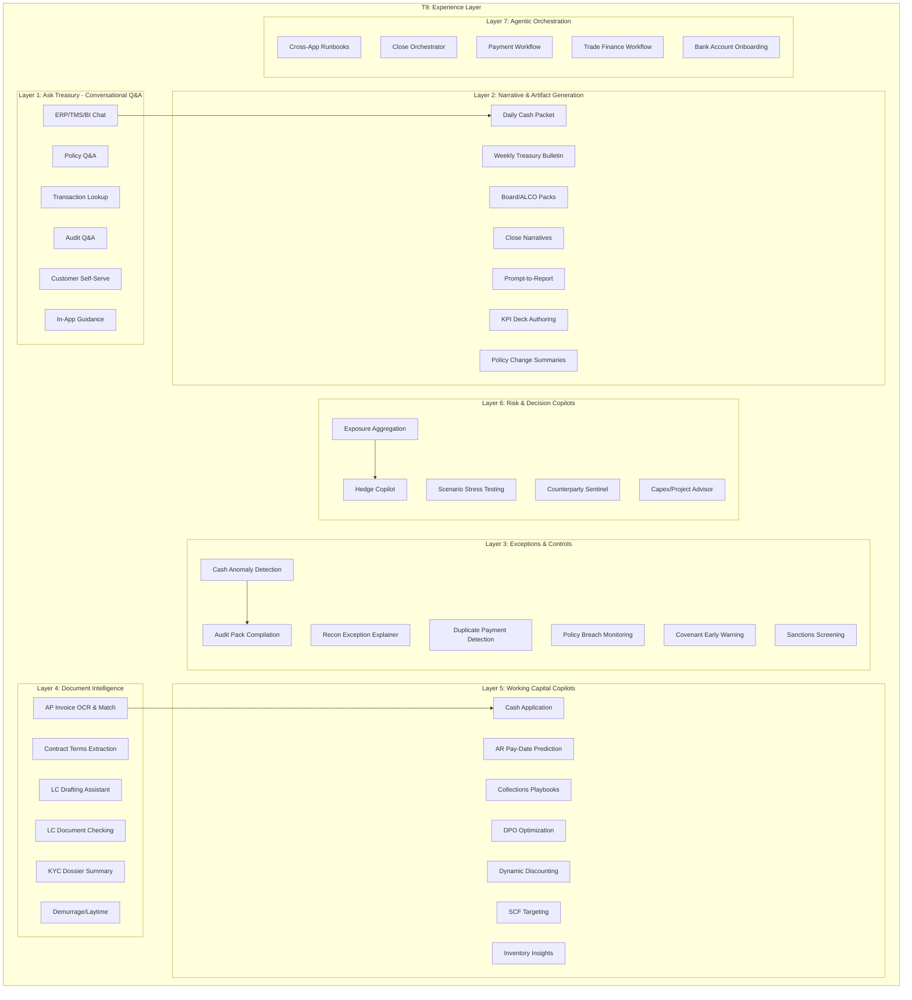

# T9: Experience Layer - Treasury AI Copilots & Intelligent Interfaces

## Overview

The T9 Experience Layer represents user-facing AI copilots that orchestrate data and tools to assist treasury staff. This layer is the primary interface through which treasury teams interact with AI capabilities, providing conversational access to data, automated report generation, intelligent alerts, and guided workflows across all treasury functions (T1-T8).

!!! tip "Human-in-the-Loop Design"

    All T9 copilots follow a **human-in-the-loop** architecture. AI assists with analysis, drafting, and recommendations, but critical decisions—especially those involving payments or risk positions—require explicit human approval before execution.

**Design Philosophy:**
- **LLM as Orchestrator**: The AI acts as an intelligent coordinator and explainer, not a decision-maker
- **Deterministic Data**: All critical numbers come from verified systems (ERP/TMS/BI) - never hallucinated
- **Human-in-the-Loop**: High-risk or money-moving actions require human approval
- **Auditability**: Every AI output includes source citations and reasoning trails

**Key Transformation Themes:**
- **Democratized Insights**: Natural language access to treasury data for all stakeholders
- **Automated Narratives**: AI-generated reports, commentaries, and board packs
- **Proactive Intelligence**: Anomaly detection with explanations and recommended actions
- **Document Understanding**: Extract, validate, and draft trade finance and compliance documents
- **Agentic Workflows**: Multi-step process automation with guardrails



## Layer Architecture

| Layer | Focus Area | Primary AI Techniques | Maturity |
|-------|-----------|----------------------|----------|
| 1 | Ask Treasury - Conversational Q&A | RAG, NL2SQL, semantic search, citations | Now |
| 2 | Narrative & Artifact Generation | LLM summarization, template filling, chart generation | Now |
| 3 | Exceptions & Controls | Anomaly detection, rule engines, alert routing | Now |
| 4 | Document Intelligence | OCR, NLP extraction, document classification | Now |
| 5 | Working Capital Copilots | Predictive ML, segmentation, recommendation engines | Now/Next |
| 6 | Risk & Decision Copilots | Risk aggregation, scenario simulation, optimization | Next |
| 7 | Agentic Orchestration | Multi-agent coordination, workflow automation | Next/Later |

---

## Layer 1: Ask Treasury - Conversational Q&A

### Overview

The "Ask Treasury" layer provides natural language interfaces for querying treasury data, policies, and transactions. Users can ask questions in plain language and receive accurate, sourced answers with supporting evidence. This democratizes access to treasury information across the organization.

**Key Pain Points Addressed:**
- Treasury analysts spending hours finding specific transaction details
- Policy questions requiring senior staff time to answer
- Audit requests taking days to compile evidence
- Customers waiting for balance/invoice information
- New employees struggling to learn treasury procedures

---

### Use Case 1.1: Ask Treasury - Chat over ERP/TMS/BI

#### What It Does
Provides a conversational interface to query treasury data across multiple systems (SAP, TMS, BI tools) using natural language. The copilot translates questions into appropriate queries, retrieves data, and presents answers with charts and drill-down links.

#### Key Inputs
- Natural language questions from users
- Real-time connections to SAP S/4HANA, TMS, BI dashboards
- User role and permission context
- Historical query patterns for optimization

#### AI/LLM Approach
- **NL2SQL/NL2API**: Translates natural language to structured queries
- **RAG (Retrieval Augmented Generation)**: Pulls relevant context from knowledge bases
- **Multi-source federation**: Combines data from multiple systems in one answer
- **Visualization generation**: Auto-creates charts for numerical answers

#### Example Interaction

```
┌─────────────────────────────────────────────────────────────────────────────┐
│ ASK TREASURY COPILOT                                    Treasury Dashboard  │
├─────────────────────────────────────────────────────────────────────────────┤
│                                                                             │
│ USER: What's our total FX exposure to USD right now, and how has it        │
│       changed over the last 3 months?                                      │
│                                                                             │
│ CLAUDE: I'll query our exposure data across all entities and currencies.   │
│                                                                             │
│         CURRENT USD EXPOSURE SUMMARY:                                       │
│         ┌─────────────────────────────────────────────────────────────┐    │
│         │                                                             │    │
│         │  Net USD Exposure: $127.4M LONG                            │    │
│         │  ════════════════════════════════════════════════════════  │    │
│         │                                                             │    │
│         │  Breakdown by Category:                                     │    │
│         │  ┌─────────────────────────────────────────────────────┐   │    │
│         │  │ Category              │ Long ($M)  │ Short ($M) │Net│   │    │
│         │  ├───────────────────────┼────────────┼────────────┼───┤   │    │
│         │  │ Trade Receivables     │   +89.2    │            │+89│   │    │
│         │  │ Trade Payables        │            │   -234.5   │-235   │    │
│         │  │ Crude Oil Commitments │            │   -156.8   │-157   │    │
│         │  │ USD Loans Outstanding │            │   -312.0   │-312   │    │
│         │  │ FX Forwards (Hedges)  │   +741.5   │            │+742   │    │
│         │  │ ────────────────────────────────────────────────────   │    │
│         │  │ NET POSITION          │                         │+127   │    │
│         │  └─────────────────────────────────────────────────────┘   │    │
│         │                                                             │    │
│         └─────────────────────────────────────────────────────────────┘    │
│                                                                             │
│         3-MONTH TREND:                                                      │
│         ┌─────────────────────────────────────────────────────────────┐    │
│         │  $M                                                         │    │
│         │  200 ┤                                                      │    │
│         │  150 ┤                              ████                    │    │
│         │  127 ┤─ ─ ─ ─ ─ ─ ─ ─ ─ ─ ─ ─ ─ ─ ████ ← Current          │    │
│         │  100 ┤              ████           ████                    │    │
│         │   50 ┤    ████     ████           ████                    │    │
│         │    0 ┼────────────────────────────────────────────────    │    │
│         │        Oct         Nov           Dec          Jan          │    │
│         │                                                             │    │
│         │  Key Movements:                                             │    │
│         │  • Oct→Nov: +$52M (new FX forwards for Q1 crude imports)   │    │
│         │  • Nov→Dec: +$31M (year-end receivables increase)          │    │
│         │  • Dec→Jan: -$6M (partial hedge rolloff)                   │    │
│         │                                                             │    │
│         └─────────────────────────────────────────────────────────────┘    │
│                                                                             │
│         📊 Sources: SAP Treasury (TRM), FX Position Report 01/12/2026      │
│         🔗 [Drill to Position Details] [View Hedge Book] [Export]          │
│                                                                             │
│ USER: Which hedges are maturing in the next 30 days?                       │
│                                                                             │
│ CLAUDE: Checking FX forward book for maturities through February 12...     │
│                                                                             │
│         UPCOMING FX FORWARD MATURITIES (Next 30 Days):                      │
│         ┌────────────────────────────────────────────────────────────────┐ │
│         │ Deal#     │ Maturity  │ Buy/Sell │ Amount    │ Rate    │ Bank │ │
│         ├───────────┼───────────┼──────────┼───────────┼─────────┼──────┤ │
│         │ FX-2024-89│ Jan 15    │ Buy USD  │ $45.0M    │ 34.25   │ HSBC │ │
│         │ FX-2024-92│ Jan 22    │ Buy USD  │ $32.5M    │ 34.18   │ Citi │ │
│         │ FX-2024-95│ Jan 31    │ Buy USD  │ $67.8M    │ 34.45   │ JPM  │ │
│         │ FX-2024-98│ Feb 05    │ Sell USD │ $28.0M    │ 34.52   │ HSBC │ │
│         │ FX-2024-99│ Feb 10    │ Buy USD  │ $41.2M    │ 34.38   │ DB   │ │
│         ├───────────┴───────────┴──────────┴───────────┴─────────┴──────┤ │
│         │ TOTAL NET: Buy USD $158.5M                                    │ │
│         │ Weighted Avg Rate: 34.36 TRY/USD                              │ │
│         │ Current Spot: 34.82 TRY/USD                                   │ │
│         │ Unrealized Gain: ~TRY 72.9M ($2.1M)                          │ │
│         └────────────────────────────────────────────────────────────────┘ │
│                                                                             │
│         💡 Note: Jan 15 maturity ($45M) requires settlement instruction    │
│            by Jan 13 EOD. Do you want me to prepare the instruction?       │
│                                                                             │
└─────────────────────────────────────────────────────────────────────────────┘
```

#### Outputs
- Natural language answers with supporting data
- Auto-generated charts and visualizations
- Drill-down links to source systems
- Data export options (Excel, PDF)
- Audit trail of queries and sources

#### KPIs
| Metric | Before | After | Improvement |
|--------|--------|-------|-------------|
| Time to find transaction details | 15-30 min | <1 min | 95% reduction |
| Ad-hoc report requests to IT | 50/month | 10/month | 80% reduction |
| Query response accuracy | N/A | >95% | New capability |
| User self-service rate | 20% | 85% | 4x improvement |

---

### Use Case 1.2: Treasury Policy & Procedure Q&A

#### What It Does
Answers questions about treasury policies, investment limits, approval workflows, and procedures with source citations. Acts as an always-available expert on internal rules, reducing reliance on senior staff memory and ensuring consistent compliance.

#### Key Inputs
- Treasury policy documents (investment, hedging, credit)
- Delegation of authority matrices
- Standard operating procedures (SOPs)
- Regulatory requirements and guidelines
- FAQ database from historical questions

#### AI/LLM Approach
- **RAG with citations**: Every answer includes source document and section
- **Semantic search**: Finds relevant policy sections even with varied terminology
- **Multi-document synthesis**: Combines information from multiple policies
- **Confidence scoring**: Indicates when answers are uncertain or require human verification

#### Example Interaction

```
┌─────────────────────────────────────────────────────────────────────────────┐
│ TREASURY POLICY Q&A COPILOT                              Policy Assistant   │
├─────────────────────────────────────────────────────────────────────────────┤
│                                                                             │
│ USER: What are our counterparty limits for FX hedging with Turkish banks?  │
│                                                                             │
│ CLAUDE: Based on the Treasury Counterparty Policy (v3.2, Section 4.2):     │
│                                                                             │
│         TURKISH BANK FX COUNTERPARTY LIMITS:                                │
│         ┌─────────────────────────────────────────────────────────────┐    │
│         │                                                             │    │
│         │  Tier 1 Banks (Minimum A- Rating):                         │    │
│         │  ┌───────────────────────────────────────────────────────┐ │    │
│         │  │ Bank                │ Single Deal │ Aggregate │ Tenor │ │    │
│         │  ├─────────────────────┼─────────────┼───────────┼───────┤ │    │
│         │  │ İş Bankası          │ $50M        │ $150M     │ 18mo  │ │    │
│         │  │ Garanti BBVA        │ $50M        │ $150M     │ 18mo  │ │    │
│         │  │ Yapı Kredi          │ $40M        │ $120M     │ 12mo  │ │    │
│         │  │ Akbank              │ $40M        │ $120M     │ 12mo  │ │    │
│         │  └───────────────────────────────────────────────────────┘ │    │
│         │                                                             │    │
│         │  Tier 2 Banks (Minimum BBB Rating):                        │    │
│         │  ┌───────────────────────────────────────────────────────┐ │    │
│         │  │ Bank                │ Single Deal │ Aggregate │ Tenor │ │    │
│         │  ├─────────────────────┼─────────────┼───────────┼───────┤ │    │
│         │  │ QNB Finansbank      │ $25M        │ $75M      │ 6mo   │ │    │
│         │  │ Denizbank           │ $25M        │ $75M      │ 6mo   │ │    │
│         │  │ TEB                 │ $20M        │ $60M      │ 6mo   │    │
│         │  └───────────────────────────────────────────────────────┘ │    │
│         │                                                             │    │
│         │  📋 Policy Reference: Treasury_Counterparty_Policy_v3.2    │    │
│         │     Section 4.2 "Derivative Counterparty Limits"           │    │
│         │     Approved: Board Resolution 2024-127 (Oct 15, 2024)     │    │
│         │                                                             │    │
│         └─────────────────────────────────────────────────────────────┘    │
│                                                                             │
│         ⚠️ IMPORTANT NOTES from Policy Section 4.2.3:                       │
│         • Aggregate limits include FX forwards, swaps, and options         │
│         • Limits are per legal entity, not consolidated group              │
│         • Exceeding single deal limit requires Treasurer approval          │
│         • Exceeding aggregate limit requires CFO approval                  │
│                                                                             │
│ USER: Can we do a $60M forward with İş Bankası for 24 months?              │
│                                                                             │
│ CLAUDE: Analyzing against policy limits...                                 │
│                                                                             │
│         ⚠️ POLICY CHECK - TWO ISSUES IDENTIFIED:                           │
│         ┌─────────────────────────────────────────────────────────────┐    │
│         │                                                             │    │
│         │ 1. SINGLE DEAL LIMIT EXCEEDED                               │    │
│         │    • Proposed: $60M                                         │    │
│         │    • Limit: $50M for İş Bankası                            │    │
│         │    • Excess: $10M (20% over limit)                         │    │
│         │    → Requires: Treasurer approval per Section 4.2.5        │    │
│         │                                                             │    │
│         │ 2. TENOR LIMIT EXCEEDED                                     │    │
│         │    • Proposed: 24 months                                    │    │
│         │    • Maximum: 18 months for Tier 1 Turkish banks           │    │
│         │    • Excess: 6 months                                       │    │
│         │    → Requires: CFO approval per Section 4.3.2              │    │
│         │                                                             │    │
│         │ CURRENT UTILIZATION (İş Bankası):                          │    │
│         │    Existing exposure: $78M                                  │    │
│         │    + Proposed deal: $60M                                    │    │
│         │    = New total: $138M (within $150M aggregate limit ✓)     │    │
│         │                                                             │    │
│         └─────────────────────────────────────────────────────────────┘    │
│                                                                             │
│         RECOMMENDED ACTIONS:                                                │
│         1. Split into 2 x $30M deals (both within single deal limit)       │
│         2. Reduce tenor to 18 months if possible                           │
│         3. Or: Obtain Treasurer + CFO approvals for exception              │
│                                                                             │
│         Shall I draft an exception request memo?                           │
│                                                                             │
└─────────────────────────────────────────────────────────────────────────────┘
```

#### Outputs
- Policy answers with exact source citations
- Compliance check results against policy limits
- Exception request templates when limits exceeded
- Links to full policy documents
- Audit log of policy queries

#### KPIs
| Metric | Before | After | Improvement |
|--------|--------|-------|-------------|
| Time to answer policy questions | 10-30 min | <30 sec | 98% reduction |
| Policy compliance errors | 5-10/quarter | <1/quarter | 90% reduction |
| New employee onboarding time | 4-6 weeks | 2-3 weeks | 50% reduction |
| Questions escalated to seniors | 80% | 15% | 80% reduction |

---

### Use Case 1.3: Transaction Lookup Q&A

#### What It Does
Enables natural language queries to find specific transactions (cash movements, invoices, payments, hedges, LCs) with full audit trail and supporting evidence. Replaces manual searches across multiple systems.

#### Key Inputs
- Bank statement transactions
- ERP payment/receipt records
- Trade finance documents (LCs, guarantees)
- Hedge/derivative confirmations
- Invoice and PO data

#### AI/LLM Approach
- **Entity recognition**: Identifies transaction references, amounts, dates, counterparties
- **Cross-system correlation**: Links related transactions across systems
- **Fuzzy matching**: Finds transactions even with approximate search terms
- **Evidence assembly**: Gathers supporting documents automatically

#### Example Interaction

```
┌─────────────────────────────────────────────────────────────────────────────┐
│ TRANSACTION LOOKUP COPILOT                                    Search Mode   │
├─────────────────────────────────────────────────────────────────────────────┤
│                                                                             │
│ USER: Find the payment we made to Vitol around mid-December for the        │
│       crude cargo on the vessel "Suez Max Star"                            │
│                                                                             │
│ CLAUDE: Searching payment records, trade finance, and logistics data...    │
│                                                                             │
│         TRANSACTION FOUND:                                                  │
│         ┌─────────────────────────────────────────────────────────────┐    │
│         │                                                             │    │
│         │  PAYMENT DETAILS                                           │    │
│         │  ═══════════════════════════════════════════════════════   │    │
│         │  Payment Reference: PAY-2024-089234                        │    │
│         │  Payment Date: December 18, 2024                           │    │
│         │  Amount: $42,847,562.00                                    │    │
│         │  Currency: USD                                             │    │
│         │  Beneficiary: Vitol SA                                     │    │
│         │  Bank: HSBC London                                         │    │
│         │  SWIFT Reference: HSBCGB2LXXX241218089234                  │    │
│         │  Value Date: December 19, 2024                             │    │
│         │  Status: ✓ Settled                                         │    │
│         │                                                             │    │
│         └─────────────────────────────────────────────────────────────┘    │
│                                                                             │
│         LINKED DOCUMENTS & TRANSACTIONS:                                    │
│         ┌─────────────────────────────────────────────────────────────┐    │
│         │                                                             │    │
│         │  📄 Commercial Invoice: VI-2024-78234                       │    │
│         │     • Invoice Date: Dec 12, 2024                           │    │
│         │     • Due Date: Dec 19, 2024                               │    │
│         │     • Gross Amount: $42,912,456.00                         │    │
│         │     • Less: Quality discount ($64,894.00)                  │    │
│         │     • Net Amount: $42,847,562.00 ✓                         │    │
│         │                                                             │    │
│         │  🚢 Vessel Details:                                         │    │
│         │     • Vessel: Suez Max Star (IMO: 9876543)                 │    │
│         │     • B/L Number: VITOL-BL-2024-4521                       │    │
│         │     • Load Port: Novorossiysk, Russia                      │    │
│         │     • Discharge: Tüpraş Izmit Terminal                     │    │
│         │     • Quantity: 650,000 BBL Urals Crude                    │    │
│         │     • Discharge Date: Dec 8, 2024                          │    │
│         │                                                             │    │
│         │  📋 Purchase Order: PO-2024-CR-00892                       │    │
│         │     • Contract Reference: Vitol-2024-Term-003              │    │
│         │     • Price: $65.92/BBL (Dated Brent -$2.50)              │    │
│         │                                                             │    │
│         │  🏦 Letter of Credit: LC-2024-0234                         │    │
│         │     • LC Amount: $45,000,000                               │    │
│         │     • Issuing Bank: Garanti BBVA                           │    │
│         │     • Status: Utilized and closed                          │    │
│         │                                                             │    │
│         │  ✅ Quality Certificate: SGS-2024-TUR-8923                 │    │
│         │  ✅ Customs Declaration: TR-IMP-2024-892341                │    │
│         │                                                             │    │
│         └─────────────────────────────────────────────────────────────┘    │
│                                                                             │
│         APPROVAL TRAIL:                                                     │
│         ┌─────────────────────────────────────────────────────────────┐    │
│         │ Step          │ Approver       │ Date       │ Status       │    │
│         ├───────────────┼────────────────┼────────────┼──────────────┤    │
│         │ Invoice Entry │ Ayşe Yılmaz    │ Dec 15     │ ✓ Completed  │    │
│         │ 3-Way Match   │ System Auto    │ Dec 15     │ ✓ Matched    │    │
│         │ Payment Init  │ Mehmet Demir   │ Dec 17     │ ✓ Approved   │    │
│         │ Payment Auth  │ Zeynep Kaya    │ Dec 18     │ ✓ Released   │    │
│         │ Bank Confirm  │ HSBC           │ Dec 19     │ ✓ Settled    │    │
│         └───────────────┴────────────────┴────────────┴──────────────┘    │
│                                                                             │
│         [Download All Documents]  [Export Audit Trail]  [Share]            │
│                                                                             │
└─────────────────────────────────────────────────────────────────────────────┘
```

#### Outputs
- Complete transaction details with all linked records
- Full document chain (invoice, PO, LC, B/L, certificates)
- Approval audit trail
- Downloadable document package
- Cross-referenced accounting entries

#### KPIs
| Metric | Before | After | Improvement |
|--------|--------|-------|-------------|
| Transaction search time | 30-60 min | <2 min | 95% reduction |
| Audit evidence compilation | 2-4 hours | 5 min | 97% reduction |
| Cross-system reconciliation | Manual | Automatic | New capability |
| Missing document rate | 10-15% | <2% | 85% reduction |

---

### Use Case 1.4: Audit Q&A - Evidence Retrieval

#### What It Does
Answers auditor questions by automatically pulling supporting evidence, explanations, and audit trails for any treasury number or decision. Creates "traceable binder" documentation packages on demand.

#### Key Inputs
- Auditor questions or PBC (Prepared by Client) list items
- Financial statement line items
- Transaction records and approvals
- Policy documents and board resolutions
- Historical audit workpapers

#### AI/LLM Approach
- **Question understanding**: Interprets audit queries into data requirements
- **Evidence correlation**: Links assertions to supporting documents
- **Narrative generation**: Explains the "why" behind numbers
- **Completeness checking**: Ensures all required evidence is gathered

#### Example Interaction

```
┌─────────────────────────────────────────────────────────────────────────────┐
│ AUDIT Q&A COPILOT                                         External Audit    │
├─────────────────────────────────────────────────────────────────────────────┤
│                                                                             │
│ AUDITOR: Please provide support for the $234M derivative liability         │
│          on the balance sheet as of December 31, 2024.                     │
│                                                                             │
│ CLAUDE: I'll compile the complete evidence package for the derivative      │
│         liability balance.                                                  │
│                                                                             │
│         DERIVATIVE LIABILITY - BALANCE SHEET SUPPORT:                       │
│         ═══════════════════════════════════════════════════════════════    │
│                                                                             │
│         1. BALANCE COMPOSITION ($234,567,891)                              │
│         ┌─────────────────────────────────────────────────────────────┐    │
│         │ Derivative Type      │ Notional    │ Fair Value  │ % Total │    │
│         ├──────────────────────┼─────────────┼─────────────┼─────────┤    │
│         │ FX Forwards (USD)    │ $892M       │ ($145.2M)   │  61.9%  │    │
│         │ FX Options (USD)     │ $234M       │  ($23.8M)   │  10.1%  │    │
│         │ Commodity Swaps      │ 2.4M BBL    │  ($48.7M)   │  20.8%  │    │
│         │ Interest Rate Swaps  │ $180M       │  ($16.9M)   │   7.2%  │    │
│         ├──────────────────────┼─────────────┼─────────────┼─────────┤    │
│         │ TOTAL                │             │ ($234.6M)   │ 100.0%  │    │
│         └─────────────────────────────────────────────────────────────┘    │
│                                                                             │
│         2. VALUATION METHODOLOGY                                            │
│         ┌─────────────────────────────────────────────────────────────┐    │
│         │                                                             │    │
│         │ FX Forwards & Options:                                      │    │
│         │ • Method: Discounted cash flow using market forward rates   │    │
│         │ • Source: Bloomberg BFIX rates as of Dec 31, 2024 16:00 GMT│    │
│         │ • Discount curves: OIS curves from Bloomberg               │    │
│         │ • Reference: IFRS 13 Level 2 inputs                        │    │
│         │                                                             │    │
│         │ Commodity Swaps:                                            │    │
│         │ • Method: DCF using ICE Brent forward curve                │    │
│         │ • Source: ICE settlement prices Dec 31, 2024               │    │
│         │ • Reference: Hedge accounting per IFRS 9                   │    │
│         │                                                             │    │
│         │ Interest Rate Swaps:                                        │    │
│         │ • Method: DCF using USD SOFR curve                         │    │
│         │ • Source: Bloomberg SOFR curve Dec 31, 2024                │    │
│         │                                                             │    │
│         └─────────────────────────────────────────────────────────────┘    │
│                                                                             │
│         3. SUPPORTING EVIDENCE PACKAGE                                      │
│         ┌─────────────────────────────────────────────────────────────┐    │
│         │                                                             │    │
│         │  📊 Derivative Position Report (SAP TRM)                    │    │
│         │     → Download: Deriv_Position_20241231.xlsx               │    │
│         │                                                             │    │
│         │  📈 Bloomberg Valuation Screenshots                         │    │
│         │     → USDTRY_Fwd_Curve_20241231.pdf                        │    │
│         │     → Brent_Fwd_Curve_20241231.pdf                         │    │
│         │     → SOFR_Curve_20241231.pdf                              │    │
│         │                                                             │    │
│         │  📋 Bank Confirmations (12 documents)                       │    │
│         │     → HSBC_Confirm_FX_Dec24.pdf                            │    │
│         │     → Citi_Confirm_Swap_Dec24.pdf                          │    │
│         │     → [10 more confirmations...]                           │    │
│         │                                                             │    │
│         │  📝 Valuation Memo (Treasury)                               │    │
│         │     → Derivative_Valuation_Memo_Q4_2024.docx               │    │
│         │                                                             │    │
│         │  ✅ Independent Valuation (KPMG)                            │    │
│         │     → KPMG_Deriv_Val_Review_Dec24.pdf                      │    │
│         │                                                             │    │
│         └─────────────────────────────────────────────────────────────┘    │
│                                                                             │
│         4. RECONCILIATION TO GL                                             │
│         ┌─────────────────────────────────────────────────────────────┐    │
│         │ SAP TRM Fair Value          │         ($234,567,891)       │    │
│         │ GL Account 2340100          │         ($234,567,891)       │    │
│         │ ─────────────────────────────────────────────────────────   │    │
│         │ Difference                  │                    $0  ✓     │    │
│         └─────────────────────────────────────────────────────────────┘    │
│                                                                             │
│         [Download Complete Audit Package (47 files, 23MB)]                 │
│                                                                             │
└─────────────────────────────────────────────────────────────────────────────┘
```

#### Outputs
- Complete evidence packages with all supporting documents
- Balance reconciliations and roll-forwards
- Valuation methodology explanations
- Bank confirmations and third-party evidence
- GL-to-subledger reconciliations

#### KPIs
| Metric | Before | After | Improvement |
|--------|--------|-------|-------------|
| PBC item response time | 2-5 days | <4 hours | 90% reduction |
| Audit support FTE | 2-3 FTE during audit | 0.5 FTE | 75% reduction |
| Missing evidence findings | 5-10/audit | <2/audit | 80% reduction |
| Auditor satisfaction | 3.2/5 | 4.5/5 | 40% improvement |

---

### Use Case 1.5: Customer Self-Service Portal

#### What It Does
Enables external customers (B2B) to self-serve balance inquiries, invoice status, payment history, and promise-to-pay submissions through a conversational interface, reducing AR team workload.

#### Key Inputs
- Customer AR balances and aging
- Invoice details and status
- Payment history
- Customer credit terms
- Promise-to-pay records

#### AI/LLM Approach
- **Identity verification**: Secure customer authentication
- **Natural language understanding**: Interprets customer queries
- **Personalized responses**: Uses customer-specific context
- **Action enablement**: Allows promise-to-pay submissions and payment links

#### Example Interaction

```
┌─────────────────────────────────────────────────────────────────────────────┐
│ CUSTOMER SELF-SERVICE PORTAL                      Customer: Opet Petrolcülük│
├─────────────────────────────────────────────────────────────────────────────┤
│                                                                             │
│ CUSTOMER: What invoices do we have outstanding and when are they due?      │
│                                                                             │
│ COPILOT: Good morning! Here's your current account summary with Tüpraş:    │
│                                                                             │
│         ACCOUNT SUMMARY - OPET PETROLCÜLÜK A.Ş.                            │
│         ┌─────────────────────────────────────────────────────────────┐    │
│         │                                                             │    │
│         │  Total Outstanding: TRY 45,234,567.00                       │    │
│         │  Credit Limit: TRY 75,000,000.00                            │    │
│         │  Available Credit: TRY 29,765,433.00                        │    │
│         │  Payment Terms: Net 30 days                                 │    │
│         │                                                             │    │
│         └─────────────────────────────────────────────────────────────┘    │
│                                                                             │
│         OUTSTANDING INVOICES:                                               │
│         ┌────────────────────────────────────────────────────────────────┐ │
│         │ Invoice#    │ Date     │ Due Date │ Amount (TRY)  │ Status    │ │
│         ├─────────────┼──────────┼──────────┼───────────────┼───────────┤ │
│         │ INV-892341  │ Dec 15   │ Jan 14   │  18,456,000   │ Current   │ │
│         │ INV-891234  │ Dec 08   │ Jan 07   │  12,345,000   │ ⚠️ Due    │ │
│         │ INV-890123  │ Dec 01   │ Dec 31   │  14,433,567   │ 🔴 Overdue│ │
│         ├─────────────┴──────────┴──────────┴───────────────┴───────────┤ │
│         │ TOTAL                             TRY 45,234,567              │ │
│         └────────────────────────────────────────────────────────────────┘ │
│                                                                             │
│         ⚠️ You have 1 overdue invoice (TRY 14.4M, 12 days past due)        │
│                                                                             │
│ CUSTOMER: We're having a temporary cash flow issue. Can we arrange to      │
│           pay INV-890123 next Friday (January 17)?                         │
│                                                                             │
│ COPILOT: I can help you set up a Promise to Pay for that invoice.          │
│                                                                             │
│         PROMISE TO PAY REQUEST:                                             │
│         ┌─────────────────────────────────────────────────────────────┐    │
│         │                                                             │    │
│         │  Invoice: INV-890123                                        │    │
│         │  Amount: TRY 14,433,567.00                                  │    │
│         │  Original Due: December 31, 2024                            │    │
│         │  Promised Date: January 17, 2025                            │    │
│         │  Extension Days: 17 days                                    │    │
│         │                                                             │    │
│         │  Note: This is within your approved extension limit of      │    │
│         │  30 days. No additional approval required.                  │    │
│         │                                                             │    │
│         │  [Confirm Promise to Pay]  [Cancel]                         │    │
│         │                                                             │    │
│         └─────────────────────────────────────────────────────────────┘    │
│                                                                             │
│ CUSTOMER: [Clicks Confirm Promise to Pay]                                  │
│                                                                             │
│ COPILOT: ✅ Promise to Pay confirmed!                                       │
│                                                                             │
│         Your reference: PTP-2025-001234                                    │
│         A confirmation email has been sent to accounting@opet.com.tr       │
│                                                                             │
│         🔗 QUICK PAYMENT OPTIONS:                                           │
│         • Wire Transfer: [View Bank Details]                               │
│         • Online Payment: [Pay Now via Bank Link]                          │
│                                                                             │
│         Need anything else? You can also:                                  │
│         • Download invoice copies                                          │
│         • View payment history                                             │
│         • Update contact information                                       │
│                                                                             │
└─────────────────────────────────────────────────────────────────────────────┘
```

#### Outputs
- Real-time balance and invoice information
- Promise-to-pay confirmations
- Payment instruction details
- Invoice PDF downloads
- Payment history reports

#### KPIs
| Metric | Before | After | Improvement |
|--------|--------|-------|-------------|
| Customer inquiry calls | 200/month | 40/month | 80% reduction |
| Query response time | 24-48 hours | Instant | 99% reduction |
| AR team inquiry handling | 40% of time | 10% of time | 75% reduction |
| Customer satisfaction | 3.5/5 | 4.6/5 | 31% improvement |

---

### Use Case 1.6: In-App "How Do I..." Guidance

#### What It Does
Provides contextual help within treasury applications, guiding users through complex workflows with step-by-step instructions, tips, and automated assistance. Acts as an embedded expert for SAP, TMS, and other treasury systems.

#### Key Inputs
- Current application context (screen, transaction type)
- User role and permission level
- Standard operating procedures
- Training materials and guides
- Common error patterns

#### AI/LLM Approach
- **Context awareness**: Understands current application state
- **Procedural guidance**: Provides step-by-step instructions
- **Error anticipation**: Warns about common mistakes
- **Auto-fill assistance**: Suggests field values based on context

#### Example Interaction

```
┌─────────────────────────────────────────────────────────────────────────────┐
│ SAP TREASURY (TRM) - IN-APP GUIDANCE                     FX Deal Entry     │
├─────────────────────────────────────────────────────────────────────────────┤
│                                                                             │
│ USER: [Clicks Help icon] How do I enter an FX forward with a non-standard │
│       settlement date?                                                     │
│                                                                             │
│ GUIDANCE COPILOT:                                                          │
│                                                                             │
│ HOW TO: Enter FX Forward with Broken Date Settlement                       │
│ ════════════════════════════════════════════════════════════════════════   │
│                                                                             │
│ I see you're on the FX Deal Entry screen (TRM-FX-001). Here's how to       │
│ enter a forward with a non-standard (broken) date:                         │
│                                                                             │
│ STEP-BY-STEP:                                                               │
│ ┌─────────────────────────────────────────────────────────────────────┐    │
│ │                                                                     │    │
│ │ Step 1: Product Type Selection                                      │    │
│ │ ────────────────────────────                                        │    │
│ │ • Select "FX Forward" from the Product dropdown                     │    │
│ │ • Check "Non-Standard Settlement" checkbox                          │    │
│ │   → This enables the broken date fields                            │    │
│ │   [Show me where ▶]                                                │    │
│ │                                                                     │    │
│ │ Step 2: Settlement Date Entry                                       │    │
│ │ ──────────────────────────                                          │    │
│ │ • Enter your specific settlement date in DD/MM/YYYY format          │    │
│ │ • System will calculate the forward points automatically            │    │
│ │ • ⚠️ Note: Must be a valid business day (not weekend/holiday)      │    │
│ │   [Show me where ▶]                                                │    │
│ │                                                                     │    │
│ │ Step 3: Rate Verification                                           │    │
│ │ ─────────────────────                                               │    │
│ │ • For broken dates, forward rate is interpolated                    │    │
│ │ • Verify rate against Bloomberg/Reuters quote                       │    │
│ │ • Tolerance check: ±0.5% of mid-market rate                        │    │
│ │   [Show calculation ▶]                                             │    │
│ │                                                                     │    │
│ │ Step 4: Approval Routing                                            │    │
│ │ ────────────────────                                                │    │
│ │ • Broken date deals >$10M require Treasurer approval               │    │
│ │ • System will auto-route based on deal amount                      │    │
│ │                                                                     │    │
│ └─────────────────────────────────────────────────────────────────────┘    │
│                                                                             │
│ 💡 PRO TIP:                                                                 │
│ For frequently used broken dates (e.g., crude cargo discharge dates),      │
│ you can save a template to speed up entry. Would you like me to show       │
│ you how to create a deal template?                                         │
│                                                                             │
│ ⚠️ COMMON MISTAKES TO AVOID:                                               │
│ • Don't enter holidays - system will reject (check calendar first)         │
│ • Ensure counterparty has matching value date capability                   │
│ • Broken dates may have wider bid-ask spread - get competitive quote       │
│                                                                             │
│ [Start Guided Entry]  [Watch Video Tutorial]  [Contact Treasury Help]      │
│                                                                             │
└─────────────────────────────────────────────────────────────────────────────┘
```

#### Outputs
- Step-by-step contextual guidance
- Visual highlighting of relevant fields
- Common error warnings
- Links to detailed documentation
- Video tutorial references

#### KPIs
| Metric | Before | After | Improvement |
|--------|--------|-------|-------------|
| Help desk tickets | 150/month | 45/month | 70% reduction |
| User training time | 5 days | 2 days | 60% reduction |
| Transaction entry errors | 8% | 2% | 75% reduction |
| Time to proficiency | 3 months | 1 month | 67% reduction |

---

## Layer 2: Narrative & Artifact Generation

### Overview

This layer automates the creation of treasury reports, bulletins, and presentations by generating narrative commentary, charts, and formatted documents from underlying data. The AI understands context, identifies key variances, and produces executive-ready content.

**Key Pain Points Addressed:**
- Analysts spending 60% of time on report formatting vs. analysis
- Inconsistent narrative quality across reports
- Delayed distribution of market updates and cash reports
- Manual copy-paste errors in board presentations
- Repetitive weekly/monthly reporting cycles

---

### Use Case 2.1: Daily Cash Packet Narrative

#### What It Does
Automatically generates the daily cash position report with narrative explanations of variances, key movements, and liquidity status. Replaces manual compilation and provides consistent, insightful commentary every morning.

#### Key Inputs
- Multi-bank balance feeds (MT940/API)
- Cash forecast from prior day
- Payment/receipt schedules
- Prior period comparatives
- Significant transaction details

#### AI/LLM Approach
- **Variance detection**: Identifies forecast vs. actual deviations
- **Root cause analysis**: Links variances to specific transactions
- **Narrative generation**: Creates executive-ready commentary
- **Visualization**: Auto-generates cash position charts

#### Example Interaction

```
┌─────────────────────────────────────────────────────────────────────────────┐
│ DAILY CASH PACKET GENERATOR                             January 12, 2026    │
├─────────────────────────────────────────────────────────────────────────────┤
│                                                                             │
│ [Auto-generated at 08:00 AM - Ready for Distribution]                      │
│                                                                             │
│ ═══════════════════════════════════════════════════════════════════════════│
│                     TÜPRAŞ TREASURY - DAILY CASH REPORT                     │
│                            January 12, 2026                                 │
│ ═══════════════════════════════════════════════════════════════════════════│
│                                                                             │
│ EXECUTIVE SUMMARY                                                           │
│ ─────────────────                                                           │
│ Opening cash is $127.4M, which is $8.2M BELOW yesterday's forecast.        │
│ The variance is primarily due to an unplanned $6.5M tax payment to         │
│ the Revenue Administration and a delayed $2.1M receipt from Opet.          │
│ Liquidity remains adequate with 1.4x coverage of this week's               │
│ committed outflows. No action required.                                    │
│                                                                             │
│ CASH POSITION BY CURRENCY                                                   │
│ ┌─────────────────────────────────────────────────────────────────────┐    │
│ │                                                                     │    │
│ │  Currency │ Yesterday  │ Forecast   │ Actual    │ Variance │ %     │    │
│ │  ─────────┼────────────┼────────────┼───────────┼──────────┼─────  │    │
│ │  USD      │  $89.2M    │  $94.5M    │  $87.3M   │  ($7.2M) │ -7.6% │    │
│ │  EUR      │  €12.4M    │  €13.1M    │  €12.8M   │  (€0.3M) │ -2.3% │    │
│ │  TRY      │  ₺892M     │  ₺915M     │  ₺901M    │  (₺14M)  │ -1.5% │    │
│ │  GBP      │  £4.2M     │  £4.5M     │  £4.3M    │  (£0.2M) │ -4.4% │    │
│ │  ─────────┼────────────┼────────────┼───────────┼──────────┼─────  │    │
│ │  Total($) │  $118.5M   │  $135.6M   │  $127.4M  │  ($8.2M) │ -6.0% │    │
│ │                                                                     │    │
│ └─────────────────────────────────────────────────────────────────────┘    │
│                                                                             │
│ KEY VARIANCE DRIVERS                                                        │
│ ┌─────────────────────────────────────────────────────────────────────┐    │
│ │                                                                     │    │
│ │  ▼ NEGATIVE VARIANCES                                               │    │
│ │                                                                     │    │
│ │  1. Unplanned Tax Payment (-$6.5M)                                 │    │
│ │     • Description: Withholding tax on Q4 dividend payment          │    │
│ │     • Payee: Gelir İdaresi Başkanlığı                             │    │
│ │     • Reference: TAX-2026-00123                                    │    │
│ │     • Why missed: Not in forecast - notification received late     │    │
│ │     → Action: Finance to update tax calendar                       │    │
│ │                                                                     │    │
│ │  2. Delayed Customer Receipt (-$2.1M)                              │    │
│ │     • Customer: Opet Petrolcülük A.Ş.                              │    │
│ │     • Invoice: INV-892341 (Due Jan 11)                             │    │
│ │     • Status: Promise to Pay received - Jan 13                     │    │
│ │     → Action: Collections team to confirm                          │    │
│ │                                                                     │    │
│ │  ▲ POSITIVE VARIANCES                                               │    │
│ │                                                                     │    │
│ │  1. Early Supplier Payment Avoided (+$0.4M)                        │    │
│ │     • Supplier: SOCAR Trading                                      │    │
│ │     • Scheduled payment deferred to Jan 15 per terms               │    │
│ │                                                                     │    │
│ └─────────────────────────────────────────────────────────────────────┘    │
│                                                                             │
│ 7-DAY CASH LADDER                                                           │
│ ┌─────────────────────────────────────────────────────────────────────┐    │
│ │  $M                                                                 │    │
│ │  150 ┤     ┌───┐                                                   │    │
│ │  127 ┼─────┤   ├───┬───┐                   ← Minimum: $98M         │    │
│ │  100 ┤─ ─ ─│   │   │   ├───┬───┐           ← Safety Buffer: $80M   │    │
│ │   80 ┤ - - ┼ - ┼ - ┼ - ┼ - ┼ - ┼ - - - - - - - - - - - - - - - - - │    │
│ │   50 ┤     │   │   │   │   │   │                                   │    │
│ │    0 ┼─────┴───┴───┴───┴───┴───┴────────                          │    │
│ │        Mon  Tue  Wed  Thu  Fri  Sat  Sun                           │    │
│ │        127  142  115   98  103  108  112                           │    │
│ │                        ▲                                            │    │
│ │                   Crude payment $45M                                │    │
│ │                                                                     │    │
│ │  ⚠️ Thursday approaches safety buffer - monitor closely            │    │
│ │                                                                     │    │
│ └─────────────────────────────────────────────────────────────────────┘    │
│                                                                             │
│ LIQUIDITY METRICS                                                           │
│ ┌─────────────────────────────────────────────────────────────────────┐    │
│ │  Metric                        │ Value    │ Threshold │ Status     │    │
│ │  ──────────────────────────────┼──────────┼───────────┼────────────│    │
│ │  Cash / 7-day outflows         │ 1.4x     │ >1.2x     │ ✓ OK       │    │
│ │  Days Cash on Hand             │ 12 days  │ >7 days   │ ✓ OK       │    │
│ │  Available Credit Lines        │ $340M    │ >$100M    │ ✓ OK       │    │
│ │  FX Concentration (USD)        │ 68%      │ <80%      │ ✓ OK       │    │
│ └─────────────────────────────────────────────────────────────────────┘    │
│                                                                             │
│ ═══════════════════════════════════════════════════════════════════════════│
│ Report generated by Treasury AI Copilot at 08:00 AM                        │
│ Data sources: SAP TRM, Bloomberg, Garanti/HSBC/Citi bank feeds             │
│ [Distribute to Treasury Team]  [Export PDF]  [Edit Before Send]            │
│ ═══════════════════════════════════════════════════════════════════════════│
│                                                                             │
└─────────────────────────────────────────────────────────────────────────────┘
```

#### Outputs
- Formatted daily cash report (PDF/Email)
- Executive summary with key variances
- 7-day cash ladder with alerts
- Liquidity metric dashboard
- Drill-down links to source transactions

#### KPIs
| Metric | Before | After | Improvement |
|--------|--------|-------|-------------|
| Report preparation time | 2-3 hours | 5 minutes | 97% reduction |
| Report distribution time | 10:30 AM | 08:15 AM | 2+ hours earlier |
| Variance explanations | 60% covered | 95% covered | 58% improvement |
| Forecast accuracy visibility | Quarterly | Daily | New capability |

---

### Use Case 2.2: Weekly Treasury Bulletin / Market Commentary

#### What It Does
Generates a weekly treasury market bulletin summarizing FX rates, interest rates, oil/crack spreads, and key market events with "so what" analysis for Tüpraş's specific positioning. Distributed to treasury, finance leadership, and operations.

#### Key Inputs
- Market data feeds (FX, rates, commodities)
- Tüpraş exposure and hedge positions
- News/events affecting markets
- Prior week's bulletin for continuity
- Refining margin data

#### AI/LLM Approach
- **Market data synthesis**: Aggregates multi-source market information
- **Contextual analysis**: Relates market moves to Tüpraş exposures
- **"So What" generation**: Creates actionable insights, not just data
- **Trend identification**: Highlights significant patterns

#### Example Interaction

```
┌─────────────────────────────────────────────────────────────────────────────┐
│ WEEKLY TREASURY BULLETIN                          Week of January 6-10, 2026│
├─────────────────────────────────────────────────────────────────────────────┤
│                                                                             │
│ ═══════════════════════════════════════════════════════════════════════════│
│                    TÜPRAŞ HAZINE HAFTALIK BÜLTENİ                           │
│                      Weekly Treasury Bulletin                               │
│                        January 6-10, 2026                                   │
│ ═══════════════════════════════════════════════════════════════════════════│
│                                                                             │
│ THIS WEEK AT A GLANCE                                                       │
│ ─────────────────────                                                       │
│ Markets saw significant volatility this week following OPEC+ production    │
│ cut announcements and stronger-than-expected US employment data. Brent     │
│ crude rose 4.2% while USD strengthened against EM currencies including     │
│ TRY. Refining margins remained under pressure with crack spreads           │
│ compressing further.                                                        │
│                                                                             │
│ KEY MARKET MOVES                                                            │
│ ┌─────────────────────────────────────────────────────────────────────┐    │
│ │                                                                     │    │
│ │  FX RATES                                                           │    │
│ │  ┌──────────────┬──────────┬──────────┬──────────┬────────────────┐│    │
│ │  │ Pair         │ Week Open│ Week Close│ Change   │ YTD Change    ││    │
│ │  ├──────────────┼──────────┼──────────┼──────────┼────────────────┤│    │
│ │  │ USD/TRY      │ 34.52    │ 34.89    │ +1.07%   │ +2.3%         ││    │
│ │  │ EUR/TRY      │ 37.84    │ 38.12    │ +0.74%   │ +1.8%         ││    │
│ │  │ EUR/USD      │ 1.0962   │ 1.0926   │ -0.33%   │ -0.5%         ││    │
│ │  └──────────────┴──────────┴──────────┴──────────┴────────────────┘│    │
│ │                                                                     │    │
│ │  📌 SO WHAT FOR TÜPRAŞ:                                            │    │
│ │  • TRY depreciation increases our USD crude import cost            │    │
│ │  • However, 72% of Q1 USD exposure is hedged at avg 34.25          │    │
│ │  • Net unhedged exposure of $127M sees ~$1.3M mark-to-market loss  │    │
│ │  • RECOMMENDATION: Consider opportunistic hedges if USD/TRY <34.50 │    │
│ │                                                                     │    │
│ └─────────────────────────────────────────────────────────────────────┘    │
│                                                                             │
│ ┌─────────────────────────────────────────────────────────────────────┐    │
│ │                                                                     │    │
│ │  COMMODITY PRICES                                                   │    │
│ │  ┌──────────────┬──────────┬──────────┬──────────┬────────────────┐│    │
│ │  │ Product      │ Week Open│ Week Close│ Change   │ 30-Day Trend  ││    │
│ │  ├──────────────┼──────────┼──────────┼──────────┼────────────────┤│    │
│ │  │ Brent Crude  │ $76.42   │ $79.63   │ +4.20%   │ ▲ +8.2%       ││    │
│ │  │ WTI Crude    │ $71.89   │ $75.12   │ +4.49%   │ ▲ +7.8%       ││    │
│ │  │ Gasoline     │ $2.34/gal│ $2.41/gal│ +2.99%   │ ▲ +5.4%       ││    │
│ │  │ Diesel       │ $2.67/gal│ $2.72/gal│ +1.87%   │ ▲ +3.2%       ││    │
│ │  │ Naphtha      │ $678/MT  │ $692/MT  │ +2.06%   │ ▲ +4.1%       ││    │
│ │  └──────────────┴──────────┴──────────┴──────────┴────────────────┘│    │
│ │                                                                     │    │
│ │  📌 SO WHAT FOR TÜPRAŞ:                                            │    │
│ │  • Higher crude prices increase working capital needs by ~$15M     │    │
│ │  • Q1 crude purchases 45% hedged at avg $74.50 (current: $79.63)  │    │
│ │  • Inventory gain of ~$8M on 2.1M BBL crude stock                  │    │
│ │  • Consider additional hedges given supply risk premium            │    │
│ │                                                                     │    │
│ └─────────────────────────────────────────────────────────────────────┘    │
│                                                                             │
│ ┌─────────────────────────────────────────────────────────────────────┐    │
│ │                                                                     │    │
│ │  REFINING MARGINS (CRACK SPREADS)                                   │    │
│ │  ┌──────────────┬──────────┬──────────┬──────────┬────────────────┐│    │
│ │  │ Spread       │ Week Open│ Week Close│ Change   │ vs. 5Y Avg    ││    │
│ │  ├──────────────┼──────────┼──────────┼──────────┼────────────────┤│    │
│ │  │ Med Gasoline │ $12.40   │ $11.20   │ -9.68%   │ -22% below    ││    │
│ │  │ Med Diesel   │ $18.90   │ $17.60   │ -6.88%   │ -15% below    ││    │
│ │  │ 3-2-1 Crack  │ $14.50   │ $13.10   │ -9.66%   │ -18% below    ││    │
│ │  └──────────────┴──────────┴──────────┴──────────┴────────────────┘│    │
│ │                                                                     │    │
│ │  ⚠️ MARGIN ALERT: Crack spreads continue to compress               │    │
│ │                                                                     │    │
│ │  📌 SO WHAT FOR TÜPRAŞ:                                            │    │
│ │  • Q1 refining margin forecast reduced by $35M vs. budget          │    │
│ │  • Cash flow impact: Operating cash flow ~$25M lower than plan     │    │
│ │  • No crack spread hedges recommended at current depressed levels  │    │
│ │  • Monitor for recovery signals before Q2 hedging decisions        │    │
│ │                                                                     │    │
│ └─────────────────────────────────────────────────────────────────────┘    │
│                                                                             │
│ MARKET EVENTS & NEWS                                                        │
│ ┌─────────────────────────────────────────────────────────────────────┐    │
│ │                                                                     │    │
│ │  📰 KEY EVENTS THIS WEEK:                                          │    │
│ │                                                                     │    │
│ │  • OPEC+ announced surprise 500K bpd cut effective February        │    │
│ │    → Brent spiked $2.80 on announcement (Wed)                      │    │
│ │    → Supply tightening supports crude but pressures margins        │    │
│ │                                                                     │    │
│ │  • US Non-Farm Payrolls: +256K vs. +165K expected                  │    │
│ │    → Fed rate cut expectations pushed back to June                 │    │
│ │    → USD strengthened across board                                 │    │
│ │                                                                     │    │
│ │  • TCMB held rates at 45% as expected                              │    │
│ │    → TRY volatility subsided after decision                        │    │
│ │    → Market expects first cut in Q2 2026                           │    │
│ │                                                                     │    │
│ │  📅 UPCOMING EVENTS:                                               │    │
│ │  • Jan 15: US CPI Release (potential USD volatility)               │    │
│ │  • Jan 16: ECB Meeting (rate hold expected)                        │    │
│ │  • Jan 20: China Q4 GDP (oil demand signals)                       │    │
│ │                                                                     │    │
│ └─────────────────────────────────────────────────────────────────────┘    │
│                                                                             │
│ TREASURY ACTIONS & RECOMMENDATIONS                                          │
│ ┌─────────────────────────────────────────────────────────────────────┐    │
│ │                                                                     │    │
│ │  ACTION ITEMS FOR COMING WEEK:                                      │    │
│ │                                                                     │    │
│ │  1. FX HEDGING                                               [HIGH] │    │
│ │     Review Feb-Mar USD requirements vs. hedge coverage              │    │
│ │     Current gap: $42M unhedged → Target: <$20M                     │    │
│ │                                                                     │    │
│ │  2. LIQUIDITY PLANNING                                       [MED]  │    │
│ │     Higher crude prices increasing WC needs                         │    │
│ │     Ensure credit lines availability confirmed                      │    │
│ │                                                                     │    │
│ │  3. MARGIN MONITORING                                        [INFO] │    │
│ │     Continue watching crack spread recovery signals                 │    │
│ │     Q2 hedge decision by Feb 15                                    │    │
│ │                                                                     │    │
│ └─────────────────────────────────────────────────────────────────────┘    │
│                                                                             │
│ ═══════════════════════════════════════════════════════════════════════════│
│ Prepared by: Treasury AI Copilot | Reviewed by: Treasury Team              │
│ Distribution: Treasury, CFO Office, Operations Finance                     │
│ [Export to PowerPoint]  [Email to Distribution List]  [Archive]            │
│ ═══════════════════════════════════════════════════════════════════════════│
│                                                                             │
└─────────────────────────────────────────────────────────────────────────────┘
```

#### Outputs
- Weekly market bulletin (PDF/PowerPoint)
- Market data tables with trends
- "So What" analysis specific to Tüpraş
- Action item recommendations
- Distribution-ready format

#### KPIs
| Metric | Before | After | Improvement |
|--------|--------|-------|-------------|
| Bulletin preparation time | 4-6 hours | 30 minutes | 90% reduction |
| Coverage of market events | 60-70% | 95%+ | 40% improvement |
| Distribution timing | Monday PM | Monday 8 AM | Same-day delivery |
| Reader engagement | 45% open rate | 78% open rate | 73% improvement |

---

### Use Case 2.3: Board Pack / ALCO Pack Authoring

#### What It Does
Generates executive summaries, highlights, and narrative sections for Board and ALCO (Asset Liability Committee) presentations. Pulls key metrics, identifies significant changes, and drafts professional executive commentary.

#### Key Inputs
- Treasury KPIs and metrics
- Risk position summaries
- Liquidity and funding status
- Hedge effectiveness reports
- Prior period board packs for consistency

#### AI/LLM Approach
- **Executive summarization**: Distills complex data into board-ready language
- **Highlight identification**: Automatically flags significant changes
- **Template population**: Fills standard board pack templates
- **Comparative analysis**: Shows period-over-period changes

#### Example Interaction

```
┌─────────────────────────────────────────────────────────────────────────────┐
│ BOARD PACK GENERATOR                                        Q4 2024 Board   │
├─────────────────────────────────────────────────────────────────────────────┤
│                                                                             │
│ USER: Generate the Treasury section for the Q4 2024 Board Pack.            │
│       Focus on liquidity, FX risk, and any limit breaches.                 │
│                                                                             │
│ CLAUDE: Generating Treasury Board Pack section...                          │
│                                                                             │
│ ═══════════════════════════════════════════════════════════════════════════│
│               TREASURY REPORT - Q4 2024 BOARD MEETING                       │
│ ═══════════════════════════════════════════════════════════════════════════│
│                                                                             │
│ EXECUTIVE SUMMARY                                                           │
│ ━━━━━━━━━━━━━━━━━                                                          │
│ Treasury performance in Q4 2024 was solid despite challenging market       │
│ conditions. Liquidity remained robust throughout the quarter with          │
│ average cash coverage of 1.6x committed outflows. FX hedging program       │
│ delivered $12.4M in realized gains, offsetting TRY depreciation impact.    │
│ No policy limit breaches occurred during the period.                       │
│                                                                             │
│ KEY HIGHLIGHTS                                                              │
│ ┌─────────────────────────────────────────────────────────────────────┐    │
│ │                                                                     │    │
│ │  ✓ LIQUIDITY: Strong position maintained                           │    │
│ │    • Average cash balance: $142M (vs. $128M in Q3)                 │    │
│ │    • Available credit facilities: $450M undrawn                    │    │
│ │    • No liquidity stress events                                    │    │
│ │                                                                     │    │
│ │  ✓ FX RISK: Well managed within policy                             │    │
│ │    • USD exposure 78% hedged (policy min: 60%)                     │    │
│ │    • Realized hedge gains: $12.4M                                  │    │
│ │    • VaR utilization: 67% of limit                                 │    │
│ │                                                                     │    │
│ │  ⚠️ ATTENTION: Refining margin compression                          │    │
│ │    • Crack spread hedge P&L: -$8.2M unrealized                     │    │
│ │    • Q1 2025 exposure under review                                 │    │
│ │                                                                     │    │
│ │  ✓ COMPLIANCE: Full adherence                                       │    │
│ │    • Zero policy breaches                                          │    │
│ │    • All covenants met with headroom                               │    │
│ │                                                                     │    │
│ └─────────────────────────────────────────────────────────────────────┘    │
│                                                                             │
│ LIQUIDITY POSITION                                                          │
│ ┌─────────────────────────────────────────────────────────────────────┐    │
│ │                                                                     │    │
│ │  Metric                    │ Q4 2024  │ Q3 2024  │ Change │ Limit   │    │
│ │  ─────────────────────────────────────────────────────────────────  │    │
│ │  Cash & Equivalents        │ $156M    │ $134M    │ +16%   │ N/A     │    │
│ │  Available Credit Lines    │ $450M    │ $450M    │ -      │ N/A     │    │
│ │  Total Liquidity           │ $606M    │ $584M    │ +4%    │ >$200M  │    │
│ │  Cash/30-Day Outflows      │ 1.8x     │ 1.5x     │ +20%   │ >1.2x   │    │
│ │  Days Cash on Hand         │ 18 days  │ 14 days  │ +29%   │ >7 days │    │
│ │                                                                     │    │
│ │  Commentary: Strong year-end position driven by accelerated        │    │
│ │  customer collections and deferred supplier payments.              │    │
│ │                                                                     │    │
│ └─────────────────────────────────────────────────────────────────────┘    │
│                                                                             │
│ FX RISK MANAGEMENT                                                          │
│ ┌─────────────────────────────────────────────────────────────────────┐    │
│ │                                                                     │    │
│ │  USD/TRY EXPOSURE & HEDGING:                                        │    │
│ │  ┌─────────────────────────────────────────────────────────────┐   │    │
│ │  │                           Q4 Avg    │ Q3 Avg    │ Change    │   │    │
│ │  │  Gross USD Exposure       │ $892M    │ $845M    │ +5.6%    │   │    │
│ │  │  Hedge Coverage           │ 78%      │ 72%      │ +6pp     │   │    │
│ │  │  Net Unhedged Exposure    │ $196M    │ $237M    │ -17%     │   │    │
│ │  │  Avg Hedge Rate           │ 33.85    │ 32.12    │ +5.4%    │   │    │
│ │  │  Spot Rate (Period End)   │ 34.52    │ 34.05    │ +1.4%    │   │    │
│ │  └─────────────────────────────────────────────────────────────┘   │    │
│ │                                                                     │    │
│ │  HEDGE P&L SUMMARY:                                                 │    │
│ │  • Realized gains (settled hedges): +$12.4M                        │    │
│ │  • Unrealized gains (open hedges): +$8.7M                          │    │
│ │  • Total hedge contribution: +$21.1M                               │    │
│ │                                                                     │    │
│ └─────────────────────────────────────────────────────────────────────┘    │
│                                                                             │
│ RECOMMENDATIONS FOR BOARD APPROVAL                                          │
│ ┌─────────────────────────────────────────────────────────────────────┐    │
│ │                                                                     │    │
│ │  1. APPROVE: 2025 Treasury Policy updates (Appendix A)             │    │
│ │     • Increased FX hedge tenor limit from 18 to 24 months          │    │
│ │     • New counterparty tier for European banks                     │    │
│ │                                                                     │    │
│ │  2. NOTE: Q1 2025 hedge strategy                                   │    │
│ │     • Target 75-80% USD coverage                                   │    │
│ │     • Opportunistic crack spread hedges if margins recover         │    │
│ │                                                                     │    │
│ └─────────────────────────────────────────────────────────────────────┘    │
│                                                                             │
│ [Export to PowerPoint]  [Generate Appendices]  [Send for CFO Review]       │
│                                                                             │
└─────────────────────────────────────────────────────────────────────────────┘
```

#### Outputs
- Executive summary narrative
- KPI dashboards with variance highlights
- Risk position summaries
- Compliance status reports
- Board-ready PowerPoint slides

#### KPIs
| Metric | Before | After | Improvement |
|--------|--------|-------|-------------|
| Board pack prep time | 3-4 days | 4-6 hours | 85% reduction |
| Last-minute changes | 8-10/pack | 1-2/pack | 85% reduction |
| Executive review cycles | 3-4 rounds | 1-2 rounds | 60% reduction |
| Data accuracy issues | 5-8/pack | <1/pack | 90% reduction |

---

### Use Case 2.4: Monthly/Quarterly Close Narratives (MD&A)

#### What It Does
Generates Management Discussion & Analysis narratives explaining financial results, variances from budget/forecast, and key drivers. Produces first drafts that controllers can refine rather than write from scratch.

#### Key Inputs
- Actual vs. budget/forecast data
- Prior period comparatives
- Operational metrics (volumes, prices)
- Market data for context
- One-time items and adjustments

#### AI/LLM Approach
- **Variance decomposition**: Breaks down variances into price/volume/mix components
- **Driver attribution**: Links financial results to operational causes
- **Narrative templating**: Follows MD&A conventions and tone
- **Anomaly highlighting**: Flags unusual items requiring explanation

#### Example Interaction

```
┌─────────────────────────────────────────────────────────────────────────────┐
│ MD&A NARRATIVE GENERATOR                                December 2024 Close │
├─────────────────────────────────────────────────────────────────────────────┤
│                                                                             │
│ [Auto-generated draft for Controller review]                               │
│                                                                             │
│ ═══════════════════════════════════════════════════════════════════════════│
│            MANAGEMENT DISCUSSION & ANALYSIS - DECEMBER 2024                 │
│ ═══════════════════════════════════════════════════════════════════════════│
│                                                                             │
│ REVENUE ANALYSIS                                                            │
│ ─────────────────                                                           │
│ December revenue of $4.28B came in 3.2% below budget ($4.42B) but          │
│ improved 8.4% year-over-year. The budget shortfall was primarily driven    │
│ by lower refining volumes due to the planned maintenance turnaround at     │
│ İzmit (-$98M impact), partially offset by favorable product pricing        │
│ (+$54M) as diesel spreads recovered mid-month.                             │
│                                                                             │
│ VARIANCE WATERFALL:                                                         │
│ ┌─────────────────────────────────────────────────────────────────────┐    │
│ │                                                                     │    │
│ │  Budget Revenue                                    $4,420M          │    │
│ │  ├─ Volume variance (İzmit turnaround)              ($98M) ▼       │    │
│ │  ├─ Volume variance (other refineries)              ($12M) ▼       │    │
│ │  ├─ Price variance (diesel)                         +$54M  ▲       │    │
│ │  ├─ Price variance (gasoline)                       +$18M  ▲       │    │
│ │  ├─ Price variance (naphtha)                        ($24M) ▼       │    │
│ │  ├─ FX translation impact                           ($34M) ▼       │    │
│ │  └─ Trading & other                                 +$12M  ▲       │    │
│ │  ─────────────────────────────────────────────────────────────     │    │
│ │  Actual Revenue                                    $4,284M          │    │
│ │                                                                     │    │
│ └─────────────────────────────────────────────────────────────────────┘    │
│                                                                             │
│ GROSS MARGIN ANALYSIS                                                       │
│ ─────────────────────                                                       │
│ Gross margin of 11.2% was 0.8pp below budget (12.0%) and 1.4pp below       │
│ prior year (12.6%). The compression reflects:                              │
│                                                                             │
│ • Crack spread weakness: Mediterranean refining margins averaged           │
│   $11.80/bbl vs. budget assumption of $14.50/bbl (-$45M impact)           │
│                                                                             │
│ • Crude premium: Urals discount to Brent narrowed to -$8/bbl vs.          │
│   -$12/bbl budgeted, increasing feedstock costs (+$28M)                   │
│                                                                             │
│ • Inventory valuation: NRV write-down of $12M on naphtha stocks            │
│   due to year-end price decline                                            │
│                                                                             │
│ OPERATING EXPENSES                                                          │
│ ──────────────────                                                          │
│ Operating expenses of $186M were 4.2% under budget ($194M), reflecting:    │
│                                                                             │
│ • Lower maintenance costs during turnaround (scope reduction): ($5M)       │
│ • Deferred consulting projects to Q1 2025: ($4M)                          │
│ • Higher energy costs (natural gas prices): +$3M                          │
│                                                                             │
│ ⚠️ ONE-TIME ITEMS REQUIRING DISCLOSURE:                                    │
│ ┌─────────────────────────────────────────────────────────────────────┐    │
│ │                                                                     │    │
│ │  • Inventory NRV write-down: $12M (Note 8)                         │    │
│ │  • FX loss on USD debt revaluation: $8.4M (Note 12)                │    │
│ │  • Insurance recovery (Q3 incident): +$3.2M (Note 15)              │    │
│ │                                                                     │    │
│ └─────────────────────────────────────────────────────────────────────┘    │
│                                                                             │
│ OUTLOOK                                                                     │
│ ───────                                                                     │
│ January 2025 performance is expected to recover as İzmit returns to        │
│ full capacity. However, refining margins remain under pressure with        │
│ Q1 currently tracking ~10% below budget. FX exposure remains well-hedged   │
│ at 76% coverage for Q1.                                                    │
│                                                                             │
│ ═══════════════════════════════════════════════════════════════════════════│
│ Draft generated by Treasury AI Copilot                                     │
│ All figures sourced from SAP consolidation, verified against trial balance │
│ [Edit in Word]  [Accept & Route to CFO]  [Request More Detail]             │
│ ═══════════════════════════════════════════════════════════════════════════│
│                                                                             │
└─────────────────────────────────────────────────────────────────────────────┘
```

#### Outputs
- MD&A narrative drafts
- Variance waterfall charts
- One-time item summaries
- Outlook commentary
- Source data references

#### KPIs
| Metric | Before | After | Improvement |
|--------|--------|-------|-------------|
| MD&A drafting time | 2-3 days | 2-4 hours | 90% reduction |
| Variance explanations covered | 70% | 95% | 36% improvement |
| Controller review cycles | 4-5 rounds | 1-2 rounds | 70% reduction |
| Close narrative delivery | Day 8 | Day 3 | 5 days faster |

---

## Layer 3: Exceptions, Controls & Continuous Assurance

### Overview

This layer provides proactive monitoring, anomaly detection, and intelligent alerting across treasury operations. Instead of waiting for problems to surface during audits or reconciliations, AI continuously scans for exceptions, explains their root causes, and routes them for resolution.

**Key Pain Points Addressed:**
- Cash anomalies discovered days after occurrence
- Reconciliation exceptions requiring hours of manual investigation
- Duplicate payments slipping through controls
- Policy breaches detected only during quarterly reviews
- Covenant compliance issues identified too late for remediation

---

### Use Case 3.1: Cash Anomaly Detection & Narrative Explanation

#### What It Does
Continuously monitors cash transactions and balances for anomalies (unusual amounts, timing, counterparties, patterns). When detected, generates plain-language explanations of what's unusual and recommends investigation steps.

#### Key Inputs
- Real-time bank transaction feeds
- Historical transaction patterns
- Expected payment/receipt schedules
- Counterparty and account profiles
- Seasonal patterns and business cycles

#### AI/LLM Approach
- **Statistical anomaly detection**: Z-score, isolation forest for unusual transactions
- **Pattern recognition**: Identifies deviations from normal behavior
- **Contextual explanation**: LLM generates human-readable anomaly descriptions
- **Root cause suggestion**: Proposes likely explanations based on context

#### Example Interaction

```
┌─────────────────────────────────────────────────────────────────────────────┐
│ CASH ANOMALY DETECTION                                  Real-Time Monitor   │
├─────────────────────────────────────────────────────────────────────────────┤
│                                                                             │
│ ⚠️ ANOMALY ALERT - HIGH PRIORITY                        Jan 12, 2026 14:32 │
│                                                                             │
│ DETECTED ANOMALY:                                                           │
│ ┌─────────────────────────────────────────────────────────────────────┐    │
│ │                                                                     │    │
│ │  UNUSUAL OUTBOUND PAYMENT                                          │    │
│ │  ═══════════════════════════════════════════════════════════════   │    │
│ │                                                                     │    │
│ │  Transaction: OUT-2026-012-4521                                    │    │
│ │  Amount: $8,450,000.00                                             │    │
│ │  Bank: Garanti BBVA - Account ending 4892                          │    │
│ │  Beneficiary: "Petromax Trading Ltd" - HSBC Hong Kong              │    │
│ │  Time: 14:28 (outside normal payment window)                       │    │
│ │  Reference: "Invoice PMT-8923"                                     │    │
│ │                                                                     │    │
│ └─────────────────────────────────────────────────────────────────────┘    │
│                                                                             │
│ WHY THIS IS FLAGGED (Anomaly Score: 94/100):                               │
│ ┌─────────────────────────────────────────────────────────────────────┐    │
│ │                                                                     │    │
│ │  🔴 NEW BENEFICIARY: "Petromax Trading Ltd" not in approved        │    │
│ │     vendor master. First-time payment to this entity.              │    │
│ │                                                                     │    │
│ │  🔴 TIMING UNUSUAL: Payment initiated at 14:28, outside the        │    │
│ │     standard payment run window (09:00-11:00 daily).               │    │
│ │                                                                     │    │
│ │  🟡 AMOUNT PATTERN: $8.45M is 3.2x the average payment to          │    │
│ │     "trading" category vendors ($2.6M avg).                        │    │
│ │                                                                     │    │
│ │  🟡 JURISDICTION: Hong Kong beneficiary bank - different from      │    │
│ │     typical trading counterparty locations (Europe/Middle East).   │    │
│ │                                                                     │    │
│ │  ✓ AUTHORIZATION: Approved by Mehmet D. (within his limit)        │    │
│ │                                                                     │    │
│ └─────────────────────────────────────────────────────────────────────┘    │
│                                                                             │
│ RECOMMENDED INVESTIGATION:                                                  │
│ ┌─────────────────────────────────────────────────────────────────────┐    │
│ │                                                                     │    │
│ │  1. VERIFY LEGITIMACY                                              │    │
│ │     □ Check if "Petromax Trading Ltd" is known trading partner     │    │
│ │     □ Confirm invoice PMT-8923 exists in AP system                 │    │
│ │     □ Verify bank details match any prior correspondence           │    │
│ │                                                                     │    │
│ │  2. CONFIRM AUTHORIZATION                                          │    │
│ │     □ Contact Mehmet D. to confirm he authorized this payment      │    │
│ │     □ Verify no social engineering (call-back to known number)     │    │
│ │                                                                     │    │
│ │  3. IF SUSPICIOUS                                                  │    │
│ │     □ Contact Garanti BBVA to attempt payment recall               │    │
│ │     □ Escalate to Treasury Manager and Compliance                  │    │
│ │                                                                     │    │
│ └─────────────────────────────────────────────────────────────────────┘    │
│                                                                             │
│ QUICK CHECKS PERFORMED:                                                     │
│ ┌─────────────────────────────────────────────────────────────────────┐    │
│ │  • Vendor Master Search: "Petromax" - NO MATCH FOUND ⚠️            │    │
│ │  • Invoice Search: PMT-8923 - NO MATCH IN SAP ⚠️                   │    │
│ │  • Sanctions Screening: "Petromax Trading Ltd" - CLEAR ✓          │    │
│ │  • Recent Emails: No correspondence found with "Petromax" ⚠️       │    │
│ └─────────────────────────────────────────────────────────────────────┘    │
│                                                                             │
│ [ESCALATE NOW]  [Mark Investigated]  [False Positive]  [View Full Audit]   │
│                                                                             │
│ Alert sent to: Treasury Manager, AP Manager, Compliance                    │
│                                                                             │
└─────────────────────────────────────────────────────────────────────────────┘
```

#### Outputs
- Real-time anomaly alerts with severity scoring
- Plain-language explanations of why flagged
- Recommended investigation steps
- Quick-check results from related systems
- Audit trail of alert and response

#### KPIs
| Metric | Before | After | Improvement |
|--------|--------|-------|-------------|
| Anomaly detection time | Days | Minutes | 99% faster |
| False positive rate | N/A | <15% | Managed |
| Fraud/error prevention | Reactive | Proactive | New capability |
| Investigation time per alert | 2-4 hours | 15-30 min | 85% reduction |

---

### Use Case 3.2: Reconciliation Exception Explainer

#### What It Does
When bank-to-book reconciliations have unmatched items, the AI analyzes the exceptions, explains likely causes, and suggests resolution actions. Transforms exception investigation from detective work into verification.

#### Key Inputs
- Bank statement transactions
- GL/subledger entries
- Historical matching patterns
- Exception categorization rules
- Prior resolution history

#### AI/LLM Approach
- **Pattern matching**: Identifies likely matches across different references
- **Root cause classification**: Categorizes exceptions by likely cause
- **Resolution suggestion**: Proposes specific actions based on exception type
- **Auto-resolution**: For low-risk items, proposes auto-clearing entries

#### Example Interaction

```
┌─────────────────────────────────────────────────────────────────────────────┐
│ RECONCILIATION EXCEPTION EXPLAINER                    January 2026 Bank Rec │
├─────────────────────────────────────────────────────────────────────────────┤
│                                                                             │
│ RECONCILIATION SUMMARY - Garanti BBVA USD Account (****4892)               │
│ ┌─────────────────────────────────────────────────────────────────────┐    │
│ │                                                                     │    │
│ │  Bank Balance (Jan 31):           $45,234,567.89                   │    │
│ │  Book Balance (Jan 31):           $44,892,123.45                   │    │
│ │  ──────────────────────────────────────────────────────────────    │    │
│ │  Difference:                         $342,444.44                   │    │
│ │                                                                     │    │
│ │  Reconciling Items:                                                 │    │
│ │  • Outstanding checks              ($128,500.00)                   │    │
│ │  • Deposits in transit              $245,678.00                    │    │
│ │  • Bank fees not yet booked          ($1,234.56)                   │    │
│ │  • Unidentified differences         $226,501.00  ⚠️                │    │
│ │  ──────────────────────────────────────────────────────────────    │    │
│ │  Net Reconciled:                           $0.00  ✓                │    │
│ │                                                                     │    │
│ └─────────────────────────────────────────────────────────────────────┘    │
│                                                                             │
│ UNIDENTIFIED EXCEPTIONS ANALYSIS:                                           │
│                                                                             │
│ EXCEPTION 1: $225,000.00 Credit (Bank) - NO BOOK MATCH                     │
│ ┌─────────────────────────────────────────────────────────────────────┐    │
│ │                                                                     │    │
│ │  Bank Transaction:                                                  │    │
│ │  • Date: Jan 28, 2026                                              │    │
│ │  • Amount: $225,000.00 CR                                          │    │
│ │  • Reference: "TRF OPET JAN PYMNT"                                 │    │
│ │  • Originator: Opet Petrolculuk AS                                 │    │
│ │                                                                     │    │
│ │  AI ANALYSIS:                                                       │    │
│ │  ════════════                                                       │    │
│ │  This appears to be a customer payment from Opet. Searching AR...  │    │
│ │                                                                     │    │
│ │  LIKELY MATCH FOUND:                                                │    │
│ │  • Invoice: INV-2026-001234                                        │    │
│ │  • Customer: Opet Petrolcülük A.Ş.                                 │    │
│ │  • Amount: $225,000.00 ✓                                           │    │
│ │  • Status: OPEN (not yet applied)                                  │    │
│ │                                                                     │    │
│ │  ROOT CAUSE: Cash receipt booked to suspense, not applied to AR   │    │
│ │                                                                     │    │
│ │  RECOMMENDED ACTION:                                                │    │
│ │  Apply receipt to INV-2026-001234 in AR module                    │    │
│ │  [Auto-Apply Receipt]  [Route to AR Team]                         │    │
│ │                                                                     │    │
│ └─────────────────────────────────────────────────────────────────────┘    │
│                                                                             │
│ EXCEPTION 2: $1,501.00 Debit (Bank) - PARTIAL BOOK MATCH                   │
│ ┌─────────────────────────────────────────────────────────────────────┐    │
│ │                                                                     │    │
│ │  Bank Transaction:                                                  │    │
│ │  • Date: Jan 15, 2026                                              │    │
│ │  • Amount: $1,501.00 DR                                            │    │
│ │  • Reference: "SWIFT CHG JAN"                                      │    │
│ │                                                                     │    │
│ │  AI ANALYSIS:                                                       │    │
│ │  ════════════                                                       │    │
│ │  This is a bank SWIFT fee. Book has $1,234.56 accrued.            │    │
│ │                                                                     │    │
│ │  VARIANCE: $266.44 under-accrual                                   │    │
│ │                                                                     │    │
│ │  ROOT CAUSE: January had higher international payment volume       │    │
│ │  (47 vs. 38 typical), resulting in higher SWIFT fees              │    │
│ │                                                                     │    │
│ │  RECOMMENDED ACTION:                                                │    │
│ │  Book additional $266.44 to Account 6540100 (Bank Charges)        │    │
│ │  [Generate JE]  [Route for Approval]                              │    │
│ │                                                                     │    │
│ │  PROPOSED JOURNAL ENTRY:                                            │    │
│ │  DR 6540100 Bank Charges      $266.44                             │    │
│ │  CR 1110200 Garanti USD       $266.44                             │    │
│ │  Narrative: SWIFT fee variance Jan 2026                           │    │
│ │                                                                     │    │
│ └─────────────────────────────────────────────────────────────────────┘    │
│                                                                             │
│ EXCEPTION SUMMARY:                                                          │
│ ┌─────────────────────────────────────────────────────────────────────┐    │
│ │  Category                  │ Count │ Amount      │ Auto-Resolvable │    │
│ │  ─────────────────────────────────────────────────────────────────  │    │
│ │  Timing differences        │   12  │ $374,178    │ Yes (100%)      │    │
│ │  Unapplied cash            │    3  │ $283,456    │ Yes (with AR)   │    │
│ │  Bank fees                 │    2  │   $1,768    │ Yes (JE)        │    │
│ │  Requires investigation    │    1  │  $12,450    │ No              │    │
│ │  ─────────────────────────────────────────────────────────────────  │    │
│ │  TOTAL                     │   18  │ $671,852    │ 94% auto        │    │
│ └─────────────────────────────────────────────────────────────────────┘    │
│                                                                             │
│ [Process All Auto-Resolutions]  [Export Exception Report]  [Complete Rec]  │
│                                                                             │
└─────────────────────────────────────────────────────────────────────────────┘
```

#### Outputs
- Exception analysis with likely matches
- Root cause explanations
- Proposed resolution actions
- Auto-generated journal entries
- Exception summary and statistics

#### KPIs
| Metric | Before | After | Improvement |
|--------|--------|-------|-------------|
| Exception resolution time | 4-6 hours | 30-45 min | 90% reduction |
| Auto-resolution rate | 0% | 70-85% | New capability |
| Unresolved exceptions | 15-20/month | 2-3/month | 85% reduction |
| Reconciliation completion | Day 5 | Day 2 | 3 days faster |

---

### Use Case 3.3: Covenant Compliance Early Warning

#### What It Does
Continuously monitors financial metrics against loan covenant thresholds, projects future compliance based on forecasts, and alerts treasury when breach risk emerges - providing time for remediation before actual violation.

#### Key Inputs
- Loan agreement covenant definitions
- Current financial metrics
- Financial forecasts and budgets
- Historical covenant headroom trends
- Planned transactions affecting ratios

#### AI/LLM Approach
- **Ratio calculation**: Computes covenant metrics from source data
- **Trend analysis**: Projects future ratios based on forecasts
- **Scenario simulation**: Tests impact of planned transactions
- **Early warning scoring**: Quantifies breach probability

#### Example Interaction

```
┌─────────────────────────────────────────────────────────────────────────────┐
│ COVENANT COMPLIANCE MONITOR                             Early Warning System│
├─────────────────────────────────────────────────────────────────────────────┤
│                                                                             │
│ COVENANT DASHBOARD - Eurobond 2027 & Syndicated Facility                   │
│                                                                             │
│ ┌─────────────────────────────────────────────────────────────────────┐    │
│ │                                                                     │    │
│ │  CURRENT COMPLIANCE STATUS (As of Jan 12, 2026)                    │    │
│ │  ═══════════════════════════════════════════════════════════════   │    │
│ │                                                                     │    │
│ │  Covenant              │ Limit    │ Actual  │ Headroom │ Status    │    │
│ │  ──────────────────────┼──────────┼─────────┼──────────┼───────    │    │
│ │  Debt/EBITDA           │ ≤3.50x   │ 2.84x   │  0.66x   │ ✓ OK     │    │
│ │  Interest Coverage     │ ≥3.00x   │ 4.21x   │  1.21x   │ ✓ OK     │    │
│ │  Net Debt/Equity       │ ≤1.20x   │ 0.89x   │  0.31x   │ ✓ OK     │    │
│ │  Minimum Liquidity     │ ≥$100M   │ $156M   │  $56M    │ ✓ OK     │    │
│ │  Capex Limit (Annual)  │ ≤$400M   │ $312M   │  $88M    │ ✓ OK     │    │
│ │                                                                     │    │
│ └─────────────────────────────────────────────────────────────────────┘    │
│                                                                             │
│ ⚠️ EARLY WARNING: Debt/EBITDA Trending Toward Limit                         │
│ ┌─────────────────────────────────────────────────────────────────────┐    │
│ │                                                                     │    │
│ │  DEBT/EBITDA PROJECTION (Next 4 Quarters)                          │    │
│ │                                                                     │    │
│ │  3.50x ─ ─ ─ ─ ─ ─ ─ ─ ─ ─ ─ ─ ─ ─ ─ ─ COVENANT LIMIT ─ ─ ─ ─ ─  │    │
│ │  3.25x ┤                                    ┌──────────┐            │    │
│ │  3.00x ┤                        ┌───────────┤   3.28x  │ ⚠️        │    │
│ │  2.84x ┼────────────────────────┤   2.98x   └──────────┘            │    │
│ │  2.50x ┤  Current               └───────────                       │    │
│ │        ├──────────────────────────────────────────────────────     │    │
│ │           Q1'26      Q2'26      Q3'26      Q4'26                   │    │
│ │                                                                     │    │
│ │  ⚠️ WARNING: Q4 2026 projection (3.28x) is within 7% of limit     │    │
│ │                                                                     │    │
│ └─────────────────────────────────────────────────────────────────────┘    │
│                                                                             │
│ DRIVERS OF RATIO DETERIORATION:                                             │
│ ┌─────────────────────────────────────────────────────────────────────┐    │
│ │                                                                     │    │
│ │  1. EBITDA Decline (Primary Driver)                                │    │
│ │     • Crack spread compression reducing refining margin            │    │
│ │     • Q4 EBITDA forecast: $890M vs. $1,050M budget (-15%)         │    │
│ │     • Impact on ratio: +0.38x                                      │    │
│ │                                                                     │    │
│ │  2. Debt Increase (Secondary)                                      │    │
│ │     • Working capital facility draw expected Q3 (+$150M)          │    │
│ │     • Capex financing Q2-Q3 (+$80M)                               │    │
│ │     • Impact on ratio: +0.12x                                      │    │
│ │                                                                     │    │
│ │  Combined projected impact: Current 2.84x → Q4 3.28x (+0.44x)     │    │
│ │                                                                     │    │
│ └─────────────────────────────────────────────────────────────────────┘    │
│                                                                             │
│ RECOMMENDED ACTIONS:                                                        │
│ ┌─────────────────────────────────────────────────────────────────────┐    │
│ │                                                                     │    │
│ │  1. OPERATIONAL (CFO Action)                                [HIGH] │    │
│ │     Review capex timing - defer $50M discretionary to 2027         │    │
│ │     Impact: Reduces Q4 ratio by ~0.08x                             │    │
│ │                                                                     │    │
│ │  2. WORKING CAPITAL (Treasury Action)                       [MED]  │    │
│ │     Accelerate AR collections - target 3-day DSO reduction         │    │
│ │     Impact: Reduces debt by ~$40M, ratio by ~0.05x                │    │
│ │                                                                     │    │
│ │  3. FINANCING (Treasury Action)                             [MED]  │    │
│ │     Consider refinancing short-term debt to longer tenor           │    │
│ │     (May improve EBITDA calculation if interest capitalizable)     │    │
│ │                                                                     │    │
│ │  4. COMMUNICATION (CFO/Treasurer Action)                    [INFO] │    │
│ │     Proactive lender update if ratio projected >3.25x              │    │
│ │     Draft waiver request if breach becomes likely                  │    │
│ │                                                                     │    │
│ └─────────────────────────────────────────────────────────────────────┘    │
│                                                                             │
│ SCENARIO ANALYSIS:                                                          │
│ ┌─────────────────────────────────────────────────────────────────────┐    │
│ │  Scenario                    │ Q4 Ratio │ Headroom │ Breach Risk   │    │
│ │  ───────────────────────────────────────────────────────────────── │    │
│ │  Base case (current plan)    │ 3.28x    │ 0.22x    │ 28% ⚠️       │    │
│ │  Crack spread recovery +$5   │ 2.95x    │ 0.55x    │ 5%  ✓        │    │
│ │  Crack spread decline -$3    │ 3.52x    │ -0.02x   │ 85% 🔴       │    │
│ │  With capex deferral         │ 3.12x    │ 0.38x    │ 12% ✓        │    │
│ │  With AR acceleration        │ 3.18x    │ 0.32x    │ 18% ✓        │    │
│ │  Combined mitigations        │ 2.98x    │ 0.52x    │ 6%  ✓        │    │
│ └─────────────────────────────────────────────────────────────────────┘    │
│                                                                             │
│ [Generate Detailed Report]  [Schedule Review Meeting]  [Draft Waiver]      │
│                                                                             │
└─────────────────────────────────────────────────────────────────────────────┘
```

#### Outputs
- Real-time covenant compliance dashboard
- Forward-looking ratio projections
- Breach probability scoring
- Remediation recommendations
- Scenario analysis results

#### KPIs
| Metric | Before | After | Improvement |
|--------|--------|-------|-------------|
| Breach warning lead time | 30 days | 180+ days | 6x improvement |
| Covenant monitoring frequency | Quarterly | Continuous | Real-time |
| Surprise covenant issues | 2-3/year | 0/year | 100% reduction |
| Remediation planning time | Reactive | Proactive | New capability |

---

## Layer 4: Document Intelligence

### Overview

This layer applies AI to extract, validate, and draft treasury-related documents. From processing vendor invoices to drafting Letters of Credit and analyzing demurrage claims, document intelligence automates the reading and writing of complex financial documents.

**Key Pain Points Addressed:**
- Manual invoice processing taking 15+ minutes per invoice
- LC discrepancies discovered only after submission to banks
- Demurrage calculations requiring days of manual work
- Contract terms buried in PDF documents
- KYC dossier review consuming compliance team bandwidth

---

### Use Case 4.1: AP Invoice OCR & 3-Way Match Assistant

#### What It Does
Automatically extracts data from vendor invoices using OCR, matches against PO and goods receipt, identifies discrepancies, and routes exceptions with AI-generated explanations and resolution suggestions.

#### Key Inputs
- Scanned/PDF invoices
- Purchase order data
- Goods receipt records
- Vendor master data
- Historical matching patterns

#### AI/LLM Approach
- **OCR extraction**: Extracts key fields (vendor, amount, PO#, dates)
- **Intelligent matching**: Fuzzy matching against PO/GR with tolerance rules
- **Exception explanation**: Generates reasons for mismatches
- **Coding suggestion**: Proposes GL account coding based on history

#### Example Interaction

```
┌─────────────────────────────────────────────────────────────────────────────┐
│ AP INVOICE PROCESSING COPILOT                          Invoice Queue: 47    │
├─────────────────────────────────────────────────────────────────────────────┤
│                                                                             │
│ INVOICE PROCESSING - Siemens Energy AG                                     │
│                                                                             │
│ ┌─────────────────────────────────────────────────────────────────────┐    │
│ │                                                                     │    │
│ │  📄 EXTRACTED DATA (OCR Confidence: 98.2%)                         │    │
│ │  ═══════════════════════════════════════════════════════════════   │    │
│ │                                                                     │    │
│ │  Vendor: Siemens Energy AG                                         │    │
│ │  Invoice #: SE-2026-INV-78234                                      │    │
│ │  Invoice Date: January 5, 2026                                     │    │
│ │  Due Date: February 4, 2026 (Net 30)                               │    │
│ │  PO Reference: 4500089234                                          │    │
│ │  Amount: EUR 847,562.00                                            │    │
│ │  VAT: EUR 152,561.16 (18%)                                         │    │
│ │  Total: EUR 1,000,123.16                                           │    │
│ │                                                                     │    │
│ │  Line Items:                                                        │    │
│ │  1. Turbine maintenance service - EUR 650,000                      │    │
│ │  2. Spare parts kit - EUR 147,562                                  │    │
│ │  3. Technical consulting (4 days) - EUR 50,000                     │    │
│ │                                                                     │    │
│ └─────────────────────────────────────────────────────────────────────┘    │
│                                                                             │
│ 3-WAY MATCH RESULTS:                                                        │
│ ┌─────────────────────────────────────────────────────────────────────┐    │
│ │                                                                     │    │
│ │  PURCHASE ORDER MATCH: PO 4500089234 ✓                             │    │
│ │  ┌───────────────────────────────────────────────────────────────┐ │    │
│ │  │ Item        │ PO Amount    │ Invoice     │ Variance │ Status │ │    │
│ │  ├─────────────┼──────────────┼─────────────┼──────────┼────────┤ │    │
│ │  │ Maintenance │ EUR 650,000  │ EUR 650,000 │    -     │ ✓      │ │    │
│ │  │ Spare parts │ EUR 145,000  │ EUR 147,562 │ +1.77%   │ ⚠️     │ │    │
│ │  │ Consulting  │ EUR 40,000   │ EUR 50,000  │ +25.0%   │ 🔴     │ │    │
│ │  └─────────────┴──────────────┴─────────────┴──────────┴────────┘ │    │
│ │                                                                     │    │
│ │  GOODS RECEIPT MATCH: GR 5000123456 ✓                              │    │
│ │  • Service completion confirmed: Jan 3, 2026                       │    │
│ │  • Sign-off by: Plant Manager İzmit                                │    │
│ │                                                                     │    │
│ └─────────────────────────────────────────────────────────────────────┘    │
│                                                                             │
│ ⚠️ EXCEPTIONS REQUIRING REVIEW:                                            │
│ ┌─────────────────────────────────────────────────────────────────────┐    │
│ │                                                                     │    │
│ │  EXCEPTION 1: Spare Parts Price Variance (+1.77%)                  │    │
│ │  ──────────────────────────────────────────────────────────────    │    │
│ │  AI Analysis: Within 2% tolerance. Price increase appears to be   │    │
│ │  due to material cost escalation clause in contract (Section 8.2). │    │
│ │  Siemens notified of 1.8% steel price increase in Dec 2025.       │    │
│ │                                                                     │    │
│ │  Recommendation: AUTO-APPROVE (within tolerance)                   │    │
│ │                                                                     │    │
│ │  EXCEPTION 2: Consulting Days Over-Billed (+25%)                   │    │
│ │  ──────────────────────────────────────────────────────────────    │    │
│ │  AI Analysis: PO specifies 4 days at EUR 10,000/day = EUR 40,000  │    │
│ │  Invoice shows 4 days at EUR 12,500/day = EUR 50,000              │    │
│ │                                                                     │    │
│ │  Possible causes:                                                   │    │
│ │  • Day rate increased without PO amendment (likely)                │    │
│ │  • Different consultant seniority level                            │    │
│ │  • Error in invoice                                                │    │
│ │                                                                     │    │
│ │  Recommendation: ROUTE TO PROCUREMENT for rate verification        │    │
│ │                                                                     │    │
│ └─────────────────────────────────────────────────────────────────────┘    │
│                                                                             │
│ PROPOSED ACTION:                                                            │
│ ┌─────────────────────────────────────────────────────────────────────┐    │
│ │                                                                     │    │
│ │  □ Post EUR 847,562 (approved portion) to AP                       │    │
│ │  □ Route EUR 10,000 consulting variance for approval               │    │
│ │  □ GL Coding: 6230100 (Maintenance) / 1340200 (Spare Parts)       │    │
│ │                                                                     │    │
│ │  [Process Approved Portion]  [Route All for Review]  [Reject]      │    │
│ │                                                                     │    │
│ └─────────────────────────────────────────────────────────────────────┘    │
│                                                                             │
└─────────────────────────────────────────────────────────────────────────────┘
```

#### Outputs
- Extracted invoice data with confidence scores
- 3-way match results with variance analysis
- Exception explanations and recommendations
- Proposed GL coding
- Audit trail of processing decisions

#### KPIs
| Metric | Before | After | Improvement |
|--------|--------|-------|-------------|
| Invoice processing time | 15-20 min | 2-3 min | 85% reduction |
| Straight-through processing | 40% | 75% | 88% improvement |
| Exception resolution time | 2-3 days | Same day | 80% faster |
| Duplicate invoice detection | 85% | 99% | 16% improvement |

---

### Use Case 4.2: LC Drafting & Document Checking Assistant

#### What It Does
Assists trade finance teams by drafting Letters of Credit from standard templates, checking presented documents against LC terms and UCP 600/ISBP rules, and generating discrepancy reports with amendment suggestions.

#### Key Inputs
- LC application details (amount, beneficiary, terms)
- Standard LC templates
- Presented documents (commercial invoice, B/L, certificates)
- UCP 600/ISBP rule database
- Historical discrepancy patterns

#### AI/LLM Approach
- **Template population**: Drafts LCs from structured parameters
- **Document comparison**: Compares presented docs against LC terms
- **Rule-based checking**: Validates against UCP 600/ISBP requirements
- **Discrepancy classification**: Identifies and explains documentary discrepancies

#### Example Interaction

```
┌─────────────────────────────────────────────────────────────────────────────┐
│ TRADE FINANCE LC ASSISTANT                               Document Checking  │
├─────────────────────────────────────────────────────────────────────────────┤
│                                                                             │
│ LC DOCUMENT CHECK - LC# 2026-IMP-00234 (Vitol Crude Cargo)                 │
│                                                                             │
│ LC SUMMARY:                                                                 │
│ ┌─────────────────────────────────────────────────────────────────────┐    │
│ │  Beneficiary: Vitol SA, Geneva                                      │    │
│ │  Amount: USD 45,000,000.00 (+/- 5%)                                │    │
│ │  Goods: Urals Crude Oil, approx. 650,000 BBL                       │    │
│ │  Latest Shipment: January 25, 2026                                 │    │
│ │  Expiry: February 10, 2026                                         │    │
│ │  Presentation Period: 21 days after B/L date                       │    │
│ │  Issuing Bank: Garanti BBVA                                        │    │
│ │  Advising Bank: Credit Suisse, Geneva                              │    │
│ └─────────────────────────────────────────────────────────────────────┘    │
│                                                                             │
│ DOCUMENTS RECEIVED FOR CHECKING:                                            │
│ ┌─────────────────────────────────────────────────────────────────────┐    │
│ │  ✓ Commercial Invoice (3 originals)                                │    │
│ │  ✓ Full set Bills of Lading (3/3)                                  │    │
│ │  ✓ Certificate of Origin                                           │    │
│ │  ✓ Certificate of Quality (SGS)                                    │    │
│ │  ✓ Insurance Certificate                                           │    │
│ │  ⚠️ Packing List                                                   │    │
│ └─────────────────────────────────────────────────────────────────────┘    │
│                                                                             │
│ DOCUMENT CHECK RESULTS:                                                     │
│                                                                             │
│ 🔴 DISCREPANCIES FOUND (3):                                                │
│ ┌─────────────────────────────────────────────────────────────────────┐    │
│ │                                                                     │    │
│ │  DISCREPANCY 1: LATE SHIPMENT                            [MAJOR]   │    │
│ │  ────────────────────────────────────────────────────────────────  │    │
│ │  LC Requirement: Latest shipment January 25, 2026                  │    │
│ │  B/L Date: January 27, 2026                                        │    │
│ │  Variance: 2 days late                                             │    │
│ │                                                                     │    │
│ │  UCP 600 Reference: Article 14(d) - documents must comply with    │    │
│ │  stipulated dates                                                   │    │
│ │                                                                     │    │
│ │  Recommendation: Request LC amendment extending shipment date to  │    │
│ │  January 31, 2026, OR obtain applicant waiver letter              │    │
│ │                                                                     │    │
│ │                                                                     │    │
│ │  DISCREPANCY 2: GOODS DESCRIPTION MISMATCH               [MINOR]   │    │
│ │  ────────────────────────────────────────────────────────────────  │    │
│ │  LC: "Urals Crude Oil"                                             │    │
│ │  Invoice: "Russian Export Blend Crude Oil (Urals)"                 │    │
│ │                                                                     │    │
│ │  UCP 600 Reference: Article 18(c) - goods description must        │    │
│ │  correspond to that in the credit                                  │    │
│ │                                                                     │    │
│ │  Recommendation: This may be acceptable as "Urals" is clearly     │    │
│ │  identified. However, safest to request invoice re-issue with     │    │
│ │  exact LC wording.                                                 │    │
│ │                                                                     │    │
│ │                                                                     │    │
│ │  DISCREPANCY 3: B/L CONSIGNEE ERROR                      [MAJOR]   │    │
│ │  ────────────────────────────────────────────────────────────────  │    │
│ │  LC: "To order of Garanti BBVA"                                    │    │
│ │  B/L: "To order of Garanti Bank"                                   │    │
│ │                                                                     │    │
│ │  UCP 600 Reference: Article 20(a)(ii) - B/L must indicate        │    │
│ │  goods consigned as per LC terms                                   │    │
│ │                                                                     │    │
│ │  Recommendation: Bank name abbreviation differs from LC. Request  │    │
│ │  B/L correction or amendment endorsement from carrier.             │    │
│ │                                                                     │    │
│ └─────────────────────────────────────────────────────────────────────┘    │
│                                                                             │
│ ✓ COMPLIANT ITEMS:                                                          │
│ ┌─────────────────────────────────────────────────────────────────────┐    │
│ │  • Invoice amount USD 42,847,562 within +/-5% tolerance ✓         │    │
│ │  • Quantity 650,234 BBL within tolerance ✓                        │    │
│ │  • Port of loading: Novorossiysk ✓                                │    │
│ │  • Port of discharge: Tüpraş Izmit ✓                              │    │
│ │  • Insurance coverage 110% CIF value ✓                            │    │
│ │  • Certificate of Origin endorsed by Chamber of Commerce ✓        │    │
│ │  • Quality certificate from approved surveyor (SGS) ✓             │    │
│ └─────────────────────────────────────────────────────────────────────┘    │
│                                                                             │
│ RECOMMENDED ACTIONS:                                                        │
│ ┌─────────────────────────────────────────────────────────────────────┐    │
│ │                                                                     │    │
│ │  Option A: Present with Discrepancies                              │    │
│ │  • Request applicant waiver for all 3 discrepancies               │    │
│ │  • Bank may charge discrepancy fee (~$150)                        │    │
│ │  • Risk: Applicant may refuse documents                           │    │
│ │                                                                     │    │
│ │  Option B: Cure Discrepancies (Recommended)                        │    │
│ │  • Request LC amendment for shipment date (+2-3 days)             │    │
│ │  • Request beneficiary to re-issue invoice                        │    │
│ │  • Request B/L correction from carrier                            │    │
│ │  • Timeline: 2-3 business days                                    │    │
│ │                                                                     │    │
│ │  [Draft Amendment Request]  [Draft Waiver Letter]  [Full Report]  │    │
│ │                                                                     │    │
│ └─────────────────────────────────────────────────────────────────────┘    │
│                                                                             │
└─────────────────────────────────────────────────────────────────────────────┘
```

#### Outputs
- LC draft documents from templates
- Discrepancy reports with UCP 600 references
- Amendment request drafts
- Compliance checklists
- Document comparison matrices

#### KPIs
| Metric | Before | After | Improvement |
|--------|--------|-------|-------------|
| LC drafting time | 2-3 hours | 15-20 min | 90% reduction |
| Document check time | 2-4 hours | 30 min | 85% reduction |
| Discrepancy detection rate | 85% | 98% | 15% improvement |
| Presentation rejections | 12%/year | 3%/year | 75% reduction |

---

### Use Case 4.3: Demurrage & Laytime Calculator

#### What It Does
Parses Statement of Facts (SoF) documents, calculates laytime and demurrage based on charter party terms, validates counterparty claims, and drafts dispute letters or claim submissions.

#### Key Inputs
- Statement of Facts (SoF) documents
- Charter party contracts
- Laytime calculation rules
- Port working hour schedules
- Weather and exception records

#### AI/LLM Approach
- **OCR/NLP extraction**: Extracts timestamps and events from SoF
- **Rule application**: Applies charter party laytime terms
- **Exception identification**: Finds time exclusions (weather, strikes)
- **Claim validation**: Compares against counterparty calculations

#### Example Interaction

```
┌─────────────────────────────────────────────────────────────────────────────┐
│ DEMURRAGE CALCULATOR                                 Voyage: TX-2026-00234  │
├─────────────────────────────────────────────────────────────────────────────┤
│                                                                             │
│ VOYAGE DETAILS:                                                             │
│ ┌─────────────────────────────────────────────────────────────────────┐    │
│ │  Vessel: MT Suez Max Star                                           │    │
│ │  Charter Party: Vitol-2024-CP-089                                  │    │
│ │  Cargo: 650,000 BBL Urals Crude                                    │    │
│ │  Load Port: Novorossiysk                                           │    │
│ │  Discharge Port: Tüpraş İzmit Terminal                             │    │
│ │  Demurrage Rate: $45,000/day (pro-rata)                           │    │
│ └─────────────────────────────────────────────────────────────────────┘    │
│                                                                             │
│ LAYTIME CALCULATION (Discharge - İzmit):                                   │
│ ┌─────────────────────────────────────────────────────────────────────┐    │
│ │                                                                     │    │
│ │  ALLOWED LAYTIME:                                                   │    │
│ │  Per Charter Party: 36 hours (SHEX)                                │    │
│ │                                                                     │    │
│ │  LAYTIME STATEMENT (Extracted from SoF):                           │    │
│ │  ┌───────────────────────────────────────────────────────────────┐ │    │
│ │  │ Event                    │ Date/Time        │ Time Used      │ │    │
│ │  ├──────────────────────────┼──────────────────┼────────────────┤ │    │
│ │  │ NOR Tendered             │ Jan 08, 06:00    │ -              │ │    │
│ │  │ NOR Accepted             │ Jan 08, 08:00    │ -              │ │    │
│ │  │ Laytime Commenced        │ Jan 08, 14:00    │ Start          │ │    │
│ │  │ Berthed                  │ Jan 08, 16:30    │ 2h 30m         │ │    │
│ │  │ Hoses Connected          │ Jan 08, 18:00    │ 4h 00m         │ │    │
│ │  │ Discharge Started        │ Jan 08, 18:30    │ 4h 30m         │ │    │
│ │  │ Weekend (Sat-Sun)        │ Jan 09-10        │ EXCLUDED       │ │    │
│ │  │ Discharge Resumed        │ Jan 11, 06:00    │ 4h 30m         │ │    │
│ │  │ Discharge Completed      │ Jan 11, 22:00    │ 20h 30m        │ │    │
│ │  │ Hoses Disconnected       │ Jan 11, 23:30    │ 22h 00m        │ │    │
│ │  │ Vessel Sailed            │ Jan 12, 02:00    │ -              │ │    │
│ │  ├──────────────────────────┴──────────────────┴────────────────┤ │    │
│ │  │ TIME EXCLUSIONS:                                             │ │    │
│ │  │ • Weekend (SHEX): 48h excluded per CP clause 12.3           │ │    │
│ │  │ • Waiting for berth: 6h (not owner's fault - excluded)      │ │    │
│ │  └───────────────────────────────────────────────────────────────┘ │    │
│ │                                                                     │    │
│ │  SUMMARY:                                                           │    │
│ │  Gross Time at Port:         68 hours                              │    │
│ │  Less: Weekend (SHEX):       -48 hours                             │    │
│ │  Less: Waiting (berth):       -6 hours                             │    │
│ │  ─────────────────────────────────────────                         │    │
│ │  Net Laytime Used:           14 hours                              │    │
│ │  Allowed Laytime:            36 hours                              │    │
│ │  ─────────────────────────────────────────                         │    │
│ │  Time Saved (Despatch):      22 hours                              │    │
│ │                                                                     │    │
│ │  DESPATCH DUE TO OWNER: 22h × ($45,000/24h) × 50% = $20,625       │    │
│ │                                                                     │    │
│ └─────────────────────────────────────────────────────────────────────┘    │
│                                                                             │
│ COUNTERPARTY CLAIM COMPARISON:                                              │
│ ┌─────────────────────────────────────────────────────────────────────┐    │
│ │                                                                     │    │
│ │  Vitol's Claim: DEMURRAGE $36,000                                  │    │
│ │  Our Calculation: DESPATCH $20,625 (in our favor)                 │    │
│ │  ────────────────────────────────────────────────                  │    │
│ │  DISCREPANCY: $56,625                                              │    │
│ │                                                                     │    │
│ │  DISCREPANCY ANALYSIS:                                              │    │
│ │  ⚠️ Vitol did NOT exclude weekend per SHEX terms                   │    │
│ │  ⚠️ Vitol did NOT exclude berth waiting time                       │    │
│ │  ⚠️ Vitol used 68h gross instead of 14h net                       │    │
│ │                                                                     │    │
│ │  CP Reference: Clause 12.3 "Sundays and Holidays Excluded"        │    │
│ │  CP Reference: Clause 14.1 "Time waiting for berth not to count"  │    │
│ │                                                                     │    │
│ └─────────────────────────────────────────────────────────────────────┘    │
│                                                                             │
│ RECOMMENDED ACTION:                                                         │
│ ┌─────────────────────────────────────────────────────────────────────┐    │
│ │                                                                     │    │
│ │  DISPUTE Vitol's claim and submit COUNTER-CLAIM for despatch      │    │
│ │                                                                     │    │
│ │  [Draft Dispute Letter]  [Generate Full Calculation]  [Export]    │    │
│ │                                                                     │    │
│ └─────────────────────────────────────────────────────────────────────┘    │
│                                                                             │
└─────────────────────────────────────────────────────────────────────────────┘
```

#### Outputs
- Laytime calculations with full breakdown
- Demurrage/despatch determinations
- Counterparty claim comparisons
- Dispute letter drafts
- Supporting calculation worksheets

#### KPIs
| Metric | Before | After | Improvement |
|--------|--------|-------|-------------|
| Laytime calculation time | 4-6 hours | 30 min | 90% reduction |
| Claim disputes won | 60% | 85% | 42% improvement |
| Erroneous claims paid | $200K/year | $30K/year | 85% reduction |
| Processing backlog | 15-20 claims | 2-3 claims | 85% reduction |

---

## Layer 5: Working Capital Copilots

### Overview

This layer provides AI-powered tools to optimize working capital through better AR collections, payment timing, supplier terms, and inventory management. The copilots predict payment behaviors, recommend actions, and automate routine collection activities.

---

### Use Case 5.1: AR Pay-Date Prediction & Collections Playbook

#### What It Does
Predicts when customers will actually pay (vs. due date), segments customers by payment risk, and generates personalized collection playbooks with AI-drafted dunning communications.

#### Key Inputs
- Historical payment patterns by customer
- Invoice aging data
- Customer credit scores and limits
- Economic/industry indicators
- Correspondence history

#### AI/LLM Approach
- **Predictive modeling**: ML model predicts likely pay date
- **Risk segmentation**: Clusters customers by payment behavior
- **Playbook generation**: Creates tiered dunning strategies
- **Communication drafting**: GenAI writes personalized collection emails

#### Example Interaction

```
┌─────────────────────────────────────────────────────────────────────────────┐
│ AR COLLECTIONS COPILOT                                    Weekly Dashboard  │
├─────────────────────────────────────────────────────────────────────────────┤
│                                                                             │
│ COLLECTIONS PRIORITY DASHBOARD - Week of Jan 12, 2026                      │
│                                                                             │
│ ┌─────────────────────────────────────────────────────────────────────┐    │
│ │  AGING SUMMARY                                                      │    │
│ │  Total AR: TRY 892.4M  │  Overdue: TRY 156.8M (17.6%)              │    │
│ │                                                                     │    │
│ │  Current     │  1-30 Days  │  31-60 Days │  61-90 Days │  90+ Days │    │
│ │  TRY 735.6M  │  TRY 89.2M  │  TRY 42.3M  │  TRY 18.4M  │  TRY 6.9M │    │
│ └─────────────────────────────────────────────────────────────────────┘    │
│                                                                             │
│ 🔴 HIGH PRIORITY COLLECTIONS (AI-Predicted Late Payments):                 │
│ ┌─────────────────────────────────────────────────────────────────────┐    │
│ │                                                                     │    │
│ │  Customer         │ Amount    │ Due Date │ Predicted │ Risk  │ Act │    │
│ │  ─────────────────────────────────────────────────────────────────  │    │
│ │  Aytemiz Akaryakıt│ TRY 28.4M │ Jan 5    │ Jan 25    │ HIGH  │ 🔴 │    │
│ │  ├─ Predicted 20 days late (historical avg: 18 days)              │    │
│ │  ├─ Credit utilization: 92% of limit                               │    │
│ │  └─ Last contact: Dec 28 (no response)                             │    │
│ │                                                                     │    │
│ │  Petrol Ofisi     │ TRY 45.2M │ Jan 10   │ Jan 18    │ MED   │ 🟡 │    │
│ │  ├─ Predicted 8 days late (historical avg: 5 days)                │    │
│ │  ├─ Recent payment pattern deteriorating                           │    │
│ │  └─ CFO change in Nov 2025 - new approval process                  │    │
│ │                                                                     │    │
│ │  Total Türkiye    │ TRY 12.8M │ Jan 15   │ Jan 15    │ LOW   │ ✓  │    │
│ │  ├─ Predicted on-time (historical: 98% on-time)                   │    │
│ │  └─ Strong payment record, no action needed                        │    │
│ │                                                                     │    │
│ └─────────────────────────────────────────────────────────────────────┘    │
│                                                                             │
│ RECOMMENDED COLLECTION ACTIONS - Aytemiz Akaryakıt:                        │
│ ┌─────────────────────────────────────────────────────────────────────┐    │
│ │                                                                     │    │
│ │  PLAYBOOK: Escalated Collection (High Risk Customer)               │    │
│ │                                                                     │    │
│ │  Day 1 (Today):                                                    │    │
│ │  ☐ Phone call to AP Manager (Elif Yılmaz: +90 532 XXX XXXX)       │    │
│ │  ☐ Send formal reminder email (see draft below)                   │    │
│ │                                                                     │    │
│ │  Day 3 (Jan 15):                                                   │    │
│ │  ☐ If no response: Escalate to CFO (Ahmet Kaya)                   │    │
│ │  ☐ Request payment commitment with specific date                   │    │
│ │                                                                     │    │
│ │  Day 7 (Jan 19):                                                   │    │
│ │  ☐ If no commitment: Suspend credit / COD only                    │    │
│ │  ☐ Formal demand letter                                           │    │
│ │                                                                     │    │
│ │  Day 14 (Jan 26):                                                  │    │
│ │  ☐ If unpaid: Engage legal / collections agency                   │    │
│ │                                                                     │    │
│ └─────────────────────────────────────────────────────────────────────┘    │
│                                                                             │
│ AI-DRAFTED COLLECTION EMAIL:                                                │
│ ┌─────────────────────────────────────────────────────────────────────┐    │
│ │                                                                     │    │
│ │  To: muhasebe@aytemiz.com.tr                                       │    │
│ │  Subject: Urgent: Overdue Payment - TRY 28.4M (7 Days Past Due)   │    │
│ │                                                                     │    │
│ │  Sayın Elif Hanım,                                                 │    │
│ │                                                                     │    │
│ │  I hope this message finds you well. I am writing regarding       │    │
│ │  outstanding invoices totaling TRY 28,456,234 that became due     │    │
│ │  on January 5, 2026.                                               │    │
│ │                                                                     │    │
│ │  Outstanding Invoices:                                             │    │
│ │  • INV-2025-089234: TRY 15,234,567 (Due: Jan 5)                   │    │
│ │  • INV-2025-089456: TRY 13,221,667 (Due: Jan 5)                   │    │
│ │                                                                     │    │
│ │  We value our partnership with Aytemiz and would appreciate       │    │
│ │  confirmation of your payment timeline at your earliest           │    │
│ │  convenience. If there are any concerns or disputes regarding     │    │
│ │  these invoices, please let us know so we can address them        │    │
│ │  promptly.                                                         │    │
│ │                                                                     │    │
│ │  Please remit payment to:                                          │    │
│ │  Bank: Garanti BBVA | IBAN: TR12 0006 2000 XXXX XXXX XXXX XX     │    │
│ │                                                                     │    │
│ │  Saygılarımla,                                                     │    │
│ │  [Collections Team Name]                                           │    │
│ │  Tüpraş Türkiye Petrol Rafinerileri A.Ş.                          │    │
│ │                                                                     │    │
│ │  [Edit]  [Send]  [Schedule for Later]  [Log Call Instead]         │    │
│ │                                                                     │    │
│ └─────────────────────────────────────────────────────────────────────┘    │
│                                                                             │
└─────────────────────────────────────────────────────────────────────────────┘
```

#### Outputs
- Payment date predictions by customer/invoice
- Risk-segmented customer lists
- Personalized collection playbooks
- AI-drafted collection communications
- Collection effectiveness analytics

#### KPIs
| Metric | Before | After | Improvement |
|--------|--------|-------|-------------|
| DSO (Days Sales Outstanding) | 45 days | 38 days | 16% reduction |
| Collection call efficiency | 25% response | 55% response | 2x improvement |
| Overdue balances | 22% of AR | 12% of AR | 45% reduction |
| Write-offs | 0.8% of revenue | 0.3% of revenue | 63% reduction |

---

## Layer 6: Risk & Treasury Decision Copilots

### Overview

This layer provides AI-assisted decision support for treasury risk management, including hedge recommendations, scenario analysis, and counterparty monitoring. These copilots help treasury managers make better-informed decisions faster.

---

### Use Case 6.1: Hedge Copilot

#### What It Does
Aggregates exposures across entities and risk types, recommends hedge actions based on policy, market conditions, and risk appetite, and prepares trade tickets for human approval.

#### Key Inputs
- FX/commodity/IR exposures by entity
- Current hedge book and coverage ratios
- Market data and forward curves
- Treasury policy limits and guidelines
- Risk appetite parameters

#### AI/LLM Approach
- **Exposure aggregation**: Consolidates multi-source exposure data
- **Gap analysis**: Compares exposures against policy targets
- **Recommendation engine**: Suggests optimal hedge instruments/tenors
- **Trade ticket drafting**: Prepares execution-ready deal parameters

#### Example Interaction

```
┌─────────────────────────────────────────────────────────────────────────────┐
│ HEDGE COPILOT                                           FX Risk Management  │
├─────────────────────────────────────────────────────────────────────────────┤
│                                                                             │
│ FX EXPOSURE & HEDGE RECOMMENDATION                                          │
│                                                                             │
│ CURRENT USD/TRY EXPOSURE (Next 6 Months):                                  │
│ ┌─────────────────────────────────────────────────────────────────────┐    │
│ │                                                                     │    │
│ │  Period    │ Gross Exp  │ Hedged   │ Net Open │ Coverage │ Policy  │    │
│ │  ──────────────────────────────────────────────────────────────────│    │
│ │  Jan 2026  │ ($156M)    │ $142M    │ ($14M)   │ 91%      │ 80-95%  │    │
│ │  Feb 2026  │ ($189M)    │ $134M    │ ($55M)   │ 71%  ⚠️  │ 75-90%  │    │
│ │  Mar 2026  │ ($167M)    │ $98M     │ ($69M)   │ 59%  🔴  │ 70-85%  │    │
│ │  Apr 2026  │ ($145M)    │ $45M     │ ($100M)  │ 31%  🔴  │ 60-80%  │    │
│ │  May 2026  │ ($178M)    │ $34M     │ ($144M)  │ 19%  🔴  │ 50-75%  │    │
│ │  Jun 2026  │ ($134M)    │ $12M     │ ($122M)  │ 9%   🔴  │ 40-70%  │    │
│ │  ──────────────────────────────────────────────────────────────────│    │
│ │  TOTAL     │ ($969M)    │ $465M    │ ($504M)  │ 48%      │         │    │
│ │                                                                     │    │
│ └─────────────────────────────────────────────────────────────────────┘    │
│                                                                             │
│ 🔴 HEDGE GAP ALERT: March-June coverage below policy minimum               │
│                                                                             │
│ AI HEDGE RECOMMENDATIONS:                                                   │
│ ┌─────────────────────────────────────────────────────────────────────┐    │
│ │                                                                     │    │
│ │  RECOMMENDED HEDGES (to achieve policy mid-point):                 │    │
│ │                                                                     │    │
│ │  1. FORWARD - USD/TRY Buy                               [PRIORITY] │    │
│ │     ────────────────────────────────────────────────────────────   │    │
│ │     Amount: $50M                                                   │    │
│ │     Tenor: March 31, 2026 (78 days)                               │    │
│ │     Indicative Rate: 35.85 (vs. spot 34.89)                       │    │
│ │     Forward Points: 960 pips (2.75% premium)                       │    │
│ │                                                                     │    │
│ │     Rationale:                                                     │    │
│ │     • Brings March coverage to 89% (within 70-85% policy)         │    │
│ │     • Forward premium reasonable vs. 3-month historical avg (3.2%)│    │
│ │     • Timing: Q1 crude purchase payments concentrated in March    │    │
│ │                                                                     │    │
│ │     [Prepare Trade Ticket]                                        │    │
│ │                                                                     │    │
│ │  2. FORWARD - USD/TRY Buy                                          │    │
│ │     ────────────────────────────────────────────────────────────   │    │
│ │     Amount: $80M                                                   │    │
│ │     Tenor: May 31, 2026 (139 days)                                │    │
│ │     Indicative Rate: 36.95                                        │    │
│ │     Forward Points: 2,060 pips (5.9% premium)                     │    │
│ │                                                                     │    │
│ │     Rationale:                                                     │    │
│ │     • Brings April-May average coverage to 72%                    │    │
│ │     • Consider splitting across April/May maturities              │    │
│ │                                                                     │    │
│ │     [Prepare Trade Ticket]                                        │    │
│ │                                                                     │    │
│ │  3. OPTION - USD Call / TRY Put (Alternative)                     │    │
│ │     ────────────────────────────────────────────────────────────   │    │
│ │     Amount: $40M                                                   │    │
│ │     Strike: 36.00 (ATM+3%)                                        │    │
│ │     Expiry: June 30, 2026                                         │    │
│ │     Premium: ~1.8% ($720K)                                        │    │
│ │                                                                     │    │
│ │     Rationale:                                                     │    │
│ │     • Provides downside protection with TRY upside participation  │    │
│ │     • Consider if uncertain about TRY trajectory in H2            │    │
│ │     • Requires CFO approval (options per policy 5.3)              │    │
│ │                                                                     │    │
│ │     [Prepare Option Request]                                      │    │
│ │                                                                     │    │
│ └─────────────────────────────────────────────────────────────────────┘    │
│                                                                             │
│ MARKET CONTEXT:                                                             │
│ ┌─────────────────────────────────────────────────────────────────────┐    │
│ │  • USD/TRY spot: 34.89 (+1.1% WoW)                                │    │
│ │  • 3M forward premium: 2.75% (vs. 3.2% 30-day avg) - FAVORABLE   │    │
│ │  • TCMB next meeting: Feb 6 - rate hold expected                  │    │
│ │  • Fed rate path: 2 cuts expected in 2026                         │    │
│ │  • Implied vol 3M: 18.5% (moderate)                               │    │
│ └─────────────────────────────────────────────────────────────────────┘    │
│                                                                             │
│ [Execute Recommended Hedges]  [Customize]  [Schedule Review Meeting]       │
│                                                                             │
└─────────────────────────────────────────────────────────────────────────────┘
```

#### Outputs
- Exposure dashboards with hedge coverage
- AI-generated hedge recommendations
- Draft trade tickets
- Policy compliance analysis
- Market context summaries

#### KPIs
| Metric | Before | After | Improvement |
|--------|--------|-------|-------------|
| Hedge coverage monitoring | Weekly | Real-time | Continuous |
| Time to hedge decision | 2-3 days | Same day | 75% faster |
| Policy breaches | 3-4/year | 0/year | 100% reduction |
| Hedge effectiveness | 85% | 92% | 8% improvement |

---

## Layer 7: Agentic Orchestration

### Overview

This layer represents the most advanced AI capability - multi-step workflow automation where AI agents coordinate actions across multiple systems while maintaining human oversight for critical decisions.

---

### Use Case 7.1: Cross-App Runbook Orchestrator

#### What It Does
Executes complex multi-step treasury workflows that span multiple applications (ERP, TMS, bank portals, email) by coordinating a sequence of actions with appropriate checkpoints and human approvals.

#### Key Inputs
- Workflow definitions and runbooks
- System integration capabilities
- Approval routing rules
- Exception handling procedures
- Audit requirements

#### AI/LLM Approach
- **Workflow decomposition**: Breaks complex tasks into atomic steps
- **Multi-system orchestration**: Coordinates actions across platforms
- **Checkpoint management**: Pauses for human approval at critical points
- **Exception handling**: Manages errors and routes for resolution

#### Example Interaction

```
┌─────────────────────────────────────────────────────────────────────────────┐
│ WORKFLOW ORCHESTRATOR                              Month-End Close Runbook  │
├─────────────────────────────────────────────────────────────────────────────┤
│                                                                             │
│ ORCHESTRATED WORKFLOW: January 2026 Treasury Close                         │
│                                                                             │
│ WORKFLOW STATUS:                                                            │
│ ┌─────────────────────────────────────────────────────────────────────┐    │
│ │                                                                     │    │
│ │  Progress: ████████████████░░░░░░░░░░ 64% Complete                │    │
│ │  Status: AWAITING APPROVAL (Step 8)                                │    │
│ │  Started: Jan 31, 2026 18:00                                       │    │
│ │  Estimated Completion: Feb 1, 2026 09:00                          │    │
│ │                                                                     │    │
│ └─────────────────────────────────────────────────────────────────────┘    │
│                                                                             │
│ WORKFLOW STEPS:                                                             │
│ ┌─────────────────────────────────────────────────────────────────────┐    │
│ │                                                                     │    │
│ │  ✓ Step 1: Pull Bank Balances                         [COMPLETED] │    │
│ │    └─ Retrieved balances from 12 bank accounts via API            │    │
│ │    └─ Duration: 3 minutes                                         │    │
│ │                                                                     │    │
│ │  ✓ Step 2: Import MT940 Statements                    [COMPLETED] │    │
│ │    └─ Imported 847 transactions from 8 banks                      │    │
│ │    └─ Duration: 8 minutes                                         │    │
│ │                                                                     │    │
│ │  ✓ Step 3: Run Auto-Reconciliation                    [COMPLETED] │    │
│ │    └─ Matched 812/847 transactions (95.9%)                        │    │
│ │    └─ 35 exceptions routed to recon queue                         │    │
│ │    └─ Duration: 12 minutes                                        │    │
│ │                                                                     │    │
│ │  ✓ Step 4: Retrieve FX Rates                          [COMPLETED] │    │
│ │    └─ Bloomberg closing rates for 15 currency pairs               │    │
│ │    └─ Duration: 1 minute                                          │    │
│ │                                                                     │    │
│ │  ✓ Step 5: Run FX Revaluation                         [COMPLETED] │    │
│ │    └─ Revalued 234 FX positions                                   │    │
│ │    └─ Total FX gain/(loss): TRY (45.2M)                          │    │
│ │    └─ Duration: 5 minutes                                         │    │
│ │                                                                     │    │
│ │  ✓ Step 6: Calculate Derivative MTM                   [COMPLETED] │    │
│ │    └─ 78 derivatives marked to market                             │    │
│ │    └─ Net MTM: USD (2.3M)                                        │    │
│ │    └─ Duration: 15 minutes                                        │    │
│ │                                                                     │    │
│ │  ✓ Step 7: Generate Accrual Entries                   [COMPLETED] │    │
│ │    └─ 23 accrual journal entries prepared                         │    │
│ │    └─ Total accruals: TRY 12.4M                                  │    │
│ │    └─ Duration: 4 minutes                                         │    │
│ │                                                                     │    │
│ │  ⏸️ Step 8: Post Journal Entries                 [AWAITING APPROVAL]│    │
│ │    └─ 45 journal entries ready for posting                        │    │
│ │    └─ Total debits: TRY 892.4M                                   │    │
│ │    └─ Requires: Treasury Controller approval                      │    │
│ │                                                                     │    │
│ │    ┌─────────────────────────────────────────────────────────┐    │    │
│ │    │  APPROVAL REQUIRED                                      │    │    │
│ │    │                                                         │    │    │
│ │    │  45 journal entries totaling TRY 892.4M ready to post  │    │    │
│ │    │  Please review summary and approve/reject:              │    │    │
│ │    │                                                         │    │    │
│ │    │  [View JE Summary]  [Approve & Continue]  [Reject]     │    │    │
│ │    │                                                         │    │    │
│ │    └─────────────────────────────────────────────────────────┘    │    │
│ │                                                                     │    │
│ │  ○ Step 9: Run Trial Balance                          [PENDING]   │    │
│ │                                                                     │    │
│ │  ○ Step 10: Generate Close Report                     [PENDING]   │    │
│ │                                                                     │    │
│ │  ○ Step 11: Distribute to Stakeholders                [PENDING]   │    │
│ │                                                                     │    │
│ │  ○ Step 12: Archive & Complete                        [PENDING]   │    │
│ │                                                                     │    │
│ └─────────────────────────────────────────────────────────────────────┘    │
│                                                                             │
│ EXCEPTIONS REQUIRING ATTENTION:                                             │
│ ┌─────────────────────────────────────────────────────────────────────┐    │
│ │  ⚠️ 35 reconciliation exceptions need manual review               │    │
│ │  ⚠️ 1 derivative valuation variance >$100K flagged               │    │
│ │                                                                     │    │
│ │  [View Exceptions]  [Route to Team]                               │    │
│ └─────────────────────────────────────────────────────────────────────┘    │
│                                                                             │
│ AUDIT TRAIL:                                                                │
│ All 7 completed steps logged with timestamps, data snapshots, and          │
│ system confirmations. Full audit package available for download.           │
│                                                                             │
│ [Download Audit Log]  [Pause Workflow]  [Escalate Issues]                  │
│                                                                             │
└─────────────────────────────────────────────────────────────────────────────┘
```

#### Outputs
- End-to-end workflow execution
- Human approval checkpoints
- Exception routing and tracking
- Complete audit trail
- Status dashboards and notifications

#### KPIs
| Metric | Before | After | Improvement |
|--------|--------|-------|-------------|
| Close cycle time | 5-7 days | 2-3 days | 60% reduction |
| Manual steps in close | 150+ | 30-40 | 75% reduction |
| Close errors | 8-12/month | 1-2/month | 85% reduction |
| Staff time on close | 120 hrs | 40 hrs | 67% reduction |

---

## Implementation Roadmap

### Phase 1: Now (0-6 months)
| Use Case | Priority | Complexity | Quick Win |
|----------|----------|------------|-----------|
| Ask Treasury Q&A | HIGH | Medium | Yes |
| Daily Cash Packet | HIGH | Low | Yes |
| Policy Q&A Chatbot | HIGH | Low | Yes |
| Reconciliation Explainer | HIGH | Medium | Yes |

### Phase 2: Next (6-12 months)
| Use Case | Priority | Complexity |
|----------|----------|------------|
| Weekly Market Bulletin | HIGH | Medium |
| AP Invoice Processing | HIGH | Medium |
| AR Collections Copilot | HIGH | Medium |
| Covenant Early Warning | MEDIUM | Medium |

### Phase 3: Later (12-24 months)
| Use Case | Priority | Complexity |
|----------|----------|------------|
| Hedge Copilot | MEDIUM | High |
| LC Document Checking | MEDIUM | High |
| Agentic Close Orchestration | LOW | Very High |
| Full Workflow Automation | LOW | Very High |

---

## Expected Benefits Summary

| Benefit Category | Estimated Impact |
|-----------------|------------------|
| Report preparation time | 85-95% reduction |
| Query response time | 95-99% reduction |
| Exception investigation | 80-90% reduction |
| Policy compliance errors | 90% reduction |
| Audit support effort | 75% reduction |
| Close cycle time | 50-60% reduction |
| DSO improvement | 15-20% reduction |
| Hedge effectiveness | 5-10% improvement |

---

## Guardrails & Governance

All T9 Experience Layer copilots operate under strict governance:

1. **Human-in-the-Loop**: All high-risk actions require human approval
2. **Audit Trail**: Every AI action logged with reasoning and sources
3. **Data Grounding**: All numbers from verified systems, never generated
4. **Policy Enforcement**: AI cannot recommend outside policy limits
5. **Segregation of Duties**: AI respects existing approval workflows
6. **Explainability**: Every recommendation includes rationale
7. **Error Handling**: Graceful degradation when uncertain

