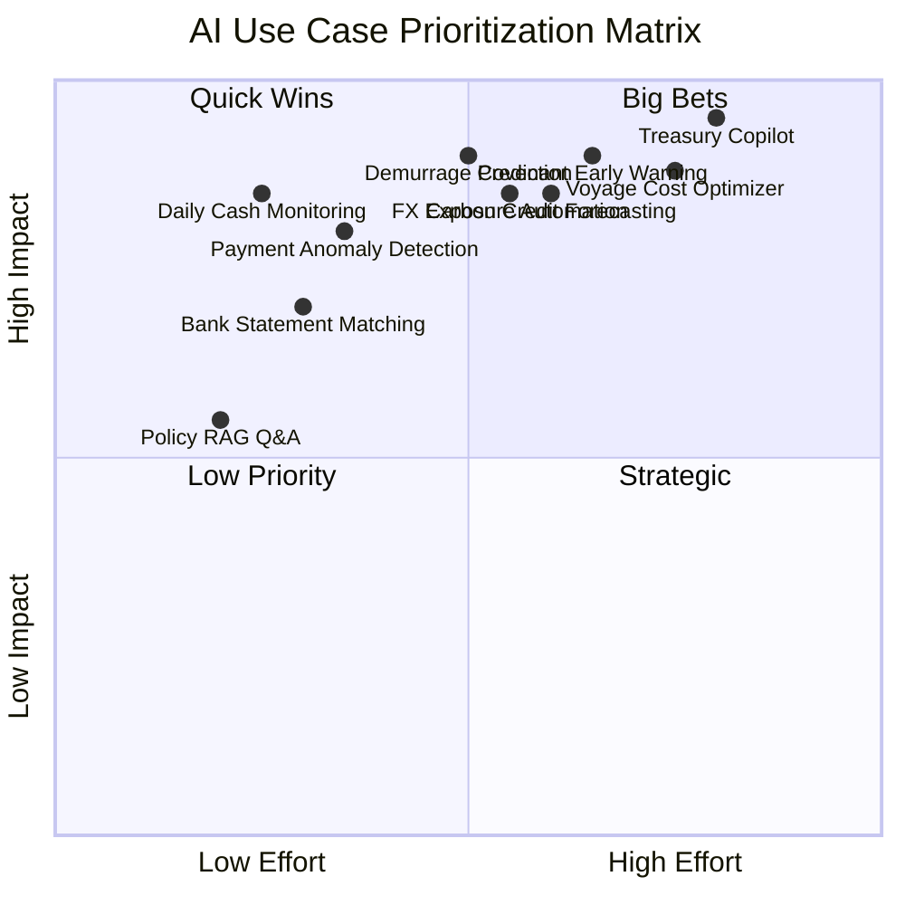
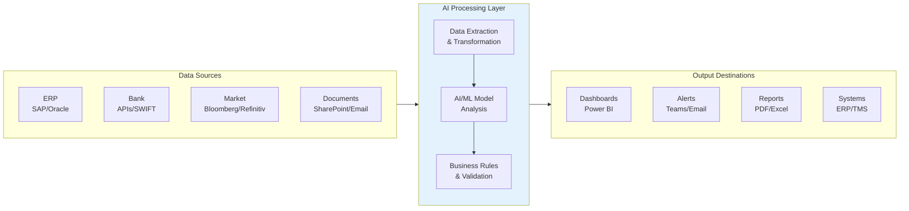
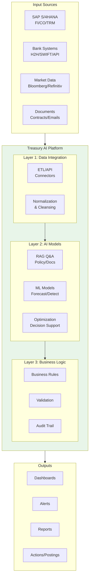
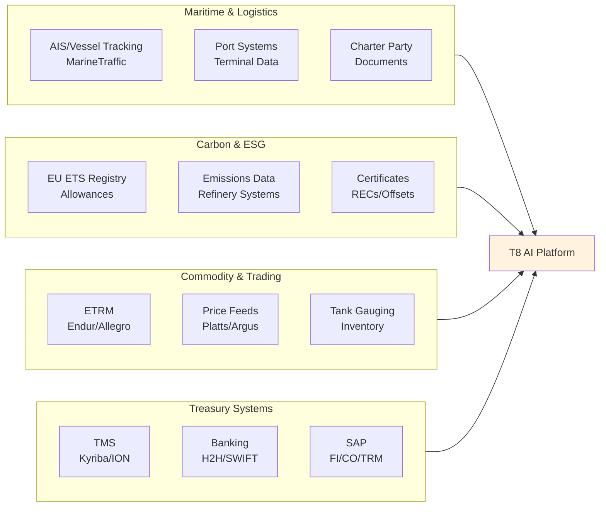
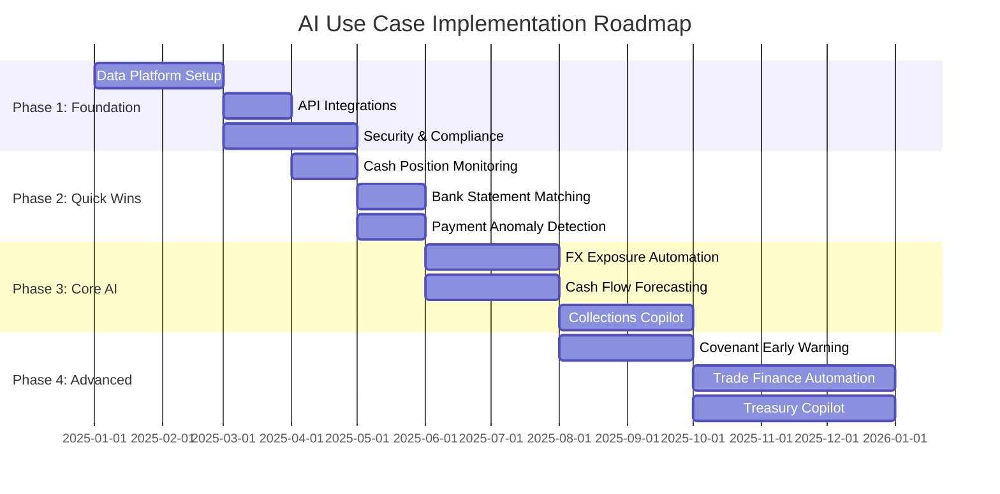
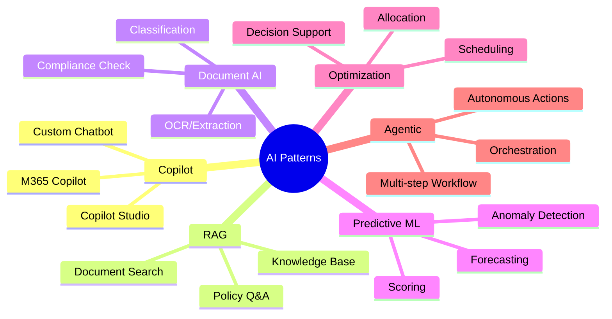

# AI Use Case Assessment - Visual Templates

This document provides visual templates for prioritizing and documenting AI use cases in Oil & Gas Treasury.

---

## 1. Priority Matrix (Impact vs Effort)

### Quadrant Chart



### Example Priority Matrix (T8 Use Cases)

```
                           HIGH IMPACT
                                │
    ┌───────────────────────────┼───────────────────────────┐
    │                           │                           │
    │      QUICK WINS           │        BIG BETS           │
    │      Do First             │        Plan Carefully     │
    │                           │                           │
    │  • Daily Cash Monitoring  │  • Demurrage Prediction   │
    │  • Bank Statement Match   │  • Carbon Credit Forecast │
    │  • Payment Anomaly Det.   │  • FX Exposure Automation │
    │  • Policy RAG Q&A         │  • Covenant Early Warning │
    │                           │  • Treasury Copilot       │
    │                           │  • Voyage Cost Optimizer  │
    │                           │                           │
────┼───────────────────────────┼───────────────────────────┼────
    │                           │                           │
    │      LOW PRIORITY         │        STRATEGIC          │
    │      Deprioritize         │        Long-term          │
    │                           │                           │
    │  • Basic report templates │  • Full CTRM integration  │
    │  • Static dashboards      │  • End-to-end automation  │
    │                           │                           │
    └───────────────────────────┼───────────────────────────┘
                                │
                           LOW IMPACT
         LOW EFFORT ────────────┼──────────── HIGH EFFORT
```

### Quadrant Definitions

| Quadrant | Impact | Effort | Strategy |
|----------|--------|--------|----------|
| **Quick Wins** | High | Low | Do First - Immediate value with minimal investment |
| **Big Bets** | High | High | Plan Carefully - High reward but requires significant resources |
| **Low Priority** | Low | Low | Deprioritize - Limited value, consider automation later |
| **Strategic** | Low | High | Long-term - May enable future capabilities |

### Priority Scoring Formula

```
Priority Score = (Impact Score × Confidence Score) / Effort Score

Where:
- Impact Score: 1-5 (weighted average of 8 dimensions)
- Effort Score: 1-5 (weighted average of 9 dimensions)
- Confidence Score: 1-5 (weighted average of 4 dimensions)
```

---

## 2. Data Architecture Diagrams

### Generic Data Flow Template



### Treasury-Specific Data Flow



### Refining-Specific Data Sources



---

## 3. Use Case Card Templates

### Standard Use Case Card

```
┌─────────────────────────────────────────────────────────────────────────────┐
│ USE CASE: [Name]                                           ID: [UC-XXX]     │
├─────────────────────────────────────────────────────────────────────────────┤
│ Area: [Treasury Area]                    AI Pattern: [Pattern Type]         │
│ Owner: [Business Owner]                  Tech Lead: [Technical Owner]       │
├─────────────────────────────────────────────────────────────────────────────┤
│                                                                             │
│ SCORES                                                                      │
│ ────────────────────────────────────────────────────────────────────────    │
│ Impact:     ●●●●○ (4/5)     Effort:     ●●●○○ (3/5)                        │
│ Confidence: ●●●●● (5/5)     Priority:   ████████░░ HIGH (8.5)              │
│                                                                             │
│ Quadrant: QUICK WIN                                                         │
│                                                                             │
├─────────────────────────────────────────────────────────────────────────────┤
│                                                                             │
│ PROBLEM STATEMENT                                                           │
│ ────────────────────────────────────────────────────────────────────────    │
│ [One paragraph describing the business problem and pain points]             │
│                                                                             │
├─────────────────────────────────────────────────────────────────────────────┤
│                                                                             │
│ PROPOSED AI SOLUTION                                                        │
│ ────────────────────────────────────────────────────────────────────────    │
│ [One paragraph describing how AI will solve the problem]                    │
│                                                                             │
├─────────────────────────────────────────────────────────────────────────────┤
│                                                                             │
│ DATA ARCHITECTURE                                                           │
│ ────────────────────────────────────────────────────────────────────────    │
│                                                                             │
│ Data Sources:              AI Processing:          Outputs:                 │
│ ┌────────────────┐        ┌──────────────┐        ┌──────────────┐         │
│ │ • SAP FI/CO    │───────►│ • Extract    │───────►│ • Dashboard  │         │
│ │ • Bank API     │        │ • ML Model   │        │ • Alerts     │         │
│ │ • Market Data  │        │ • Rules      │        │ • Reports    │         │
│ └────────────────┘        └──────────────┘        └──────────────┘         │
│                                                                             │
├─────────────────────────────────────────────────────────────────────────────┤
│                                                                             │
│ KPI & BENEFITS                                                              │
│ ────────────────────────────────────────────────────────────────────────    │
│                                                                             │
│ Primary KPI:        [Metric name]                                           │
│ Baseline:           [Current value]                                         │
│ Target:             [Target value]                                          │
│ Est. Annual Benefit: [Currency amount]                                      │
│ Benefit Type:       [Cost reduction / Risk reduction / etc.]                │
│                                                                             │
├─────────────────────────────────────────────────────────────────────────────┤
│                                                                             │
│ COMPLIANCE & TECHNICAL                                                      │
│ ────────────────────────────────────────────────────────────────────────    │
│                                                                             │
│ Data Classification: [Confidential]     PII Present: [Yes/No]               │
│ Auditability:        [Required]         Human-in-loop: [Yes/No]             │
│ Integration:         [API/Batch/RPA]    Complexity: [Low/Med/High]          │
│                                                                             │
├─────────────────────────────────────────────────────────────────────────────┤
│                                                                             │
│ DEPENDENCIES & NEXT STEPS                                                   │
│ ────────────────────────────────────────────────────────────────────────    │
│                                                                             │
│ Dependencies:                                                               │
│ • [Dependency 1]                                                            │
│ • [Dependency 2]                                                            │
│                                                                             │
│ Next Steps:                                                                 │
│ □ [Action 1]                                                                │
│ □ [Action 2]                                                                │
│                                                                             │
└─────────────────────────────────────────────────────────────────────────────┘
```

### Compact Use Case Card (One-Pager)

```
┌────────────────────────────────────────────────────────────┐
│ [UC-001] Daily Cash Position Monitoring                    │
├────────────────────────────────────────────────────────────┤
│ Area: Treasury ALM          Pattern: Anomaly Detection     │
│ Impact: ●●●●○  Effort: ●●○○○  Confidence: ●●●●●           │
│ PRIORITY: HIGH (8.5) - QUICK WIN                           │
├────────────────────────────────────────────────────────────┤
│ Problem: Manual cash visibility delayed; anomalies missed  │
│ Solution: Auto-assemble positions, flag anomalies by 9am   │
├────────────────────────────────────────────────────────────┤
│ Sources: SAP, Bank API    →  Outputs: Power BI, Alerts     │
│ KPI: Cash visible by 9am  →  Target: 100% (from 60%)       │
│ Benefit: $500K/yr (working capital improvement)            │
└────────────────────────────────────────────────────────────┘
```

---

## 4. Scoring Rubrics

### Impact Scoring (1-5 Scale)

| Score | Label | Financial Value | Strategic Significance |
|-------|-------|-----------------|------------------------|
| **5** | Transformational | >$10M annual benefit | Competitive advantage, new capability |
| **4** | High | $2M-10M annual benefit | Strategic enabler, significant efficiency |
| **3** | Moderate | $500K-2M annual benefit | Good ROI, measurable improvement |
| **2** | Low | $100K-500K annual benefit | Limited scope, incremental improvement |
| **1** | Marginal | <$100K annual benefit | Nice-to-have, minimal impact |

### Effort Scoring (1-5 Scale)

| Score | Label | Duration | Complexity |
|-------|-------|----------|------------|
| **5** | Major | >6 months | Enterprise-wide change, multiple systems, heavy training |
| **4** | High | 3-6 months | Multiple integrations, process change, significant testing |
| **3** | Moderate | 1-3 months | Some process change, 2-3 integrations |
| **2** | Low | 2-4 weeks | 1-2 integrations, minimal process change |
| **1** | Trivial | <2 weeks | Single system, no process change, simple config |

### Confidence Scoring (1-5 Scale)

| Score | Label | Criteria |
|-------|-------|----------|
| **5** | Very High | Problem crystal clear, stakeholders aligned, data ready, proven technology |
| **4** | High | Good understanding, most stakeholders aligned, data mostly ready |
| **3** | Moderate | Some ambiguity, key stakeholders engaged, data gaps identified |
| **2** | Low | Unclear requirements, limited buy-in, significant data gaps |
| **1** | Very Low | Undefined problem, no stakeholder alignment, no data |

---

## 5. Implementation Roadmap Template



---

## 6. Data Source Inventory

### Core Treasury Systems

| System | Type | Data | Integration | Classification |
|--------|------|------|-------------|----------------|
| SAP S/4HANA | ERP | GL, AR, AP, Cash | API/RFC | Confidential |
| Kyriba | TMS | Positions, Hedges | API | Confidential |
| Bloomberg | Market | FX, Rates, Commodities | API | Internal |
| Bank H2H | Banking | Statements, Payments | SWIFT/EBICS | Highly Confidential |

### Refining-Specific Systems

| System | Type | Data | Integration | Classification |
|--------|------|------|-------------|----------------|
| MarineTraffic | AIS | Vessel positions, ETA | API | Internal |
| EU ETS Registry | Regulatory | Carbon allowances | API/File | Confidential |
| Platts/Argus | Pricing | Oil, Products, Bunker | API | Internal |
| ETRM (Endur) | Trading | Trades, Positions | API | Confidential |
| Tank Gauging | Operations | Inventory levels | API/OPC | Confidential |

---

## 7. AI Pattern Reference



| Pattern | Best For | Complexity | Examples |
|---------|----------|------------|----------|
| **M365 Copilot** | Document assistance, summaries | Low | Weekly bulletin, meeting notes |
| **RAG Q&A** | Policy queries, knowledge access | Medium | Treasury policy bot, compliance Q&A |
| **Document Intelligence** | Form extraction, validation | Medium | LC processing, invoice matching |
| **Anomaly Detection** | Monitoring, fraud detection | Medium | Payment screening, reconciliation |
| **Forecasting** | Prediction, planning | High | Cash forecast, FX exposure |
| **Optimization** | Resource allocation, decisions | High | Hedge optimization, payment timing |
| **Agentic Workflow** | Multi-step automation | Very High | End-to-end processes, copilots |

---

## Appendix: Visual Assets Checklist

- [ ] Priority matrix with actual use cases plotted
- [ ] Data architecture diagram for each high-priority use case
- [ ] Use case cards for top 10 priorities
- [ ] Implementation roadmap with dates
- [ ] Data source inventory complete
- [ ] Stakeholder presentation deck
